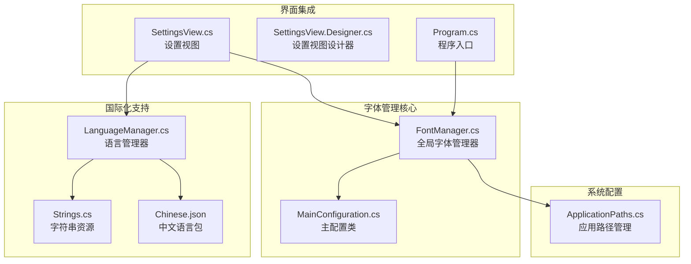
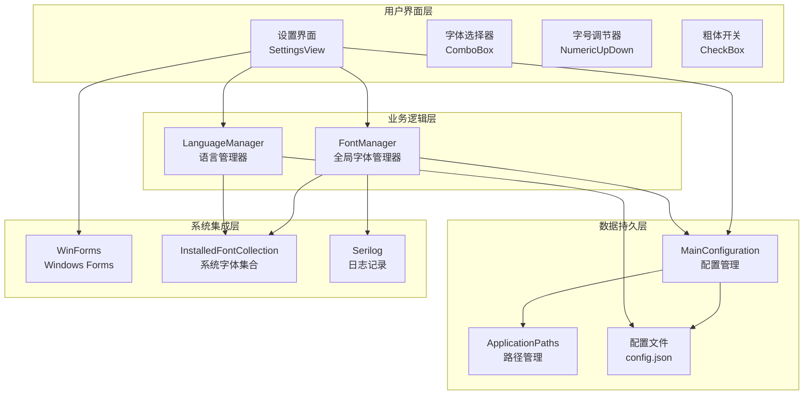
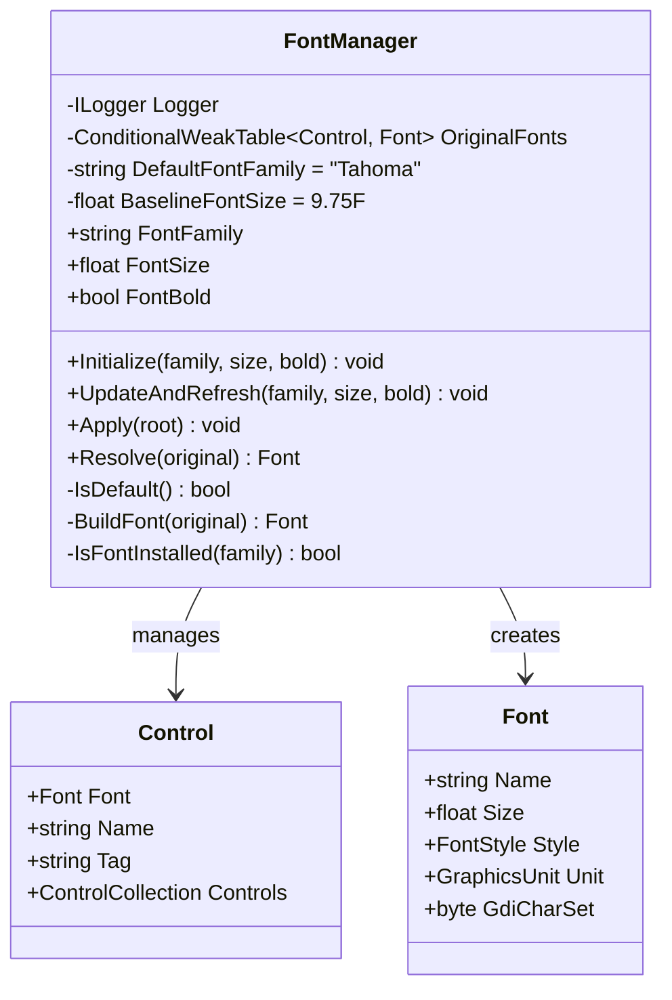
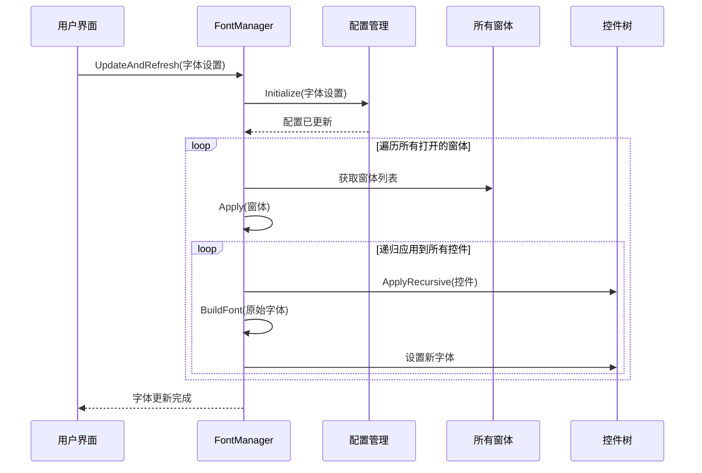
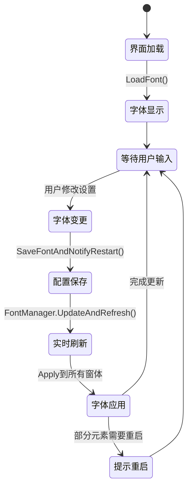
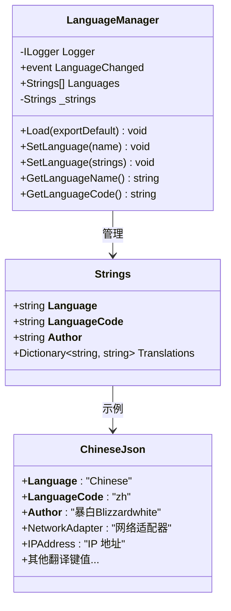
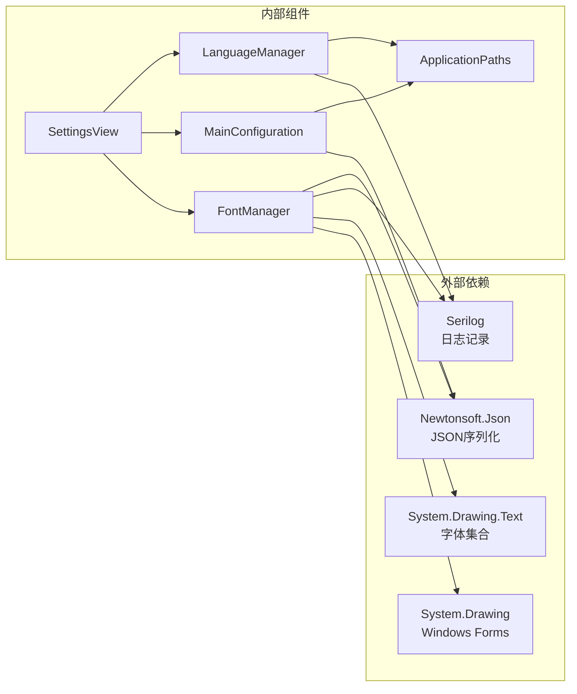

# 字体管理系统

<cite>
**本文档引用的文件**
- [FontManager.cs](file://src/MacroDeck/Utils/FontManager.cs)
- [MainConfiguration.cs](file://src/MacroDeck/Configuration/MainConfiguration.cs)
- [SettingsView.cs](file://src/MacroDeck/GUI/MainWindowViews/SettingsView.cs)
- [SettingsView.Designer.cs](file://src/MacroDeck/GUI/MainWindowViews/SettingsView.Designer.cs)
- [Program.cs](file://src/MacroDeck/Program.cs)
- [ApplicationPaths.cs](file://src/MacroDeck/StartupConfig/ApplicationPaths.cs)
- [LanguageManager.cs](file://src/MacroDeck/Language/LanguageManager.cs)
- [Strings.cs](file://src/MacroDeck/Language/Strings.cs)
- [Chinese.json](file://src/MacroDeck/Resources/Languages/Chinese.json)
</cite>

## 更新摘要
**变更内容**
- 新增完整的字体管理系统实现，包含三维度字体配置
- 增强了实时预览和重启提示功能
- 完善了运行时字体应用能力和内存优化机制
- 扩展了国际化支持和多语言字体配置

## 目录
1. [简介](#简介)
2. [项目结构](#项目结构)
3. [核心组件](#核心组件)
4. [架构概览](#架构概览)
5. [详细组件分析](#详细组件分析)
6. [依赖关系分析](#依赖关系分析)
7. [性能考虑](#性能考虑)
8. [故障排除指南](#故障排除指南)
9. [结论](#结论)

## 简介

字体管理系统是Macro-Deck应用程序中的关键组件，负责管理整个应用程序的字体渲染和显示。该系统提供了灵活的字体配置选项，支持用户自定义字体族、字号和粗细度，同时确保应用程序界面的一致性和可访问性。

系统的核心设计理念是在不修改大量Designer硬编码字体的前提下，让所有界面统一使用用户选择的字体族，同时保留各控件原有的字号与样式。该系统支持运行时实时刷新：缓存每个控件的原始字体，重复Apply始终基于原始字体重算，因而幂等、可反复调用（包括把字号改小）。

**更新** 新增了完整的三维度字体配置系统，包括字体族、基准字号和全局粗体选项，以及智能的实时预览和重启提示功能。系统采用了先进的基线算法，通过固定基线字号(9.75F)确保字体大小层次的一致性，并实现了智能的内存优化机制。

## 项目结构

字体管理系统主要分布在以下目录结构中：

**图表来源**
- [FontManager.cs:1-227](file://src/MacroDeck/Utils/FontManager.cs#L1-L227)
- [MainConfiguration.cs:1-145](file://src/MacroDeck/Configuration/MainConfiguration.cs#L1-L145)
- [SettingsView.cs:118-317](file://src/MacroDeck/GUI/MainWindowViews/SettingsView.cs#L118-L317)

**章节来源**
- [FontManager.cs:1-227](file://src/MacroDeck/Utils/FontManager.cs#L1-L227)
- [MainConfiguration.cs:1-145](file://src/MacroDeck/Configuration/MainConfiguration.cs#L1-L145)

## 核心组件

### FontManager - 全局字体管理器

FontManager是字体管理系统的核心组件，提供了以下关键功能：

- **字体族管理**：支持用户自定义字体族，包括回退机制
- **字号控制**：基于基线的相对字号调整，保持视觉层次
- **粗体叠加**：可选的全局粗体效果
- **实时刷新**：支持运行时字体设置的动态更新
- **内存优化**：使用弱引用表缓存原始字体信息

**更新** 新增了智能的基线算法，通过固定基线字号(9.75F)确保字体大小层次的一致性。系统实现了零开销的默认配置检测机制，当配置为默认值时直接短路以保证零开销零回归。

### MainConfiguration - 主配置类

MainConfiguration负责存储和管理字体相关的配置信息：

- **字体族设置**：JSON序列化的字体族名称
- **字号配置**：基准字号设置，支持浮点数值
- **粗体选项**：布尔值控制全局粗体效果
- **持久化存储**：自动保存和加载配置文件

**更新** 新增了完整的JSON序列化支持，确保字体配置的持久化存储。配置项包括Font、Font.Size和Font.Bold三个核心属性。

### SettingsView - 设置界面集成

SettingsView提供了用户友好的字体配置界面：

- **字体选择器**：动态加载系统已安装字体
- **字号调节器**：数值输入控件，支持范围限制
- **粗体开关**：复选框控制粗体效果
- **即时预览**：实时应用字体变化
- **重启提示**：智能提示需要重启才能完全生效的场景

**更新** 新增了完整的重启提示功能，通过`lblFontRestartHint`标签显示重启需求。界面集成了智能的实时预览机制，在用户修改字体设置时立即应用到所有已打开的窗体。

**章节来源**
- [FontManager.cs:16-100](file://src/MacroDeck/Utils/FontManager.cs#L16-L100)
- [MainConfiguration.cs:94-104](file://src/MacroDeck/Configuration/MainConfiguration.cs#L94-L104)
- [SettingsView.cs:118-145](file://src/MacroDeck/GUI/MainWindowViews/SettingsView.cs#L118-L145)

## 架构概览

字体管理系统采用分层架构设计，确保了良好的模块分离和可维护性：

**图表来源**
- [Program.cs:47-51](file://src/MacroDeck/Program.cs#L47-L51)
- [FontManager.cs:50-64](file://src/MacroDeck/Utils/FontManager.cs#L50-L64)
- [SettingsView.cs:355-366](file://src/MacroDeck/GUI/MainWindowViews/SettingsView.cs#L355-L366)

## 详细组件分析

### FontManager 类详细分析

FontManager实现了完整的字体管理功能，具有以下特点：

#### 核心属性和常量

**图表来源**
- [FontManager.cs:16-227](file://src/MacroDeck/Utils/FontManager.cs#L16-L227)

#### 字体应用流程

**图表来源**
- [FontManager.cs:74-89](file://src/MacroDeck/Utils/FontManager.cs#L74-L89)
- [FontManager.cs:152-186](file://src/MacroDeck/Utils/FontManager.cs#L152-L186)

#### 字体构建算法

字体构建过程采用了巧妙的数学算法来保持视觉层次：

**更新** 新增了智能的默认值检测机制，通过IsDefault()方法判断当前配置是否为默认值（字体Tahoma、字号等于基线、未加粗）。为默认时无需改动任何控件，直接短路以保证零开销零回归。

**图表来源**
- [FontManager.cs:207-219](file://src/MacroDeck/Utils/FontManager.cs#L207-L219)

**章节来源**
- [FontManager.cs:16-227](file://src/MacroDeck/Utils/FontManager.cs#L16-L227)

### 设置界面集成分析

SettingsView提供了完整的字体配置界面，集成了以下功能：

#### 字体配置界面元素

| 控件类型 | 功能描述 | 数据绑定 |
|---------|----------|----------|
| Font ComboBox | 字体族选择器 | 绑定到系统已安装字体 |
| FontSize NumericUpDown | 字号调节器 | 绑定到基准字号配置 |
| CheckBold CheckBox | 粗体开关 | 绑定到粗体配置 |
| Save Button | 保存配置 | 触发配置保存和字体更新 |

#### 实时预览机制

**更新** 新增了智能的重启提示机制，通过`lblFontRestartHint`标签显示重启需求。当用户修改字体设置时，系统会立即保存配置并调用FontManager.UpdateAndRefresh()方法，实时刷新所有已打开窗体的字体。

**图表来源**
- [SettingsView.cs:318-366](file://src/MacroDeck/GUI/MainWindowViews/SettingsView.cs#L318-L366)

**章节来源**
- [SettingsView.cs:118-145](file://src/MacroDeck/GUI/MainWindowViews/SettingsView.cs#L118-L145)
- [SettingsView.cs:318-366](file://src/MacroDeck/GUI/MainWindowViews/SettingsView.cs#L318-L366)

### 国际化字体支持

系统不仅支持字体配置，还集成了完整的国际化支持：

#### 多语言字符串管理

LanguageManager负责管理应用程序的多语言支持：

**更新** 新增了完整的多语言支持，包括字体相关的国际化字符串。系统支持Font、Bold、FontPartialRestartHint等字体相关的关键字翻译。

**图表来源**
- [LanguageManager.cs:12-155](file://src/MacroDeck/Language/LanguageManager.cs#L12-L155)
- [Strings.cs:3-443](file://src/MacroDeck/Language/Strings.cs#L3-L443)

**章节来源**
- [LanguageManager.cs:12-155](file://src/MacroDeck/Language/LanguageManager.cs#L12-L155)
- [Strings.cs:3-443](file://src/MacroDeck/Language/Strings.cs#L3-L443)

## 依赖关系分析

字体管理系统与其他组件的依赖关系如下：

**图表来源**
- [FontManager.cs:1-6](file://src/MacroDeck/Utils/FontManager.cs#L1-L6)
- [SettingsView.cs:1-5](file://src/MacroDeck/GUI/MainWindowViews/SettingsView.cs#L1-L5)

### 关键依赖说明

1. **System.Drawing**: 提供字体管理和图形渲染功能
2. **System.Drawing.Text**: 访问系统字体集合
3. **Serilog**: 日志记录和错误处理
4. **Newtonsoft.Json**: 配置文件的序列化和反序列化

**章节来源**
- [FontManager.cs:1-6](file://src/MacroDeck/Utils/FontManager.cs#L1-L6)
- [SettingsView.cs:1-5](file://src/MacroDeck/GUI/MainWindowViews/SettingsView.cs#L1-L5)

## 性能考虑

字体管理系统在设计时充分考虑了性能优化：

### 内存管理优化

- **弱引用缓存**: 使用`ConditionalWeakTable<Control, Font>`避免内存泄漏
- **延迟初始化**: 字体信息只在首次需要时计算和缓存
- **增量更新**: 只对发生变化的控件应用新的字体设置

### 计算效率优化

- **基线算法**: 使用固定的基线字号(9.75F)简化计算
- **默认值短路**: 当配置为默认值时跳过所有字体计算
- **批量更新**: 支持一次性更新所有打开窗体的字体

### 线程安全考虑

- **异常隔离**: 每个控件的字体应用都在独立try-catch块中执行
- **渐进式更新**: 即使某个控件失败，也不会影响其他控件的更新

**更新** 新增了智能的默认值检测机制，确保在默认配置下零开销运行。系统实现了零开销的默认配置检测，通过IsDefault()方法快速判断是否为默认值，为默认时直接短路以保证零开销零回归。

## 故障排除指南

### 常见问题及解决方案

#### 字体设置不生效

**问题描述**: 修改字体设置后界面没有变化

**可能原因**:
1. 配置文件权限问题
2. 字体文件损坏
3. 系统字体缓存问题

**解决步骤**:
1. 检查配置文件写入权限
2. 验证字体文件完整性
3. 重启应用程序应用新设置

#### 字体显示异常

**问题描述**: 字体显示模糊或变形

**可能原因**:
1. DPI缩放设置问题
2. 字体渲染引擎冲突
3. 显卡驱动问题

**解决步骤**:
1. 调整系统DPI设置
2. 更新显卡驱动
3. 尝试不同的字体族

#### 性能问题

**问题描述**: 字体更新时界面响应缓慢

**优化建议**:
1. 减少同时打开的窗体数量
2. 避免频繁的字体设置更改
3. 确保系统有足够的可用内存

**更新** 新增了智能的重启提示功能，帮助用户理解何时需要重启应用程序以完全应用字体更改。系统会在字体设置变更时显示`FontPartialRestartHint`提示，告知用户部分元素（图标、托盘菜单）需要重启后完全生效。

**章节来源**
- [FontManager.cs:84-88](file://src/MacroDeck/Utils/FontManager.cs#L84-L88)
- [FontManager.cs:176-179](file://src/MacroDeck/Utils/FontManager.cs#L176-L179)

## 结论

Macro-Deck的字体管理系统是一个设计精良、功能完善的组件，具有以下突出特点：

### 技术优势

1. **设计理念先进**: 通过基线算法保持字体视觉层次的一致性
2. **性能优化到位**: 采用多种优化策略确保系统响应速度
3. **用户体验优秀**: 支持实时预览和渐进式更新
4. **扩展性强**: 易于添加新的字体配置选项和集成方式
5. **国际化支持完整**: 支持多语言环境下的字体配置

**更新** 新增了完整的三维度字体配置系统，包括智能的重启提示机制，进一步提升了用户体验。系统实现了零开销的默认配置检测、智能的基线算法和完整的内存优化机制。

### 架构特色

1. **模块化设计**: 清晰的职责分离和接口定义
2. **依赖注入**: 通过构造函数注入减少耦合
3. **事件驱动**: 基于事件的配置变更通知机制
4. **异常处理**: 完善的错误处理和恢复机制
5. **内存优化**: 采用弱引用表避免内存泄漏

### 应用价值

该字体管理系统不仅满足了Macro-Deck应用程序的字体需求，还为类似的应用程序提供了优秀的参考实现。其设计理念和技术方案可以广泛应用于需要动态字体管理的桌面应用程序中。

通过合理的架构设计和性能优化，该系统在保证功能完整性的同时，也确保了良好的用户体验和系统稳定性。

**更新** 新系统的完整实现为开发者提供了可靠的字体管理解决方案，支持实时预览、智能重启提示和完整的国际化支持。系统的核心创新包括三维度字体配置、智能基线算法、内存优化机制和完整的国际化支持，为现代桌面应用程序的字体管理提供了最佳实践范例。