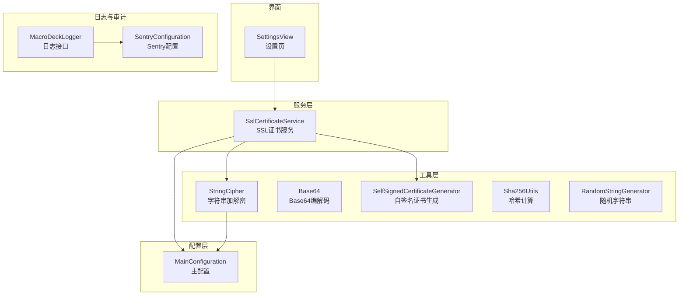
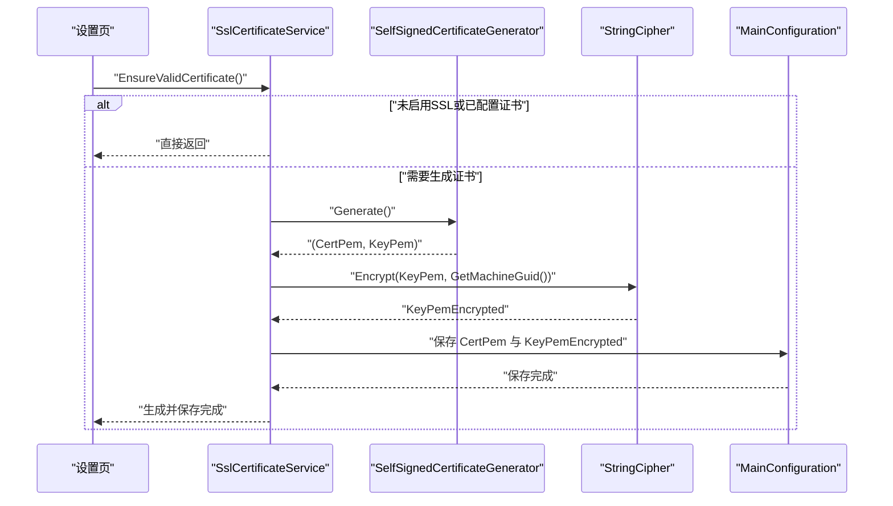
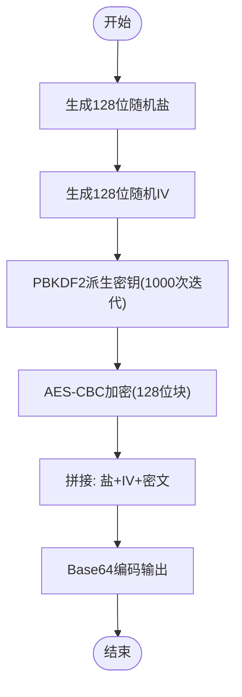
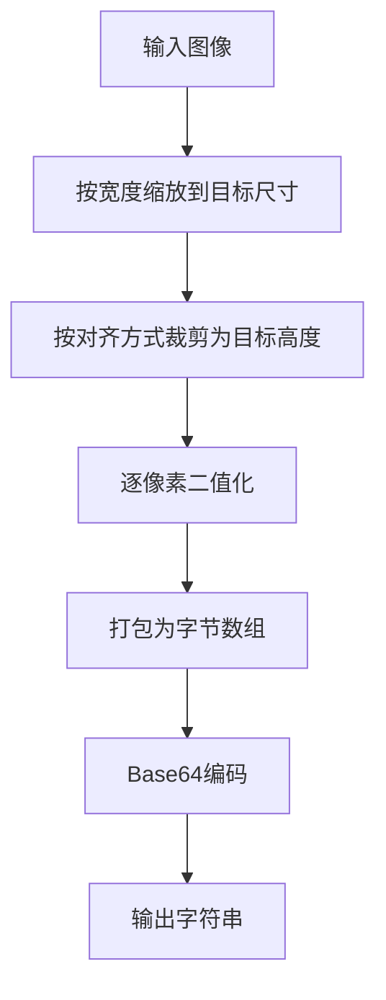
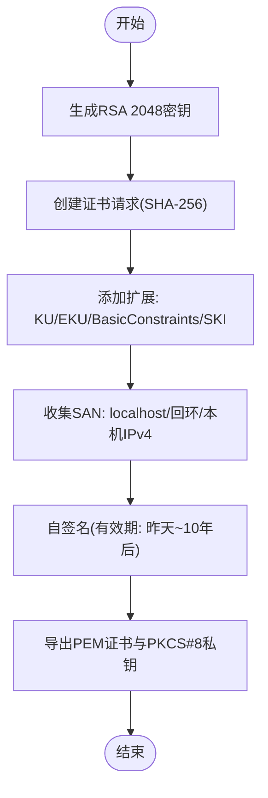
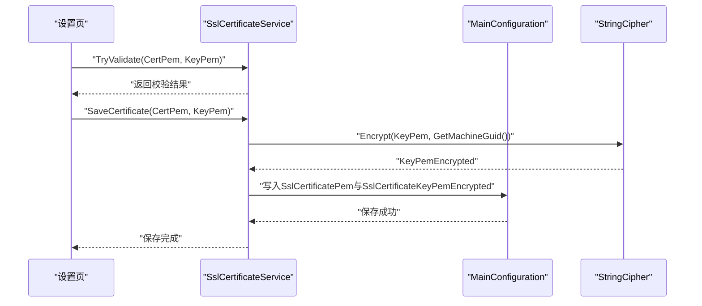
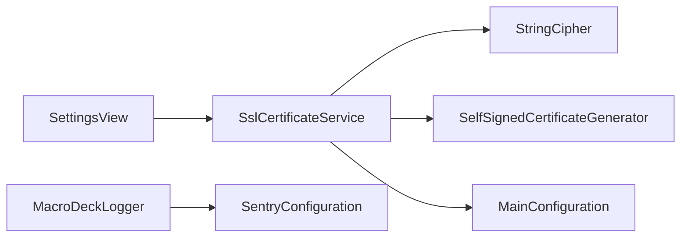

# 安全工具

<cite>
**本文引用的文件**
- [StringCipher.cs](file://src/MacroDeck/Utils/StringCipher.cs)
- [Base64.cs](file://src/MacroDeck/Utils/Base64.cs)
- [SelfSignedCertificateGenerator.cs](file://src/MacroDeck/Utils/SelfSignedCertificateGenerator.cs)
- [SslCertificateService.cs](file://src/MacroDeck/Services/SslCertificateService.cs)
- [MainConfiguration.cs](file://src/MacroDeck/Configuration/MainConfiguration.cs)
- [StringCipherTest.cs](file://tests/MacroDeck.Tests/StringCipherTest.cs)
- [MacroDeckLogger.cs](file://src/MacroDeck/Logging/MacroDeckLogger.cs)
- [SentryConfiguration.cs](file://src/MacroDeck/Logging/SentryConfiguration.cs)
- [Sha256Utils.cs](file://src/MacroDeck/Utils/Sha256Utils.cs)
- [RandomStringGenerator.cs](file://src/MacroDeck/Utils/RandomStringGenerator.cs)
- [SettingsView.cs](file://src/MacroDeck/GUI/MainWindowViews/SettingsView.cs)
- [SettingsView.Designer.cs](file://src/MacroDeck/GUI/MainWindowViews/SettingsView.Designer.cs)
</cite>

## 目录
1. [简介](#简介)
2. [项目结构](#项目结构)
3. [核心组件](#核心组件)
4. [架构总览](#架构总览)
5. [详细组件分析](#详细组件分析)
6. [依赖关系分析](#依赖关系分析)
7. [性能考量](#性能考量)
8. [故障排查指南](#故障排查指南)
9. [结论](#结论)
10. [附录](#附录)

## 简介
本文件系统化梳理 Macro-Deck 的安全工具与机制，覆盖以下方面：
- 字符串加密/解密：基于 PBKDF2 派生密钥与对称加密，结合随机盐值与初始化向量，确保机密性与完整性。
- Base64 编码：图像与二进制数据的编码/解码，支持容错处理与格式转换。
- 自签名证书生成：RSA 2048 位密钥，构建符合 TLS 使用的自签名证书，并自动注入 SAN（本地回环与本机 IP）。
- SSL 证书管理：证书与私钥的加载、校验、保存与自动补全；私钥以主机唯一标识加密存储。
- 数字签名与身份验证：通过证书链与密钥匹配进行服务端身份验证；客户端可选择信任策略。
- 审计与合规：统一日志接口与敏感信息脱敏，错误报告发送策略与最小化 PII 收集。
- 性能与风险：算法强度、密钥管理与运行时开销评估，以及常见安全风险与缓解建议。

## 项目结构
安全相关代码主要分布在以下模块：
- 工具层（Utils）：字符串加解密、Base64 编码、SHA-256 哈希、随机字符串生成、自签名证书生成。
- 服务层（Services）：SSL 证书服务，负责证书存在性保障、加载、校验与保存。
- 配置层（Configuration）：主配置对象，持久化 SSL 开关、证书与加密后的私钥。
- 日志与审计（Logging）：统一日志接口与 Sentry 上报配置，含敏感信息脱敏。
- 界面（GUI）：设置页中提供 SSL 配置应用与证书生成入口。

**图表来源**
- [SslCertificateService.cs:1-91](file://src/MacroDeck/Services/SslCertificateService.cs#L1-L91)
- [StringCipher.cs:1-100](file://src/MacroDeck/Utils/StringCipher.cs#L1-L100)
- [SelfSignedCertificateGenerator.cs:1-66](file://src/MacroDeck/Utils/SelfSignedCertificateGenerator.cs#L1-L66)
- [MainConfiguration.cs:1-103](file://src/MacroDeck/Configuration/MainConfiguration.cs#L1-L103)
- [SettingsView.cs:332-366](file://src/MacroDeck/GUI/MainWindowViews/SettingsView.cs#L332-L366)
- [MacroDeckLogger.cs:1-361](file://src/MacroDeck/Logging/MacroDeckLogger.cs#L1-L361)
- [SentryConfiguration.cs:1-138](file://src/MacroDeck/Logging/SentryConfiguration.cs#L1-L138)

**章节来源**
- [SslCertificateService.cs:1-91](file://src/MacroDeck/Services/SslCertificateService.cs#L1-L91)
- [StringCipher.cs:1-100](file://src/MacroDeck/Utils/StringCipher.cs#L1-L100)
- [SelfSignedCertificateGenerator.cs:1-66](file://src/MacroDeck/Utils/SelfSignedCertificateGenerator.cs#L1-L66)
- [MainConfiguration.cs:1-103](file://src/MacroDeck/Configuration/MainConfiguration.cs#L1-L103)
- [SettingsView.cs:332-366](file://src/MacroDeck/GUI/MainWindowViews/SettingsView.cs#L332-L366)
- [MacroDeckLogger.cs:1-361](file://src/MacroDeck/Logging/MacroDeckLogger.cs#L1-L361)
- [SentryConfiguration.cs:1-138](file://src/MacroDeck/Logging/SentryConfiguration.cs#L1-L138)

## 核心组件
- 字符串加密解密（PBKDF2 + 对称加密）
  - 密钥长度与模式：固定 128 位密钥长度，Rijndael（AES）块大小 128 位，CBC 模式，PKCS7 填充。
  - 盐与 IV：每次加密生成 128 位随机盐与 IV，并与密文一起 Base64 存储。
  - 迭代次数：PBKDF2 使用 1000 次迭代派生密钥。
  - 主机唯一标识：私钥加密使用 Windows 注册表中的 MachineGuid 作为口令派生基础。
- Base64 编码与解码
  - 图像到 Base64：支持缩放、裁剪与二值化，输出 Base64 字符串。
  - Base64 到图像：容错处理，自动补齐填充字符，异常返回空对象。
  - 图像到 Base64：PNG 转存以避免 GDI+ 错误。
- 自签名证书生成
  - RSA 2048 位密钥，SHA-256 签名，扩展包含数字签名与密钥加密用途、服务器认证增强用途、基本约束与 SKI。
  - SAN 包含 localhost、IPv4/IPv6 回环地址及本机所有活动网络接口的 IPv4 地址。
  - 有效期：昨天至 10 年后。
- SSL 证书服务
  - 自动补全：若未配置证书或加密私钥，则自动生成并保存。
  - 加载流程：从配置读取 PEM 与加密私钥，用主机 MachineGuid 解密私钥，组合为 X509Certificate2 并导出 PFX 加载。
  - 校验：输入 PEM 与私钥进行匹配校验，失败返回错误消息。
  - 应用：设置页提供“应用 SSL 配置”按钮，支持手动导入与启用。
- 日志与审计
  - 统一日志接口：按级别写入，支持插件上下文与异常模板。
  - Sentry：仅上报宏命令命名空间事件，禁用默认 PII，发送前对路径与用户名进行脱敏。

**章节来源**
- [StringCipher.cs:11-14](file://src/MacroDeck/Utils/StringCipher.cs#L11-L14)
- [StringCipher.cs:25-28](file://src/MacroDeck/Utils/StringCipher.cs#L25-L28)
- [StringCipher.cs:23-24](file://src/MacroDeck/Utils/StringCipher.cs#L23-L24)
- [StringCipher.cs:78-98](file://src/MacroDeck/Utils/StringCipher.cs#L78-L98)
- [Base64.cs:9-98](file://src/MacroDeck/Utils/Base64.cs#L9-L98)
- [Base64.cs:100-127](file://src/MacroDeck/Utils/Base64.cs#L100-L127)
- [Base64.cs:129-167](file://src/MacroDeck/Utils/Base64.cs#L129-L167)
- [SelfSignedCertificateGenerator.cs:13-18](file://src/MacroDeck/Utils/SelfSignedCertificateGenerator.cs#L13-L18)
- [SelfSignedCertificateGenerator.cs:21-27](file://src/MacroDeck/Utils/SelfSignedCertificateGenerator.cs#L21-L27)
- [SelfSignedCertificateGenerator.cs:36-57](file://src/MacroDeck/Utils/SelfSignedCertificateGenerator.cs#L36-L57)
- [SslCertificateService.cs:12-29](file://src/MacroDeck/Services/SslCertificateService.cs#L12-L29)
- [SslCertificateService.cs:31-54](file://src/MacroDeck/Services/SslCertificateService.cs#L31-L54)
- [SslCertificateService.cs:56-81](file://src/MacroDeck/Services/SslCertificateService.cs#L56-L81)
- [SslCertificateService.cs:83-89](file://src/MacroDeck/Services/SslCertificateService.cs#L83-L89)
- [SettingsView.cs:332-366](file://src/MacroDeck/GUI/MainWindowViews/SettingsView.cs#L332-L366)
- [MacroDeckLogger.cs:64-77](file://src/MacroDeck/Logging/MacroDeckLogger.cs#L64-L77)
- [SentryConfiguration.cs:38-56](file://src/MacroDeck/Logging/SentryConfiguration.cs#L38-L56)
- [SentryConfiguration.cs:118-136](file://src/MacroDeck/Logging/SentryConfiguration.cs#L118-L136)

## 架构总览
下图展示 SSL 证书生命周期与各组件交互：

**图表来源**
- [SslCertificateService.cs:12-29](file://src/MacroDeck/Services/SslCertificateService.cs#L12-L29)
- [SelfSignedCertificateGenerator.cs:11-64](file://src/MacroDeck/Utils/SelfSignedCertificateGenerator.cs#L11-L64)
- [StringCipher.cs:16-40](file://src/MacroDeck/Utils/StringCipher.cs#L16-L40)
- [MainConfiguration.cs:77-101](file://src/MacroDeck/Configuration/MainConfiguration.cs#L77-L101)

## 详细组件分析

### 字符串加密解密（StringCipher）
- 算法与参数
  - PBKDF2：使用 1000 次迭代，派生 128 位密钥材料。
  - 对称加密：Rijndael（AES），块大小 128 位，CBC 模式，PKCS7 填充。
  - 盐与 IV：每次加密生成 16 字节随机盐与 16 字节 IV，拼接在密文前。
  - 输出：Base64 编码的“盐+IV+密文”。
- 密钥管理
  - 私钥加密使用主机 MachineGuid 作为口令派生基础，确保同一台机器上解密可用。
- 复杂度
  - 时间复杂度近似 O(n)，n 为明文字节数；内存占用与 n 成正比。
- 安全要点
  - 盐与 IV 每次随机，防止重放与统计分析。
  - 使用 PBKDF2 抵抗弱口令暴力破解。
  - 注意：RijndaelManaged 在新框架中可能被标记为过时，建议迁移到 AesManaged 或 System.Security.Cryptography 的 AES 实现。

**图表来源**
- [StringCipher.cs:16-41](file://src/MacroDeck/Utils/StringCipher.cs#L16-L41)
- [StringCipher.cs:69-76](file://src/MacroDeck/Utils/StringCipher.cs#L69-L76)

**章节来源**
- [StringCipher.cs:11-14](file://src/MacroDeck/Utils/StringCipher.cs#L11-L14)
- [StringCipher.cs:25-28](file://src/MacroDeck/Utils/StringCipher.cs#L25-L28)
- [StringCipher.cs:23-24](file://src/MacroDeck/Utils/StringCipher.cs#L23-L24)
- [StringCipher.cs:78-98](file://src/MacroDeck/Utils/StringCipher.cs#L78-L98)
- [StringCipherTest.cs:16-26](file://tests/MacroDeck.Tests/StringCipherTest.cs#L16-L26)

### Base64 工具（Base64）
- 功能
  - 图像到 Base64：按指定对齐方式裁剪并二值化，输出 Base64 字符串。
  - Base64 到图像：容错处理，自动补齐填充字符，异常返回空对象。
  - 图像到 Base64：非 GIF 格式转 PNG，避免 GDI+ 错误。
- 复杂度
  - 时间复杂度与像素数成正比；内存占用与图像尺寸线性相关。
- 最佳实践
  - 大图建议先缩放再编码，减少内存峰值。
  - 对外传输前检查 Base64 字符串长度与填充完整性。

**图表来源**
- [Base64.cs:9-98](file://src/MacroDeck/Utils/Base64.cs#L9-L98)

**章节来源**
- [Base64.cs:9-98](file://src/MacroDeck/Utils/Base64.cs#L9-L98)
- [Base64.cs:100-127](file://src/MacroDeck/Utils/Base64.cs#L100-L127)
- [Base64.cs:129-167](file://src/MacroDeck/Utils/Base64.cs#L129-L167)

### 自签名证书生成（SelfSignedCertificateGenerator）
- 参数
  - RSA 密钥：2048 位。
  - 签名算法：SHA-256。
  - 扩展：数字签名与密钥加密用途、服务器认证增强用途、基本约束、主题密钥标识。
  - SAN：localhost、IPv4/IPv6 回环、本机所有活动接口的 IPv4 地址。
  - 有效期：当前时间减一天至十年后。
- 复杂度
  - 生成证书与导出 PEM/PKCS#8 为主要开销，通常一次性操作。
- 最佳实践
  - 仅用于开发/内网环境；生产环境应使用受信 CA 签发的证书。
  - 将 SAN 范围限制在必要域名/IP，避免过度暴露。

**图表来源**
- [SelfSignedCertificateGenerator.cs:13-64](file://src/MacroDeck/Utils/SelfSignedCertificateGenerator.cs#L13-L64)

**章节来源**
- [SelfSignedCertificateGenerator.cs:11-64](file://src/MacroDeck/Utils/SelfSignedCertificateGenerator.cs#L11-L64)

### SSL 证书服务（SslCertificateService）
- 自动补全
  - 若启用 SSL 且未配置证书与加密私钥，则自动生成并保存。
- 加载与校验
  - 从配置读取 PEM 与加密私钥，用主机 MachineGuid 解密私钥，组合为 X509Certificate2 并导出 PFX 加载。
  - 提供 TryValidate 接口校验 PEM 与私钥是否匹配。
- 设置页集成
  - “应用 SSL 配置”按钮：校验输入，保存 PEM 与加密私钥；或仅保存 PEM。
  - “生成证书”按钮：触发自签名证书生成与保存。

**图表来源**
- [SslCertificateService.cs:56-89](file://src/MacroDeck/Services/SslCertificateService.cs#L56-L89)
- [StringCipher.cs:16-40](file://src/MacroDeck/Utils/StringCipher.cs#L16-L40)
- [MainConfiguration.cs:77-101](file://src/MacroDeck/Configuration/MainConfiguration.cs#L77-L101)

**章节来源**
- [SslCertificateService.cs:12-29](file://src/MacroDeck/Services/SslCertificateService.cs#L12-L29)
- [SslCertificateService.cs:31-54](file://src/MacroDeck/Services/SslCertificateService.cs#L31-L54)
- [SslCertificateService.cs:56-81](file://src/MacroDeck/Services/SslCertificateService.cs#L56-L81)
- [SslCertificateService.cs:83-89](file://src/MacroDeck/Services/SslCertificateService.cs#L83-L89)
- [SettingsView.cs:332-366](file://src/MacroDeck/GUI/MainWindowViews/SettingsView.cs#L332-L366)

### 主配置（MainConfiguration）
- 字段
  - EnableSsl：是否启用 SSL。
  - SslCertificatePem：证书 PEM 文本。
  - SslCertificateKeyPemEncrypted：加密后的私钥 PEM 文本。
- 持久化
  - Save/LoadFromFile：JSON 序列化与反序列化，异常时记录错误日志。

**章节来源**
- [MainConfiguration.cs:52-59](file://src/MacroDeck/Configuration/MainConfiguration.cs#L52-L59)
- [MainConfiguration.cs:77-101](file://src/MacroDeck/Configuration/MainConfiguration.cs#L77-L101)

### 日志与审计（MacroDeckLogger 与 SentryConfiguration）
- 日志接口
  - 提供多级写入方法，支持插件上下文与异常模板；统一通过 Serilog 输出。
- Sentry
  - 仅上报宏命令命名空间事件，禁用默认 PII；发送前对路径与用户名进行脱敏。
  - 可配置最小事件/面包屑级别，控制上报粒度。

**章节来源**
- [MacroDeckLogger.cs:64-77](file://src/MacroDeck/Logging/MacroDeckLogger.cs#L64-L77)
- [MacroDeckLogger.cs:318-331](file://src/MacroDeck/Logging/MacroDeckLogger.cs#L318-L331)
- [SentryConfiguration.cs:38-56](file://src/MacroDeck/Logging/SentryConfiguration.cs#L38-L56)
- [SentryConfiguration.cs:118-136](file://src/MacroDeck/Logging/SentryConfiguration.cs#L118-L136)

## 依赖关系分析
- 组件耦合
  - SslCertificateService 依赖 StringCipher（加密/解密）、SelfSignedCertificateGenerator（生成）、MainConfiguration（持久化）。
  - SettingsView 依赖 SslCertificateService 与 MainConfiguration，负责用户交互与配置应用。
  - 日志与审计通过 MacroDeckLogger 与 SentryConfiguration 统一出口。
- 外部依赖
  - System.Security.Cryptography：加密算法与证书处理。
  - Serilog/Sentry.Serilog：日志与错误上报。
- 循环依赖
  - 当前模块间无循环依赖，职责清晰。

**图表来源**
- [SslCertificateService.cs:1-91](file://src/MacroDeck/Services/SslCertificateService.cs#L1-L91)
- [StringCipher.cs:1-100](file://src/MacroDeck/Utils/StringCipher.cs#L1-L100)
- [SelfSignedCertificateGenerator.cs:1-66](file://src/MacroDeck/Utils/SelfSignedCertificateGenerator.cs#L1-L66)
- [MainConfiguration.cs:1-103](file://src/MacroDeck/Configuration/MainConfiguration.cs#L1-L103)
- [SettingsView.cs:332-366](file://src/MacroDeck/GUI/MainWindowViews/SettingsView.cs#L332-L366)
- [MacroDeckLogger.cs:1-361](file://src/MacroDeck/Logging/MacroDeckLogger.cs#L1-L361)
- [SentryConfiguration.cs:1-138](file://src/MacroDeck/Logging/SentryConfiguration.cs#L1-L138)

**章节来源**
- [SslCertificateService.cs:1-91](file://src/MacroDeck/Services/SslCertificateService.cs#L1-L91)
- [StringCipher.cs:1-100](file://src/MacroDeck/Utils/StringCipher.cs#L1-L100)
- [SelfSignedCertificateGenerator.cs:1-66](file://src/MacroDeck/Utils/SelfSignedCertificateGenerator.cs#L1-L66)
- [MainConfiguration.cs:1-103](file://src/MacroDeck/Configuration/MainConfiguration.cs#L1-L103)
- [SettingsView.cs:332-366](file://src/MacroDeck/GUI/MainWindowViews/SettingsView.cs#L332-L366)
- [MacroDeckLogger.cs:1-361](file://src/MacroDeck/Logging/MacroDeckLogger.cs#L1-L361)
- [SentryConfiguration.cs:1-138](file://src/MacroDeck/Logging/SentryConfiguration.cs#L1-L138)

## 性能考量
- 加密/解密
  - PBKDF2 迭代次数 1000，CPU 开销适中；对大文本建议分块处理。
  - AES-CBC 流式加密，内存占用与明文长度线性相关。
- Base64
  - 图像二值化与打包为字节数组为主要开销；建议预缩放与缓存。
- 证书生成
  - RSA 2048 生成与证书导出为一次性操作，对运行时影响有限。
- 日志与上报
  - Sentry 上报受网络与事件数量影响；建议合理设置最小级别与采样策略。

[本节为通用性能讨论，不直接分析具体文件]

## 故障排查指南
- 无法加载 SSL 证书
  - 检查配置项是否完整（证书 PEM 与加密私钥）。
  - 使用 TryValidate 校验 PEM 与私钥是否匹配。
  - 查看日志错误信息，确认解密过程是否抛出异常。
- 证书与私钥不匹配
  - 确认使用同一台机器的 MachineGuid 派生密钥。
  - 如更换机器或重装系统，需重新生成并应用证书。
- Base64 图像解码失败
  - 检查 Base64 字符串是否包含空白字符，必要时自动补齐。
  - 确认图像格式，非 GIF 转 PNG 后再保存。
- 日志与审计
  - 关注 MacroDeckLogger 的日志级别与 Sentry 的上报策略。
  - 确保敏感信息已被脱敏，避免泄露用户路径与账户名。

**章节来源**
- [SslCertificateService.cs:49-53](file://src/MacroDeck/Services/SslCertificateService.cs#L49-L53)
- [SslCertificateService.cs:56-81](file://src/MacroDeck/Services/SslCertificateService.cs#L56-L81)
- [Base64.cs:107-127](file://src/MacroDeck/Utils/Base64.cs#L107-L127)
- [MacroDeckLogger.cs:318-331](file://src/MacroDeck/Logging/MacroDeckLogger.cs#L318-L331)
- [SentryConfiguration.cs:118-136](file://src/MacroDeck/Logging/SentryConfiguration.cs#L118-L136)

## 结论
Macro-Deck 的安全工具围绕“强密钥派生 + 对称加密 + 证书自签 + 统一日志与脱敏”的设计展开，满足开发与内网场景下的基本安全需求。建议在生产环境中采用受信 CA 签发的证书，并持续关注加密算法与密钥管理的最佳实践，定期评估性能与安全风险。

[本节为总结性内容，不直接分析具体文件]

## 附录

### 使用示例与最佳实践
- 字符串加密/解密
  - 使用 Encrypt/Decrypt 时，确保口令来自 GetMachineGuid，保证跨进程一致性。
  - 对于长期存储的敏感数据，建议定期轮换口令并重新加密。
- Base64 编码
  - 大图建议先缩放，降低内存峰值。
  - 对外传输前检查 Base64 字符串长度与填充完整性。
- 自签名证书
  - 仅用于开发/内网；生产环境使用受信 CA。
  - 严格限制 SAN 范围，避免暴露不必要的域名/IP。
- SSL 证书管理
  - 通过设置页应用证书与私钥，或调用 SaveCertificate 保存。
  - 启用 SSL 后，确保客户端信任策略与证书匹配。
- 日志与审计
  - 合理设置日志级别，避免泄露敏感信息。
  - Sentry 上报前确保脱敏逻辑生效。

**章节来源**
- [StringCipher.cs:16-40](file://src/MacroDeck/Utils/StringCipher.cs#L16-L40)
- [Base64.cs:9-98](file://src/MacroDeck/Utils/Base64.cs#L9-L98)
- [SelfSignedCertificateGenerator.cs:36-57](file://src/MacroDeck/Utils/SelfSignedCertificateGenerator.cs#L36-L57)
- [SslCertificateService.cs:83-89](file://src/MacroDeck/Services/SslCertificateService.cs#L83-L89)
- [SettingsView.cs:332-366](file://src/MacroDeck/GUI/MainWindowViews/SettingsView.cs#L332-L366)
- [MacroDeckLogger.cs:64-77](file://src/MacroDeck/Logging/MacroDeckLogger.cs#L64-L77)
- [SentryConfiguration.cs:118-136](file://src/MacroDeck/Logging/SentryConfiguration.cs#L118-L136)

### 安全算法与强度配置
- PBKDF2：1000 次迭代，派生 128 位密钥材料，抵抗弱口令暴力破解。
- AES-CBC：128 位块大小，PKCS7 填充，随机盐与 IV，提升抗分析能力。
- 证书：RSA 2048 位，SHA-256 签名，包含服务器认证用途与 SAN。
- 建议：在更高安全要求场景下，考虑增加 PBKDF2 迭代次数或改用更高强度的对称算法。

**章节来源**
- [StringCipher.cs:11-14](file://src/MacroDeck/Utils/StringCipher.cs#L11-L14)
- [StringCipher.cs:25-28](file://src/MacroDeck/Utils/StringCipher.cs#L25-L28)
- [SelfSignedCertificateGenerator.cs:13-18](file://src/MacroDeck/Utils/SelfSignedCertificateGenerator.cs#L13-L18)

### 合规性与审计日志
- 合规性
  - Sentry 上报严格限定宏命令命名空间事件，禁用默认 PII，发送前进行脱敏。
  - 日志目录清理策略：自动删除 30 天前的日志文件。
- 审计日志
  - 使用统一日志接口记录关键事件，便于问题定位与审计追踪。

**章节来源**
- [SentryConfiguration.cs:38-56](file://src/MacroDeck/Logging/SentryConfiguration.cs#L38-L56)
- [SentryConfiguration.cs:118-136](file://src/MacroDeck/Logging/SentryConfiguration.cs#L118-L136)
- [MacroDeckLogger.cs:318-331](file://src/MacroDeck/Logging/MacroDeckLogger.cs#L318-L331)

### 扩展开发与安全防护建议
- 扩展点
  - 新增加密算法：遵循 PBKDF2 + 对称加密模式，确保随机盐与 IV。
  - 新增证书类型：保持与 X509Certificate2 兼容，完善校验与加载流程。
- 安全防护
  - 强制最小迭代次数与密钥长度，避免弱配置。
  - 严格控制日志输出，避免敏感信息泄露。
  - 对外部输入进行严格校验与限流，防止注入与滥用。

[本节为通用指导，不直接分析具体文件]