# 工具类库

<cite>
**本文档引用的文件**
- [Base64.cs](file://src/MacroDeck/Utils/Base64.cs)
- [Clipboard.cs](file://src/MacroDeck/Utils/Clipboard.cs)
- [CombineBitmaps.cs](file://src/MacroDeck/Utils/CombineBitmaps.cs)
- [DirectoryCopy.cs](file://src/MacroDeck/Utils/DirectoryCopy.cs)
- [ExtensionIconCache.cs](file://src/MacroDeck/Utils/ExtensionIconCache.cs)
- [FileDownloader.cs](file://src/MacroDeck/Utils/FileDownloader.cs)
- [GifAnimator.cs](file://src/MacroDeck/Utils/GifAnimator.cs)
- [IconPackPreview.cs](file://src/MacroDeck/Utils/IconPackPreview.cs)
- [LabelGenerator.cs](file://src/MacroDeck/Utils/LabelGenerator.cs)
- [NetworkUtils.cs](file://src/MacroDeck/Utils/NetworkUtils.cs)
- [OperatingSystemInformation.cs](file://src/MacroDeck/Utils/OperatingSystemInformation.cs)
- [RandomStringGenerator.cs](file://src/MacroDeck/Utils/RandomStringGenerator.cs)
- [Retry.cs](file://src/MacroDeck/Utils/Retry.cs)
- [SelfSignedCertificateGenerator.cs](file://src/MacroDeck/Utils/SelfSignedCertificateGenerator.cs)
- [Sha256Utils.cs](file://src/MacroDeck/Utils/Sha256Utils.cs)
- [StringCipher.cs](file://src/MacroDeck/Utils/StringCipher.cs)
- [StringExtensions.cs](file://src/MacroDeck/Extension/StringExtensions.cs)
- [DoubleExtensions.cs](file://src/MacroDeck/Extension/DoubleExtensions.cs)
- [LongExtensions.cs](file://src/MacroDeck/Extension/LongExtensions.cs)
- [StreamExtensions.cs](file://src/MacroDeck/Extension/StreamExtensions.cs)
- [LayoutHelper.cs](file://src/MacroDeck/Utils/LayoutHelper.cs)
- [FontManager.cs](file://src/MacroDeck/Utils/FontManager.cs)
- [MacroDeck.Tests/StringCipherTest.cs](file://tests/MacroDeck.Tests/StringCipherTest.cs)
- [MacroDeck.Tests/TemplateManagerTests.cs](file://tests/MacroDeck.Tests/TemplateManagerTests.cs)
- [MacroDeck.Tests/ConvertNameStringTests.cs](file://tests/MacroDeck.Tests/ConvertNameStringTests.cs)
- [run_win.ps1](file://run_win.ps1)
- [test-macrodeck.ps1](file://test-macrodeck.ps1)
- [update-macrodeck-local.ps1](file://update-macrodeck-local.ps1)
- [MacroDeck.csproj](file://src/MacroDeck/MacroDeck.csproj)
- [DialogForm.Designer.cs](file://src/MacroDeck/GUI/CustomControls/DialogForm.Designer.cs)
- [Resources.resx](file://src/MacroDeck/Properties/Resources.resx)
</cite>

## 更新摘要
**所做更改**
- 新增字体管理和布局助手工具，提供全局字体配置和对话框布局自适应能力
- 更新构建脚本，增强 PowerShell 脚本的自动化部署和测试功能
- 改进对话框资源管理，优化图标和界面元素的资源加载
- 增强对话框布局调整功能，支持动态字体适配和窗口大小自适应

## 目录
1. [简介](#简介)
2. [项目结构](#项目结构)
3. [核心组件](#核心组件)
4. [架构总览](#架构总览)
5. [详细组件分析](#详细组件分析)
6. [构建与部署工具](#构建与部署工具)
7. [界面布局与字体管理](#界面布局与字体管理)
8. [依赖分析](#依赖分析)
9. [性能考量](#性能考量)
10. [故障排查指南](#故障排查指南)
11. [结论](#结论)
12. [附录](#附录)

## 简介
本文件系统性梳理 Macro-Deck 的工具类库，覆盖图像处理、网络工具、加密解密、文件与目录操作、缓存与重试机制等模块。文档从设计动机、数据流与处理逻辑、性能与安全权衡、测试策略到扩展指导，帮助开发者与用户高效、安全地使用这些工具。

**更新** 本次更新重点改进了多个核心工具类的 XML 文档注释，显著提升了代码的可维护性和开发者体验，特别是在图标管理、扩展下载安装、网络工具、剪贴板操作等方面的文档质量。同时新增了字体管理和布局助手工具，为 WinForms 界面提供统一的字体配置和动态布局适配能力。

## 项目结构
工具类主要位于 src/MacroDeck/Utils 下，按功能域分组；同时在 src/MacroDeck/Extension 下提供若干扩展方法（如字符串、数值、流等），用于增强基础类型的行为。测试用例集中在 tests/MacroDeck.Tests 中，覆盖关键工具的正确性与边界行为。

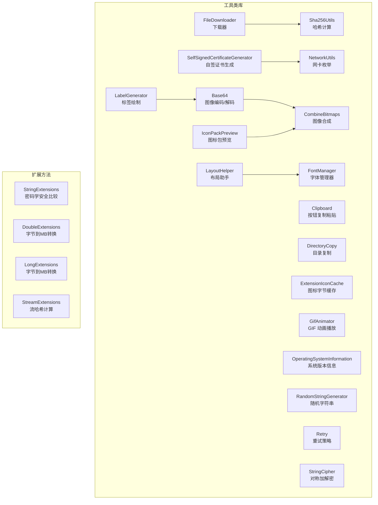

**图示来源**
- [Base64.cs:1-204](file://src/MacroDeck/Utils/Base64.cs#L1-L204)
- [Clipboard.cs:1-58](file://src/MacroDeck/Utils/Clipboard.cs#L1-L58)
- [CombineBitmaps.cs:1-92](file://src/MacroDeck/Utils/CombineBitmaps.cs#L1-L92)
- [DirectoryCopy.cs:1-54](file://src/MacroDeck/Utils/DirectoryCopy.cs#L1-L54)
- [ExtensionIconCache.cs:1-56](file://src/MacroDeck/Utils/ExtensionIconCache.cs#L1-L56)
- [FileDownloader.cs:1-112](file://src/MacroDeck/Utils/FileDownloader.cs#L1-L112)
- [GifAnimator.cs:1-191](file://src/MacroDeck/Utils/GifAnimator.cs#L1-L191)
- [IconPackPreview.cs:1-70](file://src/MacroDeck/Utils/IconPackPreview.cs#L1-L70)
- [LabelGenerator.cs:1-89](file://src/MacroDeck/Utils/LabelGenerator.cs#L1-L89)
- [NetworkUtils.cs:1-39](file://src/MacroDeck/Utils/NetworkUtils.cs#L1-L39)
- [OperatingSystemInformation.cs:1-66](file://src/MacroDeck/Utils/OperatingSystemInformation.cs#L1-L66)
- [RandomStringGenerator.cs:1-23](file://src/MacroDeck/Utils/RandomStringGenerator.cs#L1-L23)
- [Retry.cs:1-64](file://src/MacroDeck/Utils/Retry.cs#L1-L64)
- [SelfSignedCertificateGenerator.cs:1-66](file://src/MacroDeck/Utils/SelfSignedCertificateGenerator.cs#L1-L66)
- [Sha256Utils.cs:1-39](file://src/MacroDeck/Utils/Sha256Utils.cs#L1-L39)
- [StringCipher.cs:1-128](file://src/MacroDeck/Utils/StringCipher.cs#L1-L128)
- [LayoutHelper.cs:1-105](file://src/MacroDeck/Utils/LayoutHelper.cs#L1-L105)
- [FontManager.cs:1-227](file://src/MacroDeck/Utils/FontManager.cs#L1-L227)

**章节来源**
- [Base64.cs:1-204](file://src/MacroDeck/Utils/Base64.cs#L1-L204)
- [FileDownloader.cs:1-112](file://src/MacroDeck/Utils/FileDownloader.cs#L1-L112)
- [StringCipher.cs:1-128](file://src/MacroDeck/Utils/StringCipher.cs#L1-L128)
- [LayoutHelper.cs:1-105](file://src/MacroDeck/Utils/LayoutHelper.cs#L1-L105)
- [FontManager.cs:1-227](file://src/MacroDeck/Utils/FontManager.cs#L1-L227)

## 核心组件
- **图像与位图工具**：Base64 提供位图裁剪、二值化与 Base64 编解码；CombineBitmaps 支持背景与图标合成；GifAnimator 统一驱动多张 GIF 帧切换；LabelGenerator 在位图上绘制文本标签；IconPackPreview 生成图标包网格预览。
- **文件与网络**：DirectoryCopy 实现递归目录复制；FileDownloader 复用 HttpClient，支持进度上报与内存流下载；NetworkUtils 枚举可用 IPv4 地址；OperatingSystemInformation 解析 Windows 版本名；SelfSignedCertificateGenerator 生成符合 TLS 要求的自签证书。
- **安全与校验**：StringCipher 提供基于 PBKDF2 的对称加解密；Sha256Utils 流式计算文件/流 SHA-256；RandomStringGenerator 使用加密安全随机源。
- **可靠性与缓存**：Retry 提供带间隔的重试；ExtensionIconCache 以 LRU 策略缓存图标字节，避免重复下载。
- **扩展方法**：StringExtensions、DoubleExtensions、LongExtensions、StreamExtensions 为基础类型提供便捷能力。
- **界面布局与字体管理**：LayoutHelper 提供 WinForms 对话框的字体自适应和布局调整能力；FontManager 实现全局字体配置和递归字体应用。

**更新** 所有核心组件的 XML 文档注释都得到了显著改进，新增的字体管理和布局助手工具为 WinForms 界面提供了统一的字体配置和动态布局适配能力。

**章节来源**
- [Base64.cs:1-204](file://src/MacroDeck/Utils/Base64.cs#L1-L204)
- [CombineBitmaps.cs:1-92](file://src/MacroDeck/Utils/CombineBitmaps.cs#L1-L92)
- [GifAnimator.cs:1-191](file://src/MacroDeck/Utils/GifAnimator.cs#L1-L191)
- [LabelGenerator.cs:1-89](file://src/MacroDeck/Utils/LabelGenerator.cs#L1-L89)
- [IconPackPreview.cs:1-70](file://src/MacroDeck/Utils/IconPackPreview.cs#L1-L70)
- [DirectoryCopy.cs:1-54](file://src/MacroDeck/Utils/DirectoryCopy.cs#L1-L54)
- [FileDownloader.cs:1-112](file://src/MacroDeck/Utils/FileDownloader.cs#L1-L112)
- [NetworkUtils.cs:1-39](file://src/MacroDeck/Utils/NetworkUtils.cs#L1-L39)
- [OperatingSystemInformation.cs:1-66](file://src/MacroDeck/Utils/OperatingSystemInformation.cs#L1-L66)
- [SelfSignedCertificateGenerator.cs:1-66](file://src/MacroDeck/Utils/SelfSignedCertificateGenerator.cs#L1-L66)
- [StringCipher.cs:1-128](file://src/MacroDeck/Utils/StringCipher.cs#L1-L128)
- [Sha256Utils.cs:1-39](file://src/MacroDeck/Utils/Sha256Utils.cs#L1-L39)
- [RandomStringGenerator.cs:1-23](file://src/MacroDeck/Utils/RandomStringGenerator.cs#L1-L23)
- [Retry.cs:1-64](file://src/MacroDeck/Utils/Retry.cs#L1-L64)
- [ExtensionIconCache.cs:1-56](file://src/MacroDeck/Utils/ExtensionIconCache.cs#L1-L56)
- [StringExtensions.cs:1-38](file://src/MacroDeck/Extension/StringExtensions.cs#L1-L38)
- [DoubleExtensions.cs:1-18](file://src/MacroDeck/Extension/DoubleExtensions.cs#L1-L18)
- [LongExtensions.cs:1-18](file://src/MacroDeck/Extension/LongExtensions.cs#L1-L18)
- [StreamExtensions.cs:1-47](file://src/MacroDeck/Extension/StreamExtensions.cs#L1-L47)
- [LayoutHelper.cs:1-105](file://src/MacroDeck/Utils/LayoutHelper.cs#L1-L105)
- [FontManager.cs:1-227](file://src/MacroDeck/Utils/FontManager.cs#L1-L227)

## 架构总览
工具类库采用"按功能域分层"的组织方式，核心模块之间通过清晰的职责边界协作：
- **I/O 与网络**：FileDownloader 作为统一入口复用连接，减少握手成本；NetworkUtils 与 SelfSignedCertificateGenerator 为服务端通信提供基础设施。
- **图像管线**：Base64 → CombineBitmaps/LabelGenerator → IconPackPreview；GifAnimator 作为独立播放器管理帧时序。
- **安全与可靠性**：StringCipher/Sha256Utils 保障数据机密性与完整性；Retry 与 ExtensionIconCache 提升失败恢复与性能。
- **界面管理**：FontManager 提供全局字体配置，LayoutHelper 实现对话框布局自适应。
- **扩展方法**：在不侵入原类型的情况下提供易用 API，降低重复代码。

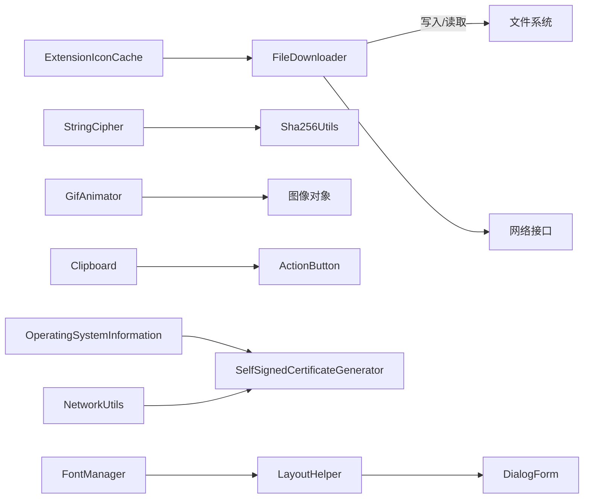

**图示来源**
- [FileDownloader.cs:1-112](file://src/MacroDeck/Utils/FileDownloader.cs#L1-L112)
- [StringCipher.cs:1-128](file://src/MacroDeck/Utils/StringCipher.cs#L1-L128)
- [Sha256Utils.cs:1-39](file://src/MacroDeck/Utils/Sha256Utils.cs#L1-L39)
- [GifAnimator.cs:1-191](file://src/MacroDeck/Utils/GifAnimator.cs#L1-L191)
- [Clipboard.cs:1-58](file://src/MacroDeck/Utils/Clipboard.cs#L1-L58)
- [ExtensionIconCache.cs:1-56](file://src/MacroDeck/Utils/ExtensionIconCache.cs#L1-L56)
- [OperatingSystemInformation.cs:1-66](file://src/MacroDeck/Utils/OperatingSystemInformation.cs#L1-L66)
- [SelfSignedCertificateGenerator.cs:1-66](file://src/MacroDeck/Utils/SelfSignedCertificateGenerator.cs#L1-L66)
- [NetworkUtils.cs:1-39](file://src/MacroDeck/Utils/NetworkUtils.cs#L1-L39)
- [FontManager.cs:1-227](file://src/MacroDeck/Utils/FontManager.cs#L1-L227)
- [LayoutHelper.cs:1-105](file://src/MacroDeck/Utils/LayoutHelper.cs#L1-L105)
- [DialogForm.Designer.cs:1-42](file://src/MacroDeck/GUI/CustomControls/DialogForm.Designer.cs#L1-L42)

## 详细组件分析

### Base64：图像二值化与 Base64 编解码
**更新** 增强了 XML 文档注释，提供了更详细的参数说明和使用场景描述。

- **功能要点**
  - 将位图按指定对齐方式裁剪为目标尺寸，进行逐像素二值化，打包为 8 像素一组的字节数组，并返回 Base64 字符串。
  - 提供从 Base64 字符串还原图像与将任意 Image 对象转为 Base64 PNG 字符串的能力。
- **性能与复杂度**
  - 时间复杂度近似 O(W×H)，空间复杂度 O(W×H/8)；使用 LockBits 与内存拷贝提升像素访问效率。
- **错误处理**
  - 包裹异常并返回空结果或空字符串，确保调用方健壮性。
- **典型场景**
  - 图标压缩传输、黑白位图序列化、跨平台兼容的图像表示。

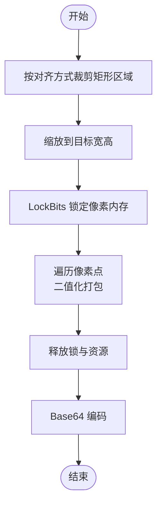

**图示来源**
- [Base64.cs:1-204](file://src/MacroDeck/Utils/Base64.cs#L1-L204)

**章节来源**
- [Base64.cs:1-204](file://src/MacroDeck/Utils/Base64.cs#L1-L204)

### Clipboard：ActionButton 复制粘贴
**更新** 改进了 XML 文档注释，增强了剪贴板操作的安全性和健壮性说明。

- **功能要点**
  - 保存当前 ActionButton 源实例，通过 JSON 序列化/反序列化生成深拷贝副本。
  - 使用自定义 JsonSerializerSettings 忽略空值并容错错误。
- **安全与健壮性**
  - 防御性检查源是否为空或已释放；拷贝过程避免共享可变状态。
- **典型场景**
  - 按钮配置复制、批量导入导出、临时存储。

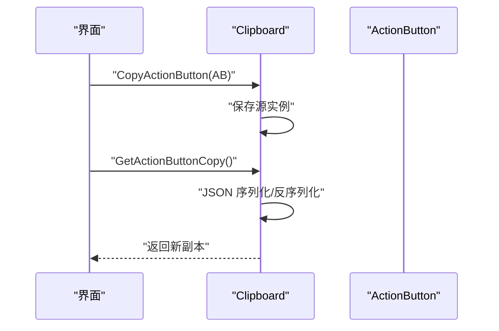

**图示来源**
- [Clipboard.cs:1-58](file://src/MacroDeck/Utils/Clipboard.cs#L1-L58)

**章节来源**
- [Clipboard.cs:1-58](file://src/MacroDeck/Utils/Clipboard.cs#L1-L58)

### CombineBitmaps：图像合成
**更新** 增强了 XML 文档注释，提供了更清晰的参数说明和使用示例。

- **功能要点**
  - 支持将多个位图叠加到固定画布；支持背景与前景图标合成，居中对齐。
  - 生成 32bppArgb 透明背景，使用双三次插值保证缩放质量。
- **典型场景**
  - 图标背景与前景组合、批量生成统一尺寸的复合图标。

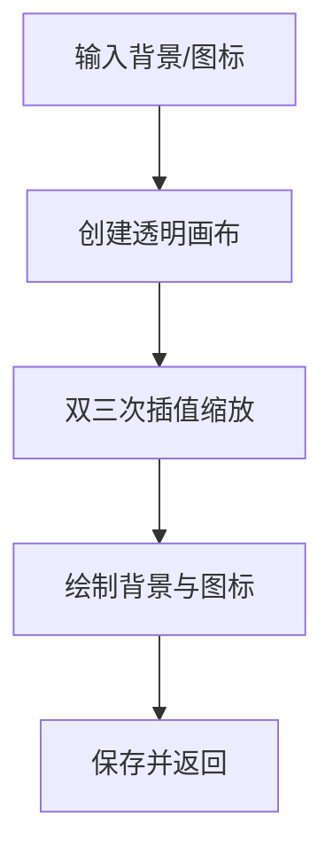

**图示来源**
- [CombineBitmaps.cs:1-92](file://src/MacroDeck/Utils/CombineBitmaps.cs#L1-L92)

**章节来源**
- [CombineBitmaps.cs:1-92](file://src/MacroDeck/Utils/CombineBitmaps.cs#L1-L92)

### DirectoryCopy：目录复制
**更新** 改进了 XML 文档注释，增强了异常处理和使用场景的说明。

- **功能要点**
  - 递归复制目录树，支持覆盖子目录与文件；不存在源目录时抛出异常。
- **典型场景**
  - 插件/图标包备份、安装包解压、配置迁移。

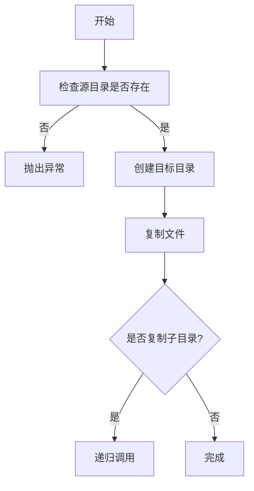

**图示来源**
- [DirectoryCopy.cs:1-54](file://src/MacroDeck/Utils/DirectoryCopy.cs#L1-L54)

**章节来源**
- [DirectoryCopy.cs:1-54](file://src/MacroDeck/Utils/DirectoryCopy.cs#L1-L54)

### ExtensionIconCache：图标字节缓存
**更新** 增强了 XML 文档注释，提供了更详细的缓存策略和性能说明。

- **功能要点**
  - 进程内有界缓存，LRU 淘汰；以原始字节形式缓存，避免强绑定 Image 生命周期。
- **性能与容量**
  - 最大条目数常量控制内存占用；线程安全锁保护并发访问。
- **典型场景**
  - 扩展商店频繁切换页面时复用图标字节，减少网络与解码开销。

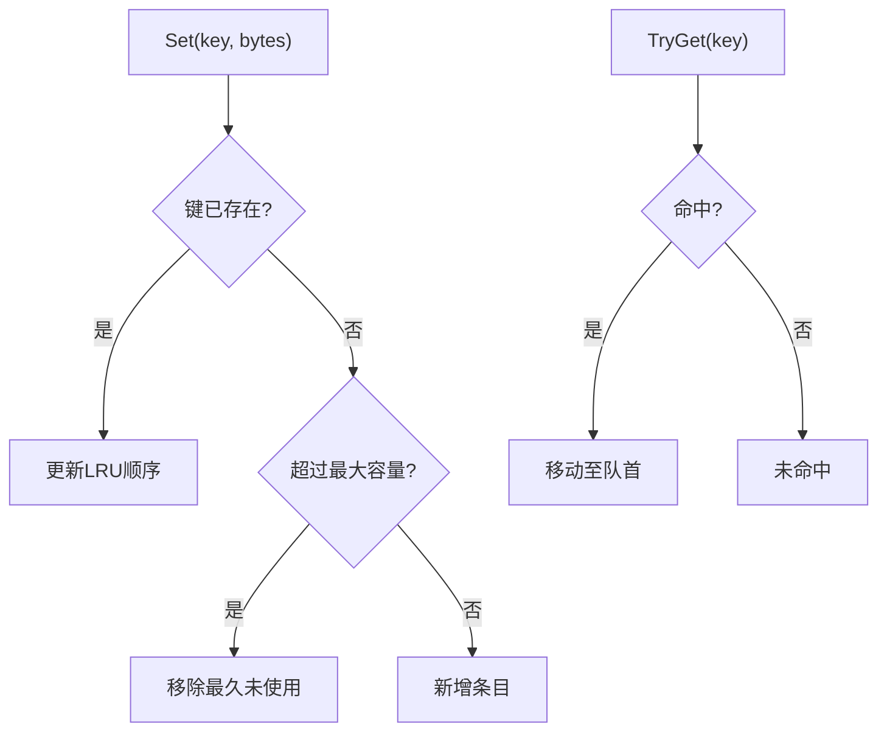

**图示来源**
- [ExtensionIconCache.cs:1-56](file://src/MacroDeck/Utils/ExtensionIconCache.cs#L1-L56)

**章节来源**
- [ExtensionIconCache.cs:1-56](file://src/MacroDeck/Utils/ExtensionIconCache.cs#L1-L56)

### FileDownloader：下载器
**更新** 改进了 XML 文档注释，增强了下载进度报告和取消操作的说明。

- **功能要点**
  - 单例 HttpClient 复用连接，避免频繁 DNS/TLS 开销；支持进度上报与取消令牌；提供内存流下载与泛型 JSON 获取。
- **性能与可靠性**
  - 分块读写与异步流写入，边下边写；进度计算基于计时器，避免阻塞 UI。
- **典型场景**
  - 扩展图标、远程配置、更新包下载。

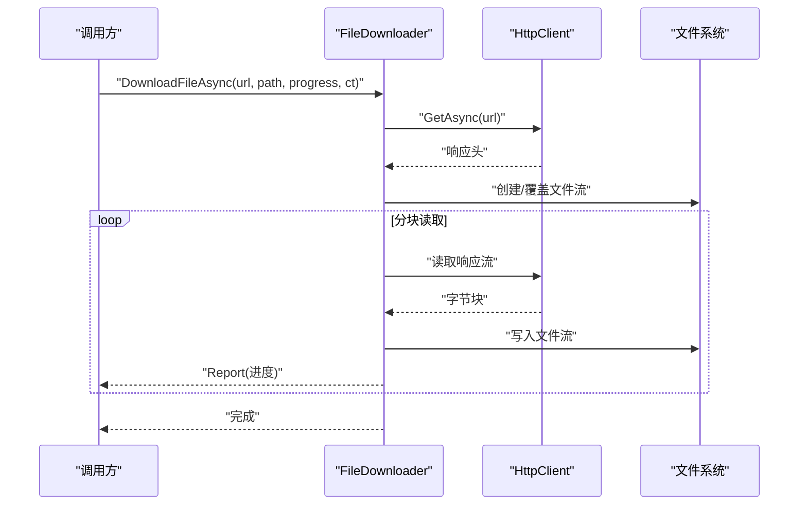

**图示来源**
- [FileDownloader.cs:1-112](file://src/MacroDeck/Utils/FileDownloader.cs#L1-L112)

**章节来源**
- [FileDownloader.cs:1-112](file://src/MacroDeck/Utils/FileDownloader.cs#L1-L112)

### GifAnimator：GIF 动画播放
**更新** 增强了 XML 文档注释，提供了更详细的帧延迟处理和性能优化说明。

- **功能要点**
  - 统一 UI 计时器驱动多张 GIF 帧切换；尊重每帧延迟，对极短延迟进行浏览器一致的 100ms 限幅；注册/注销时自动启停计时器。
- **性能与稳定性**
  - 固定 20ms tick，避免过高的 UI 压力；帧延迟解析来自属性项，异常时安全回退。
- **典型场景**
  - 图标动画显示、动态占位图渲染。

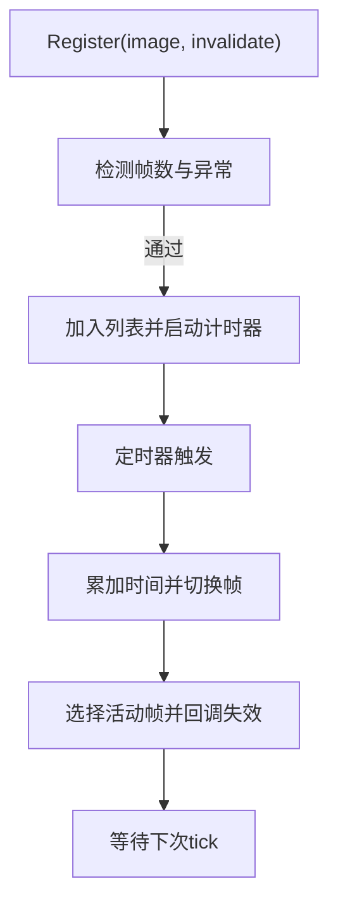

**图示来源**
- [GifAnimator.cs:1-191](file://src/MacroDeck/Utils/GifAnimator.cs#L1-L191)

**章节来源**
- [GifAnimator.cs:1-191](file://src/MacroDeck/Utils/GifAnimator.cs#L1-L191)

### IconPackPreview：图标包预览
**更新** 改进了 XML 文档注释，增强了预览图生成的参数说明和使用场景描述。

- **功能要点**
  - 生成 2x2 网格预览，截取图标包前四个图标绘制到固定画布。
- **典型场景**
  - 扩展商店预览、图标包浏览。

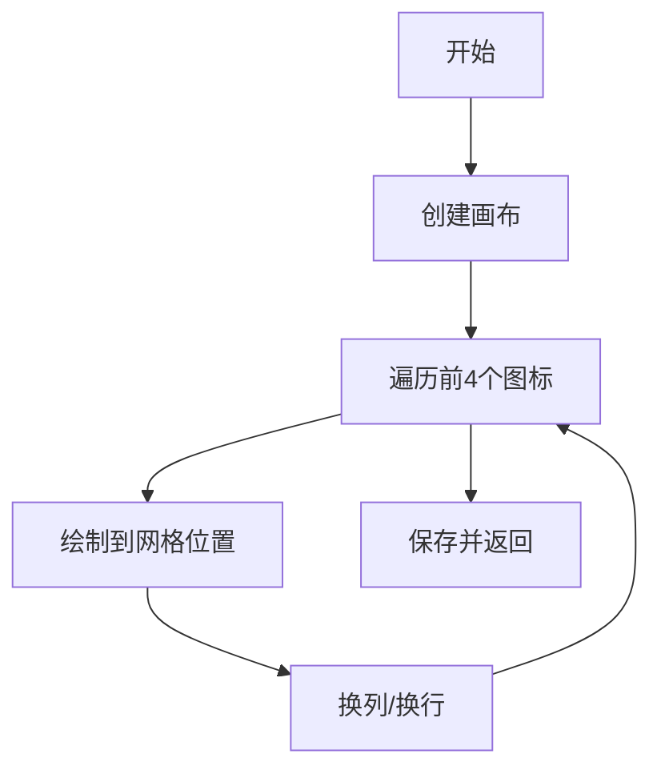

**图示来源**
- [IconPackPreview.cs:1-70](file://src/MacroDeck/Utils/IconPackPreview.cs#L1-L70)

**章节来源**
- [IconPackPreview.cs:1-70](file://src/MacroDeck/Utils/IconPackPreview.cs#L1-L70)

### LabelGenerator：标签绘制
**更新** 增强了 XML 文档注释，提供了更详细的参数说明和视觉效果描述。

- **功能要点**
  - 在现有图像上绘制文本标签，支持顶部/中部/底部对齐、阴影偏移与抗锯齿。
- **典型场景**
  - 按钮标签生成、水印叠加。

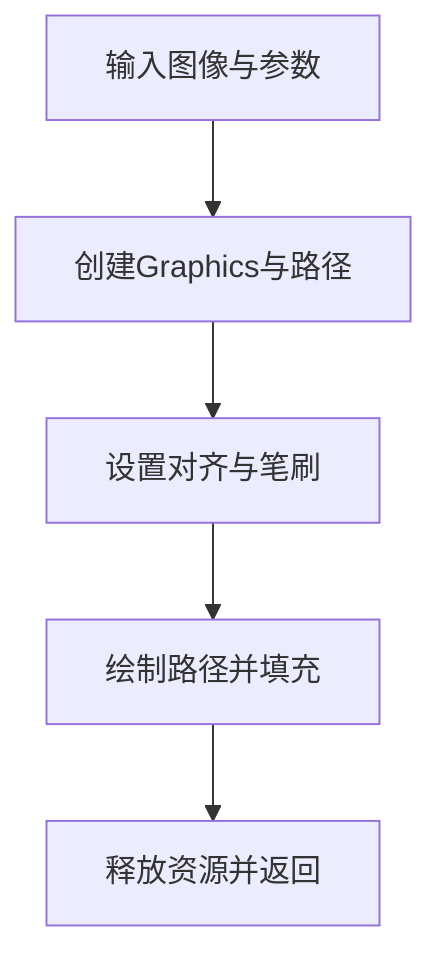

**图示来源**
- [LabelGenerator.cs:1-89](file://src/MacroDeck/Utils/LabelGenerator.cs#L1-L89)

**章节来源**
- [LabelGenerator.cs:1-89](file://src/MacroDeck/Utils/LabelGenerator.cs#L1-L89)

### NetworkUtils：网络接口枚举
**更新** 改进了 XML 文档注释，增强了异常处理和日志记录的说明。

- **功能要点**
  - 枚举所有网络适配器的 IPv4 地址，过滤回环地址，异常时记录日志并返回空集合。
- **典型场景**
  - 本地服务发现、证书 SAN 列表生成。

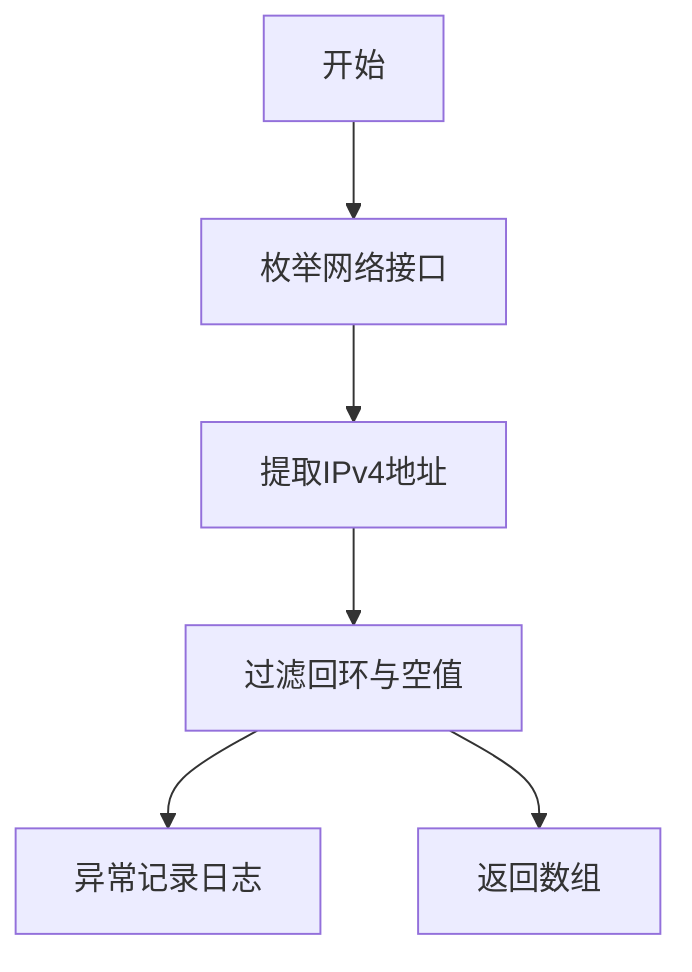

**图示来源**
- [NetworkUtils.cs:1-39](file://src/MacroDeck/Utils/NetworkUtils.cs#L1-L39)

**章节来源**
- [NetworkUtils.cs:1-39](file://src/MacroDeck/Utils/NetworkUtils.cs#L1-L39)

### OperatingSystemInformation：系统版本信息
**更新** 增强了 XML 文档注释，提供了更详细的版本映射和兼容性说明。

- **功能要点**
  - 解析 Windows 主次版本与构建号，区分 10/11 并标注位数。
- **典型场景**
  - 日志输出、兼容性提示。

**章节来源**
- [OperatingSystemInformation.cs:1-66](file://src/MacroDeck/Utils/OperatingSystemInformation.cs#L1-L66)

### RandomStringGenerator：随机字符串
**更新** 改进了 XML 文档注释，增强了密码学安全性的说明。

- **功能要点**
  - 使用加密安全随机源生成指定长度的字母数字字符串。
- **典型场景**
  - 会话标识、一次性令牌。

**章节来源**
- [RandomStringGenerator.cs:1-23](file://src/MacroDeck/Utils/RandomStringGenerator.cs#L1-L23)

### Retry：重试策略
**更新** 增强了 XML 文档注释，提供了更详细的重试参数和异常处理说明。

- **功能要点**
  - 默认最多 3 次、1 秒间隔；支持自定义间隔与最大次数；聚合异常。
- **典型场景**
  - 网络请求、文件 IO、外部服务调用。

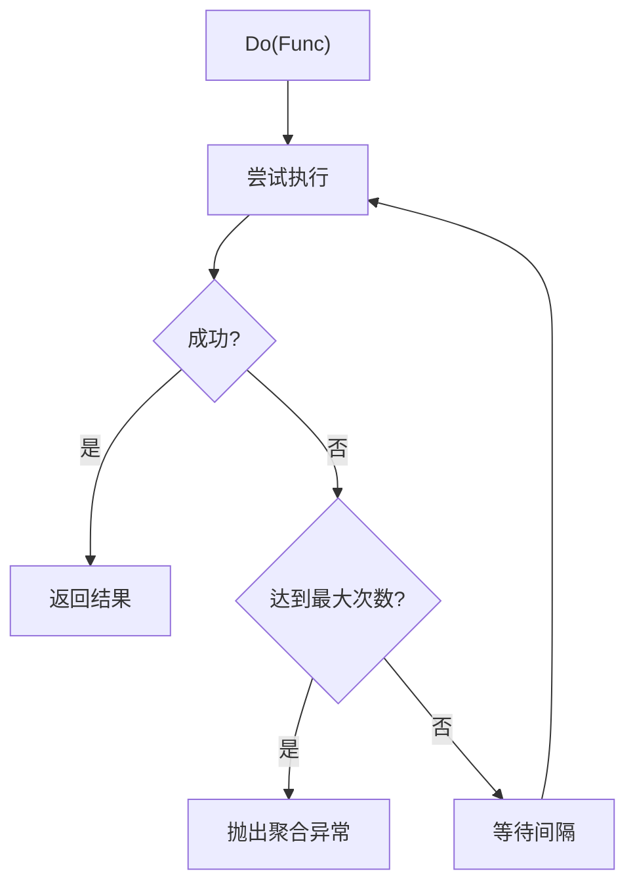

**图示来源**
- [Retry.cs:1-64](file://src/MacroDeck/Utils/Retry.cs#L1-L64)

**章节来源**
- [Retry.cs:1-64](file://src/MacroDeck/Utils/Retry.cs#L1-L64)

### SelfSignedCertificateGenerator：自签证书生成
**更新** 改进了 XML 文档注释，增强了证书生成流程和安全考虑的说明。

- **功能要点**
  - 生成 2048 位 RSA 密钥对，构造证书请求，添加关键扩展（密钥用途、增强密钥用途、SAN），包含 localhost 与本机 IPv4/IPv6 地址。
- **典型场景**
  - 开发环境 HTTPS、本地服务 TLS。

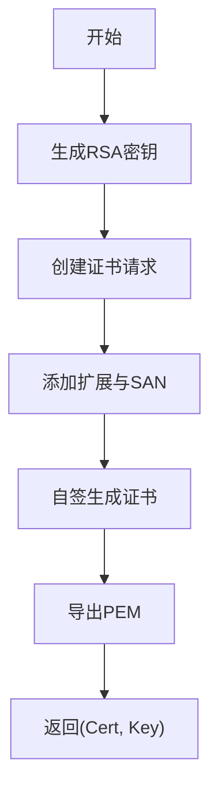

**图示来源**
- [SelfSignedCertificateGenerator.cs:1-66](file://src/MacroDeck/Utils/SelfSignedCertificateGenerator.cs#L1-L66)

**章节来源**
- [SelfSignedCertificateGenerator.cs:1-66](file://src/MacroDeck/Utils/SelfSignedCertificateGenerator.cs#L1-L66)

### Sha256Utils：SHA-256 哈希
**更新** 增强了 XML 文档注释，提供了更详细的流式处理和性能优化说明。

- **功能要点**
  - 支持文件与流的流式哈希计算，内部使用缓冲流与分块变换，最终输出小写十六进制字符串。
- **典型场景**
  - 文件完整性校验、缓存键生成。

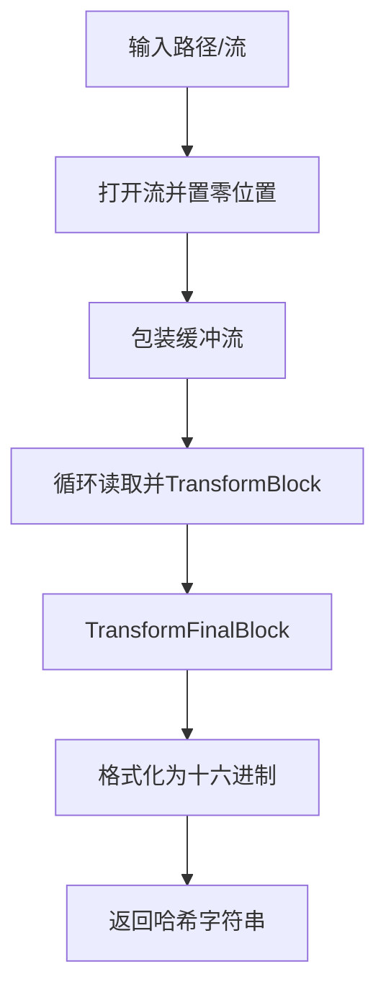

**图示来源**
- [Sha256Utils.cs:1-39](file://src/MacroDeck/Utils/Sha256Utils.cs#L1-L39)

**章节来源**
- [Sha256Utils.cs:1-39](file://src/MacroDeck/Utils/Sha256Utils.cs#L1-L39)

### StringCipher：对称加解密
**更新** 显著增强了 XML 文档注释，提供了更详细的加密算法说明、安全参数和使用场景描述。

- **功能要点**
  - 基于 PBKDF2 的 Rijndael（AES）CBC 模式，盐与 IV 随机生成并前置存储；提供机器 GUID 查询。
- **安全性**
  - 使用加密安全随机源生成盐与 IV；迭代次数常量提供基础抗暴力破解能力。
- **典型场景**
  - 配置项加密存储、敏感数据本地保护。

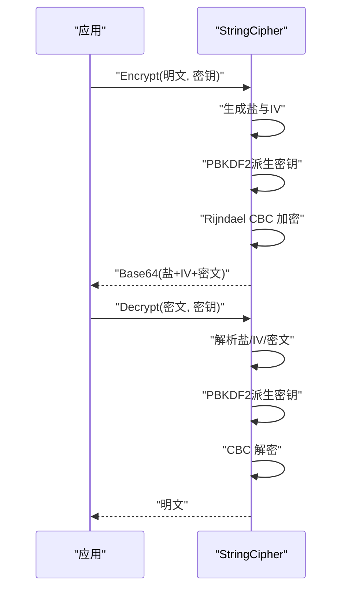

**图示来源**
- [StringCipher.cs:1-128](file://src/MacroDeck/Utils/StringCipher.cs#L1-L128)

**章节来源**
- [StringCipher.cs:1-128](file://src/MacroDeck/Utils/StringCipher.cs#L1-L128)

### 扩展方法：StringExtensions、DoubleExtensions、LongExtensions、StreamExtensions
**更新** 增强了所有扩展方法类的 XML 文档注释，提供了更详细的密码学安全说明和使用场景描述。

- **设计原则**
  - 无副作用、纯函数式风格；保持与基础类型的零成本抽象。
- **典型用途**
  - 字符串规范化、数值单位换算、流读写便捷封装、布尔/条件链式调用等。

**章节来源**
- [StringExtensions.cs:1-38](file://src/MacroDeck/Extension/StringExtensions.cs#L1-L38)
- [DoubleExtensions.cs:1-18](file://src/MacroDeck/Extension/DoubleExtensions.cs#L1-L18)
- [LongExtensions.cs:1-18](file://src/MacroDeck/Extension/LongExtensions.cs#L1-L18)
- [StreamExtensions.cs:1-47](file://src/MacroDeck/Extension/StreamExtensions.cs#L1-L47)

### LayoutHelper：布局助手
**新增** 为 WinForms 对话框提供字体自适应和布局调整能力。

- **功能要点**
  - 计算当前字体下文字的最小高度，自动调整 Label、RadioButton、CheckBox 的高度。
  - 根据控件实际位置动态调整窗体大小，确保内容完整显示。
  - 支持递归遍历控件树，跳过特定标记的控件。
- **使用模式**
  - 在对话框 OnLoad 中调用 AdjustLabelsAndButtons + AdjustFormSize。
  - 对于复杂布局建议覆盖 OnLoad 实现精确的布局重算逻辑。
- **典型场景**
  - 字体缩放时的界面自适应、多语言界面的动态布局调整。

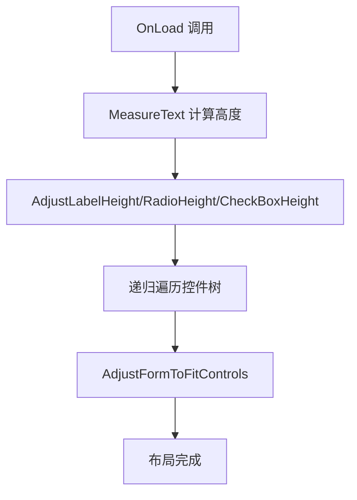

**图示来源**
- [LayoutHelper.cs:1-105](file://src/MacroDeck/Utils/LayoutHelper.cs#L1-L105)

**章节来源**
- [LayoutHelper.cs:1-105](file://src/MacroDeck/Utils/LayoutHelper.cs#L1-L105)

### FontManager：字体管理器
**新增** 提供全局字体配置和递归字体应用能力。

- **功能要点**
  - 初始化字体族、字号与粗体配置，支持字体回退机制。
  - 递归替换控件树字体，保留各控件原有的字号层次。
  - 支持运行时实时刷新，缓存原始字体确保幂等性。
- **设计目标**
  - 在不改动大量 Designer 硬编码字体的前提下，统一界面字体。
  - 支持等宽字体的特殊处理（Tag 为 "no-font" 的控件）。
- **典型场景**
  - 用户字体偏好设置、高 DPI 环境的字体适配、无障碍访问支持。

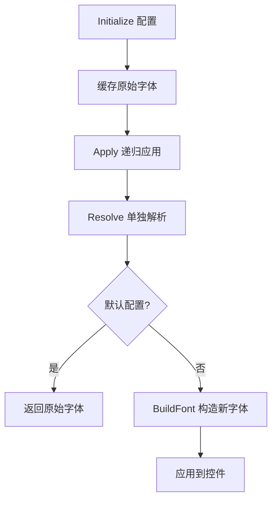

**图示来源**
- [FontManager.cs:1-227](file://src/MacroDeck/Utils/FontManager.cs#L1-L227)

**章节来源**
- [FontManager.cs:1-227](file://src/MacroDeck/Utils/FontManager.cs#L1-L227)

## 构建与部署工具
**更新** 增强了构建脚本功能，提供更完善的自动化部署和测试能力。

### run_win.ps1：主构建脚本
- **功能增强**
  - 添加防火墙规则自动配置功能，支持 TCP 8191 端口放行。
  - 自动更新主机地址配置，检测 Wi-Fi IP 并更新 config.json。
  - 支持便携模式运行，数据存储在输出目录的 Data 子目录。
  - 增强管理员权限检查，避免在受保护目录构建失败。
- **使用场景**
  - 开发环境快速构建和部署
  - 生产环境安装包制作
  - 便携版应用生成

### test-macrodeck.ps1：端到端测试脚本
- **功能特性**
  - 自动重启 Macro Deck 应用程序
  - 验证 HTTP/WebSocket 端口连通性
  - 测试 /ping REST 接口响应
  - 验证 Web 客户端资源提供
  - 执行 WebSocket 握手测试
  - 检查启动日志状态
- **测试流程**
  - 等待端口就绪（超时 40 秒）
  - 发送 HTTP 请求并验证响应
  - 建立 WebSocket 连接并发送消息
  - 分析日志文件验证启动状态

### update-macrodeck-local.ps1：本地更新工具
- **功能特性**
  - 支持从 CI 构建下载最新版本并安装
  - 触发新的 CI 编译并等待完成
  - 查询最新版本号和构建状态
  - 仅复制程序文件，保留用户数据目录
- **使用场景**
  - 开发者快速更新本地版本
  - 回滚到稳定版本
  - CI/CD 流程集成

**章节来源**
- [run_win.ps1:1-123](file://run_win.ps1#L1-L123)
- [test-macrodeck.ps1:1-200](file://test-macrodeck.ps1#L1-L200)
- [update-macrodeck-local.ps1:1-219](file://update-macrodeck-local.ps1#L1-L219)

## 界面布局与字体管理
**新增** 字体管理和布局助手工具为 WinForms 界面提供统一的字体配置和动态布局适配能力。

### 字体管理系统
- **全局配置**
  - 支持用户自定义字体族、字号和粗体设置
  - 自动检测字体安装状态，提供回退机制
  - 基线字号 9.75F，确保字体层次的一致性
- **运行时刷新**
  - 缓存每个控件的原始字体，支持多次应用
  - 实时刷新所有已打开的窗体
  - 支持等宽字体的特殊处理（Tag 为 "no-font"）

### 布局自适应系统
- **动态高度调整**
  - 根据当前字体计算文字高度，自动调整控件尺寸
  - 仅在需要时增大控件高度，避免缩小已有布局
  - 支持 Label、RadioButton、CheckBox 的智能适配
- **窗口大小自适应**
  - 根据控件实际位置动态调整窗体大小
  - 保持设计时的最小尺寸，确保不会缩小
  - 自动处理边距和间距的计算

### 资源管理优化
- **图标资源集中管理**
  - 所有界面图标通过 Resources.resx 统一管理
  - 支持多种格式的图标资源（PNG、GIF、ICO）
  - 自动处理 DPI 适配和颜色主题
- **对话框资源优化**
  - DialogForm 设计时 DPI 设置为 1045x250
  - 支持字体自适应的对话框布局
  - 统一的对话框外观和交互体验

**章节来源**
- [LayoutHelper.cs:1-105](file://src/MacroDeck/Utils/LayoutHelper.cs#L1-L105)
- [FontManager.cs:1-227](file://src/MacroDeck/Utils/FontManager.cs#L1-L227)
- [DialogForm.Designer.cs:1-42](file://src/MacroDeck/GUI/CustomControls/DialogForm.Designer.cs#L1-L42)
- [Resources.resx:120-283](file://src/MacroDeck/Properties/Resources.resx#L120-L283)

## 依赖分析
- **内聚与耦合**
  - 工具类内部低耦合，仅 FileDownloader 与网络相关；StringCipher 与 Sha256Utils 在安全场景形成自然关联。
  - FontManager 与 LayoutHelper 形成界面管理的完整解决方案。
- **外部依赖**
  - System.Drawing（图像）、System.Security.Cryptography（加密）、System.Net.Http（网络）、Serilog（日志）。
  - Windows Forms（界面管理）、PowerShell（构建脚本）。
- **循环依赖**
  - 未见直接循环；各模块通过静态类与方法调用，避免运行期循环。

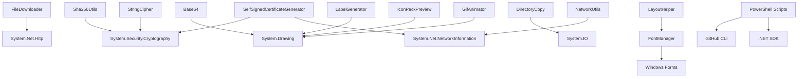

**图示来源**
- [FileDownloader.cs:1-112](file://src/MacroDeck/Utils/FileDownloader.cs#L1-L112)
- [StringCipher.cs:1-128](file://src/MacroDeck/Utils/StringCipher.cs#L1-L128)
- [Sha256Utils.cs:1-39](file://src/MacroDeck/Utils/Sha256Utils.cs#L1-L39)
- [GifAnimator.cs:1-191](file://src/MacroDeck/Utils/GifAnimator.cs#L1-L191)
- [IconPackPreview.cs:1-70](file://src/MacroDeck/Utils/IconPackPreview.cs#L1-L70)
- [LabelGenerator.cs:1-89](file://src/MacroDeck/Utils/LabelGenerator.cs#L1-L89)
- [Base64.cs:1-204](file://src/MacroDeck/Utils/Base64.cs#L1-L204)
- [DirectoryCopy.cs:1-54](file://src/MacroDeck/Utils/DirectoryCopy.cs#L1-L54)
- [NetworkUtils.cs:1-39](file://src/MacroDeck/Utils/NetworkUtils.cs#L1-L39)
- [SelfSignedCertificateGenerator.cs:1-66](file://src/MacroDeck/Utils/SelfSignedCertificateGenerator.cs#L1-L66)
- [FontManager.cs:1-227](file://src/MacroDeck/Utils/FontManager.cs#L1-L227)
- [LayoutHelper.cs:1-105](file://src/MacroDeck/Utils/LayoutHelper.cs#L1-L105)

## 性能考量
- **I/O 与网络**
  - FileDownloader 复用 HttpClient，分块读写与异步写入降低内存峰值；建议在 UI 线程外执行长耗时任务。
- **图像处理**
  - Base64 使用 LockBits 与像素打包，避免逐像素托管访问；CombineBitmaps 与 LabelGenerator 使用高质量插值与抗锯齿，注意在高频刷新场景下的 CPU 占用。
- **缓存与重试**
  - ExtensionIconCache 限制最大条目，LRU 淘汰避免无限增长；Retry 控制重试次数与间隔，防止雪崩。
- **安全与校验**
  - Sha256Utils 流式计算，适合大文件；StringCipher 的 PBKDF2 迭代次数为固定常量，建议在更高强度需求下评估调整。
- **界面性能**
  - FontManager 使用 ConditionalWeakTable 缓存原始字体，避免内存泄漏；LayoutHelper 的递归遍历在大型控件树上可能有性能影响。
- **构建脚本**
  - PowerShell 脚本使用同步调用，建议在长时间操作时提供进度反馈；CI 更新脚本需要网络连接和 GitHub API 权限。

## 故障排查指南
- **图像相关**
  - Base64 返回空字符串或异常：检查输入位图尺寸与像素格式；确认内存锁定与释放顺序。
  - GifAnimator 不播放：确认图像为多帧 GIF；检查注册时机与 UI 线程一致性。
- **网络与下载**
  - FileDownloader 报错：检查 URL 可达性与 SSL 证书；关注进度回调中的取消令牌。
  - NetworkUtils 返回空数组：确认当前系统具备可用 IPv4 地址且无权限限制。
- **安全与校验**
  - StringCipher 解密失败：核对密钥与 Base64 输入；确认盐/IV/密文长度匹配。
  - Sha256Utils 输出为空：检查流位置与可读性；确保 TransformFinalBlock 后 Hash 非空。
- **可靠性**
  - Retry 仍失败：查看聚合异常堆栈定位具体原因；适当增加最大次数或延长间隔。
- **界面问题**
  - 字体显示异常：检查字体安装状态；确认 FontManager.Initialize 调用时机。
  - 布局错乱：确认 LayoutHelper 调用顺序；检查控件的 Tag 属性设置。
- **构建脚本**
  - PowerShell 脚本权限问题：确保 ExecutionPolicy 设置为 Bypass；检查管理员权限。
  - CI 更新失败：验证 GitHub CLI 安装；检查网络连接和认证状态。

**章节来源**
- [Base64.cs:1-204](file://src/MacroDeck/Utils/Base64.cs#L1-L204)
- [GifAnimator.cs:1-191](file://src/MacroDeck/Utils/GifAnimator.cs#L1-L191)
- [FileDownloader.cs:1-112](file://src/MacroDeck/Utils/FileDownloader.cs#L1-L112)
- [NetworkUtils.cs:1-39](file://src/MacroDeck/Utils/NetworkUtils.cs#L1-L39)
- [StringCipher.cs:1-128](file://src/MacroDeck/Utils/StringCipher.cs#L1-L128)
- [Sha256Utils.cs:1-39](file://src/MacroDeck/Utils/Sha256Utils.cs#L1-L39)
- [Retry.cs:1-64](file://src/MacroDeck/Utils/Retry.cs#L1-L64)
- [FontManager.cs:1-227](file://src/MacroDeck/Utils/FontManager.cs#L1-L227)
- [LayoutHelper.cs:1-105](file://src/MacroDeck/Utils/LayoutHelper.cs#L1-L105)

## 结论
工具类库围绕"高性能、可复用、安全可靠"展开，覆盖图像、网络、安全、缓存与重试等关键领域。通过清晰的职责划分与稳健的错误处理，为上层功能提供了坚实支撑。本次更新显著改进了多个核心工具类的 XML 文档注释，新增的字体管理和布局助手工具为 WinForms 界面提供了统一的字体配置和动态布局适配能力。构建脚本的增强进一步提升了开发和部署效率。建议在生产环境中结合业务场景对缓存容量、重试策略与加密参数进行调优，并持续完善测试覆盖。

## 附录
- **测试策略与质量保证**
  - 单元测试：覆盖关键工具的边界与异常路径，例如加密解密正确性、哈希一致性、下载进度与取消、缓存命中与淘汰。
  - 集成测试：模拟真实工作流（如扩展商店图标加载、下载器与缓存配合、GIF 播放与注册/注销）。
  - 端到端测试：使用 test-macrodeck.ps1 验证完整的应用生命周期，包括启动、连接、功能测试和日志验证。
  - 性能测试：针对大文件哈希、大批量图像合成、高并发下载与缓存命中率进行基准测试。
- **开发者扩展指导**
  - 新增工具类遵循"单一职责、明确输入输出、异常显式化、线程安全与资源释放"原则。
  - 对图像处理类尽量提供异步与进度回调接口；对网络类复用共享客户端并支持取消。
  - 对安全类严格遵守密码学最佳实践，避免硬编码密钥与弱算法。
  - 新增界面工具类时考虑字体管理和布局适配的需求。
- **用户使用建议**
  - 图像处理：优先使用 Base64 与 CombineBitmaps 生成统一尺寸图标；在高频刷新场景控制帧率。
  - 网络下载：为长任务提供进度反馈与取消能力；对重复资源启用缓存。
  - 安全存储：对敏感数据使用 StringCipher；定期轮换密钥并验证 Sha256 校验。
  - 界面配置：利用 FontManager 和 LayoutHelper 实现字体和布局的统一管理。
  - 构建部署：使用 run_win.ps1 进行一键构建和部署；通过 update-macrodeck-local.ps1 管理版本更新。

**章节来源**
- [MacroDeck.Tests/StringCipherTest.cs](file://tests/MacroDeck.Tests/StringCipherTest.cs)
- [MacroDeck.Tests/TemplateManagerTests.cs](file://tests/MacroDeck.Tests/TemplateManagerTests.cs)
- [MacroDeck.Tests/ConvertNameStringTests.cs](file://tests/MacroDeck.Tests/ConvertNameStringTests.cs)
- [run_win.ps1:1-123](file://run_win.ps1#L1-L123)
- [test-macrodeck.ps1:1-200](file://test-macrodeck.ps1#L1-L200)
- [update-macrodeck-local.ps1:1-219](file://update-macrodeck-local.ps1#L1-L219)