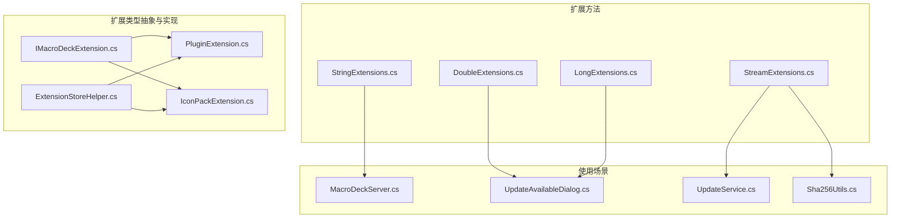
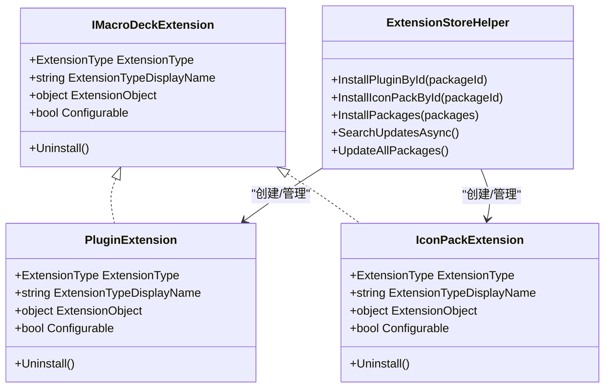
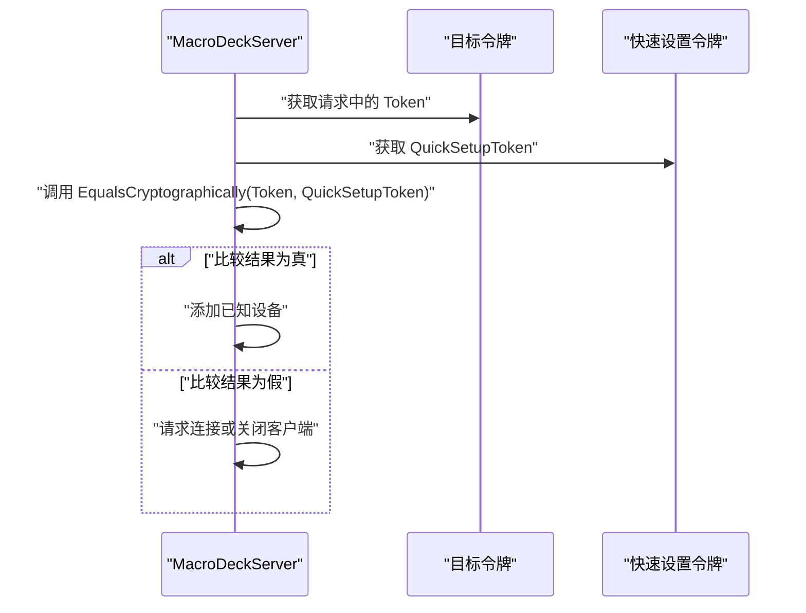
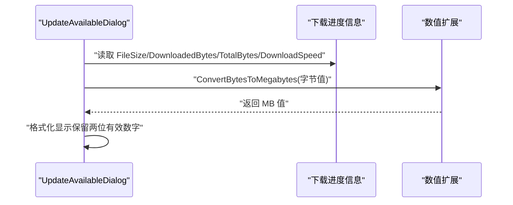
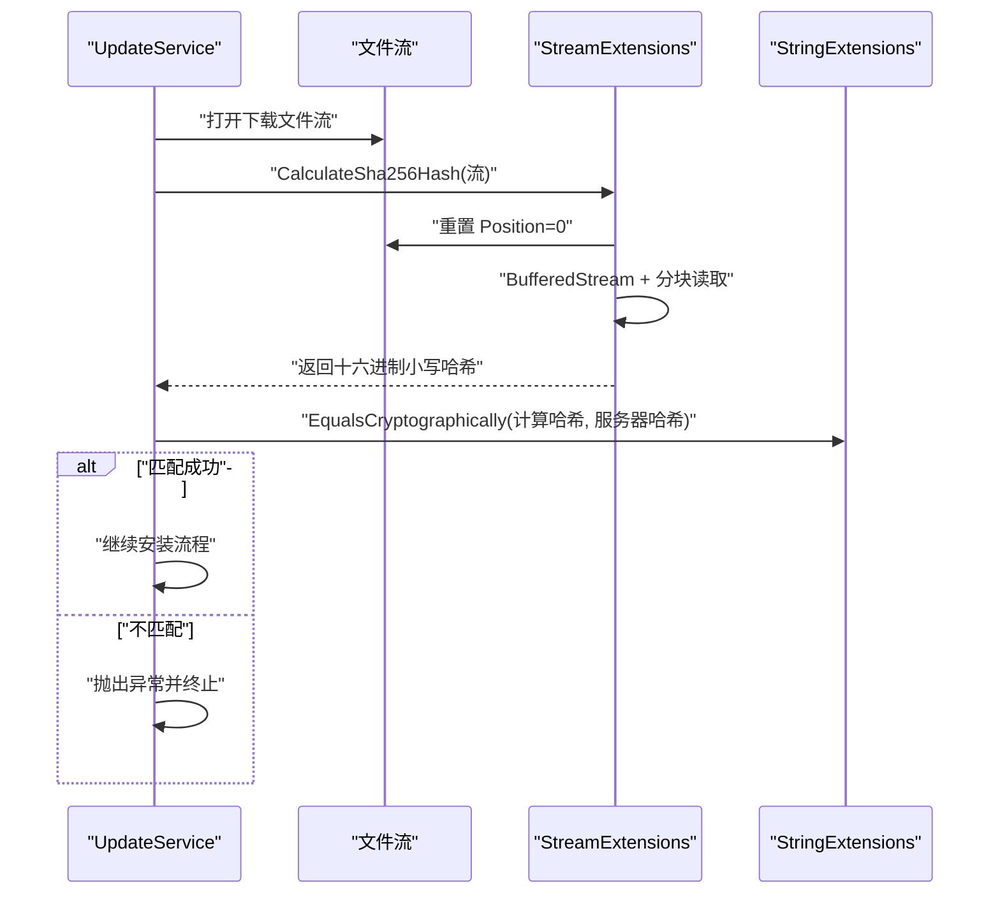
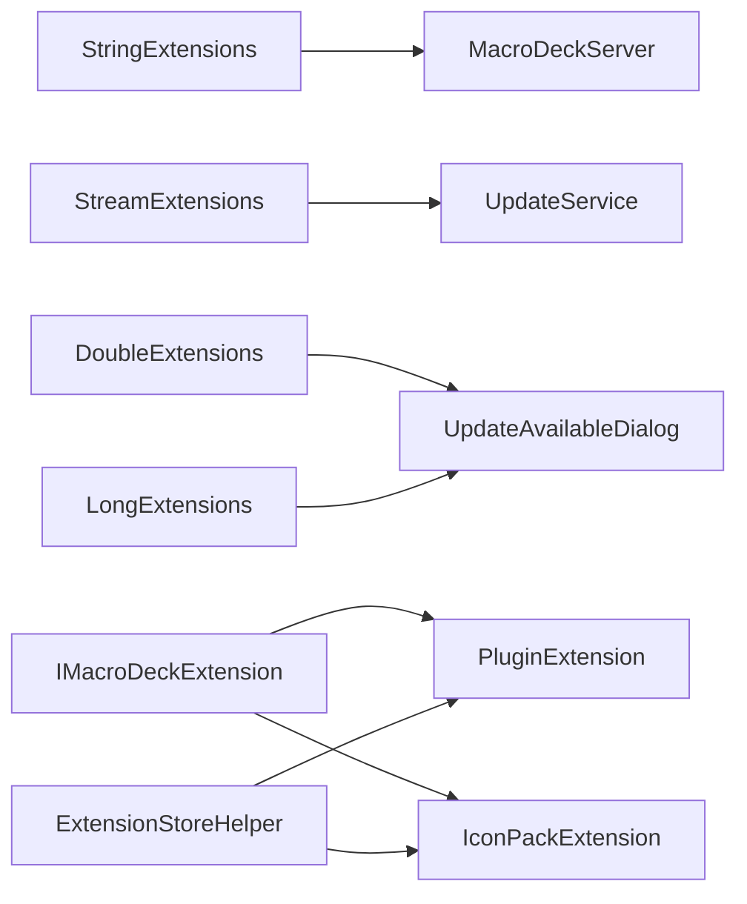

# 扩展方法

<cite>
**本文引用的文件**
- [StringExtensions.cs](file://src/MacroDeck/Extension/StringExtensions.cs)
- [DoubleExtensions.cs](file://src/MacroDeck/Extension/DoubleExtensions.cs)
- [LongExtensions.cs](file://src/MacroDeck/Extension/LongExtensions.cs)
- [StreamExtensions.cs](file://src/MacroDeck/Extension/StreamExtensions.cs)
- [IMacroDeckExtension.cs](file://src/MacroDeck/Extension/IMacroDeckExtension.cs)
- [IconPackExtension.cs](file://src/MacroDeck/Extension/IconPackExtension.cs)
- [PluginExtension.cs](file://src/MacroDeck/Extension/PluginExtension.cs)
- [ExtensionStoreHelper.cs](file://src/MacroDeck/ExtensionStore/ExtensionStoreHelper.cs)
- [MacroDeckServer.cs](file://src/MacroDeck/Server/MacroDeckServer.cs)
- [UpdateService.cs](file://src/MacroDeck/Services/UpdateService.cs)
- [UpdateAvailableDialog.cs](file://src/MacroDeck/GUI/Dialogs/UpdateAvailableDialog.cs)
- [Sha256Utils.cs](file://src/MacroDeck/Utils/Sha256Utils.cs)
</cite>

## 目录
1. [简介](#简介)
2. [项目结构](#项目结构)
3. [核心组件](#核心组件)
4. [架构总览](#架构总览)
5. [详细组件分析](#详细组件分析)
6. [依赖关系分析](#依赖关系分析)
7. [性能考虑](#性能考虑)
8. [故障排查指南](#故障排查指南)
9. [结论](#结论)
10. [附录：自定义扩展方法开发指南与测试策略](#附录自定义扩展方法开发指南与测试策略)

## 简介
本文件系统性梳理 Macro-Deck 中的“扩展方法”体系，涵盖以下方面：
- 字符串扩展：提供安全比较方法，避免时序侧信道风险
- 数值扩展：将字节数转换为 MB 的便捷方法
- 流处理扩展：对 Stream 计算 SHA-256 哈希，支持异步与缓冲读取
- 扩展类型接口与实现：统一扩展对象的抽象与具体类型（插件、图标包）
- 使用场景与最佳实践：在设备连接校验、更新下载校验、界面显示中的应用
- 性能特性与内存使用：缓冲区大小、哈希计算与字符串比较的成本
- 自定义扩展方法开发与测试：接口契约、命名规范、单元测试与调试技巧

## 项目结构
扩展方法主要位于 Extension 命名空间下，配合 ExtensionStoreHelper 提供扩展生态管理能力；部分使用场景分布在服务层与 GUI 层。

图表来源
- [StringExtensions.cs:1-25](file://src/MacroDeck/Extension/StringExtensions.cs#L1-L25)
- [DoubleExtensions.cs:1-10](file://src/MacroDeck/Extension/DoubleExtensions.cs#L1-L10)
- [LongExtensions.cs:1-10](file://src/MacroDeck/Extension/LongExtensions.cs#L1-L10)
- [StreamExtensions.cs:1-33](file://src/MacroDeck/Extension/StreamExtensions.cs#L1-L33)
- [IMacroDeckExtension.cs:1-13](file://src/MacroDeck/Extension/IMacroDeckExtension.cs#L1-L13)
- [PluginExtension.cs:1-24](file://src/MacroDeck/Extension/PluginExtension.cs#L1-L24)
- [IconPackExtension.cs:1-23](file://src/MacroDeck/Extension/IconPackExtension.cs#L1-L23)
- [ExtensionStoreHelper.cs:1-195](file://src/MacroDeck/ExtensionStore/ExtensionStoreHelper.cs#L1-L195)
- [MacroDeckServer.cs:150-200](file://src/MacroDeck/Server/MacroDeckServer.cs#L150-L200)
- [UpdateService.cs:145-175](file://src/MacroDeck/Services/UpdateService.cs#L145-L175)
- [UpdateAvailableDialog.cs:25-93](file://src/MacroDeck/GUI/Dialogs/UpdateAvailableDialog.cs#L25-L93)
- [Sha256Utils.cs:1-20](file://src/MacroDeck/Utils/Sha256Utils.cs#L1-L20)

章节来源
- [ExtensionStoreHelper.cs:1-195](file://src/MacroDeck/ExtensionStore/ExtensionStoreHelper.cs#L1-L195)

## 核心组件
本节从设计目的、实现细节、参数与返回值、使用示例与最佳实践等方面，逐项解析各扩展方法与扩展类型。

- 字符串扩展：EqualsCryptographically
  - 设计目的：提供常量时间（或近似常量时间）的字符串比较，降低时序侧信道攻击风险，用于令牌或哈希的比较
  - 实现要点：先进行长度快速失败判断，再对字节序列进行逐字节比较；使用 SHA-256 对输入进行哈希后再比较
  - 参数与返回值：接收两个可空字符串，返回布尔值
  - 使用示例路径：
    - [MacroDeckServer.cs:157-161](file://src/MacroDeck/Server/MacroDeckServer.cs#L157-L161)
  - 最佳实践：
    - 比较前确保输入非空，避免不必要的哈希计算
    - 仅用于敏感数据比较，如令牌、哈希值
  - 复杂度与性能：O(n)，n 为字符串长度；哈希计算与逐字节比较均为线性成本

- 数值扩展：ConvertBytesToMegabytes（double/long）
  - 设计目的：将字节值转换为以 MB 为单位的浮点数，便于用户界面展示与日志输出
  - 实现要点：除以 1024×1024 得到 MB 值
  - 参数与返回值：接收字节数（double 或 long），返回 MB（double）
  - 使用示例路径：
    - [UpdateAvailableDialog.cs:32-33](file://src/MacroDeck/GUI/Dialogs/UpdateAvailableDialog.cs#L32-L33)
    - [UpdateAvailableDialog.cs:70-73](file://src/MacroDeck/GUI/Dialogs/UpdateAvailableDialog.cs#L70-L73)
  - 最佳实践：
    - 在 UI 显示前调用，避免重复计算
    - 使用 ToString("0.##") 控制小数位数，提升可读性

- 流处理扩展：CalculateSha256Hash
  - 设计目的：对任意 Stream 计算 SHA-256 哈希，支持大文件与异步读取
  - 实现要点：重置流位置至开头；使用 BufferedStream 提升读取效率；分块读取并持续更新哈希；最终格式化为十六进制小写字符串
  - 参数与返回值：接收一个 Stream，返回异步 ValueTask<string>（SHA-256 十六进制小写字符串）
  - 使用示例路径：
    - [UpdateService.cs:151-157](file://src/MacroDeck/Services/UpdateService.cs#L151-L157)
    - [Sha256Utils.cs:1-20](file://src/MacroDeck/Utils/Sha256Utils.cs#L1-L20)
  - 最佳实践：
    - 调用前确保流可读且已打开；若需要再次读取，注意恢复 Position
    - 对于大文件，建议使用异步读取以避免阻塞 UI
  - 性能与内存：
    - 缓冲区大小为 8192 字节，平衡吞吐与内存占用
    - TransformBlock/TransformFinalBlock 的调用链保证流式哈希计算

- 扩展类型接口与实现：IMacroDeckExtension 及其实现类
  - 设计目的：统一扩展对象的抽象，便于扩展商店安装、配置与卸载流程的统一封装
  - 接口字段：
    - ExtensionType：扩展类型（插件/图标包）
    - ExtensionTypeDisplayName：类型显示名称（本地化）
    - ExtensionObject：扩展对象实例
    - Configurable：是否可配置
    - Uninstall：卸载操作
  - 实现类：
    - PluginExtension：封装 MacroDeckPlugin，根据 CanConfigure 决定 Configurable
    - IconPackExtension：封装 IconPack，不可配置
  - 使用场景：
    - 扩展商店安装流程中作为统一载体
    - 插件与图标包的生命周期管理

章节来源
- [StringExtensions.cs:1-25](file://src/MacroDeck/Extension/StringExtensions.cs#L1-L25)
- [DoubleExtensions.cs:1-10](file://src/MacroDeck/Extension/DoubleExtensions.cs#L1-L10)
- [LongExtensions.cs:1-10](file://src/MacroDeck/Extension/LongExtensions.cs#L1-L10)
- [StreamExtensions.cs:1-33](file://src/MacroDeck/Extension/StreamExtensions.cs#L1-L33)
- [IMacroDeckExtension.cs:1-13](file://src/MacroDeck/Extension/IMacroDeckExtension.cs#L1-L13)
- [PluginExtension.cs:1-24](file://src/MacroDeck/Extension/PluginExtension.cs#L1-L24)
- [IconPackExtension.cs:1-23](file://src/MacroDeck/Extension/IconPackExtension.cs#L1-L23)

## 架构总览
扩展方法通过静态扩展类增强基础类型能力，扩展类型通过统一接口抽象扩展对象，配合扩展商店辅助类完成安装与更新流程。

图表来源
- [IMacroDeckExtension.cs:1-13](file://src/MacroDeck/Extension/IMacroDeckExtension.cs#L1-L13)
- [PluginExtension.cs:1-24](file://src/MacroDeck/Extension/PluginExtension.cs#L1-L24)
- [IconPackExtension.cs:1-23](file://src/MacroDeck/Extension/IconPackExtension.cs#L1-L23)
- [ExtensionStoreHelper.cs:1-195](file://src/MacroDeck/ExtensionStore/ExtensionStoreHelper.cs#L1-L195)

## 详细组件分析

### 字符串扩展：EqualsCryptographically
- 功能：对两个字符串进行安全比较，避免时序侧信道
- 参数：str1, str2（可空字符串）
- 返回值：布尔值
- 使用流程（序列图）：

图表来源
- [MacroDeckServer.cs:157-161](file://src/MacroDeck/Server/MacroDeckServer.cs#L157-L161)

章节来源
- [StringExtensions.cs:1-25](file://src/MacroDeck/Extension/StringExtensions.cs#L1-L25)
- [MacroDeckServer.cs:157-161](file://src/MacroDeck/Server/MacroDeckServer.cs#L157-L161)

### 数值扩展：ConvertBytesToMegabytes（double/long）
- 功能：将字节转换为 MB，用于 UI 展示
- 参数：bytes（double 或 long）
- 返回值：MB（double）
- 使用流程（序列图）：

图表来源
- [UpdateAvailableDialog.cs:32-33](file://src/MacroDeck/GUI/Dialogs/UpdateAvailableDialog.cs#L32-L33)
- [UpdateAvailableDialog.cs:70-73](file://src/MacroDeck/GUI/Dialogs/UpdateAvailableDialog.cs#L70-L73)

章节来源
- [DoubleExtensions.cs:1-10](file://src/MacroDeck/Extension/DoubleExtensions.cs#L1-L10)
- [LongExtensions.cs:1-10](file://src/MacroDeck/Extension/LongExtensions.cs#L1-L10)
- [UpdateAvailableDialog.cs:25-93](file://src/MacroDeck/GUI/Dialogs/UpdateAvailableDialog.cs#L25-L93)

### 流处理扩展：CalculateSha256Hash
- 功能：对任意 Stream 计算 SHA-256 哈希，支持异步与缓冲读取
- 参数：Stream
- 返回值：异步 ValueTask<string>（十六进制小写哈希）
- 使用流程（序列图）：

图表来源
- [UpdateService.cs:151-157](file://src/MacroDeck/Services/UpdateService.cs#L151-L157)
- [StreamExtensions.cs:8-31](file://src/MacroDeck/Extension/StreamExtensions.cs#L8-L31)
- [StringExtensions.cs:7-23](file://src/MacroDeck/Extension/StringExtensions.cs#L7-L23)

章节来源
- [StreamExtensions.cs:1-33](file://src/MacroDeck/Extension/StreamExtensions.cs#L1-L33)
- [UpdateService.cs:145-175](file://src/MacroDeck/Services/UpdateService.cs#L145-L175)
- [StringExtensions.cs:1-25](file://src/MacroDeck/Extension/StringExtensions.cs#L1-L25)

### 扩展类型接口与实现
- 统一抽象：IMacroDeckExtension 定义了扩展类型、显示名、对象实例、可配置性与卸载行为
- 具体实现：
  - PluginExtension：封装插件对象，依据插件是否可配置决定 Configurable
  - IconPackExtension：封装图标包对象，不可配置
- 扩展商店集成：ExtensionStoreHelper 提供安装、更新检查与批量更新能力，内部使用扩展类型枚举区分插件与图标包

章节来源
- [IMacroDeckExtension.cs:1-13](file://src/MacroDeck/Extension/IMacroDeckExtension.cs#L1-L13)
- [PluginExtension.cs:1-24](file://src/MacroDeck/Extension/PluginExtension.cs#L1-L24)
- [IconPackExtension.cs:1-23](file://src/MacroDeck/Extension/IconPackExtension.cs#L1-L23)
- [ExtensionStoreHelper.cs:1-195](file://src/MacroDeck/ExtensionStore/ExtensionStoreHelper.cs#L1-L195)

## 依赖关系分析
- 扩展方法对基础类型的依赖：
  - 字符串扩展依赖 System.Security.Cryptography 进行哈希计算
  - 数值扩展依赖基本算术运算
  - 流扩展依赖 System.IO 与 System.Security.Cryptography
- 使用方依赖：
  - 服务器端用于令牌安全比较
  - 更新服务用于下载文件完整性校验
  - GUI 用于展示下载大小与速度
- 扩展类型依赖：
  - 插件与图标包分别封装不同对象，统一由扩展商店辅助类管理

图表来源
- [StringExtensions.cs:1-25](file://src/MacroDeck/Extension/StringExtensions.cs#L1-L25)
- [StreamExtensions.cs:1-33](file://src/MacroDeck/Extension/StreamExtensions.cs#L1-L33)
- [DoubleExtensions.cs:1-10](file://src/MacroDeck/Extension/DoubleExtensions.cs#L1-L10)
- [LongExtensions.cs:1-10](file://src/MacroDeck/Extension/LongExtensions.cs#L1-L10)
- [IMacroDeckExtension.cs:1-13](file://src/MacroDeck/Extension/IMacroDeckExtension.cs#L1-L13)
- [PluginExtension.cs:1-24](file://src/MacroDeck/Extension/PluginExtension.cs#L1-L24)
- [IconPackExtension.cs:1-23](file://src/MacroDeck/Extension/IconPackExtension.cs#L1-L23)
- [ExtensionStoreHelper.cs:1-195](file://src/MacroDeck/ExtensionStore/ExtensionStoreHelper.cs#L1-L195)
- [MacroDeckServer.cs:157-161](file://src/MacroDeck/Server/MacroDeckServer.cs#L157-L161)
- [UpdateService.cs:151-157](file://src/MacroDeck/Services/UpdateService.cs#L151-L157)
- [UpdateAvailableDialog.cs:32-33](file://src/MacroDeck/GUI/Dialogs/UpdateAvailableDialog.cs#L32-L33)

## 性能考虑
- 字符串扩展（EqualsCryptographically）
  - 时间复杂度：O(n)，需对两段哈希与逐字节比较
  - 建议：仅在敏感比较场景使用，避免频繁调用
- 数值扩展（ConvertBytesToMegabytes）
  - 时间复杂度：O(1)，开销极低
  - 建议：UI 展示前缓存结果，减少重复格式化
- 流扩展（CalculateSha256Hash）
  - 时间复杂度：O(n)，n 为流长度
  - 内存与吞吐：缓冲区大小 8192 字节，兼顾吞吐与内存占用
  - 建议：对大文件采用异步读取；读取完成后注意恢复流位置
- 扩展商店与安装流程
  - 异步执行与事件通知，避免阻塞主线程

[本节为通用性能讨论，无需特定文件引用]

## 故障排查指南
- 字符串比较失败
  - 现象：令牌或哈希比较始终为假
  - 排查：确认输入非空；检查 EqualsCryptographically 的调用上下文
  - 参考路径：[MacroDeckServer.cs:157-161](file://src/MacroDeck/Server/MacroDeckServer.cs#L157-L161)
- 下载文件完整性校验失败
  - 现象：下载后提示哈希不匹配
  - 排查：确认流位置被正确重置；检查服务器返回的哈希值；验证网络传输未篡改
  - 参考路径：[UpdateService.cs:151-157](file://src/MacroDeck/Services/UpdateService.cs#L151-L157)
- UI 显示异常（MB 数值不正确）
  - 现象：下载大小或速度显示异常
  - 排查：确认传入字节数为 long/double 类型；检查格式化字符串
  - 参考路径：[UpdateAvailableDialog.cs:32-33](file://src/MacroDeck/GUI/Dialogs/UpdateAvailableDialog.cs#L32-L33), [UpdateAvailableDialog.cs:70-73](file://src/MacroDeck/GUI/Dialogs/UpdateAvailableDialog.cs#L70-L73)

章节来源
- [MacroDeckServer.cs:157-161](file://src/MacroDeck/Server/MacroDeckServer.cs#L157-L161)
- [UpdateService.cs:151-157](file://src/MacroDeck/Services/UpdateService.cs#L151-L157)
- [UpdateAvailableDialog.cs:25-93](file://src/MacroDeck/GUI/Dialogs/UpdateAvailableDialog.cs#L25-L93)

## 结论
Macro-Deck 的扩展方法体系通过静态扩展类增强了基础类型的能力，覆盖安全比较、数值转换与流式哈希计算三大关键场景；扩展类型接口与实现统一了插件与图标包的抽象，配合扩展商店辅助类形成完整的安装与更新闭环。在实际使用中，应遵循“仅在敏感场景使用安全比较、异步处理大文件、合理格式化 UI 展示”的最佳实践，以获得更高的安全性与用户体验。

[本节为总结性内容，无需特定文件引用]

## 附录：自定义扩展方法开发指南与测试策略

### 开发指导与编码规范
- 命名规范
  - 扩展类使用复数形式命名（如 Extensions），扩展方法使用动词短语（如 ConvertBytesToMegabytes、CalculateSha256Hash）
- 静态扩展类
  - 扩展方法必须声明为 static，第一个参数使用 this 关键字
  - 避免在扩展方法中引入副作用，保持纯函数式风格
- 安全性
  - 涉及敏感比较时优先使用常量时间比较（参考 EqualsCryptographically）
  - 对外部输入进行空值与边界检查
- 性能
  - 大文件处理使用异步与缓冲流
  - 避免重复计算，必要时缓存中间结果
- 可维护性
  - 方法职责单一，参数与返回值清晰
  - 添加必要的注释与使用示例路径

### 测试策略
- 单元测试
  - 字符串扩展：构造相等与不等的字符串，验证返回值；测试空值场景
  - 数值扩展：构造典型字节值（含边界值），断言转换结果
  - 流扩展：准备固定内容的内存流，断言哈希一致性；测试空流与大流
- 集成测试
  - 在服务层与 GUI 层调用点进行端到端验证，确保 UI 展示与业务逻辑一致
- 调试技巧
  - 使用断点观察流位置变化与哈希计算过程
  - 对比服务器返回的哈希与本地计算结果，定位网络或编码问题
  - 在 UI 层打印格式化前后的数值，确认显示逻辑正确

[本节为通用开发与测试指导，无需特定文件引用]