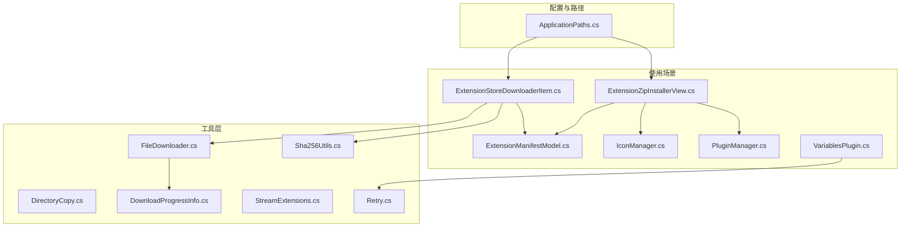
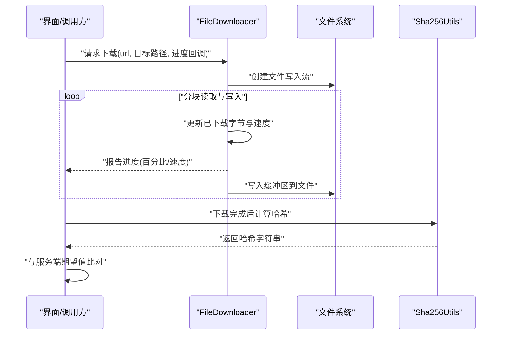
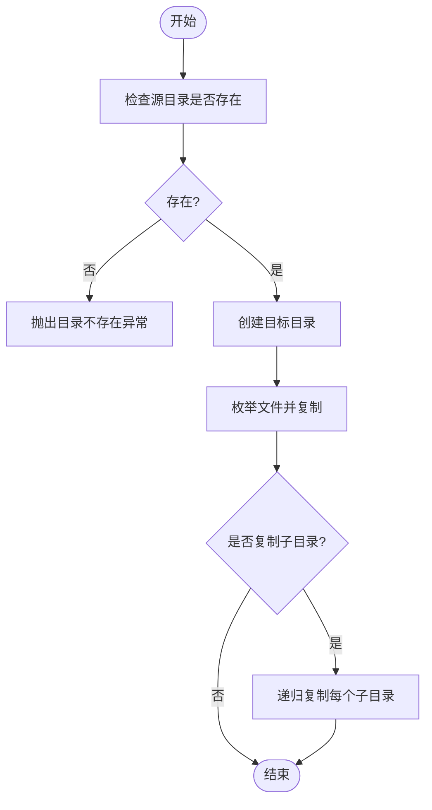
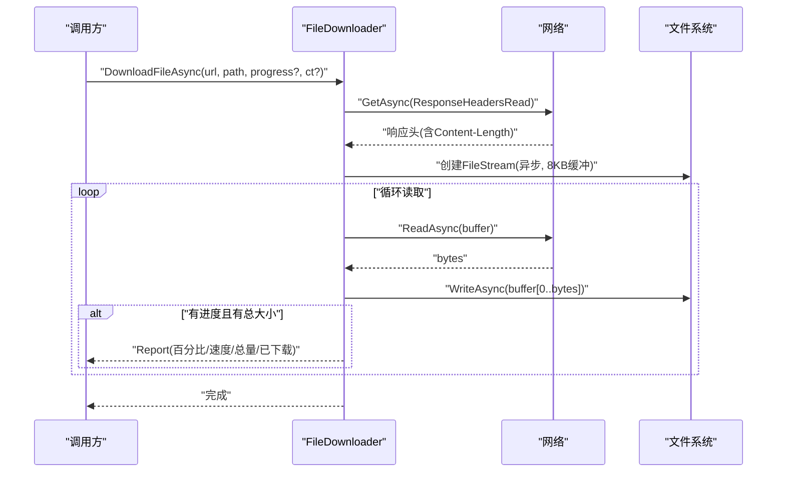
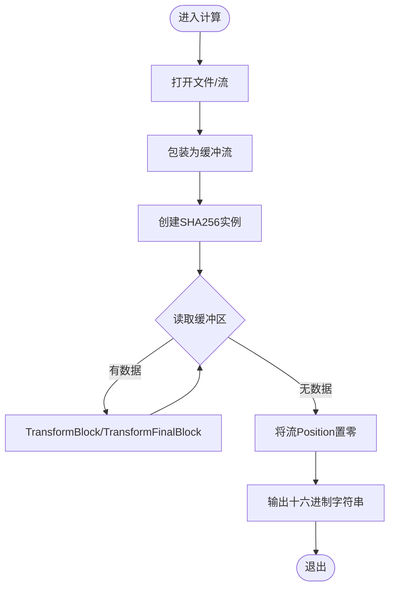
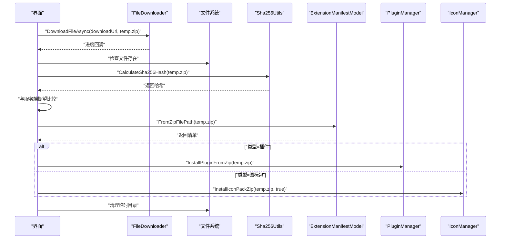
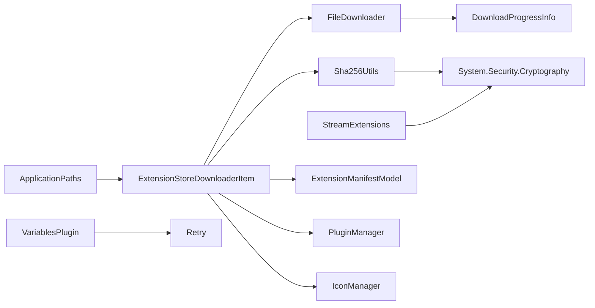

# 文件系统工具

<cite>
**本文引用的文件**
- [DirectoryCopy.cs](file://src/MacroDeck/Utils/DirectoryCopy.cs)
- [FileDownloader.cs](file://src/MacroDeck/Utils/FileDownloader.cs)
- [DownloadProgressInfo.cs](file://src/MacroDeck/DataTypes/FileDownloader/DownloadProgressInfo.cs)
- [Sha256Utils.cs](file://src/MacroDeck/Utils/Sha256Utils.cs)
- [StreamExtensions.cs](file://src/MacroDeck/Extension/StreamExtensions.cs)
- [Retry.cs](file://src/MacroDeck/Utils/Retry.cs)
- [ApplicationPaths.cs](file://src/MacroDeck/StartupConfig/ApplicationPaths.cs)
- [ExtensionStoreDownloaderItem.cs](file://src/MacroDeck/Utils/ExtensionStoreDownloaderItem.cs)
- [ExtensionZipInstallerView.cs](file://src/MacroDeck/Utils/ExtensionZipInstallerView.cs)
- [ExtensionManifestModel.cs](file://src/MacroDeck/Models/ExtensionManifestModel.cs)
- [IconManager.cs](file://src/MacroDeck/Icons/IconManager.cs)
- [PluginManager.cs](file://src/MacroDeck/Plugins/PluginManager.cs)
- [VariablesPlugin.cs](file://src/MacroDeck/InternalPlugins/Variables/VariablesPlugin.cs)
</cite>

## 目录
1. [简介](#简介)
2. [项目结构](#项目结构)
3. [核心组件](#核心组件)
4. [架构总览](#架构总览)
5. [组件详解](#组件详解)
6. [依赖关系分析](#依赖关系分析)
7. [性能与并发](#性能与并发)
8. [安全性与权限管理](#安全性与权限管理)
9. [使用示例与配置](#使用示例与配置)
10. [故障排查](#故障排查)
11. [结论](#结论)
12. [附录：扩展开发指南](#附录扩展开发指南)

## 简介
本文件系统工具模块围绕三类关键能力展开：目录复制、文件下载（含进度与取消）、以及哈希校验（SHA-256）。它们在应用启动路径初始化、扩展安装流程、变量读取等场景中被广泛使用，并通过统一的工具类与数据类型支撑跨模块的一致行为。

## 项目结构
文件系统工具主要分布在以下命名空间与文件中：
- 工具类与数据类型
  - Utils/DirectoryCopy.cs：目录复制
  - Utils/FileDownloader.cs：文件下载与进度上报
  - DataTypes/FileDownloader/DownloadProgressInfo.cs：下载进度数据模型
  - Utils/Sha256Utils.cs：文件/流 SHA-256 计算
  - Extension/StreamExtensions.cs：流扩展的 SHA-256 计算
  - Utils/Retry.cs：重试机制
- 路径与临时目录
  - StartupConfig/ApplicationPaths.cs：应用路径初始化与清理
- 使用场景
  - Utils/ExtensionStoreDownloaderItem.cs：扩展下载与校验
  - Utils/ExtensionZipInstallerView.cs：本地 ZIP 安装
  - Models/ExtensionManifestModel.cs：扩展清单解析
  - Icons/IconManager.cs、Plugins/PluginManager.cs：安装执行
  - InternalPlugins/Variables/VariablesPlugin.cs：变量文件读取与重试

图表来源
- [DirectoryCopy.cs:1-41](file://src/MacroDeck/Utils/DirectoryCopy.cs#L1-L41)
- [FileDownloader.cs:1-84](file://src/MacroDeck/Utils/FileDownloader.cs#L1-L84)
- [DownloadProgressInfo.cs:1-9](file://src/MacroDeck/DataTypes/FileDownloader/DownloadProgressInfo.cs#L1-L9)
- [Sha256Utils.cs:1-38](file://src/MacroDeck/Utils/Sha256Utils.cs#L1-L38)
- [StreamExtensions.cs:1-32](file://src/MacroDeck/Extension/StreamExtensions.cs#L1-L32)
- [Retry.cs:1-64](file://src/MacroDeck/Utils/Retry.cs#L1-L64)
- [ApplicationPaths.cs:1-143](file://src/MacroDeck/StartupConfig/ApplicationPaths.cs#L1-L143)
- [ExtensionStoreDownloaderItem.cs:1-210](file://src/MacroDeck/Utils/ExtensionStoreDownloaderItem.cs#L1-L210)
- [ExtensionZipInstallerView.cs:1-79](file://src/MacroDeck/Utils/ExtensionZipInstallerView.cs#L1-L79)
- [ExtensionManifestModel.cs:1-40](file://src/MacroDeck/Models/ExtensionManifestModel.cs#L1-L40)
- [IconManager.cs:352-387](file://src/MacroDeck/Icons/IconManager.cs#L352-L387)
- [PluginManager.cs](file://src/MacroDeck/Plugins/PluginManager.cs)
- [VariablesPlugin.cs:259-293](file://src/MacroDeck/InternalPlugins/Variables/VariablesPlugin.cs#L259-L293)

章节来源
- [ApplicationPaths.cs:1-143](file://src/MacroDeck/StartupConfig/ApplicationPaths.cs#L1-L143)

## 核心组件
- 目录复制：递归复制目录内容，支持是否复制子目录
- 文件下载：基于共享 HttpClient 的异步下载，支持进度回调、字节计数与速度估算
- 哈希计算：对文件或流进行 SHA-256 计算，支持缓冲流与位置复位
- 重试机制：对易瞬时失败的操作提供可配置重试
- 路径管理：统一初始化用户数据目录、插件目录、临时目录、日志目录等

章节来源
- [DirectoryCopy.cs:1-41](file://src/MacroDeck/Utils/DirectoryCopy.cs#L1-L41)
- [FileDownloader.cs:1-84](file://src/MacroDeck/Utils/FileDownloader.cs#L1-L84)
- [DownloadProgressInfo.cs:1-9](file://src/MacroDeck/DataTypes/FileDownloader/DownloadProgressInfo.cs#L1-L9)
- [Sha256Utils.cs:1-38](file://src/MacroDeck/Utils/Sha256Utils.cs#L1-L38)
- [StreamExtensions.cs:1-32](file://src/MacroDeck/Extension/StreamExtensions.cs#L1-L32)
- [Retry.cs:1-64](file://src/MacroDeck/Utils/Retry.cs#L1-L64)

## 架构总览
文件系统工具以“工具类 + 数据模型 + 场景调用”的方式组织，形成如下交互链路：
- 下载链路：FileDownloader 提供下载与进度；ExtensionStoreDownloaderItem 调用下载、校验与安装
- 校验链路：Sha256Utils 或 StreamExtensions 计算哈希，与服务端期望值比对
- 路径链路：ApplicationPaths 初始化路径，确保目录存在；临时目录用于下载与解压
- 安装链路：ExtensionZipInstallerView 与 ExtensionStoreDownloaderItem 解析清单后调用 PluginManager/IconManager 执行安装

图表来源
- [FileDownloader.cs:15-65](file://src/MacroDeck/Utils/FileDownloader.cs#L15-L65)
- [Sha256Utils.cs:8-37](file://src/MacroDeck/Utils/Sha256Utils.cs#L8-L37)

## 组件详解

### 目录复制（DirectoryCopy）
- 功能要点
  - 读取源目录文件与子目录，逐个复制到目标目录
  - 支持递归复制子目录
  - 若目标目录不存在则创建
- 错误处理
  - 源目录不存在时抛出异常
- 性能与复杂度
  - 时间复杂度 O(N)，N 为文件总数
  - 无并发控制，适合中小规模复制

图表来源
- [DirectoryCopy.cs:7-40](file://src/MacroDeck/Utils/DirectoryCopy.cs#L7-L40)

章节来源
- [DirectoryCopy.cs:1-41](file://src/MacroDeck/Utils/DirectoryCopy.cs#L1-L41)

### 文件下载（FileDownloader）
- 功能要点
  - 共享 HttpClient，避免重复连接开销
  - 使用 ResponseHeadersRead 获取响应头后立即开始读取
  - 分块读取（默认 8KB 缓冲），边读边写
  - 可选进度回调，包含总大小、已下载、速度与百分比
  - 支持取消令牌
  - 提供图片与 JSON 的便捷方法
- 错误处理
  - 确保状态码成功
  - 外部异常由调用方捕获
- 性能与并发
  - 单实例 HttpClient，减少 DNS/TLS 成本
  - 流式读写，内存占用低
  - 进度计算基于 Stopwatch，实时估算速度

图表来源
- [FileDownloader.cs:15-65](file://src/MacroDeck/Utils/FileDownloader.cs#L15-L65)

章节来源
- [FileDownloader.cs:1-84](file://src/MacroDeck/Utils/FileDownloader.cs#L1-L84)
- [DownloadProgressInfo.cs:1-9](file://src/MacroDeck/DataTypes/FileDownloader/DownloadProgressInfo.cs#L1-L9)

### 哈希计算（SHA-256）
- 文件级计算
  - 从文件打开只读流，使用缓冲流与 SHA256
  - 读取完毕后将流位置复位，保证后续读取不受影响
- 流级计算
  - 扩展方法对任意 Stream 计算哈希，逻辑同上
- 使用场景
  - 下载完成后校验完整性
  - 插件/图标包安装前的完整性检查

图表来源
- [Sha256Utils.cs:8-37](file://src/MacroDeck/Utils/Sha256Utils.cs#L8-L37)
- [StreamExtensions.cs:8-31](file://src/MacroDeck/Extension/StreamExtensions.cs#L8-L31)

章节来源
- [Sha256Utils.cs:1-38](file://src/MacroDeck/Utils/Sha256Utils.cs#L1-L38)
- [StreamExtensions.cs:1-32](file://src/MacroDeck/Extension/StreamExtensions.cs#L1-L32)

### 重试机制（Retry）
- 功能要点
  - 默认最多重试 3 次，间隔 1 秒
  - 支持 Action 与 Func<T> 两种委托
  - 多次失败收集异常，最终抛出聚合异常
- 使用场景
  - 变量文件读取等易受文件占用影响的操作

章节来源
- [Retry.cs:1-64](file://src/MacroDeck/Utils/Retry.cs#L1-L64)
- [VariablesPlugin.cs:276-293](file://src/MacroDeck/InternalPlugins/Variables/VariablesPlugin.cs#L276-L293)

### 路径与临时目录（ApplicationPaths）
- 功能要点
  - 初始化用户数据目录、插件目录、图标包目录、备份目录、日志目录、配置与数据库路径
  - 支持便携模式与标准模式
  - 启动时检查并创建缺失目录
  - 提供临时目录清理方法
- 安全性
  - 统一路径生成，避免相对路径歧义
  - 日志记录路径创建与清理过程

章节来源
- [ApplicationPaths.cs:36-102](file://src/MacroDeck/StartupConfig/ApplicationPaths.cs#L36-L102)
- [ApplicationPaths.cs:104-141](file://src/MacroDeck/StartupConfig/ApplicationPaths.cs#L104-L141)

### 扩展下载与安装（ExtensionStoreDownloaderItem）
- 功能要点
  - 下载扩展 ZIP 至临时目录
  - 下载完成后计算 SHA-256 并与服务端期望值比对
  - 解析扩展清单，按类型调用插件或图标包安装器
  - 清理临时目录残留
- 错误处理
  - 下载失败、校验失败、清单解析失败、安装异常均记录日志并终止流程

图表来源
- [ExtensionStoreDownloaderItem.cs:102-210](file://src/MacroDeck/Utils/ExtensionStoreDownloaderItem.cs#L102-L210)
- [Sha256Utils.cs:8-37](file://src/MacroDeck/Utils/Sha256Utils.cs#L8-L37)
- [ExtensionManifestModel.cs:38-40](file://src/MacroDeck/Models/ExtensionManifestModel.cs#L38-L40)
- [IconManager.cs:352-387](file://src/MacroDeck/Icons/IconManager.cs#L352-L387)
- [PluginManager.cs](file://src/MacroDeck/Plugins/PluginManager.cs)

章节来源
- [ExtensionStoreDownloaderItem.cs:1-210](file://src/MacroDeck/Utils/ExtensionStoreDownloaderItem.cs#L1-L210)
- [ExtensionManifestModel.cs:1-40](file://src/MacroDeck/Models/ExtensionManifestModel.cs#L1-L40)
- [IconManager.cs:352-387](file://src/MacroDeck/Icons/IconManager.cs#L352-L387)

### 本地 ZIP 安装（ExtensionZipInstallerView）
- 功能要点
  - 选择本地 ZIP，解析扩展清单
  - 根据类型调用插件或图标包安装器
- 错误处理
  - 非法或损坏的 ZIP 将记录错误并禁用安装按钮

章节来源
- [ExtensionZipInstallerView.cs:1-79](file://src/MacroDeck/Utils/ExtensionZipInstallerView.cs#L1-L79)
- [ExtensionManifestModel.cs:32-40](file://src/MacroDeck/Models/ExtensionManifestModel.cs#L32-L40)

## 依赖关系分析
- FileDownloader 依赖 System.Net.Http 与自定义进度数据类型
- Sha256Utils 与 StreamExtensions 依赖 System.Security.Cryptography
- ExtensionStoreDownloaderItem 依赖 FileDownloader、Sha256Utils、ExtensionManifestModel、PluginManager、IconManager
- ApplicationPaths 为多处组件提供统一路径
- Retry 在变量读取场景中被调用

图表来源
- [FileDownloader.cs:1-84](file://src/MacroDeck/Utils/FileDownloader.cs#L1-L84)
- [DownloadProgressInfo.cs:1-9](file://src/MacroDeck/DataTypes/FileDownloader/DownloadProgressInfo.cs#L1-L9)
- [Sha256Utils.cs:1-38](file://src/MacroDeck/Utils/Sha256Utils.cs#L1-L38)
- [StreamExtensions.cs:1-32](file://src/MacroDeck/Extension/StreamExtensions.cs#L1-L32)
- [ExtensionStoreDownloaderItem.cs:1-210](file://src/MacroDeck/Utils/ExtensionStoreDownloaderItem.cs#L1-L210)
- [ExtensionManifestModel.cs:1-40](file://src/MacroDeck/Models/ExtensionManifestModel.cs#L1-L40)
- [ApplicationPaths.cs:1-143](file://src/MacroDeck/StartupConfig/ApplicationPaths.cs#L1-L143)
- [VariablesPlugin.cs:276-293](file://src/MacroDeck/InternalPlugins/Variables/VariablesPlugin.cs#L276-L293)
- [Retry.cs:1-64](file://src/MacroDeck/Utils/Retry.cs#L1-L64)

## 性能与并发
- 连接复用
  - FileDownloader 使用静态 HttpClient，避免重复 DNS 与 TLS 握手
- 流式处理
  - 下载采用缓冲流与异步 IO，降低内存峰值
- 并发建议
  - 当前下载未内置并发队列；如需并发下载，建议在调用方维护任务队列与限速
- I/O 优化
  - 目录复制为顺序操作；大目录建议分批或后台线程执行
- 哈希计算
  - 使用 TransformBlock/TransformFinalBlock，避免一次性加载整个文件

章节来源
- [FileDownloader.cs:11-13](file://src/MacroDeck/Utils/FileDownloader.cs#L11-L13)
- [DirectoryCopy.cs:1-41](file://src/MacroDeck/Utils/DirectoryCopy.cs#L1-L41)
- [Sha256Utils.cs:14-37](file://src/MacroDeck/Utils/Sha256Utils.cs#L14-L37)

## 安全性与权限管理
- 权限与路径
  - ApplicationPaths 统一生成用户目录，避免跨用户或系统目录误写
  - 临时目录用于下载与解压，结束后清理
- 输入校验
  - 下载前检查目标文件是否存在并删除旧文件
  - 扩展安装前进行哈希校验，防止篡改
- 异常与日志
  - 所有关键步骤均记录日志，便于审计与排障
- 最佳实践
  - 对外部来源的 ZIP 严格校验哈希与清单
  - 安装过程中避免长时间持有文件句柄

章节来源
- [FileDownloader.cs:20-23](file://src/MacroDeck/Utils/FileDownloader.cs#L20-L23)
- [ExtensionStoreDownloaderItem.cs:142-152](file://src/MacroDeck/Utils/ExtensionStoreDownloaderItem.cs#L142-L152)
- [ApplicationPaths.cs:104-141](file://src/MacroDeck/StartupConfig/ApplicationPaths.cs#L104-L141)

## 使用示例与配置
- 目录复制
  - 调用复制函数，传入源路径、目标路径与是否递归
  - 注意：源目录必须存在
- 文件下载
  - 参数：URL、目标文件路径、进度回调、取消令牌
  - 进度信息包含总大小、已下载、速度与百分比
  - 返回：完成或异常
- 哈希计算
  - 文件：传入文件路径
  - 流：传入 Stream（内部会复位 Position）
- 重试
  - 对易失败的文件读取操作，使用默认或自定义间隔与次数
- 路径配置
  - 初始化 ApplicationPaths，确保各目录存在
  - 便携模式下，数据目录位于程序目录下的 Data 子目录

章节来源
- [DirectoryCopy.cs:7-40](file://src/MacroDeck/Utils/DirectoryCopy.cs#L7-L40)
- [FileDownloader.cs:15-65](file://src/MacroDeck/Utils/FileDownloader.cs#L15-L65)
- [DownloadProgressInfo.cs:1-9](file://src/MacroDeck/DataTypes/FileDownloader/DownloadProgressInfo.cs#L1-L9)
- [Sha256Utils.cs:8-37](file://src/MacroDeck/Utils/Sha256Utils.cs#L8-L37)
- [Retry.cs:9-29](file://src/MacroDeck/Utils/Retry.cs#L9-L29)
- [ApplicationPaths.cs:36-61](file://src/MacroDeck/StartupConfig/ApplicationPaths.cs#L36-L61)

## 故障排查
- 下载无法开始
  - 检查 URL 是否可达，确认网络与代理设置
  - 查看进度回调是否被正确传入
- 进度不更新
  - 确认 Content-Length 是否可用；当未知总大小时进度信息可能不显示
- 下载中断
  - 检查取消令牌是否被触发
  - 网络波动导致的异常应结合重试策略
- 校验失败
  - 确认服务端期望值是否正确
  - 重新下载并再次计算哈希
- 安装失败
  - 检查扩展清单格式与类型
  - 查看日志中的异常堆栈
- 临时目录未清理
  - ApplicationPaths.CleanUpTempDirectory 应在合适时机调用

章节来源
- [FileDownloader.cs:25-65](file://src/MacroDeck/Utils/FileDownloader.cs#L25-L65)
- [ExtensionStoreDownloaderItem.cs:134-152](file://src/MacroDeck/Utils/ExtensionStoreDownloaderItem.cs#L134-L152)
- [ApplicationPaths.cs:104-141](file://src/MacroDeck/StartupConfig/ApplicationPaths.cs#L104-L141)

## 结论
该文件系统工具模块以简洁稳定的 API 实现了目录复制、文件下载与哈希校验三大核心能力，并通过统一的路径管理与日志记录保障了安全性与可观测性。在扩展安装与变量读取等关键场景中，这些工具提供了可靠的基础能力。

## 附录：扩展开发指南
- 新增下载任务
  - 使用 FileDownloader.DownloadFileAsync，传入进度回调与取消令牌
  - 如需图片或 JSON，使用对应便捷方法
- 新增哈希校验
  - 对于文件：使用 Sha256Utils.CalculateSha256Hash
  - 对于流：使用 StreamExtensions.CalculateSha256Hash
- 新增重试逻辑
  - 对易失败的文件操作封装在 Retry.Do 中
- 新增安装流程
  - 解析 ExtensionManifestModel，根据类型调用 PluginManager 或 IconManager
  - 安装完成后清理临时目录

章节来源
- [FileDownloader.cs:15-82](file://src/MacroDeck/Utils/FileDownloader.cs#L15-L82)
- [Sha256Utils.cs:8-37](file://src/MacroDeck/Utils/Sha256Utils.cs#L8-L37)
- [StreamExtensions.cs:8-31](file://src/MacroDeck/Extension/StreamExtensions.cs#L8-L31)
- [Retry.cs:39-62](file://src/MacroDeck/Utils/Retry.cs#L39-L62)
- [ExtensionManifestModel.cs:32-40](file://src/MacroDeck/Models/ExtensionManifestModel.cs#L32-L40)
- [PluginManager.cs](file://src/MacroDeck/Plugins/PluginManager.cs)
- [IconManager.cs:352-387](file://src/MacroDeck/Icons/IconManager.cs#L352-L387)