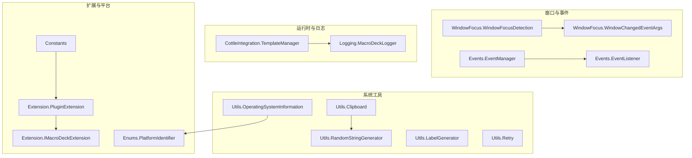
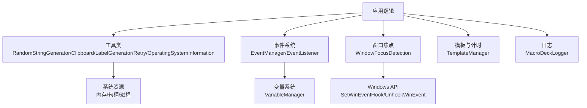
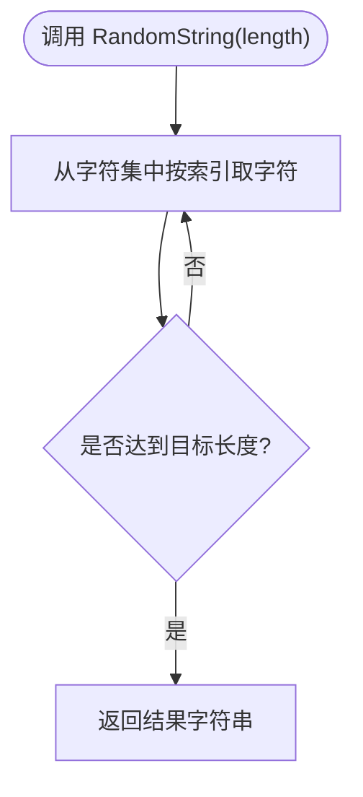
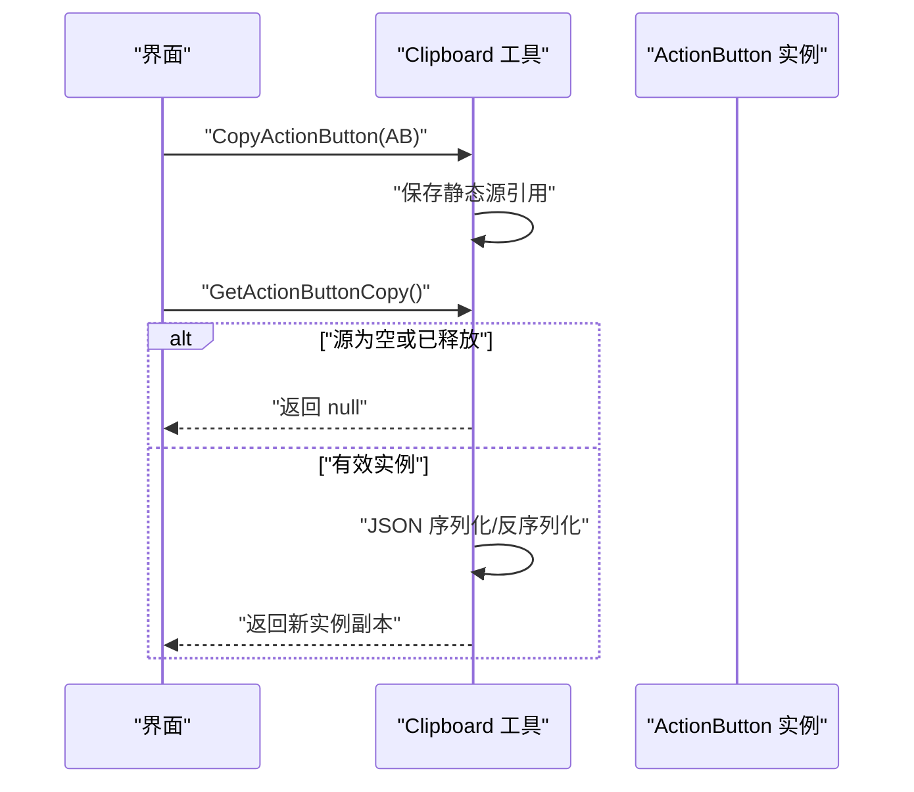
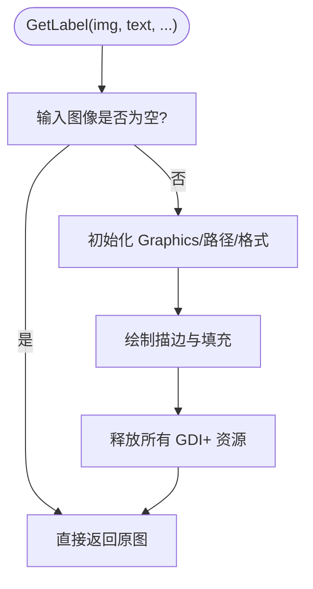
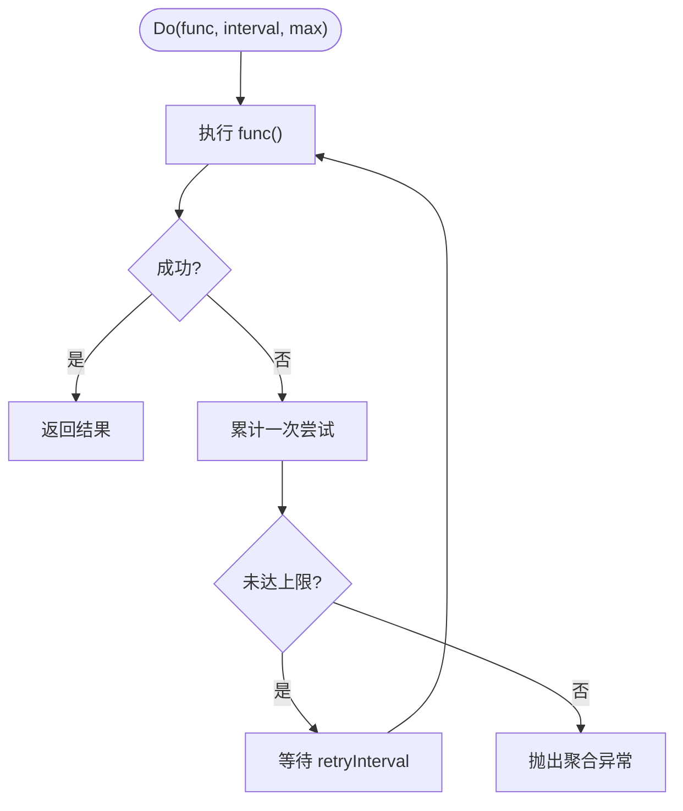
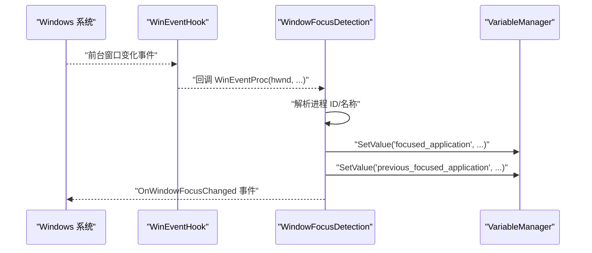
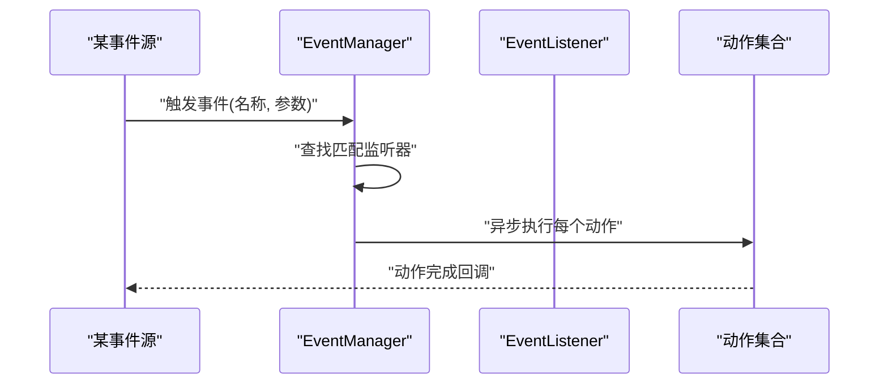
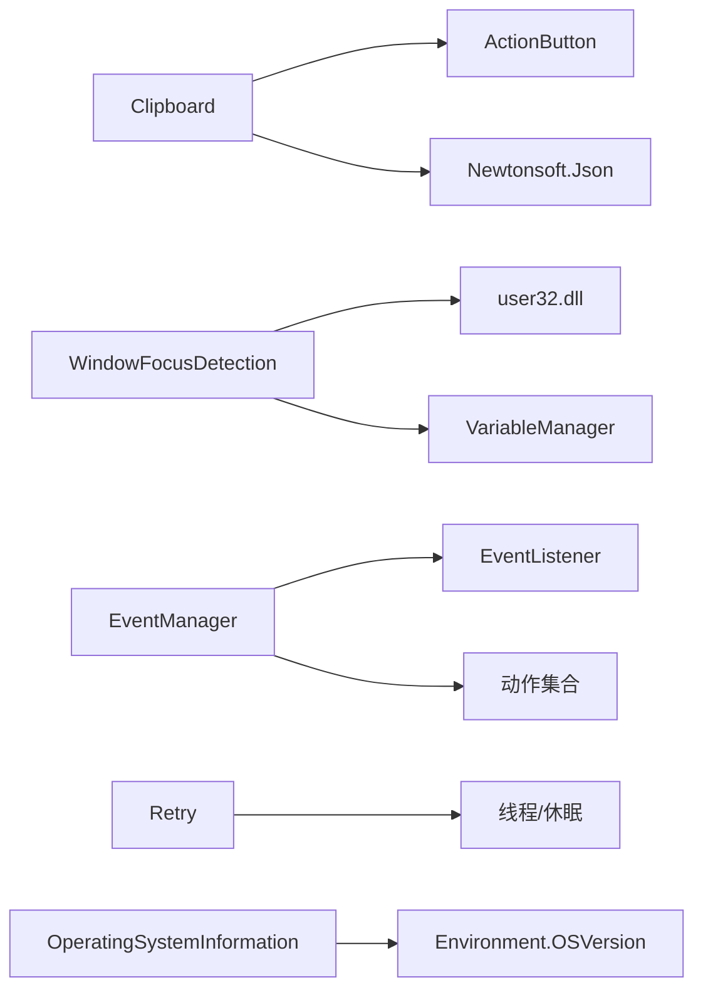

# 系统工具

<cite>
**本文引用的文件**
- [RandomStringGenerator.cs](file://src/MacroDeck/Utils/RandomStringGenerator.cs)
- [Clipboard.cs](file://src/MacroDeck/Utils/Clipboard.cs)
- [LabelGenerator.cs](file://src/MacroDeck/Utils/LabelGenerator.cs)
- [Retry.cs](file://src/MacroDeck/Utils/Retry.cs)
- [WindowFocusDetection.cs](file://src/MacroDeck/WindowFocus/WindowFocusDetection.cs)
- [WindowChangedEventArgs.cs](file://src/MacroDeck/WindowFocus/WindowChangedEventArgs.cs)
- [OperatingSystemInformation.cs](file://src/MacroDeck/Utils/OperatingSystemInformation.cs)
- [EventManager.cs](file://src/MacroDeck/Events/EventManager.cs)
- [EventListener.cs](file://src/MacroDeck/Events/EventListener.cs)
- [TemplateManager.cs](file://src/MacroDeck/CottleIntegration/TemplateManager.cs)
- [MacroDeckLogger.cs](file://src/MacroDeck/Logging/MacroDeckLogger.cs)
- [PlatformIdentifier.cs](file://src/MacroDeck/Enums/PlatformIdentifier.cs)
- [IMacroDeckExtension.cs](file://src/MacroDeck/Extension/IMacroDeckExtension.cs)
- [PluginExtension.cs](file://src/MacroDeck/Extension/PluginExtension.cs)
- [Constants.cs](file://src/MacroDeck/Constants.cs)
- [README.md](file://README.md)
</cite>

## 目录
1. [简介](#简介)
2. [项目结构](#项目结构)
3. [核心组件](#核心组件)
4. [架构总览](#架构总览)
5. [详细组件分析](#详细组件分析)
6. [依赖关系分析](#依赖关系分析)
7. [性能考量](#性能考量)
8. [故障排查指南](#故障排查指南)
9. [结论](#结论)
10. [附录](#附录)

## 简介
本章节面向 Macro-Deck 的“系统工具”能力，围绕以下主题展开：随机字符串生成、剪贴板操作、标签生成、重试机制、窗口焦点检测、事件处理与系统资源管理，并结合操作系统交互与兼容性进行说明。文档同时提供使用示例、配置要点、性能特性、错误处理与异常恢复策略，以及面向开发者的扩展与平台适配建议。

## 项目结构
系统工具主要分布在以下命名空间与文件中：
- Utils：通用工具类（随机字符串、剪贴板、标签生成、重试、操作系统信息）
- WindowFocus：窗口焦点检测与变更事件
- Events：事件注册与触发管线
- CottleIntegration：模板与计时器集成（用于性能与时间测量）
- Logging：日志记录（错误与异常）
- Extension：扩展接口与插件包装
- Enums：平台标识枚举
- Constants：常量定义（如扩展商店地址）

**图表来源**
- [RandomStringGenerator.cs:1-14](file://src/MacroDeck/Utils/RandomStringGenerator.cs#L1-L14)
- [Clipboard.cs:1-40](file://src/MacroDeck/Utils/Clipboard.cs#L1-L40)
- [LabelGenerator.cs:1-70](file://src/MacroDeck/Utils/LabelGenerator.cs#L1-L70)
- [Retry.cs:1-64](file://src/MacroDeck/Utils/Retry.cs#L1-L64)
- [OperatingSystemInformation.cs:1-55](file://src/MacroDeck/Utils/OperatingSystemInformation.cs#L1-L55)
- [WindowFocusDetection.cs:1-113](file://src/MacroDeck/WindowFocus/WindowFocusDetection.cs#L1-L113)
- [WindowChangedEventArgs.cs:1-9](file://src/MacroDeck/WindowFocus/WindowChangedEventArgs.cs#L1-L9)
- [EventManager.cs:1-42](file://src/MacroDeck/Events/EventManager.cs#L1-L42)
- [EventListener.cs:1-11](file://src/MacroDeck/Events/EventListener.cs#L1-L11)
- [TemplateManager.cs:111-145](file://src/MacroDeck/CottleIntegration/TemplateManager.cs#L111-L145)
- [MacroDeckLogger.cs:164-200](file://src/MacroDeck/Logging/MacroDeckLogger.cs#L164-L200)
- [PlatformIdentifier.cs:1-12](file://src/MacroDeck/Enums/PlatformIdentifier.cs#L1-L12)
- [IMacroDeckExtension.cs:1-13](file://src/MacroDeck/Extension/IMacroDeckExtension.cs#L1-L13)
- [PluginExtension.cs:1-23](file://src/MacroDeck/Extension/PluginExtension.cs#L1-L23)
- [Constants.cs:1-6](file://src/MacroDeck/Constants.cs#L1-L6)

**章节来源**
- [RandomStringGenerator.cs:1-14](file://src/MacroDeck/Utils/RandomStringGenerator.cs#L1-L14)
- [Clipboard.cs:1-40](file://src/MacroDeck/Utils/Clipboard.cs#L1-L40)
- [LabelGenerator.cs:1-70](file://src/MacroDeck/Utils/LabelGenerator.cs#L1-L70)
- [Retry.cs:1-64](file://src/MacroDeck/Utils/Retry.cs#L1-L64)
- [OperatingSystemInformation.cs:1-55](file://src/MacroDeck/Utils/OperatingSystemInformation.cs#L1-L55)
- [WindowFocusDetection.cs:1-113](file://src/MacroDeck/WindowFocus/WindowFocusDetection.cs#L1-L113)
- [WindowChangedEventArgs.cs:1-9](file://src/MacroDeck/WindowFocus/WindowChangedEventArgs.cs#L1-L9)
- [EventManager.cs:1-42](file://src/MacroDeck/Events/EventManager.cs#L1-L42)
- [EventListener.cs:1-11](file://src/MacroDeck/Events/EventListener.cs#L1-L11)
- [TemplateManager.cs:111-145](file://src/MacroDeck/CottleIntegration/TemplateManager.cs#L111-L145)
- [MacroDeckLogger.cs:164-200](file://src/MacroDeck/Logging/MacroDeckLogger.cs#L164-L200)
- [PlatformIdentifier.cs:1-12](file://src/MacroDeck/Enums/PlatformIdentifier.cs#L1-L12)
- [IMacroDeckExtension.cs:1-13](file://src/MacroDeck/Extension/IMacroDeckExtension.cs#L1-L13)
- [PluginExtension.cs:1-23](file://src/MacroDeck/Extension/PluginExtension.cs#L1-L23)
- [Constants.cs:1-6](file://src/MacroDeck/Constants.cs#L1-L6)

## 核心组件
- 随机字符串生成：基于加密安全的随机数生成字符集拼接，适合生成令牌、会话 ID 等。
- 剪贴板操作：在应用内复制 ActionButton 实例，采用 JSON 序列化/反序列化实现深拷贝。
- 标签生成：在图像上绘制文本标签，支持位置、字体、颜色与阴影等参数。
- 重试机制：对任意 Action/Func 提供带间隔与最大次数的重试封装，聚合异常。
- 窗口焦点检测：通过 Windows API 挂接系统事件，监听前台窗口变化并发布事件。
- 事件处理：集中注册事件，按名称与参数匹配触发动作列表。
- 操作系统信息：解析当前 Windows 版本与位数，便于兼容性判断。
- 日志与计时：日志统一入口；模板引擎提供计时函数，辅助性能度量。

**章节来源**
- [RandomStringGenerator.cs:1-14](file://src/MacroDeck/Utils/RandomStringGenerator.cs#L1-L14)
- [Clipboard.cs:1-40](file://src/MacroDeck/Utils/Clipboard.cs#L1-L40)
- [LabelGenerator.cs:1-70](file://src/MacroDeck/Utils/LabelGenerator.cs#L1-L70)
- [Retry.cs:1-64](file://src/MacroDeck/Utils/Retry.cs#L1-L64)
- [WindowFocusDetection.cs:1-113](file://src/MacroDeck/WindowFocus/WindowFocusDetection.cs#L1-L113)
- [EventManager.cs:1-42](file://src/MacroDeck/Events/EventManager.cs#L1-L42)
- [OperatingSystemInformation.cs:1-55](file://src/MacroDeck/Utils/OperatingSystemInformation.cs#L1-L55)
- [MacroDeckLogger.cs:164-200](file://src/MacroDeck/Logging/MacroDeckLogger.cs#L164-L200)
- [TemplateManager.cs:111-145](file://src/MacroDeck/CottleIntegration/TemplateManager.cs#L111-L145)

## 架构总览
系统工具围绕“工具类 + 平台交互 + 事件驱动 + 资源管理”的模式组织。工具类负责通用能力；平台交互通过 Windows API 与系统服务集成；事件驱动贯穿按钮动作与窗口焦点；资源管理体现在句柄释放、对象析构与日志记录。

**图表来源**
- [WindowFocusDetection.cs:1-113](file://src/MacroDeck/WindowFocus/WindowFocusDetection.cs#L1-L113)
- [EventManager.cs:1-42](file://src/MacroDeck/Events/EventManager.cs#L1-L42)
- [TemplateManager.cs:111-145](file://src/MacroDeck/CottleIntegration/TemplateManager.cs#L111-L145)
- [MacroDeckLogger.cs:164-200](file://src/MacroDeck/Logging/MacroDeckLogger.cs#L164-L200)

## 详细组件分析

### 随机字符串生成
- 功能概述：生成指定长度的随机字符串，字符集包含字母与数字。
- 实现要点：使用加密安全的随机源，避免伪随机带来的可预测性。
- 使用场景：令牌生成、临时标识符、测试数据等。
- 性能与复杂度：O(n)，线性时间与长度成正比；内存开销小。
- 兼容性：跨平台可用，但字符集可按需求扩展。

**图表来源**
- [RandomStringGenerator.cs:1-14](file://src/MacroDeck/Utils/RandomStringGenerator.cs#L1-L14)

**章节来源**
- [RandomStringGenerator.cs:1-14](file://src/MacroDeck/Utils/RandomStringGenerator.cs#L1-L14)

### 剪贴板操作（ActionButton 复制）
- 功能概述：在应用内复制 ActionButton 实例，内部以 JSON 序列化/反序列化实现深拷贝。
- 安全与健壮性：包含空值与释放检查；JSON 序列化设置忽略空值并捕获序列化错误。
- 使用场景：按钮编辑器中的复制/粘贴、批量配置迁移。
- 注意事项：仅限同一进程内的实例复制；跨进程需自定义序列化方案。

**图表来源**
- [Clipboard.cs:1-40](file://src/MacroDeck/Utils/Clipboard.cs#L1-L40)

**章节来源**
- [Clipboard.cs:1-40](file://src/MacroDeck/Utils/Clipboard.cs#L1-L40)

### 标签生成（图像水印/文字叠加）
- 功能概述：在给定图像上绘制文本标签，支持位置、字体、颜色与阴影偏移。
- 资源管理：显式释放 Graphics/Pen/Brush/Font/StringFormat 等 GDI+ 对象，避免资源泄漏。
- 使用场景：按钮图标上的文字标注、预览图生成。
- 性能提示：频繁绘制建议缓存字体与画笔；大图处理注意内存峰值。

**图表来源**
- [LabelGenerator.cs:1-70](file://src/MacroDeck/Utils/LabelGenerator.cs#L1-L70)

**章节来源**
- [LabelGenerator.cs:1-70](file://src/MacroDeck/Utils/LabelGenerator.cs#L1-L70)

### 重试机制（幂等与退避）
- 功能概述：对 Action/Func 执行提供重试控制，支持自定义间隔与最大尝试次数。
- 异常聚合：多次失败后抛出聚合异常，便于诊断。
- 使用场景：网络请求、文件 IO、外部服务调用等不稳定操作。
- 参数建议：默认 3 次、1 秒间隔；可根据业务调整。

**图表来源**
- [Retry.cs:1-64](file://src/MacroDeck/Utils/Retry.cs#L1-L64)

**章节来源**
- [Retry.cs:1-64](file://src/MacroDeck/Utils/Retry.cs#L1-L64)

### 窗口焦点检测（系统级事件）
- 功能概述：通过 Windows API 设置系统事件钩子，监听前台窗口变化，发布事件并更新变量。
- 事件模型：事件参数包含新旧进程名；变量系统同步写入“聚焦应用”与“前一应用”。
- 资源管理：持有委托引用防止 GC 回收；Dispose 中解钩并释放句柄。
- 兼容性：仅 Windows 平台可用；需注意权限与系统版本差异。

**图表来源**
- [WindowFocusDetection.cs:1-113](file://src/MacroDeck/WindowFocus/WindowFocusDetection.cs#L1-L113)
- [WindowChangedEventArgs.cs:1-9](file://src/MacroDeck/WindowFocus/WindowChangedEventArgs.cs#L1-L9)

**章节来源**
- [WindowFocusDetection.cs:1-113](file://src/MacroDeck/WindowFocus/WindowFocusDetection.cs#L1-L113)
- [WindowChangedEventArgs.cs:1-9](file://src/MacroDeck/WindowFocus/WindowChangedEventArgs.cs#L1-L9)

### 事件处理（集中注册与触发）
- 功能概述：集中注册事件，按名称与参数匹配触发对应动作集合；异步执行避免阻塞。
- 数据结构：事件监听器包含事件名、参数与动作列表。
- 使用场景：按键事件、窗口焦点变化、定时器等触发后续动作。

**图表来源**
- [EventManager.cs:1-42](file://src/MacroDeck/Events/EventManager.cs#L1-L42)
- [EventListener.cs:1-11](file://src/MacroDeck/Events/EventListener.cs#L1-L11)

**章节来源**
- [EventManager.cs:1-42](file://src/MacroDeck/Events/EventManager.cs#L1-L42)
- [EventListener.cs:1-11](file://src/MacroDeck/Events/EventListener.cs#L1-L11)

### 操作系统信息（版本与位数）
- 功能概述：解析当前 Windows 主次版本与构建号，并标注 32/64 位。
- 使用场景：兼容性判断、日志输出、条件分支。
- 注意：对非 Windows 平台无意义，需在调用处做平台分支。

**章节来源**
- [OperatingSystemInformation.cs:1-55](file://src/MacroDeck/Utils/OperatingSystemInformation.cs#L1-L55)

### 日志与计时（性能度量辅助）
- 日志：统一错误/警告/致命级别记录，支持插件上下文。
- 计时：模板引擎提供获取时间戳与计算耗时的函数，便于性能分析。

**章节来源**
- [MacroDeckLogger.cs:164-200](file://src/MacroDeck/Logging/MacroDeckLogger.cs#L164-L200)
- [TemplateManager.cs:111-145](file://src/MacroDeck/CottleIntegration/TemplateManager.cs#L111-L145)

## 依赖关系分析
- 组件耦合：Clipboard 依赖 ActionButton 类型；WindowFocusDetection 依赖 Windows API 与变量系统；事件系统与动作绑定松耦合。
- 外部依赖：Newtonsoft.Json 用于 Clipboard 的深拷贝；System.Diagnostics 与 user32.dll 用于窗口焦点检测。
- 平台依赖：窗口焦点检测与操作系统信息明确依赖 Windows。

**图表来源**
- [Clipboard.cs:1-40](file://src/MacroDeck/Utils/Clipboard.cs#L1-L40)
- [WindowFocusDetection.cs:1-113](file://src/MacroDeck/WindowFocus/WindowFocusDetection.cs#L1-L113)
- [EventManager.cs:1-42](file://src/MacroDeck/Events/EventManager.cs#L1-L42)
- [Retry.cs:1-64](file://src/MacroDeck/Utils/Retry.cs#L1-L64)
- [OperatingSystemInformation.cs:1-55](file://src/MacroDeck/Utils/OperatingSystemInformation.cs#L1-L55)

**章节来源**
- [Clipboard.cs:1-40](file://src/MacroDeck/Utils/Clipboard.cs#L1-L40)
- [WindowFocusDetection.cs:1-113](file://src/MacroDeck/WindowFocus/WindowFocusDetection.cs#L1-L113)
- [EventManager.cs:1-42](file://src/MacroDeck/Events/EventManager.cs#L1-L42)
- [Retry.cs:1-64](file://src/MacroDeck/Utils/Retry.cs#L1-L64)
- [OperatingSystemInformation.cs:1-55](file://src/MacroDeck/Utils/OperatingSystemInformation.cs#L1-L55)

## 性能考量
- 随机字符串生成：O(n)，CPU 负载低；字符集越大，选择成本略增。
- 剪贴板复制：JSON 序列化/反序列化成本与对象大小相关；建议仅在必要时进行深拷贝。
- 标签生成：GDI+ 绘制涉及大量对象创建与释放，需确保及时 Dispose；大图与高频绘制应缓存资源。
- 重试机制：每次重试有固定等待时间，总耗时随最大次数线性增长；建议根据失败概率与容忍度调整。
- 窗口焦点检测：事件回调在前台切换频繁时可能产生高频率调用，注意避免在回调中执行重型任务；可引入节流或去抖。
- 日志与计时：日志写入为 I/O 密集；模板计时函数轻量，适合短流程统计。

[本节为通用性能讨论，不直接分析具体代码文件]

## 故障排查指南
- 剪贴板复制返回 null
  - 可能原因：源实例为空或已被释放；检查调用时机与生命周期。
  - 处理建议：在复制前校验实例状态；避免跨进程/跨应用共享控件实例。
- 窗口焦点事件无效
  - 可能原因：Windows API 句柄未正确挂接或被释放；权限不足。
  - 处理建议：确认构造与 Dispose 调用顺序；以管理员身份运行；检查系统版本。
- 重试仍失败
  - 可能原因：异常类型未被捕获或超过最大尝试次数。
  - 处理建议：查看聚合异常堆栈；调整间隔与次数；对幂等性进行设计。
- 标签生成导致内存增长
  - 可能原因：未释放 GDI+ 对象；重复创建相同字体/画刷。
  - 处理建议：复用资源；确保 Dispose 调用链完整；监控内存曲线。
- 日志缺失或级别不对
  - 可能原因：日志配置未启用相应级别；插件上下文未传入。
  - 处理建议：检查日志配置；使用带插件参数的重载方法。

**章节来源**
- [Clipboard.cs:1-40](file://src/MacroDeck/Utils/Clipboard.cs#L1-L40)
- [WindowFocusDetection.cs:1-113](file://src/MacroDeck/WindowFocus/WindowFocusDetection.cs#L1-L113)
- [Retry.cs:1-64](file://src/MacroDeck/Utils/Retry.cs#L1-L64)
- [LabelGenerator.cs:1-70](file://src/MacroDeck/Utils/LabelGenerator.cs#L1-L70)
- [MacroDeckLogger.cs:164-200](file://src/MacroDeck/Logging/MacroDeckLogger.cs#L164-L200)

## 结论
系统工具模块以简洁、稳定为核心目标，覆盖了随机字符串、剪贴板、标签生成、重试、窗口焦点检测与事件处理等关键能力。通过合理的资源管理与日志记录，这些工具在 Windows 平台上提供了可靠的系统级交互能力。对于跨平台与更高性能场景，可在现有基础上扩展平台抽象层与缓存策略。

[本节为总结性内容，不直接分析具体代码文件]

## 附录

### 使用示例与配置要点
- 随机字符串生成
  - 场景：生成一次性令牌或测试标识符。
  - 建议：根据安全需求选择合适长度；避免在高频路径中重复创建大字符串。
  - 参考路径：[RandomStringGenerator.cs:1-14](file://src/MacroDeck/Utils/RandomStringGenerator.cs#L1-L14)
- 剪贴板复制 ActionButton
  - 场景：在按钮编辑器中复制/粘贴配置。
  - 建议：在 UI 层面保证实例有效性；避免跨会话持久化控件引用。
  - 参考路径：[Clipboard.cs:1-40](file://src/MacroDeck/Utils/Clipboard.cs#L1-L40)
- 标签生成
  - 场景：为按钮图标添加文字标签。
  - 建议：统一字体与颜色；在高频绘制时缓存资源；注意 Dispose。
  - 参考路径：[LabelGenerator.cs:1-70](file://src/MacroDeck/Utils/LabelGenerator.cs#L1-L70)
- 重试机制
  - 场景：对外部服务或不稳定 IO 进行退避重试。
  - 建议：区分可重试异常；合理设置间隔与上限；记录聚合异常。
  - 参考路径：[Retry.cs:1-64](file://src/MacroDeck/Utils/Retry.cs#L1-L64)
- 窗口焦点检测
  - 场景：基于前台应用执行自动化动作。
  - 建议：在回调中执行轻量逻辑；必要时引入节流；关注权限与兼容性。
  - 参考路径：[WindowFocusDetection.cs:1-113](file://src/MacroDeck/WindowFocus/WindowFocusDetection.cs#L1-L113)
- 事件处理
  - 场景：按键或焦点变化触发一系列动作。
  - 建议：监听器参数大小写敏感；动作执行异步化。
  - 参考路径：[EventManager.cs:1-42](file://src/MacroDeck/Events/EventManager.cs#L1-L42)、[EventListener.cs:1-11](file://src/MacroDeck/Events/EventListener.cs#L1-L11)
- 操作系统信息
  - 场景：兼容性判断与日志输出。
  - 建议：在启动阶段读取并缓存；对非 Windows 平台做分支处理。
  - 参考路径：[OperatingSystemInformation.cs:1-55](file://src/MacroDeck/Utils/OperatingSystemInformation.cs#L1-L55)

### 开发者扩展与平台适配
- 扩展接口
  - IMacroDeckExtension：定义扩展类型、显示名、可配置性与卸载行为。
  - PluginExtension：对插件的包装，暴露可配置能力。
  - 参考路径：[IMacroDeckExtension.cs:1-13](file://src/MacroDeck/Extension/IMacroDeckExtension.cs#L1-L13)、[PluginExtension.cs:1-23](file://src/MacroDeck/Extension/PluginExtension.cs#L1-L23)
- 平台标识
  - PlatformIdentifier：统一平台枚举，便于条件编译与运行时判断。
  - 参考路径：[PlatformIdentifier.cs:1-12](file://src/MacroDeck/Enums/PlatformIdentifier.cs#L1-L12)
- 扩展商店常量
  - Constants：扩展商店 API 基础地址等常量。
  - 参考路径：[Constants.cs:1-6](file://src/MacroDeck/Constants.cs#L1-L6)
- 插件开发指引
  - 参考项目自述文件中的插件开发说明与 NuGet 包引用方式。
  - 参考路径：[README.md:21-32](file://README.md#L21-L32)

**章节来源**
- [IMacroDeckExtension.cs:1-13](file://src/MacroDeck/Extension/IMacroDeckExtension.cs#L1-L13)
- [PluginExtension.cs:1-23](file://src/MacroDeck/Extension/PluginExtension.cs#L1-L23)
- [PlatformIdentifier.cs:1-12](file://src/MacroDeck/Enums/PlatformIdentifier.cs#L1-L12)
- [Constants.cs:1-6](file://src/MacroDeck/Constants.cs#L1-L6)
- [README.md:21-32](file://README.md#L21-L32)