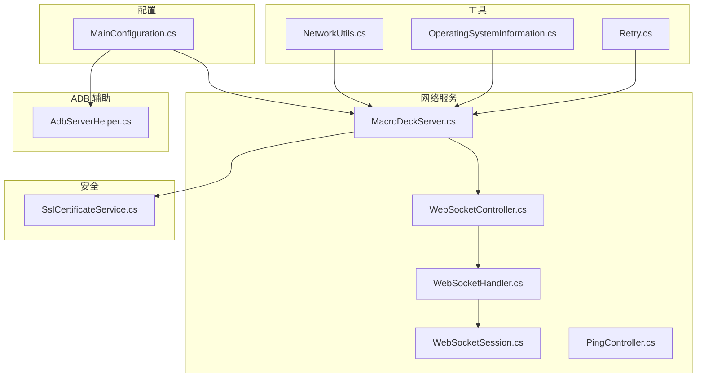
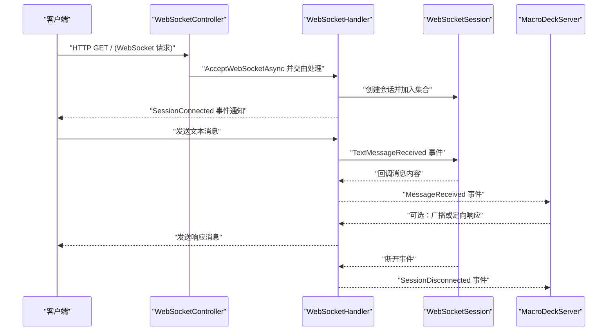
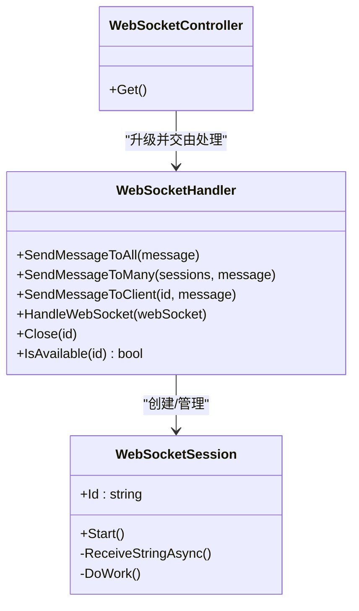
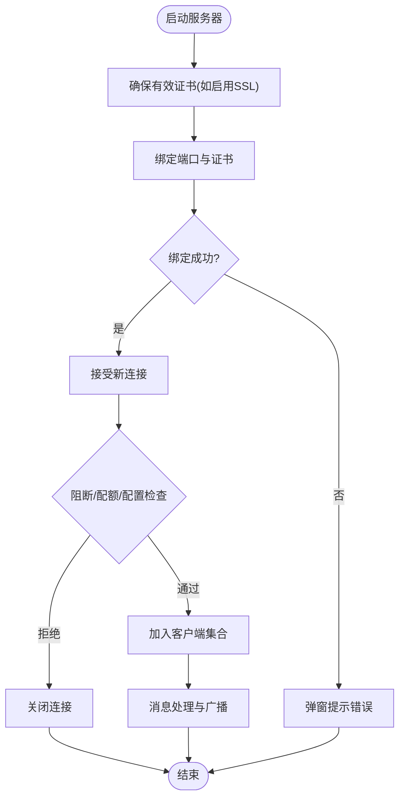
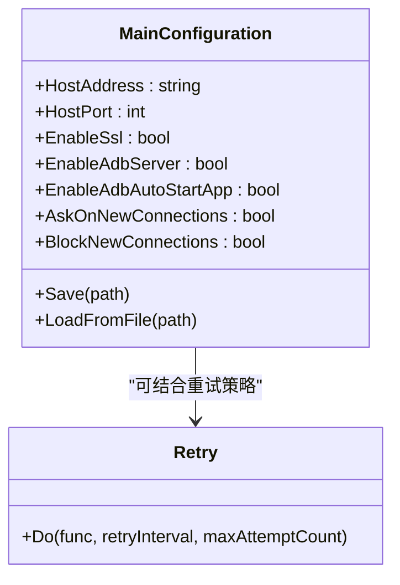
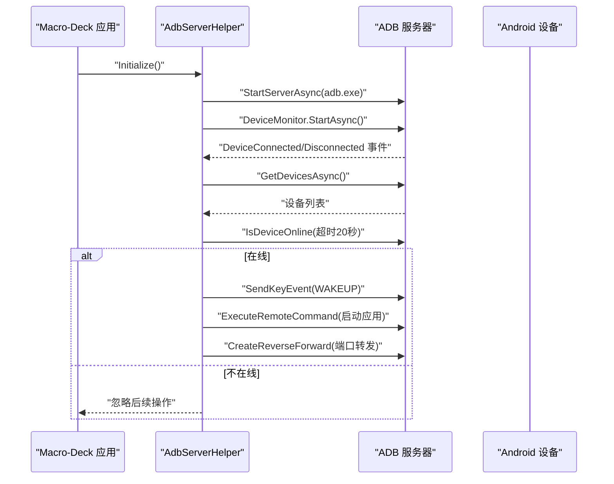
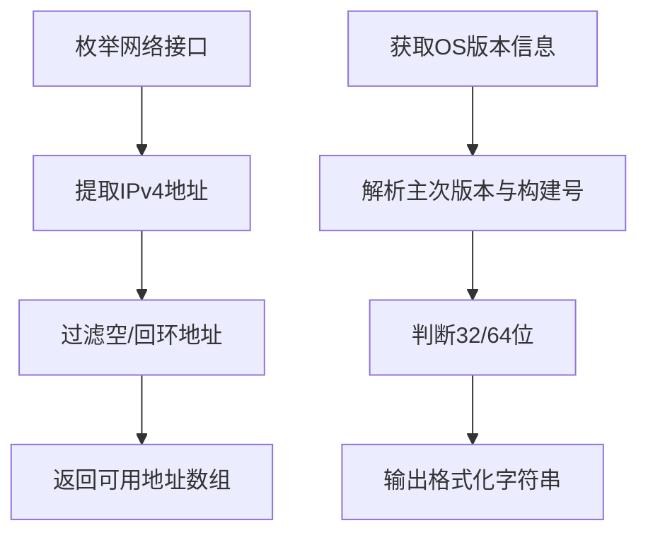
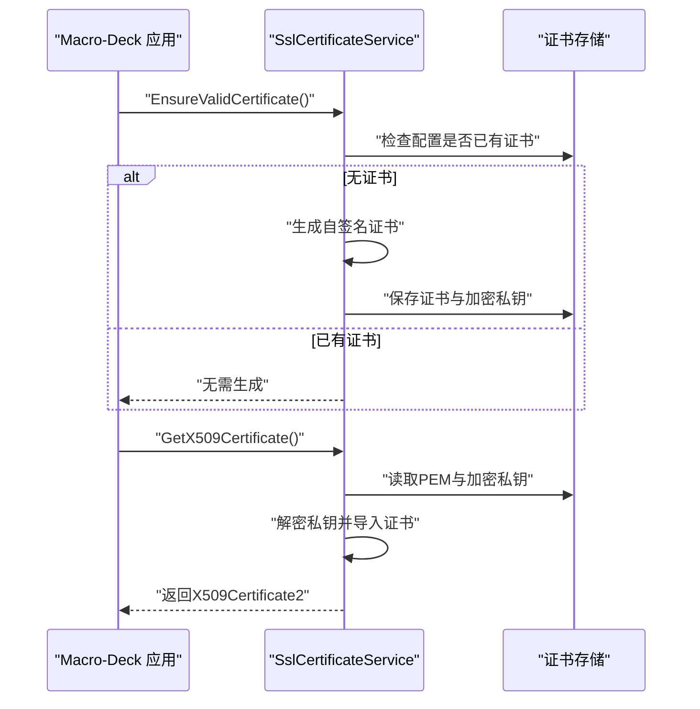
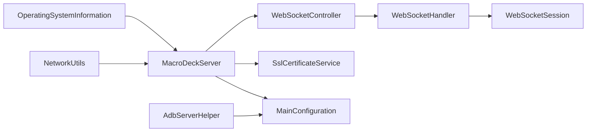

# 网络工具

<cite>
**本文引用的文件**
- [AdbServerHelper.cs](file://src/MacroDeck/Server/AdbServerHelper.cs)
- [NetworkUtils.cs](file://src/MacroDeck/Utils/NetworkUtils.cs)
- [OperatingSystemInformation.cs](file://src/MacroDeck/Utils/OperatingSystemInformation.cs)
- [MainConfiguration.cs](file://src/MacroDeck/Configuration/MainConfiguration.cs)
- [MacroDeckServer.cs](file://src/MacroDeck/Server/MacroDeckServer.cs)
- [WebSocketController.cs](file://src/MacroDeck/Controllers/WebSocketController.cs)
- [WebSocketHandler.cs](file://src/MacroDeck/WebSocketHandler.cs)
- [WebSocketSession.cs](file://src/MacroDeck/DataTypes/WebSocketSession.cs)
- [PingController.cs](file://src/MacroDeck/Controllers/PingController.cs)
- [SslCertificateService.cs](file://src/MacroDeck/Services/SslCertificateService.cs)
- [Retry.cs](file://src/MacroDeck/Utils/Retry.cs)
</cite>

## 目录
1. [简介](#简介)
2. [项目结构](#项目结构)
3. [核心组件](#核心组件)
4. [架构总览](#架构总览)
5. [详细组件分析](#详细组件分析)
6. [依赖关系分析](#依赖关系分析)
7. [性能考量](#性能考量)
8. [故障排除指南](#故障排除指南)
9. [结论](#结论)
10. [附录](#附录)

## 简介
本文件系统性梳理 Macro-Deck 的网络工具与相关能力，覆盖以下主题：
- 网络连接管理：WebSocket 服务端、会话生命周期、连接限制与阻断策略
- 操作系统信息获取：Windows 版本识别与位数信息
- ADB 服务器辅助：ADB 启动、设备监听、自动启动应用与反向转发
- 配置项与超时处理：主机地址/端口、SSL 开关、ADB 自动化开关、重试机制
- 跨平台网络兼容性与防火墙策略：当前实现面向 Windows，网络接口枚举与本地回环策略
- 安全与认证：自签名证书生成与加载、客户端跳过校验的前端行为
- 性能监控与诊断：日志记录、超时控制、并发消息广播
- 扩展开发指导：如何在现有框架上扩展网络功能

## 项目结构
网络工具相关代码主要分布在以下模块：
- 服务器层：WebSocket 控制器、会话处理器、服务器启动入口
- 配置层：全局配置 MainConfiguration，承载主机地址、端口、SSL、ADB 开关等
- 工具层：网络接口枚举、操作系统信息、重试机制
- ADB 辅助：ADB 服务器初始化、设备连接事件、自动启动应用与反向转发
- 安全层：SSL 证书服务（自签名生成、加载、验证）

**图表来源**
- [MainConfiguration.cs:1-103](file://src/MacroDeck/Configuration/MainConfiguration.cs#L1-L103)
- [MacroDeckServer.cs:38-117](file://src/MacroDeck/Server/MacroDeckServer.cs#L38-L117)
- [WebSocketController.cs:1-21](file://src/MacroDeck/Controllers/WebSocketController.cs#L1-L21)
- [WebSocketHandler.cs:1-91](file://src/MacroDeck/WebSocketHandler.cs#L1-L91)
- [WebSocketSession.cs:1-55](file://src/MacroDeck/DataTypes/WebSocketSession.cs#L1-L55)
- [PingController.cs:1-15](file://src/MacroDeck/Controllers/PingController.cs#L1-L15)
- [NetworkUtils.cs:1-30](file://src/MacroDeck/Utils/NetworkUtils.cs#L1-L30)
- [OperatingSystemInformation.cs:1-55](file://src/MacroDeck/Utils/OperatingSystemInformation.cs#L1-L55)
- [Retry.cs:36-63](file://src/MacroDeck/Utils/Retry.cs#L36-L63)
- [AdbServerHelper.cs:1-221](file://src/MacroDeck/Server/AdbServerHelper.cs#L1-L221)
- [SslCertificateService.cs:1-91](file://src/MacroDeck/Services/SslCertificateService.cs#L1-L91)

**章节来源**
- [MainConfiguration.cs:1-103](file://src/MacroDeck/Configuration/MainConfiguration.cs#L1-L103)
- [MacroDeckServer.cs:38-117](file://src/MacroDeck/Server/MacroDeckServer.cs#L38-L117)
- [WebSocketController.cs:1-21](file://src/MacroDeck/Controllers/WebSocketController.cs#L1-L21)
- [WebSocketHandler.cs:1-91](file://src/MacroDeck/WebSocketHandler.cs#L1-L91)
- [WebSocketSession.cs:1-55](file://src/MacroDeck/DataTypes/WebSocketSession.cs#L1-L55)
- [PingController.cs:1-15](file://src/MacroDeck/Controllers/PingController.cs#L1-L15)
- [NetworkUtils.cs:1-30](file://src/MacroDeck/Utils/NetworkUtils.cs#L1-L30)
- [OperatingSystemInformation.cs:1-55](file://src/MacroDeck/Utils/OperatingSystemInformation.cs#L1-L55)
- [Retry.cs:36-63](file://src/MacroDeck/Utils/Retry.cs#L36-L63)
- [AdbServerHelper.cs:1-221](file://src/MacroDeck/Server/AdbServerHelper.cs#L1-L221)
- [SslCertificateService.cs:1-91](file://src/MacroDeck/Services/SslCertificateService.cs#L1-L91)

## 核心组件
- WebSocket 服务与控制器
  - WebSocketController 提供根路径的 WebSocket 升级入口，返回空结果以维持连接
  - WebSocketHandler 统一会话生命周期，支持广播、按 ID 发送、关闭与可用性检查
  - WebSocketSession 封装单个连接的接收循环、异常与断开事件
- 服务器启动与配置
  - MacroDeckServer 基于配置选择启用 SSL 并调用服务器助手进行端口与证书设置；处理启动失败弹窗提示
  - MainConfiguration 提供主机地址、端口、SSL、ADB 开关、连接阻断等配置项
- 网络与系统工具
  - NetworkUtils 枚举本机 IPv4 地址（排除回环）
  - OperatingSystemInformation 获取 Windows 版本名称与位数信息
  - Retry 提供带间隔的重试执行器
- ADB 服务器辅助
  - AdbServerHelper 在启用时启动 ADB 服务器，监听设备连接/断开，自动启动应用与反向转发端口
- 安全与证书
  - SslCertificateService 在启用 SSL 且未配置证书时生成自签名证书，并提供加载与校验能力

**章节来源**
- [WebSocketController.cs:1-21](file://src/MacroDeck/Controllers/WebSocketController.cs#L1-L21)
- [WebSocketHandler.cs:1-91](file://src/MacroDeck/WebSocketHandler.cs#L1-L91)
- [WebSocketSession.cs:1-55](file://src/MacroDeck/DataTypes/WebSocketSession.cs#L1-L55)
- [MacroDeckServer.cs:38-117](file://src/MacroDeck/Server/MacroDeckServer.cs#L38-L117)
- [MainConfiguration.cs:46-71](file://src/MacroDeck/Configuration/MainConfiguration.cs#L46-L71)
- [NetworkUtils.cs:11-28](file://src/MacroDeck/Utils/NetworkUtils.cs#L11-L28)
- [OperatingSystemInformation.cs:5-53](file://src/MacroDeck/Utils/OperatingSystemInformation.cs#L5-L53)
- [Retry.cs:36-63](file://src/MacroDeck/Utils/Retry.cs#L36-L63)
- [AdbServerHelper.cs:31-57](file://src/MacroDeck/Server/AdbServerHelper.cs#L31-L57)
- [SslCertificateService.cs:12-54](file://src/MacroDeck/Services/SslCertificateService.cs#L12-L54)

## 架构总览
下图展示从客户端到服务器的典型交互流程，包括 WebSocket 升级、会话管理、消息分发与服务器启动。

**图表来源**
- [WebSocketController.cs:7-19](file://src/MacroDeck/Controllers/WebSocketController.cs#L7-L19)
- [WebSocketHandler.cs:37-74](file://src/MacroDeck/WebSocketHandler.cs#L37-L74)
- [WebSocketSession.cs:20-49](file://src/MacroDeck/DataTypes/WebSocketSession.cs#L20-L49)
- [MacroDeckServer.cs:74-110](file://src/MacroDeck/Server/MacroDeckServer.cs#L74-L110)

## 详细组件分析

### WebSocket 服务与会话管理
- 入口控制器
  - WebSocketController 在根路径接受 WebSocket 请求，非 WebSocket 请求重定向至静态资源
- 会话处理器
  - WebSocketHandler 维护会话列表，提供广播、按 ID 发送、关闭与可用性查询
  - 支持并发消息发送（内部对每个会话异步发送并等待完成）
- 会话模型
  - WebSocketSession 内部循环接收消息，异常进入错误事件，最终触发断开与释放

**图表来源**
- [WebSocketController.cs:7-19](file://src/MacroDeck/Controllers/WebSocketController.cs#L7-L19)
- [WebSocketHandler.cs:14-91](file://src/MacroDeck/WebSocketHandler.cs#L14-L91)
- [WebSocketSession.cs:5-55](file://src/MacroDeck/DataTypes/WebSocketSession.cs#L5-L55)

**章节来源**
- [WebSocketController.cs:1-21](file://src/MacroDeck/Controllers/WebSocketController.cs#L1-L21)
- [WebSocketHandler.cs:1-91](file://src/MacroDeck/WebSocketHandler.cs#L1-L91)
- [WebSocketSession.cs:1-55](file://src/MacroDeck/DataTypes/WebSocketSession.cs#L1-L55)

### 服务器启动与连接控制
- 启动流程
  - MacroDeckServer 在启动时确保有效证书（若启用 SSL），随后尝试绑定端口并设置证书
  - 若启动失败，弹出错误对话框提示
- 连接控制
  - 新连接接入时，若被阻断或达到最大连接数或无可用配置，立即关闭连接
  - 断开时清理会话并触发状态变更事件

**图表来源**
- [MacroDeckServer.cs:40-55](file://src/MacroDeck/Server/MacroDeckServer.cs#L40-L55)
- [MacroDeckServer.cs:74-110](file://src/MacroDeck/Server/MacroDeckServer.cs#L74-L110)

**章节来源**
- [MacroDeckServer.cs:38-117](file://src/MacroDeck/Server/MacroDeckServer.cs#L38-L117)

### 配置项与超时处理
- 主机与端口
  - 主机地址默认本地回环，端口默认固定值，可通过配置修改
- SSL 开关与证书
  - 可启用 SSL；若未配置证书则生成自签名证书；运行时加载证书用于 TLS
- ADB 开关
  - 可启用 ADB 服务器、自动启动应用、自动反向转发端口
- 连接阻断与询问
  - 可阻止新连接，或在新连接时弹窗确认（当前实现中未见具体弹窗逻辑，保留配置项）
- 超时与重试
  - 设备在线等待采用超时与轮询组合（20 秒超时）
  - Retry 提供通用重试执行器（可复用到网络操作）

**图表来源**
- [MainConfiguration.cs:46-71](file://src/MacroDeck/Configuration/MainConfiguration.cs#L46-L71)
- [Retry.cs:36-63](file://src/MacroDeck/Utils/Retry.cs#L36-L63)

**章节来源**
- [MainConfiguration.cs:46-71](file://src/MacroDeck/Configuration/MainConfiguration.cs#L46-L71)
- [AdbServerHelper.cs:128-149](file://src/MacroDeck/Server/AdbServerHelper.cs#L128-L149)
- [Retry.cs:36-63](file://src/MacroDeck/Utils/Retry.cs#L36-L63)

### ADB 服务器辅助
- 初始化与监听
  - 启动 ADB 服务器（若启用），监听设备连接/断开事件
- 设备在线检测
  - 使用超时与轮询判断设备是否在线
- 自动启动应用
  - 若启用自动启动，则唤醒设备并启动目标应用
- 反向转发
  - 对已在线设备建立反向 TCP 转发，将设备端口映射到本地端口

**图表来源**
- [AdbServerHelper.cs:31-57](file://src/MacroDeck/Server/AdbServerHelper.cs#L31-L57)
- [AdbServerHelper.cs:128-149](file://src/MacroDeck/Server/AdbServerHelper.cs#L128-L149)
- [AdbServerHelper.cs:172-196](file://src/MacroDeck/Server/AdbServerHelper.cs#L172-L196)
- [AdbServerHelper.cs:198-219](file://src/MacroDeck/Server/AdbServerHelper.cs#L198-L219)

**章节来源**
- [AdbServerHelper.cs:1-221](file://src/MacroDeck/Server/AdbServerHelper.cs#L1-L221)

### 网络接口与操作系统信息
- 网络接口枚举
  - 枚举所有网络适配器的 IPv4 地址，过滤空与回环地址
- 操作系统信息
  - 解析 Windows 版本号与构建号，并标注 32/64 位

**图表来源**
- [NetworkUtils.cs:11-28](file://src/MacroDeck/Utils/NetworkUtils.cs#L11-L28)
- [OperatingSystemInformation.cs:5-53](file://src/MacroDeck/Utils/OperatingSystemInformation.cs#L5-L53)

**章节来源**
- [NetworkUtils.cs:11-28](file://src/MacroDeck/Utils/NetworkUtils.cs#L11-L28)
- [OperatingSystemInformation.cs:5-53](file://src/MacroDeck/Utils/OperatingSystemInformation.cs#L5-L53)

### 安全与认证
- 证书生成与加载
  - 启用 SSL 且未配置证书时生成自签名证书并保存；运行时解密私钥并导出为 X509Certificate2
- 客户端跳过校验
  - 前端存在跳过证书校验的处理类（用于开发或特定场景），但后端仍按配置加载证书

**图表来源**
- [SslCertificateService.cs:12-54](file://src/MacroDeck/Services/SslCertificateService.cs#L12-L54)
- [SslCertificateService.cs:31-54](file://src/MacroDeck/Services/SslCertificateService.cs#L31-L54)

**章节来源**
- [SslCertificateService.cs:1-91](file://src/MacroDeck/Services/SslCertificateService.cs#L1-L91)

## 依赖关系分析
- 组件耦合
  - WebSocketController 仅负责请求升级，不直接处理业务，降低耦合
  - WebSocketHandler 作为会话中枢，被服务器与业务模块通过事件交互
  - MacroDeckServer 依赖配置与证书服务，集中处理启动与异常
  - AdbServerHelper 依赖外部 ADB 工具与设备命令库，独立于 WebSocket 层
- 外部依赖
  - ADB 客户端库用于设备通信
  - Serilog 用于日志记录
  - 前端存在跳过证书校验的处理类（不影响后端证书加载）

**图表来源**
- [WebSocketController.cs:1-21](file://src/MacroDeck/Controllers/WebSocketController.cs#L1-L21)
- [WebSocketHandler.cs:1-91](file://src/MacroDeck/WebSocketHandler.cs#L1-L91)
- [WebSocketSession.cs:1-55](file://src/MacroDeck/DataTypes/WebSocketSession.cs#L1-L55)
- [MacroDeckServer.cs:38-117](file://src/MacroDeck/Server/MacroDeckServer.cs#L38-L117)
- [MainConfiguration.cs:1-103](file://src/MacroDeck/Configuration/MainConfiguration.cs#L1-L103)
- [SslCertificateService.cs:1-91](file://src/MacroDeck/Services/SslCertificateService.cs#L1-L91)
- [AdbServerHelper.cs:1-221](file://src/MacroDeck/Server/AdbServerHelper.cs#L1-L221)
- [NetworkUtils.cs:1-30](file://src/MacroDeck/Utils/NetworkUtils.cs#L1-L30)
- [OperatingSystemInformation.cs:1-55](file://src/MacroDeck/Utils/OperatingSystemInformation.cs#L1-L55)

**章节来源**
- [WebSocketController.cs:1-21](file://src/MacroDeck/Controllers/WebSocketController.cs#L1-L21)
- [WebSocketHandler.cs:1-91](file://src/MacroDeck/WebSocketHandler.cs#L1-L91)
- [WebSocketSession.cs:1-55](file://src/MacroDeck/DataTypes/WebSocketSession.cs#L1-L55)
- [MacroDeckServer.cs:38-117](file://src/MacroDeck/Server/MacroDeckServer.cs#L38-L117)
- [MainConfiguration.cs:1-103](file://src/MacroDeck/Configuration/MainConfiguration.cs#L1-L103)
- [SslCertificateService.cs:1-91](file://src/MacroDeck/Services/SslCertificateService.cs#L1-L91)
- [AdbServerHelper.cs:1-221](file://src/MacroDeck/Server/AdbServerHelper.cs#L1-L221)
- [NetworkUtils.cs:1-30](file://src/MacroDeck/Utils/NetworkUtils.cs#L1-L30)
- [OperatingSystemInformation.cs:1-55](file://src/MacroDeck/Utils/OperatingSystemInformation.cs#L1-L55)

## 性能考量
- 广播与并发
  - WebSocketHandler 对多个会话并行发送消息，适合高并发广播场景
- 超时与轮询
  - ADB 设备在线检测采用超时+轮询，避免长时间阻塞
- 日志与可观测性
  - 关键节点均记录日志，便于定位性能瓶颈与异常
- 连接限制
  - 服务器在连接阻断或达到上限时主动拒绝新连接，保护资源

**章节来源**
- [WebSocketHandler.cs:19-24](file://src/MacroDeck/WebSocketHandler.cs#L19-L24)
- [AdbServerHelper.cs:128-149](file://src/MacroDeck/Server/AdbServerHelper.cs#L128-L149)
- [MacroDeckServer.cs:82-88](file://src/MacroDeck/Server/MacroDeckServer.cs#L82-L88)

## 故障排除指南
- 无法启动服务器
  - 检查端口占用与防火墙放行；查看启动异常弹窗与日志
  - 若启用 SSL，确认证书生成与加载成功
- WebSocket 连接频繁断开
  - 检查客户端网络稳定性与心跳策略；关注会话断开事件日志
- ADB 设备未自动启动应用或无法反向转发
  - 确认 ADB 服务器已启动且设备在线；检查设备状态与权限
  - 查看设备连接/断开日志与反向转发警告日志
- SSL 证书问题
  - 若浏览器或客户端提示证书无效，确认证书是否正确保存与加载
  - 前端可跳过校验（开发用途），但生产环境应使用受信证书

**章节来源**
- [MacroDeckServer.cs:40-55](file://src/MacroDeck/Server/MacroDeckServer.cs#L40-L55)
- [AdbServerHelper.cs:107-126](file://src/MacroDeck/Server/AdbServerHelper.cs#L107-L126)
- [AdbServerHelper.cs:215-219](file://src/MacroDeck/Server/AdbServerHelper.cs#L215-L219)
- [SslCertificateService.cs:25-29](file://src/MacroDeck/Services/SslCertificateService.cs#L25-L29)

## 结论
Macro-Deck 的网络工具围绕 WebSocket 会话管理与服务器启动展开，辅以 ADB 服务器辅助与 SSL 证书服务。整体设计清晰、职责分离明确：控制器仅负责升级，处理器统一会话，服务器集中配置与异常处理。ADB 功能提供了设备侧自动化能力，而工具层与配置层为部署与运维提供了便利。建议在生产环境中：
- 明确端口与防火墙策略
- 使用受信证书并禁用前端跳过校验
- 结合日志与监控持续观察连接与设备状态

## 附录
- 使用示例（步骤说明）
  - 启用 SSL 并配置证书后启动服务器，客户端访问根路径进行 WebSocket 升级
  - 通过 WebSocketHandler 广播消息或定向发送
  - 如需 ADB 自动化，启用相关配置并在设备连接后自动启动应用与端口转发
- 扩展开发指导
  - 新增网络功能时，优先通过控制器/处理器扩展，保持与现有会话模型一致
  - 对外依赖（如 ADB）建议封装为独立辅助类，便于测试与替换
  - 所有网络操作建议结合超时与重试策略，并完善日志记录