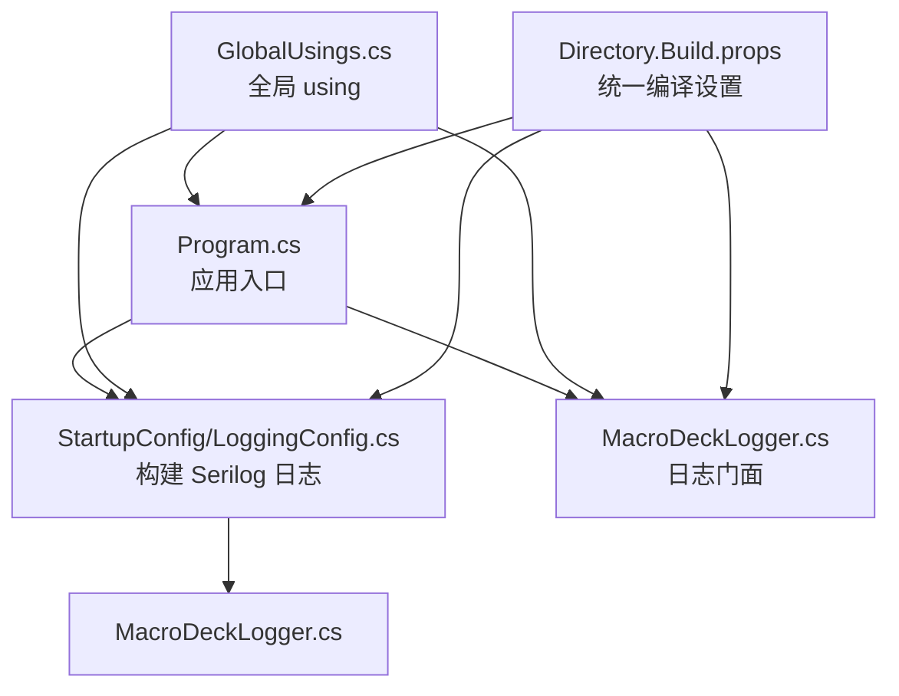
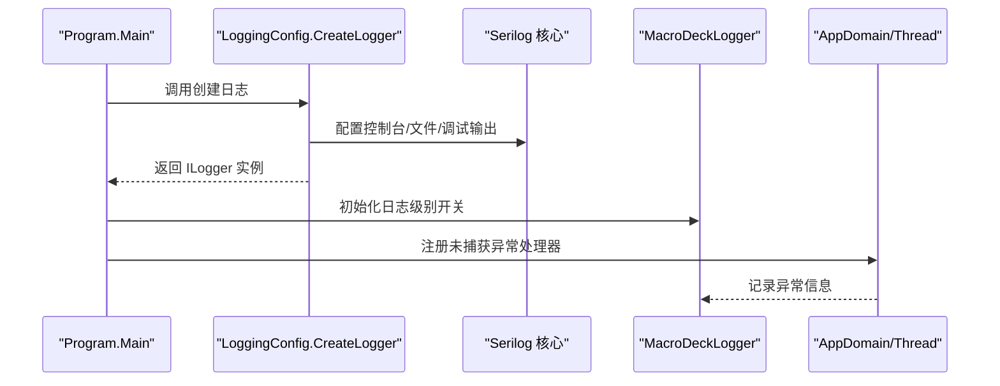
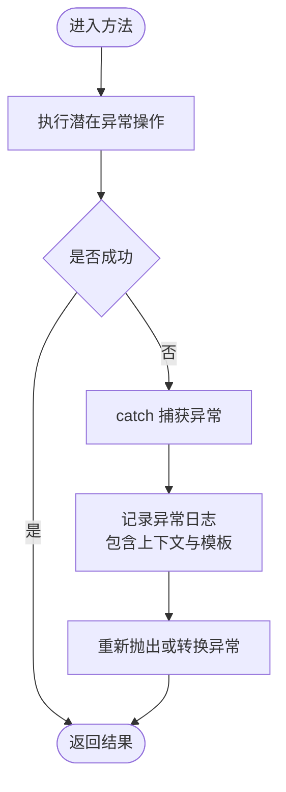
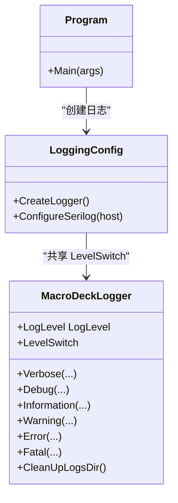
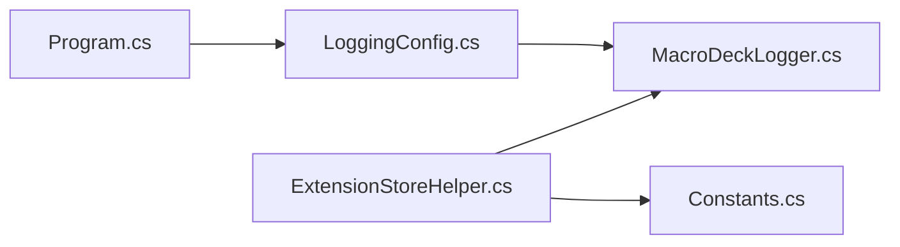

# 代码规范

<cite>
**本文引用的文件**
- [GlobalUsings.cs](file://src/MacroDeck/GlobalUsings.cs)
- [Directory.Build.props](file://Directory.Build.props)
- [Macro-Deck.slnx.DotSettings](file://Macro-Deck.slnx.DotSettings)
- [Program.cs](file://src/MacroDeck/Program.cs)
- [MacroDeckLogger.cs](file://src/MacroDeck/Logging/MacroDeckLogger.cs)
- [LoggingConfig.cs](file://src/MacroDeck/StartupConfig/LoggingConfig.cs)
- [Constants.cs](file://src/MacroDeck/Constants.cs)
- [ButtonPressType.cs](file://src/MacroDeck/Enums/ButtonPressType.cs)
- [Version.cs](file://src/MacroDeck/DataTypes/Core/Version.cs)
- [Variable.cs](file://src/MacroDeck/Variables/Variable.cs)
- [StringCipher.cs](file://src/MacroDeck/Utils/StringCipher.cs)
- [MacroDeckProfile.cs](file://src/MacroDeck/Profiles/MacroDeckProfile.cs)
- [WebSocketController.cs](file://src/MacroDeck/Controllers/WebSocketController.cs)
- [ExtensionStoreHelper.cs](file://src/MacroDeck/ExtensionStore/ExtensionStoreHelper.cs)
- [ConvertNameStringTests.cs](file://tests/MacroDeck.Tests/ConvertNameStringTests.cs)
</cite>

## 目录
1. 引言
2. 项目结构
3. 核心组件
4. 架构总览
5. 组件详解
6. 依赖关系分析
7. 性能与可维护性
8. 故障排查指南
9. 结论
10. 附录

## 引言
本文件为 Macro-Deck 的 C# 代码规范与最佳实践指南，面向开发团队统一编码风格、提升代码一致性与可维护性。内容涵盖命名约定、缩进与格式化、注释标准、代码组织原则、全局 using 管理、错误处理与日志记录、以及代码审查清单与质量标准。

## 项目结构
- 命名空间采用分层式组织：如 SuchByte.MacroDeck、SuchByte.MacroDeck.Logging、SuchByte.MacroDeck.Enums 等，体现功能域划分。
- 使用全局 using 管理常用命名空间，减少重复导入，提高可读性。
- 通过 Directory.Build.props 统一目标框架、可空引用类型与隐式 using 开关。
- JetBrains Rider 设置（.DotSettings）定义了严格的格式化与检查规则，确保团队一致的代码风格。

图表来源
- [Program.cs:1-80](file://src/MacroDeck/Program.cs#L1-L80)
- [LoggingConfig.cs:1-56](file://src/MacroDeck/StartupConfig/LoggingConfig.cs#L1-L56)
- [MacroDeckLogger.cs:1-361](file://src/MacroDeck/Logging/MacroDeckLogger.cs#L1-L361)
- [GlobalUsings.cs:1-6](file://src/MacroDeck/GlobalUsings.cs#L1-L6)
- [Directory.Build.props:1-11](file://Directory.Build.props#L1-L11)

章节来源
- [GlobalUsings.cs:1-6](file://src/MacroDeck/GlobalUsings.cs#L1-L6)
- [Directory.Build.props:1-11](file://Directory.Build.props#L1-L11)
- [Macro-Deck.slnx.DotSettings:1-82](file://Macro-Deck.slnx.DotSettings#L1-L82)

## 核心组件
- 全局 using 管理：集中声明常用命名空间，避免在各文件重复导入，降低维护成本。
- 日志系统：以 Serilog 为核心，提供统一的日志门面与配置，支持控制台、文件与调试输出，并集成可选的 Sentry 错误上报。
- 应用入口与异常处理：在 Program 中注册未捕获异常事件，确保错误信息被记录到日志。
- 版本模型：自定义版本解析与字符串表示，支持带预览号的版本格式。
- 变量模型：SQLite 属性映射，区分持久化字段与运行时计算属性。
- 扩展商店辅助：封装安装、更新检查与通知逻辑，统一调用 UI 与后台任务。

章节来源
- [Program.cs:18-35](file://src/MacroDeck/Program.cs#L18-L35)
- [MacroDeckLogger.cs:11-361](file://src/MacroDeck/Logging/MacroDeckLogger.cs#L11-L361)
- [LoggingConfig.cs:21-56](file://src/MacroDeck/StartupConfig/LoggingConfig.cs#L21-L56)
- [Version.cs:5-74](file://src/MacroDeck/DataTypes/Core/Version.cs#L5-L74)
- [Variable.cs:5-16](file://src/MacroDeck/Variables/Variable.cs#L5-L16)
- [ExtensionStoreHelper.cs:17-195](file://src/MacroDeck/ExtensionStore/ExtensionStoreHelper.cs#L17-L195)

## 架构总览
下图展示启动阶段日志初始化与异常处理的关键流程，体现全局 using、日志配置与入口程序之间的协作。

图表来源
- [Program.cs:12-35](file://src/MacroDeck/Program.cs#L12-L35)
- [LoggingConfig.cs:21-49](file://src/MacroDeck/StartupConfig/LoggingConfig.cs#L21-L49)
- [MacroDeckLogger.cs:11-361](file://src/MacroDeck/Logging/MacroDeckLogger.cs#L11-L361)

## 组件详解

### 命名约定
- 命名空间：采用领域分层命名，如 SuchByte.MacroDeck、SuchByte.MacroDeck.Enums、SuchByte.MacroDeck.Variables。
- 类与结构体：采用帕斯卡拼写法；内部结构体使用 partial 以支持生成器或正则表达式等场景。
- 枚举成员：采用大写下划线风格，例如 SHORT、LONG。
- 常量：采用帕斯卡拼写法，位于 Constants 类中，便于集中管理。
- 方法与属性：采用帕斯卡拼写法；布尔属性建议使用“是/否”语义的形容词或名词。
- 参数与局部变量：采用驼峰拼写法；避免无意义缩写，优先语义清晰的名称。
- 事件：采用动词短语或动宾结构，遵循“OnXxx”前缀约定（如 OnUpdateCheckFinished）。
- 测试：测试类与方法使用 TestFixture、SetUp、TearDown、TestCase 等约定式命名。

章节来源
- [ButtonPressType.cs:3-9](file://src/MacroDeck/Enums/ButtonPressType.cs#L3-L9)
- [Constants.cs:3-6](file://src/MacroDeck/Constants.cs#L3-L6)
- [Version.cs:5-74](file://src/MacroDeck/DataTypes/Core/Version.cs#L5-L74)
- [Variable.cs:5-16](file://src/MacroDeck/Variables/Variable.cs#L5-L16)
- [ConvertNameStringTests.cs:10-38](file://tests/MacroDeck.Tests/ConvertNameStringTests.cs#L10-L38)

### 缩进与格式化
- 缩进风格：使用空格缩进，长度由 IDE 设置决定。
- 大括号：所有控制块（if/for/foreach/while/switch/lock/using 等）必须使用大括号，即使单行也要显式写出。
- 行宽：IDE 默认行宽约 120 列，长参数列表与链式表达应按策略换行。
- 对齐：不强制对齐多行表达式或参数，保持可读性优先。
- 空行：方法之间保留空行；逻辑分组内适当空行分隔；注释前后根据需要留空行。
- 运算符空格：二元运算符两侧加空格，逗号后加空格。
- 修饰符顺序：访问修饰符、static、readonly 等按 IDE 规则排列。

章节来源
- [Macro-Deck.slnx.DotSettings:40-76](file://Macro-Deck.slnx.DotSettings#L40-L76)
- [Macro-Deck.slnx.DotSettings:10-36](file://Macro-Deck.slnx.DotSettings#L10-L36)

### 注释标准
- 文件头部：简要描述模块职责与用途。
- 类与接口：说明设计意图、关键行为与使用注意事项。
- 方法：描述输入、输出、副作用、异常条件与性能特征；对公共 API 必须有 XML 注释。
- 字段与属性：简述用途与约束；复杂逻辑需补充说明。
- 常量：注明取值含义与来源。
- 注释语言：统一使用中文，保持简洁明确，避免冗余。

章节来源
- [MacroDeckLogger.cs:17-62](file://src/MacroDeck/Logging/MacroDeckLogger.cs#L17-L62)
- [Version.cs:31-72](file://src/MacroDeck/DataTypes/Core/Version.cs#L31-L72)
- [ExtensionStoreHelper.cs:17-30](file://src/MacroDeck/ExtensionStore/ExtensionStoreHelper.cs#L17-L30)

### 代码组织原则
- 按功能域分层：GUI、Services、Utils、Logging、StartupConfig 等目录清晰分离。
- 单一职责：类与方法聚焦单一职责，避免过度耦合。
- 接口与抽象：对外暴露接口，内部实现细节封装。
- 依赖注入：通过宿主配置启用 Serilog，保持日志基础设施与业务解耦。
- 事件驱动：使用事件进行模块间松耦合通信（如扩展更新完成事件）。

章节来源
- [WebSocketController.cs:5-20](file://src/MacroDeck/Controllers/WebSocketController.cs#L5-L20)
- [ExtensionStoreHelper.cs:21-29](file://src/MacroDeck/ExtensionStore/ExtensionStoreHelper.cs#L21-L29)
- [LoggingConfig.cs:51-54](file://src/MacroDeck/StartupConfig/LoggingConfig.cs#L51-L54)

### 全局 using 管理
- 在 GlobalUsings.cs 中集中声明常用命名空间，减少重复 using，提升可读性与维护性。
- 项目级启用隐式 using（Directory.Build.props），进一步简化命名空间声明。
- 避免冗余 using，IDE 会将“RedundantUsingDirective”标记为错误，保持整洁。

章节来源
- [GlobalUsings.cs:1-6](file://src/MacroDeck/GlobalUsings.cs#L1-L6)
- [Directory.Build.props:6](file://Directory.Build.props#L6)
- [Macro-Deck.slnx.DotSettings:28-29](file://Macro-Deck.slnx.DotSettings#L28-L29)

### 错误处理与异常管理
- 入口异常捕获：在 Program 中注册 Application.ThreadException 与 AppDomain.CurrentDomain.UnhandledException，确保未捕获异常被记录。
- 方法内异常：使用 try/catch 包裹可能失败的操作，记录异常上下文与模板消息，避免吞掉异常。
- 资源释放：实现 IDisposable 或使用 using 语句确保资源及时释放；对非托管资源使用 Marshal.FreeHGlobal。
- 并发与 UI 线程：跨线程访问 UI 时使用 Invoke，避免线程安全问题。

图表来源
- [Program.cs:68-78](file://src/MacroDeck/Program.cs#L68-L78)
- [ExtensionStoreHelper.cs:181-187](file://src/MacroDeck/ExtensionStore/ExtensionStoreHelper.cs#L181-L187)
- [MacroDeckProfile.cs:18-47](file://src/MacroDeck/Profiles/MacroDeckProfile.cs#L18-L47)

章节来源
- [Program.cs:18-35](file://src/MacroDeck/Program.cs#L18-L35)
- [ExtensionStoreHelper.cs:181-187](file://src/MacroDeck/ExtensionStore/ExtensionStoreHelper.cs#L181-L187)
- [MacroDeckProfile.cs:18-47](file://src/MacroDeck/Profiles/MacroDeckProfile.cs#L18-L47)

### 日志记录规范
- 日志门面：统一使用 MacroDeckLogger 提供的方法族（Verbose/Debug/Information/Warning/Error/Fatal），支持插件上下文与异常模板。
- 日志级别：通过 LogLevel 与 LoggingLevelSwitch 动态调整最小日志级别，支持调试时更细粒度日志。
- 输出目标：控制台、文件（每日滚动、大小限制）、调试输出；可选 Sentry 条件发送。
- 上下文：宏命令主机事件使用固定 SourceContext，插件事件附加 Plugin 名称，便于过滤与上报策略。

图表来源
- [MacroDeckLogger.cs:11-361](file://src/MacroDeck/Logging/MacroDeckLogger.cs#L11-L361)
- [LoggingConfig.cs:11-56](file://src/MacroDeck/StartupConfig/LoggingConfig.cs#L11-L56)
- [Program.cs:12-35](file://src/MacroDeck/Program.cs#L12-L35)

章节来源
- [MacroDeckLogger.cs:15-35](file://src/MacroDeck/Logging/MacroDeckLogger.cs#L15-L35)
- [LoggingConfig.cs:21-49](file://src/MacroDeck/StartupConfig/LoggingConfig.cs#L21-L49)
- [Program.cs:30-32](file://src/MacroDeck/Program.cs#L30-L32)

### 数据模型与序列化
- SQLite 映射：使用特性标注主键与忽略字段，区分持久化与运行时计算属性。
- 版本模型：自定义解析与格式化，支持带预览号的版本字符串，提供 TryParse 与 Parse 两种接口。
- 变量模型：包含名称、值、创建者、类型与建议集合，类型转换通过运行时属性完成。

章节来源
- [Variable.cs:7-14](file://src/MacroDeck/Variables/Variable.cs#L7-L14)
- [Version.cs:31-72](file://src/MacroDeck/DataTypes/Core/Version.cs#L31-L72)

### Web 与控制器
- 控制器：基于 ASP.NET Core MVC，提供 WebSocket 升级与请求重定向逻辑，保持路由简洁与职责单一。

章节来源
- [WebSocketController.cs:5-20](file://src/MacroDeck/Controllers/WebSocketController.cs#L5-L20)

### 扩展商店辅助
- 安装与更新：封装安装包下载对话框、更新检查与通知机制，统一 UI 与后台任务调度。
- 异步与并发：使用 Task.Run 并发检查多个扩展更新，避免阻塞 UI 线程。
- 日志与异常：对网络请求与文件操作进行异常捕获与日志记录。

章节来源
- [ExtensionStoreHelper.cs:48-64](file://src/MacroDeck/ExtensionStore/ExtensionStoreHelper.cs#L48-L64)
- [ExtensionStoreHelper.cs:71-131](file://src/MacroDeck/ExtensionStore/ExtensionStoreHelper.cs#L71-L131)
- [ExtensionStoreHelper.cs:162-187](file://src/MacroDeck/ExtensionStore/ExtensionStoreHelper.cs#L162-L187)

## 依赖关系分析
- 入口依赖：Program 依赖 LoggingConfig 创建日志；日志配置依赖 MacroDeckLogger 的级别开关。
- 日志依赖：MacroDeckLogger 依赖 Serilog 核心与插件 enricher；LoggingConfig 配置 sinks 与最小级别覆盖。
- 扩展商店：依赖常量中的 API 基地址与网络访问，结合 UI 与通知模块。

图表来源
- [Program.cs:12-35](file://src/MacroDeck/Program.cs#L12-L35)
- [LoggingConfig.cs:21-49](file://src/MacroDeck/StartupConfig/LoggingConfig.cs#L21-L49)
- [MacroDeckLogger.cs:11-361](file://src/MacroDeck/Logging/MacroDeckLogger.cs#L11-L361)
- [ExtensionStoreHelper.cs:162-171](file://src/MacroDeck/ExtensionStore/ExtensionStoreHelper.cs#L162-L171)
- [Constants.cs:5](file://src/MacroDeck/Constants.cs#L5)

章节来源
- [Program.cs:12-35](file://src/MacroDeck/Program.cs#L12-L35)
- [LoggingConfig.cs:21-49](file://src/MacroDeck/StartupConfig/LoggingConfig.cs#L21-L49)
- [MacroDeckLogger.cs:11-361](file://src/MacroDeck/Logging/MacroDeckLogger.cs#L11-L361)
- [ExtensionStoreHelper.cs:162-171](file://src/MacroDeck/ExtensionStore/ExtensionStoreHelper.cs#L162-L171)
- [Constants.cs:5](file://src/MacroDeck/Constants.cs#L5)

## 性能与可维护性
- 日志性能：通过 LoggingLevelSwitch 动态调整级别，避免在低级别下进行昂贵的字符串格式化；文件滚动与大小限制防止磁盘占用过大。
- 资源释放：对非托管内存与 UI 资源实现显式释放与终结器保护，避免泄漏。
- 并发模型：异步检查更新与后台任务执行，避免阻塞 UI；注意线程安全与跨线程调用。
- 可读性：统一命名、注释与格式化规则，减少认知负担；全局 using 减少噪音。

## 故障排查指南
- 启动期无日志：确认 LoggingConfig 已在 Program.Main 中创建并赋值给 Log.Logger；检查最小级别与 sinks 配置。
- 插件日志未显示：确认 MacroDeckLogger 的 LevelSwitch 与 LoggingConfig 的最小级别覆盖设置；检查插件上下文是否正确附加。
- 更新检查失败：查看 ExtensionStoreHelper 的异常日志与返回值；确认 Constants 中的 API 地址与网络连通性。
- UI 线程异常：检查是否存在跨线程访问 UI 控件；使用 Invoke 或 BeginInvoke 进行线程切换。
- 内存泄漏：核查 IDisposable 实现与 using 语句；关注非托管资源释放路径。

章节来源
- [Program.cs:30-32](file://src/MacroDeck/Program.cs#L30-L32)
- [LoggingConfig.cs:25-49](file://src/MacroDeck/StartupConfig/LoggingConfig.cs#L25-L49)
- [MacroDeckLogger.cs:26-35](file://src/MacroDeck/Logging/MacroDeckLogger.cs#L26-L35)
- [ExtensionStoreHelper.cs:181-187](file://src/MacroDeck/ExtensionStore/ExtensionStoreHelper.cs#L181-L187)
- [MacroDeckProfile.cs:18-47](file://src/MacroDeck/Profiles/MacroDeckProfile.cs#L18-L47)

## 结论
本规范总结了 Macro-Deck 的命名、格式、日志与异常处理等关键实践，配合全局 using 与统一编译设置，形成一致且高效的开发体验。建议在代码审查中严格对照本规范执行，持续优化可维护性与稳定性。

## 附录

### 代码审查检查清单
- 命名：类/方法/枚举/常量是否符合约定；变量命名是否语义清晰。
- 格式：缩进、大括号、行宽、空行与对齐是否符合 IDE 规则。
- 注释：公共 API 是否具备 XML 注释；复杂逻辑是否有必要注释。
- 全局 using：是否仅保留必要项；是否避免冗余。
- 日志：是否使用 MacroDeckLogger；是否包含上下文与异常；级别是否合理。
- 异常：是否捕获并记录异常；是否避免吞掉异常；资源释放是否完整。
- 并发：UI 线程访问是否受控；异步任务是否正确处理取消与异常。
- 测试：关键逻辑是否具备单元测试；测试命名与断言是否清晰。

### 质量标准
- 可读性：代码简洁、命名一致、注释充分。
- 可靠性：异常处理完善、资源释放及时、边界条件覆盖。
- 可维护性：模块职责清晰、依赖关系明确、变更影响可控。
- 性能：避免不必要的日志开销、合理使用缓存与异步模式。