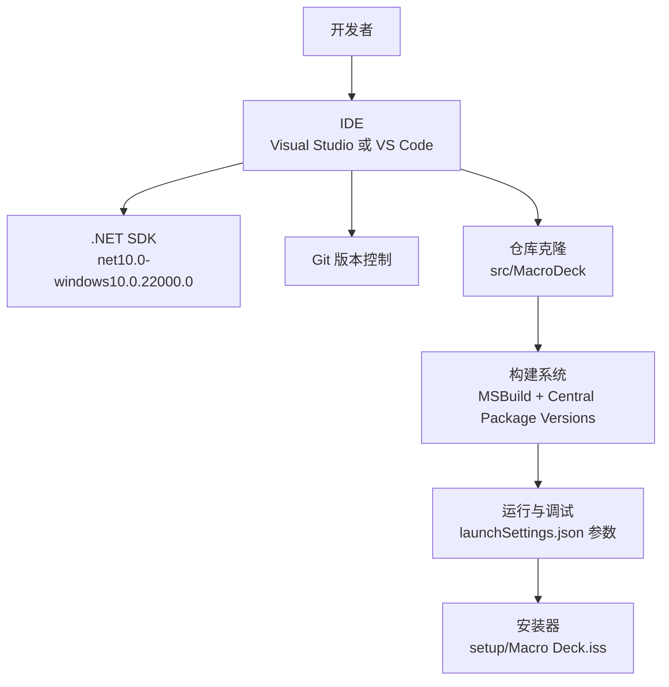
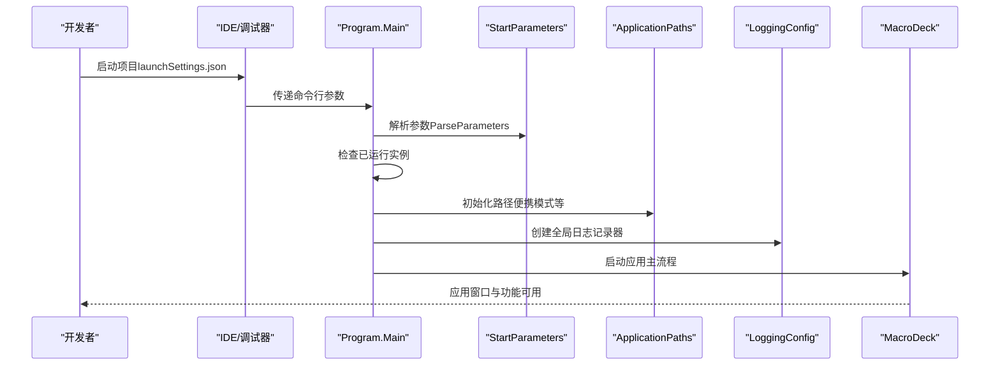
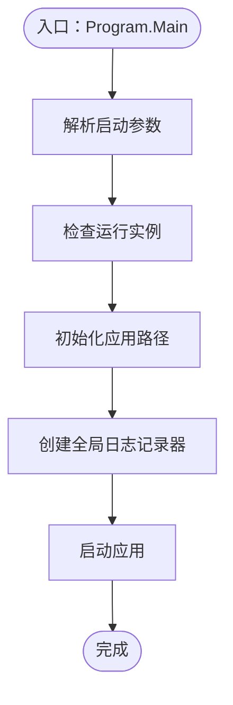
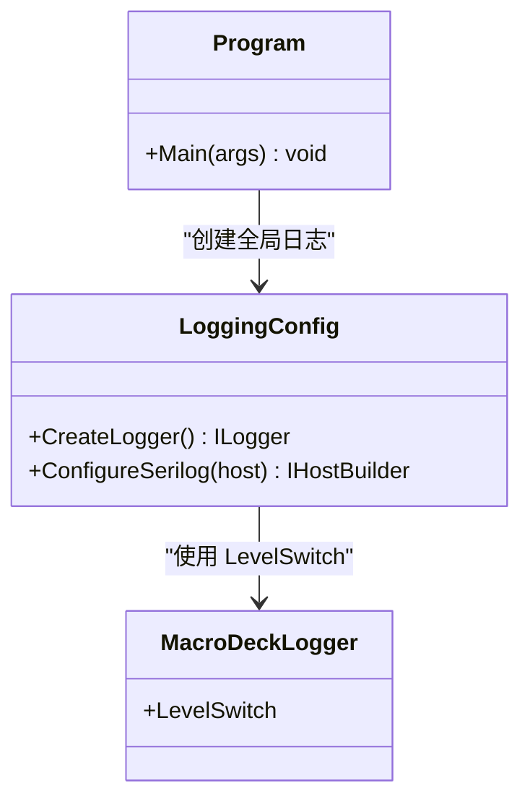
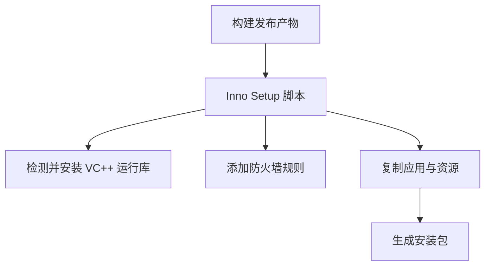
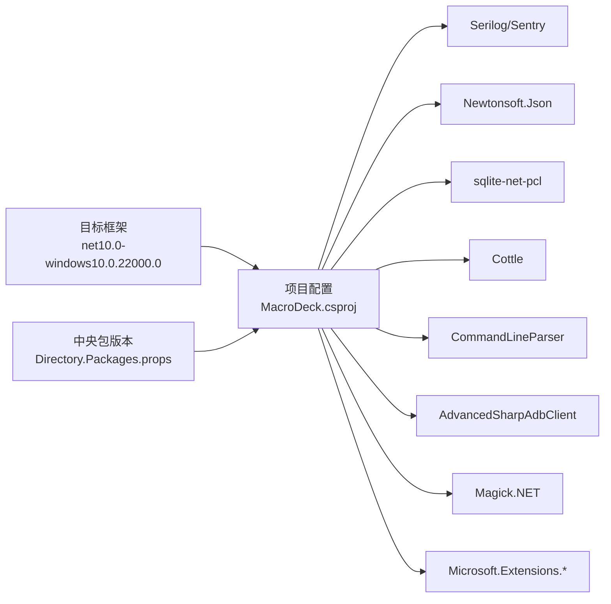

# 开发环境搭建

<cite>
**本文引用的文件**
- [MacroDeck.csproj](file://src/MacroDeck/MacroDeck.csproj)
- [Directory.Build.props](file://Directory.Build.props)
- [Directory.Packages.props](file://Directory.Packages.props)
- [launchSettings.json](file://src/MacroDeck/Properties/launchSettings.json)
- [Program.cs](file://src/MacroDeck/Program.cs)
- [StartParameters.cs](file://src/MacroDeck/StartupConfig/StartParameters.cs)
- [LoggingConfig.cs](file://src/MacroDeck/StartupConfig/LoggingConfig.cs)
- [Macro Deck.iss](file://setup/Macro Deck.iss)
- [Macro-Deck.slnx.DotSettings](file://Macro-Deck.slnx.DotSettings)
- [README.md](file://README.md)
</cite>

## 目录
1. [简介](#简介)
2. [项目结构](#项目结构)
3. [核心组件](#核心组件)
4. [架构总览](#架构总览)
5. [详细组件分析](#详细组件分析)
6. [依赖分析](#依赖分析)
7. [性能考虑](#性能考虑)
8. [故障排除指南](#故障排除指南)
9. [结论](#结论)
10. [附录](#附录)

## 简介
本文件面向新加入 Macro-Deck 的开发者，提供从零开始的完整开发环境搭建指南。内容涵盖：
- 必备软件与环境要求（Visual Studio 或 VS Code、.NET SDK、Git）
- 项目克隆、依赖安装与构建流程
- 调试配置与启动参数设置
- IDE 插件与代码格式化建议
- 常见问题排查与解决方案
- 新开发者环境准备清单

## 项目结构
Macro-Deck 是一个基于 .NET 10 的 Windows WPF 应用，采用中央包版本管理与多目标平台配置。项目主要由以下部分组成：
- 源码根目录：src/MacroDeck
- 解决方案文件：Macro-Deck.slnx（含全局 .DotSettings 配置）
- 安装与打包：setup/Macro Deck.iss（Inno Setup 脚本）
- 测试工程：tests/MacroDeck.Tests
- 全局构建属性与包版本：Directory.Build.props、Directory.Packages.props

**章节来源**
- [MacroDeck.csproj:1-363](file://src/MacroDeck/MacroDeck.csproj#L1-L363)
- [Directory.Build.props:1-11](file://Directory.Build.props#L1-L11)
- [Directory.Packages.props:1-35](file://Directory.Packages.props#L1-L35)
- [Macro Deck.iss:1-106](file://setup/Macro Deck.iss#L1-L106)

## 核心组件
- 构建与运行时
  - 目标框架：net10.0-windows10.0.22000.0
  - 平台：AnyCPU/x64，输出类型 WinExe
  - 使用 WPF 与 Windows Forms
- 中央包版本管理：通过 Directory.Packages.props 统一管理第三方包版本
- 启动参数解析：使用 CommandLineParser 解析命令行参数
- 日志系统：Serilog + Sentry 集成，支持控制台、文件与调试输出
- 安装器：Inno Setup 脚本，自动处理 VC++ 运行库与防火墙规则

**章节来源**
- [MacroDeck.csproj:3-25](file://src/MacroDeck/MacroDeck.csproj#L3-L25)
- [Directory.Build.props:3-8](file://Directory.Build.props#L3-L8)
- [Directory.Packages.props:5-34](file://Directory.Packages.props#L5-L34)
- [StartParameters.cs:5-35](file://src/MacroDeck/StartupConfig/StartParameters.cs#L5-L35)
- [LoggingConfig.cs:21-49](file://src/MacroDeck/StartupConfig/LoggingConfig.cs#L21-L49)
- [Macro Deck.iss:38-106](file://setup/Macro Deck.iss#L38-L106)

## 架构总览
下图展示了应用启动到日志初始化的关键流程，以及调试参数如何影响运行行为。

**图表来源**
- [Program.cs:13-35](file://src/MacroDeck/Program.cs#L13-L35)
- [StartParameters.cs:36-55](file://src/MacroDeck/StartupConfig/StartParameters.cs#L36-L55)
- [LoggingConfig.cs:21-49](file://src/MacroDeck/StartupConfig/LoggingConfig.cs#L21-L49)

**章节来源**
- [Program.cs:13-35](file://src/MacroDeck/Program.cs#L13-L35)
- [StartParameters.cs:36-55](file://src/MacroDeck/StartupConfig/StartParameters.cs#L36-L55)
- [launchSettings.json:3-7](file://src/MacroDeck/Properties/launchSettings.json#L3-L7)

## 详细组件分析

### 启动参数与调试配置
- 命令行参数定义与解析
  - 支持端口、更新通道、便携模式、显示主窗体、禁用文件日志、日志级别、调试控制台、忽略 PID 检查等选项
  - 解析逻辑允许忽略未知参数，并启用 -- 分隔符
- 默认调试参数
  - 在 launchSettings.json 中预设了导出默认字符串、显示主窗体、日志级别、测试通道与调试控制台等参数
- 运行时行为
  - 启动前检查是否已有实例在运行；若存在则尝试唤醒已有实例或终止多余实例
  - 初始化应用路径后立即建立全局日志记录器，确保从启动初期即有日志输出

**图表来源**
- [Program.cs:25-34](file://src/MacroDeck/Program.cs#L25-L34)
- [StartParameters.cs:36-55](file://src/MacroDeck/StartupConfig/StartParameters.cs#L36-L55)
- [LoggingConfig.cs:21-49](file://src/MacroDeck/StartupConfig/LoggingConfig.cs#L21-L49)

**章节来源**
- [StartParameters.cs:5-35](file://src/MacroDeck/StartupConfig/StartParameters.cs#L5-L35)
- [launchSettings.json:5](file://src/MacroDeck/Properties/launchSettings.json#L5)
- [Program.cs:37-66](file://src/MacroDeck/Program.cs#L37-L66)

### 日志系统与 Sentry 集成
- 日志配置要点
  - 控制最小日志级别，覆盖 Microsoft、System 等命名空间的日志等级
  - 输出到控制台、滚动文件与调试控制台
  - 条件性启用 Sentry，仅上报满足条件的错误事件
- 与应用生命周期集成
  - 在 Program.Main 中优先创建日志记录器，随后启动应用，保证日志贯穿整个生命周期

**图表来源**
- [LoggingConfig.cs:21-49](file://src/MacroDeck/StartupConfig/LoggingConfig.cs#L21-L49)
- [Program.cs:30-32](file://src/MacroDeck/Program.cs#L30-L32)

**章节来源**
- [LoggingConfig.cs:21-49](file://src/MacroDeck/StartupConfig/LoggingConfig.cs#L21-L49)
- [Program.cs:30-32](file://src/MacroDeck/Program.cs#L30-L32)

### 安装器与运行时依赖
- Inno Setup 脚本负责：
  - 自动检测并安装 VC++ 2019 运行库（必要时）
  - 添加防火墙入站/出站规则
  - 复制发布产物与 Android Debug Bridge 工具
- 产物位置与版本提取自发布目录

**图表来源**
- [Macro Deck.iss:88-106](file://setup/Macro Deck.iss#L88-L106)

**章节来源**
- [Macro Deck.iss:88-106](file://setup/Macro Deck.iss#L88-L106)

## 依赖分析
- 目标框架与平台
  - 目标框架：net10.0-windows10.0.22000.0
  - 平台：AnyCPU/x64，输出类型 WinExe，启用 WPF 与 Windows Forms
- 中央包版本管理
  - 通过 Directory.Packages.props 统一管理包版本，减少版本漂移
- 关键依赖类别
  - UI：WPF、Windows Forms、第三方控件
  - 日志：Serilog、Sentry.Serilog
  - JSON：Newtonsoft.Json
  - 数据库：sqlite-net-pcl
  - 模板引擎：Cottle
  - 命令行解析：CommandLineParser
  - Android 调试桥：AdvancedSharpAdbClient
  - 图像处理：Magick.NET
  - 扩展容器：Microsoft.Extensions.*

**图表来源**
- [Directory.Build.props:4](file://Directory.Build.props#L4)
- [MacroDeck.csproj:42-67](file://src/MacroDeck/MacroDeck.csproj#L42-L67)
- [Directory.Packages.props:5-25](file://Directory.Packages.props#L5-L25)

**章节来源**
- [Directory.Build.props:4](file://Directory.Build.props#L4)
- [MacroDeck.csproj:42-67](file://src/MacroDeck/MacroDeck.csproj#L42-L67)
- [Directory.Packages.props:5-25](file://Directory.Packages.props#L5-L25)

## 性能考虑
- 启动阶段尽早初始化日志，避免后续日志丢失
- 使用中央包版本管理减少重复依赖与潜在冲突
- 发布时启用单文件与修剪可减小体积（项目配置中包含相关项）

## 故障排除指南
- 无法找到 .NET SDK
  - 现象：构建失败，提示找不到目标框架
  - 排查：确认已安装 .NET SDK 10（对应 net10.0），并确保 PATH 正确
  - 参考：目标框架 net10.0-windows10.0.22000.0
- 无法解析命令行参数
  - 现象：启动参数未生效
  - 排查：确认 launchSettings.json 中的参数与 StartParameters 定义一致；注意未知参数会被忽略
- 多实例冲突
  - 现象：启动时报错或已有实例被终止
  - 排查：检查是否有其他 Macro Deck 实例在运行；可通过 --ignore-pid-check 跳过 PID 检查（仅调试用途）
- 日志不输出或输出异常
  - 现象：无日志或日志级别不符合预期
  - 排查：确认 --log-level 参数与 LoggingConfig 中的最小级别覆盖策略；检查文件日志路径是否存在写权限
- 安装失败或缺少运行时
  - 现象：安装成功但运行时报错
  - 排查：Inno Setup 会自动安装 VC++ 运行库，若失败请手动安装 VC++ 2019 x64 运行库

**章节来源**
- [Directory.Build.props:4](file://Directory.Build.props#L4)
- [StartParameters.cs:36-55](file://src/MacroDeck/StartupConfig/StartParameters.cs#L36-L55)
- [Program.cs:37-66](file://src/MacroDeck/Program.cs#L37-L66)
- [LoggingConfig.cs:21-49](file://src/MacroDeck/StartupConfig/LoggingConfig.cs#L21-L49)
- [Macro Deck.iss:38-59](file://setup/Macro Deck.iss#L38-L59)

## 结论
通过遵循本指南，您可以在本地快速搭建 Macro-Deck 的开发环境并顺利运行与调试。建议优先完成 .NET SDK 与 IDE 的安装，再进行项目克隆与依赖恢复，最后根据调试配置与启动参数验证环境正确性。

## 附录

### 开发环境准备清单
- 操作系统：Windows（目标框架包含 Windows 组件）
- .NET SDK：10.x（对应 net10.0）
- IDE：Visual Studio（推荐）或 VS Code（需 C# 扩展）
- Git：版本控制工具
- 可选：JetBrains Rider（具备强大的 .NET 分析能力）
- 可选：Inno Setup（用于本地打包测试）

**章节来源**
- [Directory.Build.props:4](file://Directory.Build.props#L4)
- [README.md:21-33](file://README.md#L21-L33)

### 项目克隆、依赖安装与构建
- 克隆仓库后，使用 IDE 或命令行进行还原与构建
- 依赖通过 NuGet 中心版本管理，无需手动指定版本号
- 构建目标：AnyCPU/x64，输出类型 WinExe

**章节来源**
- [Directory.Packages.props:5-34](file://Directory.Packages.props#L5-L34)
- [MacroDeck.csproj:20-25](file://src/MacroDeck/MacroDeck.csproj#L20-L25)

### 调试配置与启动参数
- 在 launchSettings.json 中设置默认参数
- 常用参数示例：导出默认字符串、显示主窗体、设置日志级别、启用测试通道、开启调试控制台
- 运行时行为：启动前检查实例、初始化路径、创建日志记录器、启动应用

**章节来源**
- [launchSettings.json:5](file://src/MacroDeck/Properties/launchSettings.json#L5)
- [StartParameters.cs:36-55](file://src/MacroDeck/StartupConfig/StartParameters.cs#L36-L55)
- [Program.cs:25-34](file://src/MacroDeck/Program.cs#L25-L34)

### IDE 插件与代码格式化建议
- JetBrains ReSharper/Rider：提供高质量的 .NET 代码分析与重构能力
- VS Code：安装 C# 扩展，配合 OmniSharp 获取智能感知
- 代码风格：遵循项目中的全局 .DotSettings（如大括号风格、缩进、换行宽度等）

**章节来源**
- [Macro-Deck.slnx.DotSettings:44-76](file://Macro-Deck.slnx.DotSettings#L44-L76)