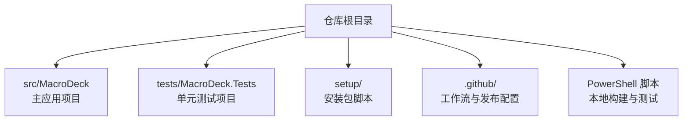
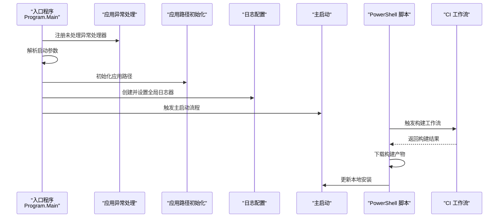
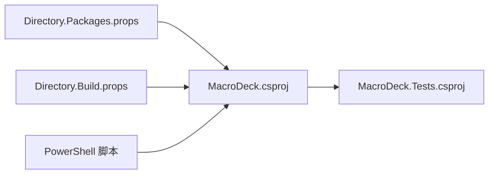
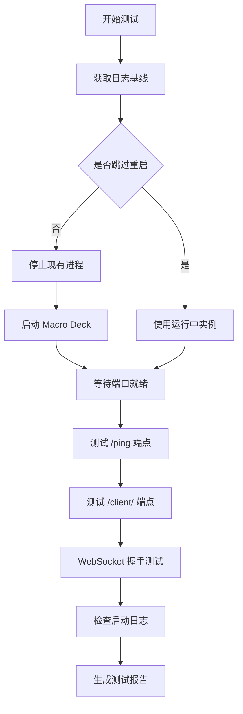

# 开发者指南

<cite>
**本文引用的文件**
- [README.md](file://README.md)
- [src/MacroDeck/README.md](file://src/MacroDeck/README.md)
- [Macro-Deck.slnx.DotSettings](file://Macro-Deck.slnx.DotSettings)
- [Directory.Build.props](file://Directory.Build.props)
- [Directory.Packages.props](file://Directory.Packages.props)
- [src/MacroDeck/Properties/launchSettings.json](file://src/MacroDeck/Properties/launchSettings.json)
- [src/MacroDeck/MacroDeck.csproj](file://src/MacroDeck/MacroDeck.csproj)
- [tests/MacroDeck.Tests/MacroDeck.Tests.csproj](file://tests/MacroDeck.Tests/MacroDeck.Tests.csproj)
- [.github/release.yml](file://.github/release.yml)
- [setup/Macro Deck.iss](file://setup/Macro Deck.iss)
- [src/MacroDeck/Program.cs](file://src/MacroDeck/Program.cs)
- [test-macrodeck.ps1](file://test-macrodeck.ps1)
- [update-macrodeck-local.ps1](file://update-macrodeck-local.ps1)
- [自动化测试.md](file://自动化测试.md)
- [tests/MacroDeck.Tests/ConditionActionTests.cs](file://tests/MacroDeck.Tests/ConditionActionTests.cs)
</cite>

## 更新摘要
**所做更改**
- 新增本地构建自动化系统章节，介绍 PowerShell 脚本的使用和配置
- 添加端到端冒烟测试文档，详细说明测试流程和故障排查
- 更新开发工具链配置，包含 PowerShell 脚本使用指南
- 增强文档基础设施，提供更完整的测试和构建自动化说明

## 目录
1. [简介](#简介)
2. [项目结构](#项目结构)
3. [核心组件](#核心组件)
4. [架构总览](#架构总览)
5. [详细组件分析](#详细组件分析)
6. [依赖关系分析](#依赖关系分析)
7. [性能考虑](#性能考虑)
8. [故障排查指南](#故障排查指南)
9. [本地构建自动化系统](#本地构建自动化系统)
10. [端到端冒烟测试](#端到端冒烟测试)
11. [文档基础设施增强](#文档基础设施增强)
12. [结论](#结论)
13. [附录](#附录)

## 简介
本指南面向 Macro-Deck 的开发者与贡献者，覆盖开发环境搭建、代码规范、贡献流程、IDE 配置、调试与构建、插件开发流程、版本控制与分支管理、CI/CD 与自动化测试、发布流程与版本管理等主题。内容基于仓库中的实际配置文件与源码进行整理，确保可操作性与一致性。

**更新** 新增本地构建自动化系统和端到端冒烟测试章节，提供完整的开发工作流指导。

## 项目结构
仓库采用多项目布局：核心应用位于 src/MacroDeck，测试项目位于 tests/MacroDeck.Tests；根目录包含全局构建属性、包版本集中管理、GitHub 发布配置以及安装包脚本。新增的 PowerShell 脚本提供了本地构建和测试自动化能力。



**章节来源**
- [src/MacroDeck/MacroDeck.csproj:1-363](file://src/MacroDeck/MacroDeck.csproj#L1-L363)
- [tests/MacroDeck.Tests/MacroDeck.Tests.csproj:1-26](file://tests/MacroDeck.Tests/MacroDeck.Tests.csproj#L1-L26)
- [Directory.Build.props:1-11](file://Directory.Build.props#L1-L11)
- [Directory.Packages.props:1-35](file://Directory.Packages.props#L1-L35)
- [test-macrodeck.ps1:1-200](file://test-macrodeck.ps1#L1-L200)
- [update-macrodeck-local.ps1:1-121](file://update-macrodeck-local.ps1#L1-L121)

## 核心组件
- 应用入口与启动流程：程序入口负责异常处理注册、运行实例检测、路径初始化与日志系统初始化，并调用主启动逻辑。
- 启动参数解析：通过启动参数控制导出默认字符串、显示窗口、日志级别、测试通道与调试控制台等行为。
- 构建与打包：使用 MSBuild 与 Inno Setup 脚本生成安装包，自动注入产品版本并处理 VC++ 运行库需求。
- **新增** 本地构建自动化：通过 PowerShell 脚本实现 CI 工作流触发、构建等待、产物下载和本地更新。

**章节来源**
- [src/MacroDeck/Program.cs:1-80](file://src/MacroDeck/Program.cs#L1-L80)
- [src/MacroDeck/Properties/launchSettings.json:1-9](file://src/MacroDeck/Properties/launchSettings.json#L1-L9)
- [setup/Macro Deck.iss:1-106](file://setup/Macro Deck.iss#L1-L106)
- [update-macrodeck-local.ps1:1-121](file://update-macrodeck-local.ps1#L1-L121)

## 架构总览
下图展示从入口到启动、日志与服务的关键交互，以及新增的本地构建自动化流程：



**图表来源**
- [src/MacroDeck/Program.cs:12-35](file://src/MacroDeck/Program.cs#L12-L35)
- [update-macrodeck-local.ps1:43-72](file://update-macrodeck-local.ps1#L43-L72)

**章节来源**
- [src/MacroDeck/Program.cs:12-35](file://src/MacroDeck/Program.cs#L12-L35)
- [update-macrodeck-local.ps1:43-72](file://update-macrodeck-local.ps1#L43-L72)

## 详细组件分析

### 插件开发 API 与使用方式
- 宏定义：插件开发 API 以 NuGet 包形式提供，编译期引用，运行时由宿主提供实现，避免重复打包。
- 使用建议：在插件项目中添加对 API 包的引用，遵循仅编译期依赖的约束。

**章节来源**
- [README.md:21-32](file://README.md#L21-L32)
- [src/MacroDeck/README.md:1-24](file://src/MacroDeck/README.md#L1-L24)

### 代码风格与 IDE 配置（Rider/JetBrains）
- 命名空间与修饰符：强制按顺序排列命名空间与成员修饰符，要求大括号风格一致。
- 缩进与换行：使用空格缩进，设定行长阈值，参数与长表达式换行策略明确。
- 其他规则：禁止冗余 using、建议显式静态限定符、统一内部修饰符策略等。

**章节来源**
- [Macro-Deck.slnx.DotSettings:1-82](file://Macro-Deck.slnx.DotSettings#L1-L82)

### 构建与运行配置
- 目标框架与特性：启用可空引用注解、隐式 using、禁用部分警告。
- 测试 SDK：集中管理测试相关包版本，便于统一升级与分析。
- 启动参数：命令行参数用于导出默认字符串、显示界面、日志等级、测试通道与调试控制台。

**章节来源**
- [Directory.Build.props:1-11](file://Directory.Build.props#L1-L11)
- [Directory.Packages.props:1-35](file://Directory.Packages.props#L1-L35)
- [src/MacroDeck/Properties/launchSettings.json:1-9](file://src/MacroDeck/Properties/launchSettings.json#L1-L9)

### 项目文件与资源组织
- WPF/WinForms 支持：启用 WPF 与 Windows Forms，输出类型为 WinExe。
- 资源嵌入：语言资源与 wwwroot 内容按规则嵌入或复制至输出目录。
- 框架引用：包含 ASP.NET 运行时以便内建 Web 客户端与服务。
- 版本信息：产品版本、公司、作者、许可证等元数据集中配置。

**章节来源**
- [src/MacroDeck/MacroDeck.csproj:1-363](file://src/MacroDeck/MacroDeck.csproj#L1-L363)

### 测试项目与覆盖率
- 测试 SDK 与 NUnit：使用 Microsoft.NET.Test.Sdk、NUnit 及适配器，支持分析器与覆盖率收集。
- 项目引用：测试项目引用主应用项目，便于集成测试。

**章节来源**
- [tests/MacroDeck.Tests/MacroDeck.Tests.csproj:1-26](file://tests/MacroDeck.Tests/MacroDeck.Tests.csproj#L1-L26)

### 安装包与发布
- Inno Setup 脚本：读取发布目录产物版本，生成安装包名称；自动检测并安装 VC++ 运行库；创建防火墙规则；安装后自动启动应用。
- 发布配置：GitHub Release 的变更日志分类标签，便于自动生成 Changelog。

**章节来源**
- [setup/Macro Deck.iss:1-106](file://setup/Macro Deck.iss#L1-L106)
- [.github/release.yml:1-21](file://.github/release.yml#L1-L21)

## 依赖关系分析
- 中央化包版本：通过 Directory.Packages.props 统一管理第三方包版本，降低维护成本。
- 应用与测试：测试项目引用主应用项目，形成清晰的测试边界。
- 外部依赖：日志、序列化、数据库、图形处理、二维码、ADB 等库集中声明。



**图表来源**
- [src/MacroDeck/MacroDeck.csproj:42-67](file://src/MacroDeck/MacroDeck.csproj#L42-L67)
- [tests/MacroDeck.Tests/MacroDeck.Tests.csproj:22-23](file://tests/MacroDeck.Tests/MacroDeck.Tests.csproj#L22-L23)
- [Directory.Packages.props:1-35](file://Directory.Packages.props#L1-L35)
- [Directory.Build.props:1-11](file://Directory.Build.props#L1-L11)
- [test-macrodeck.ps1:1-200](file://test-macrodeck.ps1#L1-L200)
- [update-macrodeck-local.ps1:1-121](file://update-macrodeck-local.ps1#L1-L121)

**章节来源**
- [src/MacroDeck/MacroDeck.csproj:42-67](file://src/MacroDeck/MacroDeck.csproj#L42-L67)
- [tests/MacroDeck.Tests/MacroDeck.Tests.csproj:22-23](file://tests/MacroDeck.Tests/MacroDeck.Tests.csproj#L22-L23)
- [Directory.Packages.props:1-35](file://Directory.Packages.props#L1-L35)
- [Directory.Build.props:1-11](file://Directory.Build.props#L1-L11)
- [test-macrodeck.ps1:1-200](file://test-macrodeck.ps1#L1-L200)
- [update-macrodeck-local.ps1:1-121](file://update-macrodeck-local.ps1#L1-L121)

## 性能考虑
- 日志初始化：在应用启动早期即建立日志系统，有助于快速定位性能瓶颈与异常。
- 单实例控制：运行时检测并激活已有实例，避免重复启动带来的资源浪费。
- 资源嵌入：语言与静态资源嵌入减少磁盘 IO，提升加载速度。
- 图形与模板：图像处理与模板渲染需注意内存占用与缓存策略，避免频繁分配。

**章节来源**
- [src/MacroDeck/Program.cs:30-34](file://src/MacroDeck/Program.cs#L30-L34)
- [src/MacroDeck/Program.cs:37-66](file://src/MacroDeck/Program.cs#L37-L66)
- [src/MacroDeck/MacroDeck.csproj:34-40](file://src/MacroDeck/MacroDeck.csproj#L34-L40)

## 故障排查指南
- 异常捕获：应用级与线程级未处理异常均被记录，便于问题追踪。
- 调试控制台：启动参数支持开启调试控制台，便于本地诊断。
- 防火墙规则：安装脚本自动添加入站/出站规则，若无法连接可检查系统防火墙策略。
- 运行库缺失：安装脚本会检测并安装 VC++ 运行库，确保依赖满足。

**章节来源**
- [src/MacroDeck/Program.cs:68-78](file://src/MacroDeck/Program.cs#L68-L78)
- [src/MacroDeck/Properties/launchSettings.json:5](file://src/MacroDeck/Properties/launchSettings.json#L5)
- [setup/Macro Deck.iss:104-105](file://setup/Macro Deck.iss#L104-L105)
- [setup/Macro Deck.iss:38-59](file://setup/Macro Deck.iss#L38-L59)

## 本地构建自动化系统

**新增** 本节介绍 Macro-Deck 的本地构建自动化系统，通过 PowerShell 脚本实现 CI 工作流的本地触发和产物更新。

### 构建本地更新器（update-macrodeck-local.ps1）

该脚本提供了完整的本地构建自动化流程：

#### 功能特性
- **CI 工作流触发**：通过 GitHub CLI 触发远程构建
- **构建状态监控**：轮询构建状态直到完成
- **产物下载**：自动下载构建产物并提取到临时目录
- **安全更新**：仅复制程序文件，保留用户数据目录
- **自动重启**：更新完成后自动重启应用

#### 使用方法

```powershell
# 触发新的构建并更新本地安装
powershell -ExecutionPolicy Bypass -File .\update-macrodeck-local.ps1

# 使用最近的成功构建更新本地安装
powershell -ExecutionPolicy Bypass -File .\update-macrodeck-local.ps1 -SkipBuild
```

#### 参数说明

| 参数 | 类型 | 默认值 | 说明 |
|------|------|--------|------|
| `-Repo` | string | `tea4go/Macro-Deck` | GitHub 仓库地址（owner/repo格式） |
| `-InstallDir` | string | `C:\Program Files\Macro Deck` | 宏定义安装目录 |
| `-SkipBuild` | switch | false | 跳过触发新构建，使用最新成功运行的产物 |

#### 技术实现要点

- **GitHub CLI 依赖**：脚本依赖 `gh` 命令行工具，需先安装 GitHub CLI
- **构建轮询**：最多等待 20 分钟，每 30 秒检查一次构建状态
- **产物提取**：自动查找包含 `Macro Deck 2.exe` 的发布根目录
- **文件过滤**：仅复制文件而非子目录，保护用户数据（plugins、wwwroot、Android Debug Bridge）

**章节来源**
- [update-macrodeck-local.ps1:1-121](file://update-macrodeck-local.ps1#L1-L121)

### CI 工作流集成

脚本假设存在名为 `build-local.yml` 的 GitHub Actions 工作流，该工作流负责：

1. **构建项目**：编译 Macro-Deck 主程序
2. **生成产物**：创建包含所有必要文件的构建包
3. **上传工件**：将构建产物作为 GitHub Actions 工件保存

**章节来源**
- [update-macrodeck-local.ps1:5-7](file://update-macrodeck-local.ps1#L5-L7)
- [update-macrodeck-local.ps1:43-49](file://update-macrodeck-local.ps1#L43-L49)

## 端到端冒烟测试

**新增** 本节详细介绍 Macro-Deck 的端到端冒烟测试系统，通过 PowerShell 脚本验证应用的核心功能。

### 测试脚本概述（test-macrodeck.ps1）

该脚本提供了完整的端到端测试流程，验证 Macro-Deck 主应用的所有关键服务：

#### 测试范围
- HTTP 服务可用性
- REST API 健康检查
- Web 客户端静态文件服务
- WebSocket 协议握手
- 应用启动日志验证

#### 测试流程



**图表来源**
- [test-macrodeck.ps1:56-91](file://test-macrodeck.ps1#L56-L91)
- [test-macrodeck.ps1:93-154](file://test-macrodeck.ps1#L93-L154)
- [test-macrodeck.ps1:156-185](file://test-macrodeck.ps1#L156-L185)

#### 参数配置

| 参数 | 默认值 | 说明 |
|------|--------|------|
| `-SkipRestart` | false | 跳过重启，测试当前运行实例 |
| `-ClientId` | `lvgoejr` | WebSocket 握手使用的客户端ID |
| `-ServerHost` | `localhost` | 服务器主机地址 |
| `-Port` | `8191` | HTTP/WebSocket 端口号 |

#### 验证项目

| 检查项 | 验证内容 | 判定标准 |
|--------|----------|----------|
| `PortReady` | 服务端口监听 | TCP 能连接到指定端口 |
| `PingEndpoint` | 健康检查 | `GET /ping` 返回 200 |
| `WebClient` | 静态文件服务 | `GET /client/` 返回 200 |
| `WebSocketHandshake` | 协议握手 | `CONNECTED` + `GET_BUTTONS` 成功 |
| `StartupLog` | 启动日志 | 包含 `Loading plugins` 和 `startup finished` |

#### 故障排查指南

**WebClient FAIL（/client/ 返回 404）**
- 确认 Macro Deck 使用正确的启动目录
- 检查 `C:\Program Files\Macro Deck\wwwroot\client` 目录是否存在
- 脚本已自动设置工作目录，如仍失败请手动验证

**WebSocketHandshake FAIL**
- 验证客户端ID在 `devices.json` 中且 `Blocked=false`
- 确认握手使用的 API 版本不低于服务端要求（脚本中为 `"20"`）

**StartupLog FAIL**
- 查看 `%APPDATA%\Macro Deck\logs\log<日期>.txt`
- 关注 `Failed to start server` 错误信息（端口占用、SSL 配置等）

**章节来源**
- [test-macrodeck.ps1:1-200](file://test-macrodeck.ps1#L1-L200)
- [自动化测试.md:1-113](file://自动化测试.md#L1-L113)

### 测试执行与集成

#### 单元测试执行
```bash
dotnet test tests/MacroDeck.Tests/MacroDeck.Tests.csproj
```

#### 端到端测试执行
```powershell
# 重启后测试
powershell -ExecutionPolicy Bypass -File .\test-macrodeck.ps1

# 测试当前运行实例
powershell -ExecutionPolicy Bypass -File .\test-macrodeck.ps1 -SkipRestart
```

#### CI 集成示例
```powershell
powershell -ExecutionPolicy Bypass -File .\test-macrodeck.ps1
if ($LASTEXITCODE -ne 0) { throw "Macro Deck 端到端冒烟测试失败" }
```

**章节来源**
- [自动化测试.md:14-20](file://自动化测试.md#L14-L20)
- [自动化测试.md:52-62](file://自动化测试.md#L52-L62)
- [自动化测试.md:105-112](file://自动化测试.md#L105-L112)

## 文档基础设施增强

**新增** 本节介绍 Macro-Deck 的文档基础设施改进，包括测试文档化和自动化测试流程。

### 测试文档化

项目引入了详细的测试文档，将测试分为两个层次：

#### 1. 单元测试（NUnit）
- **测试范围**：纯逻辑测试，无需 GUI 环境
- **执行方式**：随 CI 的 `dotnet test` 运行
- **覆盖内容**：
  - `ConvertNameStringTests.cs`：变量名规范化
  - `StringCipherTest.cs`：加密解密往返
  - `TemplateManagerTests.cs`：模板关键字与渲染
  - `ConditionActionTests.cs`：条件动作配置序列化

#### 2. 端到端冒烟测试（PowerShell）
- **测试范围**：真实 GUI 环境下的完整功能验证
- **执行方式**：启动真实 Macro Deck，验证 HTTP 服务、WebSocket、启动日志
- **约束条件**：需要真实 GUI 环境，不适合无头云端 Runner

### 测试回归保护

`ConditionActionTests.cs` 提供了重要的回归测试保护：

#### 测试场景
1. **分支独立性测试**：确保 if 分支和 else 分支不会相互覆盖
2. **序列化往返测试**：验证配置序列化和反序列化的完整性
3. **条件字段保护测试**：确保条件类型的各个字段正确保存

#### 测试策略
- 使用与主应用相同的 JSON 序列化设置（`TypeNameHandling.Auto`）
- 不依赖 GUI 或 VariableManager，仅测试 JSON 序列化路径
- 提供具体的 bug 修复验证（修复了 if 分支动作同时序列化到两个配置键的问题）

**章节来源**
- [自动化测试.md:3-7](file://自动化测试.md#L3-L7)
- [自动化测试.md:22-44](file://自动化测试.md#L22-L44)
- [tests/MacroDeck.Tests/ConditionActionTests.cs:1-89](file://tests/MacroDeck.Tests/ConditionActionTests.cs#L1-L89)

### CI/CD 集成

#### GitHub Actions 配置
- **工作流文件**：`.github/workflows/build-local.yml`
- **触发条件**：push 到任意分支触发 CI
- **测试集成**：单元测试和端到端测试自动执行

#### 发布流程
- **版本管理**：通过 GitHub Release 的分类标签自动生成变更日志
- **变更分类**：feature、improvement、breaking-change、bug、dependencies 等
- **自动化发布**：基于标签的自动发布流程

**章节来源**
- [自动化测试.md:97-101](file://自动化测试.md#L97-L101)
- [.github/release.yml:1-21](file://.github/release.yml#L1-L21)

## 结论
本指南总结了 Macro-Deck 的开发与发布全链路：从 IDE 风格、构建与测试，到插件 API 使用、安装包生成与发布分类，再到新增的本地构建自动化系统和端到端冒烟测试。新引入的 PowerShell 脚本提供了强大的本地开发工作流支持，而增强的文档基础设施确保了测试流程的可追溯性和可维护性。

建议在提交前遵循代码风格与测试要求，在合并前完成本地验证与回归测试。本地构建自动化系统特别适合需要频繁测试新功能的开发者，而端到端冒烟测试则确保了应用核心功能的稳定性。

## 附录

### 开发环境搭建步骤
- 安装 .NET SDK（目标框架与测试 SDK）与 IDE（推荐 JetBrains Rider，已内置风格配置）。
- 克隆仓库并打开解决方案。
- **新增** 安装 GitHub CLI 以支持本地构建自动化。
- 运行应用：通过调试配置或命令行参数启动，观察日志与界面行为。

**章节来源**
- [Directory.Build.props:4](file://Directory.Build.props#L4)
- [Directory.Packages.props:26-32](file://Directory.Packages.props#L26-L32)
- [src/MacroDeck/Properties/launchSettings.json:3-7](file://src/MacroDeck/Properties/launchSettings.json#L3-L7)
- [update-macrodeck-local.ps1:38-41](file://update-macrodeck-local.ps1#L38-L41)

### 插件开发流程与最佳实践
- 使用 API 包进行编译期开发，运行时由宿主提供实现。
- 在插件中最小化外部依赖，优先使用宿主提供的服务与工具类。
- 提供完善的配置视图与模型绑定，保持 UI 与逻辑分离。
- 编写单元测试与集成测试，确保跨平台兼容性。

**章节来源**
- [README.md:23-32](file://README.md#L23-L32)
- [src/MacroDeck/README.md:9-18](file://src/MacroDeck/README.md#L9-L18)

### 版本控制与分支管理
- 分支策略：建议采用功能分支开发，主分支保持稳定，发布前打标签并生成变更日志。
- 提交信息：遵循语义化提交，配合 GitHub Release 的分类标签自动生成 Changelog。

**章节来源**
- [.github/release.yml:1-21](file://.github/release.yml#L1-L21)

### 持续集成与自动化测试
- 测试执行：使用 NUnit 与适配器，结合 Microsoft.NET.Test.Sdk 进行自动化测试。
- 覆盖率：启用 coverlet 收集器，生成覆盖率报告。
- CI 集成：可在 CI 中复用现有测试配置，确保每次提交的质量门禁。
- **新增** 端到端测试：通过 PowerShell 脚本实现完整的 GUI 环境测试。

**章节来源**
- [Directory.Packages.props:26-32](file://Directory.Packages.props#L26-L32)
- [tests/MacroDeck.Tests/MacroDeck.Tests.csproj:8-18](file://tests/MacroDeck.Tests/MacroDeck.Tests.csproj#L8-L18)
- [自动化测试.md:48-94](file://自动化测试.md#L48-L94)

### 发布流程与版本管理
- 产物版本：安装包脚本从发布目录读取产品版本，确保与 Git 标签一致。
- 安装与依赖：自动检测并安装 VC++ 运行库，创建防火墙规则，安装后启动应用。
- 发布：使用 GitHub Release 的分类标签生成变更日志，便于用户理解更新内容。

**章节来源**
- [setup/Macro Deck.iss:8-10](file://setup/Macro Deck.iss#L8-L10)
- [setup/Macro Deck.iss:104-105](file://setup/Macro Deck.iss#L104-L105)
- [.github/release.yml:1-21](file://.github/release.yml#L1-L21)

### 本地构建自动化使用指南

#### 快速开始
```powershell
# 基本使用
powershell -ExecutionPolicy Bypass -File .\update-macrodeck-local.ps1

# 使用自定义参数
powershell -ExecutionPolicy Bypass -File .\update-macrodeck-local.ps1 `
    -Repo "your-org/Macro-Deck" `
    -InstallDir "C:\Custom\Path" `
    -SkipBuild
```

#### 常见使用场景
- **日常开发**：每次修改后快速测试新功能
- **回归测试**：在新构建上验证关键功能
- **团队协作**：共享最新的构建版本给团队成员

#### 注意事项
- 确保 GitHub CLI 已正确安装和配置
- 网络连接稳定以支持构建和下载
- 备份重要数据以防意外覆盖
- 在企业网络环境中可能需要代理配置

**章节来源**
- [update-macrodeck-local.ps1:18-27](file://update-macrodeck-local.ps1#L18-L27)
- [update-macrodeck-local.ps1:88-119](file://update-macrodeck-local.ps1#L88-L119)