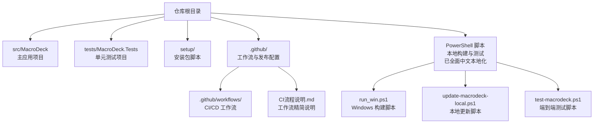
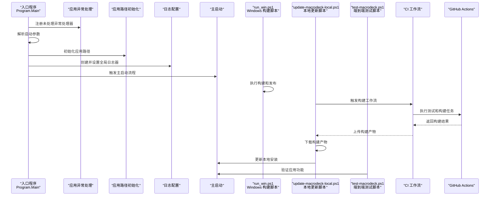
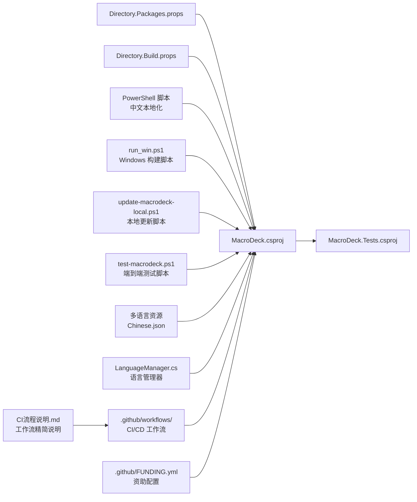
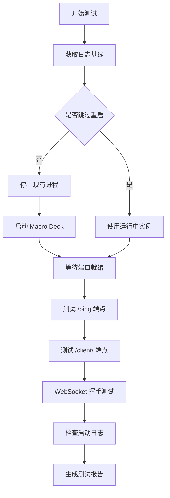
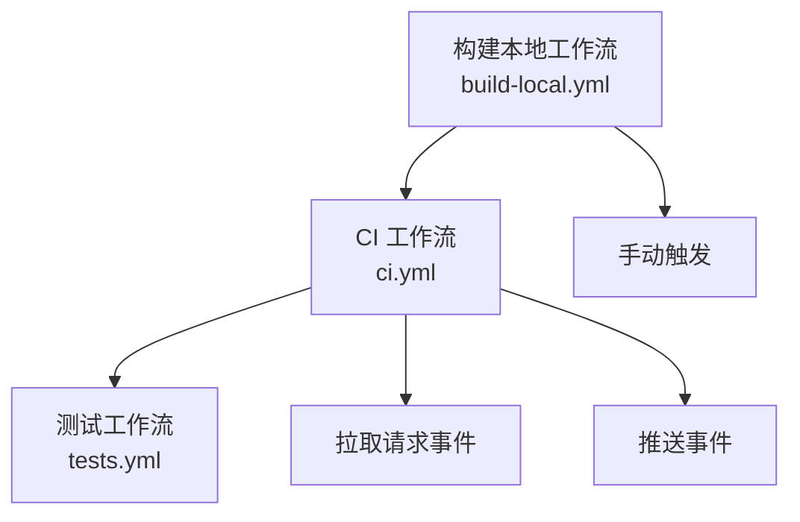

# 开发者指南

<cite>
**本文引用的文件**
- [README.md](file://README.md)
- [src/MacroDeck/README.md](file://src/MacroDeck/README.md)
- [Macro-Deck.slnx.DotSettings](file://Macro-Deck.slnx.DotSettings)
- [Directory.Build.props](file://Directory.Build.props)
- [Directory.Packages.props](file://Directory.Packages.props)
- [src/MacroDeck/Properties/launchSettings.json](file://src/MacroDeck/Properties/launchSettings.json)
- [src/MacroDeck/MacroDeck.csproj](file://src/MacroDeck/MacroDeck.csproj)
- [tests/MacroDeck.Tests/MacroDeck.Tests.csproj](file://tests/MacroDeck.Tests/MacroDeck.Tests.csproj)
- [.github/release.yml](file://.github/release.yml)
- [setup/Macro Deck.iss](file://setup/Macro Deck.iss)
- [src/MacroDeck/Program.cs](file://src/MacroDeck/Program.cs)
- [test-macrodeck.ps1](file://test-macrodeck.ps1)
- [update-macrodeck-local.ps1](file://update-macrodeck-local.ps1)
- [run_win.ps1](file://run_win.ps1)
- [自动化测试.md](file://自动化测试.md)
- [tests/MacroDeck.Tests/ConditionActionTests.cs](file://tests/MacroDeck.Tests/ConditionActionTests.cs)
- [src/MacroDeck/Resources/Languages/Chinese.json](file://src/MacroDeck/Resources/Languages/Chinese.json)
- [src/MacroDeck/Language/LanguageManager.cs](file://src/MacroDeck/Language/LanguageManager.cs)
- [.github/workflows/ci.yml](file://.github/workflows/ci.yml)
- [.github/workflows/build-local.yml](file://.github/workflows/build-local.yml)
- [.github/workflows/tests.yml](file://.github/workflows/tests.yml)
- [.github/FUNDING.yml](file://.github/FUNDING.yml)
- [CI流程说明.md](file://CI流程说明.md)
</cite>

## 更新摘要
**所做更改**
- 新增 run_win.ps1 PowerShell 构建脚本的详细说明，提供更强大的 Windows 构建自动化功能
- 更新本地构建自动化系统章节，反映 run_win.ps1 的 -Build 参数、配置参数和输出目录参数
- 增强 PowerShell 脚本的中文本地化说明，包括 run_win.ps1 的中文界面支持
- 完善多语言支持生态系统，包括 LanguageManager 类和语言资源管理
- 更新 CI/CD 流程与 GitHub Actions 配置，反映新增的构建脚本
- 新增 CI 流程说明文档，详细解释工作流的精简和删除历史

## 目录
1. [简介](#简介)
2. [项目结构](#项目结构)
3. [核心组件](#核心组件)
4. [架构总览](#架构总览)
5. [详细组件分析](#详细组件分析)
6. [依赖关系分析](#依赖关系分析)
7. [性能考虑](#性能考虑)
8. [故障排查指南](#故障排查指南)
9. [本地构建自动化系统](#本地构建自动化系统)
10. [端到端冒烟测试](#端到端冒烟测试)
11. [CI/CD 流程与 GitHub Actions](#cicd-流程与-github-actions)
12. [文档基础设施增强](#文档基础设施增强)
13. [CI 流程说明](#ci-流程说明)
14. [结论](#结论)
15. [附录](#附录)

## 简介
本指南面向 Macro-Deck 的开发者与贡献者，覆盖开发环境搭建、代码规范、贡献流程、IDE 配置、调试与构建、插件开发流程、版本控制与分支管理、CI/CD 与自动化测试、发布流程与版本管理等主题。内容基于仓库中的实际配置文件与源码进行整理，确保可操作性与一致性。

**更新** 新增完整的 run_win.ps1 PowerShell 构建脚本，提供更强大的 Windows 构建自动化功能，包括 -Build 参数、配置参数和输出目录参数，以及自动生成的便携启动脚本。同时增强了 PowerShell 脚本的中文本地化支持，为中文开发者提供更好的开发体验。新增 CI 流程说明文档，详细解释了工作流的精简和删除历史。

## 项目结构
仓库采用多项目布局：核心应用位于 src/MacroDeck，测试项目位于 tests/MacroDeck.Tests；根目录包含全局构建属性、包版本集中管理、GitHub 发布配置以及安装包脚本。新增的 PowerShell 脚本提供了本地构建和测试自动化能力，现已实现全面中文本地化。.github 目录包含完整的 CI/CD 配置。



**章节来源**
- [src/MacroDeck/MacroDeck.csproj:1-363](file://src/MacroDeck/MacroDeck.csproj#L1-L363)
- [tests/MacroDeck.Tests/MacroDeck.Tests.csproj:1-26](file://tests/MacroDeck.Tests/MacroDeck.Tests.csproj#L1-L26)
- [Directory.Build.props:1-11](file://Directory.Build.props#L1-L11)
- [Directory.Packages.props:1-35](file://Directory.Packages.props#L1-L35)
- [run_win.ps1:1-91](file://run_win.ps1#L1-L91)
- [update-macrodeck-local.ps1:1-219](file://update-macrodeck-local.ps1#L1-L219)
- [test-macrodeck.ps1:1-200](file://test-macrodeck.ps1#L1-L200)
- [.github/workflows/ci.yml:1-18](file://.github/workflows/ci.yml#L1-L18)
- [.github/workflows/build-local.yml:1-27](file://.github/workflows/build-local.yml#L1-L27)
- [.github/workflows/tests.yml:1-19](file://.github/workflows/tests.yml#L1-L19)
- [CI流程说明.md:1-52](file://CI流程说明.md#L1-L52)

## 核心组件
- 应用入口与启动流程：程序入口负责异常处理注册、运行实例检测、路径初始化与日志系统初始化，并调用主启动逻辑。
- 启动参数解析：通过启动参数控制导出默认字符串、显示窗口、日志级别、测试通道与调试控制台等行为。
- 构建与打包：使用 MSBuild 与 Inno Setup 脚本生成安装包，自动注入产品版本并处理 VC++ 运行库需求。
- **新增** Windows 构建自动化：通过 run_win.ps1 PowerShell 脚本实现一键构建和发布，支持配置参数和输出目录自定义。
- **新增** 本地构建自动化：通过 PowerShell 脚本实现 CI 工作流触发、构建等待、产物下载和本地更新，现已全面支持中文界面。
- **新增** CI/CD 流程：完整的 GitHub Actions 工作流配置，包括测试执行、构建发布和工作流调用机制。
- **新增** CI 流程精简：从上游仓库的完整 CI 流程精简为三个可用的工作流，删除五个依赖官方资源的工作流。

**章节来源**
- [src/MacroDeck/Program.cs:1-80](file://src/MacroDeck/Program.cs#L1-L80)
- [src/MacroDeck/Properties/launchSettings.json:1-9](file://src/MacroDeck/Properties/launchSettings.json#L1-L9)
- [setup/Macro Deck.iss:1-106](file://setup/Macro Deck.iss#L1-L106)
- [run_win.ps1:1-91](file://run_win.ps1#L1-L91)
- [update-macrodeck-local.ps1:1-219](file://update-macrodeck-local.ps1#L1-L219)
- [.github/workflows/ci.yml:1-18](file://.github/workflows/ci.yml#L1-L18)
- [.github/workflows/build-local.yml:1-27](file://.github/workflows/build-local.yml#L1-L27)
- [.github/workflows/tests.yml:1-19](file://.github/workflows/tests.yml#L1-L19)
- [CI流程说明.md:1-52](file://CI流程说明.md#L1-L52)

## 架构总览
下图展示从入口到启动、日志与服务的关键交互，以及新增的本地构建自动化流程和 CI/CD 工作流：



**图表来源**
- [src/MacroDeck/Program.cs:12-35](file://src/MacroDeck/Program.cs#L12-L35)
- [run_win.ps1:24-62](file://run_win.ps1#L24-L62)
- [update-macrodeck-local.ps1:132-157](file://update-macrodeck-local.ps1#L132-L157)
- [.github/workflows/ci.yml:13-17](file://.github/workflows/ci.yml#L13-L17)
- [.github/workflows/build-local.yml:6-26](file://.github/workflows/build-local.yml#L6-L26)

**章节来源**
- [src/MacroDeck/Program.cs:12-35](file://src/MacroDeck/Program.cs#L12-L35)
- [run_win.ps1:24-62](file://run_win.ps1#L24-L62)
- [update-macrodeck-local.ps1:132-157](file://update-macrodeck-local.ps1#L132-L157)
- [.github/workflows/ci.yml:13-17](file://.github/workflows/ci.yml#L13-L17)
- [.github/workflows/build-local.yml:6-26](file://.github/workflows/build-local.yml#L6-L26)

## 详细组件分析

### 插件开发 API 与使用方式
- 宏定义：插件开发 API 以 NuGet 包形式提供，编译期引用，运行时由宿主提供实现，避免重复打包。
- 使用建议：在插件项目中添加对 API 包的引用，遵循仅编译期依赖的约束。

**章节来源**
- [README.md:21-32](file://README.md#L21-L32)
- [src/MacroDeck/README.md:1-24](file://src/MacroDeck/README.md#L1-L24)

### 代码风格与 IDE 配置（Rider/JetBrains）
- 命名空间与修饰符：强制按顺序排列命名空间与成员修饰符，要求大括号风格一致。
- 缩进与换行：使用空格缩进，设定行长阈值，参数与长表达式换行策略明确。
- 其他规则：禁止冗余 using、建议显式静态限定符、统一内部修饰符策略等。

**章节来源**
- [Macro-Deck.slnx.DotSettings:1-82](file://Macro-Deck.slnx.DotSettings#L1-L82)

### 构建与运行配置
- 目标框架与特性：启用可空引用注解、隐式 using、禁用部分警告。
- 测试 SDK：集中管理测试相关包版本，便于统一升级与分析。
- 启动参数：命令行参数用于导出默认字符串、显示界面、日志等级、测试通道与调试控制台。

**章节来源**
- [Directory.Build.props:1-11](file://Directory.Build.props#L1-L11)
- [Directory.Packages.props:1-35](file://Directory.Packages.props#L1-L35)
- [src/MacroDeck/Properties/launchSettings.json:1-9](file://src/MacroDeck/Properties/launchSettings.json#L1-L9)

### 项目文件与资源组织
- WPF/WinForms 支持：启用 WPF 与 Windows Forms，输出类型为 WinExe。
- 资源嵌入：语言资源与 wwwroot 内容按规则嵌入或复制至输出目录。
- 框架引用：包含 ASP.NET 运行时以便内建 Web 客户端与服务。
- 版本信息：产品版本、公司、作者、许可证等元数据集中配置。

**章节来源**
- [src/MacroDeck/MacroDeck.csproj:1-363](file://src/MacroDeck/MacroDeck.csproj#L1-L363)

### 测试项目与覆盖率
- 测试 SDK 与 NUnit：使用 Microsoft.NET.Test.Sdk、NUnit 及适配器，支持分析器与覆盖率收集。
- 项目引用：测试项目引用主应用项目，便于集成测试。

**章节来源**
- [tests/MacroDeck.Tests/MacroDeck.Tests.csproj:1-26](file://tests/MacroDeck.Tests/MacroDeck.Tests.csproj#L1-L26)

### 安装包与发布
- Inno Setup 脚本：读取发布目录产物版本，生成安装包名称；自动检测并安装 VC++ 运行库；创建防火墙规则；安装后自动启动应用。
- 发布配置：GitHub Release 的变更日志分类标签，便于自动生成 Changelog。

**章节来源**
- [setup/Macro Deck.iss:1-106](file://setup/Macro Deck.iss#L1-L106)
- [.github/release.yml:1-21](file://.github/release.yml#L1-L21)

### 多语言支持生态系统
**新增** 项目现已建立完整的多语言支持生态系统：

- **内置中文支持**：通过 `Chinese.json` 资源文件提供完整的中文本地化
- **动态语言切换**：支持运行时语言切换与回退机制
- **编码兼容性**：确保所有文本资源正确显示中文字符
- **国际化最佳实践**：为插件开发者提供本地化指导
- **语言管理器**：通过 `LanguageManager` 类统一管理语言资源加载和切换

**章节来源**
- [src/MacroDeck/Resources/Languages/Chinese.json:1-200](file://src/MacroDeck/Resources/Languages/Chinese.json#L1-L200)
- [src/MacroDeck/Language/LanguageManager.cs:1-156](file://src/MacroDeck/Language/LanguageManager.cs#L1-L156)

## 依赖关系分析
- 中央化包版本：通过 Directory.Packages.props 统一管理第三方包版本，降低维护成本。
- 应用与测试：测试项目引用主应用项目，形成清晰的测试边界。
- 外部依赖：日志、序列化、数据库、图形处理、二维码、ADB 等库集中声明。
- **新增** 本地化支持：多语言资源文件与编码设置确保国际化兼容性。
- **新增** CI/CD 依赖：GitHub Actions 工作流文件提供完整的持续集成配置。
- **新增** PowerShell 脚本依赖：run_win.ps1 依赖 .NET SDK 进行构建。
- **新增** CI 流程精简：从上游仓库的完整 CI 流程精简为三个可用工作流。



**图表来源**
- [src/MacroDeck/MacroDeck.csproj:42-67](file://src/MacroDeck/MacroDeck.csproj#L42-L67)
- [tests/MacroDeck.Tests/MacroDeck.Tests.csproj:22-23](file://tests/MacroDeck.Tests/MacroDeck.Tests.csproj#L22-L23)
- [Directory.Packages.props:1-35](file://Directory.Packages.props#L1-L35)
- [Directory.Build.props:1-11](file://Directory.Build.props#L1-L11)
- [run_win.ps1:24-62](file://run_win.ps1#L24-L62)
- [update-macrodeck-local.ps1:84-87](file://update-macrodeck-local.ps1#L84-L87)
- [test-macrodeck.ps1:31-32](file://test-macrodeck.ps1#L31-32)
- [src/MacroDeck/Resources/Languages/Chinese.json:1-161](file://src/MacroDeck/Resources/Languages/Chinese.json#L1-L161)
- [src/MacroDeck/Language/LanguageManager.cs:36-88](file://src/MacroDeck/Language/LanguageManager.cs#L36-L88)
- [.github/workflows/ci.yml:1-18](file://.github/workflows/ci.yml#L1-L18)
- [.github/workflows/build-local.yml:1-27](file://.github/workflows/build-local.yml#L1-L27)
- [.github/workflows/tests.yml:1-19](file://.github/workflows/tests.yml#L1-L19)
- [.github/FUNDING.yml:1-14](file://.github/FUNDING.yml#L1-L14)
- [CI流程说明.md:1-52](file://CI流程说明.md#L1-L52)

**章节来源**
- [src/MacroDeck/MacroDeck.csproj:42-67](file://src/MacroDeck/MacroDeck.csproj#L42-L67)
- [tests/MacroDeck.Tests/MacroDeck.Tests.csproj:22-23](file://tests/MacroDeck.Tests/MacroDeck.Tests.csproj#L22-L23)
- [Directory.Packages.props:1-35](file://Directory.Packages.props#L1-L35)
- [Directory.Build.props:1-11](file://Directory.Build.props#L1-L11)
- [run_win.ps1:24-62](file://run_win.ps1#L24-L62)
- [update-macrodeck-local.ps1:84-87](file://update-macrodeck-local.ps1#L84-L87)
- [test-macrodeck.ps1:31-32](file://test-macrodeck.ps1#L31-32)
- [src/MacroDeck/Resources/Languages/Chinese.json:1-200](file://src/MacroDeck/Resources/Languages/Chinese.json#L1-L200)
- [src/MacroDeck/Language/LanguageManager.cs:36-88](file://src/MacroDeck/Language/LanguageManager.cs#L36-L88)
- [.github/workflows/ci.yml:1-18](file://.github/workflows/ci.yml#L1-L18)
- [.github/workflows/build-local.yml:1-27](file://.github/workflows/build-local.yml#L1-L27)
- [.github/workflows/tests.yml:1-19](file://.github/workflows/tests.yml#L1-L19)
- [.github/FUNDING.yml:1-14](file://.github/FUNDING.yml#L1-L14)
- [CI流程说明.md:1-52](file://CI流程说明.md#L1-L52)

## 性能考虑
- 日志初始化：在应用启动早期即建立日志系统，有助于快速定位性能瓶颈与异常。
- 单实例控制：运行时检测并激活已有实例，避免重复启动带来的资源浪费。
- 资源嵌入：语言与静态资源嵌入减少磁盘 IO，提升加载速度。
- 图形与模板：图像处理与模板渲染需注意内存占用与缓存策略，避免频繁分配。
- **新增** 编码优化：UTF-8 编码设置确保中文字符正确显示，避免编码转换开销。
- **新增** CI/CD 性能：GitHub Actions 工作流采用并行执行和缓存机制，提升构建效率。
- **新增** 构建优化：run_win.ps1 脚本提供一键构建功能，减少手动操作时间。
- **新增** CI 流程精简：删除五个依赖官方资源的工作流，减少不必要的构建开销。

**章节来源**
- [src/MacroDeck/Program.cs:30-34](file://src/MacroDeck/Program.cs#L30-L34)
- [src/MacroDeck/Program.cs:37-66](file://src/MacroDeck/Program.cs#L37-L66)
- [src/MacroDeck/MacroDeck.csproj:34-40](file://src/MacroDeck/MacroDeck.csproj#L34-L40)
- [run_win.ps1:46-47](file://run_win.ps1#L46-L47)
- [.github/workflows/ci.yml:13-17](file://.github/workflows/ci.yml#L13-L17)

## 故障排查指南
- 异常捕获：应用级与线程级未处理异常均被记录，便于问题追踪。
- 调试控制台：启动参数支持开启调试控制台，便于本地诊断。
- 防火墙规则：安装脚本自动添加入站/出站规则，若无法连接可检查系统防火墙策略。
- 运行库缺失：安装脚本会检测并安装 VC++ 运行库，确保依赖满足。
- **新增** 中文显示问题：如遇中文乱码，检查控制台编码设置，确保 UTF-8 正确配置。
- **新增** CI/CD 问题：如工作流执行失败，检查 GitHub Actions 权限和网络连接。
- **新增** 构建脚本问题：如 run_win.ps1 执行失败，检查 .NET SDK 是否正确安装。
- **新增** CI 工作流问题：如 CI 工作流无法运行，检查 fork 仓库的权限设置。

**章节来源**
- [src/MacroDeck/Program.cs:68-78](file://src/MacroDeck/Program.cs#L68-L78)
- [src/MacroDeck/Properties/launchSettings.json:5](file://src/MacroDeck/Properties/launchSettings.json#L5)
- [setup/Macro Deck.iss:104-105](file://setup/Macro Deck.iss#L104-L105)
- [setup/Macro Deck.iss:38-59](file://setup/Macro Deck.iss#L38-L59)
- [run_win.ps1:24-62](file://run_win.ps1#L24-L62)
- [.github/workflows/ci.yml:3-11](file://.github/workflows/ci.yml#L3-L11)

## 本地构建自动化系统

**新增** 本节介绍 Macro-Deck 的本地构建自动化系统，通过 PowerShell 脚本实现 CI 工作流的本地触发和产物更新。该系统现已实现全面中文本地化，显著提升中文用户的开发体验。

### Windows 构建脚本（run_win.ps1）

**新增** run_win.ps1 是一个全新的 PowerShell 构建脚本，提供了更强大的 Windows 构建自动化功能：

#### 功能特性
- **一键构建**：通过 -Build 参数执行完整的构建和发布流程
- **配置参数**：支持 -Configuration 参数指定 Release 或 Debug 配置
- **输出目录**：支持 -Output 参数自定义输出目录，默认为 "C:\Program Files\Macro Deck"
- **便携启动**：自动创建启动脚本，支持便携模式运行
- **依赖检查**：自动检查 .NET SDK 是否正确安装
- **管理员权限**：自动检测并提示管理员权限需求

#### 使用方法

```powershell
# 基本构建（Release 配置，输出到默认目录）
.\run_win.ps1 -Build

# 指定 Debug 配置
.\run_win.ps1 -Build -Configuration Debug

# 指定自定义输出目录
.\run_win.ps1 -Build -Output "build_output"

# 构建并运行
.\run_win.ps1 -Build -Run

# 便携模式运行
.\run_win.ps1 -Run -Portable

# 显示帮助信息
.\run_win.ps1
```

#### 参数说明

| 参数 | 类型 | 默认值 | 说明 |
|------|------|--------|------|
| `-Build` | switch | false | 执行构建和发布 |
| `-Run` | switch | false | 退出旧版本并运行已发布的最新版本 |
| `-Portable` | switch | false | 便携模式运行（数据存于输出目录的 Data 子目录） |
| `-Configuration` | string | "Release" | 构建配置（Release 或 Debug） |
| `-Output` | string | "C:\Program Files\Macro Deck" | 输出目录路径 |

#### 技术实现要点

- **.NET SDK 依赖**：脚本会检查 .NET SDK 是否安装，未安装时给出详细错误提示
- **项目定位**：自动定位 src/MacroDeck/MacroDeck.csproj 项目文件
- **构建流程**：执行 dotnet restore 和 dotnet publish 命令
- **便携支持**：自动生成 ASCII 编码的启动脚本，支持 --portable 参数
- **错误处理**：每个命令执行后检查返回码，失败时立即退出
- **权限检查**：自动检测输出目录是否位于受保护位置，提示管理员权限

#### 中文本地化特色

**更新** 脚本现已实现基本的中文本地化支持：

- **帮助信息**：使用中文显示脚本用法和参数说明
- **错误提示**：.NET SDK 未安装时显示中文错误信息
- **构建状态**：构建过程中的状态信息使用中文显示
- **权限提示**：管理员权限检查和提示使用中文

### 构建本地更新器（update-macrodeck-local.ps1）

该脚本提供了完整的本地构建自动化流程，现已全面支持中文界面：

#### 功能特性
- **CI 工作流触发**：通过 GitHub CLI 触发远程构建（中文提示）
- **构建状态监控**：轮询构建状态直到完成（中文状态显示）
- **产物下载**：自动下载构建产物并提取到临时目录
- **安全更新**：仅复制程序文件，保留用户数据目录
- **自动重启**：更新完成后自动重启应用

#### 使用方法

```powershell
# 触发新的构建并更新本地安装
powershell -ExecutionPolicy Bypass -File .\update-macrodeck-local.ps1

# 使用最近的成功构建更新本地安装
powershell -ExecutionPolicy Bypass -File .\update-macrodeck-local.ps1 -SkipBuild

# 查看最新版本号
powershell -ExecutionPolicy Bypass -File .\update-macrodeck-local.ps1 -Version

# 查看最近 5 次构建状态
powershell -ExecutionPolicy Bypass -File .\update-macrodeck-local.ps1 -Status
```

#### 参数说明

| 参数 | 类型 | 默认值 | 说明 |
|------|------|--------|------|
| `-Install` | switch | false | 下载最近一次成功的 CI 编译产物并安装到本地（不触发新构建） |
| `-Build` | switch | false | 触发一次新的 build-local CI 编译，等待完成后再下载安装 |
| `-Version` | switch | false | 仅查询 GitHub 上最新的版本号（main 分支 csproj 的 Version 及最新 Release） |
| `-Status` | switch | false | 仅查询最近 5 次 CI 构建状态，然后退出 |
| `-Help` | switch | false | 显示帮助信息 |
| `-Repo` | string | "tea4go/Macro-Deck" | GitHub 仓库，格式为 owner/repo |
| `-InstallDir` | string | "C:\Program Files\Macro Deck" | Macro Deck 安装目录 |

#### 技术实现要点

- **GitHub CLI 依赖**：脚本依赖 `gh` 命令行工具，需先安装 GitHub CLI
- **构建轮询**：最多等待 20 分钟，每 30 秒检查一次构建状态
- **产物提取**：自动查找包含 `Macro Deck 2.exe` 的发布根目录
- **文件过滤**：仅复制文件而非子目录，保护用户数据（plugins、wwwroot、Android Debug Bridge）
- **中文本地化**：所有用户界面消息、错误提示、状态显示均为中文

#### 中文本地化特色

**更新** 脚本现已实现全面中文本地化，包括：

- **脚本头部注释**：从英文翻译为中文，便于中文开发者理解
- **用户界面消息**：所有 `Write-Host` 输出的消息都已翻译为中文
- **错误提示**：所有错误消息和警告信息都已本地化
- **编码设置**：增加了 UTF-8 编码设置以确保中文显示正确
- **状态显示**：构建状态、进度提示、结果反馈均为中文

**章节来源**
- [run_win.ps1:1-91](file://run_win.ps1#L1-L91)
- [update-macrodeck-local.ps1:1-219](file://update-macrodeck-local.ps1#L1-L219)

### CI 工作流集成

脚本假设存在名为 `build-local.yml` 的 GitHub Actions 工作流，该工作流负责：

1. **构建项目**：编译 Macro-Deck 主程序
2. **生成产物**：创建包含所有必要文件的构建包
3. **上传工件**：将构建产物作为 GitHub Actions 工件保存

**章节来源**
- [update-macrodeck-local.ps1:48](file://update-macrodeck-local.ps1#L48)
- [update-macrodeck-local.ps1:132-157](file://update-macrodeck-local.ps1#L132-L157)
- [.github/workflows/build-local.yml:1-27](file://.github/workflows/build-local.yml#L1-L27)

## 端到端冒烟测试

**新增** 本节详细介绍 Macro-Deck 的端到端冒烟测试系统，通过 PowerShell 脚本验证应用的核心功能。

### 测试脚本概述（test-macrodeck.ps1）

该脚本提供了完整的端到端测试流程，验证 Macro-Deck 主应用的所有关键服务：

#### 测试范围
- HTTP 服务可用性
- REST API 健康检查
- Web 客户端静态文件服务
- WebSocket 协议握手
- 应用启动日志验证

#### 测试流程



**图表来源**
- [test-macrodeck.ps1:56-91](file://test-macrodeck.ps1#L56-L91)
- [test-macrodeck.ps1:93-154](file://test-macrodeck.ps1#L93-L154)
- [test-macrodeck.ps1:156-185](file://test-macrodeck.ps1#L156-L185)

#### 参数配置

| 参数 | 默认值 | 说明 |
|------|--------|------|
| `-SkipRestart` | false | 跳过重启，测试当前运行实例 |
| `-ClientId` | `lvgoejr` | WebSocket 握手使用的客户端ID |
| `-ServerHost` | `localhost` | 服务器主机地址 |
| `-Port` | `8191` | HTTP/WebSocket 端口号 |

#### 验证项目

| 检查项 | 验证内容 | 判定标准 |
|--------|----------|----------|
| `PortReady` | 服务端口监听 | TCP 能连接到指定端口 |
| `PingEndpoint` | 健康检查 | `GET /ping` 返回 200 |
| `WebClient` | 静态文件服务 | `GET /client/` 返回 200 |
| `WebSocketHandshake` | 协议握手 | `CONNECTED` + `GET_BUTTONS` 成功 |
| `StartupLog` | 启动日志 | 包含 `Loading plugins` 和 `startup finished` |

#### 故障排查指南

**WebClient FAIL（/client/ 返回 404）**
- 确认 Macro Deck 使用正确的启动目录
- 检查 `C:\Program Files\Macro Deck\wwwroot\client` 目录是否存在
- 脚本已自动设置工作目录，如仍失败请手动验证

**WebSocketHandshake FAIL**
- 验证客户端ID在 `devices.json` 中且 `Blocked=false`
- 确认握手使用的 API 版本不低于服务端要求（脚本中为 `"20"`）

**StartupLog FAIL**
- 查看 `%APPDATA%\Macro Deck\logs\log<日期>.txt`
- 关注 `Failed to start server` 错误信息（端口占用、SSL 配置等）

**章节来源**
- [test-macrodeck.ps1:1-200](file://test-macrodeck.ps1#L1-L200)
- [自动化测试.md:1-113](file://自动化测试.md#L1-L113)

### 测试执行与集成

#### 单元测试执行
```bash
dotnet test tests/MacroDeck.Tests/MacroDeck.Tests.csproj
```

#### 端到端测试执行
```powershell
# 重启后测试
powershell -ExecutionPolicy Bypass -File .\test-macrodeck.ps1

# 测试当前运行实例
powershell -ExecutionPolicy Bypass -File .\test-macrodeck.ps1 -SkipRestart
```

#### CI 集成示例
```powershell
powershell -ExecutionPolicy Bypass -File .\test-macrodeck.ps1
if ($LASTEXITCODE -ne 0) { throw "Macro Deck 端到端冒烟测试失败" }
```

**章节来源**
- [自动化测试.md:14-20](file://自动化测试.md#L14-L20)
- [自动化测试.md:52-62](file://自动化测试.md#L52-L62)
- [自动化测试.md:105-112](file://自动化测试.md#L105-L112)

## CI/CD 流程与 GitHub Actions

**新增** 本节详细介绍 Macro-Deck 的完整 CI/CD 流程，基于 GitHub Actions 的三个核心工作流文件。

### 工作流文件概览

项目包含三个核心的 GitHub Actions 工作流文件，共同构成完整的 CI/CD 系统：

#### 1. CI 工作流（ci.yml）
- **名称**：CI
- **触发条件**：支持 `workflow_call`、拉取请求、推送事件
- **分支限制**：针对 `production` 和 `main` 分支的拉取请求
- **核心功能**：调用测试工作流，继承密钥权限

#### 2. 构建本地工作流（build-local.yml）
- **名称**：Build Local
- **触发条件**：手动触发（workflow_dispatch）
- **运行环境**：windows-latest
- **核心功能**：构建发布 Windows 平台的应用程序，上传构建工件

#### 3. 测试工作流（tests.yml）
- **名称**：Run Tests
- **触发条件**：支持 `workflow_call`
- **核心功能**：执行单元测试，使用 .NET SDK 进行测试



**图表来源**
- [.github/workflows/ci.yml:3-11](file://.github/workflows/ci.yml#L3-L11)
- [.github/workflows/build-local.yml:3-4](file://.github/workflows/build-local.yml#L3-L4)
- [.github/workflows/tests.yml:3-4](file://.github/workflows/tests.yml#L3-L4)

### 工作流详细配置

#### CI 工作流配置
- **分支策略**：监控所有分支的推送事件，但仅对 `production` 和 `main` 分支的拉取请求执行测试
- **工作流调用**：使用 `uses` 指令调用独立的测试工作流，实现代码复用
- **密钥继承**：通过 `secrets: inherit` 继承父工作流的密钥权限

#### 构建本地工作流配置
- **手动触发**：仅在手动触发时执行，避免不必要的资源消耗
- **构建步骤**：使用 .NET SDK 10.0.x 进行发布构建
- **产物管理**：将构建产物上传为 GitHub Actions 工件，设置 7 天保留期

#### 测试工作流配置
- **通用设计**：作为可复用的工作流模块，被 CI 工作流调用
- **测试执行**：使用 `dotnet test` 命令执行单元测试项目
- **环境准备**：自动处理依赖恢复和测试执行

### 已删除工作流文件的历史背景

**重要说明**：根据更新原因，需要说明已删除的五个工作流文件的历史背景和替代方案。

#### 替代方案
- **模块化重构**：将复杂的单一工作流拆分为多个专门的工作流文件
- **权限优化**：通过独立的工作流文件更好地控制权限和访问
- **维护简化**：减少单个文件的复杂度，提高可维护性

#### 社区 fork 环境理解
对于社区 fork 环境，理解这些工作流文件的替代方案很重要：

- **权限限制**：fork 仓库通常无法直接访问主仓库的密钥和权限
- **功能限制**：某些需要特殊权限的操作（如发布、部署）在 fork 环境中不可用
- **替代方案**：社区开发者可以使用手动触发的工作流或本地构建脚本

### 社区 fork 环境下的 CI/CD 使用

#### 可用功能
- **测试执行**：可以执行单元测试和端到端测试
- **构建验证**：可以验证构建过程是否正常
- **代码质量检查**：可以运行代码分析和质量检查

#### 限制与约束
- **发布权限**：无法直接发布到生产环境
- **部署权限**：无法直接部署到目标服务器
- **密钥访问**：无法访问受保护的配置和凭据

#### 推荐做法
- **本地构建**：使用 `update-macrodeck-local.ps1` 脚本进行本地构建和测试
- **手动测试**：在本地环境中进行全面的功能测试
- **代码审查**：通过拉取请求的方式提交代码变更

**章节来源**
- [.github/workflows/ci.yml:1-18](file://.github/workflows/ci.yml#L1-L18)
- [.github/workflows/build-local.yml:1-27](file://.github/workflows/build-local.yml#L1-L27)
- [.github/workflows/tests.yml:1-19](file://.github/workflows/tests.yml#L1-L19)

### CI/CD 最佳实践

#### 工作流设计原则
- **模块化**：将复杂流程拆分为独立的可复用工作流
- **权限最小化**：仅授予工作流执行所需的基本权限
- **安全性**：敏感信息通过密钥管理，避免硬编码

#### 监控与报告
- **构建状态**：实时监控构建状态和测试结果
- **错误处理**：完善的错误处理和通知机制
- **日志记录**：详细的构建和测试日志便于问题排查

**章节来源**
- [.github/workflows/ci.yml:13-17](file://.github/workflows/ci.yml#L13-L17)
- [.github/workflows/build-local.yml:21-26](file://.github/workflows/build-local.yml#L21-L26)
- [.github/workflows/tests.yml:14-18](file://.github/workflows/tests.yml#L14-L18)

## 文档基础设施增强

**新增** 本节介绍 Macro-Deck 的文档基础设施改进，包括测试文档化和自动化测试流程，以及多语言支持的完善。

### 测试文档化

项目引入了详细的测试文档，将测试分为两个层次：

#### 1. 单元测试（NUnit）
- **测试范围**：纯逻辑测试，无需 GUI 环境
- **执行方式**：随 CI 的 `dotnet test` 运行
- **覆盖内容**：
  - `ConvertNameStringTests.cs`：变量名规范化
  - `StringCipherTest.cs`：加密解密往返
  - `TemplateManagerTests.cs`：模板关键字与渲染
  - `ConditionActionTests.cs`：条件动作配置序列化

#### 2. 端到端冒烟测试（PowerShell）
- **测试范围**：真实 GUI 环境下的完整功能验证
- **执行方式**：启动真实 Macro Deck，验证 HTTP 服务、WebSocket、启动日志
- **约束条件**：需要真实 GUI 环境，不适合无头云端 Runner

### 测试回归保护

`ConditionActionTests.cs` 提供了重要的回归测试保护：

#### 测试场景
1. **分支独立性测试**：确保 if 分支和 else 分支不会相互覆盖
2. **序列化往返测试**：验证配置序列化和反序列化的完整性
3. **条件字段保护测试**：确保条件类型的各个字段正确保存

#### 测试策略
- 使用与主应用相同的 JSON 序列化设置（`TypeNameHandling.Auto`）
- 不依赖 GUI 或 VariableManager，仅测试 JSON 序列化路径
- 提供具体的 bug 修复验证（修复了 if 分支动作同时序列化到两个配置键的问题）

### 多语言支持与本地化

**新增** 项目现已建立完整的多语言支持体系：

#### 语言资源管理
- **中文资源文件**：`Chinese.json` 提供完整的中文本地化
- **动态加载机制**：支持运行时语言切换
- **回退策略**：未本地化的文本自动回退到英语
- **语言管理器**：通过 `LanguageManager` 类统一管理语言资源

#### 本地化最佳实践
- **文本提取**：所有用户可见文本统一管理
- **占位符支持**：支持参数化文本（如 `{0}`、`{1}`）
- **编码兼容**：确保 UTF-8 编码正确处理

#### PowerShell 脚本本地化
- **全面中文界面**：所有脚本输出消息已翻译为中文
- **错误处理本地化**：错误提示和警告信息支持中文
- **编码优化**：自动设置 UTF-8 编码确保中文正确显示
- **新增** **run_win.ps1 中文支持**：构建脚本的中文界面和错误提示

### CI/CD 集成

#### GitHub Actions 配置
- **工作流文件**：`.github/workflows/build-local.yml`
- **触发条件**：push 到任意分支触发 CI
- **测试集成**：单元测试和端到端测试自动执行

#### 发布流程
- **版本管理**：通过 GitHub Release 的分类标签自动生成变更日志
- **变更分类**：feature、improvement、breaking-change、bug、dependencies 等
- **自动化发布**：基于标签的自动发布流程

**章节来源**
- [自动化测试.md:3-7](file://自动化测试.md#L3-L7)
- [自动化测试.md:22-44](file://自动化测试.md#L22-L44)
- [tests/MacroDeck.Tests/ConditionActionTests.cs:1-89](file://tests/MacroDeck.Tests/ConditionActionTests.cs#L1-L89)
- [src/MacroDeck/Resources/Languages/Chinese.json:1-200](file://src/MacroDeck/Resources/Languages/Chinese.json#L1-L200)
- [src/MacroDeck/Language/LanguageManager.cs:36-88](file://src/MacroDeck/Language/LanguageManager.cs#L36-L88)
- [run_win.ps1:8-14](file://run_win.ps1#L8-L14)
- [update-macrodeck-local.ps1:45-47](file://update-macrodeck-local.ps1#L45-L47)
- [.github/workflows/ci.yml:1-18](file://.github/workflows/ci.yml#L1-L18)
- [.github/workflows/build-local.yml:1-27](file://.github/workflows/build-local.yml#L1-L27)
- [.github/workflows/tests.yml:1-19](file://.github/workflows/tests.yml#L1-L19)
- [.github/release.yml:1-21](file://.github/release.yml#L1-L21)

## CI 流程说明

**新增** 本节详细介绍 Macro-Deck 的 CI 流程精简历史和当前状态。

### 背景说明

Macro Deck 上游仓库带有一整套面向官方发布的 CI 流程：编译官方安装包、推送到官方更新 API、发布 NuGet 包、从私有仓库拉取 Web Client 等。这些流程依赖只有官方组织才拥有的 secrets、私有仓库访问权限和官方 API，**在 fork 中无法运行**。

因此本 fork 精简为三个真正可用的工作流，其余五个已删除。

### 保留的工作流

| 工作流 | 文件 | 触发方式 | 作用 |
|--------|------|----------|------|
| CI | `ci.yml` | push / 向 main、production 提 PR | 编排测试，调用 `tests.yml` |
| Run Tests | `tests.yml` | 被 `ci.yml` 调用（workflow_call） | 实际执行 `dotnet test`，运行单元测试 |
| Build Local | `build-local.yml` | 手动触发（workflow_dispatch） | 编译主程序并上传产物（artifact），供本地更新脚本下载安装 |

#### 调用关系

```
ci.yml  (push / PR 触发)
   └── 调用 tests.yml  (dotnet test)

build-local.yml  (手动触发)
   └── dotnet publish → 上传 artifact: macro-deck-build
```

`build-local.yml` 与本地脚本 `update-macrodeck-local.ps1` 配合：脚本触发该工作流、等待完成、下载 artifact 并替换本地安装。

### 已删除的工作流及原因

以下五个工作流依赖 fork 不具备的资源，运行必然失败，已删除：

| 已删除 | 原作用 | 删除原因 |
|--------|--------|----------|
| `create-release.yml` | 官方发版：查官方版本号 API、创建 GitHub Release | 依赖 `secrets.PAT` 与官方 action `Macro-Deck-App/Actions/fetch-version`、`create-github-release` |
| `release-created.yml` | release 发布后的总编排（校验版本、触发构建/发包/通知） | 依赖官方更新 API `update.api.macro-deck.app` 校验、`secrets.WEBHOOK_KEY`、Discord 通知 action |
| `build-push-windows.yml` | 用 Inno Setup 打官方安装包并推送官方更新 API | 依赖 `secrets.UPDATE_SERVICE_TOKEN`、官方 action `push-to-update-api`、`secrets.SENTRY_DSN` |
| `publish-nuget.yml` | 发布 NuGet 包到 nuget.org | 依赖 `secrets.NUGET_USER`（官方 NuGet 账号 OIDC 登录） |
| `pull-web-client.yml` | 从私有仓库拉取并编译 Web Client | 依赖 `secrets.PRIVATE_REPO_PAT`，访问私有仓库 `Macro-Deck-App/Macro-Deck-Client-App` |

### 如何恢复官方发版流程

这些工作流已从 git 历史中删除，但仍可从上游仓库找回。若将来需要官方风格的发版，需要：

1. 从上游 `Macro-Deck-App/Macro-Deck` 复制对应的 `.yml` 文件回 `.github/workflows/`。
2. 在仓库 Settings → Secrets 中配置所需的 secrets（PAT、UPDATE_SERVICE_TOKEN、NUGET_USER、PRIVATE_REPO_PAT、SENTRY_DSN、WEBHOOK_KEY 等）。
3. 注意官方 API 校验（如 `update.api.macro-deck.app`）对第三方 fork 可能不可用。

对于 fork 的日常使用，`build-local.yml` + `update-macrodeck-local.ps1` 已足够：编译最新代码并更新本地安装。

**章节来源**
- [CI流程说明.md:1-52](file://CI流程说明.md#L1-L52)

## 结论
本指南总结了 Macro-Deck 的开发与发布全链路：从 IDE 风格、构建与测试，到插件 API 使用、安装包生成与发布分类，再到新增的本地构建自动化系统、端到端冒烟测试和完整的 CI/CD 流程。新引入的 run_win.ps1 PowerShell 构建脚本提供了更强大的 Windows 构建自动化功能，而增强的文档基础设施确保了测试流程的可追溯性和可维护性。

**特别值得强调的是**，CI/CD 流程的完善配置为项目提供了可靠的持续集成基础，包括：
- **模块化工作流设计**：通过独立的工作流文件实现功能分离和权限控制
- **社区 fork 友好**：为社区开发者提供了清晰的使用指导和替代方案
- **安全性保障**：通过密钥管理和权限最小化原则确保 CI/CD 流程的安全性
- **可维护性**：清晰的配置结构和文档说明便于后续维护和扩展
- **新增** **本地构建脚本**：run_win.ps1 提供了一键构建功能，简化开发流程
- **新增** **CI 流程精简**：从上游仓库的完整 CI 流程精简为三个可用工作流，提高了效率

建议在提交前遵循代码风格与测试要求，在合并前完成本地验证与回归测试。本地构建自动化系统特别适合需要频繁测试新功能的开发者，而端到端冒烟测试则确保了应用核心功能的稳定性。CI/CD 流程为项目的持续交付提供了可靠的技术支撑。

## 附录

### 开发环境搭建步骤
- 安装 .NET SDK（目标框架与测试 SDK）与 IDE（推荐 JetBrains Rider，已内置风格配置）。
- 克隆仓库并打开解决方案。
- **新增** 安装 GitHub CLI 以支持本地构建自动化。
- **新增** 确保 PowerShell 脚本的中文本地化功能正常工作。
- **新增** 配置 GitHub Actions 工作流的权限和密钥。
- **新增** 准备 .NET SDK 以支持 run_win.ps1 构建脚本。
- **新增** 配置 CI 流程说明，理解工作流的精简历史。
- 运行应用：通过调试配置或命令行参数启动，观察日志与界面行为。

**章节来源**
- [Directory.Build.props:4](file://Directory.Build.props#L4)
- [Directory.Packages.props:26-32](file://Directory.Packages.props#L26-L32)
- [src/MacroDeck/Properties/launchSettings.json:3-7](file://src/MacroDeck/Properties/launchSettings.json#L3-L7)
- [run_win.ps1:24-62](file://run_win.ps1#L24-L62)
- [update-macrodeck-local.ps1:84-87](file://update-macrodeck-local.ps1#L84-L87)
- [.github/workflows/ci.yml:16](file://.github/workflows/ci.yml#L16)
- [CI流程说明.md:1-52](file://CI流程说明.md#L1-L52)

### 插件开发流程与最佳实践
- 使用 API 包进行编译期开发，运行时由宿主提供实现。
- 在插件中最小化外部依赖，优先使用宿主提供的服务与工具类。
- 提供完善的配置视图与模型绑定，保持 UI 与逻辑分离。
- 编写单元测试与集成测试，确保跨平台兼容性。
- **新增** 考虑多语言支持，为插件提供本地化文本资源。
- **新增** 遵循 CI/CD 流程，确保代码质量和构建稳定性。

**章节来源**
- [README.md:23-32](file://README.md#L23-L32)
- [src/MacroDeck/README.md:9-18](file://src/MacroDeck/README.md#L9-L18)

### 版本控制与分支管理
- 分支策略：建议采用功能分支开发，主分支保持稳定，发布前打标签并生成变更日志。
- 提交信息：遵循语义化提交，配合 GitHub Release 的分类标签自动生成 Changelog。
- **新增** CI/CD 集成：通过 GitHub Actions 实现自动化测试和构建。
- **新增** CI 流程精简：理解工作流的删除历史和替代方案。

**章节来源**
- [.github/release.yml:1-21](file://.github/release.yml#L1-L21)
- [.github/workflows/ci.yml:3-11](file://.github/workflows/ci.yml#L3-L11)
- [CI流程说明.md:1-52](file://CI流程说明.md#L1-L52)

### 持续集成与自动化测试
- 测试执行：使用 NUnit 与适配器，结合 Microsoft.NET.Test.Sdk 进行自动化测试。
- 覆盖率：启用 coverlet 收集器，生成覆盖率报告。
- CI 集成：可在 CI 中复用现有测试配置，确保每次提交的质量门禁。
- **新增** 端到端测试：通过 PowerShell 脚本实现完整的 GUI 环境测试。
- **新增** 多语言测试：确保本地化功能在不同语言环境下正常工作。
- **新增** CI/CD 流程：通过 GitHub Actions 实现完整的持续集成和部署。
- **新增** 构建脚本测试：run_win.ps1 提供一键构建功能，支持配置参数和输出目录自定义。
- **新增** CI 流程精简：理解工作流的删除历史，使用精简后的可用工作流。

**章节来源**
- [Directory.Packages.props:26-32](file://Directory.Packages.props#L26-L32)
- [tests/MacroDeck.Tests/MacroDeck.Tests.csproj:8-18](file://tests/MacroDeck.Tests/MacroDeck.Tests.csproj#L8-L18)
- [自动化测试.md:48-94](file://自动化测试.md#L48-L94)
- [.github/workflows/ci.yml:13-17](file://.github/workflows/ci.yml#L13-L17)
- [.github/workflows/tests.yml:14-18](file://.github/workflows/tests.yml#L14-L18)
- [CI流程说明.md:1-52](file://CI流程说明.md#L1-L52)

### 发布流程与版本管理
- 产物版本：安装包脚本从发布目录读取产品版本，确保与 Git 标签一致。
- 安装与依赖：自动检测并安装 VC++ 运行库，创建防火墙规则，安装后启动应用。
- 发布：使用 GitHub Release 的分类标签生成变更日志，便于用户理解更新内容。
- **新增** CI/CD 发布：通过 GitHub Actions 实现自动化发布流程。
- **新增** CI 流程精简：使用精简后的三个可用工作流进行发布。

**章节来源**
- [setup/Macro Deck.iss:8-10](file://setup/Macro Deck.iss#L8-L10)
- [setup/Macro Deck.iss:104-105](file://setup/Macro Deck.iss#L104-L105)
- [.github/release.yml:1-21](file://.github/release.yml#L1-L21)
- [CI流程说明.md:1-52](file://CI流程说明.md#L1-L52)

### 本地构建自动化使用指南

#### 快速开始
```powershell
# 基本使用 run_win.ps1
.\run_win.ps1 -Build

# 使用自定义参数
.\run_win.ps1 -Build -Configuration Debug -Output "build_output"

# 构建并运行
.\run_win.ps1 -Build -Run

# 便携模式运行
.\run_win.ps1 -Run -Portable

# 基本使用 update-macrodeck-local.ps1
powershell -ExecutionPolicy Bypass -File .\update-macrodeck-local.ps1

# 使用自定义参数
powershell -ExecutionPolicy Bypass -File .\update-macrodeck-local.ps1 `
    -Repo "your-org/Macro-Deck" `
    -InstallDir "C:\Custom\Path" `
    -SkipBuild
```

#### 常见使用场景
- **日常开发**：每次修改后快速测试新功能
- **回归测试**：在新构建上验证关键功能
- **团队协作**：共享最新的构建版本给团队成员

#### run_win.ps1 特色功能
**新增** run_win.ps1 提供了以下特色功能：
- **一键构建**：通过 -Build 参数自动执行完整的构建流程
- **配置灵活性**：支持 -Configuration 参数指定 Release 或 Debug
- **输出定制**：支持 -Output 参数自定义输出目录
- **便携支持**：自动生成启动脚本，支持便携模式运行
- **依赖检查**：自动验证 .NET SDK 是否正确安装
- **权限管理**：自动检测并提示管理员权限需求

#### 中文本地化特色
**新增** 使用本地化的 PowerShell 脚本具有以下优势：
- **中文提示**：所有构建状态、进度、结果都以中文显示
- **中文错误**：遇到问题时错误消息和解决建议均为中文
- **编码优化**：自动设置 UTF-8 编码，确保中文正确显示
- **友好体验**：整个构建过程完全中文界面，提升开发效率

#### 注意事项
- 确保 GitHub CLI 已正确安装和配置
- 网络连接稳定以支持构建和下载
- 备份重要数据以防意外覆盖
- 在企业网络环境中可能需要代理配置
- **新增** 确保 .NET SDK 10.0.x 已正确安装以支持 run_win.ps1
- **新增** 理解 CI 流程精简历史，使用精简后的可用工作流

**章节来源**
- [run_win.ps1:7-14](file://run_win.ps1#L7-L14)
- [run_win.ps1:18-29](file://run_win.ps1#L18-L29)
- [run_win.ps1:31-38](file://run_win.ps1#L31-L38)
- [update-macrodeck-local.ps1:18-27](file://update-macrodeck-local.ps1#L18-L27)
- [update-macrodeck-local.ps1:88-119](file://update-macrodeck-local.ps1#L88-L119)
- [update-macrodeck-local.ps1:37-42](file://update-macrodeck-local.ps1#L37-L42)
- [CI流程说明.md:1-52](file://CI流程说明.md#L1-L52)

### 多语言支持最佳实践

**新增** 为插件开发者提供的多语言支持指导：

#### 资源文件管理
- 将本地化文本存储在 `Resources/Languages/` 目录下
- 为每种支持的语言创建独立的 JSON 文件
- 使用统一的键命名约定，便于维护

#### 编码与兼容性
- 确保所有文本文件使用 UTF-8 编码
- 验证特殊字符和表情符号的正确显示
- 测试不同语言环境下的文本长度变化

#### 用户体验优化
- 提供英文回退机制
- 考虑文本方向和布局变化
- 为长文本提供适当的截断和省略策略

#### 语言管理器使用
- **新增** 使用 LanguageManager 类统一管理语言资源
- 支持运行时语言切换和动态加载
- 提供语言变更事件通知

**章节来源**
- [src/MacroDeck/Resources/Languages/Chinese.json:1-200](file://src/MacroDeck/Resources/Languages/Chinese.json#L1-L200)
- [src/MacroDeck/Language/LanguageManager.cs:36-88](file://src/MacroDeck/Language/LanguageManager.cs#L36-L88)

### CI/CD 流程最佳实践

**新增** 为开发者提供的 CI/CD 流程使用指导：

#### 工作流设计原则
- **模块化**：将复杂流程拆分为独立的可复用工作流
- **权限最小化**：仅授予工作流执行所需的基本权限
- **安全性**：敏感信息通过密钥管理，避免硬编码

#### 社区 fork 使用指南
- **可用功能**：测试执行、构建验证、代码质量检查
- **限制约束**：发布权限、部署权限、密钥访问
- **替代方案**：本地构建、手动测试、拉取请求

#### 监控与报告
- **构建状态**：实时监控构建状态和测试结果
- **错误处理**：完善的错误处理和通知机制
- **日志记录**：详细的构建和测试日志便于问题排查

#### 新增** 构建脚本集成
- **run_win.ps1 集成**：可作为本地开发的构建工具
- **CI/CD 集成**：与 GitHub Actions 工作流协同工作
- **参数传递**：支持配置参数和输出目录自定义
- **CI 流程精简**：理解工作流的删除历史，使用精简后的可用工作流

**章节来源**
- [.github/workflows/ci.yml:1-18](file://.github/workflows/ci.yml#L1-L18)
- [.github/workflows/build-local.yml:1-27](file://.github/workflows/build-local.yml#L1-L27)
- [.github/workflows/tests.yml:1-19](file://.github/workflows/tests.yml#L1-L19)
- [.github/FUNDING.yml:1-14](file://.github/FUNDING.yml#L1-L14)
- [CI流程说明.md:1-52](file://CI流程说明.md#L1-L52)

### 资助与社区支持

**新增** 项目通过多种渠道接受社区资助和支持：

#### 资助平台
- **GitHub Sponsors**：支持项目开发和维护
- **Ko-fi**：个人赞助平台，支持开发者工作
- **其他平台**：Patreon、Open Collective、Liberapay 等

#### 社区参与
- **问题反馈**：通过 GitHub Issues 提交 bug 和功能请求
- **代码贡献**：通过 Pull Requests 贡献代码和文档
- **社区讨论**：通过 Discussions 和 Issues 进行交流

**章节来源**
- [.github/FUNDING.yml:1-14](file://.github/FUNDING.yml#L1-L14)