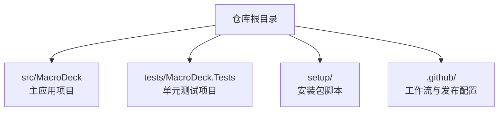
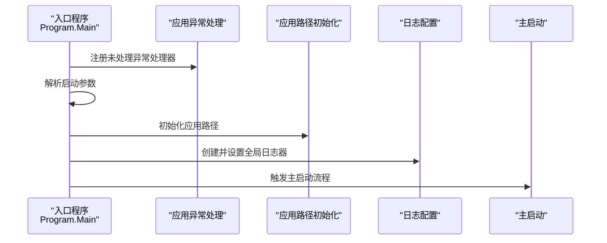
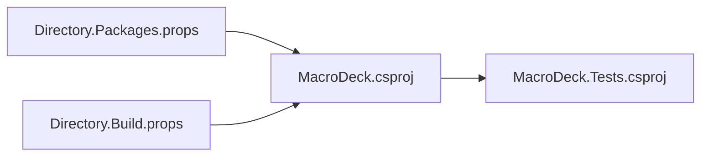

# 开发者指南

<cite>
**本文引用的文件**
- [README.md](file://README.md)
- [src/MacroDeck/README.md](file://src/MacroDeck/README.md)
- [Macro-Deck.slnx.DotSettings](file://Macro-Deck.slnx.DotSettings)
- [Directory.Build.props](file://Directory.Build.props)
- [Directory.Packages.props](file://Directory.Packages.props)
- [src/MacroDeck/Properties/launchSettings.json](file://src/MacroDeck/Properties/launchSettings.json)
- [src/MacroDeck/MacroDeck.csproj](file://src/MacroDeck/MacroDeck.csproj)
- [tests/MacroDeck.Tests/MacroDeck.Tests.csproj](file://tests/MacroDeck.Tests/MacroDeck.Tests.csproj)
- [.github/release.yml](file://.github/release.yml)
- [setup/Macro Deck.iss](file://setup/Macro Deck.iss)
- [src/MacroDeck/Program.cs](file://src/MacroDeck/Program.cs)
</cite>

## 目录
1. [简介](#简介)
2. [项目结构](#项目结构)
3. [核心组件](#核心组件)
4. [架构总览](#架构总览)
5. [详细组件分析](#详细组件分析)
6. [依赖关系分析](#依赖关系分析)
7. [性能考虑](#性能考虑)
8. [故障排查指南](#故障排查指南)
9. [结论](#结论)
10. [附录](#附录)

## 简介
本指南面向 Macro-Deck 的开发者与贡献者，覆盖开发环境搭建、代码规范、贡献流程、IDE 配置、调试与构建、插件开发流程、版本控制与分支管理、CI/CD 与自动化测试、发布流程与版本管理等主题。内容基于仓库中的实际配置文件与源码进行整理，确保可操作性与一致性。

## 项目结构
仓库采用多项目布局：核心应用位于 src/MacroDeck，测试项目位于 tests/MacroDeck.Tests；根目录包含全局构建属性、包版本集中管理、GitHub 发布配置以及安装包脚本。

**章节来源**
- [src/MacroDeck/MacroDeck.csproj:1-363](file://src/MacroDeck/MacroDeck.csproj#L1-L363)
- [tests/MacroDeck.Tests/MacroDeck.Tests.csproj:1-26](file://tests/MacroDeck.Tests/MacroDeck.Tests.csproj#L1-L26)
- [Directory.Build.props:1-11](file://Directory.Build.props#L1-L11)
- [Directory.Packages.props:1-35](file://Directory.Packages.props#L1-L35)

## 核心组件
- 应用入口与启动流程：程序入口负责异常处理注册、运行实例检测、路径初始化与日志系统初始化，并调用主启动逻辑。
- 启动参数解析：通过启动参数控制导出默认字符串、显示窗口、日志级别、测试通道与调试控制台等行为。
- 构建与打包：使用 MSBuild 与 Inno Setup 脚本生成安装包，自动注入产品版本并处理 VC++ 运行库需求。

**章节来源**
- [src/MacroDeck/Program.cs:1-80](file://src/MacroDeck/Program.cs#L1-L80)
- [src/MacroDeck/Properties/launchSettings.json:1-9](file://src/MacroDeck/Properties/launchSettings.json#L1-L9)
- [setup/Macro Deck.iss:1-106](file://setup/Macro Deck.iss#L1-L106)

## 架构总览
下图展示从入口到启动、日志与服务的关键交互：

**图表来源**
- [src/MacroDeck/Program.cs:12-35](file://src/MacroDeck/Program.cs#L12-L35)

**章节来源**
- [src/MacroDeck/Program.cs:12-35](file://src/MacroDeck/Program.cs#L12-L35)

## 详细组件分析

### 插件开发 API 与使用方式
- 宏定义：插件开发 API 以 NuGet 包形式提供，编译期引用，运行时由宿主提供实现，避免重复打包。
- 使用建议：在插件项目中添加对 API 包的引用，遵循仅编译期依赖的约束。

**章节来源**
- [README.md:21-32](file://README.md#L21-L32)
- [src/MacroDeck/README.md:1-24](file://src/MacroDeck/README.md#L1-L24)

### 代码风格与 IDE 配置（Rider/JetBrains）
- 命名空间与修饰符：强制按顺序排列命名空间与成员修饰符，要求大括号风格一致。
- 缩进与换行：使用空格缩进，设定行长阈值，参数与长表达式换行策略明确。
- 其他规则：禁止冗余 using、建议显式静态限定符、统一内部修饰符策略等。

**章节来源**
- [Macro-Deck.slnx.DotSettings:1-82](file://Macro-Deck.slnx.DotSettings#L1-L82)

### 构建与运行配置
- 目标框架与特性：启用可空引用注解、隐式 using、禁用部分警告。
- 测试 SDK：集中管理测试相关包版本，便于统一升级与分析。
- 启动参数：命令行参数用于导出默认字符串、显示界面、日志等级、测试通道与调试控制台。

**章节来源**
- [Directory.Build.props:1-11](file://Directory.Build.props#L1-L11)
- [Directory.Packages.props:1-35](file://Directory.Packages.props#L1-L35)
- [src/MacroDeck/Properties/launchSettings.json:1-9](file://src/MacroDeck/Properties/launchSettings.json#L1-L9)

### 项目文件与资源组织
- WPF/WinForms 支持：启用 WPF 与 Windows Forms，输出类型为 WinExe。
- 资源嵌入：语言资源与 wwwroot 内容按规则嵌入或复制至输出目录。
- 框架引用：包含 ASP.NET 运行时以便内建 Web 客户端与服务。
- 版本信息：产品版本、公司、作者、许可证等元数据集中配置。

**章节来源**
- [src/MacroDeck/MacroDeck.csproj:1-363](file://src/MacroDeck/MacroDeck.csproj#L1-L363)

### 测试项目与覆盖率
- 测试 SDK 与 NUnit：使用 Microsoft.NET.Test.Sdk、NUnit 及适配器，支持分析器与覆盖率收集。
- 项目引用：测试项目引用主应用项目，便于集成测试。

**章节来源**
- [tests/MacroDeck.Tests/MacroDeck.Tests.csproj:1-26](file://tests/MacroDeck.Tests/MacroDeck.Tests.csproj#L1-L26)

### 安装包与发布
- Inno Setup 脚本：读取发布目录产物版本，生成安装包名称；自动检测并安装 VC++ 运行库；创建防火墙规则；安装后自动启动应用。
- 发布配置：GitHub Release 的变更日志分类标签，便于自动生成 Changelog。

**章节来源**
- [setup/Macro Deck.iss:1-106](file://setup/Macro Deck.iss#L1-L106)
- [.github/release.yml:1-21](file://.github/release.yml#L1-L21)

## 依赖关系分析
- 中央化包版本：通过 Directory.Packages.props 统一管理第三方包版本，降低维护成本。
- 应用与测试：测试项目引用主应用项目，形成清晰的测试边界。
- 外部依赖：日志、序列化、数据库、图形处理、二维码、ADB 等库集中声明。

**图表来源**
- [src/MacroDeck/MacroDeck.csproj:42-67](file://src/MacroDeck/MacroDeck.csproj#L42-L67)
- [tests/MacroDeck.Tests/MacroDeck.Tests.csproj:22-23](file://tests/MacroDeck.Tests/MacroDeck.Tests.csproj#L22-L23)
- [Directory.Packages.props:1-35](file://Directory.Packages.props#L1-L35)
- [Directory.Build.props:1-11](file://Directory.Build.props#L1-L11)

**章节来源**
- [src/MacroDeck/MacroDeck.csproj:42-67](file://src/MacroDeck/MacroDeck.csproj#L42-L67)
- [tests/MacroDeck.Tests/MacroDeck.Tests.csproj:22-23](file://tests/MacroDeck.Tests/MacroDeck.Tests.csproj#L22-L23)
- [Directory.Packages.props:1-35](file://Directory.Packages.props#L1-L35)
- [Directory.Build.props:1-11](file://Directory.Build.props#L1-L11)

## 性能考虑
- 日志初始化：在应用启动早期即建立日志系统，有助于快速定位性能瓶颈与异常。
- 单实例控制：运行时检测并激活已有实例，避免重复启动带来的资源浪费。
- 资源嵌入：语言与静态资源嵌入减少磁盘 IO，提升加载速度。
- 图形与模板：图像处理与模板渲染需注意内存占用与缓存策略，避免频繁分配。

**章节来源**
- [src/MacroDeck/Program.cs:30-34](file://src/MacroDeck/Program.cs#L30-L34)
- [src/MacroDeck/Program.cs:37-66](file://src/MacroDeck/Program.cs#L37-L66)
- [src/MacroDeck/MacroDeck.csproj:34-40](file://src/MacroDeck/MacroDeck.csproj#L34-L40)

## 故障排查指南
- 异常捕获：应用级与线程级未处理异常均被记录，便于问题追踪。
- 调试控制台：启动参数支持开启调试控制台，便于本地诊断。
- 防火墙规则：安装脚本自动添加入站/出站规则，若无法连接可检查系统防火墙策略。
- 运行库缺失：安装脚本会检测并安装 VC++ 运行库，确保依赖满足。

**章节来源**
- [src/MacroDeck/Program.cs:68-78](file://src/MacroDeck/Program.cs#L68-L78)
- [src/MacroDeck/Properties/launchSettings.json:5](file://src/MacroDeck/Properties/launchSettings.json#L5)
- [setup/Macro Deck.iss:104-105](file://setup/Macro Deck.iss#L104-L105)
- [setup/Macro Deck.iss:38-59](file://setup/Macro Deck.iss#L38-L59)

## 结论
本指南总结了 Macro-Deck 的开发与发布全链路：从 IDE 风格、构建与测试，到插件 API 使用、安装包生成与发布分类，帮助新老开发者高效协作。建议在提交前遵循代码风格与测试要求，在合并前完成本地验证与回归测试。

## 附录

### 开发环境搭建步骤
- 安装 .NET SDK（目标框架与测试 SDK）与 IDE（推荐 JetBrains Rider，已内置风格配置）。
- 克隆仓库并打开解决方案。
- 运行应用：通过调试配置或命令行参数启动，观察日志与界面行为。

**章节来源**
- [Directory.Build.props:4](file://Directory.Build.props#L4)
- [Directory.Packages.props:26-32](file://Directory.Packages.props#L26-L32)
- [src/MacroDeck/Properties/launchSettings.json:3-7](file://src/MacroDeck/Properties/launchSettings.json#L3-L7)

### 插件开发流程与最佳实践
- 使用 API 包进行编译期开发，运行时由宿主提供实现。
- 在插件中最小化外部依赖，优先使用宿主提供的服务与工具类。
- 提供完善的配置视图与模型绑定，保持 UI 与逻辑分离。
- 编写单元测试与集成测试，确保跨平台兼容性。

**章节来源**
- [README.md:23-32](file://README.md#L23-L32)
- [src/MacroDeck/README.md:9-18](file://src/MacroDeck/README.md#L9-L18)

### 版本控制与分支管理
- 分支策略：建议采用功能分支开发，主分支保持稳定，发布前打标签并生成变更日志。
- 提交信息：遵循语义化提交，配合 GitHub Release 的分类标签自动生成 Changelog。

**章节来源**
- [.github/release.yml:1-21](file://.github/release.yml#L1-L21)

### 持续集成与自动化测试
- 测试执行：使用 NUnit 与适配器，结合 Microsoft.NET.Test.Sdk 进行自动化测试。
- 覆盖率：启用 coverlet 收集器，生成覆盖率报告。
- CI 集成：可在 CI 中复用现有测试配置，确保每次提交的质量门禁。

**章节来源**
- [Directory.Packages.props:26-32](file://Directory.Packages.props#L26-L32)
- [tests/MacroDeck.Tests/MacroDeck.Tests.csproj:8-18](file://tests/MacroDeck.Tests/MacroDeck.Tests.csproj#L8-L18)

### 发布流程与版本管理
- 产物版本：安装包脚本从发布目录读取产品版本，确保与 Git 标签一致。
- 安装与依赖：自动检测并安装 VC++ 运行库，创建防火墙规则，安装后启动应用。
- 发布：使用 GitHub Release 的分类标签生成变更日志，便于用户理解更新内容。

**章节来源**
- [setup/Macro Deck.iss:8-10](file://setup/Macro Deck.iss#L8-L10)
- [setup/Macro Deck.iss:104-105](file://setup/Macro Deck.iss#L104-L105)
- [.github/release.yml:1-21](file://.github/release.yml#L1-L21)