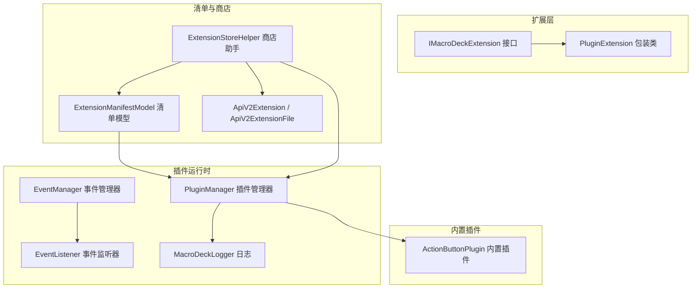
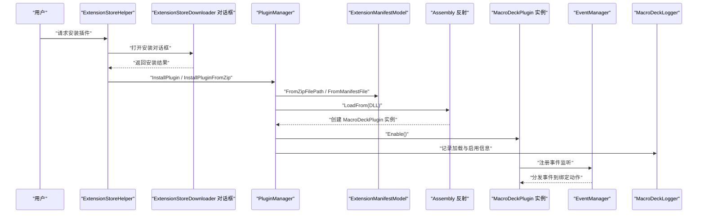
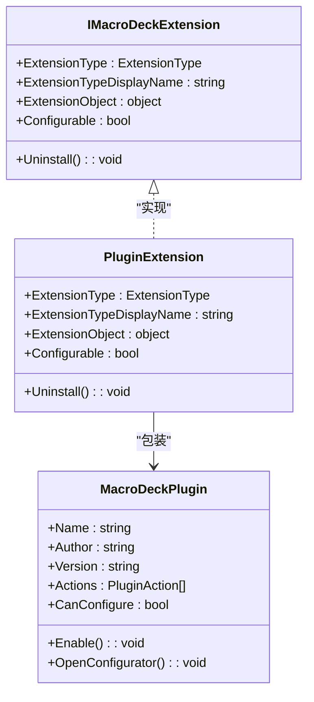
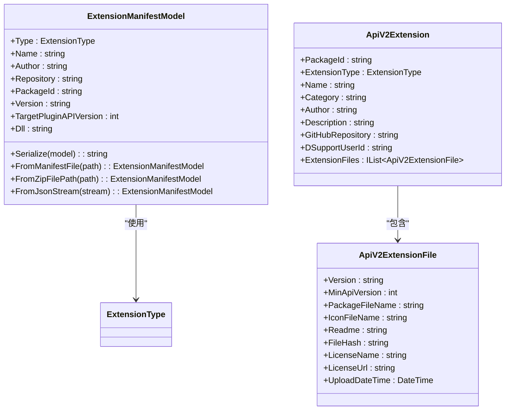
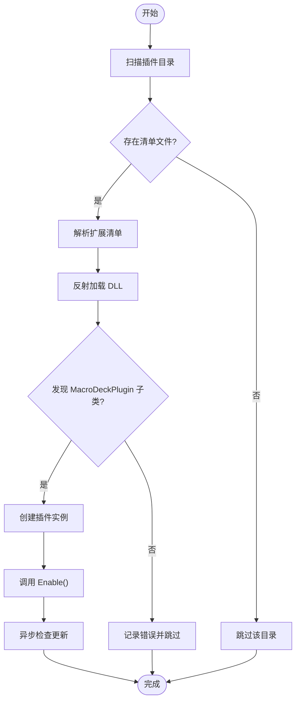
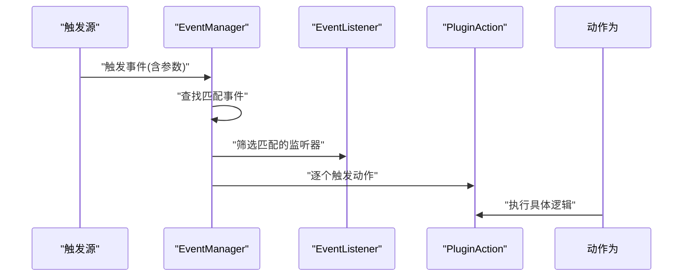
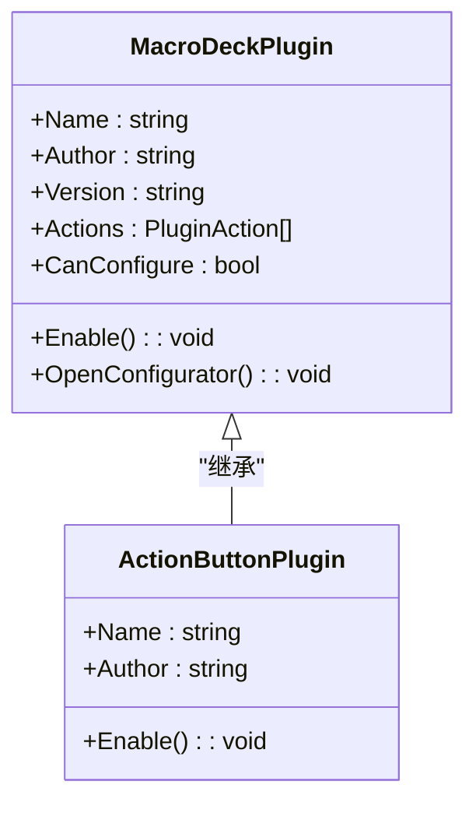
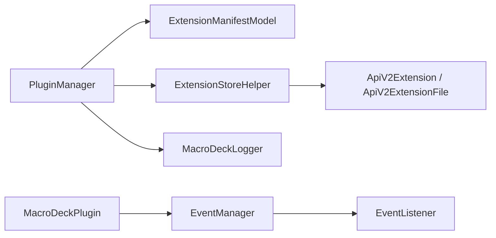

# 插件开发指南

<cite>
**本文引用的文件**
- [IMacroDeckExtension.cs](file://src/MacroDeck/Extension/IMacroDeckExtension.cs)
- [PluginExtension.cs](file://src/MacroDeck/Extension/PluginExtension.cs)
- [ExtensionManifestModel.cs](file://src/MacroDeck/Models/ExtensionManifestModel.cs)
- [ExtensionStoreHelper.cs](file://src/MacroDeck/ExtensionStore/ExtensionStoreHelper.cs)
- [PluginManager.cs](file://src/MacroDeck/Plugins/PluginManager.cs)
- [MacroDeckLogger.cs](file://src/MacroDeck/Logging/MacroDeckLogger.cs)
- [ActionButtonPlugin.cs](file://src/MacroDeck/InternalPlugins/ActionButtonPlugin/ActionButtonPlugin.cs)
- [EventManager.cs](file://src/MacroDeck/Events/EventManager.cs)
- [EventListener.cs](file://src/MacroDeck/Events/EventListener.cs)
- [Program.cs](file://src/MacroDeck/Program.cs)
- [ApiV2Extension.cs](file://src/MacroDeck/Models/ApiV2Extension.cs)
- [ApiV2ExtensionFile.cs](file://src/MacroDeck/Models/ApiV2ExtensionFile.cs)
</cite>

## 目录
1. [简介](#简介)
2. [项目结构](#项目结构)
3. [核心组件](#核心组件)
4. [架构总览](#架构总览)
5. [详细组件分析](#详细组件分析)
6. [依赖关系分析](#依赖关系分析)
7. [性能考虑](#性能考虑)
8. [故障排查指南](#故障排查指南)
9. [结论](#结论)
10. [附录](#附录)

## 简介
本指南面向希望为 Macro-Deck 开发插件的开发者，系统讲解插件架构与开发框架，重点覆盖以下内容：
- IMacroDeckExtension 接口的设计与实现要点
- 插件生命周期管理与事件处理机制
- 插件配置文件（扩展清单）的编写规范
- 完整开发流程：从项目创建到打包发布
- 内置插件的分析与学习案例
- 调试技巧与性能优化建议
- 最佳实践与常见问题解决方案

## 项目结构
Macro-Deck 的插件体系围绕“扩展接口 + 扩展清单 + 插件管理器 + 扩展商店”构建。关键目录与文件如下：
- Extension：扩展接口与包装类（IMacroDeckExtension、PluginExtension）
- Models：扩展清单模型（ExtensionManifestModel）、扩展商店 API 模型（ApiV2Extension、ApiV2ExtensionFile）
- Plugins：插件管理器（PluginManager），负责加载、启用、更新、卸载插件
- ExtensionStore：扩展商店辅助工具（ExtensionStoreHelper），负责安装、更新检查等
- InternalPlugins：内置插件示例（如 ActionButtonPlugin）
- Events：事件系统（EventManager、EventListener）
- Logging：日志系统（MacroDeckLogger）
- Program：应用入口，初始化日志与启动主程序

**图表来源**
- [IMacroDeckExtension.cs:1-13](file://src/MacroDeck/Extension/IMacroDeckExtension.cs#L1-L13)
- [PluginExtension.cs:1-24](file://src/MacroDeck/Extension/PluginExtension.cs#L1-L24)
- [ExtensionManifestModel.cs:1-61](file://src/MacroDeck/Models/ExtensionManifestModel.cs#L1-L61)
- [ExtensionStoreHelper.cs:1-195](file://src/MacroDeck/ExtensionStore/ExtensionStoreHelper.cs#L1-L195)
- [PluginManager.cs:1-479](file://src/MacroDeck/Plugins/PluginManager.cs#L1-L479)
- [EventManager.cs:1-43](file://src/MacroDeck/Events/EventManager.cs#L1-L43)
- [EventListener.cs:1-12](file://src/MacroDeck/Events/EventListener.cs#L1-L12)
- [MacroDeckLogger.cs:1-361](file://src/MacroDeck/Logging/MacroDeckLogger.cs#L1-L361)
- [ActionButtonPlugin.cs:1-26](file://src/MacroDeck/InternalPlugins/ActionButtonPlugin/ActionButtonPlugin.cs#L1-L26)
- [ApiV2Extension.cs:1-17](file://src/MacroDeck/Models/ApiV2Extension.cs#L1-L17)
- [ApiV2ExtensionFile.cs:1-15](file://src/MacroDeck/Models/ApiV2ExtensionFile.cs#L1-L15)

**章节来源**
- [Program.cs:1-80](file://src/MacroDeck/Program.cs#L1-L80)

## 核心组件
- IMacroDeckExtension：所有扩展的统一接口，暴露扩展类型、显示名、对象实例、是否可配置以及卸载能力。
- PluginExtension：对 MacroDeckPlugin 的包装，用于在扩展视图中展示插件信息，并根据插件是否可配置决定是否允许打开配置界面。
- ExtensionManifestModel：扩展清单模型，描述扩展类型、名称、作者、仓库、包 ID、版本、目标插件 API 版本、DLL 名称等；支持从文件或 ZIP 中解析。
- ExtensionStoreHelper：扩展商店辅助工具，负责按包 ID 安装插件/图标包、批量更新检查、触发安装对话框、查询可用更新等。
- PluginManager：插件管理器，负责扫描插件目录、加载 DLL、反射发现 MacroDeckPlugin 子类、启用插件、处理更新、删除插件、安装新插件等。
- EventManager / EventListener：事件系统，注册事件、分发事件到绑定的动作列表。
- MacroDeckLogger：日志系统，提供结构化日志、按插件分类、级别切换、清理过期日志等功能。

**章节来源**
- [IMacroDeckExtension.cs:1-13](file://src/MacroDeck/Extension/IMacroDeckExtension.cs#L1-L13)
- [PluginExtension.cs:1-24](file://src/MacroDeck/Extension/PluginExtension.cs#L1-L24)
- [ExtensionManifestModel.cs:1-61](file://src/MacroDeck/Models/ExtensionManifestModel.cs#L1-L61)
- [ExtensionStoreHelper.cs:1-195](file://src/MacroDeck/ExtensionStore/ExtensionStoreHelper.cs#L1-L195)
- [PluginManager.cs:1-479](file://src/MacroDeck/Plugins/PluginManager.cs#L1-L479)
- [EventManager.cs:1-43](file://src/MacroDeck/Events/EventManager.cs#L1-L43)
- [EventListener.cs:1-12](file://src/MacroDeck/Events/EventListener.cs#L1-L12)
- [MacroDeckLogger.cs:1-361](file://src/MacroDeck/Logging/MacroDeckLogger.cs#L1-L361)

## 架构总览
下图展示了插件从安装到运行的关键交互路径，包括清单解析、插件加载、启用、事件分发与日志记录。

**图表来源**
- [ExtensionStoreHelper.cs:48-64](file://src/MacroDeck/ExtensionStore/ExtensionStoreHelper.cs#L48-L64)
- [PluginManager.cs:290-396](file://src/MacroDeck/Plugins/PluginManager.cs#L290-L396)
- [ExtensionManifestModel.cs:32-46](file://src/MacroDeck/Models/ExtensionManifestModel.cs#L32-L46)
- [MacroDeckLogger.cs:64-77](file://src/MacroDeck/Logging/MacroDeckLogger.cs#L64-L77)

## 详细组件分析

### IMacroDeckExtension 接口与 PluginExtension 包装
- 接口职责：统一扩展元数据与行为，便于 UI 展示与管理。
- PluginExtension：封装 MacroDeckPlugin，自动判断是否可配置，并提供扩展类型与显示名。

**图表来源**
- [IMacroDeckExtension.cs:5-12](file://src/MacroDeck/Extension/IMacroDeckExtension.cs#L5-L12)
- [PluginExtension.cs:7-23](file://src/MacroDeck/Extension/PluginExtension.cs#L7-L23)

**章节来源**
- [IMacroDeckExtension.cs:1-13](file://src/MacroDeck/Extension/IMacroDeckExtension.cs#L1-L13)
- [PluginExtension.cs:1-24](file://src/MacroDeck/Extension/PluginExtension.cs#L1-L24)

### 扩展清单模型与商店 API
- ExtensionManifestModel：定义扩展清单字段，支持序列化/反序列化、从文件/ZIP 解析。
- ApiV2Extension / ApiV2ExtensionFile：扩展商店 API 数据模型，用于查询最新版本、最小 API 版本、文件哈希等。

**图表来源**
- [ExtensionManifestModel.cs:8-61](file://src/MacroDeck/Models/ExtensionManifestModel.cs#L8-L61)
- [ApiV2Extension.cs:5-16](file://src/MacroDeck/Models/ApiV2Extension.cs#L5-L16)
- [ApiV2ExtensionFile.cs:3-14](file://src/MacroDeck/Models/ApiV2ExtensionFile.cs#L3-L14)

**章节来源**
- [ExtensionManifestModel.cs:1-61](file://src/MacroDeck/Models/ExtensionManifestModel.cs#L1-L61)
- [ApiV2Extension.cs:1-17](file://src/MacroDeck/Models/ApiV2Extension.cs#L1-L17)
- [ApiV2ExtensionFile.cs:1-15](file://src/MacroDeck/Models/ApiV2ExtensionFile.cs#L1-L15)

### 插件管理器与生命周期
- 加载流程：扫描插件目录 → 读取清单 → 反射加载 DLL → 发现 MacroDeckPlugin 子类 → 启用插件 → 异步检查更新。
- 更新流程：通过 ExtensionStoreHelper 查询可用更新，触发通知与批量更新。
- 卸载流程：写入删除标记，等待下次启动清理目录。

**图表来源**
- [PluginManager.cs:39-133](file://src/MacroDeck/Plugins/PluginManager.cs#L39-L133)
- [PluginManager.cs:141-202](file://src/MacroDeck/Plugins/PluginManager.cs#L141-L202)
- [ExtensionStoreHelper.cs:71-131](file://src/MacroDeck/ExtensionStore/ExtensionStoreHelper.cs#L71-L131)

**章节来源**
- [PluginManager.cs:1-479](file://src/MacroDeck/Plugins/PluginManager.cs#L1-L479)
- [ExtensionStoreHelper.cs:1-195](file://src/MacroDeck/ExtensionStore/ExtensionStoreHelper.cs#L1-L195)

### 事件系统与事件监听
- EventManager：注册事件、收集已注册事件、在触发时遍历匹配的 EventListener 并执行绑定动作。
- EventListener：保存要监听的事件名与参数，以及一组待执行的动作列表。

**图表来源**
- [EventManager.cs:24-41](file://src/MacroDeck/Events/EventManager.cs#L24-L41)
- [EventListener.cs:5-11](file://src/MacroDeck/Events/EventListener.cs#L5-L11)

**章节来源**
- [EventManager.cs:1-43](file://src/MacroDeck/Events/EventManager.cs#L1-L43)
- [EventListener.cs:1-12](file://src/MacroDeck/Events/EventListener.cs#L1-L12)

### 内置插件分析：ActionButtonPlugin
- 继承 MacroDeckPlugin，重写 Name、Author，并在 Enable 中注册一组动作（切换状态、设置背景色等）。
- 作为内置插件被自动添加与启用，适合学习插件的基本结构与动作注册方式。

**图表来源**
- [ActionButtonPlugin.cs:10-25](file://src/MacroDeck/InternalPlugins/ActionButtonPlugin/ActionButtonPlugin.cs#L10-L25)

**章节来源**
- [ActionButtonPlugin.cs:1-26](file://src/MacroDeck/InternalPlugins/ActionButtonPlugin/ActionButtonPlugin.cs#L1-L26)

### 日志系统与调试
- MacroDeckLogger 提供结构化日志，支持按插件分类、动态调整日志级别、清理过期日志。
- 建议在插件中使用带插件上下文的日志方法，便于定位问题。

**章节来源**
- [MacroDeckLogger.cs:1-361](file://src/MacroDeck/Logging/MacroDeckLogger.cs#L1-L361)

## 依赖关系分析
- 插件管理器依赖扩展清单模型进行解析，依赖扩展商店助手进行更新检查与安装。
- 扩展商店助手依赖 API 模型与网络请求获取最新版本信息。
- 事件系统独立于插件管理器，但插件在启用时会向其注册事件。
- 日志系统贯穿插件生命周期，提供统一的可观测性。

**图表来源**
- [PluginManager.cs:1-479](file://src/MacroDeck/Plugins/PluginManager.cs#L1-L479)
- [ExtensionStoreHelper.cs:1-195](file://src/MacroDeck/ExtensionStore/ExtensionStoreHelper.cs#L1-L195)
- [ExtensionManifestModel.cs:1-61](file://src/MacroDeck/Models/ExtensionManifestModel.cs#L1-L61)
- [MacroDeckLogger.cs:1-361](file://src/MacroDeck/Logging/MacroDeckLogger.cs#L1-L361)
- [EventManager.cs:1-43](file://src/MacroDeck/Events/EventManager.cs#L1-L43)
- [EventListener.cs:1-12](file://src/MacroDeck/Events/EventListener.cs#L1-L12)

**章节来源**
- [PluginManager.cs:1-479](file://src/MacroDeck/Plugins/PluginManager.cs#L1-L479)
- [ExtensionStoreHelper.cs:1-195](file://src/MacroDeck/ExtensionStore/ExtensionStoreHelper.cs#L1-L195)
- [ExtensionManifestModel.cs:1-61](file://src/MacroDeck/Models/ExtensionManifestModel.cs#L1-L61)
- [MacroDeckLogger.cs:1-361](file://src/MacroDeck/Logging/MacroDeckLogger.cs#L1-L361)
- [EventManager.cs:1-43](file://src/MacroDeck/Events/EventManager.cs#L1-L43)
- [EventListener.cs:1-12](file://src/MacroDeck/Events/EventListener.cs#L1-L12)

## 性能考虑
- 反射加载与启用应异步执行，避免阻塞 UI。
- 批量更新检查使用并发任务，完成后统一触发 UI 通知。
- 日志级别动态调整，生产环境默认较低级别，仅在调试时提升。
- 插件目录操作采用原子化复制与删除标记，减少磁盘 IO 冲突。

[本节为通用指导，不直接分析具体文件]

## 故障排查指南
- 插件无法加载：检查清单文件是否存在、DLL 是否可加载、目标 API 版本是否兼容。
- 插件启用失败：查看日志输出，确认异常堆栈；必要时以安全模式启动。
- 更新检查无响应：检查网络访问与扩展商店 API 地址可达性。
- 事件未触发：确认事件名称大小写与参数匹配、监听器是否正确绑定动作。

**章节来源**
- [PluginManager.cs:179-202](file://src/MacroDeck/Plugins/PluginManager.cs#L179-L202)
- [MacroDeckLogger.cs:318-331](file://src/MacroDeck/Logging/MacroDeckLogger.cs#L318-L331)
- [ExtensionStoreHelper.cs:162-187](file://src/MacroDeck/ExtensionStore/ExtensionStoreHelper.cs#L162-L187)

## 结论
通过 IMacroDeckExtension 接口与 PluginExtension 包装，结合 ExtensionManifestModel 清单与 ExtensionStoreHelper 商店工具，Macro-Deck 形成了清晰的插件生态。PluginManager 负责生命周期管理，EventManager 提供事件驱动能力，MacroDeckLogger 提供可观测性。开发者可参考内置插件的结构快速上手，并遵循清单规范与 API 版本要求完成打包与发布。

[本节为总结性内容，不直接分析具体文件]

## 附录

### 插件开发流程（从创建到发布）
- 创建项目并引用 Macro-Deck 插件 API（目标 API 版本需与清单一致）
- 编写插件类，继承 MacroDeckPlugin，实现 Enable 注册动作
- 在插件根目录创建扩展清单文件，填写类型、名称、作者、包 ID、版本、目标 API 版本、DLL 名称等
- 使用 ExtensionStoreHelper 进行本地安装测试，验证加载与启用
- 配置日志级别，使用 MacroDeckLogger 输出结构化日志
- 打包为 ZIP，确保包含清单与 DLL；上传至扩展商店或分发渠道
- 发布后通过 ExtensionStoreHelper 检查更新，确保版本号递增

**章节来源**
- [ExtensionManifestModel.cs:22-25](file://src/MacroDeck/Models/ExtensionManifestModel.cs#L22-L25)
- [ExtensionStoreHelper.cs:31-64](file://src/MacroDeck/ExtensionStore/ExtensionStoreHelper.cs#L31-L64)
- [MacroDeckLogger.cs:64-77](file://src/MacroDeck/Logging/MacroDeckLogger.cs#L64-L77)

### 扩展清单字段说明
- type：扩展类型（插件/图标包）
- name：扩展名称
- author：作者
- repository：仓库地址（可选）
- packageId：包 ID（用于商店识别）
- version：当前版本
- target-plugin-api-version：目标插件 API 版本
- dll：插件 DLL 文件名

**章节来源**
- [ExtensionManifestModel.cs:10-25](file://src/MacroDeck/Models/ExtensionManifestModel.cs#L10-L25)

### IMacroDeckExtension 接口使用要点
- ExtensionType：区分插件与图标包
- ExtensionTypeDisplayName：UI 显示文本
- ExtensionObject：实际扩展对象（如 MacroDeckPlugin）
- Configurable：根据插件是否可配置决定 UI 行为
- Uninstall：预留卸载逻辑（当前实现为空）

**章节来源**
- [IMacroDeckExtension.cs:7-11](file://src/MacroDeck/Extension/IMacroDeckExtension.cs#L7-L11)
- [PluginExtension.cs:13-22](file://src/MacroDeck/Extension/PluginExtension.cs#L13-L22)

### 内置插件学习案例
- ActionButtonPlugin：展示如何在 Enable 中注册一组动作，适合学习动作注册与命名规范
- 其他内置插件（变量、设备、文件夹）可参考其结构与配置方式

**章节来源**
- [ActionButtonPlugin.cs:15-24](file://src/MacroDeck/InternalPlugins/ActionButtonPlugin/ActionButtonPlugin.cs#L15-L24)