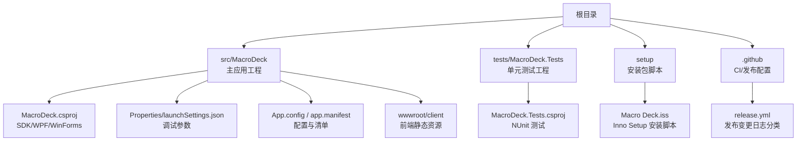
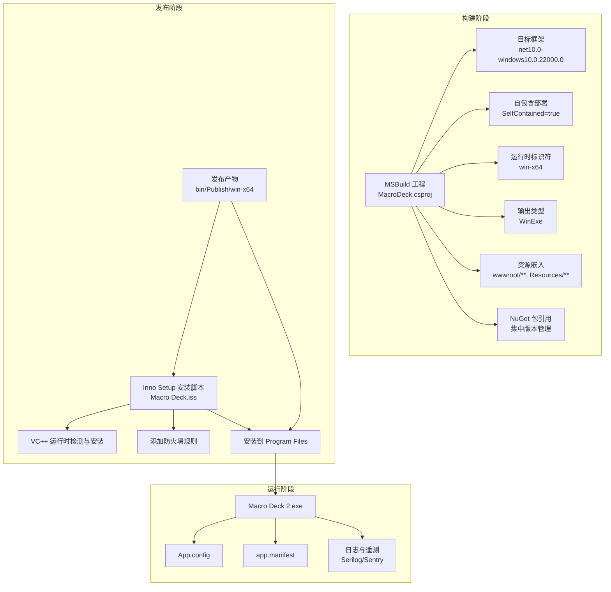
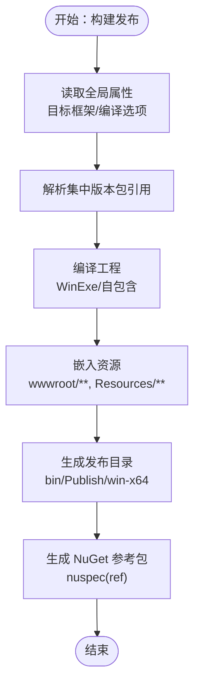
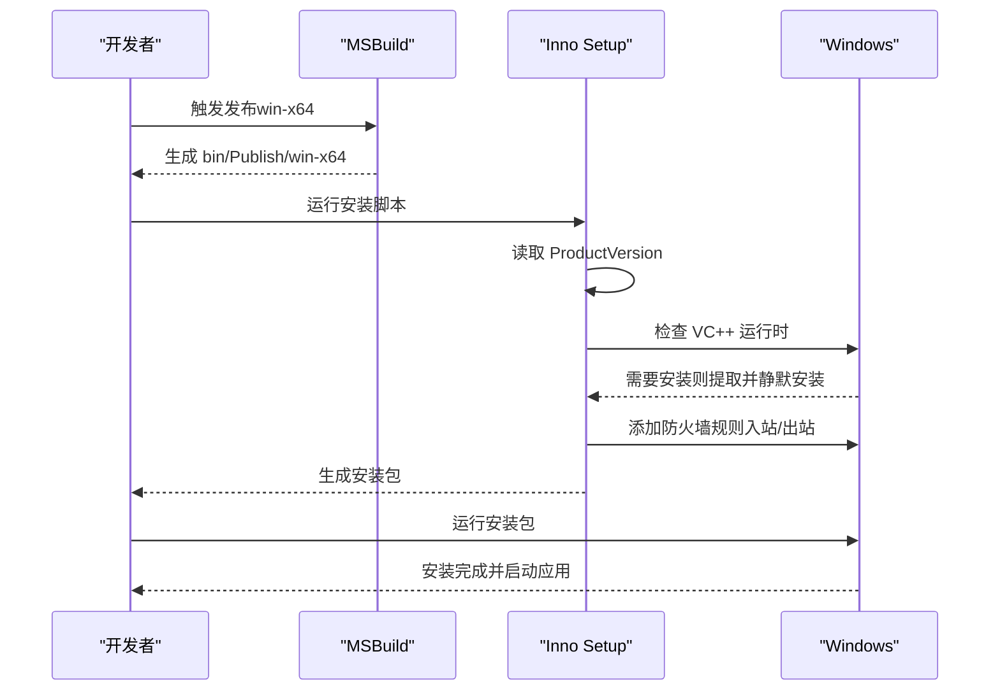
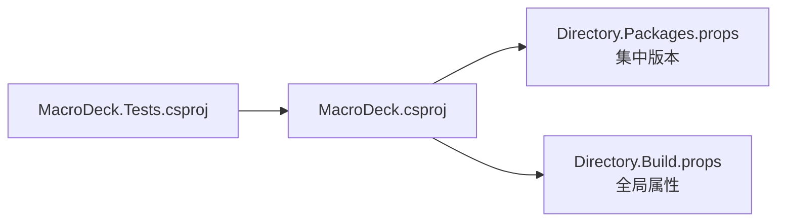

# 构建和部署

<cite>
**本文引用的文件**
- [Directory.Build.props](file://Directory.Build.props)
- [Directory.Packages.props](file://Directory.Packages.props)
- [MacroDeck.csproj](file://src/MacroDeck/MacroDeck.csproj)
- [MacroDeck.nuspec](file://src/MacroDeck/MacroDeck.nuspec)
- [Macro Deck.iss](file://setup/Macro Deck.iss)
- [release.yml](file://.github/release.yml)
- [launchSettings.json](file://src/MacroDeck/Properties/launchSettings.json)
- [MacroDeck.Tests.csproj](file://tests/MacroDeck.Tests/MacroDeck.Tests.csproj)
- [App.config](file://src/MacroDeck/App.config)
- [app.manifest](file://src/MacroDeck/app.manifest)
</cite>

## 目录
1. [简介](#简介)
2. [项目结构](#项目结构)
3. [核心组件](#核心组件)
4. [架构总览](#架构总览)
5. [详细组件分析](#详细组件分析)
6. [依赖关系分析](#依赖关系分析)
7. [性能考量](#性能考量)
8. [故障排除指南](#故障排除指南)
9. [结论](#结论)
10. [附录](#附录)

## 简介
本文件面向维护者与贡献者，系统化梳理 Macro-Deck 的构建、发布与部署流程，覆盖以下主题：
- 构建配置与编译参数（目标框架、平台、输出类型等）
- 发布配置与打包流程（自包含部署、资源嵌入、打包产物）
- 安装包制作与分发策略（Inno Setup 脚本、运行时依赖、防火墙规则）
- 自动化构建与持续集成建议（基于仓库现有配置的实践）
- 版本号管理与发布标记规范
- 不同平台的部署要求与兼容性考虑
- 发布检查清单与质量保证流程
- 故障排除与回滚策略

## 项目结构
本项目采用多项目解决方案，核心应用位于 src/MacroDeck，测试位于 tests/MacroDeck.Tests，安装包脚本位于 setup，CI 配置位于 .github。

图表来源
- [MacroDeck.csproj:1-363](file://src/MacroDeck/MacroDeck.csproj#L1-L363)
- [MacroDeck.Tests.csproj:1-26](file://tests/MacroDeck.Tests/MacroDeck.Tests.csproj#L1-L26)
- [Macro Deck.iss:1-106](file://setup/Macro Deck.iss#L1-L106)
- [.github/release.yml:1-21](file://.github/release.yml#L1-L21)

章节来源
- [MacroDeck.csproj:1-363](file://src/MacroDeck/MacroDeck.csproj#L1-L363)
- [MacroDeck.Tests.csproj:1-26](file://tests/MacroDeck.Tests/MacroDeck.Tests.csproj#L1-L26)
- [Macro Deck.iss:1-106](file://setup/Macro Deck.iss#L1-L106)
- [.github/release.yml:1-21](file://.github/release.yml#L1-L21)

## 核心组件
- 目标框架与全局属性：统一在 Directory.Build.props 中定义，确保所有项目共享一致的目标框架与编译选项。
- 包版本集中管理：通过 Directory.Packages.props 统一声明第三方包版本，避免版本漂移。
- 应用工程：使用 Microsoft.NET.Sdk.WindowsDesktop，启用 WPF 与 Windows Forms，自包含部署，输出 WinExe。
- 打包与 API 参考：nuspec 文件生成插件 API 参考程序集，供插件开发使用。
- 安装包：Inno Setup 脚本负责安装、运行时依赖检测与防火墙规则添加。
- CI 发布：GitHub Release 配置用于生成变更日志分类。

章节来源
- [Directory.Build.props:1-11](file://Directory.Build.props#L1-L11)
- [Directory.Packages.props:1-35](file://Directory.Packages.props#L1-L35)
- [MacroDeck.csproj:1-363](file://src/MacroDeck/MacroDeck.csproj#L1-L363)
- [MacroDeck.nuspec:1-25](file://src/MacroDeck/MacroDeck.nuspec#L1-L25)
- [Macro Deck.iss:1-106](file://setup/Macro Deck.iss#L1-L106)
- [.github/release.yml:1-21](file://.github/release.yml#L1-L21)

## 架构总览
下图展示从源码到可执行文件与安装包的关键路径，以及安装阶段的运行时依赖与防火墙配置。

图表来源
- [MacroDeck.csproj:1-363](file://src/MacroDeck/MacroDeck.csproj#L1-L363)
- [Directory.Build.props:1-11](file://Directory.Build.props#L1-L11)
- [Directory.Packages.props:1-35](file://Directory.Packages.props#L1-L35)
- [Macro Deck.iss:1-106](file://setup/Macro Deck.iss#L1-L106)
- [App.config:1-27](file://src/MacroDeck/App.config#L1-L27)
- [app.manifest:1-80](file://src/MacroDeck/app.manifest#L1-L80)

## 详细组件分析

### 构建与编译配置
- 目标框架与编译选项
  - 全局目标框架：net10.0-windows10.0.22000.0，确保与 Windows 11（22000）兼容。
  - 启用可空引用注解与隐式 using，减少告警。
- 应用工程属性
  - SDK：Microsoft.NET.Sdk.WindowsDesktop
  - UI 框架：UseWPF 与 UseWindowsForms 均启用
  - 输出：WinExe，自包含（SelfContained=true），运行时 win-x64
  - 版本：语义化版本字符串，包含预发布后缀
  - 平台：AnyCPU 与 x64
  - 资源：wwwroot/** 与 Resources/** 嵌入或复制到输出
- 包版本集中管理
  - ManagePackageVersionsCentrally=true，统一版本，降低冲突风险

章节来源
- [Directory.Build.props:1-11](file://Directory.Build.props#L1-L11)
- [MacroDeck.csproj:1-363](file://src/MacroDeck/MacroDeck.csproj#L1-L363)
- [Directory.Packages.props:1-35](file://Directory.Packages.props#L1-L35)

### 发布与打包流程
- 发布产物
  - 自包含部署，输出为 win-x64，包含运行时与依赖。
  - wwwroot/** 与语言资源按配置复制/嵌入。
- NuGet 包（插件 API 参考）
  - nuspec 定义了 ref 程序集位置，供插件在编译期引用。
  - 无运行时依赖，强调“宿主提供运行时”。

图表来源
- [MacroDeck.csproj:1-363](file://src/MacroDeck/MacroDeck.csproj#L1-L363)
- [MacroDeck.nuspec:1-25](file://src/MacroDeck/MacroDeck.nuspec#L1-L25)
- [Directory.Packages.props:1-35](file://Directory.Packages.props#L1-L35)

章节来源
- [MacroDeck.csproj:1-363](file://src/MacroDeck/MacroDeck.csproj#L1-L363)
- [MacroDeck.nuspec:1-25](file://src/MacroDeck/MacroDeck.nuspec#L1-L25)

### 安装包制作与分发策略
- Inno Setup 脚本要点
  - 从发布目录读取 ProductVersion 作为安装包版本名。
  - 自动检测并静默安装 VC++ 2019 运行时（条件安装）。
  - 安装完成后添加入站/出站防火墙规则，隐藏启动应用。
  - 支持多语言界面与桌面快捷方式任务。
- 分发与运行时要求
  - 自包含部署，不强制用户本地安装 .NET 运行时。
  - 安装器内置 VC++ 运行时，提升兼容性。

图表来源
- [Macro Deck.iss:1-106](file://setup/Macro Deck.iss#L1-L106)

章节来源
- [Macro Deck.iss:1-106](file://setup/Macro Deck.iss#L1-L106)

### 自动化构建与持续集成
- 现有配置
  - GitHub Release 变更日志分类：按标签对特性、改进、修复、依赖等进行归类。
- 建议实践（基于现有工程）
  - 在 CI 中执行：
    - 还原与构建（指定 RuntimeIdentifier 与 Release）
    - 单元测试（含覆盖率收集）
    - 生成安装包（调用 Inno Setup）
    - 上传发布资产（安装包、可选：日志、变更说明）

章节来源
- [.github/release.yml:1-21](file://.github/release.yml#L1-L21)
- [MacroDeck.Tests.csproj:1-26](file://tests/MacroDeck.Tests/MacroDeck.Tests.csproj#L1-L26)

### 版本号管理与发布标记
- 版本字段
  - Version：语义化版本（含预发布后缀），用于产品版本显示与安装包命名。
  - AssemblyVersion：整数版本号，用于程序集版本。
- 标记建议
  - 使用语义化版本（主.次.补丁[-预发布标识]），如 2.15.0-b9。
  - 预发布标识可用于区分候选版、Beta 等；稳定版去除后缀。
  - 与安装脚本联动：安装包文件名由 ProductVersion 决定，保持一致性。

章节来源
- [MacroDeck.csproj:1-363](file://src/MacroDeck/MacroDeck.csproj#L1-L363)
- [Macro Deck.iss:1-106](file://setup/Macro Deck.iss#L1-L106)

### 平台部署要求与兼容性
- 目标平台
  - 目标框架：net10.0-windows10.0.22000.0（Windows 11）
  - 运行时：win-x64，自包含部署
- 清单与 UAC
  - app.manifest 默认以 asInvoker 运行，避免不必要的管理员权限。
  - 支持多 Windows 版本的兼容节点，便于在旧系统上运行。
- 配置与日志
  - App.config 提供用户设置默认值与调试控制项。
  - 日志与遥测通过 Serilog/Sentry 配置（工程中引用，具体配置见运行环境）。

章节来源
- [Directory.Build.props:1-11](file://Directory.Build.props#L1-L11)
- [MacroDeck.csproj:1-363](file://src/MacroDeck/MacroDeck.csproj#L1-L363)
- [app.manifest:1-80](file://src/MacroDeck/app.manifest#L1-L80)
- [App.config:1-27](file://src/MacroDeck/App.config#L1-L27)

## 依赖关系分析
- 工程间依赖
  - 测试工程引用主应用工程，确保测试覆盖主逻辑。
- 外部依赖
  - 通过集中版本管理的 NuGet 包，统一版本，减少冲突。
- 运行时依赖
  - 自包含部署，不依赖系统已安装的 .NET 运行时。
  - 安装器内嵌 VC++ 运行时，提升兼容性。

图表来源
- [MacroDeck.Tests.csproj:1-26](file://tests/MacroDeck.Tests/MacroDeck.Tests.csproj#L1-L26)
- [MacroDeck.csproj:1-363](file://src/MacroDeck/MacroDeck.csproj#L1-L363)
- [Directory.Packages.props:1-35](file://Directory.Packages.props#L1-L35)
- [Directory.Build.props:1-11](file://Directory.Build.props#L1-L11)

章节来源
- [MacroDeck.Tests.csproj:1-26](file://tests/MacroDeck.Tests/MacroDeck.Tests.csproj#L1-L26)
- [MacroDeck.csproj:1-363](file://src/MacroDeck/MacroDeck.csproj#L1-L363)
- [Directory.Packages.props:1-35](file://Directory.Packages.props#L1-L35)
- [Directory.Build.props:1-11](file://Directory.Build.props#L1-L11)

## 性能考量
- 自包含部署会增大体积，但简化分发与运行环境。
- 前端静态资源（wwwroot/client）较大，建议在发布前确认必要文件与缓存策略。
- 测试覆盖率与测试执行时间应纳入 CI 时间预算，避免过长排队。

## 故障排除指南
- 安装失败或缺少运行时
  - 检查安装器是否正确触发 VC++ 运行时安装。
  - 确认防火墙规则已添加，必要时手动放行进程。
- 权限问题
  - app.manifest 默认 asInvoker，若需管理员权限请谨慎修改。
- 日志与诊断
  - 启动参数可在 launchSettings.json 中配置，便于开启调试控制台与日志级别。
  - 关注 Serilog/Sentry 配置（工程引用存在，实际行为取决于运行环境）。

章节来源
- [Macro Deck.iss:1-106](file://setup/Macro Deck.iss#L1-L106)
- [app.manifest:1-80](file://src/MacroDeck/app.manifest#L1-L80)
- [launchSettings.json:1-9](file://src/MacroDeck/Properties/launchSettings.json#L1-L9)

## 结论
本项目采用统一的全局属性与集中版本管理，结合自包含部署与 Inno Setup 安装器，实现了跨平台（主要针对 Windows）的稳定分发。配合 CI 的变更日志分类，有助于形成清晰的发布节奏与质量保障闭环。建议在 CI 中补充构建、测试与打包步骤，并在发布前执行完整的回归验证。

## 附录

### 发布检查清单
- 代码与测试
  - 通过所有单元测试，覆盖率达标
  - 代码审查与静态分析通过
- 版本与标记
  - Version 与 AssemblyVersion 更新并符合语义化
  - Git 标签与发布说明同步
- 构建与打包
  - Release 构建成功（win-x64）
  - 生成安装包并通过基本功能验证
- 分发与合规
  - 安装包包含 VC++ 运行时（如需要）
  - 防火墙规则已添加
  - 许可证与 README 一并发布

### 回滚策略
- 快速回滚
  - 保留上一个稳定版本的安装包与发布说明
  - 在安装器中提供卸载与重装流程
- 配置回退
  - 若涉及配置变更，提供配置迁移工具或回滚脚本
- 监控与反馈
  - 通过日志与遥测监控异常，及时响应用户反馈