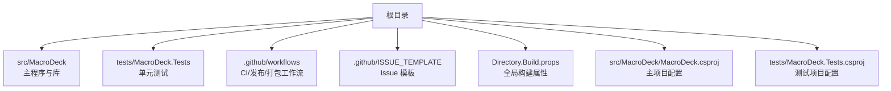
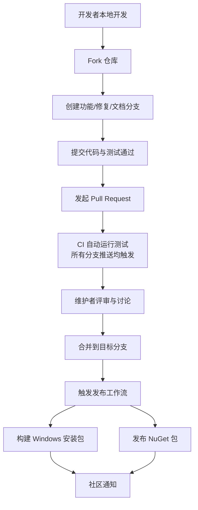
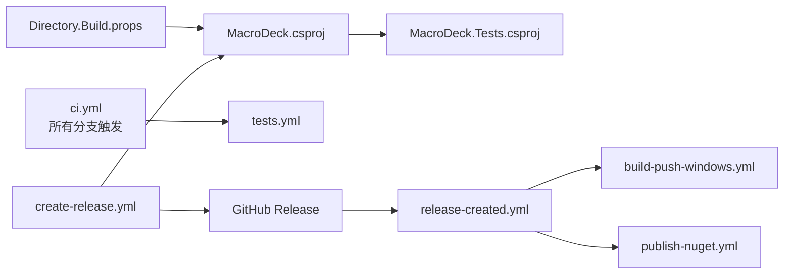

# 贡献流程

<cite>
**本文引用的文件**
- [README.md](file://README.md)
- [.github/FUNDING.yml](file://.github/FUNDING.yml)
- [.github/release.yml](file://.github/release.yml)
- [.github/workflows/ci.yml](file://.github/workflows/ci.yml)
- [.github/workflows/tests.yml](file://.github/workflows/tests.yml)
- [.github/workflows/release-created.yml](file://.github/workflows/release-created.yml)
- [.github/workflows/create-release.yml](file://.github/workflows/create-release.yml)
- [.github/workflows/build-push-windows.yml](file://.github/workflows/build-push-windows.yml)
- [.github/workflows/publish-nuget.yml](file://.github/workflows/publish-nuget.yml)
- [.github/ISSUE_TEMPLATE/bug_report.md](file://.github/ISSUE_TEMPLATE/bug_report.md)
- [.github/ISSUE_TEMPLATE/feature_request.md](file://.github/ISSUE_TEMPLATE/feature_request.md)
- [Directory.Build.props](file://Directory.Build.props)
- [src/MacroDeck/MacroDeck.csproj](file://src/MacroDeck/MacroDeck.csproj)
- [tests/MacroDeck.Tests/MacroDeck.Tests.csproj](file://tests/MacroDeck.Tests/MacroDeck.Tests.csproj)
- [.gitignore](file://.gitignore)
</cite>

## 更新摘要
**所做变更**
- 更新了CI工作流配置部分，反映分支触发条件从限制性模式扩展为广泛模式
- 修改了分支策略与合并规则，强调所有分支推送都会触发CI测试
- 更新了测试要求与验证流程，体现增强的测试覆盖范围
- 更新了故障排查指南，包含新的CI触发行为

## 目录
1. [简介](#简介)
2. [项目结构](#项目结构)
3. [核心组件](#核心组件)
4. [架构总览](#架构总览)
5. [详细组件分析](#详细组件分析)
6. [依赖关系分析](#依赖关系分析)
7. [性能与质量考量](#性能与质量考量)
8. [故障排查指南](#故障排查指南)
9. [结论](#结论)
10. [附录](#附录)

## 简介
本文件面向希望为 Macro-Deck 做出贡献的新贡献者，系统化说明从 Fork 到 PR、从测试到发布、从 Issue 格式到标签使用的完整流程；同时给出分支策略、合并规则、文档更新与版本发布路径、社区行为与沟通规范等实践建议，帮助贡献者高效、高质量地参与开源协作。

## 项目结构
仓库采用"根目录 + 源码 + 测试 + GitHub 工作流 + 模板"的组织方式：
- 源码位于 src/MacroDeck，包含 WPF/WPF+WinForms 应用、服务、工具类、数据模型、GUI 组件等
- 单元测试位于 tests/MacroDeck.Tests
- GitHub 工作流位于 .github/workflows，覆盖 CI、测试、发布、NuGet 发布、Windows 安装包构建与推送
- Issue 模板位于 .github/ISSUE_TEMPLATE，包含缺陷报告与功能请求模板
- 版本与构建配置在 Directory.Build.props 与项目文件中定义

**章节来源**
- [README.md:1-51](file://README.md#L1-L51)
- [Directory.Build.props:1-11](file://Directory.Build.props#L1-L11)
- [src/MacroDeck/MacroDeck.csproj:1-363](file://src/MacroDeck/MacroDeck.csproj#L1-L363)
- [.github/workflows/ci.yml:1-18](file://.github/workflows/ci.yml#L1-L18)
- [.github/workflows/tests.yml:1-19](file://.github/workflows/tests.yml#L1-L19)
- [.github/ISSUE_TEMPLATE/bug_report.md:1-31](file://.github/ISSUE_TEMPLATE/bug_report.md#L1-L31)
- [.github/ISSUE_TEMPLATE/feature_request.md:1-21](file://.github/ISSUE_TEMPLATE/feature_request.md#L1-L21)

## 核心组件
- 构建与测试
  - 全局构建属性：统一目标框架、可空性、隐式 using 等
  - 主项目：定义产品信息、版本号、平台、依赖包、资源嵌入等
  - 测试项目：引用主项目、集成 NUnit 与覆盖率收集器
- CI/自动化
  - CI 工作流：**已更新**对所有分支推送触发测试工作流，包括 main 和 production 分支
  - 测试工作流：在 Windows runner 上执行 dotnet restore 与 dotnet test
  - 发布工作流：根据输入类型生成版本、更新 csproj 版本、创建 GitHub Release、触发 Windows 安装包构建与 NuGet 发布、通知渠道
- Issue 模板与标签
  - 缺陷报告模板：包含复现步骤、预期行为、截图、日志等字段
  - 功能请求模板：描述问题背景、期望方案、替代方案、附加信息
  - 发布配置：按标签分类生成变更日志类别（特性、改进、破坏性变更、缺陷修复、依赖、其他）

**章节来源**
- [Directory.Build.props:1-11](file://Directory.Build.props#L1-L11)
- [src/MacroDeck/MacroDeck.csproj:1-363](file://src/MacroDeck/MacroDeck.csproj#L1-L363)
- [tests/MacroDeck.Tests/MacroDeck.Tests.csproj:1-26](file://tests/MacroDeck.Tests/MacroDeck.Tests.csproj#L1-L26)
- [.github/workflows/ci.yml:1-18](file://.github/workflows/ci.yml#L1-L18)
- [.github/workflows/tests.yml:1-19](file://.github/workflows/tests.yml#L1-L19)
- [.github/workflows/create-release.yml:1-74](file://.github/workflows/create-release.yml#L1-L74)
- [.github/workflows/release-created.yml:1-54](file://.github/workflows/release-created.yml#L1-L54)
- [.github/ISSUE_TEMPLATE/bug_report.md:1-31](file://.github/ISSUE_TEMPLATE/bug_report.md#L1-L31)
- [.github/ISSUE_TEMPLATE/feature_request.md:1-21](file://.github/ISSUE_TEMPLATE/feature_request.md#L1-L21)
- [.github/release.yml:1-21](file://.github/release.yml#L1-L21)

## 架构总览
下图展示贡献流程的关键环节：从本地开发、提交、PR、自动化测试，到发布与分发。

**图表来源**
- [.github/workflows/ci.yml:1-18](file://.github/workflows/ci.yml#L1-L18)
- [.github/workflows/tests.yml:1-19](file://.github/workflows/tests.yml#L1-L19)
- [.github/workflows/release-created.yml:1-54](file://.github/workflows/release-created.yml#L1-L54)
- [.github/workflows/build-push-windows.yml:1-92](file://.github/workflows/build-push-windows.yml#L1-L92)
- [.github/workflows/publish-nuget.yml:1-61](file://.github/workflows/publish-nuget.yml#L1-L61)

## 详细组件分析

### 分支策略与合并规则
- 分支命名
  - 建议使用功能分支：feature/xxx、fix/xxx、docs/xxx、chore/xxx
  - 避免直接在 main/production 提交
- 合并前要求
  - 通过 CI 测试（**已更新**：所有分支推送都会触发测试，包括 main 和 production）
  - 代码清晰、注释完整、遵循项目风格
  - 无重大冲突，必要时进行 rebase 或 merge
- 合并分支
  - main：用于热修复与小版本更新
  - production：用于稳定版本发布
  - **已更新**：所有分支（包括 main 和 production）推送都会触发 CI 测试，确保每个代码变更都经过完整的自动化测试套件

**章节来源**
- [.github/workflows/ci.yml:3-11](file://.github/workflows/ci.yml#L3-L11)
- [.github/workflows/tests.yml:7-18](file://.github/workflows/tests.yml#L7-L18)

### 提交与 PR 流程
- Fork 与 Clone
  - 在 GitHub 上 Fork 宏义仓库，克隆到本地
- 创建分支
  - 基于最新 main/production 创建功能/修复/文档分支
- 提交与测试
  - 本地执行 dotnet restore 与 dotnet test，确保通过
  - 提交信息清晰、聚焦，避免无关改动
  - **已更新**：所有分支推送都会自动触发 CI 测试，无需等待 PR 打开
- 发起 PR
  - 目标分支选择 main（常规功能）或 production（稳定发布）
  - 在 PR 描述中说明变更动机、影响范围、测试结果与风险评估
- CI 与评审
  - CI 自动运行测试；维护者评审后方可合并

**章节来源**
- [.github/workflows/ci.yml:1-18](file://.github/workflows/ci.yml#L1-L18)
- [.github/workflows/tests.yml:1-19](file://.github/workflows/tests.yml#L1-L19)

### Issue 报告标准格式与标签使用
- 缺陷报告模板字段
  - 问题描述、复现步骤、预期行为、截图、附加信息、日志文件
- 功能请求模板字段
  - 问题背景、期望方案、替代方案、附加信息
- 标签建议
  - bug、enhancement、feature、improvement、breaking-change、dependencies、documentation
  - 变更日志会按标签自动分类

**章节来源**
- [.github/ISSUE_TEMPLATE/bug_report.md:1-31](file://.github/ISSUE_TEMPLATE/bug_report.md#L1-L31)
- [.github/ISSUE_TEMPLATE/feature_request.md:1-21](file://.github/ISSUE_TEMPLATE/feature_request.md#L1-L21)
- [.github/release.yml:1-21](file://.github/release.yml#L1-L21)

### 代码变更的测试要求与验证流程
- 单元测试
  - 使用 NUnit，测试项目引用主项目
  - CI 中在 Windows runner 执行 dotnet restore 与 dotnet test
- 本地验证
  - 在本地执行相同命令，确保所有测试通过
  - 如涉及 UI 或外部依赖，尽量提供最小可复现场景
- 覆盖率与分析
  - 测试项目已集成 coverlet.collector，可在 CI 中查看覆盖率报告
- **已更新**：增强的测试覆盖
  - 所有分支推送都会触发完整的测试套件，包括 main 和 production 分支
  - 这确保了每个代码变更都经过相同的测试验证流程

**章节来源**
- [tests/MacroDeck.Tests/MacroDeck.Tests.csproj:1-26](file://tests/MacroDeck.Tests/MacroDeck.Tests.csproj#L1-L26)
- [.github/workflows/tests.yml:14-17](file://.github/workflows/tests.yml#L14-L17)
- [.github/workflows/ci.yml:9-11](file://.github/workflows/ci.yml#L9-L11)

### 文档更新与版本发布贡献
- 文档更新
  - 新增/修改功能需同步更新 README 或相关文档
  - 文档变更应与代码变更在同一 PR 中提交，便于评审
- 版本发布
  - 通过手动触发"Create Release"工作流，选择发布类型（minor_beta、major_beta、patch、minor、major）
  - 工作流会获取版本、更新 csproj 版本、创建 GitHub Release，并触发后续 Windows 安装包与 NuGet 发布
- 变更日志
  - 使用标签驱动的分类生成变更日志

**章节来源**
- [.github/workflows/create-release.yml:1-74](file://.github/workflows/create-release.yml#L1-L74)
- [.github/workflows/release-created.yml:1-54](file://.github/workflows/release-created.yml#L1-L54)
- [.github/release.yml:1-21](file://.github/release.yml#L1-L21)

### 社区行为准则与沟通规范
- 行为准则
  - 贡献需遵守"贡献"定义，明确提交意图与排除"非贡献"通信
- 沟通渠道
  - 项目 README 提供 Discord 社区链接，建议在 Issue/PR 中保持礼貌与专业
- 赞助与支持
  - 项目提供多种资助平台信息，欢迎通过合适渠道支持项目

**章节来源**
- [README.md:18-18](file://README.md#L18-L18)
- [.github/FUNDING.yml:1-14](file://.github/FUNDING.yml#L1-L14)

### 新贡献者从第一次提交到成为正式贡献者的指导
- 第一次接触
  - 查看 README 了解项目背景与下载入口
  - 阅读 Issue 模板，按规范提交缺陷或功能请求
- 第一次贡献
  - Fork 仓库，创建功能/修复分支，编写代码并通过本地测试
  - 提交 PR，等待 CI 与维护者评审
- 进阶贡献
  - 积极参与 Issue 讨论与 PR 评审，逐步承担更复杂的任务
  - 贡献文档、翻译、测试用例与发布流程优化
- 成为正式贡献者
  - 保持高质量提交与良好沟通，获得维护者认可后可能被邀请加入维护团队

**章节来源**
- [README.md:1-51](file://README.md#L1-L51)
- [.github/ISSUE_TEMPLATE/bug_report.md:1-31](file://.github/ISSUE_TEMPLATE/bug_report.md#L1-L31)
- [.github/ISSUE_TEMPLATE/feature_request.md:1-21](file://.github/ISSUE_TEMPLATE/feature_request.md#L1-L21)

## 依赖关系分析
- 构建与测试依赖
  - Directory.Build.props 提供统一的 TargetFramework、可空性与隐式 using
  - 主项目定义产品信息、版本、平台、依赖包与资源
  - 测试项目引用主项目并集成 NUnit 与 coverlet
- CI 与发布依赖
  - CI 工作流调用测试工作流
  - 发布工作流依赖版本获取、csproj 更新、GitHub Release、Windows 安装包构建与 NuGet 发布

**图表来源**
- [Directory.Build.props:1-11](file://Directory.Build.props#L1-L11)
- [src/MacroDeck/MacroDeck.csproj:1-363](file://src/MacroDeck/MacroDeck.csproj#L1-L363)
- [tests/MacroDeck.Tests/MacroDeck.Tests.csproj:1-26](file://tests/MacroDeck.Tests/MacroDeck.Tests.csproj#L1-L26)
- [.github/workflows/ci.yml:1-18](file://.github/workflows/ci.yml#L1-L18)
- [.github/workflows/tests.yml:1-19](file://.github/workflows/tests.yml#L1-L19)
- [.github/workflows/create-release.yml:1-74](file://.github/workflows/create-release.yml#L1-L74)
- [.github/workflows/release-created.yml:1-54](file://.github/workflows/release-created.yml#L1-L54)
- [.github/workflows/build-push-windows.yml:1-92](file://.github/workflows/build-push-windows.yml#L1-L92)
- [.github/workflows/publish-nuget.yml:1-61](file://.github/workflows/publish-nuget.yml#L1-L61)

**章节来源**
- [Directory.Build.props:1-11](file://Directory.Build.props#L1-L11)
- [src/MacroDeck/MacroDeck.csproj:1-363](file://src/MacroDeck/MacroDeck.csproj#L1-L363)
- [tests/MacroDeck.Tests/MacroDeck.Tests.csproj:1-26](file://tests/MacroDeck.Tests/MacroDeck.Tests.csproj#L1-L26)
- [.github/workflows/ci.yml:1-18](file://.github/workflows/ci.yml#L1-L18)
- [.github/workflows/tests.yml:1-19](file://.github/workflows/tests.yml#L1-L19)
- [.github/workflows/create-release.yml:1-74](file://.github/workflows/create-release.yml#L1-L74)
- [.github/workflows/release-created.yml:1-54](file://.github/workflows/release-created.yml#L1-L54)
- [.github/workflows/build-push-windows.yml:1-92](file://.github/workflows/build-push-windows.yml#L1-L92)
- [.github/workflows/publish-nuget.yml:1-61](file://.github/workflows/publish-nuget.yml#L1-L61)

## 性能与质量考量
- 构建性能
  - 使用统一的目标框架与隐式 using，减少编译时间
  - 仅在需要时启用可空性注解，避免过度严格导致的编译负担
- 测试效率
  - 在 Windows Runner 上集中执行测试，缩短反馈周期
  - 通过 coverlet 收集覆盖率，持续改进测试覆盖面
  - **已更新**：所有分支推送都会触发测试，确保快速反馈循环
- 发布稳定性
  - 发布前先在 CI 中执行测试，再创建 Release，最后触发安装包与 NuGet 发布
  - 对 Windows 安装包进行哈希与大小校验，确保分发一致性

**章节来源**
- [Directory.Build.props:1-11](file://Directory.Build.props#L1-L11)
- [.github/workflows/tests.yml:14-17](file://.github/workflows/tests.yml#L14-L17)
- [.github/workflows/release-created.yml:26-42](file://.github/workflows/release-created.yml#L26-L42)
- [.github/workflows/build-push-windows.yml:73-75](file://.github/workflows/build-push-windows.yml#L73-L75)

## 故障排查指南
- CI 失败
  - 检查测试输出与覆盖率报告，定位失败用例
  - 确认本地环境与 CI 环境一致（Windows Runner）
  - **已更新**：如果在 main 或 production 分支遇到 CI 失败，这是预期行为，因为所有分支推送都会触发测试
- 版本不一致
  - 确认发布工作流是否正确更新了 csproj 的版本
  - 校验 GitHub Release 的 tag 是否与版本匹配
- 安装包/包发布异常
  - 检查安装包哈希与大小是否写入环境变量
  - 核对 NuGet 登录与 API Key 配置

**章节来源**
- [.github/workflows/tests.yml:14-17](file://.github/workflows/tests.yml#L14-L17)
- [.github/workflows/create-release.yml:50-58](file://.github/workflows/create-release.yml#L50-L58)
- [.github/workflows/release-created.yml:7-19](file://.github/workflows/release-created.yml#L7-L19)
- [.github/workflows/build-push-windows.yml:73-75](file://.github/workflows/build-push-windows.yml#L73-L75)
- [.github/workflows/publish-nuget.yml:51-59](file://.github/workflows/publish-nuget.yml#L51-L59)

## 结论
通过明确的分支策略、严格的测试与发布流程、标准化的 Issue 模板与标签体系，以及清晰的社区沟通规范，Macro-Deck 为贡献者提供了高效、透明且可持续的协作体验。**已更新**：最新的CI配置确保了所有分支推送都会触发完整的测试套件，包括 main 和 production 分支，进一步增强了代码质量和发布可靠性。建议新贡献者从 Issue 与文档入手，逐步参与 PR 评审与发布流程，最终成长为正式维护者。

## 附录
- 忽略文件
  - .gitignore 覆盖常见 IDE、构建产物、日志与缓存文件，避免污染仓库
- 资源与支持
  - README 提供网站、应用商店、Discord 社区与赞助信息

**章节来源**
- [.gitignore:1-369](file://.gitignore#L1-L369)
- [README.md:1-51](file://README.md#L1-L51)
- [.github/FUNDING.yml:1-14](file://.github/FUNDING.yml#L1-L14)