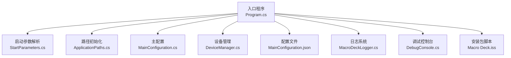
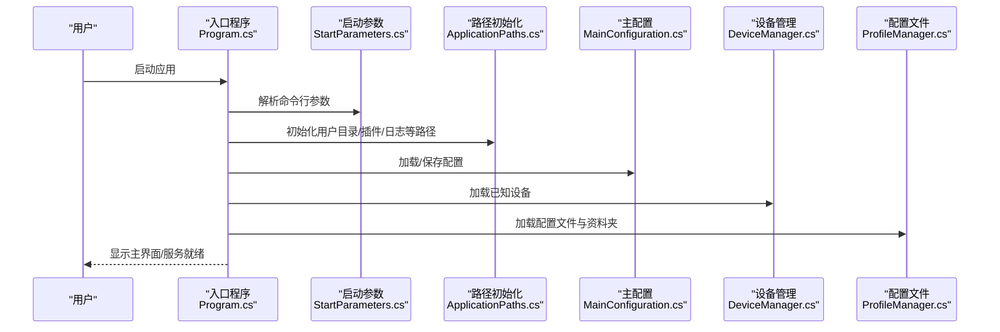
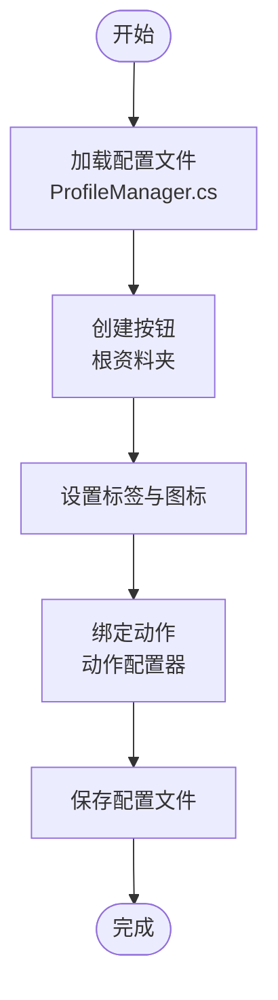
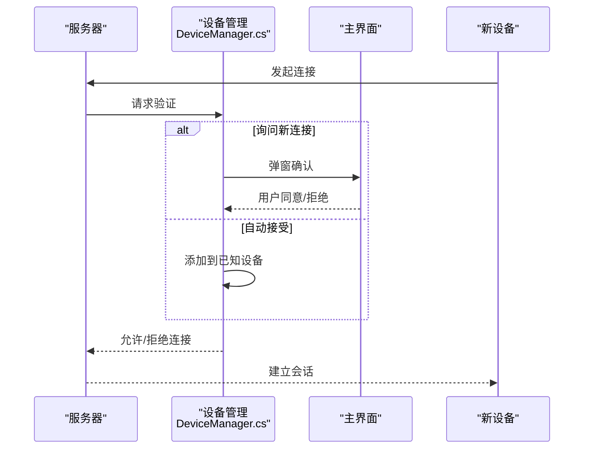
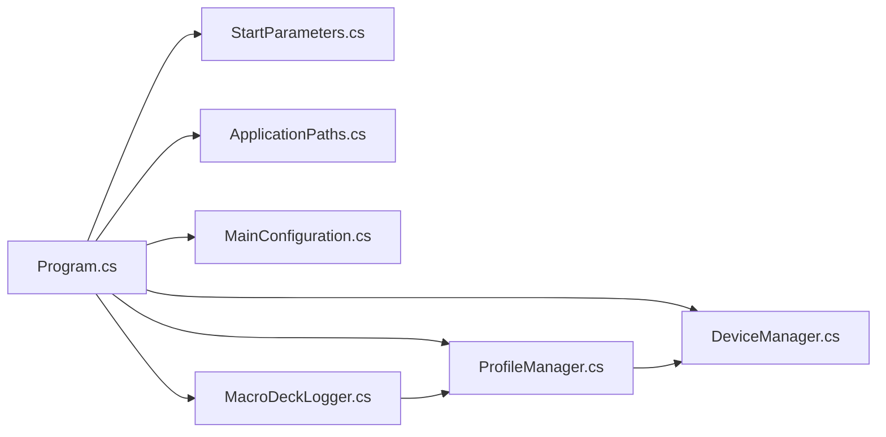

# 快速开始

<cite>
**本文引用的文件**
- [MacroDeck.csproj](file://src/MacroDeck/MacroDeck.csproj)
- [Program.cs](file://src/MacroDeck/Program.cs)
- [app.manifest](file://src/MacroDeck/app.manifest)
- [ApplicationPaths.cs](file://src/MacroDeck/StartupConfig/ApplicationPaths.cs)
- [StartParameters.cs](file://src/MacroDeck/StartupConfig/StartParameters.cs)
- [InitialSetup.cs](file://src/MacroDeck/GUI/InitialSetup.cs)
- [DeviceManager.cs](file://src/MacroDeck/Device/DeviceManager.cs)
- [ProfileManager.cs](file://src/MacroDeck/Profiles/ProfileManager.cs)
- [MainConfiguration.cs](file://src/MacroDeck/Configuration/MainConfiguration.cs)
- [Macro Deck.iss](file://setup/Macro Deck.iss)
- [DebugConsole.cs](file://src/MacroDeck/GUI/Dialogs/DebugConsole.cs)
- [MacroDeckLogger.cs](file://src/MacroDeck/Logging/MacroDeckLogger.cs)
</cite>

## 目录
1. [简介](#简介)
2. [项目结构](#项目结构)
3. [核心组件](#核心组件)
4. [架构总览](#架构总览)
5. [详细组件分析](#详细组件分析)
6. [依赖关系分析](#依赖关系分析)
7. [性能考虑](#性能考虑)
8. [故障排除指南](#故障排除指南)
9. [结论](#结论)
10. [附录](#附录)

## 简介
本“快速开始”指南面向首次接触 Macro-Deck 的用户，帮助你在最短时间内完成环境准备、安装与首次使用。文档覆盖以下主题：
- 环境要求：.NET 运行时版本、操作系统兼容性与硬件建议
- 安装方式：从源码编译与从预编译包安装
- 首次使用：初始设置向导、基本配置与创建第一个按钮
- 基本操作：创建按钮、配置动作、连接设备
- 常见问题与故障排除：日志查看、防火墙与自动更新

## 项目结构
Macro-Deck 是基于 .NET 的桌面应用，采用 Windows Forms + WPF 技术栈，通过自托管服务器对外提供服务，并支持插件扩展。其核心目录与职责概览如下：
- src/MacroDeck：主程序与 GUI、设备管理、配置、日志、插件等模块
- setup：安装包脚本（Inno Setup），包含 VC++ 运行库检测与防火墙规则
- tests：单元测试工程

图表来源
- [Program.cs:1-80](file://src/MacroDeck/Program.cs#L1-L80)
- [StartParameters.cs:1-78](file://src/MacroDeck/StartupConfig/StartParameters.cs#L1-L78)
- [ApplicationPaths.cs:1-143](file://src/MacroDeck/StartupConfig/ApplicationPaths.cs#L1-L143)
- [MainConfiguration.cs:1-103](file://src/MacroDeck/Configuration/MainConfiguration.cs#L1-L103)
- [DeviceManager.cs:1-278](file://src/MacroDeck/Device/DeviceManager.cs#L1-L278)
- [MacroDeckLogger.cs:1-361](file://src/MacroDeck/Logging/MacroDeckLogger.cs#L1-L361)
- [DebugConsole.cs:1-249](file://src/MacroDeck/GUI/Dialogs/DebugConsole.cs#L1-L249)
- [Macro Deck.iss:1-106](file://setup/Macro Deck.iss#L1-L106)

章节来源
- [MacroDeck.csproj:1-363](file://src/MacroDeck/MacroDeck.csproj#L1-L363)
- [Program.cs:1-80](file://src/MacroDeck/Program.cs#L1-L80)

## 核心组件
- 启动与进程管理：入口程序负责异常捕获、单实例检查、路径初始化与日志系统建立。
- 路径与数据目录：根据便携模式或用户模式确定用户数据目录、插件目录、日志目录等。
- 配置系统：主配置包含主机地址、端口、SSL、ADB、自动更新、语言等选项。
- 设备管理：维护已知设备列表、连接请求处理、设备状态变更与配置持久化。
- 配置文件与资料夹：管理配置文件、资料夹树、按钮与动作绑定。
- 日志与调试：统一日志开关、级别切换、调试控制台输出与日志清理。

章节来源
- [Program.cs:1-80](file://src/MacroDeck/Program.cs#L1-L80)
- [ApplicationPaths.cs:1-143](file://src/MacroDeck/StartupConfig/ApplicationPaths.cs#L1-L143)
- [MainConfiguration.cs:1-103](file://src/MacroDeck/Configuration/MainConfiguration.cs#L1-L103)
- [DeviceManager.cs:1-278](file://src/MacroDeck/Device/DeviceManager.cs#L1-L278)
- [ProfileManager.cs:1-640](file://src/MacroDeck/Profiles/ProfileManager.cs#L1-L640)
- [MacroDeckLogger.cs:1-361](file://src/MacroDeck/Logging/MacroDeckLogger.cs#L1-L361)
- [DebugConsole.cs:1-249](file://src/MacroDeck/GUI/Dialogs/DebugConsole.cs#L1-L249)

## 架构总览
下图展示了从启动到运行的关键交互：入口程序解析参数、初始化路径与日志，随后加载配置、设备与配置文件，最终进入主界面与服务循环。

图表来源
- [Program.cs:1-80](file://src/MacroDeck/Program.cs#L1-L80)
- [StartParameters.cs:1-78](file://src/MacroDeck/StartupConfig/StartParameters.cs#L1-L78)
- [ApplicationPaths.cs:1-143](file://src/MacroDeck/StartupConfig/ApplicationPaths.cs#L1-L143)
- [MainConfiguration.cs:1-103](file://src/MacroDeck/Configuration/MainConfiguration.cs#L1-L103)
- [DeviceManager.cs:1-278](file://src/MacroDeck/Device/DeviceManager.cs#L1-L278)
- [ProfileManager.cs:1-640](file://src/MacroDeck/Profiles/ProfileManager.cs#L1-L640)

## 详细组件分析

### 环境要求
- 操作系统兼容性
  - 支持 Windows 7 至 Windows 10 及更高版本，由清单文件中的 supportedOS 标签声明。
- .NET 与运行时
  - 工程启用 WPF 与 Windows Forms，使用 Microsoft.AspNetCore.App 框架引用；具体 .NET 版本以工程文件中 SDK 类型为准。
- 硬件建议
  - 作为桌面应用，推荐具备足够内存与磁盘空间以存放插件、图标包与日志文件；无特殊 GPU 要求。

章节来源
- [app.manifest:25-52](file://src/MacroDeck/app.manifest#L25-L52)
- [MacroDeck.csproj:65-67](file://src/MacroDeck/MacroDeck.csproj#L65-L67)

### 安装方式
- 从源码编译
  - 使用 .NET SDK 进行构建，生成可执行文件与资源文件。
- 从预编译包安装
  - 安装脚本会检测并安装 VC++ 2019 x64 运行库，添加防火墙入站/出站规则，并在安装完成后启动应用。

章节来源
- [Macro Deck.iss:1-106](file://setup/Macro Deck.iss#L1-L106)

### 初始设置与基本配置
- 初始设置向导
  - 首次启动时弹出多页向导，引导选择语言、主机地址与端口等基础配置。
- 主配置项
  - 包含自动启动、自动更新、SSL、ADB、连接策略、语言与隐私设置等。
- 路径与数据目录
  - 便携模式与非便携模式分别将用户数据写入应用目录或 %APPDATA%\Macro Deck。

章节来源
- [InitialSetup.cs:1-180](file://src/MacroDeck/GUI/InitialSetup.cs#L1-L180)
- [MainConfiguration.cs:1-103](file://src/MacroDeck/Configuration/MainConfiguration.cs#L1-L103)
- [ApplicationPaths.cs:1-143](file://src/MacroDeck/StartupConfig/ApplicationPaths.cs#L1-L143)

### 创建你的第一个按钮与配置动作
- 步骤概览
  - 在当前配置文件的根资料夹中添加一个按钮，为其设置标签与图标，然后为按钮绑定一个动作（如切换状态）。
- 关键流程
  - 配置文件加载后，系统会为按钮绑定插件动作并更新变量标签。
  - 动作配置器用于选择动作类型与填写配置视图。

图表来源
- [ProfileManager.cs:205-311](file://src/MacroDeck/Profiles/ProfileManager.cs#L205-L311)
- [ProfileManager.cs:295-308](file://src/MacroDeck/Profiles/ProfileManager.cs#L295-L308)

章节来源
- [ProfileManager.cs:1-640](file://src/MacroDeck/Profiles/ProfileManager.cs#L1-L640)

### 连接设备
- 新设备接入
  - 当新设备发起连接时，若开启“询问新连接”，将弹窗确认；否则自动加入已知设备列表。
- 设备状态与配置
  - 可为设备设置显示名、默认配置文件、阻断连接等；设备可用时可立即下发配置。

图表来源
- [DeviceManager.cs:185-276](file://src/MacroDeck/Device/DeviceManager.cs#L185-L276)

章节来源
- [DeviceManager.cs:1-278](file://src/MacroDeck/Device/DeviceManager.cs#L1-L278)

### 启动流程与参数
- 启动参数
  - 支持端口、便携模式、强制更新、测试通道、调试控制台、日志级别等参数。
- 单实例与异常处理
  - 应用启动时检查已有实例，捕获未处理异常并记录日志。

章节来源
- [StartParameters.cs:1-78](file://src/MacroDeck/StartupConfig/StartParameters.cs#L1-L78)
- [Program.cs:1-80](file://src/MacroDeck/Program.cs#L1-L80)

## 依赖关系分析
- 组件耦合
  - 入口程序依赖启动参数、路径初始化与日志系统；设备管理与配置文件相互协作；日志系统贯穿全模块。
- 外部依赖
  - 使用 Serilog 记录日志，Microsoft.Extensions.Hosting 提供主机化能力，Newtonsoft.Json 处理序列化，SQLite 用于旧版配置迁移。

图表来源
- [Program.cs:1-80](file://src/MacroDeck/Program.cs#L1-L80)
- [StartParameters.cs:1-78](file://src/MacroDeck/StartupConfig/StartParameters.cs#L1-L78)
- [ApplicationPaths.cs:1-143](file://src/MacroDeck/StartupConfig/ApplicationPaths.cs#L1-L143)
- [MainConfiguration.cs:1-103](file://src/MacroDeck/Configuration/MainConfiguration.cs#L1-L103)
- [MacroDeckLogger.cs:1-361](file://src/MacroDeck/Logging/MacroDeckLogger.cs#L1-L361)
- [DeviceManager.cs:1-278](file://src/MacroDeck/Device/DeviceManager.cs#L1-L278)
- [ProfileManager.cs:1-640](file://src/MacroDeck/Profiles/ProfileManager.cs#L1-L640)

章节来源
- [MacroDeck.csproj:42-67](file://src/MacroDeck/MacroDeck.csproj#L42-L67)

## 性能考虑
- 配置文件读写
  - 使用临时文件与原子移动避免并发写入冲突；序列化时忽略空值与循环引用，减少体积。
- 日志级别
  - 默认仅记录必要信息；可通过调试控制台动态调整日志级别，便于定位问题。
- 资源渲染
  - 标签渲染采用模板与位图缓存，避免重复计算。

章节来源
- [ProfileManager.cs:313-380](file://src/MacroDeck/Profiles/ProfileManager.cs#L313-L380)
- [MacroDeckLogger.cs:25-35](file://src/MacroDeck/Logging/MacroDeckLogger.cs#L25-L35)
- [ProfileManager.cs:156-203](file://src/MacroDeck/Profiles/ProfileManager.cs#L156-L203)

## 故障排除指南
- 打开调试控制台
  - 通过调试控制台查看实时日志、导出日志、重启应用与打开用户目录。
- 查看日志文件
  - 日志目录位于用户数据目录下的 logs 子目录；可直接打开最新日志文件进行排查。
- 防火墙与网络
  - 安装脚本会自动添加入站/出站规则；若无法连接，请检查防火墙策略。
- 自动更新与 SSL
  - 若启用 SSL 或使用代理，需确保证书与网络可达；可在主配置中关闭自动更新以隔离问题。
- 设备连接被拒
  - 检查“询问新连接”与“阻断新连接”设置；必要时重置设备列表或手动允许设备。

章节来源
- [DebugConsole.cs:1-249](file://src/MacroDeck/GUI/Dialogs/DebugConsole.cs#L1-L249)
- [ApplicationPaths.cs:1-143](file://src/MacroDeck/StartupConfig/ApplicationPaths.cs#L1-L143)
- [Macro Deck.iss:102-106](file://setup/Macro Deck.iss#L102-L106)
- [MainConfiguration.cs:42-76](file://src/MacroDeck/Configuration/MainConfiguration.cs#L42-L76)
- [DeviceManager.cs:185-276](file://src/MacroDeck/Device/DeviceManager.cs#L185-L276)

## 结论
通过本指南，你可以在几分钟内完成环境准备、安装与首次使用。建议在正式使用前先熟悉调试控制台与日志系统，以便快速定位问题。随着使用深入，可逐步探索插件生态与高级配置。

## 附录
- 快速操作清单
  - 安装预编译包或从源码编译
  - 运行初始设置向导，设置语言与主机端口
  - 在根资料夹创建按钮，设置标签与图标
  - 为按钮绑定动作（如切换状态）
  - 通过设备管理器添加/允许新设备
  - 使用调试控制台查看日志与导出问题报告