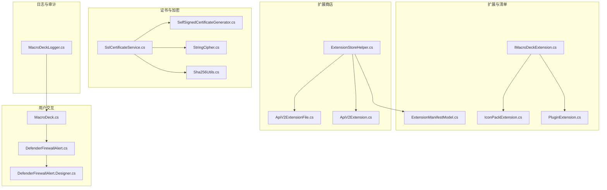
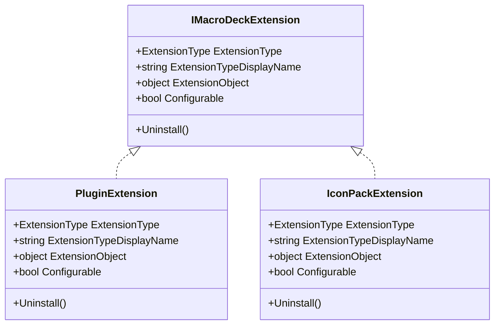
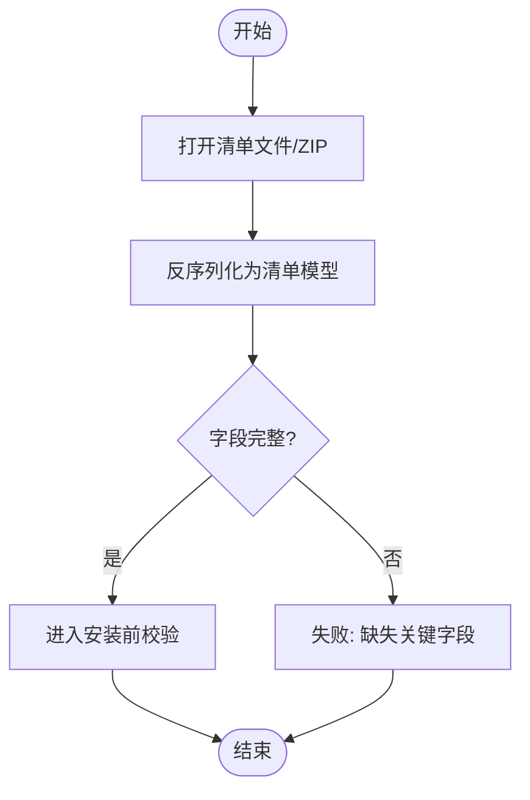
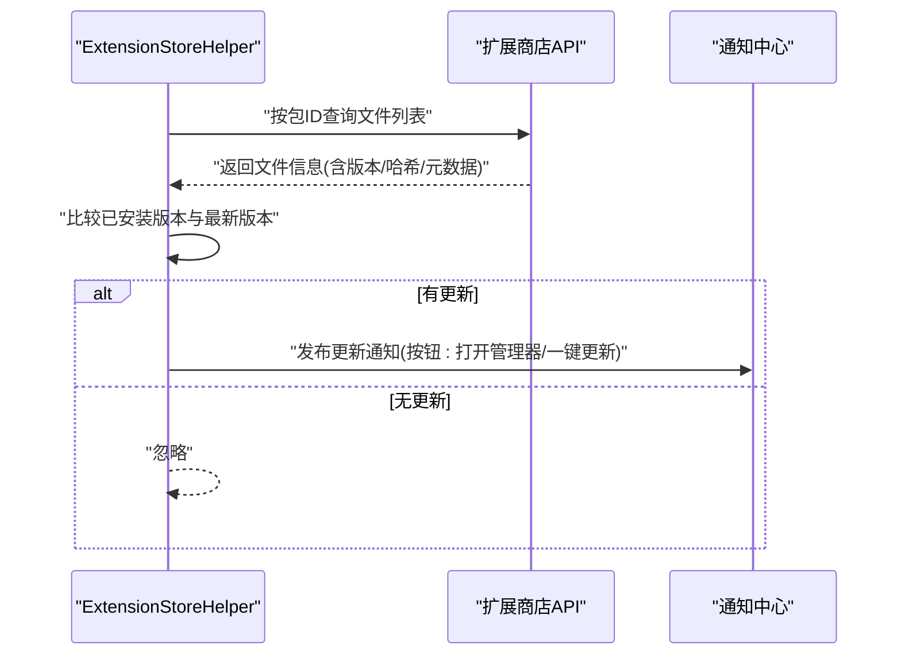
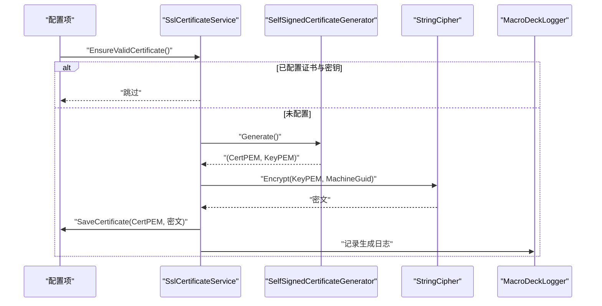
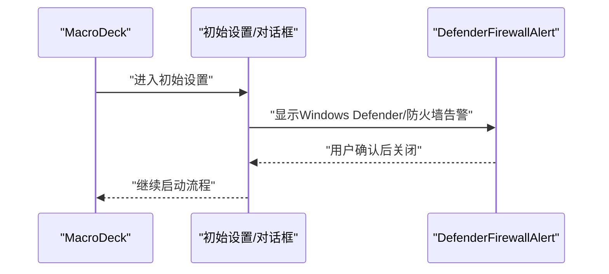
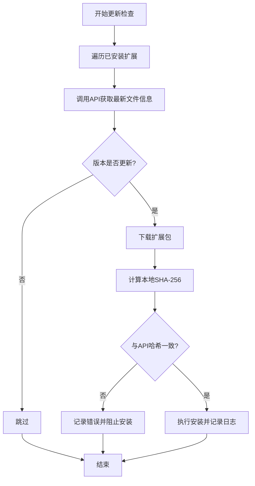
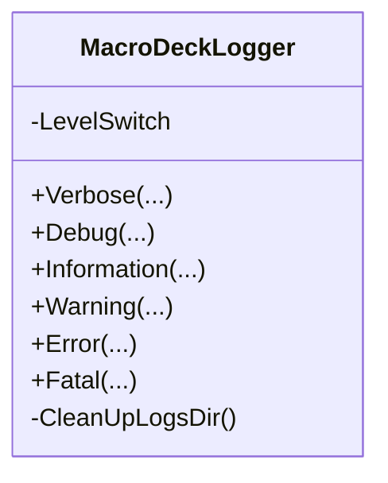
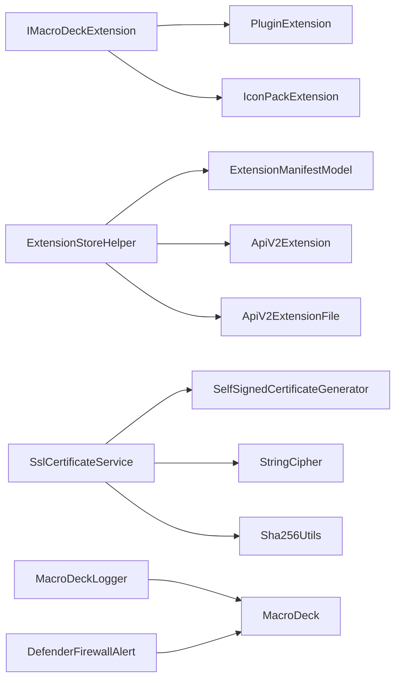

# 安全验证机制

<cite>
**本文引用的文件**
- [IMacroDeckExtension.cs](file://src/MacroDeck/Extension/IMacroDeckExtension.cs)
- [PluginExtension.cs](file://src/MacroDeck/Extension/PluginExtension.cs)
- [IconPackExtension.cs](file://src/MacroDeck/Extension/IconPackExtension.cs)
- [ExtensionManifestModel.cs](file://src/MacroDeck/Models/ExtensionManifestModel.cs)
- [ExtensionStoreHelper.cs](file://src/MacroDeck/ExtensionStore/ExtensionStoreHelper.cs)
- [ApiV2Extension.cs](file://src/MacroDeck/Models/ApiV2Extension.cs)
- [ApiV2ExtensionFile.cs](file://src/MacroDeck/Models/ApiV2ExtensionFile.cs)
- [SelfSignedCertificateGenerator.cs](file://src/MacroDeck/Utils/SelfSignedCertificateGenerator.cs)
- [SslCertificateService.cs](file://src/MacroDeck/Services/SslCertificateService.cs)
- [Sha256Utils.cs](file://src/MacroDeck/Utils/Sha256Utils.cs)
- [StringCipher.cs](file://src/MacroDeck/Utils/StringCipher.cs)
- [MacroDeckLogger.cs](file://src/MacroDeck/Logging/MacroDeckLogger.cs)
- [DefenderFirewallAlert.cs](file://src/MacroDeck/Gui/Dialogs/DefenderFirewallAlert.cs)
- [DefenderFirewallAlert.Designer.cs](file://src/MacroDeck/Gui/Dialogs/DefenderFirewallAlert.Designer.cs)
- [MacroDeck.cs](file://src/MacroDeck/MacroDeck.cs)
</cite>

## 目录
1. [引言](#引言)
2. [项目结构](#项目结构)
3. [核心组件](#核心组件)
4. [架构总览](#架构总览)
5. [详细组件分析](#详细组件分析)
6. [依赖关系分析](#依赖关系分析)
7. [性能考量](#性能考量)
8. [故障排查指南](#故障排查指南)
9. [结论](#结论)
10. [附录](#附录)

## 引言
本文件系统性梳理并解释 Macro-Deck 在扩展安装与运行过程中的安全验证机制，覆盖扩展来源可信度评估、签名与证书使用、权限申请与用户授权、恶意软件检测与防护、扩展更新的完整性校验、安全日志与审计追踪，以及用户安全设置与隐私保护配置。文档以代码为依据，结合可视化图示帮助读者快速把握整体安全设计。

## 项目结构
围绕“扩展安装与安全验证”的关键目录与文件如下：
- 扩展接口与类型：Extension 接口与具体扩展类型（插件、图标包）
- 扩展清单模型：解析与读取扩展清单，用于安装前的元数据校验
- 扩展商店辅助：下载器、安装流程、更新检查与通知
- 证书与加密：自签证书生成与加载、敏感信息加密存储
- 哈希与完整性：SHA-256 计算工具
- 日志与审计：统一日志门面与级别控制
- 用户交互与安全提示：防火墙与安全告警对话框

图表来源
- [IMacroDeckExtension.cs:1-13](file://src/MacroDeck/Extension/IMacroDeckExtension.cs#L1-L13)
- [PluginExtension.cs:1-24](file://src/MacroDeck/Extension/PluginExtension.cs#L1-L24)
- [IconPackExtension.cs:1-23](file://src/MacroDeck/Extension/IconPackExtension.cs#L1-L23)
- [ExtensionManifestModel.cs:1-61](file://src/MacroDeck/Models/ExtensionManifestModel.cs#L1-L61)
- [ExtensionStoreHelper.cs:1-195](file://src/MacroDeck/ExtensionStore/ExtensionStoreHelper.cs#L1-L195)
- [ApiV2Extension.cs:1-17](file://src/MacroDeck/Models/ApiV2Extension.cs#L1-L17)
- [ApiV2ExtensionFile.cs:1-15](file://src/MacroDeck/Models/ApiV2ExtensionFile.cs#L1-L15)
- [SelfSignedCertificateGenerator.cs:1-66](file://src/MacroDeck/Utils/SelfSignedCertificateGenerator.cs#L1-L66)
- [SslCertificateService.cs:1-91](file://src/MacroDeck/Services/SslCertificateService.cs#L1-L91)
- [StringCipher.cs:1-100](file://src/MacroDeck/Utils/StringCipher.cs#L1-L100)
- [Sha256Utils.cs:1-39](file://src/MacroDeck/Utils/Sha256Utils.cs#L1-L39)
- [MacroDeckLogger.cs:1-361](file://src/MacroDeck/Logging/MacroDeckLogger.cs#L1-L361)
- [DefenderFirewallAlert.cs:1-22](file://src/MacroDeck/Gui/Dialogs/DefenderFirewallAlert.cs#L1-L22)
- [DefenderFirewallAlert.Designer.cs:1-101](file://src/MacroDeck/Gui/Dialogs/DefenderFirewallAlert.Designer.cs#L1-L101)
- [MacroDeck.cs:182-220](file://src/MacroDeck/MacroDeck.cs#L182-L220)

章节来源
- [ExtensionStoreHelper.cs:1-195](file://src/MacroDeck/ExtensionStore/ExtensionStoreHelper.cs#L1-L195)
- [ExtensionManifestModel.cs:1-61](file://src/MacroDeck/Models/ExtensionManifestModel.cs#L1-L61)
- [SslCertificateService.cs:1-91](file://src/MacroDeck/Services/SslCertificateService.cs#L1-L91)
- [MacroDeckLogger.cs:1-361](file://src/MacroDeck/Logging/MacroDeckLogger.cs#L1-L361)
- [DefenderFirewallAlert.cs:1-22](file://src/MacroDeck/Gui/Dialogs/DefenderFirewallAlert.cs#L1-L22)

## 核心组件
- 扩展接口与类型：定义扩展抽象与可配置能力，区分插件与图标包两类扩展。
- 扩展清单模型：负责从文件或压缩包中解析扩展元数据，作为安装与更新校验的基础。
- 扩展商店辅助：封装安装、更新检查、批量升级等流程，并触发用户界面通知。
- 证书与加密：自签证书生成与加载、私钥加密存储、哈希计算工具。
- 日志与审计：统一日志入口、级别切换、插件来源标注与清理策略。
- 用户交互与安全提示：引导用户处理防火墙与安全告警，提升安装体验与安全意识。

章节来源
- [IMacroDeckExtension.cs:1-13](file://src/MacroDeck/Extension/IMacroDeckExtension.cs#L1-L13)
- [PluginExtension.cs:1-24](file://src/MacroDeck/Extension/PluginExtension.cs#L1-L24)
- [IconPackExtension.cs:1-23](file://src/MacroDeck/Extension/IconPackExtension.cs#L1-L23)
- [ExtensionManifestModel.cs:1-61](file://src/MacroDeck/Models/ExtensionManifestModel.cs#L1-L61)
- [ExtensionStoreHelper.cs:1-195](file://src/MacroDeck/ExtensionStore/ExtensionStoreHelper.cs#L1-L195)
- [SslCertificateService.cs:1-91](file://src/MacroDeck/Services/SslCertificateService.cs#L1-L91)
- [StringCipher.cs:1-100](file://src/MacroDeck/Utils/StringCipher.cs#L1-L100)
- [Sha256Utils.cs:1-39](file://src/MacroDeck/Utils/Sha256Utils.cs#L1-L39)
- [MacroDeckLogger.cs:1-361](file://src/MacroDeck/Logging/MacroDeckLogger.cs#L1-L361)
- [DefenderFirewallAlert.cs:1-22](file://src/MacroDeck/Gui/Dialogs/DefenderFirewallAlert.cs#L1-L22)

## 架构总览
下图展示扩展安装与更新的端到端安全流程：从扩展商店拉取清单与文件，进行完整性校验与来源可信度评估，再到安装与更新通知，贯穿证书与加密、日志与审计。

```mermaid
sequenceDiagram
participant U as "用户"
participant UI as "扩展商店界面"
participant ESH as "ExtensionStoreHelper"
participant API as "扩展商店API"
participant DL as "下载器"
participant MAN as "ExtensionManifestModel"
participant HASH as "Sha256Utils"
participant CERT as "SslCertificateService"
participant LOG as "MacroDeckLogger"
U->>UI : "选择安装/更新扩展"
UI->>ESH : "InstallPackages()/UpdateAllPackages()"
ESH->>API : "查询可用更新/文件信息"
API-->>ESH : "返回文件版本/哈希/元数据"
ESH->>DL : "下载扩展包"
DL-->>ESH : "返回本地路径"
ESH->>MAN : "解析扩展清单(Manifest)"
ESH->>HASH : "计算文件哈希并与API返回对比"
HASH-->>ESH : "校验结果"
ESH->>CERT : "确保有效SSL证书(如启用)"
CERT-->>ESH : "证书状态/加载"
ESH->>LOG : "记录安装/更新事件"
ESH-->>UI : "完成安装/更新并显示通知"
```

图表来源
- [ExtensionStoreHelper.cs:48-195](file://src/MacroDeck/ExtensionStore/ExtensionStoreHelper.cs#L48-L195)
- [ExtensionManifestModel.cs:32-61](file://src/MacroDeck/Models/ExtensionManifestModel.cs#L32-L61)
- [ApiV2ExtensionFile.cs:1-15](file://src/MacroDeck/Models/ApiV2ExtensionFile.cs#L1-L15)
- [Sha256Utils.cs:8-39](file://src/MacroDeck/Utils/Sha256Utils.cs#L8-L39)
- [SslCertificateService.cs:12-91](file://src/MacroDeck/Services/SslCertificateService.cs#L12-L91)
- [MacroDeckLogger.cs:64-215](file://src/MacroDeck/Logging/MacroDeckLogger.cs#L64-L215)

## 详细组件分析

### 扩展接口与类型
- IMacroDeckExtension 抽象了扩展的类型、显示名、对象实例、是否可配置与卸载行为。
- PluginExtension 与 IconPackExtension 分别承载插件与图标包的具体实现，提供类型标识与可配置性判断。

图表来源
- [IMacroDeckExtension.cs:5-12](file://src/MacroDeck/Extension/IMacroDeckExtension.cs#L5-L12)
- [PluginExtension.cs:7-23](file://src/MacroDeck/Extension/PluginExtension.cs#L7-L23)
- [IconPackExtension.cs:7-22](file://src/MacroDeck/Extension/IconPackExtension.cs#L7-L22)

章节来源
- [IMacroDeckExtension.cs:1-13](file://src/MacroDeck/Extension/IMacroDeckExtension.cs#L1-L13)
- [PluginExtension.cs:1-24](file://src/MacroDeck/Extension/PluginExtension.cs#L1-L24)
- [IconPackExtension.cs:1-23](file://src/MacroDeck/Extension/IconPackExtension.cs#L1-L23)

### 扩展清单模型与安装前校验
- 支持从文件或 ZIP 中读取扩展清单，提取类型、名称、作者、仓库、包 ID、版本、目标 API 版本、DLL 等字段。
- 安装流程应基于清单进行兼容性与完整性校验（见后续“完整性检查”）。

图表来源
- [ExtensionManifestModel.cs:32-61](file://src/MacroDeck/Models/ExtensionManifestModel.cs#L32-L61)

章节来源
- [ExtensionManifestModel.cs:1-61](file://src/MacroDeck/Models/ExtensionManifestModel.cs#L1-L61)

### 扩展商店与来源可信度评估
- 扩展商店辅助类负责安装、更新检查与批量升级；通过 API 查询最新文件信息，包括版本、最小 API 版本、文件哈希、许可证等。
- 来源可信度评估建议：仅从官方扩展商店下载，校验返回的文件哈希与上传时间，避免离线来源。

图表来源
- [ExtensionStoreHelper.cs:71-131](file://src/MacroDeck/ExtensionStore/ExtensionStoreHelper.cs#L71-L131)
- [ApiV2Extension.cs:5-17](file://src/MacroDeck/Models/ApiV2Extension.cs#L5-L17)
- [ApiV2ExtensionFile.cs:3-15](file://src/MacroDeck/Models/ApiV2ExtensionFile.cs#L3-L15)

章节来源
- [ExtensionStoreHelper.cs:1-195](file://src/MacroDeck/ExtensionStore/ExtensionStoreHelper.cs#L1-L195)
- [ApiV2Extension.cs:1-17](file://src/MacroDeck/Models/ApiV2Extension.cs#L1-L17)
- [ApiV2ExtensionFile.cs:1-15](file://src/MacroDeck/Models/ApiV2ExtensionFile.cs#L1-L15)

### 数字证书与 SSL 安全
- 当启用 SSL 时，若未配置证书与密钥，则自动生成自签证书并保存；支持对 PEM/私钥进行有效性校验。
- 私钥采用基于机器唯一标识的对称加密存储，加载时解密后转换为可使用的证书对象。

图表来源
- [SslCertificateService.cs:12-91](file://src/MacroDeck/Services/SslCertificateService.cs#L12-L91)
- [SelfSignedCertificateGenerator.cs:11-66](file://src/MacroDeck/Utils/SelfSignedCertificateGenerator.cs#L11-L66)
- [StringCipher.cs:16-98](file://src/MacroDeck/Utils/StringCipher.cs#L16-L98)

章节来源
- [SslCertificateService.cs:1-91](file://src/MacroDeck/Services/SslCertificateService.cs#L1-L91)
- [SelfSignedCertificateGenerator.cs:1-66](file://src/MacroDeck/Utils/SelfSignedCertificateGenerator.cs#L1-L66)
- [StringCipher.cs:1-100](file://src/MacroDeck/Utils/StringCipher.cs#L1-L100)

### 权限申请与用户授权确认
- 插件扩展的可配置性由其自身能力决定；安装与更新流程中，用户通过界面确认操作。
- 防火墙与安全告警：首次启动或网络相关变更时，弹出安全提示对话框，提醒用户注意系统安全软件拦截。

图表来源
- [MacroDeck.cs:207-220](file://src/MacroDeck/MacroDeck.cs#L207-L220)
- [DefenderFirewallAlert.cs:6-22](file://src/MacroDeck/Gui/Dialogs/DefenderFirewallAlert.cs#L6-L22)
- [DefenderFirewallAlert.Designer.cs:34-101](file://src/MacroDeck/Gui/Dialogs/DefenderFirewallAlert.Designer.cs#L34-L101)

章节来源
- [MacroDeck.cs:182-220](file://src/MacroDeck/MacroDeck.cs#L182-L220)
- [DefenderFirewallAlert.cs:1-22](file://src/MacroDeck/Gui/Dialogs/DefenderFirewallAlert.cs#L1-L22)

### 恶意软件检测与防护
- 文件完整性：通过 API 返回的文件哈希与本地计算结果比对，发现不一致立即阻断安装。
- 证书与加密：私钥加密存储，证书自动生成与校验，降低凭据泄露风险。
- 日志审计：统一日志入口，区分宿主与插件来源，便于追踪异常事件。

章节来源
- [ApiV2ExtensionFile.cs:10-10](file://src/MacroDeck/Models/ApiV2ExtensionFile.cs#L10-L10)
- [Sha256Utils.cs:8-39](file://src/MacroDeck/Utils/Sha256Utils.cs#L8-L39)
- [SslCertificateService.cs:56-91](file://src/MacroDeck/Services/SslCertificateService.cs#L56-L91)
- [MacroDeckLogger.cs:64-215](file://src/MacroDeck/Logging/MacroDeckLogger.cs#L64-L215)

### 扩展更新的安全验证与完整性检查
- 更新检查：遍历已安装插件与图标包，调用 API 获取最新文件信息，比较版本号。
- 完整性校验：下载完成后计算本地文件 SHA-256，与 API 返回的哈希对比，一致才允许安装。
- 通知与回滚：若校验失败，记录错误日志并阻止安装；用户可在扩展管理器中重试或回滚。

图表来源
- [ExtensionStoreHelper.cs:71-131](file://src/MacroDeck/ExtensionStore/ExtensionStoreHelper.cs#L71-L131)
- [ApiV2ExtensionFile.cs:5-14](file://src/MacroDeck/Models/ApiV2ExtensionFile.cs#L5-L14)
- [Sha256Utils.cs:8-39](file://src/MacroDeck/Utils/Sha256Utils.cs#L8-L39)

章节来源
- [ExtensionStoreHelper.cs:162-187](file://src/MacroDeck/ExtensionStore/ExtensionStoreHelper.cs#L162-L187)
- [ApiV2ExtensionFile.cs:1-15](file://src/MacroDeck/Models/ApiV2ExtensionFile.cs#L1-L15)
- [Sha256Utils.cs:1-39](file://src/MacroDeck/Utils/Sha256Utils.cs#L1-L39)

### 安全日志记录与审计追踪
- 统一日志入口：提供多级日志方法，支持插件来源标注与异常模板化记录。
- 级别控制：运行时可调整最低日志级别，便于调试与生产环境降噪。
- 清理策略：定期清理旧日志文件，避免磁盘占用增长。

图表来源
- [MacroDeckLogger.cs:64-331](file://src/MacroDeck/Logging/MacroDeckLogger.cs#L64-L331)

章节来源
- [MacroDeckLogger.cs:1-361](file://src/MacroDeck/Logging/MacroDeckLogger.cs#L1-L361)

### 用户安全设置与隐私保护
- SSL 开关与证书：可通过配置启用/禁用 SSL；未配置时自动补全自签证书并加密保存私钥。
- 加密存储：私钥以 Base64 形式与机器唯一标识组合加密后写入配置文件。
- 网络接口探测：启动时记录可用网络接口，便于诊断网络相关问题。

章节来源
- [SslCertificateService.cs:14-29](file://src/MacroDeck/Services/SslCertificateService.cs#L14-L29)
- [StringCipher.cs:78-98](file://src/MacroDeck/Utils/StringCipher.cs#L78-L98)
- [MacroDeck.cs:182-205](file://src/MacroDeck/MacroDeck.cs#L182-L205)

## 依赖关系分析
- 扩展类型依赖于扩展接口；扩展商店辅助依赖清单模型与 API 数据模型。
- 证书服务依赖自签生成器与字符串加密工具；日志服务独立但被各模块广泛使用。
- 用户交互层通过对话框与主程序集成，形成闭环的安全提示与确认流程。

图表来源
- [IMacroDeckExtension.cs:5-12](file://src/MacroDeck/Extension/IMacroDeckExtension.cs#L5-L12)
- [PluginExtension.cs:7-23](file://src/MacroDeck/Extension/PluginExtension.cs#L7-L23)
- [IconPackExtension.cs:7-22](file://src/MacroDeck/Extension/IconPackExtension.cs#L7-L22)
- [ExtensionStoreHelper.cs:48-195](file://src/MacroDeck/ExtensionStore/ExtensionStoreHelper.cs#L48-L195)
- [ExtensionManifestModel.cs:32-61](file://src/MacroDeck/Models/ExtensionManifestModel.cs#L32-L61)
- [ApiV2Extension.cs:5-17](file://src/MacroDeck/Models/ApiV2Extension.cs#L5-L17)
- [ApiV2ExtensionFile.cs:3-15](file://src/MacroDeck/Models/ApiV2ExtensionFile.cs#L3-L15)
- [SslCertificateService.cs:12-91](file://src/MacroDeck/Services/SslCertificateService.cs#L12-L91)
- [SelfSignedCertificateGenerator.cs:11-66](file://src/MacroDeck/Utils/SelfSignedCertificateGenerator.cs#L11-L66)
- [StringCipher.cs:16-98](file://src/MacroDeck/Utils/StringCipher.cs#L16-L98)
- [Sha256Utils.cs:8-39](file://src/MacroDeck/Utils/Sha256Utils.cs#L8-L39)
- [MacroDeckLogger.cs:64-331](file://src/MacroDeck/Logging/MacroDeckLogger.cs#L64-L331)
- [DefenderFirewallAlert.cs:6-22](file://src/MacroDeck/Gui/Dialogs/DefenderFirewallAlert.cs#L6-L22)
- [MacroDeck.cs:207-220](file://src/MacroDeck/MacroDeck.cs#L207-L220)

章节来源
- [ExtensionStoreHelper.cs:1-195](file://src/MacroDeck/ExtensionStore/ExtensionStoreHelper.cs#L1-L195)
- [SslCertificateService.cs:1-91](file://src/MacroDeck/Services/SslCertificateService.cs#L1-L91)
- [MacroDeckLogger.cs:1-361](file://src/MacroDeck/Logging/MacroDeckLogger.cs#L1-L361)

## 性能考量
- 哈希计算：使用缓冲流与分块变换减少内存峰值，适合大文件完整性校验。
- 日志级别：生产环境建议提高最低日志级别，降低 I/O 压力。
- 下载与更新：并发检查多个扩展的更新会增加网络请求，建议在后台任务中异步执行并合并通知。

## 故障排查指南
- 证书加载失败：检查配置中证书与密钥是否为空，尝试重新生成并保存。
- 安装被阻止：核对 API 返回哈希与本地计算结果，确认网络与代理设置。
- 日志定位：根据插件来源标注与错误级别筛选，必要时临时提升日志级别。
- 防火墙告警：首次出现时按提示处理系统安全软件拦截，确保服务正常通信。

章节来源
- [SslCertificateService.cs:41-54](file://src/MacroDeck/Services/SslCertificateService.cs#L41-L54)
- [MacroDeckLogger.cs:25-35](file://src/MacroDeck/Logging/MacroDeckLogger.cs#L25-L35)
- [DefenderFirewallAlert.cs:18-22](file://src/MacroDeck/Gui/Dialogs/DefenderFirewallAlert.cs#L18-L22)

## 结论
Macro-Deck 的安全验证机制以“清单校验 + 哈希比对 + 证书与加密 + 日志审计 + 用户确认”为核心闭环，既保证扩展来源与完整性可控，又兼顾用户体验与可运维性。建议在生产环境中启用 SSL 并严格校验哈希，同时结合日志与告警机制持续监控异常行为。

## 附录
- 关键流程参考路径
  - 扩展安装与更新：[ExtensionStoreHelper.cs:48-195](file://src/MacroDeck/ExtensionStore/ExtensionStoreHelper.cs#L48-L195)
  - 清单解析：[ExtensionManifestModel.cs:32-61](file://src/MacroDeck/Models/ExtensionManifestModel.cs#L32-L61)
  - 完整性校验：[Sha256Utils.cs:8-39](file://src/MacroDeck/Utils/Sha256Utils.cs#L8-L39)
  - 证书与加密：[SslCertificateService.cs:12-91](file://src/MacroDeck/Services/SslCertificateService.cs#L12-L91)、[StringCipher.cs:16-98](file://src/MacroDeck/Utils/StringCipher.cs#L16-L98)
  - 日志与审计：[MacroDeckLogger.cs:64-331](file://src/MacroDeck/Logging/MacroDeckLogger.cs#L64-L331)
  - 用户安全提示：[DefenderFirewallAlert.cs:6-22](file://src/MacroDeck/Gui/Dialogs/DefenderFirewallAlert.cs#L6-L22)、[MacroDeck.cs:207-220](file://src/MacroDeck/MacroDeck.cs#L207-L220)