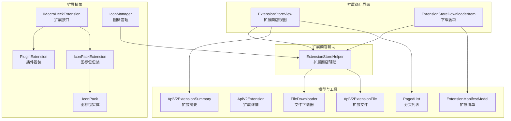
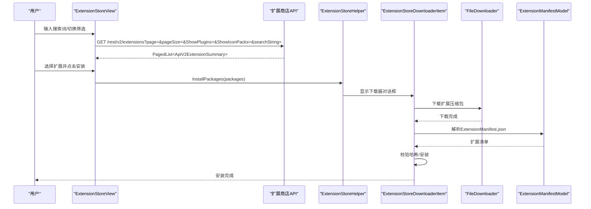
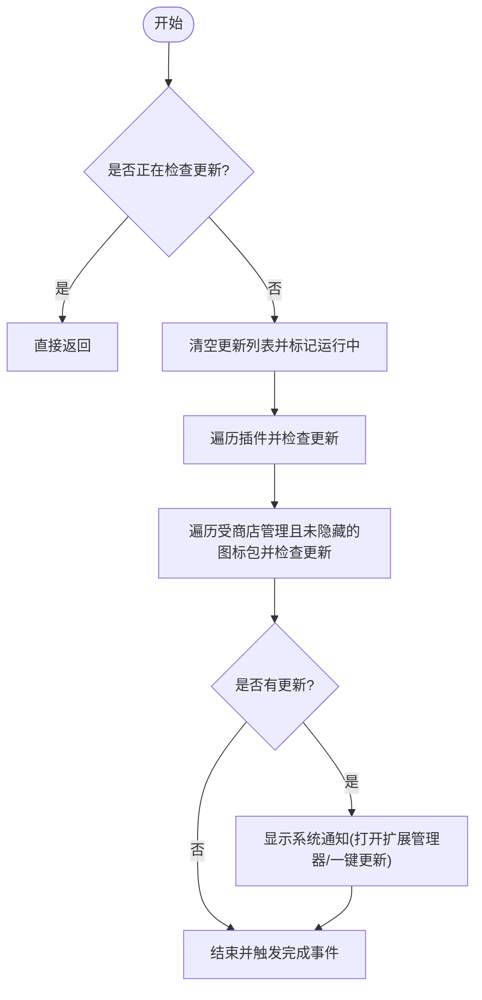
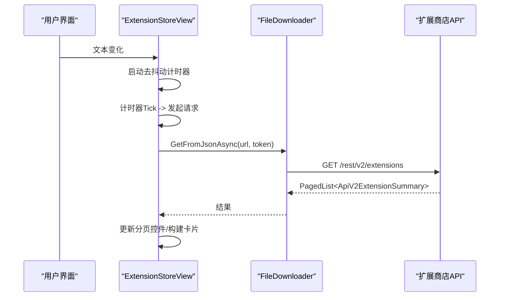
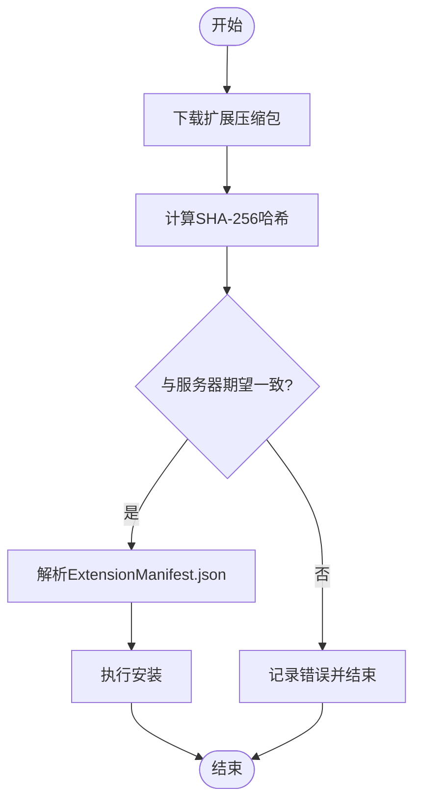
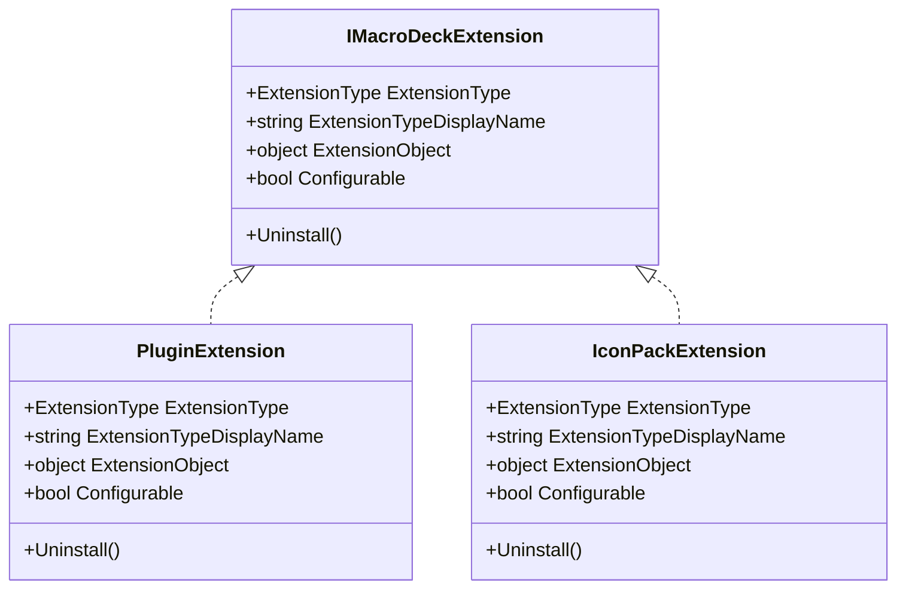
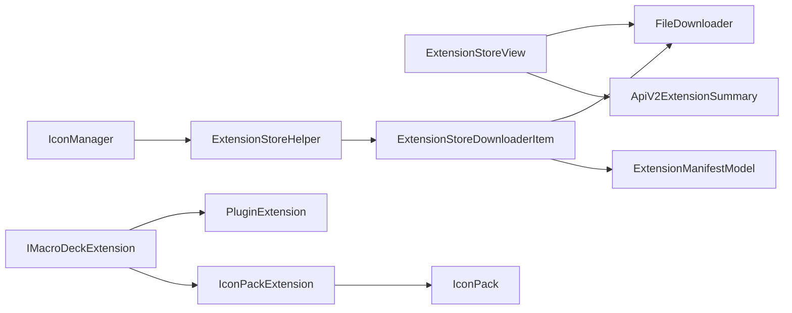

# 扩展发现机制

<cite>
**本文档引用的文件**
- [ExtensionStoreHelper.cs](file://src/MacroDeck/ExtensionStore/ExtensionStoreHelper.cs)
- [ExtensionStoreView.cs](file://src/MacroDeck/GUI/CustomControls/ExtensionsView/ExtensionStoreView.cs)
- [ExtensionStoreView.Designer.cs](file://src/MacroDeck/GUI/CustomControls/ExtensionsView/ExtensionStoreView.Designer.cs)
- [ExtensionStoreDownloaderItem.cs](file://src/MacroDeck/GUI/CustomControls/ExtensionStoreDownloader/ExtensionStoreDownloaderItem.cs)
- [FileDownloader.cs](file://src/MacroDeck/Utils/FileDownloader.cs)
- [ApiV2Extension.cs](file://src/MacroDeck/Models/ApiV2Extension.cs)
- [ApiV2ExtensionSummary.cs](file://src/MacroDeck/Models/ApiV2ExtensionSummary.cs)
- [ApiV2ExtensionFile.cs](file://src/MacroDeck/Models/ApiV2ExtensionFile.cs)
- [ExtensionManifestModel.cs](file://src/MacroDeck/Models/ExtensionManifestModel.cs)
- [ExtensionStoreExtensionModel.cs](file://src/MacroDeck/Models/ExtensionStoreExtensionModel.cs)
- [PagedList.cs](file://src/MacroDeck/Models/PagedList.cs)
- [ExtensionStoreDownloaderPackageInfoModel.cs](file://src/MacroDeck/Models/ExtensionStoreDownloaderPackageInfoModel.cs)
- [IMacroDeckExtension.cs](file://src/MacroDeck/Extension/IMacroDeckExtension.cs)
- [PluginExtension.cs](file://src/MacroDeck/Extension/PluginExtension.cs)
- [IconPackExtension.cs](file://src/MacroDeck/Extension/IconPackExtension.cs)
- [IconPack.cs](file://src/MacroDeck/Icons/IconPack.cs)
- [IconManager.cs](file://src/MacroDeck/Icons/IconManager.cs)
- [Constants.cs](file://src/MacroDeck/Constants.cs)
</cite>

## 目录
1. [简介](#简介)
2. [项目结构](#项目结构)
3. [核心组件](#核心组件)
4. [架构总览](#架构总览)
5. [详细组件分析](#详细组件分析)
6. [依赖关系分析](#依赖关系分析)
7. [性能考虑](#性能考虑)
8. [故障排除指南](#故障排除指南)
9. [结论](#结论)

## 简介
本文件围绕 Macro-Deck 的扩展发现机制展开，重点解析 ExtensionStoreHelper 中的扩展搜索与发现流程，说明如何通过 API 查询可用扩展包（插件与图标包），记录扩展元数据的获取过程（名称、描述、版本、依赖等），解释扩展的分类与标签体系，提供搜索与过滤的技术实现细节，并总结扩展发现的错误处理与重试策略，以及与插件管理系统的集成关系。

## 项目结构
扩展发现涉及以下关键模块：
- 扩展商店辅助类：负责安装、更新检查、调用下载器
- 扩展商店视图：负责向用户展示扩展列表、搜索与筛选
- 下载器项：负责具体扩展包的下载、校验与安装
- 模型层：承载 API 返回的数据结构与清单模型
- 扩展接口与包装：统一插件与图标包的抽象
- 图标管理与插件管理：提供更新检测与状态管理

**图表来源**
- [ExtensionStoreView.cs:66-109](file://src/MacroDeck/GUI/CustomControls/ExtensionsView/ExtensionStoreView.cs#L66-L109)
- [ExtensionStoreHelper.cs:48-187](file://src/MacroDeck/ExtensionStore/ExtensionStoreHelper.cs#L48-L187)
- [ExtensionStoreDownloaderItem.cs:37-174](file://src/MacroDeck/GUI/CustomControls/ExtensionStoreDownloader/ExtensionStoreDownloaderItem.cs#L37-L174)
- [ApiV2ExtensionSummary.cs:5-14](file://src/MacroDeck/Models/ApiV2ExtensionSummary.cs#L5-L14)
- [ApiV2Extension.cs:5-16](file://src/MacroDeck/Models/ApiV2Extension.cs#L5-L16)
- [ApiV2ExtensionFile.cs:3-14](file://src/MacroDeck/Models/ApiV2ExtensionFile.cs#L3-L14)
- [ExtensionManifestModel.cs:8-59](file://src/MacroDeck/Models/ExtensionManifestModel.cs#L8-L59)
- [PagedList.cs:3-9](file://src/MacroDeck/Models/PagedList.cs#L3-L9)
- [IMacroDeckExtension.cs:5-12](file://src/MacroDeck/Extension/IMacroDeckExtension.cs#L5-L12)
- [PluginExtension.cs:7-23](file://src/MacroDeck/Extension/PluginExtension.cs#L7-L23)
- [IconPackExtension.cs:7-22](file://src/MacroDeck/Extension/IconPackExtension.cs#L7-L22)
- [IconPack.cs:3-43](file://src/MacroDeck/Icons/IconPack.cs#L3-L43)
- [IconManager.cs:120-127](file://src/MacroDeck/Icons/IconManager.cs#L120-L127)

**章节来源**
- [ExtensionStoreView.cs:14-109](file://src/MacroDeck/GUI/CustomControls/ExtensionsView/ExtensionStoreView.cs#L14-L109)
- [ExtensionStoreHelper.cs:17-187](file://src/MacroDeck/ExtensionStore/ExtensionStoreHelper.cs#L17-L187)
- [ExtensionStoreDownloaderItem.cs:16-174](file://src/MacroDeck/GUI/CustomControls/ExtensionStoreDownloader/ExtensionStoreDownloaderItem.cs#L16-L174)

## 核心组件
- 扩展商店辅助（ExtensionStoreHelper）
  - 提供按 ID 安装插件/图标包、批量安装、更新检查、全量更新等能力
  - 调用下载器对话框执行实际安装流程
  - 通过 API 检查单个扩展是否有新版本
- 扩展商店视图（ExtensionStoreView）
  - 支持搜索关键词去抖动、分页加载、插件/图标包筛选
  - 从 API 获取扩展摘要列表并渲染卡片
- 下载器项（ExtensionStoreDownloaderItem）
  - 下载扩展压缩包、校验哈希、解析清单、执行安装
- 模型与工具
  - API 数据模型：扩展摘要、扩展详情、扩展文件
  - 清单模型：扩展类型、名称、作者、仓库、包 ID、版本、目标 API 版本、DLL 等
  - 文件下载器：复用 HTTP 客户端、支持进度回调与取消令牌
- 扩展抽象（IMacroDeckExtension 及其实现）
  - 统一插件与图标包的类型标识、显示名、可配置性与卸载接口
- 图标管理（IconManager）
  - 针对图标包进行更新检查与状态维护

**章节来源**
- [ExtensionStoreHelper.cs:31-187](file://src/MacroDeck/ExtensionStore/ExtensionStoreHelper.cs#L31-L187)
- [ExtensionStoreView.cs:45-109](file://src/MacroDeck/GUI/CustomControls/ExtensionsView/ExtensionStoreView.cs#L45-L109)
- [ExtensionStoreDownloaderItem.cs:37-174](file://src/MacroDeck/GUI/CustomControls/ExtensionStoreDownloader/ExtensionStoreDownloaderItem.cs#L37-L174)
- [ApiV2ExtensionSummary.cs:5-14](file://src/MacroDeck/Models/ApiV2ExtensionSummary.cs#L5-L14)
- [ApiV2Extension.cs:5-16](file://src/MacroDeck/Models/ApiV2Extension.cs#L5-L16)
- [ApiV2ExtensionFile.cs:3-14](file://src/MacroDeck/Models/ApiV2ExtensionFile.cs#L3-L14)
- [ExtensionManifestModel.cs:8-59](file://src/MacroDeck/Models/ExtensionManifestModel.cs#L8-L59)
- [FileDownloader.cs:9-82](file://src/MacroDeck/Utils/FileDownloader.cs#L9-L82)
- [IMacroDeckExtension.cs:5-12](file://src/MacroDeck/Extension/IMacroDeckExtension.cs#L5-L12)
- [PluginExtension.cs:7-23](file://src/MacroDeck/Extension/PluginExtension.cs#L7-L23)
- [IconPackExtension.cs:7-22](file://src/MacroDeck/Extension/IconPackExtension.cs#L7-L22)
- [IconManager.cs:120-127](file://src/MacroDeck/Icons/IconManager.cs#L120-L127)

## 架构总览
扩展发现的整体流程如下：
- 用户在扩展商店视图中输入搜索词并触发查询
- 视图通过分页 API 获取扩展摘要列表
- 用户选择扩展后，调用扩展商店辅助进行安装
- 辅助类启动下载器对话框，逐项下载并校验
- 下载完成后读取扩展清单，执行安装逻辑
- 更新检查流程遍历已安装扩展，调用 API 对比版本

**图表来源**
- [ExtensionStoreView.cs:66-109](file://src/MacroDeck/GUI/CustomControls/ExtensionsView/ExtensionStoreView.cs#L66-L109)
- [ExtensionStoreHelper.cs:48-64](file://src/MacroDeck/ExtensionStore/ExtensionStoreHelper.cs#L48-L64)
- [ExtensionStoreDownloaderItem.cs:37-174](file://src/MacroDeck/GUI/CustomControls/ExtensionStoreDownloader/ExtensionStoreDownloaderItem.cs#L37-L174)
- [FileDownloader.cs:15-65](file://src/MacroDeck/Utils/FileDownloader.cs#L15-L65)
- [ExtensionManifestModel.cs:32-59](file://src/MacroDeck/Models/ExtensionManifestModel.cs#L32-L59)

## 详细组件分析

### 扩展商店辅助（ExtensionStoreHelper）
职责与流程要点：
- 安装入口
  - 支持按包 ID 安装插件或图标包，或批量安装
  - 在主线程上打开下载器对话框
- 更新检查
  - 并发检查所有已加载/未加载插件与受商店管理且未隐藏的图标包
  - 将有更新的扩展加入更新列表，并在需要时弹出系统通知
- 单个扩展更新检查
  - 调用 API /rest/v2/files/{packageId}?apiVersion=...&macroDeckVersion=...
  - 若返回的新版本号与当前版本不同，则判定有更新
- 全量更新
  - 基于更新列表构造待更新包列表并调用安装流程

**图表来源**
- [ExtensionStoreHelper.cs:71-131](file://src/MacroDeck/ExtensionStore/ExtensionStoreHelper.cs#L71-L131)

**章节来源**
- [ExtensionStoreHelper.cs:31-187](file://src/MacroDeck/ExtensionStore/ExtensionStoreHelper.cs#L31-L187)

### 扩展商店视图（ExtensionStoreView）
职责与流程要点：
- 搜索去抖动
  - 使用定时器在用户停止输入一段时间后发起请求，避免频繁网络请求
- 分页与筛选
  - 默认每页 20 条；支持仅显示插件或仅显示图标包
  - 支持传入搜索字符串参数
- 加载与渲染
  - 通过 FileDownloader.GetFromJsonAsync 获取分页结果
  - 构建卡片并填充标题、副标题、描述、图标等信息
- 取消与异常
  - 切换页面或搜索时会取消之前的请求
  - 捕获异常并记录日志，确保 UI 不阻塞

**图表来源**
- [ExtensionStoreView.cs:45-109](file://src/MacroDeck/GUI/CustomControls/ExtensionsView/ExtensionStoreView.cs#L45-L109)
- [FileDownloader.cs:79-82](file://src/MacroDeck/Utils/FileDownloader.cs#L79-L82)

**章节来源**
- [ExtensionStoreView.cs:14-109](file://src/MacroDeck/GUI/CustomControls/ExtensionsView/ExtensionStoreView.cs#L14-L109)
- [ExtensionStoreView.Designer.cs:38-147](file://src/MacroDeck/GUI/CustomControls/ExtensionsView/ExtensionStoreView.Designer.cs#L38-L147)

### 下载器项（ExtensionStoreDownloaderItem）
职责与流程要点：
- 下载
  - 使用 FileDownloader.DownloadFileAsync 下载扩展压缩包
- 校验
  - 计算 SHA-256 哈希并与服务器返回的期望值对比
- 安装
  - 从压缩包中提取并反序列化 ExtensionManifest.json
  - 根据清单内容执行安装逻辑（由安装器内部处理）

**图表来源**
- [ExtensionStoreDownloaderItem.cs:134-174](file://src/MacroDeck/GUI/CustomControls/ExtensionStoreDownloader/ExtensionStoreDownloaderItem.cs#L134-L174)
- [FileDownloader.cs:15-65](file://src/MacroDeck/Utils/FileDownloader.cs#L15-L65)
- [ExtensionManifestModel.cs:38-59](file://src/MacroDeck/Models/ExtensionManifestModel.cs#L38-L59)

**章节来源**
- [ExtensionStoreDownloaderItem.cs:16-174](file://src/MacroDeck/GUI/CustomControls/ExtensionStoreDownloader/ExtensionStoreDownloaderItem.cs#L16-L174)
- [FileDownloader.cs:9-82](file://src/MacroDeck/Utils/FileDownloader.cs#L9-L82)
- [ExtensionManifestModel.cs:8-59](file://src/MacroDeck/Models/ExtensionManifestModel.cs#L8-L59)

### 扩展元数据与清单
- API 摘要模型（ApiV2ExtensionSummary）
  - 字段：包 ID、类型、名称、作者、描述、GitHub 仓库、DSupport 用户 ID
- API 详情模型（ApiV2Extension）
  - 字段：包 ID、类型、名称、分类、作者、描述、GitHub 仓库、DSupport 用户 ID、扩展文件集合
- API 文件模型（ApiV2ExtensionFile）
  - 字段：版本、最小 API 版本、包文件名、图标文件名、说明、文件哈希、许可证名称/链接、上传时间
- 扩展清单模型（ExtensionManifestModel）
  - 字段：类型、名称、作者、仓库、包 ID、版本、目标插件 API 版本、DLL 名称
  - 支持从文件或 ZIP 流反序列化
- 商店扩展模型（ExtensionStoreExtensionModel）
  - 字段：包 ID、类型、名称、版本、作者、仓库、文件名、目标 API、MD5、图标（Base64）

注意：代码库中未发现“分类”字段在 ApiV2ExtensionSummary 或 ApiV2Extension 中出现，因此分类体系与标签系统不在当前 API 数据模型中体现。

**章节来源**
- [ApiV2ExtensionSummary.cs:5-14](file://src/MacroDeck/Models/ApiV2ExtensionSummary.cs#L5-L14)
- [ApiV2Extension.cs:5-16](file://src/MacroDeck/Models/ApiV2Extension.cs#L5-L16)
- [ApiV2ExtensionFile.cs:3-14](file://src/MacroDeck/Models/ApiV2ExtensionFile.cs#L3-L14)
- [ExtensionManifestModel.cs:8-59](file://src/MacroDeck/Models/ExtensionManifestModel.cs#L8-L59)
- [ExtensionStoreExtensionModel.cs:6-27](file://src/MacroDeck/Models/ExtensionStoreExtensionModel.cs#L6-L27)

### 扩展抽象与类型
- 接口 IMacroDeckExtension
  - 类型标识、显示名、对象持有者、可配置性、卸载接口
- 插件扩展（PluginExtension）
  - 类型为插件，显示名为“插件”，可配置性取决于底层插件对象
- 图标包扩展（IconPackExtension）
  - 类型为图标包，显示名为“图标包”，不可配置

**图表来源**
- [IMacroDeckExtension.cs:5-12](file://src/MacroDeck/Extension/IMacroDeckExtension.cs#L5-L12)
- [PluginExtension.cs:7-23](file://src/MacroDeck/Extension/PluginExtension.cs#L7-L23)
- [IconPackExtension.cs:7-22](file://src/MacroDeck/Extension/IconPackExtension.cs#L7-L22)

**章节来源**
- [IMacroDeckExtension.cs:5-12](file://src/MacroDeck/Extension/IMacroDeckExtension.cs#L5-L12)
- [PluginExtension.cs:7-23](file://src/MacroDeck/Extension/PluginExtension.cs#L7-L23)
- [IconPackExtension.cs:7-22](file://src/MacroDeck/Extension/IconPackExtension.cs#L7-L22)

### 图标包与更新检查
- 图标包实体（IconPack）
  - 包含包 ID、名称、作者、版本、图标列表、商店托管标志、隐藏标志等
- 图标管理（IconManager）
  - 提供针对图标包的更新检查方法，调用扩展商店辅助的版本比较逻辑

**章节来源**
- [IconPack.cs:3-43](file://src/MacroDeck/Icons/IconPack.cs#L3-L43)
- [IconManager.cs:120-127](file://src/MacroDeck/Icons/IconManager.cs#L120-L127)

## 依赖关系分析
- 扩展商店视图依赖 FileDownloader 进行分页数据拉取
- 扩展商店辅助依赖下载器对话框执行安装
- 下载器项依赖 FileDownloader 下载文件、依赖 ExtensionManifestModel 解析清单
- 扩展抽象统一了插件与图标包的处理方式
- 图标管理与扩展商店辅助协作完成更新检查

**图表来源**
- [ExtensionStoreView.cs:74-85](file://src/MacroDeck/GUI/CustomControls/ExtensionsView/ExtensionStoreView.cs#L74-L85)
- [ExtensionStoreHelper.cs:57-63](file://src/MacroDeck/ExtensionStore/ExtensionStoreHelper.cs#L57-L63)
- [ExtensionStoreDownloaderItem.cs:37-174](file://src/MacroDeck/GUI/CustomControls/ExtensionStoreDownloader/ExtensionStoreDownloaderItem.cs#L37-L174)
- [FileDownloader.cs:79-82](file://src/MacroDeck/Utils/FileDownloader.cs#L79-L82)
- [ExtensionManifestModel.cs:32-59](file://src/MacroDeck/Models/ExtensionManifestModel.cs#L32-L59)
- [IMacroDeckExtension.cs:5-12](file://src/MacroDeck/Extension/IMacroDeckExtension.cs#L5-L12)
- [PluginExtension.cs:7-23](file://src/MacroDeck/Extension/PluginExtension.cs#L7-L23)
- [IconPackExtension.cs:7-22](file://src/MacroDeck/Extension/IconPackExtension.cs#L7-L22)
- [IconPack.cs:3-43](file://src/MacroDeck/Icons/IconPack.cs#L3-L43)
- [IconManager.cs:120-127](file://src/MacroDeck/Icons/IconManager.cs#L120-L127)

**章节来源**
- [ExtensionStoreView.cs:66-109](file://src/MacroDeck/GUI/CustomControls/ExtensionsView/ExtensionStoreView.cs#L66-L109)
- [ExtensionStoreHelper.cs:48-187](file://src/MacroDeck/ExtensionStore/ExtensionStoreHelper.cs#L48-L187)
- [ExtensionStoreDownloaderItem.cs:37-174](file://src/MacroDeck/GUI/CustomControls/ExtensionStoreDownloader/ExtensionStoreDownloaderItem.cs#L37-L174)
- [FileDownloader.cs:9-82](file://src/MacroDeck/Utils/FileDownloader.cs#L9-L82)
- [IMacroDeckExtension.cs:5-12](file://src/MacroDeck/Extension/IMacroDeckExtension.cs#L5-L12)

## 性能考虑
- 复用 HTTP 客户端
  - FileDownloader 使用静态 HttpClient，减少连接建立开销，避免套接字耗尽
- 去抖动搜索
  - 视图使用定时器对搜索输入进行去抖动，降低网络请求频率
- 分页加载
  - 默认每页 20 条，结合取消令牌避免旧请求干扰
- 异步并发
  - 更新检查在后台线程并发执行，提升整体响应速度

**章节来源**
- [FileDownloader.cs:11-13](file://src/MacroDeck/Utils/FileDownloader.cs#L11-L13)
- [ExtensionStoreView.cs:33-64](file://src/MacroDeck/GUI/CustomControls/ExtensionsView/ExtensionStoreView.cs#L33-L64)
- [ExtensionStoreHelper.cs:81-96](file://src/MacroDeck/ExtensionStore/ExtensionStoreHelper.cs#L81-L96)

## 故障排除指南
- 网络请求失败
  - 视图在加载扩展时捕获异常并记录日志，同时停止加载指示器
  - 下载器项在下载失败或哈希不匹配时记录错误并终止安装
- 版本检查异常
  - 扩展商店辅助在检查更新时捕获异常并记录日志，返回无更新
- 取消操作
  - 切换页面或搜索时会取消前一次请求，避免资源浪费
- 日志定位
  - 关键路径均使用 Serilog 记录错误与信息，便于排查

**章节来源**
- [ExtensionStoreView.cs:101-108](file://src/MacroDeck/GUI/CustomControls/ExtensionsView/ExtensionStoreView.cs#L101-L108)
- [ExtensionStoreDownloaderItem.cs:134-152](file://src/MacroDeck/GUI/CustomControls/ExtensionStoreDownloader/ExtensionStoreDownloaderItem.cs#L134-L152)
- [ExtensionStoreHelper.cs:181-186](file://src/MacroDeck/ExtensionStore/ExtensionStoreHelper.cs#L181-L186)

## 结论
Macro-Deck 的扩展发现机制以 ExtensionStoreHelper 为核心，结合扩展商店视图、下载器项与模型层，实现了从 API 查询、搜索过滤、分页加载到安装校验的完整闭环。通过去抖动搜索、分页加载、并发更新检查与统一的扩展抽象，系统在易用性与性能之间取得了良好平衡。当前 API 数据模型未包含“分类”字段，扩展分类与标签体系需在后续版本中进一步完善。建议在扩展商店 API 层补充分类与标签字段，以便更精细地组织与检索扩展。