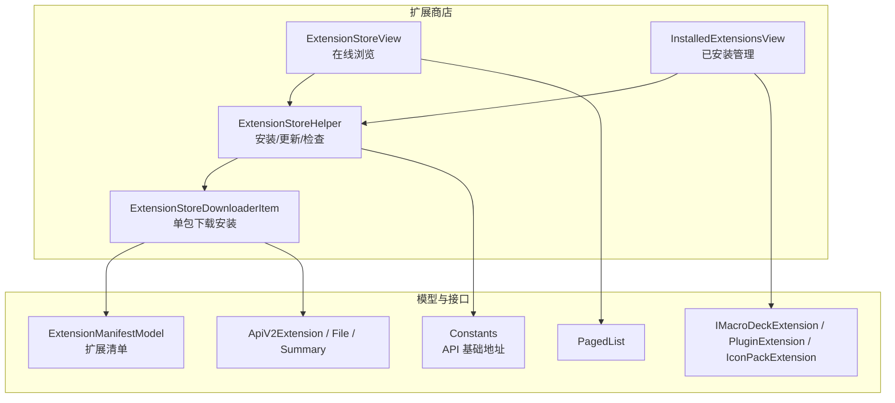
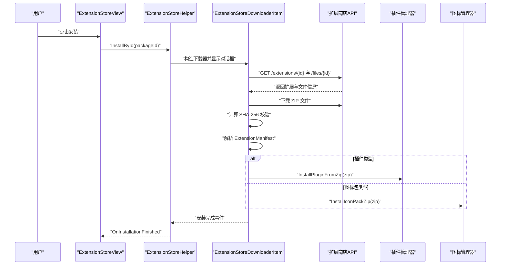
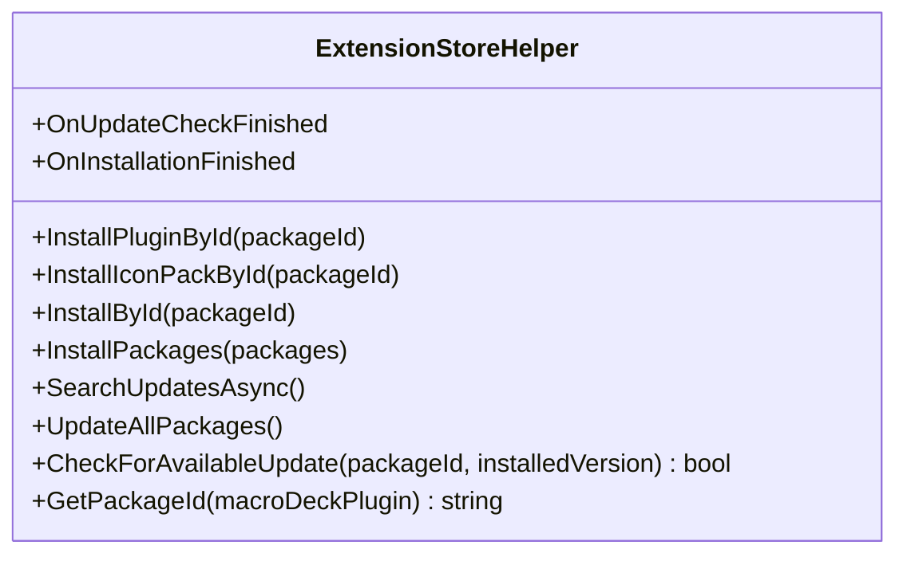
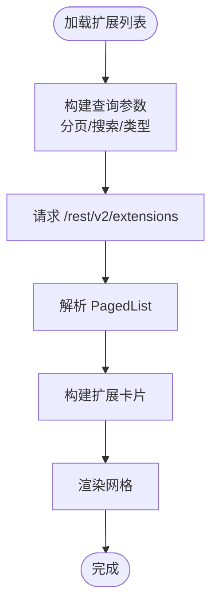
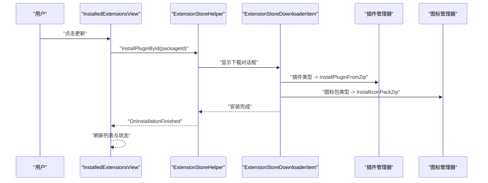
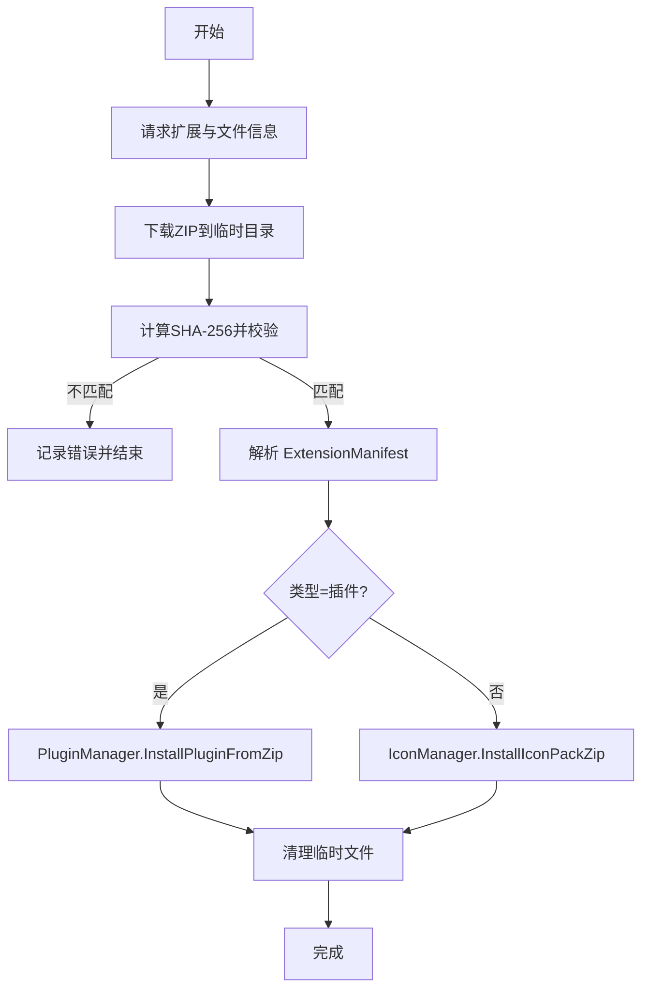
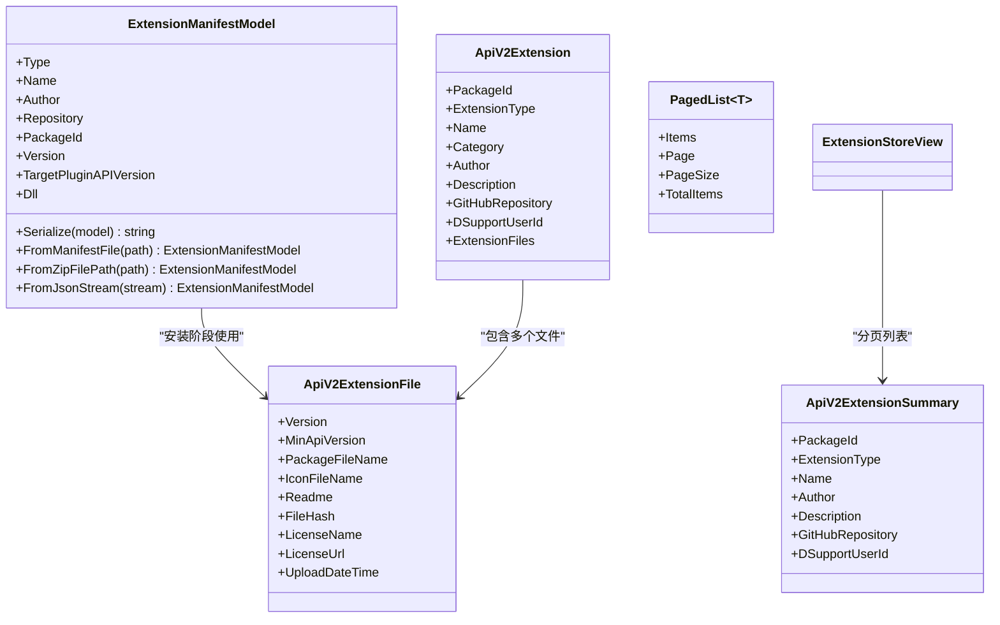
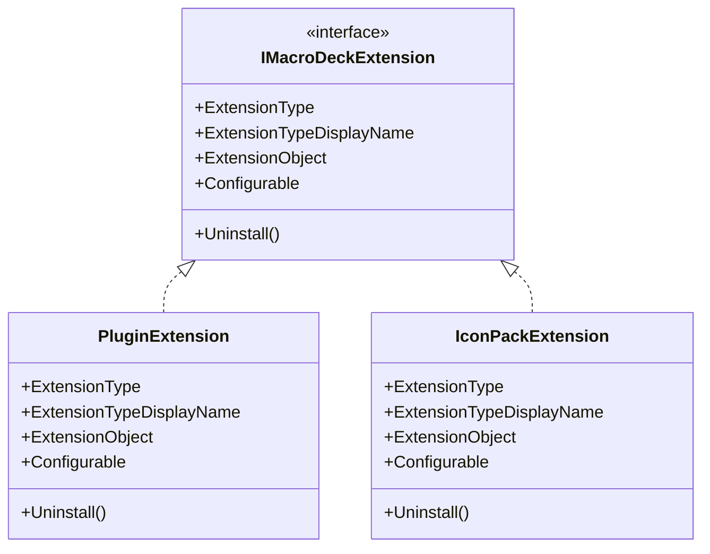
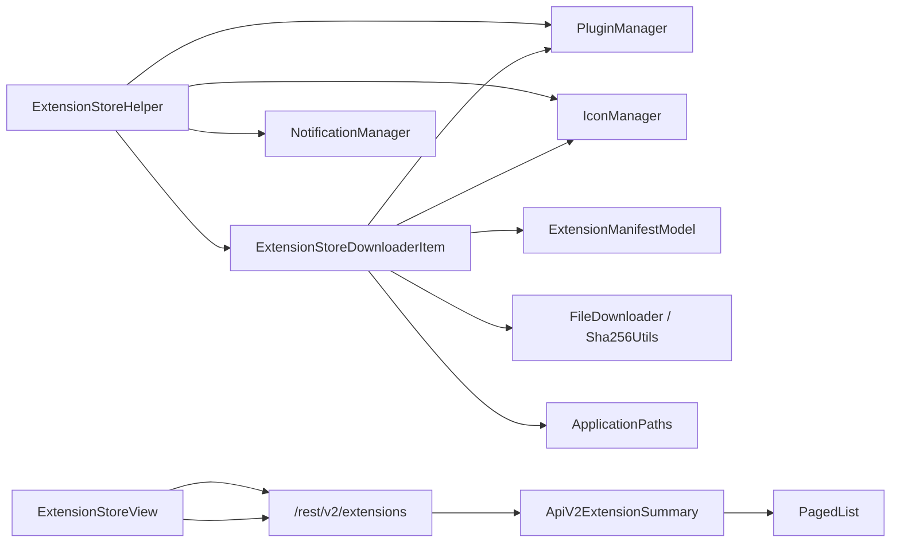
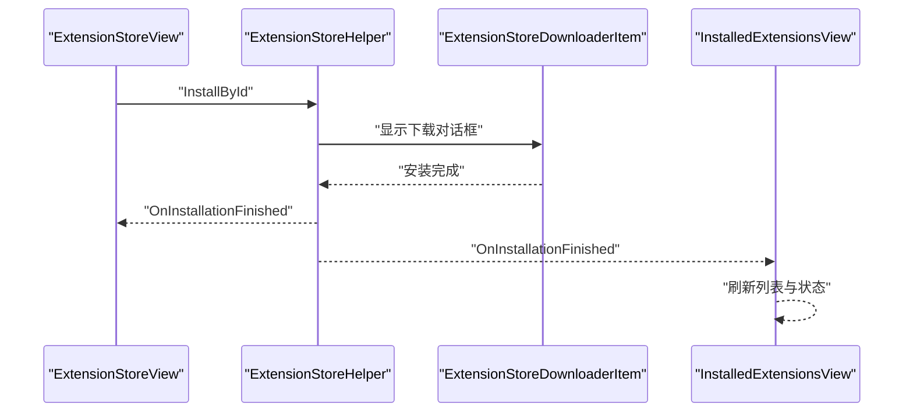

# 扩展商店

<cite>
**本文引用的文件**
- [ExtensionStoreHelper.cs](file://src/MacroDeck/ExtensionStore/ExtensionStoreHelper.cs)
- [ExtensionStoreView.cs](file://src/MacroDeck/GUI/CustomControls/ExtensionsView/ExtensionStoreView.cs)
- [InstalledExtensionsView.cs](file://src/MacroDeck/GUI/CustomControls/ExtensionsView/InstalledExtensionsView.cs)
- [ExtensionStoreDownloaderItem.cs](file://src/MacroDeck/GUI/CustomControls/ExtensionStoreDownloader/ExtensionStoreDownloaderItem.cs)
- [ExtensionManifestModel.cs](file://src/MacroDeck/Models/ExtensionManifestModel.cs)
- [ApiV2Extension.cs](file://src/MacroDeck/Models/ApiV2Extension.cs)
- [ApiV2ExtensionFile.cs](file://src/MacroDeck/Models/ApiV2ExtensionFile.cs)
- [ApiV2ExtensionSummary.cs](file://src/MacroDeck/Models/ApiV2ExtensionSummary.cs)
- [PagedList.cs](file://src/MacroDeck/Models/PagedList.cs)
- [ExtensionStoreExtensionModel.cs](file://src/MacroDeck/Models/ExtensionStoreExtensionModel.cs)
- [IMacroDeckExtension.cs](file://src/MacroDeck/Extension/IMacroDeckExtension.cs)
- [PluginExtension.cs](file://src/MacroDeck/Extension/PluginExtension.cs)
- [IconPackExtension.cs](file://src/MacroDeck/Extension/IconPackExtension.cs)
- [Constants.cs](file://src/MacroDeck/Constants.cs)
</cite>

## 目录
1. [简介](#简介)
2. [项目结构](#项目结构)
3. [核心组件](#核心组件)
4. [架构总览](#架构总览)
5. [详细组件分析](#详细组件分析)
6. [依赖关系分析](#依赖关系分析)
7. [性能考量](#性能考量)
8. [故障排查指南](#故障排查指南)
9. [结论](#结论)
10. [附录](#附录)

## 简介
本文件面向 Macro-Deck 扩展商店的使用者与开发者，系统化阐述扩展发现机制、安装流程与版本管理策略；详解 ExtensionStoreHelper 的实现与扩展商店的 UI 组成；记录扩展元数据结构、版本信息与依赖关系；解释在线发现与离线安装能力；提供扩展安装、更新与卸载的完整流程；说明扩展与插件系统的集成关系；并给出安全校验与签名机制的现状说明，以及面向开发者的发布指导与用户的扩展管理工具使用建议。

## 项目结构
扩展商店相关代码主要分布在以下模块：
- 扩展商店辅助与下载：ExtensionStoreHelper、ExtensionStoreDownloaderItem
- 扩展模型与清单：ExtensionManifestModel、ApiV2Extension、ApiV2ExtensionFile、ApiV2ExtensionSummary、PagedList、ExtensionStoreExtensionModel
- 扩展接口与包装：IMacroDeckExtension、PluginExtension、IconPackExtension
- 扩展商店 UI：ExtensionStoreView（在线浏览）、InstalledExtensionsView（已安装管理）
- 常量：Constants（扩展商店 API 基础地址）

图表来源
- [ExtensionStoreHelper.cs:17-195](file://src/MacroDeck/ExtensionStore/ExtensionStoreHelper.cs#L17-L195)
- [ExtensionStoreView.cs:14-233](file://src/MacroDeck/GUI/CustomControls/ExtensionsView/ExtensionStoreView.cs#L14-L233)
- [InstalledExtensionsView.cs:12-383](file://src/MacroDeck/GUI/CustomControls/ExtensionsView/InstalledExtensionsView.cs#L12-L383)
- [ExtensionStoreDownloaderItem.cs:16-242](file://src/MacroDeck/GUI/CustomControls/ExtensionStoreDownloader/ExtensionStoreDownloaderItem.cs#L16-L242)
- [ExtensionManifestModel.cs:8-61](file://src/MacroDeck/Models/ExtensionManifestModel.cs#L8-L61)
- [ApiV2Extension.cs:5-17](file://src/MacroDeck/Models/ApiV2Extension.cs#L5-L17)
- [ApiV2ExtensionFile.cs:3-15](file://src/MacroDeck/Models/ApiV2ExtensionFile.cs#L3-L15)
- [ApiV2ExtensionSummary.cs:5-15](file://src/MacroDeck/Models/ApiV2ExtensionSummary.cs#L5-L15)
- [PagedList.cs:3-10](file://src/MacroDeck/Models/PagedList.cs#L3-L10)
- [IMacroDeckExtension.cs:5-13](file://src/MacroDeck/Extension/IMacroDeckExtension.cs#L5-L13)
- [PluginExtension.cs:7-24](file://src/MacroDeck/Extension/PluginExtension.cs#L7-L24)
- [IconPackExtension.cs:7-23](file://src/MacroDeck/Extension/IconPackExtension.cs#L7-L23)
- [Constants.cs:3-7](file://src/MacroDeck/Constants.cs#L3-L7)

章节来源
- [ExtensionStoreHelper.cs:17-195](file://src/MacroDeck/ExtensionStore/ExtensionStoreHelper.cs#L17-L195)
- [ExtensionStoreView.cs:14-233](file://src/MacroDeck/GUI/CustomControls/ExtensionsView/ExtensionStoreView.cs#L14-L233)
- [InstalledExtensionsView.cs:12-383](file://src/MacroDeck/GUI/CustomControls/ExtensionsView/InstalledExtensionsView.cs#L12-L383)
- [ExtensionStoreDownloaderItem.cs:16-242](file://src/MacroDeck/GUI/CustomControls/ExtensionStoreDownloader/ExtensionStoreDownloaderItem.cs#L16-L242)
- [ExtensionManifestModel.cs:8-61](file://src/MacroDeck/Models/ExtensionManifestModel.cs#L8-L61)
- [ApiV2Extension.cs:5-17](file://src/MacroDeck/Models/ApiV2Extension.cs#L5-L17)
- [ApiV2ExtensionFile.cs:3-15](file://src/MacroDeck/Models/ApiV2ExtensionFile.cs#L3-L15)
- [ApiV2ExtensionSummary.cs:5-15](file://src/MacroDeck/Models/ApiV2ExtensionSummary.cs#L5-L15)
- [PagedList.cs:3-10](file://src/MacroDeck/Models/PagedList.cs#L3-L10)
- [IMacroDeckExtension.cs:5-13](file://src/MacroDeck/Extension/IMacroDeckExtension.cs#L5-L13)
- [PluginExtension.cs:7-24](file://src/MacroDeck/Extension/PluginExtension.cs#L7-L24)
- [IconPackExtension.cs:7-23](file://src/MacroDeck/Extension/IconPackExtension.cs#L7-L23)
- [Constants.cs:3-7](file://src/MacroDeck/Constants.cs#L3-L7)

## 核心组件
- 扩展商店辅助器（ExtensionStoreHelper）：负责扩展安装入口、批量更新检查、触发下载对话框、统一事件通知等。
- 在线扩展商店视图（ExtensionStoreView）：支持分页、搜索、筛选插件与图标包，并调用安装流程。
- 已安装扩展视图（InstalledExtensionsView）：展示已安装扩展状态、更新可用性、配置与卸载操作。
- 单包下载安装项（ExtensionStoreDownloaderItem）：拉取扩展元数据、下载 ZIP、校验哈希、解析清单并安装到对应子系统。
- 模型与清单（ExtensionManifestModel、ApiV2*）：定义扩展元数据、版本、目标 API、文件哈希、图标等。
- 扩展接口与包装（IMacroDeckExtension、PluginExtension、IconPackExtension）：抽象扩展对象，桥接 UI 与具体插件/图标包。
- 常量（Constants）：扩展商店 API 基础地址。

章节来源
- [ExtensionStoreHelper.cs:17-195](file://src/MacroDeck/ExtensionStore/ExtensionStoreHelper.cs#L17-L195)
- [ExtensionStoreView.cs:14-233](file://src/MacroDeck/GUI/CustomControls/ExtensionsView/ExtensionStoreView.cs#L14-L233)
- [InstalledExtensionsView.cs:12-383](file://src/MacroDeck/GUI/CustomControls/ExtensionsView/InstalledExtensionsView.cs#L12-L383)
- [ExtensionStoreDownloaderItem.cs:16-242](file://src/MacroDeck/GUI/CustomControls/ExtensionStoreDownloader/ExtensionStoreDownloaderItem.cs#L16-L242)
- [ExtensionManifestModel.cs:8-61](file://src/MacroDeck/Models/ExtensionManifestModel.cs#L8-L61)
- [ApiV2Extension.cs:5-17](file://src/MacroDeck/Models/ApiV2Extension.cs#L5-L17)
- [ApiV2ExtensionFile.cs:3-15](file://src/MacroDeck/Models/ApiV2ExtensionFile.cs#L3-L15)
- [ApiV2ExtensionSummary.cs:5-15](file://src/MacroDeck/Models/ApiV2ExtensionSummary.cs#L5-L15)
- [IMacroDeckExtension.cs:5-13](file://src/MacroDeck/Extension/IMacroDeckExtension.cs#L5-L13)
- [PluginExtension.cs:7-24](file://src/MacroDeck/Extension/PluginExtension.cs#L7-L24)
- [IconPackExtension.cs:7-23](file://src/MacroDeck/Extension/IconPackExtension.cs#L7-L23)
- [Constants.cs:3-7](file://src/MacroDeck/Constants.cs#L3-L7)

## 架构总览
扩展商店采用“UI 视图 + 辅助器 + 下载安装器 + 模型”的分层设计：
- UI 层：ExtensionStoreView 负责在线浏览与搜索；InstalledExtensionsView 负责本地扩展管理。
- 控制层：ExtensionStoreHelper 提供安装、更新检查、批量更新等控制逻辑。
- 数据层：通过 Constants 中的 API 基础地址访问扩展商店 REST 接口，返回 ApiV2* 结构。
- 安装层：ExtensionStoreDownloaderItem 负责下载 ZIP、校验 SHA-256、解析 ExtensionManifest 并调用插件或图标包安装器。

图表来源
- [ExtensionStoreView.cs:170-180](file://src/MacroDeck/GUI/CustomControls/ExtensionsView/ExtensionStoreView.cs#L170-L180)
- [ExtensionStoreHelper.cs:31-64](file://src/MacroDeck/ExtensionStore/ExtensionStoreHelper.cs#L31-L64)
- [ExtensionStoreDownloaderItem.cs:64-225](file://src/MacroDeck/GUI/CustomControls/ExtensionStoreDownloader/ExtensionStoreDownloaderItem.cs#L64-L225)
- [ExtensionManifestModel.cs:38-46](file://src/MacroDeck/Models/ExtensionManifestModel.cs#L38-L46)
- [Constants.cs:5](file://src/MacroDeck/Constants.cs#L5)

## 详细组件分析

### 扩展商店辅助器（ExtensionStoreHelper）
职责与行为：
- 安装入口：按类型提供 InstallPluginById、InstallIconPackById、InstallById；内部统一走 InstallPackages。
- 批量安装：InstallPackages 创建下载对话框并显示，完成后触发 OnInstallationFinished。
- 更新检查：SearchUpdatesAsync 并行检查插件与图标包更新，聚合结果后推送系统通知，支持一键更新。
- 版本检查：CheckForAvailableUpdate 通过 API 查询最新文件版本并与当前版本比较。
- 包 ID 获取：GetPackageId 从插件目录名提取包 ID。

图表来源
- [ExtensionStoreHelper.cs:31-187](file://src/MacroDeck/ExtensionStore/ExtensionStoreHelper.cs#L31-L187)

章节来源
- [ExtensionStoreHelper.cs:31-187](file://src/MacroDeck/ExtensionStore/ExtensionStoreHelper.cs#L31-L187)

### 在线扩展商店视图（ExtensionStoreView）
功能与交互：
- 分页与搜索：支持分页控件与防抖搜索，动态加载扩展列表。
- 类型筛选：可切换显示插件与图标包。
- 列表构建：根据 ApiV2ExtensionSummary 构建卡片，标注类型徽章、描述、仓库链接。
- 安装流程：点击安装时调用 ExtensionStoreHelper.InstallById，随后刷新列表。
- 图标缓存：通过 ExtensionIconCache 缓存商店图标，避免重复下载。

图表来源
- [ExtensionStoreView.cs:66-109](file://src/MacroDeck/GUI/CustomControls/ExtensionsView/ExtensionStoreView.cs#L66-L109)
- [ExtensionStoreView.cs:111-157](file://src/MacroDeck/GUI/CustomControls/ExtensionsView/ExtensionStoreView.cs#L111-L157)
- [ExtensionStoreView.cs:170-180](file://src/MacroDeck/GUI/CustomControls/ExtensionsView/ExtensionStoreView.cs#L170-L180)

章节来源
- [ExtensionStoreView.cs:26-233](file://src/MacroDeck/GUI/CustomControls/ExtensionsView/ExtensionStoreView.cs#L26-L233)

### 已安装扩展视图（InstalledExtensionsView）
功能与交互：
- 列表展示：遍历已安装插件与图标包，生成卡片并标注状态（启用/禁用/待重启/更新可用）。
- 过滤搜索：支持按名称过滤。
- 动作按钮：配置、更新、卸载；更新时调用 ExtensionStoreHelper 完成安装流程。
- 更新检查：支持“检查更新”与“一键全部更新”，并监听 ExtensionStoreHelper 的完成事件刷新列表。

图表来源
- [InstalledExtensionsView.cs:213-226](file://src/MacroDeck/GUI/CustomControls/ExtensionsView/InstalledExtensionsView.cs#L213-L226)
- [InstalledExtensionsView.cs:334-352](file://src/MacroDeck/GUI/CustomControls/ExtensionsView/InstalledExtensionsView.cs#L334-L352)
- [ExtensionStoreHelper.cs:133-160](file://src/MacroDeck/ExtensionStore/ExtensionStoreHelper.cs#L133-L160)

章节来源
- [InstalledExtensionsView.cs:37-383](file://src/MacroDeck/GUI/CustomControls/ExtensionsView/InstalledExtensionsView.cs#L37-L383)

### 单包下载安装器（ExtensionStoreDownloaderItem）
流程与校验：
- 元数据获取：先请求扩展详情与文件信息，再下载 ZIP。
- 下载进度：实时更新进度条与速度文本。
- 安全校验：下载完成后计算 SHA-256，与服务器提供的哈希对比。
- 清单解析：从 ZIP 中读取 ExtensionManifest，判断类型并调用相应安装器。
- 清理资源：删除临时目录与 ZIP 文件。

图表来源
- [ExtensionStoreDownloaderItem.cs:64-225](file://src/MacroDeck/GUI/CustomControls/ExtensionStoreDownloader/ExtensionStoreDownloaderItem.cs#L64-L225)
- [ExtensionManifestModel.cs:38-46](file://src/MacroDeck/Models/ExtensionManifestModel.cs#L38-L46)

章节来源
- [ExtensionStoreDownloaderItem.cs:64-225](file://src/MacroDeck/GUI/CustomControls/ExtensionStoreDownloader/ExtensionStoreDownloaderItem.cs#L64-L225)

### 扩展元数据与清单模型
- ExtensionManifestModel：扩展清单，包含类型、名称、作者、仓库、包 ID、版本、目标 API、主 DLL 等字段，支持从文件或 ZIP 流反序列化。
- ApiV2Extension / ApiV2ExtensionFile / ApiV2ExtensionSummary：扩展商店 API 返回的扩展摘要、文件信息与详细信息。
- PagedList：分页容器，包含 Items、Page、PageSize、TotalItems。
- ExtensionStoreExtensionModel：用于扩展商店内部使用的简化模型（含 MD5 字段），便于 UI 或特定场景使用。

图表来源
- [ExtensionManifestModel.cs:8-61](file://src/MacroDeck/Models/ExtensionManifestModel.cs#L8-L61)
- [ApiV2Extension.cs:5-17](file://src/MacroDeck/Models/ApiV2Extension.cs#L5-L17)
- [ApiV2ExtensionFile.cs:3-15](file://src/MacroDeck/Models/ApiV2ExtensionFile.cs#L3-L15)
- [ApiV2ExtensionSummary.cs:5-15](file://src/MacroDeck/Models/ApiV2ExtensionSummary.cs#L5-L15)
- [PagedList.cs:3-10](file://src/MacroDeck/Models/PagedList.cs#L3-L10)
- [ExtensionStoreView.cs:84-99](file://src/MacroDeck/GUI/CustomControls/ExtensionsView/ExtensionStoreView.cs#L84-L99)

章节来源
- [ExtensionManifestModel.cs:8-61](file://src/MacroDeck/Models/ExtensionManifestModel.cs#L8-L61)
- [ApiV2Extension.cs:5-17](file://src/MacroDeck/Models/ApiV2Extension.cs#L5-L17)
- [ApiV2ExtensionFile.cs:3-15](file://src/MacroDeck/Models/ApiV2ExtensionFile.cs#L3-L15)
- [ApiV2ExtensionSummary.cs:5-15](file://src/MacroDeck/Models/ApiV2ExtensionSummary.cs#L5-L15)
- [PagedList.cs:3-10](file://src/MacroDeck/Models/PagedList.cs#L3-L10)
- [ExtensionStoreView.cs:84-99](file://src/MacroDeck/GUI/CustomControls/ExtensionsView/ExtensionStoreView.cs#L84-L99)

### 扩展接口与包装
- IMacroDeckExtension：统一扩展对象接口，暴露类型、显示名、对象实例与是否可配置。
- PluginExtension / IconPackExtension：分别包装 MacroDeckPlugin 与 IconPack，实现 IMacroDeckExtension，用于 UI 卡片与动作按钮。

图表来源
- [IMacroDeckExtension.cs:5-13](file://src/MacroDeck/Extension/IMacroDeckExtension.cs#L5-L13)
- [PluginExtension.cs:7-24](file://src/MacroDeck/Extension/PluginExtension.cs#L7-L24)
- [IconPackExtension.cs:7-23](file://src/MacroDeck/Extension/IconPackExtension.cs#L7-L23)

章节来源
- [IMacroDeckExtension.cs:5-13](file://src/MacroDeck/Extension/IMacroDeckExtension.cs#L5-L13)
- [PluginExtension.cs:7-24](file://src/MacroDeck/Extension/PluginExtension.cs#L7-L24)
- [IconPackExtension.cs:7-23](file://src/MacroDeck/Extension/IconPackExtension.cs#L7-L23)

### 常量与 API 基址
- Constants.ExtensionStoreApiBaseUrl：扩展商店 REST API 基础地址，所有商店请求均基于此前缀。

章节来源
- [Constants.cs:5](file://src/MacroDeck/Constants.cs#L5)

## 依赖关系分析
- ExtensionStoreView 依赖 ApiV2ExtensionSummary 与 PagedList，通过 Constants 基址调用 /rest/v2/extensions。
- ExtensionStoreHelper 依赖 ExtensionStoreDownloaderItem、PluginManager、IconManager、NotificationManager、LanguageManager 等。
- ExtensionStoreDownloaderItem 依赖 ExtensionManifestModel、PluginManager、IconManager、Sha256Utils、FileDownloader、ApplicationPaths 等。
- IMacroDeckExtension 及其包装类用于桥接 UI 与具体扩展对象。

图表来源
- [ExtensionStoreView.cs:74-85](file://src/MacroDeck/GUI/CustomControls/ExtensionsView/ExtensionStoreView.cs#L74-L85)
- [ExtensionStoreHelper.cs:48-64](file://src/MacroDeck/ExtensionStore/ExtensionStoreHelper.cs#L48-L64)
- [ExtensionStoreDownloaderItem.cs:64-114](file://src/MacroDeck/GUI/CustomControls/ExtensionStoreDownloader/ExtensionStoreDownloaderItem.cs#L64-L114)
- [ExtensionManifestModel.cs:38-46](file://src/MacroDeck/Models/ExtensionManifestModel.cs#L38-L46)

章节来源
- [ExtensionStoreView.cs:74-85](file://src/MacroDeck/GUI/CustomControls/ExtensionsView/ExtensionStoreView.cs#L74-L85)
- [ExtensionStoreHelper.cs:48-64](file://src/MacroDeck/ExtensionStore/ExtensionStoreHelper.cs#L48-L64)
- [ExtensionStoreDownloaderItem.cs:64-114](file://src/MacroDeck/GUI/CustomControls/ExtensionStoreDownloader/ExtensionStoreDownloaderItem.cs#L64-L114)
- [ExtensionManifestModel.cs:38-46](file://src/MacroDeck/Models/ExtensionManifestModel.cs#L38-L46)

## 性能考量
- 搜索防抖：ExtensionStoreView 使用定时器对搜索输入进行防抖，降低网络请求频率。
- 分页加载：默认每页 20 条，结合 TotalItems 计算总页数，避免一次性加载过多数据。
- 图标缓存：ExtensionIconCache 避免重复下载商店图标，提升 UI 响应速度。
- 异步下载与进度：ExtensionStoreDownloaderItem 使用进度回调与取消令牌，保证 UI 不阻塞。
- 并行更新检查：ExtensionStoreHelper 并行检查插件与图标包更新，缩短等待时间。

章节来源
- [ExtensionStoreView.cs:33-64](file://src/MacroDeck/GUI/CustomControls/ExtensionsView/ExtensionStoreView.cs#L33-L64)
- [ExtensionStoreView.cs:91-94](file://src/MacroDeck/GUI/CustomControls/ExtensionsView/ExtensionStoreView.cs#L91-L94)
- [ExtensionStoreView.cs:191-214](file://src/MacroDeck/GUI/CustomControls/ExtensionsView/ExtensionStoreView.cs#L191-L214)
- [ExtensionStoreDownloaderItem.cs:116-130](file://src/MacroDeck/GUI/CustomControls/ExtensionStoreDownloader/ExtensionStoreDownloaderItem.cs#L116-L130)
- [ExtensionStoreHelper.cs:81-131](file://src/MacroDeck/ExtensionStore/ExtensionStoreHelper.cs#L81-L131)

## 故障排查指南
- 安装失败（哈希不匹配）：检查日志中 SHA-256 对比失败信息，确认网络下载完整性。
- 下载中断：查看取消令牌与进度 UI，确认是否被用户取消或页面切换导致请求终止。
- 无法连接商店：确认 Constants 中的 API 基址可达，检查网络代理与防火墙设置。
- 更新检查无结果：确保已安装扩展在商店中有对应包 ID 且未被隐藏；检查 ExtensionStoreHelper 的更新检查逻辑。
- 卸载后仍残留：确认插件管理器或图标管理器的删除流程执行成功，必要时手动清理临时目录。

章节来源
- [ExtensionStoreDownloaderItem.cs:142-152](file://src/MacroDeck/GUI/CustomControls/ExtensionStoreDownloader/ExtensionStoreDownloaderItem.cs#L142-L152)
- [ExtensionStoreDownloaderItem.cs:51-62](file://src/MacroDeck/GUI/CustomControls/ExtensionStoreDownloader/ExtensionStoreDownloaderItem.cs#L51-L62)
- [ExtensionStoreHelper.cs:71-131](file://src/MacroDeck/ExtensionStore/ExtensionStoreHelper.cs#L71-L131)

## 结论
扩展商店以清晰的分层架构实现了从在线发现、安装、更新到本地管理的完整闭环。通过统一的清单模型与安全校验机制，保障了扩展安装的可靠性与一致性。UI 层提供了良好的用户体验，辅以搜索、分页与状态提示。开发者可依据清单模型与目标 API 版本规范发布扩展；用户可通过商店便捷地管理扩展生命周期。

## 附录

### 扩展安装、更新与卸载流程总览
- 在线安装：ExtensionStoreView → ExtensionStoreHelper.InstallById → ExtensionStoreDownloaderItem 下载与安装 → 刷新 UI。
- 更新检查：ExtensionStoreHelper.SearchUpdatesAsync → 通知中心提示 → InstalledExtensionsView 一键更新。
- 卸载：InstalledExtensionsView → 插件管理器或图标管理器删除 → 提示重启或刷新。

图表来源
- [ExtensionStoreView.cs:170-180](file://src/MacroDeck/GUI/CustomControls/ExtensionsView/ExtensionStoreView.cs#L170-L180)
- [ExtensionStoreHelper.cs:31-64](file://src/MacroDeck/ExtensionStore/ExtensionStoreHelper.cs#L31-L64)
- [InstalledExtensionsView.cs:334-352](file://src/MacroDeck/GUI/CustomControls/ExtensionsView/InstalledExtensionsView.cs#L334-L352)

### 扩展与插件系统的集成关系
- 插件扩展：由 ExtensionManifestModel.Type 标识为 Plugin，安装时调用 PluginManager.InstallPluginFromZip。
- 图标包扩展：由 ExtensionManifestModel.Type 标识为 IconPack，安装时调用 IconManager.InstallIconPackZip。
- UI 显示：InstalledExtensionsView 将扩展包装为 IMacroDeckExtension，统一呈现状态与动作。

章节来源
- [ExtensionStoreDownloaderItem.cs:175-203](file://src/MacroDeck/GUI/CustomControls/ExtensionStoreDownloader/ExtensionStoreDownloaderItem.cs#L175-L203)
- [InstalledExtensionsView.cs:80-118](file://src/MacroDeck/GUI/CustomControls/ExtensionsView/InstalledExtensionsView.cs#L80-L118)
- [PluginExtension.cs:7-24](file://src/MacroDeck/Extension/PluginExtension.cs#L7-L24)
- [IconPackExtension.cs:7-23](file://src/MacroDeck/Extension/IconPackExtension.cs#L7-L23)

### 扩展商店的安全验证与签名机制
- 文件完整性：ExtensionStoreDownloaderItem 在下载完成后计算 SHA-256 并与服务器提供的哈希进行比对，不一致则终止安装。
- 未发现其他显式签名验证流程（如 PEM/证书链签名校验）。

章节来源
- [ExtensionStoreDownloaderItem.cs:142-152](file://src/MacroDeck/GUI/CustomControls/ExtensionStoreDownloader/ExtensionStoreDownloaderItem.cs#L142-L152)

### 开发者发布指导
- 清单规范：确保 ExtensionManifestModel 字段完整，尤其是 type、name、author、packageId、version、target-plugin-api-version、dll。
- 目标 API：遵守 target-plugin-api-version，避免与宿主版本不兼容。
- 文件与哈希：上传 ZIP 并确保服务器提供正确的 fileHash，以便客户端进行完整性校验。
- 图标与描述：提供清晰的图标与描述，提升商店展示质量。
- 仓库与许可：填写 GitHub 仓库与许可信息，便于用户溯源与合规使用。

章节来源
- [ExtensionManifestModel.cs:10-25](file://src/MacroDeck/Models/ExtensionManifestModel.cs#L10-L25)
- [ApiV2ExtensionFile.cs:5-11](file://src/MacroDeck/Models/ApiV2ExtensionFile.cs#L5-L11)
- [ExtensionStoreView.cs:111-157](file://src/MacroDeck/GUI/CustomControls/ExtensionsView/ExtensionStoreView.cs#L111-L157)