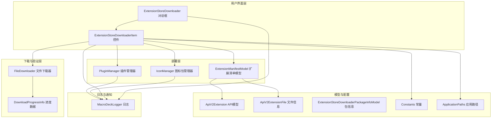
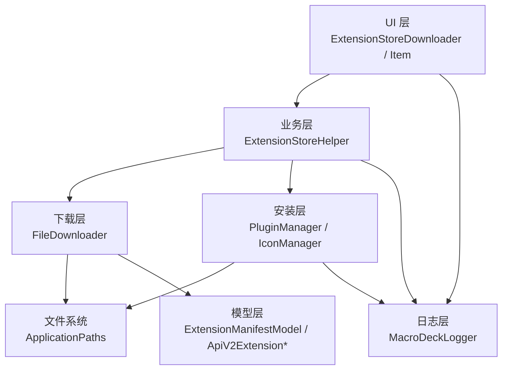
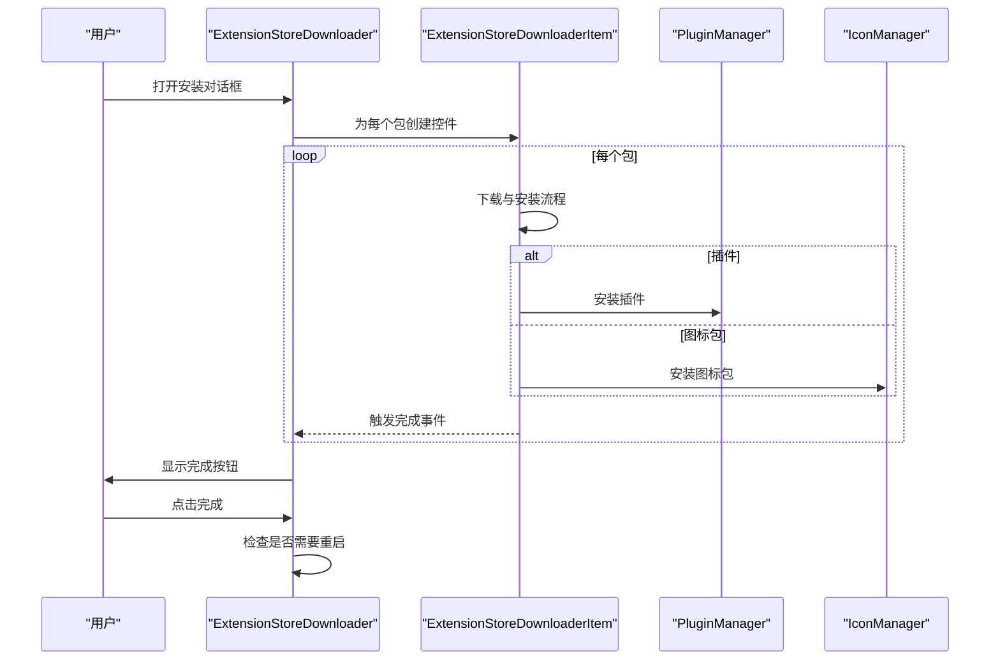
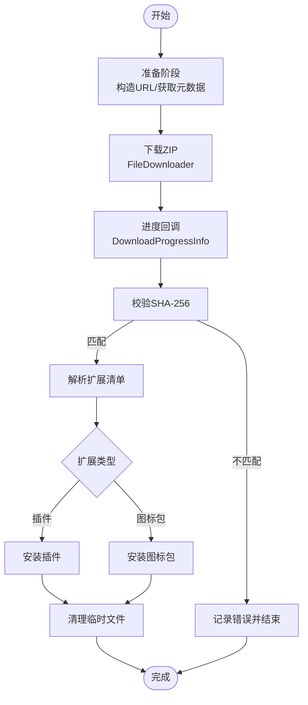
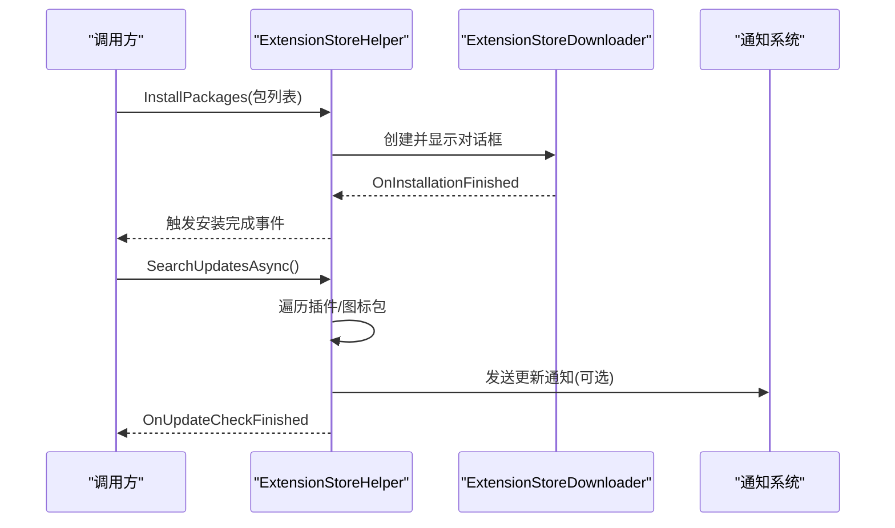
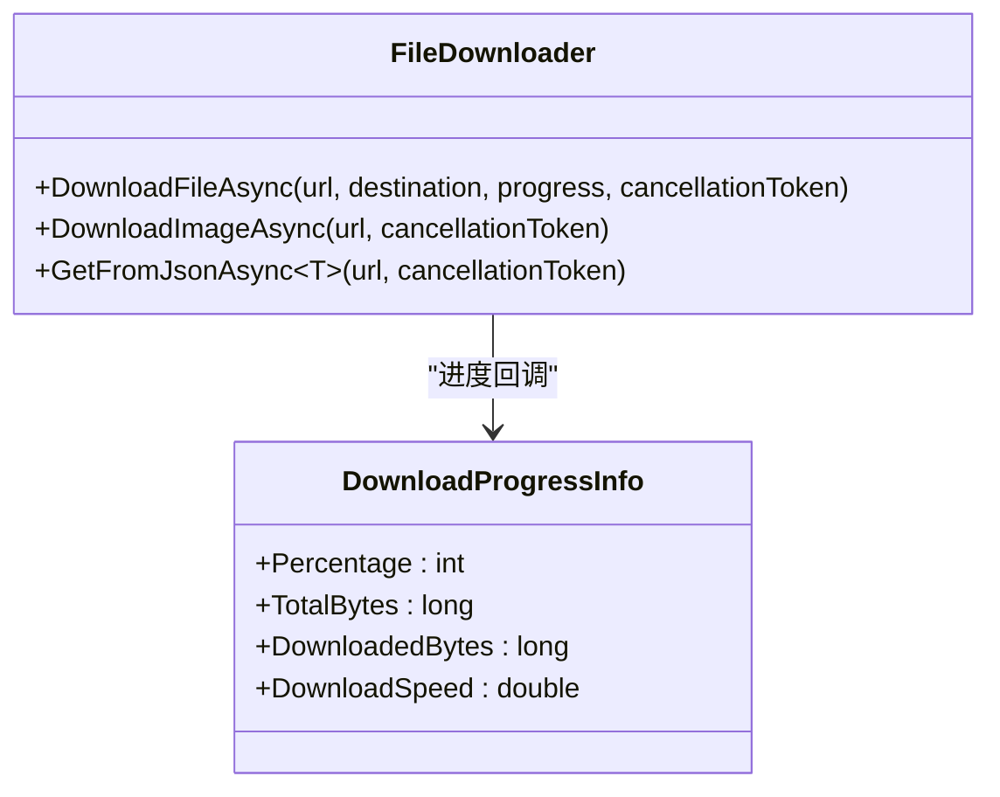
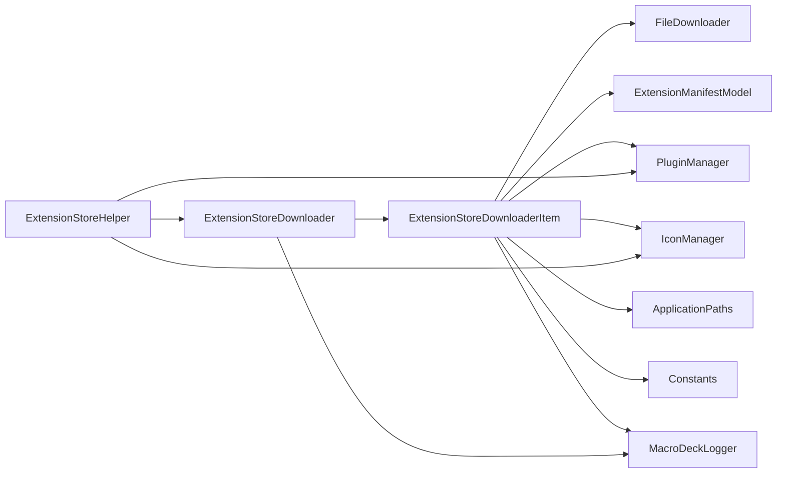
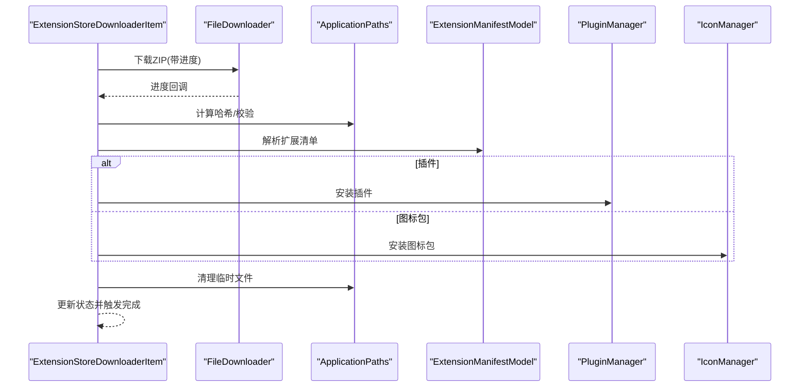

# 扩展安装管理

<cite>
**本文档引用的文件**
- [ExtensionStoreDownloaderItem.cs](file://src/MacroDeck/GUI/CustomControls/ExtensionStoreDownloader/ExtensionStoreDownloaderItem.cs)
- [ExtensionStoreDownloader.cs](file://src/MacroDeck/GUI/Dialogs/ExtensionStoreDownloader.cs)
- [ExtensionStoreHelper.cs](file://src/MacroDeck/ExtensionStore/ExtensionStoreHelper.cs)
- [FileDownloader.cs](file://src/MacroDeck/Utils/FileDownloader.cs)
- [ApplicationPaths.cs](file://src/MacroDeck/StartupConfig/ApplicationPaths.cs)
- [ExtensionManifestModel.cs](file://src/MacroDeck/Models/ExtensionManifestModel.cs)
- [ApiV2Extension.cs](file://src/MacroDeck/Models/ApiV2Extension.cs)
- [ApiV2ExtensionFile.cs](file://src/MacroDeck/Models/ApiV2ExtensionFile.cs)
- [ExtensionStoreDownloaderPackageInfoModel.cs](file://src/MacroDeck/Models/ExtensionStoreDownloaderPackageInfoModel.cs)
- [Constants.cs](file://src/MacroDeck/Constants.cs)
- [DownloadProgressInfo.cs](file://src/MacroDeck/DataTypes/FileDownloader/DownloadProgressInfo.cs)
- [MacroDeckLogger.cs](file://src/MacroDeck/Logging/MacroDeckLogger.cs)
- [IconManager.cs](file://src/MacroDeck/Icons/IconManager.cs)
- [PluginManager.cs](file://src/MacroDeck/Plugins/PluginManager.cs)
</cite>

## 目录
1. [简介](#简介)
2. [项目结构](#项目结构)
3. [核心组件](#核心组件)
4. [架构概览](#架构概览)
5. [详细组件分析](#详细组件分析)
6. [依赖关系分析](#依赖关系分析)
7. [性能考虑](#性能考虑)
8. [故障排除指南](#故障排除指南)
9. [结论](#结论)
10. [附录](#附录)

## 简介
本文件详细阐述Macro-Deck扩展安装管理系统，涵盖从扩展商店下载、安装包验证到部署的完整流程。文档重点解析ExtensionStoreDownloader的实现与用户界面交互，说明下载、校验、部署各阶段的技术细节，记录进度跟踪与用户反馈机制，解释失败处理与回滚策略，提供批量安装与更新管理能力，包含权限检查与系统兼容性验证，记录日志与调试信息，并说明安装完成后的通知与界面刷新。

## 项目结构
扩展安装管理涉及以下关键模块：
- 用户界面层：对话框与控件，负责展示安装进度与状态反馈
- 下载与验证层：统一的文件下载器与哈希校验
- 部署层：插件与图标包的安装管理
- 模型与配置：扩展清单、API模型、应用路径等
- 日志与通知：结构化日志记录与系统通知

**图表来源**
- [ExtensionStoreDownloader.cs:11-83](file://src/MacroDeck/GUI/Dialogs/ExtensionStoreDownloader.cs#L11-L83)
- [ExtensionStoreDownloaderItem.cs:16-242](file://src/MacroDeck/GUI/CustomControls/ExtensionStoreDownloader/ExtensionStoreDownloaderItem.cs#L16-L242)
- [FileDownloader.cs:9-84](file://src/MacroDeck/Utils/FileDownloader.cs#L9-L84)
- [ExtensionManifestModel.cs:8-61](file://src/MacroDeck/Models/ExtensionManifestModel.cs#L8-L61)
- [PluginManager.cs](file://src/MacroDeck/Plugins/PluginManager.cs)
- [IconManager.cs](file://src/MacroDeck/Icons/IconManager.cs)
- [ApiV2Extension.cs:5-17](file://src/MacroDeck/Models/ApiV2Extension.cs#L5-L17)
- [ApiV2ExtensionFile.cs:3-15](file://src/MacroDeck/Models/ApiV2ExtensionFile.cs#L3-L15)
- [ExtensionStoreDownloaderPackageInfoModel.cs:5-10](file://src/MacroDeck/Models/ExtensionStoreDownloaderPackageInfoModel.cs#L5-L10)
- [Constants.cs:3-7](file://src/MacroDeck/Constants.cs#L3-L7)
- [ApplicationPaths.cs:6-143](file://src/MacroDeck/StartupConfig/ApplicationPaths.cs#L6-L143)
- [MacroDeckLogger.cs:11-361](file://src/MacroDeck/Logging/MacroDeckLogger.cs#L11-L361)

**章节来源**
- [ExtensionStoreDownloader.cs:11-83](file://src/MacroDeck/GUI/Dialogs/ExtensionStoreDownloader.cs#L11-L83)
- [ExtensionStoreDownloaderItem.cs:16-242](file://src/MacroDeck/GUI/CustomControls/ExtensionStoreDownloader/ExtensionStoreDownloaderItem.cs#L16-L242)
- [FileDownloader.cs:9-84](file://src/MacroDeck/Utils/FileDownloader.cs#L9-L84)
- [ExtensionManifestModel.cs:8-61](file://src/MacroDeck/Models/ExtensionManifestModel.cs#L8-L61)
- [PluginManager.cs](file://src/MacroDeck/Plugins/PluginManager.cs)
- [IconManager.cs](file://src/MacroDeck/Icons/IconManager.cs)
- [ApiV2Extension.cs:5-17](file://src/MacroDeck/Models/ApiV2Extension.cs#L5-L17)
- [ApiV2ExtensionFile.cs:3-15](file://src/MacroDeck/Models/ApiV2ExtensionFile.cs#L3-L15)
- [ExtensionStoreDownloaderPackageInfoModel.cs:5-10](file://src/MacroDeck/Models/ExtensionStoreDownloaderPackageInfoModel.cs#L5-L10)
- [Constants.cs:3-7](file://src/MacroDeck/Constants.cs#L3-L7)
- [ApplicationPaths.cs:6-143](file://src/MacroDeck/StartupConfig/ApplicationPaths.cs#L6-L143)
- [MacroDeckLogger.cs:11-361](file://src/MacroDeck/Logging/MacroDeckLogger.cs#L11-L361)

## 核心组件
- 扩展商店助手（ExtensionStoreHelper）：提供安装入口、批量更新检查与触发、安装完成事件通知
- 扩展商店下载器（ExtensionStoreDownloader）：对话框容器，管理多个安装项的并发执行与完成统计
- 下载项控件（ExtensionStoreDownloaderItem）：单个扩展的下载、校验与安装执行单元
- 文件下载器（FileDownloader）：通用HTTP下载器，支持进度回调与取消令牌
- 扩展清单模型（ExtensionManifestModel）：解析ZIP内的扩展清单，识别类型与版本
- 插件管理器（PluginManager）：从ZIP安装插件
- 图标包管理器（IconManager）：从ZIP安装图标包
- 应用路径（ApplicationPaths）：提供临时目录、插件目录、图标包目录等路径
- 日志系统（MacroDeckLogger）：统一的日志记录与级别控制

**章节来源**
- [ExtensionStoreHelper.cs:17-195](file://src/MacroDeck/ExtensionStore/ExtensionStoreHelper.cs#L17-L195)
- [ExtensionStoreDownloader.cs:11-83](file://src/MacroDeck/GUI/Dialogs/ExtensionStoreDownloader.cs#L11-L83)
- [ExtensionStoreDownloaderItem.cs:16-242](file://src/MacroDeck/GUI/CustomControls/ExtensionStoreDownloader/ExtensionStoreDownloaderItem.cs#L16-L242)
- [FileDownloader.cs:9-84](file://src/MacroDeck/Utils/FileDownloader.cs#L9-L84)
- [ExtensionManifestModel.cs:8-61](file://src/MacroDeck/Models/ExtensionManifestModel.cs#L8-L61)
- [PluginManager.cs](file://src/MacroDeck/Plugins/PluginManager.cs)
- [IconManager.cs](file://src/MacroDeck/Icons/IconManager.cs)
- [ApplicationPaths.cs:6-143](file://src/MacroDeck/StartupConfig/ApplicationPaths.cs#L6-L143)
- [MacroDeckLogger.cs:11-361](file://src/MacroDeck/Logging/MacroDeckLogger.cs#L11-L361)

## 架构概览
扩展安装管理采用分层架构：
- 表现层：对话框与控件负责用户交互与进度展示
- 业务层：扩展商店助手协调安装流程与批量更新
- 数据访问层：文件下载器封装HTTP请求与流式写入
- 部署层：根据扩展类型调用插件或图标包安装器
- 支撑层：模型定义、常量、应用路径与日志系统

**图表来源**
- [ExtensionStoreDownloader.cs:11-83](file://src/MacroDeck/GUI/Dialogs/ExtensionStoreDownloader.cs#L11-L83)
- [ExtensionStoreDownloaderItem.cs:16-242](file://src/MacroDeck/GUI/CustomControls/ExtensionStoreDownloader/ExtensionStoreDownloaderItem.cs#L16-L242)
- [ExtensionStoreHelper.cs:17-195](file://src/MacroDeck/ExtensionStore/ExtensionStoreHelper.cs#L17-L195)
- [FileDownloader.cs:9-84](file://src/MacroDeck/Utils/FileDownloader.cs#L9-L84)
- [ApplicationPaths.cs:6-143](file://src/MacroDeck/StartupConfig/ApplicationPaths.cs#L6-L143)
- [ExtensionManifestModel.cs:8-61](file://src/MacroDeck/Models/ExtensionManifestModel.cs#L8-L61)
- [PluginManager.cs](file://src/MacroDeck/Plugins/PluginManager.cs)
- [IconManager.cs](file://src/MacroDeck/Icons/IconManager.cs)
- [MacroDeckLogger.cs:11-361](file://src/MacroDeck/Logging/MacroDeckLogger.cs#L11-L361)

## 详细组件分析

### 组件A：扩展商店下载器（ExtensionStoreDownloader）
- 职责：作为对话框容器，接收包列表，动态创建下载项控件，跟踪安装数量，完成时显示“完成”按钮并触发重启检查
- 关键点：
  - 并发安装：每个包创建一个下载项控件，通过事件回调统计完成数
  - 界面禁用：加载时禁用主窗口，关闭时恢复
  - 完成逻辑：全部完成后记录日志并显示完成提示

**图表来源**
- [ExtensionStoreDownloader.cs:39-83](file://src/MacroDeck/GUI/Dialogs/ExtensionStoreDownloader.cs#L39-L83)
- [ExtensionStoreDownloaderItem.cs:132-225](file://src/MacroDeck/GUI/CustomControls/ExtensionStoreDownloader/ExtensionStoreDownloaderItem.cs#L132-L225)
- [PluginManager.cs](file://src/MacroDeck/Plugins/PluginManager.cs)
- [IconManager.cs](file://src/MacroDeck/Icons/IconManager.cs)

**章节来源**
- [ExtensionStoreDownloader.cs:11-83](file://src/MacroDeck/GUI/Dialogs/ExtensionStoreDownloader.cs#L11-L83)

### 组件B：下载项控件（ExtensionStoreDownloaderItem）
- 职责：单个扩展的下载、进度更新、校验与安装
- 流程：
  - 准备阶段：构造URL，获取扩展与文件元数据
  - 下载阶段：使用文件下载器下载ZIP，报告进度
  - 校验阶段：计算SHA-256并与服务器期望值比对
  - 安装阶段：解析扩展清单，按类型调用对应安装器
  - 清理阶段：删除临时文件与目录
  - 结束阶段：更新UI状态并触发完成事件

**图表来源**
- [ExtensionStoreDownloaderItem.cs:64-225](file://src/MacroDeck/GUI/CustomControls/ExtensionStoreDownloader/ExtensionStoreDownloaderItem.cs#L64-L225)
- [FileDownloader.cs:15-65](file://src/MacroDeck/Utils/FileDownloader.cs#L15-L65)
- [ExtensionManifestModel.cs:38-46](file://src/MacroDeck/Models/ExtensionManifestModel.cs#L38-L46)
- [ApplicationPaths.cs:104-141](file://src/MacroDeck/StartupConfig/ApplicationPaths.cs#L104-L141)

**章节来源**
- [ExtensionStoreDownloaderItem.cs:16-242](file://src/MacroDeck/GUI/CustomControls/ExtensionStoreDownloader/ExtensionStoreDownloaderItem.cs#L16-L242)
- [FileDownloader.cs:9-84](file://src/MacroDeck/Utils/FileDownloader.cs#L9-L84)
- [ExtensionManifestModel.cs:8-61](file://src/MacroDeck/Models/ExtensionManifestModel.cs#L8-L61)
- [ApplicationPaths.cs:6-143](file://src/MacroDeck/StartupConfig/ApplicationPaths.cs#L6-L143)

### 组件C：扩展商店助手（ExtensionStoreHelper）
- 职责：提供安装入口（按ID或列表）、批量更新检查与触发、安装完成事件
- 功能：
  - 单个安装：按包ID安装插件或图标包
  - 批量安装：接收包信息列表，打开下载对话框
  - 更新检查：遍历已加载/未加载插件与受管图标包，检查可用更新，生成系统通知
  - 更新聚合：收集待更新包，统一触发安装流程

**图表来源**
- [ExtensionStoreHelper.cs:31-195](file://src/MacroDeck/ExtensionStore/ExtensionStoreHelper.cs#L31-L195)
- [ExtensionStoreDownloader.cs:21-65](file://src/MacroDeck/GUI/Dialogs/ExtensionStoreDownloader.cs#L21-L65)

**章节来源**
- [ExtensionStoreHelper.cs:17-195](file://src/MacroDeck/ExtensionStore/ExtensionStoreHelper.cs#L17-L195)

### 组件D：文件下载器（FileDownloader）
- 职责：复用HttpClient进行高效下载，支持进度回调与取消
- 特性：
  - 共享客户端：避免连接成本与套接字耗尽
  - 流式写入：边读边写，降低内存占用
  - 进度计算：基于时间戳计算速度与百分比
  - 取消支持：响应取消令牌中断下载

**图表来源**
- [FileDownloader.cs:9-84](file://src/MacroDeck/Utils/FileDownloader.cs#L9-L84)
- [DownloadProgressInfo.cs:3-10](file://src/MacroDeck/DataTypes/FileDownloader/DownloadProgressInfo.cs#L3-L10)

**章节来源**
- [FileDownloader.cs:9-84](file://src/MacroDeck/Utils/FileDownloader.cs#L9-L84)
- [DownloadProgressInfo.cs:1-10](file://src/MacroDeck/DataTypes/FileDownloader/DownloadProgressInfo.cs#L1-L10)

### 组件E：扩展清单模型（ExtensionManifestModel）
- 职责：从ZIP中提取并反序列化扩展清单，识别类型、目标API版本等
- 关键点：
  - 解析入口：支持从文件或ZIP路径读取
  - 类型判定：依据类型字段决定安装路径
  - 版本与目标API：用于兼容性检查

**章节来源**
- [ExtensionManifestModel.cs:8-61](file://src/MacroDeck/Models/ExtensionManifestModel.cs#L8-L61)

### 组件F：插件与图标包安装器
- 插件安装（PluginManager.InstallPluginFromZip）：从ZIP安装插件
- 图标包安装（IconManager.InstallIconPackZip）：从ZIP安装图标包，支持扩展商店托管标记

**章节来源**
- [PluginManager.cs](file://src/MacroDeck/Plugins/PluginManager.cs)
- [IconManager.cs](file://src/MacroDeck/Icons/IconManager.cs)

## 依赖关系分析
- ExtensionStoreDownloaderItem 依赖：
  - FileDownloader（下载）
  - ExtensionManifestModel（校验）
  - PluginManager/IconManager（安装）
  - ApplicationPaths（临时目录）
  - Constants（API基础地址）
  - MacroDeckLogger（日志）
- ExtensionStoreDownloader 依赖：
  - ExtensionStoreDownloaderItem（安装项）
  - MacroDeckLogger（日志）
- ExtensionStoreHelper 依赖：
  - ExtensionStoreDownloader（对话框）
  - PluginManager/IconManager（更新检查）
  - NotificationManager（系统通知）

**图表来源**
- [ExtensionStoreDownloaderItem.cs:16-242](file://src/MacroDeck/GUI/CustomControls/ExtensionStoreDownloader/ExtensionStoreDownloaderItem.cs#L16-L242)
- [ExtensionStoreDownloader.cs:11-83](file://src/MacroDeck/GUI/Dialogs/ExtensionStoreDownloader.cs#L11-L83)
- [ExtensionStoreHelper.cs:17-195](file://src/MacroDeck/ExtensionStore/ExtensionStoreHelper.cs#L17-L195)
- [FileDownloader.cs:9-84](file://src/MacroDeck/Utils/FileDownloader.cs#L9-L84)
- [ExtensionManifestModel.cs:8-61](file://src/MacroDeck/Models/ExtensionManifestModel.cs#L8-L61)
- [PluginManager.cs](file://src/MacroDeck/Plugins/PluginManager.cs)
- [IconManager.cs](file://src/MacroDeck/Icons/IconManager.cs)
- [ApplicationPaths.cs:6-143](file://src/MacroDeck/StartupConfig/ApplicationPaths.cs#L6-L143)
- [MacroDeckLogger.cs:11-361](file://src/MacroDeck/Logging/MacroDeckLogger.cs#L11-L361)

**章节来源**
- [ExtensionStoreDownloaderItem.cs:16-242](file://src/MacroDeck/GUI/CustomControls/ExtensionStoreDownloader/ExtensionStoreDownloaderItem.cs#L16-L242)
- [ExtensionStoreDownloader.cs:11-83](file://src/MacroDeck/GUI/Dialogs/ExtensionStoreDownloader.cs#L11-L83)
- [ExtensionStoreHelper.cs:17-195](file://src/MacroDeck/ExtensionStore/ExtensionStoreHelper.cs#L17-L195)

## 性能考虑
- HTTP客户端复用：共享HttpClient减少DNS解析与TLS握手开销，避免套接字耗尽
- 流式下载：使用响应头读取与流式写入，降低内存峰值
- 进度计算：基于Stopwatch计算实时速度，避免频繁UI刷新
- 并发安装：多包并行下载与安装，提升整体吞吐
- 临时文件清理：安装后及时删除临时文件与目录，保持磁盘空间

[本节为通用性能建议，无需特定文件来源]

## 故障排除指南
- 下载失败：
  - 检查网络连通性与API基础地址
  - 查看日志中的异常堆栈与错误消息
  - 确认取消令牌未提前触发
- 校验失败：
  - 对比服务端期望哈希与本地计算结果
  - 确认下载未被中断或篡改
- 安装失败：
  - 检查扩展类型与目标API版本兼容性
  - 查看插件/图标包安装器返回的异常
- 界面无响应：
  - 确认UI线程未被阻塞，使用Invoke更新状态
  - 检查对话框禁用/启用逻辑

**章节来源**
- [ExtensionStoreDownloaderItem.cs:43-49](file://src/MacroDeck/GUI/CustomControls/ExtensionStoreDownloader/ExtensionStoreDownloaderItem.cs#L43-L49)
- [ExtensionStoreDownloaderItem.cs:142-152](file://src/MacroDeck/GUI/CustomControls/ExtensionStoreDownloader/ExtensionStoreDownloaderItem.cs#L142-L152)
- [ExtensionStoreDownloaderItem.cs:178-200](file://src/MacroDeck/GUI/CustomControls/ExtensionStoreDownloader/ExtensionStoreDownloaderItem.cs#L178-L200)
- [MacroDeckLogger.cs:11-361](file://src/MacroDeck/Logging/MacroDeckLogger.cs#L11-L361)

## 结论
扩展安装管理通过清晰的分层设计实现了从下载、校验到部署的完整闭环。ExtensionStoreDownloader与ExtensionStoreDownloaderItem提供了直观的用户界面与可靠的后台执行；FileDownloader保证了高效的下载体验；ExtensionManifestModel与安装器确保了正确的类型识别与部署；日志系统贯穿始终，便于问题定位与运维监控。该体系支持批量安装与自动更新，具备良好的扩展性与稳定性。

[本节为总结性内容，无需特定文件来源]

## 附录

### 安装流程总览（代码级）

**图表来源**
- [ExtensionStoreDownloaderItem.cs:64-225](file://src/MacroDeck/GUI/CustomControls/ExtensionStoreDownloader/ExtensionStoreDownloaderItem.cs#L64-L225)
- [FileDownloader.cs:15-65](file://src/MacroDeck/Utils/FileDownloader.cs#L15-L65)
- [ExtensionManifestModel.cs:38-46](file://src/MacroDeck/Models/ExtensionManifestModel.cs#L38-L46)
- [ApplicationPaths.cs:104-141](file://src/MacroDeck/StartupConfig/ApplicationPaths.cs#L104-L141)
- [PluginManager.cs](file://src/MacroDeck/Plugins/PluginManager.cs)
- [IconManager.cs](file://src/MacroDeck/Icons/IconManager.cs)

### 批量安装与更新管理
- 批量安装：通过ExtensionStoreHelper.InstallPackages传入包列表，内部创建ExtensionStoreDownloader并逐个安装
- 更新检查：ExtensionStoreHelper.SearchUpdatesAsync遍历插件与图标包，检查可用更新并发送系统通知
- 更新聚合：UpdateAllPackages收集待更新包，统一触发安装流程

**章节来源**
- [ExtensionStoreHelper.cs:48-160](file://src/MacroDeck/ExtensionStore/ExtensionStoreHelper.cs#L48-L160)

### 权限检查与系统兼容性验证
- 权限检查：安装过程需具备对插件目录、图标包目录与临时目录的读写权限
- 兼容性验证：扩展清单包含目标API版本，安装前应确保与当前系统API版本兼容

**章节来源**
- [ExtensionManifestModel.cs:22-24](file://src/MacroDeck/Models/ExtensionManifestModel.cs#L22-L24)
- [ApplicationPaths.cs:48-51](file://src/MacroDeck/StartupConfig/ApplicationPaths.cs#L48-L51)

### 日志记录与调试信息
- 日志级别：支持Trace/Info/Warning/Error等级，运行时可调整
- 结构化日志：记录扩展名称、包ID、错误堆栈等上下文信息
- 清理策略：定期清理旧日志文件，保留最近30天

**章节来源**
- [MacroDeckLogger.cs:11-361](file://src/MacroDeck/Logging/MacroDeckLogger.cs#L11-L361)

### 安装完成后的通知与界面刷新
- 完成通知：安装完成后显示完成提示，必要时请求重启
- 界面刷新：安装完成后触发事件，外部组件可据此刷新视图状态

**章节来源**
- [ExtensionStoreDownloader.cs:74-83](file://src/MacroDeck/GUI/Dialogs/ExtensionStoreDownloader.cs#L74-L83)
- [ExtensionStoreDownloaderItem.cs:227-235](file://src/MacroDeck/GUI/CustomControls/ExtensionStoreDownloader/ExtensionStoreDownloaderItem.cs#L227-L235)