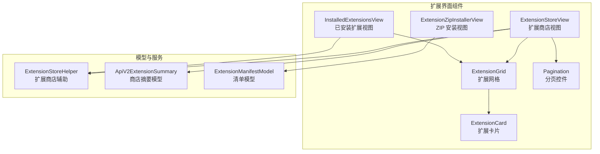
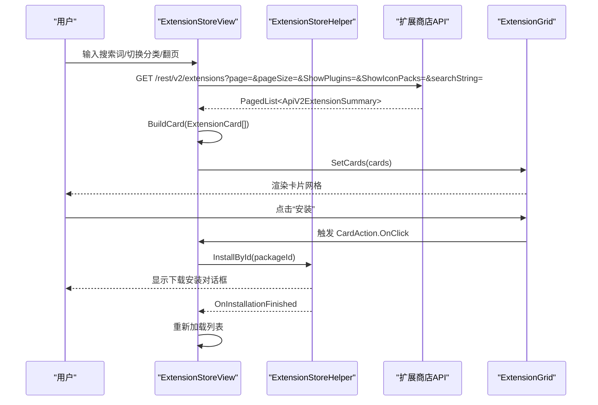
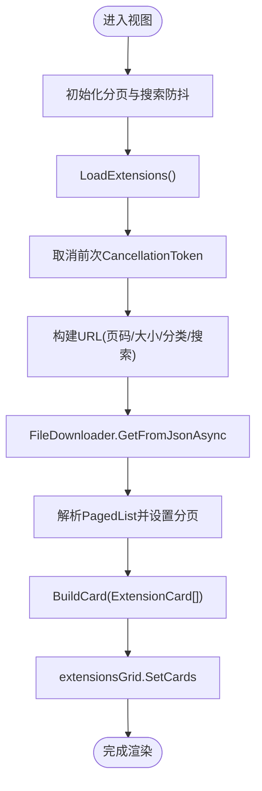
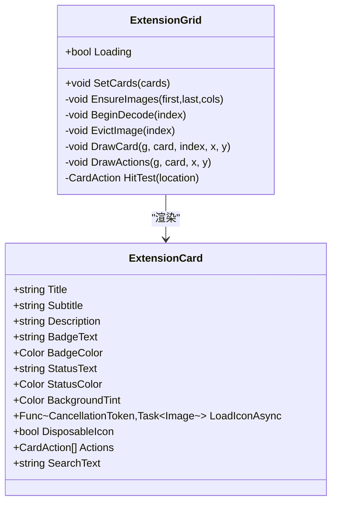
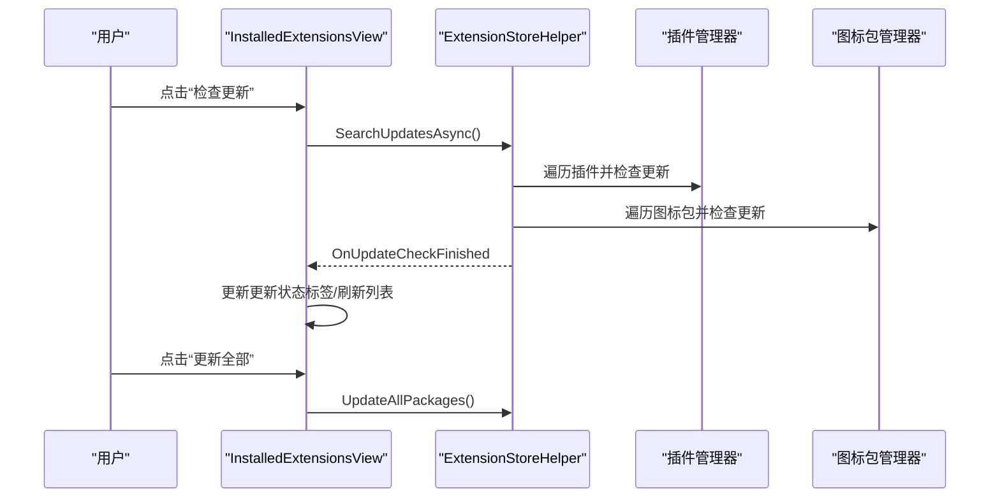
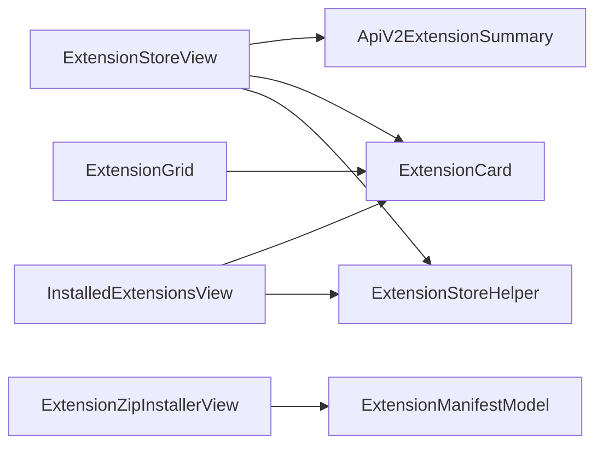

# 扩展界面组件

<cite>
**本文引用的文件**
- [ExtensionStoreView.cs](file://src/MacroDeck/GUI/CustomControls/ExtensionsView/ExtensionStoreView.cs)
- [ExtensionStoreView.Designer.cs](file://src/MacroDeck/GUI/CustomControls/ExtensionsView/ExtensionStoreView.Designer.cs)
- [ExtensionGrid.cs](file://src/MacroDeck/GUI/CustomControls/ExtensionsView/ExtensionGrid.cs)
- [ExtensionCard.cs](file://src/MacroDeck/GUI/CustomControls/ExtensionsView/ExtensionCard.cs)
- [InstalledExtensionsView.cs](file://src/MacroDeck/GUI/CustomControls/ExtensionsView/InstalledExtensionsView.cs)
- [InstalledExtensionsView.Designer.cs](file://src/MacroDeck/GUI/CustomControls/ExtensionsView/InstalledExtensionsView.Designer.cs)
- [ExtensionZipInstallerView.cs](file://src/MacroDeck/GUI/CustomControls/ExtensionsView/ExtensionZipInstallerView.cs)
- [ExtensionZipInstallerView.Designer.cs](file://src/MacroDeck/GUI/CustomControls/ExtensionsView/ExtensionZipInstallerView.Designer.cs)
- [Pagination.cs](file://src/MacroDeck/GUI/CustomControls/Pagination.cs)
- [ExtensionStoreHelper.cs](file://src/MacroDeck/ExtensionStore/ExtensionStoreHelper.cs)
- [ApiV2ExtensionSummary.cs](file://src/MacroDeck/Models/ApiV2ExtensionSummary.cs)
- [ExtensionManifestModel.cs](file://src/MacroDeck/Models/ExtensionManifestModel.cs)
</cite>

## 目录
1. [简介](#简介)
2. [项目结构](#项目结构)
3. [核心组件](#核心组件)
4. [架构总览](#架构总览)
5. [详细组件分析](#详细组件分析)
6. [依赖关系分析](#依赖关系分析)
7. [性能考量](#性能考量)
8. [故障排查指南](#故障排查指南)
9. [结论](#结论)
10. [附录](#附录)

## 简介
本文件面向扩展界面组件，系统性梳理扩展商店与已安装扩展管理的用户界面设计与交互模式。重点覆盖以下方面：
- 扩展商店视图（ExtensionStoreView）与网格布局（ExtensionGrid）的实现与排版
- 扩展卡片（ExtensionCard）的显示格式：图标、标题、副标题/版本、描述/状态、徽标与动作按钮
- 分类筛选（插件/图标包）与搜索过滤机制
- 已安装扩展视图（InstalledExtensionsView）的展示内容与操作菜单
- 安装状态指示与进度反馈
- 响应式布局与多分辨率适配策略

## 项目结构
扩展界面组件位于 GUI 自定义控件的 ExtensionsView 子目录中，配合分页控件 Pagination、扩展商店辅助工具 ExtensionStoreHelper，以及模型层 ApiV2ExtensionSummary、ExtensionManifestModel。

图表来源
- [ExtensionStoreView.cs:14-233](file://src/MacroDeck/GUI/CustomControls/ExtensionsView/ExtensionStoreView.cs#L14-L233)
- [InstalledExtensionsView.cs:12-383](file://src/MacroDeck/GUI/CustomControls/ExtensionsView/InstalledExtensionsView.cs#L12-L383)
- [ExtensionGrid.cs:13-507](file://src/MacroDeck/GUI/CustomControls/ExtensionsView/ExtensionGrid.cs#L13-L507)
- [ExtensionCard.cs:25-61](file://src/MacroDeck/GUI/CustomControls/ExtensionsView/ExtensionCard.cs#L25-L61)
- [Pagination.cs:3-98](file://src/MacroDeck/GUI/CustomControls/Pagination.cs#L3-L98)
- [ExtensionStoreHelper.cs:17-195](file://src/MacroDeck/ExtensionStore/ExtensionStoreHelper.cs#L17-L195)
- [ApiV2ExtensionSummary.cs:5-15](file://src/MacroDeck/Models/ApiV2ExtensionSummary.cs#L5-L15)
- [ExtensionManifestModel.cs:8-61](file://src/MacroDeck/Models/ExtensionManifestModel.cs#L8-L61)

章节来源
- [ExtensionStoreView.Designer.cs:38-148](file://src/MacroDeck/GUI/CustomControls/ExtensionsView/ExtensionStoreView.Designer.cs#L38-L148)
- [InstalledExtensionsView.Designer.cs:38-156](file://src/MacroDeck/GUI/CustomControls/ExtensionsView/InstalledExtensionsView.Designer.cs#L38-L156)

## 核心组件
- ExtensionStoreView：扩展商店主视图，负责加载商店数据、处理搜索与分页、构建卡片并触发安装流程。
- ExtensionGrid：虚拟化绘制的网格容器，按需解码与缓存图标，仅绘制可见区域，支持滚动与命中测试。
- ExtensionCard：卡片视图模型，承载标题、副标题、描述、徽标、状态文本、背景色、图标加载委托与动作集合。
- InstalledExtensionsView：已安装扩展列表视图，聚合插件与图标包，提供配置、更新、卸载等操作。
- ExtensionZipInstallerView：从 ZIP 文件安装扩展的对话视图，解析清单并执行安装。
- Pagination：分页控件，提供首页/上一页/下一页/末页导航与页码事件。
- ExtensionStoreHelper：扩展商店辅助工具，封装下载安装对话框、更新检查与通知。
- 模型：ApiV2ExtensionSummary（商店摘要）、ExtensionManifestModel（扩展清单）。

章节来源
- [ExtensionStoreView.cs:14-233](file://src/MacroDeck/GUI/CustomControls/ExtensionsView/ExtensionStoreView.cs#L14-L233)
- [ExtensionGrid.cs:13-507](file://src/MacroDeck/GUI/CustomControls/ExtensionsView/ExtensionGrid.cs#L13-L507)
- [ExtensionCard.cs:25-61](file://src/MacroDeck/GUI/CustomControls/ExtensionsView/ExtensionCard.cs#L25-L61)
- [InstalledExtensionsView.cs:12-383](file://src/MacroDeck/GUI/CustomControls/ExtensionsView/InstalledExtensionsView.cs#L12-L383)
- [ExtensionZipInstallerView.cs:10-80](file://src/MacroDeck/GUI/CustomControls/ExtensionsView/ExtensionZipInstallerView.cs#L10-L80)
- [Pagination.cs:3-98](file://src/MacroDeck/GUI/CustomControls/Pagination.cs#L3-L98)
- [ExtensionStoreHelper.cs:17-195](file://src/MacroDeck/ExtensionStore/ExtensionStoreHelper.cs#L17-L195)
- [ApiV2ExtensionSummary.cs:5-15](file://src/MacroDeck/Models/ApiV2ExtensionSummary.cs#L5-L15)
- [ExtensionManifestModel.cs:8-61](file://src/MacroDeck/Models/ExtensionManifestModel.cs#L8-L61)

## 架构总览
扩展商店与已安装扩展视图共享统一的卡片渲染管线：由视图构建 ExtensionCard 列表，交由 ExtensionGrid 虚拟化绘制；交互通过命中测试触发回调；安装流程由 ExtensionStoreHelper 统一调度。

图表来源
- [ExtensionStoreView.cs:66-109](file://src/MacroDeck/GUI/CustomControls/ExtensionsView/ExtensionStoreView.cs#L66-L109)
- [ExtensionStoreView.cs:111-157](file://src/MacroDeck/GUI/CustomControls/ExtensionsView/ExtensionStoreView.cs#L111-L157)
- [ExtensionStoreView.cs:170-180](file://src/MacroDeck/GUI/CustomControls/ExtensionsView/ExtensionStoreView.cs#L170-L180)
- [ExtensionStoreHelper.cs:48-64](file://src/MacroDeck/ExtensionStore/ExtensionStoreHelper.cs#L48-L64)
- [ExtensionGrid.cs:461-470](file://src/MacroDeck/GUI/CustomControls/ExtensionsView/ExtensionGrid.cs#L461-L470)

## 详细组件分析

### ExtensionStoreView（扩展商店视图）
- 控制器职责
  - 初始化分页、防抖搜索定时器，绑定事件。
  - 加载扩展列表：取消前次请求、构造查询参数（页码、大小、分类、搜索），调用下载器获取分页数据，计算页数并设置分页控件，构建卡片并交给网格渲染。
  - 构建卡片：根据类型设置徽标文本与颜色；检测是否已安装以禁用或启用“安装”按钮；可选添加仓库链接动作。
  - 图标加载：使用缓存与缩略图生成，避免主线程阻塞。
  - 安装流程：调用 ExtensionStoreHelper.InstallById，完成后刷新列表。
- 搜索与分类
  - 文本变更触发防抖计时器，停止后统一发起请求。
  - 复选框切换时重置到第一页并刷新。
- 错误处理：捕获异常并记录日志，确保网格 Loading 状态结束。

图表来源
- [ExtensionStoreView.cs:66-109](file://src/MacroDeck/GUI/CustomControls/ExtensionsView/ExtensionStoreView.cs#L66-L109)
- [ExtensionStoreView.cs:111-157](file://src/MacroDeck/GUI/CustomControls/ExtensionsView/ExtensionStoreView.cs#L111-L157)
- [ExtensionStoreView.cs:191-214](file://src/MacroDeck/GUI/CustomControls/ExtensionsView/ExtensionStoreView.cs#L191-L214)

章节来源
- [ExtensionStoreView.cs:26-37](file://src/MacroDeck/GUI/CustomControls/ExtensionsView/ExtensionStoreView.cs#L26-L37)
- [ExtensionStoreView.cs:45-64](file://src/MacroDeck/GUI/CustomControls/ExtensionsView/ExtensionStoreView.cs#L45-L64)
- [ExtensionStoreView.cs:66-109](file://src/MacroDeck/GUI/CustomControls/ExtensionsView/ExtensionStoreView.cs#L66-L109)
- [ExtensionStoreView.cs:111-157](file://src/MacroDeck/GUI/CustomControls/ExtensionsView/ExtensionStoreView.cs#L111-L157)
- [ExtensionStoreView.cs:170-180](file://src/MacroDeck/GUI/CustomControls/ExtensionsView/ExtensionStoreView.cs#L170-L180)
- [ExtensionStoreView.Designer.cs:38-148](file://src/MacroDeck/GUI/CustomControls/ExtensionsView/ExtensionStoreView.Designer.cs#L38-L148)

### ExtensionGrid（扩展网格）
- 虚拟化与性能
  - 仅绘制可视范围内的卡片，列数随窗口宽度动态计算，滚动时更新最小尺寸。
  - 图标解码在后台线程进行，解码结果缓存在限定范围内，超出范围则释放，降低内存占用。
- 绘制细节
  - 卡片圆角背景、图标裁剪、徽标右上角叠加、标题/副标题/描述/状态文本分行绘制。
  - 动作区域（按钮/链接）通过命中测试定位，悬停改变样式，点击触发回调。
- 状态提示
  - Loading 时居中显示“加载中”，空列表显示“未找到扩展”。

图表来源
- [ExtensionGrid.cs:13-507](file://src/MacroDeck/GUI/CustomControls/ExtensionsView/ExtensionGrid.cs#L13-L507)
- [ExtensionCard.cs:25-61](file://src/MacroDeck/GUI/CustomControls/ExtensionsView/ExtensionCard.cs#L25-L61)

章节来源
- [ExtensionGrid.cs:59-130](file://src/MacroDeck/GUI/CustomControls/ExtensionsView/ExtensionGrid.cs#L59-L130)
- [ExtensionGrid.cs:143-191](file://src/MacroDeck/GUI/CustomControls/ExtensionsView/ExtensionGrid.cs#L143-L191)
- [ExtensionGrid.cs:193-269](file://src/MacroDeck/GUI/CustomControls/ExtensionsView/ExtensionGrid.cs#L193-L269)
- [ExtensionGrid.cs:271-336](file://src/MacroDeck/GUI/CustomControls/ExtensionsView/ExtensionGrid.cs#L271-L336)
- [ExtensionGrid.cs:338-434](file://src/MacroDeck/GUI/CustomControls/ExtensionsView/ExtensionGrid.cs#L338-L434)
- [ExtensionGrid.cs:436-470](file://src/MacroDeck/GUI/CustomControls/ExtensionsView/ExtensionGrid.cs#L436-L470)

### ExtensionCard（扩展卡片）
- 字段与语义
  - 标题/副标题/描述：用于商店卡片与已安装卡片的不同展示。
  - 徽标：类型标识（插件/图标包），颜色区分。
  - 状态：已安装卡片显示启用/禁用/待重启/更新可用等状态与颜色。
  - 背景：卡片背景色调，更新可用时采用高亮背景。
  - 图标：异步加载委托与是否可处置标记。
  - 动作：安装/更新/卸载/配置/仓库链接等。
  - 搜索文本：用于客户端过滤。
- 使用场景
  - 商店视图：由 BuildCard 构建，包含安装与仓库链接动作。
  - 已安装视图：根据扩展类型与状态动态填充，动作包含配置、更新、卸载。

章节来源
- [ExtensionCard.cs:25-61](file://src/MacroDeck/GUI/CustomControls/ExtensionsView/ExtensionCard.cs#L25-L61)
- [ExtensionStoreView.cs:111-157](file://src/MacroDeck/GUI/CustomControls/ExtensionsView/ExtensionStoreView.cs#L111-L157)
- [InstalledExtensionsView.cs:80-118](file://src/MacroDeck/GUI/CustomControls/ExtensionsView/InstalledExtensionsView.cs#L80-L118)

### 已安装扩展视图（InstalledExtensionsView）
- 数据源
  - 遍历已安装插件与图标包，构建卡片；跳过受保护扩展。
- 状态与动作
  - 插件：根据启用状态、待重启、可更新状态设置状态文本与颜色；动作包含配置、更新、卸载。
  - 图标包：启用/更新可用状态；动作包含配置（图标选择）、更新、卸载。
- 过滤与刷新
  - 支持按搜索词过滤；安装/更新完成后刷新列表并更新更新状态标签。
- 更新检查
  - 调用 ExtensionStoreHelper.SearchUpdatesAsync 并订阅完成事件，必要时弹出系统通知。

图表来源
- [InstalledExtensionsView.cs:326-382](file://src/MacroDeck/GUI/CustomControls/ExtensionsView/InstalledExtensionsView.cs#L326-L382)
- [ExtensionStoreHelper.cs:71-131](file://src/MacroDeck/ExtensionStore/ExtensionStoreHelper.cs#L71-L131)
- [ExtensionStoreHelper.cs:133-160](file://src/MacroDeck/ExtensionStore/ExtensionStoreHelper.cs#L133-L160)

章节来源
- [InstalledExtensionsView.cs:37-78](file://src/MacroDeck/GUI/CustomControls/ExtensionsView/InstalledExtensionsView.cs#L37-L78)
- [InstalledExtensionsView.cs:80-118](file://src/MacroDeck/GUI/CustomControls/ExtensionsView/InstalledExtensionsView.cs#L80-L118)
- [InstalledExtensionsView.cs:147-176](file://src/MacroDeck/GUI/CustomControls/ExtensionsView/InstalledExtensionsView.cs#L147-L176)
- [InstalledExtensionsView.cs:284-302](file://src/MacroDeck/GUI/CustomControls/ExtensionsView/InstalledExtensionsView.cs#L284-L302)
- [InstalledExtensionsView.Designer.cs:38-156](file://src/MacroDeck/GUI/CustomControls/ExtensionsView/InstalledExtensionsView.Designer.cs#L38-L156)

### ZIP 安装视图（ExtensionZipInstallerView）
- 功能
  - 选择 ZIP 文件并解析扩展清单（类型、名称、作者、包 ID、版本等）。
  - 根据类型调用插件或图标包安装接口。
- 用户提示
  - 提供警告信息提示仅从可信来源安装。
  - 安装成功后触发关闭事件。

章节来源
- [ExtensionZipInstallerView.cs:19-80](file://src/MacroDeck/GUI/CustomControls/ExtensionsView/ExtensionZipInstallerView.cs#L19-L80)
- [ExtensionManifestModel.cs:32-61](file://src/MacroDeck/Models/ExtensionManifestModel.cs#L32-L61)

### 分页控件（Pagination）
- 行为
  - 维护当前页与总页数，更新页码标签与按钮可用状态。
  - 暴露 PageUpdated 事件供上层视图响应翻页。
- 视觉
  - 首页/上一页/下一页/末页按钮，当前页与总页数显示。

章节来源
- [Pagination.cs:5-52](file://src/MacroDeck/GUI/CustomControls/Pagination.cs#L5-L52)
- [Pagination.cs:54-96](file://src/MacroDeck/GUI/CustomControls/Pagination.cs#L54-L96)

## 依赖关系分析
- 视图到模型
  - ExtensionStoreView 依赖 ApiV2ExtensionSummary 获取商店摘要，依赖 ExtensionCard 渲染卡片。
  - InstalledExtensionsView 依赖 ExtensionCard 与 IMacroDeckExtension（插件/图标包）。
- 视图到服务
  - ExtensionStoreView 与 InstalledExtensionsView 依赖 ExtensionStoreHelper 统一安装与更新流程。
- 性能与资源
  - ExtensionGrid 通过后台解码与缓存减少 UI 线程压力；Pagination 与虚拟化结合提升大数据集体验。

图表来源
- [ExtensionStoreView.cs:66-109](file://src/MacroDeck/GUI/CustomControls/ExtensionsView/ExtensionStoreView.cs#L66-L109)
- [InstalledExtensionsView.cs:80-118](file://src/MacroDeck/GUI/CustomControls/ExtensionsView/InstalledExtensionsView.cs#L80-L118)
- [ExtensionGrid.cs:13-507](file://src/MacroDeck/GUI/CustomControls/ExtensionsView/ExtensionGrid.cs#L13-L507)
- [ExtensionZipInstallerView.cs:19-80](file://src/MacroDeck/GUI/CustomControls/ExtensionsView/ExtensionZipInstallerView.cs#L19-L80)
- [ApiV2ExtensionSummary.cs:5-15](file://src/MacroDeck/Models/ApiV2ExtensionSummary.cs#L5-L15)
- [ExtensionManifestModel.cs:8-61](file://src/MacroDeck/Models/ExtensionManifestModel.cs#L8-L61)

## 性能考量
- 虚拟化绘制：仅绘制可见卡片，减少绘制开销。
- 图标缓存：后台解码、限定范围缓存与淘汰，避免重复 IO 与内存膨胀。
- 请求去抖：搜索输入防抖，降低网络请求频率。
- 取消令牌：每次加载前取消旧任务，避免竞态与资源浪费。
- 异步安装：安装对话框在独立窗口中运行，不阻塞主界面。

章节来源
- [ExtensionGrid.cs:338-434](file://src/MacroDeck/GUI/CustomControls/ExtensionsView/ExtensionGrid.cs#L338-L434)
- [ExtensionStoreView.cs:24-37](file://src/MacroDeck/GUI/CustomControls/ExtensionsView/ExtensionStoreView.cs#L24-L37)
- [ExtensionStoreView.cs:68-73](file://src/MacroDeck/GUI/CustomControls/ExtensionsView/ExtensionStoreView.cs#L68-L73)

## 故障排查指南
- 无法加载扩展列表
  - 检查网络连接与 API 地址；查看日志错误；确认分页控件事件绑定。
- 搜索无响应
  - 确认防抖定时器是否被正确启动与停止；检查搜索字符串变化事件。
- 图标不显示或闪烁
  - 检查 LoadIconAsync 是否返回有效图像；确认缓存与淘汰逻辑正常。
- 安装失败
  - 查看 ZIP 安装视图解析清单是否成功；确认扩展类型匹配；查看安装日志。
- 更新检查无效
  - 确认 ExtensionStoreHelper 的更新检查事件是否触发；检查通知与按钮状态更新。

章节来源
- [ExtensionStoreView.cs:101-108](file://src/MacroDeck/GUI/CustomControls/ExtensionsView/ExtensionStoreView.cs#L101-L108)
- [ExtensionZipInstallerView.cs:34-48](file://src/MacroDeck/GUI/CustomControls/ExtensionsView/ExtensionZipInstallerView.cs#L34-L48)
- [ExtensionStoreHelper.cs:71-131](file://src/MacroDeck/ExtensionStore/ExtensionStoreHelper.cs#L71-L131)

## 结论
该扩展界面组件通过统一的卡片模型与虚拟化网格渲染，实现了高性能、可扩展的商店与管理界面。搜索、分类、分页与安装流程清晰解耦，便于维护与扩展。建议后续关注：
- 更细粒度的错误提示与重试机制
- 多语言与无障碍支持增强
- 增量更新与断点续传优化

## 附录

### 扩展卡片显示格式规范
- 布局要素
  - 左侧圆形裁剪图标（50x50）
  - 右侧内容区：顶部徽标（右上角）、标题（粗体）、副标题（作者/版本）、描述/状态文本、底部动作区（按钮/链接）
- 视觉样式
  - 圆角背景、半透明遮罩、悬停高亮、禁用态浅色
- 动作类型
  - 主要按钮（蓝色）、强调按钮（绿色）、链接（白色/悬停蓝色）

章节来源
- [ExtensionGrid.cs:193-269](file://src/MacroDeck/GUI/CustomControls/ExtensionsView/ExtensionGrid.cs#L193-L269)
- [ExtensionGrid.cs:271-336](file://src/MacroDeck/GUI/CustomControls/ExtensionsView/ExtensionGrid.cs#L271-L336)

### 分类导航与搜索过滤
- 分类
  - 插件与图标包复选框，切换即刷新第一页
- 搜索
  - 输入防抖，触发后更新页码并重新加载
- 已安装视图过滤
  - 按搜索词小写包含匹配

章节来源
- [ExtensionStoreView.cs:45-64](file://src/MacroDeck/GUI/CustomControls/ExtensionsView/ExtensionStoreView.cs#L45-L64)
- [ExtensionStoreView.cs:221-231](file://src/MacroDeck/GUI/CustomControls/ExtensionsView/ExtensionStoreView.cs#L221-L231)
- [InstalledExtensionsView.cs:295-302](file://src/MacroDeck/GUI/CustomControls/ExtensionsView/InstalledExtensionsView.cs#L295-L302)

### 安装状态指示与进度反馈
- 商店视图
  - 加载中状态：网格中心显示“加载中”
  - 成功安装：触发安装完成事件后刷新列表
- 已安装视图
  - 更新按钮支持进度指示（Spinner/Enabled）
  - 更新状态标签根据可更新数量动态变化

章节来源
- [ExtensionGrid.cs:174-181](file://src/MacroDeck/GUI/CustomControls/ExtensionsView/ExtensionGrid.cs#L174-L181)
- [ExtensionStoreView.cs:105-108](file://src/MacroDeck/GUI/CustomControls/ExtensionsView/ExtensionStoreView.cs#L105-L108)
- [InstalledExtensionsView.Designer.cs:81-102](file://src/MacroDeck/GUI/CustomControls/ExtensionsView/InstalledExtensionsView.Designer.cs#L81-L102)
- [InstalledExtensionsView.cs:368-382](file://src/MacroDeck/GUI/CustomControls/ExtensionsView/InstalledExtensionsView.cs#L368-L382)

### 响应式设计与多分辨率适配
- 网格自适应
  - 列数根据窗口宽度动态计算，滚动区域随内容增长
- 控件自适应
  - 已安装视图与 ZIP 安装视图使用 DPI 自动缩放
- 布局锚定
  - 关键控件采用 Anchor 策略，保证在窗口大小变化时保持相对位置

章节来源
- [ExtensionGrid.cs:116-122](file://src/MacroDeck/GUI/CustomControls/ExtensionsView/ExtensionGrid.cs#L116-L122)
- [InstalledExtensionsView.Designer.cs:142](file://src/MacroDeck/GUI/CustomControls/ExtensionsView/InstalledExtensionsView.Designer.cs#L142)
- [ExtensionZipInstallerView.Designer.cs:255](file://src/MacroDeck/GUI/CustomControls/ExtensionsView/ExtensionZipInstallerView.Designer.cs#L255)
- [ExtensionStoreView.Designer.cs:133](file://src/MacroDeck/GUI/CustomControls/ExtensionsView/ExtensionStoreView.Designer.cs#L133)