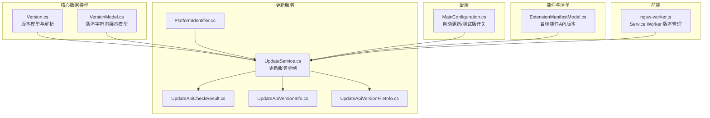
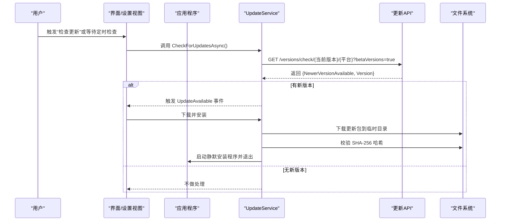
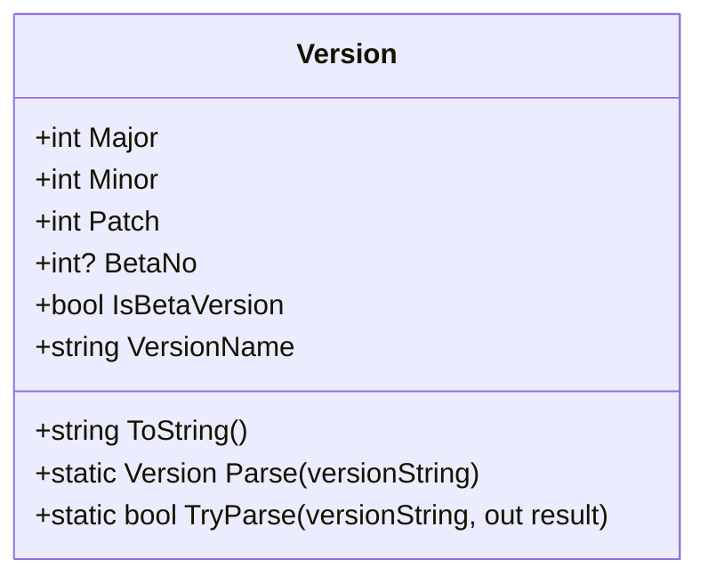
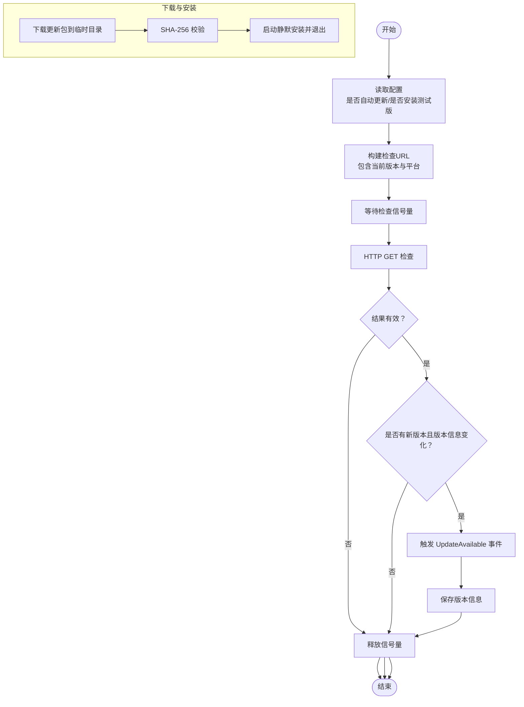
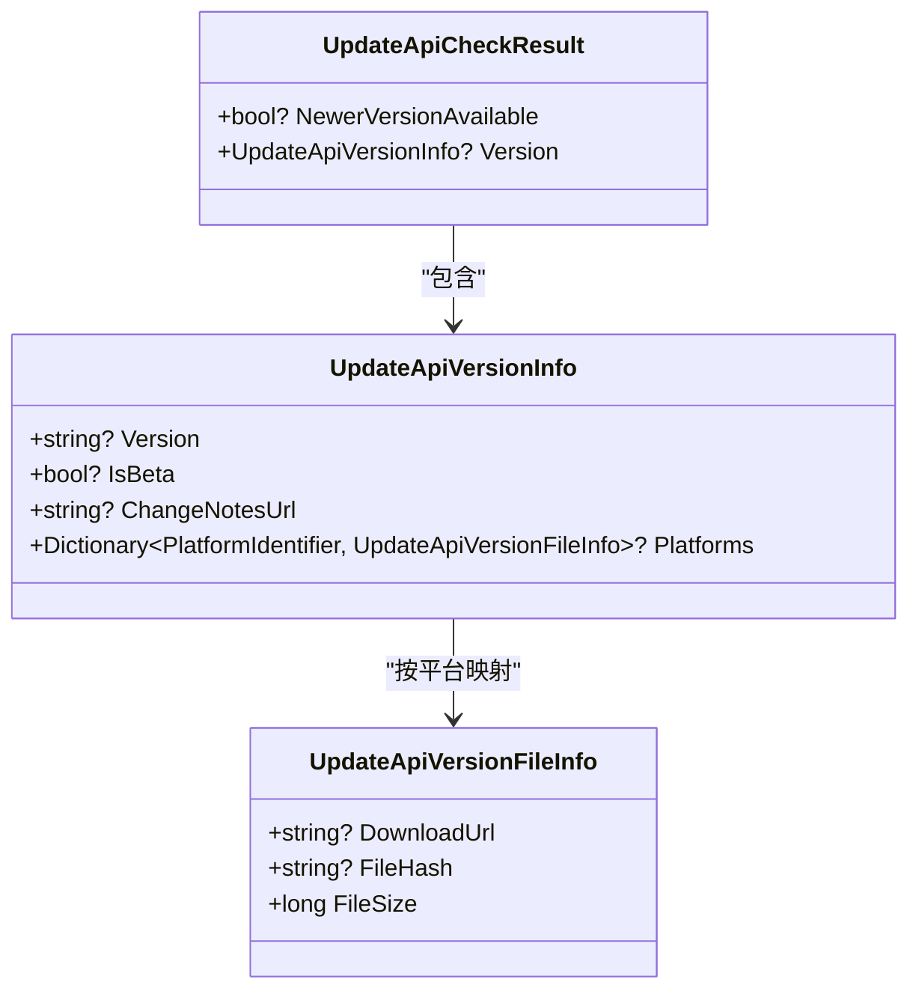
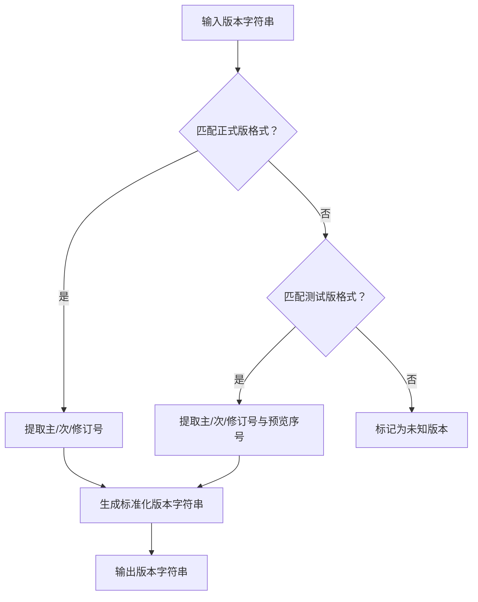
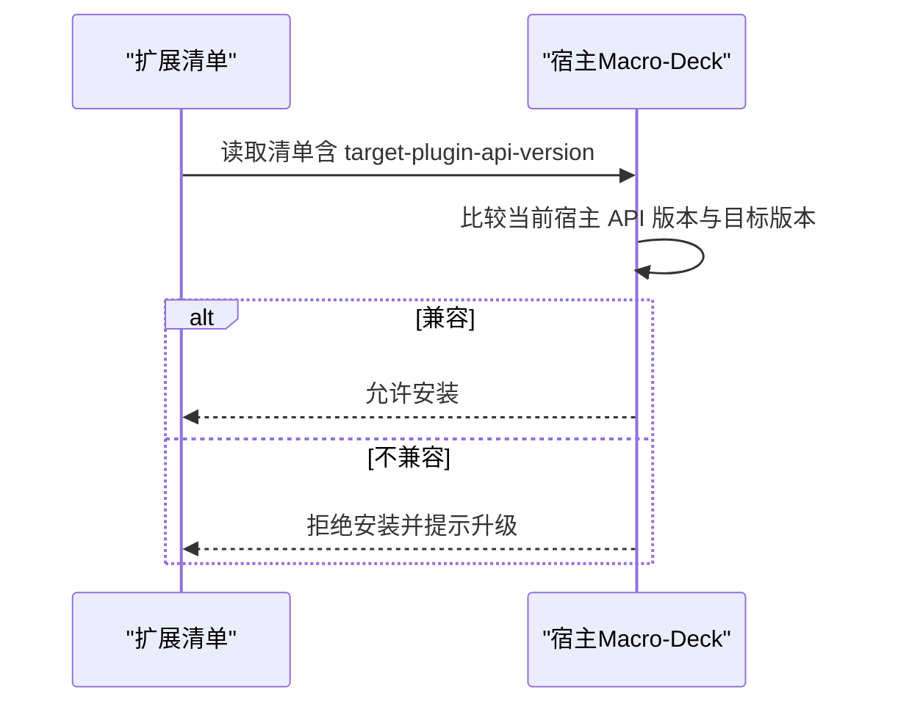
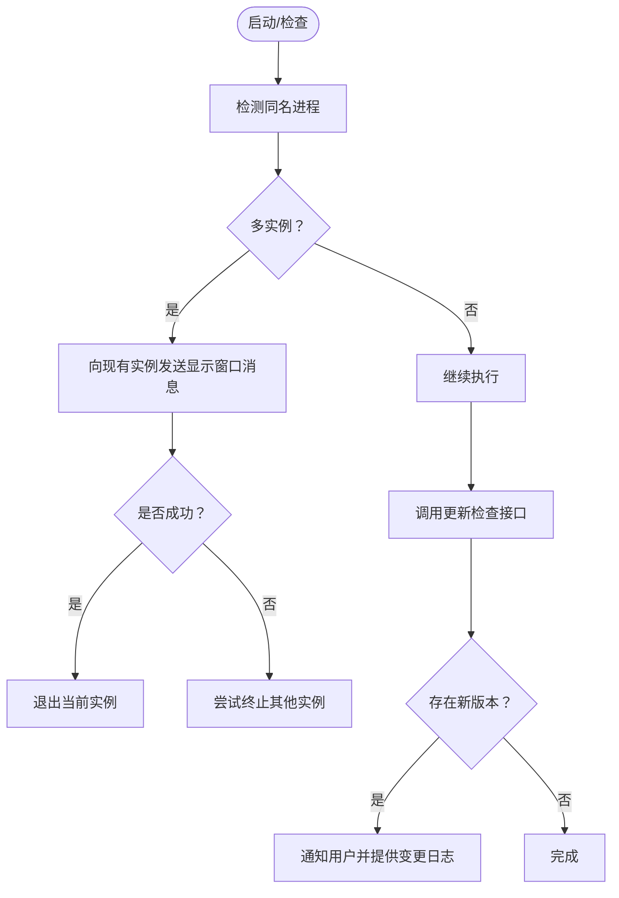
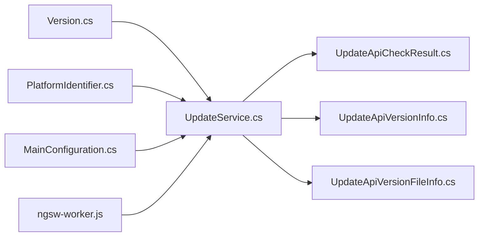

# 版本控制系统

<cite>
**本文引用的文件**
- [Version.cs](file://src/MacroDeck/DataTypes/Core/Version.cs)
- [UpdateService.cs](file://src/MacroDeck/Services/UpdateService.cs)
- [UpdateApiCheckResult.cs](file://src/MacroDeck/DataTypes/Updater/UpdateApiCheckResult.cs)
- [UpdateApiVersionInfo.cs](file://src/MacroDeck/DataTypes/Updater/UpdateApiVersionInfo.cs)
- [UpdateApiVersionFileInfo.cs](file://src/MacroDeck/DataTypes/Updater/UpdateApiVersionFileInfo.cs)
- [VersionModel.cs](file://src/MacroDeck/Models/VersionModel.cs)
- [MainConfiguration.cs](file://src/MacroDeck/Configuration/MainConfiguration.cs)
- [PlatformIdentifier.cs](file://src/MacroDeck/Enums/PlatformIdentifier.cs)
- [Program.cs](file://src/MacroDeck/Program.cs)
- [ExtensionManifestModel.cs](file://src/MacroDeck/Models/ExtensionManifestModel.cs)
- [SettingsView.Designer.cs](file://src/MacroDeck/GUI/MainWindowViews/SettingsView.Designer.cs)
- [ngsw-worker.js](file://src/MacroDeck/wwwroot/client/ngsw-worker.js)
</cite>

## 目录
1. [简介](#简介)
2. [项目结构](#项目结构)
3. [核心组件](#核心组件)
4. [架构总览](#架构总览)
5. [详细组件分析](#详细组件分析)
6. [依赖关系分析](#依赖关系分析)
7. [性能考量](#性能考量)
8. [故障排查指南](#故障排查指南)
9. [结论](#结论)
10. [附录](#附录)

## 简介
本文件系统性梳理 Macro-Deck 的版本控制系统，重点覆盖以下方面：
- 扩展版本检查与更新机制：包括自动与手动触发、下载校验与安装流程
- CheckForAvailableUpdate（对应代码中的 CheckForUpdatesAsync）实现原理与版本比较逻辑
- 版本号格式与语义化版本控制（SemVer）应用
- 插件 API 版本兼容性检查与宏 decks 版本适配
- 版本历史与变更日志展示能力
- 自动更新检查与手动更新触发机制
- 版本冲突检测与解决策略
- 版本锁定与强制更新管理方式

## 项目结构
版本控制相关代码主要分布在如下模块：
- 核心数据类型：版本模型与解析
- 更新服务：自动/手动更新检查、下载与安装
- 配置层：是否自动更新、是否安装测试版等开关
- 插件清单：目标插件 API 版本约束
- 前端缓存更新：Angular Service Worker 对客户端版本的管理

**图表来源**
- [Version.cs:1-74](file://src/MacroDeck/DataTypes/Core/Version.cs#L1-L74)
- [UpdateService.cs:1-175](file://src/MacroDeck/Services/UpdateService.cs#L1-L175)
- [UpdateApiCheckResult.cs:1-8](file://src/MacroDeck/DataTypes/Updater/UpdateApiCheckResult.cs#L1-L8)
- [UpdateApiVersionInfo.cs:1-12](file://src/MacroDeck/DataTypes/Updater/UpdateApiVersionInfo.cs#L1-L12)
- [UpdateApiVersionFileInfo.cs:1-9](file://src/MacroDeck/DataTypes/Updater/UpdateApiVersionFileInfo.cs#L1-L9)
- [PlatformIdentifier.cs:1-12](file://src/MacroDeck/Enums/PlatformIdentifier.cs#L1-L12)
- [MainConfiguration.cs:1-103](file://src/MacroDeck/Configuration/MainConfiguration.cs#L1-L103)
- [ExtensionManifestModel.cs:1-40](file://src/MacroDeck/Models/ExtensionManifestModel.cs#L1-L40)
- [ngsw-worker.js:1535-1655](file://src/MacroDeck/wwwroot/client/ngsw-worker.js#L1535-L1655)

**章节来源**
- [Version.cs:1-74](file://src/MacroDeck/DataTypes/Core/Version.cs#L1-L74)
- [UpdateService.cs:1-175](file://src/MacroDeck/Services/UpdateService.cs#L1-L175)
- [MainConfiguration.cs:1-103](file://src/MacroDeck/Configuration/MainConfiguration.cs#L1-L103)

## 核心组件
- 版本模型与解析：支持主/次/修订号与可选的 Beta 序号；提供字符串解析与格式化输出
- 更新服务：单例模式，负责周期性检查、手动检查、下载与安装；通过 API 获取新版本信息并进行安全校验
- 版本信息数据结构：封装版本号、是否测试版、变更日志链接、平台特定下载信息
- 配置项：控制是否自动更新、是否安装测试版
- 插件清单：声明目标插件 API 版本，用于兼容性检查
- 前端 Service Worker：负责客户端资源版本分配与更新

**章节来源**
- [Version.cs:1-74](file://src/MacroDeck/DataTypes/Core/Version.cs#L1-L74)
- [UpdateService.cs:1-175](file://src/MacroDeck/Services/UpdateService.cs#L1-L175)
- [UpdateApiVersionInfo.cs:1-12](file://src/MacroDeck/DataTypes/Updater/UpdateApiVersionInfo.cs#L1-L12)
- [UpdateApiVersionFileInfo.cs:1-9](file://src/MacroDeck/DataTypes/Updater/UpdateApiVersionFileInfo.cs#L1-L9)
- [MainConfiguration.cs:1-103](file://src/MacroDeck/Configuration/MainConfiguration.cs#L1-L103)
- [ExtensionManifestModel.cs:1-40](file://src/MacroDeck/Models/ExtensionManifestModel.cs#L1-L40)
- [ngsw-worker.js:1535-1655](file://src/MacroDeck/wwwroot/client/ngsw-worker.js#L1535-L1655)

## 架构总览
下图展示了版本检查与更新的整体流程，从用户操作或定时任务触发，到 API 检查、下载校验、安装与退出。

**图表来源**
- [UpdateService.cs:51-85](file://src/MacroDeck/Services/UpdateService.cs#L51-L85)
- [UpdateApiCheckResult.cs:1-8](file://src/MacroDeck/DataTypes/Updater/UpdateApiCheckResult.cs#L1-L8)
- [UpdateApiVersionInfo.cs:1-12](file://src/MacroDeck/DataTypes/Updater/UpdateApiVersionInfo.cs#L1-L12)
- [UpdateApiVersionFileInfo.cs:1-9](file://src/MacroDeck/DataTypes/Updater/UpdateApiVersionFileInfo.cs#L1-L9)

## 详细组件分析

### 版本模型与解析（Version）
- 字段与行为
  - 主版本、次版本、修订版本、可选 Beta 序号
  - 支持字符串解析（含 Beta 标记），失败时抛出异常
  - 提供统一的版本名称格式化输出
- 复杂度
  - 解析使用正则匹配，时间复杂度 O(n)，n 为输入长度；空间复杂度 O(1)
- 兼容性
  - 与更新服务中的版本字符串保持一致，便于 API 交互

**图表来源**
- [Version.cs:1-74](file://src/MacroDeck/DataTypes/Core/Version.cs#L1-L74)

**章节来源**
- [Version.cs:1-74](file://src/MacroDeck/DataTypes/Core/Version.cs#L1-L74)

### 更新服务（UpdateService）
- 单例模式：全局唯一实例，避免重复检查
- 自动检查：后台任务每 30 分钟执行一次
- 手动检查：对外暴露异步方法，支持取消令牌
- 平台标识：固定为 WinX64
- 测试版开关：根据配置决定是否包含测试版
- 安全校验：下载完成后计算 SHA-256 并与服务器返回哈希比对
- 安装流程：启动静默安装程序后退出当前进程
- 互斥控制：使用信号量确保同一时间仅有一个检查或下载在进行

**图表来源**
- [UpdateService.cs:39-136](file://src/MacroDeck/Services/UpdateService.cs#L39-L136)
- [UpdateService.cs:138-173](file://src/MacroDeck/Services/UpdateService.cs#L138-L173)

**章节来源**
- [UpdateService.cs:1-175](file://src/MacroDeck/Services/UpdateService.cs#L1-L175)
- [MainConfiguration.cs:42-44](file://src/MacroDeck/Configuration/MainConfiguration.cs#L42-L44)

### 版本信息数据结构
- UpdateApiVersionInfo：包含版本号、是否测试版、变更日志链接、平台映射
- UpdateApiVersionFileInfo：包含下载地址、文件哈希、文件大小
- UpdateApiCheckResult：封装“是否存在新版本”与“版本信息”

**图表来源**
- [UpdateApiCheckResult.cs:1-8](file://src/MacroDeck/DataTypes/Updater/UpdateApiCheckResult.cs#L1-L8)
- [UpdateApiVersionInfo.cs:1-12](file://src/MacroDeck/DataTypes/Updater/UpdateApiVersionInfo.cs#L1-L12)
- [UpdateApiVersionFileInfo.cs:1-9](file://src/MacroDeck/DataTypes/Updater/UpdateApiVersionFileInfo.cs#L1-L9)

**章节来源**
- [UpdateApiCheckResult.cs:1-8](file://src/MacroDeck/DataTypes/Updater/UpdateApiCheckResult.cs#L1-L8)
- [UpdateApiVersionInfo.cs:1-12](file://src/MacroDeck/DataTypes/Updater/UpdateApiVersionInfo.cs#L1-L12)
- [UpdateApiVersionFileInfo.cs:1-9](file://src/MacroDeck/DataTypes/Updater/UpdateApiVersionFileInfo.cs#L1-L9)

### 版本号格式与语义化版本控制
- 版本字符串格式
  - 正式版：主.次.修订
  - 测试版：主.次.修订-b序号 或 主.次.修订-preview序号（展示模型）
- 解析规则
  - 使用正则表达式匹配主/次/修订号，可选 Beta 序号
  - 解析失败抛出格式异常
- 展示模型
  - VersionModel 支持两种格式识别与规范化展示，调试状态下附加标记

**图表来源**
- [Version.cs:31-69](file://src/MacroDeck/DataTypes/Core/Version.cs#L31-L69)
- [VersionModel.cs:8-50](file://src/MacroDeck/Models/VersionModel.cs#L8-L50)

**章节来源**
- [Version.cs:1-74](file://src/MacroDeck/DataTypes/Core/Version.cs#L1-L74)
- [VersionModel.cs:1-52](file://src/MacroDeck/Models/VersionModel.cs#L1-L52)

### 插件 API 版本兼容性检查与宏 decks 版本适配
- 目标插件 API 版本
  - 清单中声明 target-plugin-api-version，默认值为 31
- 兼容性策略
  - 安装前应校验扩展清单中的目标 API 版本与当前宿主版本是否兼容
  - 若不兼容，应阻止安装或提示用户升级宿主版本
- 宏 decks 适配
  - 宏 decks 作为宿主应用，其自身版本与插件 API 版本需保持一致或向后兼容

**图表来源**
- [ExtensionManifestModel.cs:22-23](file://src/MacroDeck/Models/ExtensionManifestModel.cs#L22-L23)

**章节来源**
- [ExtensionManifestModel.cs:1-40](file://src/MacroDeck/Models/ExtensionManifestModel.cs#L1-L40)

### 版本历史记录与变更日志展示
- 变更日志链接
  - UpdateApiVersionInfo 包含 ChangeNotesUrl，可用于打开变更日志页面
- 展示位置
  - 设置视图中存在“第三方许可”按钮等界面元素，可类推用于展示变更日志入口

**章节来源**
- [UpdateApiVersionInfo.cs:1-12](file://src/MacroDeck/DataTypes/Updater/UpdateApiVersionInfo.cs#L1-L12)
- [SettingsView.Designer.cs:728-785](file://src/MacroDeck/GUI/MainWindowViews/SettingsView.Designer.cs#L728-L785)

### 自动更新检查与手动更新触发机制
- 自动检查
  - 后台任务每 30 分钟执行一次 CheckForUpdatesAsync
  - 使用取消令牌与异常捕获保证稳定性
- 手动触发
  - 通过调用 CheckForUpdatesAsync 可立即发起检查
- 测试版控制
  - 根据配置决定是否包含测试版

**章节来源**
- [UpdateService.cs:39-85](file://src/MacroDeck/Services/UpdateService.cs#L39-L85)
- [MainConfiguration.cs:42-44](file://src/MacroDeck/Configuration/MainConfiguration.cs#L42-L44)

### 版本冲突检测与解决策略
- 冲突场景
  - 多实例运行导致的资源占用
  - 客户端与服务端版本不一致引发的兼容问题
- 检测与处理
  - 进程级冲突：启动时检测同名进程，优先保留一个实例
  - 版本冲突：通过 API 返回的新版本信息与本地版本对比，若存在更高版本则提示更新
  - 前端冲突：Service Worker 在客户端版本与最新版本不一致时进行更新与同步

**图表来源**
- [Program.cs:37-66](file://src/MacroDeck/Program.cs#L37-L66)
- [UpdateService.cs:51-85](file://src/MacroDeck/Services/UpdateService.cs#L51-L85)
- [ngsw-worker.js:1637-1655](file://src/MacroDeck/wwwroot/client/ngsw-worker.js#L1637-L1655)

**章节来源**
- [Program.cs:1-80](file://src/MacroDeck/Program.cs#L1-L80)
- [UpdateService.cs:1-175](file://src/MacroDeck/Services/UpdateService.cs#L1-L175)
- [ngsw-worker.js:1535-1655](file://src/MacroDeck/wwwroot/client/ngsw-worker.js#L1535-L1655)

### 版本锁定与强制更新管理
- 版本锁定
  - 当前代码未见显式的“版本锁定”机制；可通过禁用自动更新与测试版安装来达到近似效果
- 强制更新
  - 未发现强制更新逻辑；如需强制更新，可在 API 层面返回高优先级提示并在 UI 中阻断继续使用旧版本

**章节来源**
- [MainConfiguration.cs:42-44](file://src/MacroDeck/Configuration/MainConfiguration.cs#L42-L44)
- [UpdateService.cs:51-85](file://src/MacroDeck/Services/UpdateService.cs#L51-L85)

## 依赖关系分析
- 组件耦合
  - UpdateService 依赖版本模型、平台标识、配置与下载器工具
  - 版本信息数据结构被 UpdateService 与 UI 展示共同使用
- 外部依赖
  - HTTP 客户端用于版本检查
  - Service Worker 用于前端资源版本管理
- 循环依赖
  - 未发现循环依赖迹象

**图表来源**
- [UpdateService.cs:1-175](file://src/MacroDeck/Services/UpdateService.cs#L1-L175)
- [Version.cs:1-74](file://src/MacroDeck/DataTypes/Core/Version.cs#L1-L74)
- [PlatformIdentifier.cs:1-12](file://src/MacroDeck/Enums/PlatformIdentifier.cs#L1-L12)
- [MainConfiguration.cs:1-103](file://src/MacroDeck/Configuration/MainConfiguration.cs#L1-L103)
- [UpdateApiCheckResult.cs:1-8](file://src/MacroDeck/DataTypes/Updater/UpdateApiCheckResult.cs#L1-L8)
- [UpdateApiVersionInfo.cs:1-12](file://src/MacroDeck/DataTypes/Updater/UpdateApiVersionInfo.cs#L1-L12)
- [UpdateApiVersionFileInfo.cs:1-9](file://src/MacroDeck/DataTypes/Updater/UpdateApiVersionFileInfo.cs#L1-L9)
- [ngsw-worker.js:1535-1655](file://src/MacroDeck/wwwroot/client/ngsw-worker.js#L1535-L1655)

**章节来源**
- [UpdateService.cs:1-175](file://src/MacroDeck/Services/UpdateService.cs#L1-L175)
- [Version.cs:1-74](file://src/MacroDeck/DataTypes/Core/Version.cs#L1-L74)
- [PlatformIdentifier.cs:1-12](file://src/MacroDeck/Enums/PlatformIdentifier.cs#L1-L12)
- [MainConfiguration.cs:1-103](file://src/MacroDeck/Configuration/MainConfiguration.cs#L1-L103)
- [UpdateApiCheckResult.cs:1-8](file://src/MacroDeck/DataTypes/Updater/UpdateApiCheckResult.cs#L1-L8)
- [UpdateApiVersionInfo.cs:1-12](file://src/MacroDeck/DataTypes/Updater/UpdateApiVersionInfo.cs#L1-L12)
- [UpdateApiVersionFileInfo.cs:1-9](file://src/MacroDeck/DataTypes/Updater/UpdateApiVersionFileInfo.cs#L1-L9)
- [ngsw-worker.js:1535-1655](file://src/MacroDeck/wwwroot/client/ngsw-worker.js#L1535-L1655)

## 性能考量
- 检查频率：每 30 分钟一次，避免频繁网络请求
- 并发控制：检查与下载均使用信号量串行化，防止资源竞争
- 校验成本：SHA-256 计算在下载完成后进行，避免重复计算
- 建议
  - 在弱网环境下可考虑指数退避重试
  - 对于大文件下载，可增加断点续传与进度回调优化用户体验

[本节为通用建议，无需具体文件来源]

## 故障排查指南
- 无法连接更新服务器
  - 检查网络与代理设置；确认 API 地址可达
- 版本检查返回空结果
  - 确认当前版本字符串格式正确；检查是否启用了测试版但服务器未返回测试版
- 下载失败或哈希不匹配
  - 检查临时目录权限与磁盘空间；确认下载链接有效；重新下载
- 安装失败
  - 查看安装程序参数与权限；确认杀软未拦截
- 多实例冲突
  - 确认是否已有实例在运行；必要时手动结束多余进程

**章节来源**
- [UpdateService.cs:51-85](file://src/MacroDeck/Services/UpdateService.cs#L51-L85)
- [UpdateService.cs:138-158](file://src/MacroDeck/Services/UpdateService.cs#L138-L158)
- [Program.cs:37-66](file://src/MacroDeck/Program.cs#L37-L66)

## 结论
Macro-Deck 的版本控制系统以简洁可靠的架构实现了：
- 明确的版本号格式与解析
- 自动与手动双通道的更新检查
- 下载与安装的安全校验
- 插件 API 版本兼容性与前端资源版本管理
在现有基础上，可进一步完善版本锁定、强制更新与更细粒度的错误恢复策略，以提升系统的健壮性与用户体验。

[本节为总结，无需具体文件来源]

## 附录
- 关键实现路径参考
  - 版本解析与格式化：[Version.cs:31-69](file://src/MacroDeck/DataTypes/Core/Version.cs#L31-L69)
  - 更新检查与下载：[UpdateService.cs:51-106](file://src/MacroDeck/Services/UpdateService.cs#L51-L106)
  - 版本信息数据结构：[UpdateApiVersionInfo.cs:1-12](file://src/MacroDeck/DataTypes/Updater/UpdateApiVersionInfo.cs#L1-L12)
  - 配置项（自动更新/测试版）：[MainConfiguration.cs:42-44](file://src/MacroDeck/Configuration/MainConfiguration.cs#L42-L44)
  - 插件 API 版本约束：[ExtensionManifestModel.cs:22-23](file://src/MacroDeck/Models/ExtensionManifestModel.cs#L22-L23)
  - 前端版本管理：[ngsw-worker.js:1637-1655](file://src/MacroDeck/wwwroot/client/ngsw-worker.js#L1637-L1655)

[本节为补充说明，无需具体文件来源]