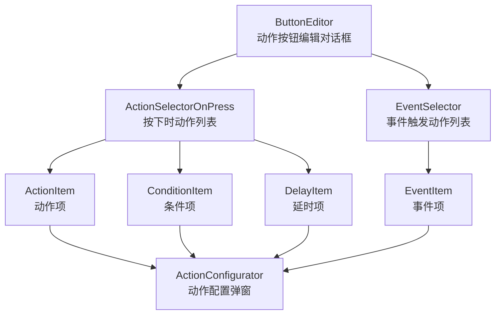
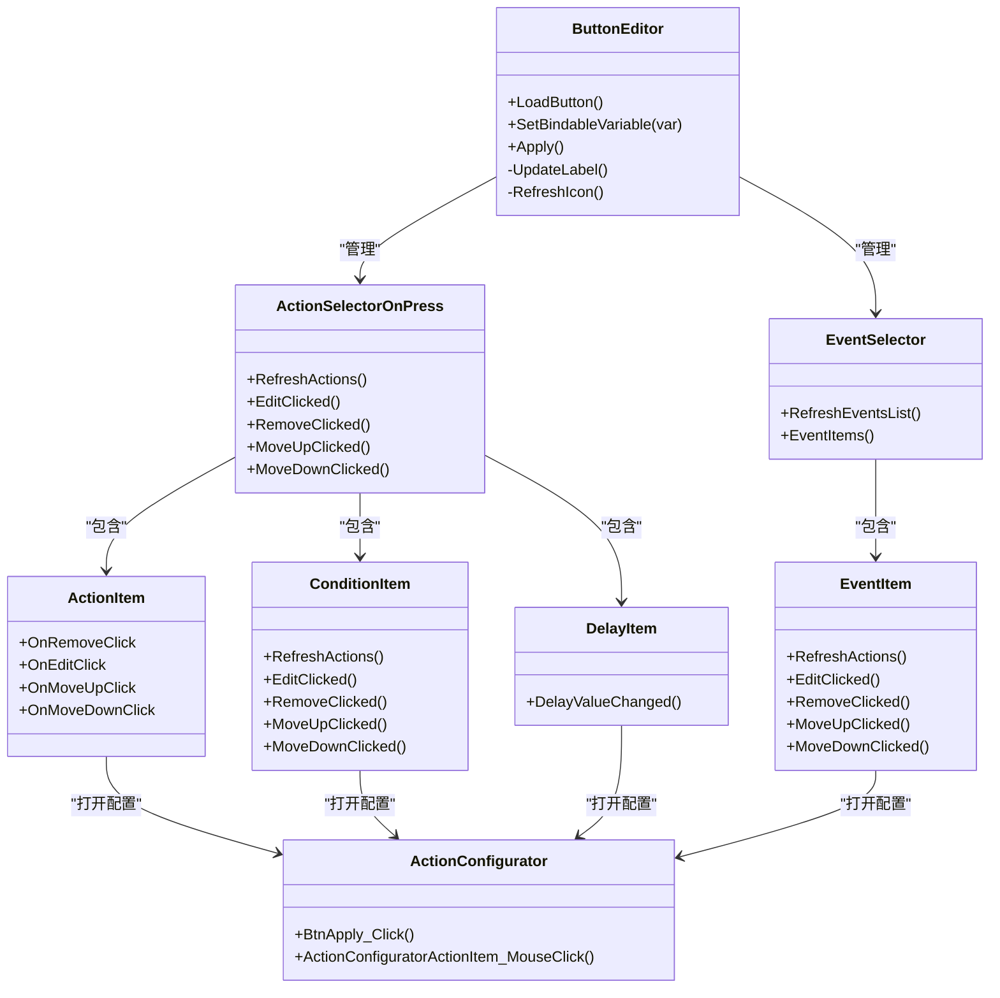
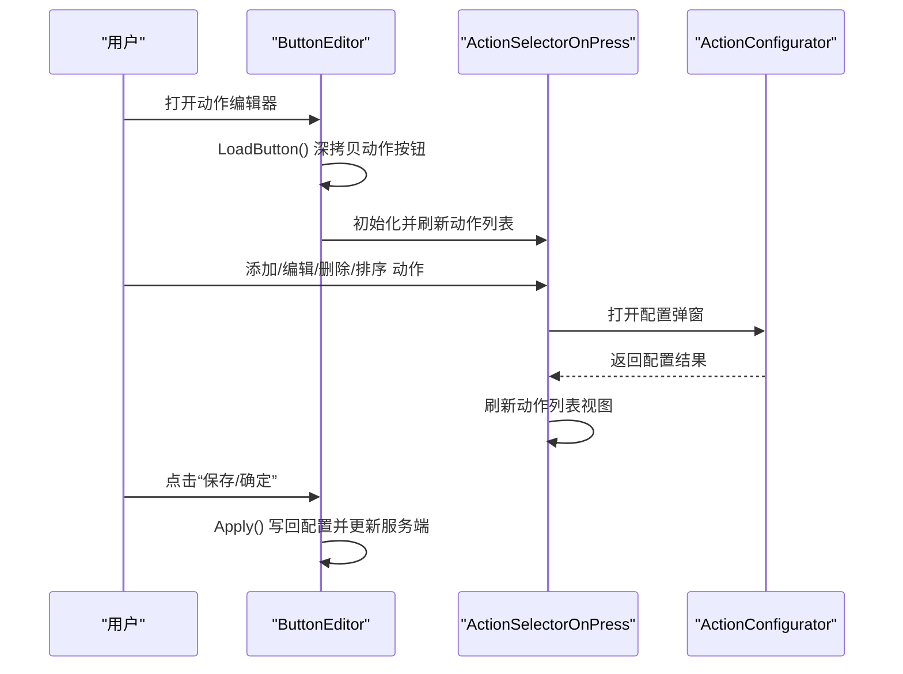
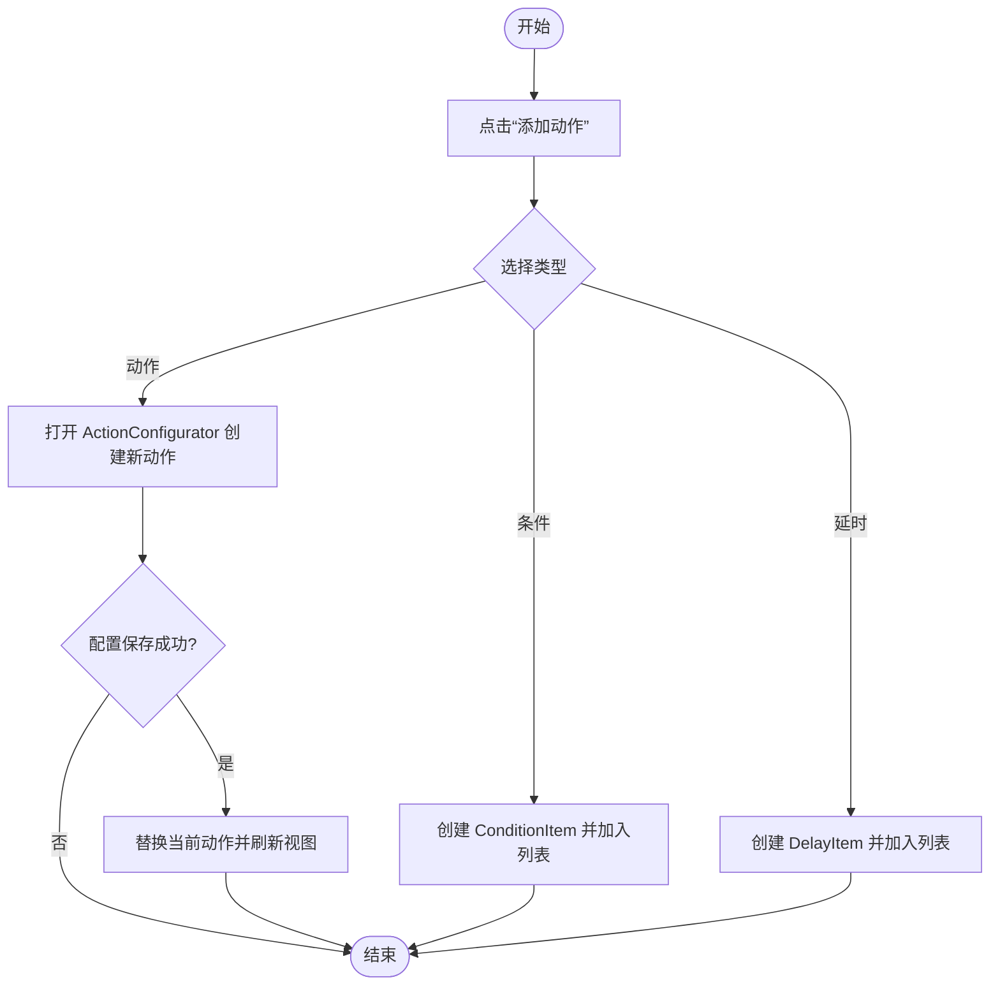
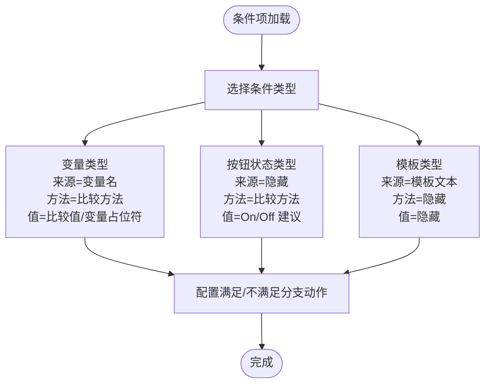
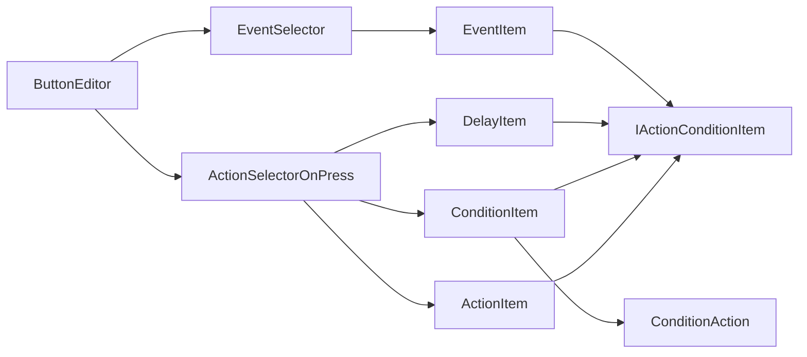

# 动作编辑器

<cite>
**本文引用的文件**   
- [ButtonEditor.cs](file://src/MacroDeck/GUI/Dialogs/ButtonEditor.cs)
- [ActionSelectorOnPress.cs](file://src/MacroDeck/GUI/CustomControls/ButtonEditor/ActionSelectorOnPress.cs)
- [ActionItem.cs](file://src/MacroDeck/GUI/CustomControls/ButtonEditor/ActionItem.cs)
- [ConditionItem.cs](file://src/MacroDeck/GUI/CustomControls/ButtonEditor/ConditionItem.cs)
- [DelayItem.cs](file://src/MacroDeck/GUI/CustomControls/ButtonEditor/DelayItem.cs)
- [EventSelector.cs](file://src/MacroDeck/GUI/CustomControls/ButtonEditor/EventSelector.cs)
- [EventItem.cs](file://src/MacroDeck/GUI/CustomControls/ButtonEditor/EventItem.cs)
- [ActionConfigurator.cs](file://src/MacroDeck/GUI/Dialogs/ActionConfigurator.cs)
- [IActionConditionItem.cs](file://src/MacroDeck/Interfaces/IActionConditionItem.cs)
- [ConditionAction.cs](file://src/MacroDeck/ActionButton/ConditionAction.cs)
</cite>

## 目录
1. [简介](#简介)
2. [项目结构](#项目结构)
3. [核心组件](#核心组件)
4. [架构总览](#架构总览)
5. [组件详解](#组件详解)
6. [依赖关系分析](#依赖关系分析)
7. [性能考量](#性能考量)
8. [故障排查指南](#故障排查指南)
9. [结论](#结论)
10. [附录：使用教程与最佳实践](#附录使用教程与最佳实践)

## 简介
本文件系统性阐述“动作编辑器”的功能与使用方法，重点覆盖：
- ButtonEditor 对话框：动作列表的添加、删除与重新排序；外观与状态绑定；热键与标签预览。
- ActionItem 组件：拖拽式交互（通过上移/下移按钮）、配置面板切换与保存校验。
- ActionSelectorOnPress：插件动作选择、参数配置、条件与延时组合。
- 数据绑定与验证：变量绑定、模板渲染、配置保存校验。
- 使用教程与最佳实践：常见配置场景、错误处理与提示、快捷操作技巧。
- 插件系统集成：ActionConfigurator 如何联动插件与动作类型。

## 项目结构
动作编辑器位于 GUI 层的对话框与自定义控件中，围绕 ButtonEditor 主体组织，内部通过 ActionSelectorOnPress、EventSelector 等子控件管理不同触发类型的“动作列表”。配置流程由 ActionConfigurator 弹窗完成，支持按插件与动作类型筛选并生成配置控件。

**图表来源**
- [ButtonEditor.cs:378-411](file://src/MacroDeck/GUI/Dialogs/ButtonEditor.cs#L378-L411)
- [ActionSelectorOnPress.cs:55-73](file://src/MacroDeck/GUI/CustomControls/ButtonEditor/ActionSelectorOnPress.cs#L55-L73)
- [EventSelector.cs:48-66](file://src/MacroDeck/GUI/CustomControls/ButtonEditor/EventSelector.cs#L48-L66)

**章节来源**
- [ButtonEditor.cs:52-90](file://src/MacroDeck/GUI/Dialogs/ButtonEditor.cs#L52-L90)
- [ActionSelectorOnPress.cs:15-24](file://src/MacroDeck/GUI/CustomControls/ButtonEditor/ActionSelectorOnPress.cs#L15-L24)
- [EventSelector.cs:9-14](file://src/MacroDeck/GUI/CustomControls/ButtonEditor/EventSelector.cs#L9-L14)

## 核心组件
- ButtonEditor：承载动作按钮的外观、状态、热键、标签预览与动作列表管理，并在应用或确认时写回配置。
- ActionSelectorOnPress：管理“按下/释放/长按/长按释放”四类触发下的动作列表，支持增删改与重排。
- ActionItem：单个动作项的 UI 表示，提供移除、编辑、上移、下移事件。
- ConditionItem：条件动作容器，支持变量/按钮状态/模板三种条件类型，分别管理“满足时”和“不满足时”的动作序列。
- DelayItem：延时动作项，以分/秒/毫秒形式配置延迟时长。
- EventSelector/EventItem：事件驱动的动作列表，基于系统已注册事件与参数建议进行配置。
- ActionConfigurator：动作配置弹窗，按插件与动作类型筛选，动态加载对应配置控件并执行保存校验。

**章节来源**
- [ButtonEditor.cs:378-411](file://src/MacroDeck/GUI/Dialogs/ButtonEditor.cs#L378-L411)
- [ActionSelectorOnPress.cs:26-53](file://src/MacroDeck/GUI/CustomControls/ButtonEditor/ActionSelectorOnPress.cs#L26-L53)
- [ActionItem.cs:6-23](file://src/MacroDeck/GUI/CustomControls/ButtonEditor/ActionItem.cs#L6-L23)
- [ConditionItem.cs:11-48](file://src/MacroDeck/GUI/CustomControls/ButtonEditor/ConditionItem.cs#L11-L48)
- [DelayItem.cs:7-47](file://src/MacroDeck/GUI/CustomControls/ButtonEditor/DelayItem.cs#L7-L47)
- [EventSelector.cs:16-25](file://src/MacroDeck/GUI/CustomControls/ButtonEditor/EventSelector.cs#L16-L25)
- [EventItem.cs:10-38](file://src/MacroDeck/GUI/CustomControls/ButtonEditor/EventItem.cs#L10-L38)
- [ActionConfigurator.cs:9-21](file://src/MacroDeck/GUI/Dialogs/ActionConfigurator.cs#L9-L21)

## 架构总览
动作编辑器采用“主对话框 + 多种动作项控件 + 配置弹窗”的分层设计。ButtonEditor 负责整体布局与状态同步，ActionSelectorOnPress/EventSelector 内部聚合具体动作项控件，ActionConfigurator 提供统一的配置入口与校验。

**图表来源**
- [ButtonEditor.cs:378-411](file://src/MacroDeck/GUI/Dialogs/ButtonEditor.cs#L378-L411)
- [ActionSelectorOnPress.cs:55-134](file://src/MacroDeck/GUI/CustomControls/ButtonEditor/ActionSelectorOnPress.cs#L55-L134)
- [EventSelector.cs:48-66](file://src/MacroDeck/GUI/CustomControls/ButtonEditor/EventSelector.cs#L48-L66)
- [ActionItem.cs:6-45](file://src/MacroDeck/GUI/CustomControls/ButtonEditor/ActionItem.cs#L6-L45)
- [ConditionItem.cs:90-287](file://src/MacroDeck/GUI/CustomControls/ButtonEditor/ConditionItem.cs#L90-L287)
- [DelayItem.cs:49-52](file://src/MacroDeck/GUI/CustomControls/ButtonEditor/DelayItem.cs#L49-L52)
- [EventItem.cs:117-209](file://src/MacroDeck/GUI/CustomControls/ButtonEditor/EventItem.cs#L117-L209)
- [ActionConfigurator.cs:135-172](file://src/MacroDeck/GUI/Dialogs/ActionConfigurator.cs#L135-L172)

## 组件详解

### ButtonEditor 对话框
- 加载与复制：深拷贝当前动作按钮，避免直接修改原对象，确保撤销/回滚安全。
- 外观与标签：实时更新标签文本、字号、字体、对齐方式，异步生成位图预览，支持模板渲染。
- 图标与背景色：从图标包选择图标，支持 GIF 指示；背景色可独立设置“开/关”两态。
- 状态绑定：绑定变量名到按钮状态，支持清空与一键设置。
- 热键：支持修改与移除热键，显示修饰键+按键组合。
- 动作列表：为“按下/释放/长按/长按释放”四类分别维护动作列表，切换触发类型即切换右侧配置区。
- 应用与保存：应用时为所有动作设置所属按钮实例，清理重复位置的按钮，写入文件并通知服务端更新。

**图表来源**
- [ButtonEditor.cs:378-411](file://src/MacroDeck/GUI/Dialogs/ButtonEditor.cs#L378-L411)
- [ActionSelectorOnPress.cs:116-134](file://src/MacroDeck/GUI/CustomControls/ButtonEditor/ActionSelectorOnPress.cs#L116-L134)
- [ActionConfigurator.cs:222-244](file://src/MacroDeck/GUI/Dialogs/ActionConfigurator.cs#L222-L244)

**章节来源**
- [ButtonEditor.cs:52-90](file://src/MacroDeck/GUI/Dialogs/ButtonEditor.cs#L52-L90)
- [ButtonEditor.cs:282-336](file://src/MacroDeck/GUI/Dialogs/ButtonEditor.cs#L282-L336)
- [ButtonEditor.cs:378-411](file://src/MacroDeck/GUI/Dialogs/ButtonEditor.cs#L378-L411)

### ActionSelectorOnPress 与 ActionItem
- 动作列表管理：支持添加、编辑、删除、上移、下移；根据类型自动选择 ActionItem/ConditionItem/DelayItem。
- 编辑流程：打开 ActionConfigurator，若配置不可为空且未配置则阻止保存；成功后替换当前动作并刷新视图。
- 可绑定变量：当新增动作返回可绑定变量时，询问是否自动填入状态绑定框。

**图表来源**
- [ActionSelectorOnPress.cs:136-161](file://src/MacroDeck/GUI/CustomControls/ButtonEditor/ActionSelectorOnPress.cs#L136-L161)
- [ActionSelectorOnPress.cs:163-179](file://src/MacroDeck/GUI/CustomControls/ButtonEditor/ActionSelectorOnPress.cs#L163-L179)
- [ActionSelectorOnPress.cs:116-134](file://src/MacroDeck/GUI/CustomControls/ButtonEditor/ActionSelectorOnPress.cs#L116-L134)

**章节来源**
- [ActionSelectorOnPress.cs:26-73](file://src/MacroDeck/GUI/CustomControls/ButtonEditor/ActionSelectorOnPress.cs#L26-L73)
- [ActionSelectorOnPress.cs:75-103](file://src/MacroDeck/GUI/CustomControls/ButtonEditor/ActionSelectorOnPress.cs#L75-L103)
- [ActionSelectorOnPress.cs:105-114](file://src/MacroDeck/GUI/CustomControls/ButtonEditor/ActionSelectorOnPress.cs#L105-L114)
- [ActionSelectorOnPress.cs:116-134](file://src/MacroDeck/GUI/CustomControls/ButtonEditor/ActionSelectorOnPress.cs#L116-L134)
- [ActionSelectorOnPress.cs:136-161](file://src/MacroDeck/GUI/CustomControls/ButtonEditor/ActionSelectorOnPress.cs#L136-L161)
- [ActionItem.cs:6-45](file://src/MacroDeck/GUI/CustomControls/ButtonEditor/ActionItem.cs#L6-L45)

### ConditionItem 条件动作
- 条件类型：变量、按钮状态、模板。
- 方法：等于、不等于、大于、小于等。
- 值比较：支持变量值、布尔建议、状态建议、模板变量占位符。
- 分支动作：满足条件与不满足条件分别维护动作列表，支持在两个分支内进行同样的增删改与重排。

**图表来源**
- [ConditionItem.cs:299-344](file://src/MacroDeck/GUI/CustomControls/ButtonEditor/ConditionItem.cs#L299-L344)
- [ConditionItem.cs:355-384](file://src/MacroDeck/GUI/CustomControls/ButtonEditor/ConditionItem.cs#L355-L384)
- [ConditionItem.cs:386-421](file://src/MacroDeck/GUI/CustomControls/ButtonEditor/ConditionItem.cs#L386-L421)
- [ConditionItem.cs:433-466](file://src/MacroDeck/GUI/CustomControls/ButtonEditor/ConditionItem.cs#L433-L466)

**章节来源**
- [ConditionItem.cs:32-58](file://src/MacroDeck/GUI/CustomControls/ButtonEditor/ConditionItem.cs#L32-L58)
- [ConditionItem.cs:90-175](file://src/MacroDeck/GUI/CustomControls/ButtonEditor/ConditionItem.cs#L90-L175)
- [ConditionItem.cs:177-238](file://src/MacroDeck/GUI/CustomControls/ButtonEditor/ConditionItem.cs#L177-L238)
- [ConditionItem.cs:241-287](file://src/MacroDeck/GUI/CustomControls/ButtonEditor/ConditionItem.cs#L241-L287)

### DelayItem 延时动作
- 配置方式：分/秒/毫秒三列数值控件，变更时同步写入配置字符串（毫秒）。
- 交互：支持上移/下移与删除。

**章节来源**
- [DelayItem.cs:16-47](file://src/MacroDeck/GUI/CustomControls/ButtonEditor/DelayItem.cs#L16-L47)
- [DelayItem.cs:49-52](file://src/MacroDeck/GUI/CustomControls/ButtonEditor/DelayItem.cs#L49-L52)

### EventSelector 与 EventItem
- 事件列表：枚举系统已注册事件，填充事件下拉框；事件参数支持建议项。
- 动作列表：每个事件项维护其动作列表，支持增删改与重排。
- 删除：从按钮的事件监听集合中移除对应事件项。

**章节来源**
- [EventSelector.cs:16-25](file://src/MacroDeck/GUI/CustomControls/ButtonEditor/EventSelector.cs#L16-L25)
- [EventSelector.cs:48-66](file://src/MacroDeck/GUI/CustomControls/ButtonEditor/EventSelector.cs#L48-L66)
- [EventItem.cs:47-87](file://src/MacroDeck/GUI/CustomControls/ButtonEditor/EventItem.cs#L47-L87)
- [EventItem.cs:117-171](file://src/MacroDeck/GUI/CustomControls/ButtonEditor/EventItem.cs#L117-L171)
- [EventItem.cs:174-187](file://src/MacroDeck/GUI/CustomControls/ButtonEditor/EventItem.cs#L174-L187)

### ActionConfigurator 动作配置弹窗
- 插件与动作筛选：按插件展开/折叠，按动作类型选择；支持搜索过滤。
- 配置控件：若动作可配置，则动态加载其配置控件；否则显示“无需配置”提示。
- 保存校验：调用配置控件的保存回调，若失败则阻止关闭；最终写回 Action 实例。

**章节来源**
- [ActionConfigurator.cs:98-133](file://src/MacroDeck/GUI/Dialogs/ActionConfigurator.cs#L98-L133)
- [ActionConfigurator.cs:135-172](file://src/MacroDeck/GUI/Dialogs/ActionConfigurator.cs#L135-L172)
- [ActionConfigurator.cs:222-244](file://src/MacroDeck/GUI/Dialogs/ActionConfigurator.cs#L222-L244)

## 依赖关系分析
- ButtonEditor 依赖 ActionSelectorOnPress、EventSelector 管理动作列表；依赖 ActionConfigurator 进行动作配置。
- ActionSelectorOnPress 依赖 ActionItem、ConditionItem、DelayItem 渲染不同类型动作项。
- EventSelector 依赖 EventItem 渲染事件动作项。
- ActionItem/ConditionItem/DelayItem/EventItem 依赖 IActionConditionItem 接口实现统一的事件与交互协议。
- ConditionAction 作为条件动作的核心逻辑，负责条件判断与分支触发。

**图表来源**
- [ButtonEditor.cs:378-411](file://src/MacroDeck/GUI/Dialogs/ButtonEditor.cs#L378-L411)
- [ActionSelectorOnPress.cs:26-53](file://src/MacroDeck/GUI/CustomControls/ButtonEditor/ActionSelectorOnPress.cs#L26-L53)
- [EventSelector.cs:48-66](file://src/MacroDeck/GUI/CustomControls/ButtonEditor/EventSelector.cs#L48-L66)
- [IActionConditionItem.cs:5-12](file://src/MacroDeck/Interfaces/IActionConditionItem.cs#L5-L12)
- [ConditionAction.cs:152-188](file://src/MacroDeck/ActionButton/ConditionAction.cs#L152-L188)

**章节来源**
- [IActionConditionItem.cs:5-12](file://src/MacroDeck/Interfaces/IActionConditionItem.cs#L5-L12)
- [ConditionAction.cs:152-188](file://src/MacroDeck/ActionButton/ConditionAction.cs#L152-L188)

## 性能考量
- 标签预览：异步生成位图并缓存 Base64，避免主线程阻塞；注意在对话框关闭时释放 GDI 资源。
- 列表刷新：批量暂停布局后再恢复，减少频繁重绘。
- 配置控件：仅在需要时加载，避免不必要的初始化成本。

[本节为通用指导，不直接分析具体文件]

## 故障排查指南
- 标签预览异常：检查模板渲染与字体资源可用性；确认颜色与尺寸参数有效。
- 动作配置无法保存：ActionConfigurator 在保存前会调用配置控件的保存回调，若返回失败则阻止关闭；请检查配置控件的输入合法性。
- 条件动作不生效：确认条件类型、比较方法与值比较正确；模板条件需先渲染再比较。
- 事件参数无效：事件参数来自系统建议，若不在建议列表中，请先添加到事件监听项。

**章节来源**
- [ButtonEditor.cs:122-174](file://src/MacroDeck/GUI/Dialogs/ButtonEditor.cs#L122-L174)
- [ActionConfigurator.cs:226-233](file://src/MacroDeck/GUI/Dialogs/ActionConfigurator.cs#L226-L233)
- [ConditionItem.cs:355-384](file://src/MacroDeck/GUI/CustomControls/ButtonEditor/ConditionItem.cs#L355-L384)
- [EventItem.cs:71-87](file://src/MacroDeck/GUI/CustomControls/ButtonEditor/EventItem.cs#L71-L87)

## 结论
动作编辑器通过清晰的职责划分与统一的配置入口，实现了对多种触发类型与动作类型的灵活编排。借助条件与延时的组合，用户可以构建复杂的自动化流程；通过状态绑定与模板渲染，进一步提升了配置的灵活性与可维护性。建议在复杂场景中优先使用条件动作与延时动作，并结合变量绑定与模板编辑，以获得更佳的使用体验。

[本节为总结性内容，不直接分析具体文件]

## 附录：使用教程与最佳实践

### 快速开始
- 打开 ButtonEditor，选择“按下/释放/长按/长按释放/事件”任一触发类型，右侧配置区即切换为对应动作列表。
- 点击“添加动作”，在 ActionConfigurator 中选择插件与动作类型，按需填写配置并保存。

**章节来源**
- [ButtonEditor.cs:534-572](file://src/MacroDeck/GUI/Dialogs/ButtonEditor.cs#L534-L572)
- [ActionSelectorOnPress.cs:136-161](file://src/MacroDeck/GUI/CustomControls/ButtonEditor/ActionSelectorOnPress.cs#L136-L161)

### 常见配置场景
- 按钮状态切换：使用内部插件中的“切换/置为 On/置为 Off”动作，配合状态绑定实现联动。
- 条件执行：在条件动作中设置变量/按钮状态/模板条件，分别配置“满足时”和“不满足时”的动作序列。
- 延时控制：在动作之间插入延时动作，微调执行节奏。
- 事件驱动：为特定系统事件绑定一组动作，事件参数可选建议项。

**章节来源**
- [ConditionItem.cs:299-344](file://src/MacroDeck/GUI/CustomControls/ButtonEditor/ConditionItem.cs#L299-L344)
- [DelayItem.cs:16-47](file://src/MacroDeck/GUI/CustomControls/ButtonEditor/DelayItem.cs#L16-L47)
- [EventItem.cs:47-87](file://src/MacroDeck/GUI/CustomControls/ButtonEditor/EventItem.cs#L47-L87)

### 数据绑定与验证
- 变量绑定：在状态绑定下拉框中选择变量，或通过“添加变量”快捷菜单插入变量占位符。
- 模板渲染：标签文本支持模板语法，可在预览中即时查看渲染效果。
- 配置校验：ActionConfigurator 在保存时调用配置控件的保存回调，确保配置合法后才写回。

**章节来源**
- [ButtonEditor.cs:498-522](file://src/MacroDeck/GUI/Dialogs/ButtonEditor.cs#L498-L522)
- [ButtonEditor.cs:580-587](file://src/MacroDeck/GUI/Dialogs/ButtonEditor.cs#L580-L587)
- [ActionConfigurator.cs:226-233](file://src/MacroDeck/GUI/Dialogs/ActionConfigurator.cs#L226-L233)

### 交互与效率技巧
- 上移/下移：在动作项中使用“上移/下移”按钮快速调整顺序，尤其适用于延时与条件分支。
- 批量编辑：先在“满足时”分支完成主要逻辑，再复制到“不满足时”分支进行差异化配置。
- 快速变量插入：在标签文本中使用“添加变量”菜单，将变量占位符插入光标位置。
- 热键绑定：为常用动作绑定热键，提高操作效率。

**章节来源**
- [ActionItem.cs:36-44](file://src/MacroDeck/GUI/CustomControls/ButtonEditor/ActionItem.cs#L36-L44)
- [ConditionItem.cs:423-431](file://src/MacroDeck/GUI/CustomControls/ButtonEditor/ConditionItem.cs#L423-L431)
- [ButtonEditor.cs:597-610](file://src/MacroDeck/GUI/Dialogs/ButtonEditor.cs#L597-L610)