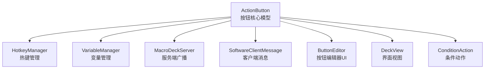
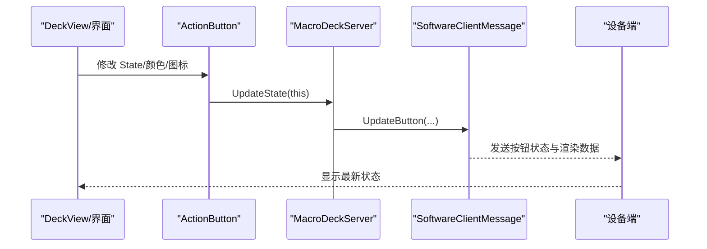
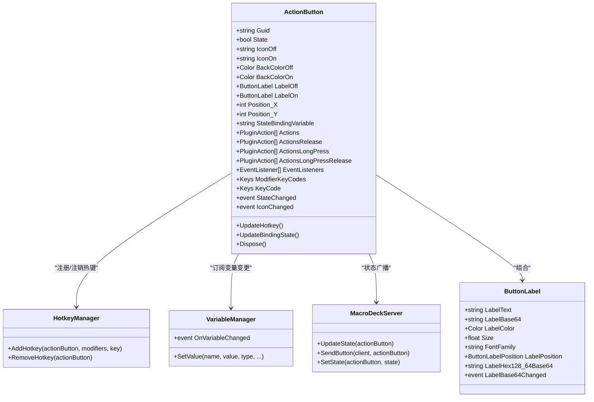
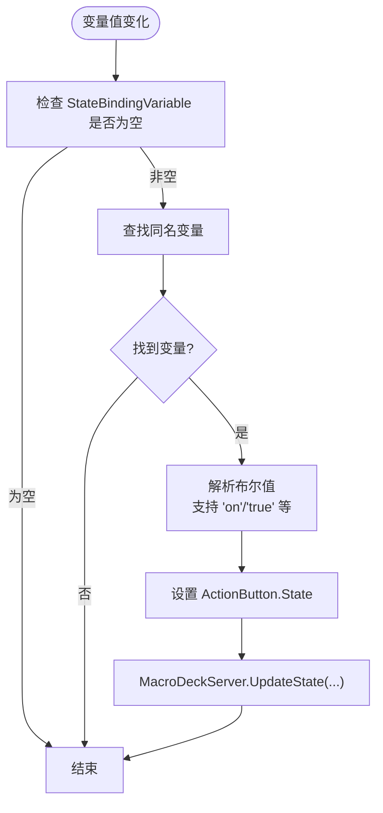
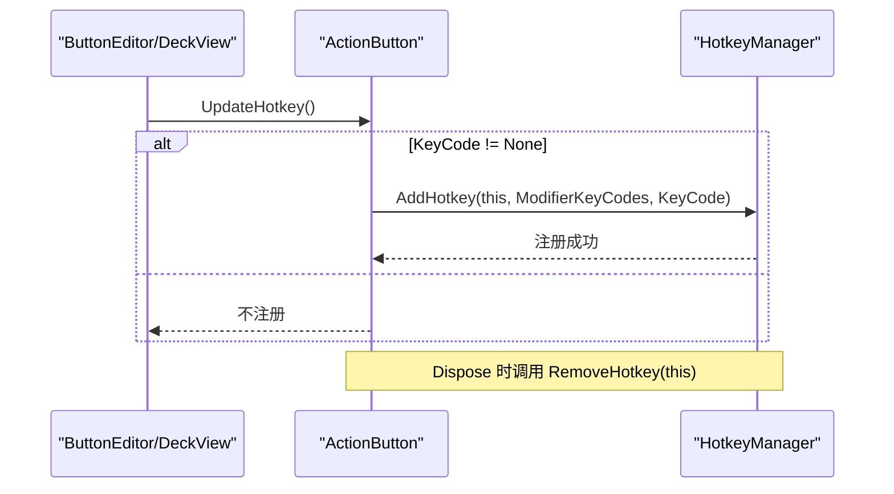
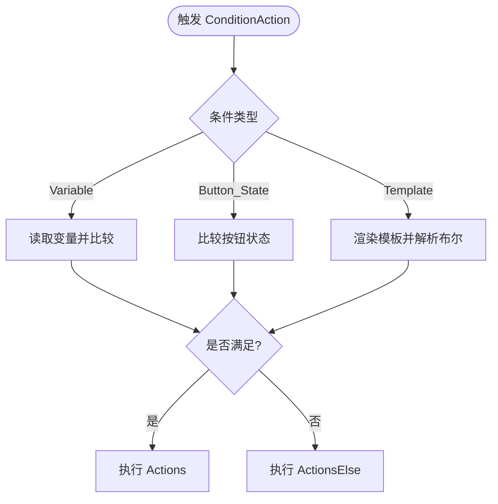
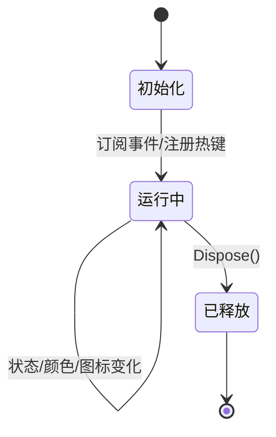
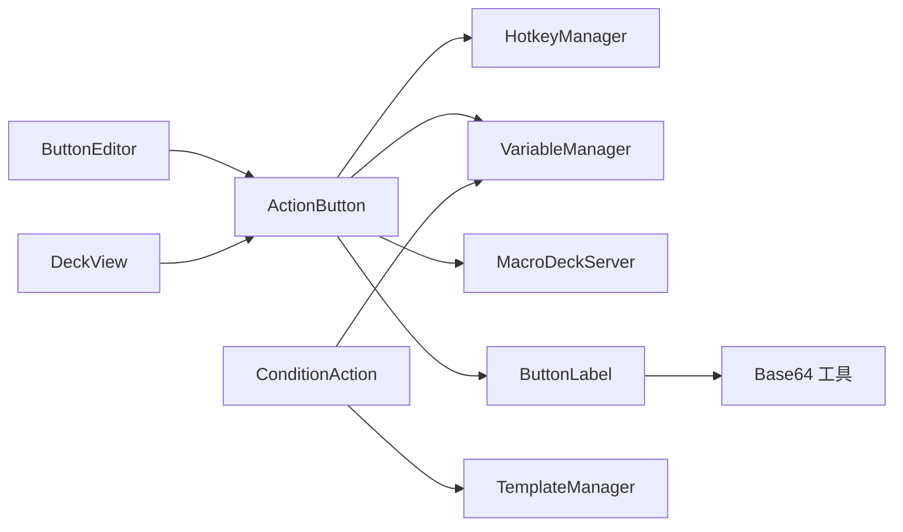

# 按钮创建与配置

<cite>
**本文引用的文件列表**
- [ActionButton.cs](file://src/MacroDeck/ActionButton/ActionButton.cs)
- [ButtonLabel.cs](file://src/MacroDeck/ActionButton/ButtonLabel.cs)
- [ConditionAction.cs](file://src/MacroDeck/ActionButton/ConditionAction.cs)
- [HotkeyManager.cs](file://src/MacroDeck/Hotkeys/HotkeyManager.cs)
- [VariableManager.cs](file://src/MacroDeck/Variables/VariableManager.cs)
- [MacroDeckServer.cs](file://src/MacroDeck/Server/MacroDeckServer.cs)
- [ButtonEditor.cs](file://src/MacroDeck/GUI/Dialogs/ButtonEditor.cs)
- [DeckView.cs](file://src/MacroDeck/MainWindowViews/DeckView.cs)
- [SoftwareClientMessage.cs](file://src/MacroDeck/Server/DeviceMessage/SoftwareClientMessage.cs)
- [ActionButtonPlugin.cs](file://src/MacroDeck/InternalPlugins/ActionButtonPlugin/ActionButtonPlugin.cs)
</cite>

## 目录
1. [简介](#简介)
2. [项目结构](#项目结构)
3. [核心组件](#核心组件)
4. [架构总览](#架构总览)
5. [详细组件分析](#详细组件分析)
6. [依赖关系分析](#依赖关系分析)
7. [性能考量](#性能考量)
8. [故障排查指南](#故障排查指南)
9. [结论](#结论)
10. [附录：基础配置示例与最佳实践](#附录基础配置示例与最佳实践)

## 简介
本文件面向希望在 Macro-Deck 中创建与配置按钮的开发者与高级用户，系统性讲解 ActionButton 类的核心属性与方法，包括按钮标识符、状态管理、图标与颜色配置、位置属性与布局管理、状态绑定机制、生命周期管理、热键集成以及常见配置模式。文档同时提供可视化图示与分层说明，帮助初学者快速上手并理解底层实现。

## 项目结构
ActionButton 所在模块位于 src/MacroDeck/ActionButton 下，围绕按钮的配置、状态、事件与渲染展开；同时通过 HotkeyManager、VariableManager、MacroDeckServer 等模块实现热键注册、变量绑定与设备端渲染同步。

图表来源
- [ActionButton.cs:10-197](file://src/MacroDeck/ActionButton/ActionButton.cs#L10-L197)
- [HotkeyManager.cs:8-95](file://src/MacroDeck/Hotkeys/HotkeyManager.cs#L8-L95)
- [VariableManager.cs:10-200](file://src/MacroDeck/Variables/VariableManager.cs#L10-L200)
- [MacroDeckServer.cs:16-375](file://src/MacroDeck/Server/MacroDeckServer.cs#L16-L375)
- [SoftwareClientMessage.cs:10-137](file://src/MacroDeck/Server/DeviceMessage/SoftwareClientMessage.cs#L10-L137)
- [ButtonEditor.cs:281-323](file://src/MacroDeck/Gui/Dialogs/ButtonEditor.cs#L281-L323)
- [DeckView.cs:333-363](file://src/MacroDeck/MainWindowViews/DeckView.cs#L333-L363)
- [ConditionAction.cs:11-273](file://src/MacroDeck/ActionButton/ConditionAction.cs#L11-L273)

章节来源
- [ActionButton.cs:10-197](file://src/MacroDeck/ActionButton/ActionButton.cs#L10-L197)
- [HotkeyManager.cs:8-95](file://src/MacroDeck/Hotkeys/HotkeyManager.cs#L8-L95)
- [VariableManager.cs:10-200](file://src/MacroDeck/Variables/VariableManager.cs#L10-L200)
- [MacroDeckServer.cs:16-375](file://src/MacroDeck/Server/MacroDeckServer.cs#L16-L375)
- [SoftwareClientMessage.cs:10-137](file://src/MacroDeck/Server/DeviceMessage/SoftwareClientMessage.cs#L10-L137)
- [ButtonEditor.cs:281-323](file://src/MacroDeck/Gui/Dialogs/ButtonEditor.cs#L281-L323)
- [DeckView.cs:333-363](file://src/MacroDeck/MainWindowViews/DeckView.cs#L333-L363)
- [ConditionAction.cs:11-273](file://src/MacroDeck/ActionButton/ConditionAction.cs#L11-L273)

## 核心组件
- ActionButton：按钮核心数据模型与行为控制点，负责状态、图标、颜色、标签、位置、热键、事件监听与生命周期管理。
- ButtonLabel：按钮标签文本与渲染，支持不同位置、字体、字号、颜色，并生成设备端所需的位图数据。
- ConditionAction：条件动作，根据变量、按钮状态或模板结果执行不同的动作序列。
- HotkeyManager：系统级热键注册与注销，将按键映射到具体 ActionButton 实例。
- VariableManager：全局变量存储与变更通知，驱动按钮状态绑定。
- MacroDeckServer：服务端广播中心，负责将按钮状态变化推送到所有连接的客户端。
- ButtonEditor/DeckView：UI 层对 ActionButton 的编辑与显示，处理事件订阅与热键指示。

章节来源
- [ActionButton.cs:10-197](file://src/MacroDeck/ActionButton/ActionButton.cs#L10-L197)
- [ButtonLabel.cs:6-69](file://src/MacroDeck/ActionButton/ButtonLabel.cs#L6-L69)
- [ConditionAction.cs:11-273](file://src/MacroDeck/ActionButton/ConditionAction.cs#L11-L273)
- [HotkeyManager.cs:8-95](file://src/MacroDeck/Hotkeys/HotkeyManager.cs#L8-L95)
- [VariableManager.cs:10-200](file://src/MacroDeck/Variables/VariableManager.cs#L10-L200)
- [MacroDeckServer.cs:16-375](file://src/MacroDeck/Server/MacroDeckServer.cs#L16-L375)
- [ButtonEditor.cs:281-323](file://src/MacroDeck/Gui/Dialogs/ButtonEditor.cs#L281-L323)
- [DeckView.cs:333-363](file://src/MacroDeck/MainWindowViews/DeckView.cs#L333-L363)

## 架构总览
ActionButton 在运行时与多个子系统协作：
- 状态变更：当 State 或背景色等属性被修改时，触发 MacroDeckServer 广播，使设备端同步更新。
- 热键：通过 UpdateHotkey 将修饰键与主键注册到系统热键，由 HotkeyManager 统一管理。
- 变量绑定：通过 StateBindingVariable 与 VariableManager 的 OnVariableChanged 事件联动，实现外部变量驱动的自动状态更新。
- 条件动作：ConditionAction 支持基于变量、按钮状态或模板表达式的条件判断，分别执行“是/否”分支的动作序列。
- UI 同步：DeckView 订阅按钮事件并在界面上显示热键指示与图标变化。

图表来源
- [ActionButton.cs:114-181](file://src/MacroDeck/ActionButton/ActionButton.cs#L114-L181)
- [MacroDeckServer.cs:345-352](file://src/MacroDeck/Server/MacroDeckServer.cs#L345-L352)
- [SoftwareClientMessage.cs:124-137](file://src/MacroDeck/Server/DeviceMessage/SoftwareClientMessage.cs#L124-L137)
- [DeckView.cs:333-363](file://src/MacroDeck/MainWindowViews/DeckView.cs#L333-L363)

## 详细组件分析

### ActionButton 类详解
- 标识符与事件
  - Guid：唯一标识符，用于跨会话识别按钮实例。
  - StateChanged/IconChanged：状态与图标变化事件，供 UI 与其它组件订阅。
- 状态管理
  - State：布尔状态，修改时调用 MacroDeckServer.UpdateState 并触发 StateChanged。
  - BackColorOff/BackColorOn：分别对应“关/开”状态的背景色，修改后同样触发更新。
- 图标与标签
  - IconOff/IconOn：分别对应“关/开”状态的图标名称（或路径），修改后触发 IconChanged。
  - LabelOff/LabelOn：分别对应“关/开”状态的标签对象，包含文本、颜色、字号、字体与位置。
- 位置属性与布局
  - Position_X/Position_Y：整数坐标，用于定位按钮在设备网格中的位置。-1 表示未设置。
- 状态绑定机制
  - StateBindingVariable：绑定一个变量名，当该变量值变化时，自动解析为布尔状态并更新按钮 State。
  - 内部逻辑：VariableManager.OnVariableChanged 触发 -> 查找同名变量 -> 解析布尔值 -> 设置 State。
- 生命周期管理
  - 构造函数：订阅 VariableManager.OnVariableChanged。
  - Dispose：移除热键、取消变量事件订阅、调用各插件动作的 OnActionButtonDelete 回调，防止内存泄漏。
  - 析构函数：兜底释放。
- 热键集成
  - UpdateHotkey：若 KeyCode 非 None，则调用 HotkeyManager.AddHotkey 注册热键。
  - 热键注销：在 Dispose 中调用 HotkeyManager.RemoveHotkey。
- 动作与事件
  - Actions/ActionsRelease/ActionsLongPress/ActionsLongPressRelease：分别对应短按、释放、长按、长按释放的动作集合。
  - EventListeners：事件监听器集合，每个监听器内部也维护动作列表，删除时统一回调 OnActionButtonDelete。

图表来源
- [ActionButton.cs:10-197](file://src/MacroDeck/ActionButton/ActionButton.cs#L10-L197)
- [ButtonLabel.cs:6-69](file://src/MacroDeck/ActionButton/ButtonLabel.cs#L6-L69)
- [HotkeyManager.cs:34-89](file://src/MacroDeck/Hotkeys/HotkeyManager.cs#L34-L89)
- [VariableManager.cs:16-138](file://src/MacroDeck/Variables/VariableManager.cs#L16-L138)
- [MacroDeckServer.cs:345-352](file://src/MacroDeck/Server/MacroDeckServer.cs#L345-L352)

章节来源
- [ActionButton.cs:10-197](file://src/MacroDeck/ActionButton/ActionButton.cs#L10-L197)
- [ButtonLabel.cs:6-69](file://src/MacroDeck/ActionButton/ButtonLabel.cs#L6-L69)
- [HotkeyManager.cs:34-89](file://src/MacroDeck/Hotkeys/HotkeyManager.cs#L34-L89)
- [VariableManager.cs:16-138](file://src/MacroDeck/Variables/VariableManager.cs#L16-L138)
- [MacroDeckServer.cs:345-352](file://src/MacroDeck/Server/MacroDeckServer.cs#L345-L352)

### 状态绑定流程（变量驱动）
当按钮设置了 StateBindingVariable 后，按钮会自动响应该变量的变化：
- 变量值变化 -> VariableManager.OnVariableChanged -> ActionButton.VariableChanged -> UpdateBindingState -> 解析布尔值 -> 设置 State -> 触发 MacroDeckServer.UpdateState -> 设备端同步。

图表来源
- [ActionButton.cs:80-107](file://src/MacroDeck/ActionButton/ActionButton.cs#L80-L107)
- [VariableManager.cs:16-138](file://src/MacroDeck/Variables/VariableManager.cs#L16-L138)
- [MacroDeckServer.cs:345-352](file://src/MacroDeck/Server/MacroDeckServer.cs#L345-L352)

章节来源
- [ActionButton.cs:80-107](file://src/MacroDeck/ActionButton/ActionButton.cs#L80-L107)
- [VariableManager.cs:16-138](file://src/MacroDeck/Variables/VariableManager.cs#L16-L138)
- [MacroDeckServer.cs:345-352](file://src/MacroDeck/Server/MacroDeckServer.cs#L345-L352)

### 热键系统集成
- UpdateHotkey：当 KeyCode 非 None 时，调用 HotkeyManager.AddHotkey 注册热键；否则不注册。
- 热键注销：在按钮销毁时调用 HotkeyManager.RemoveHotkey，避免残留热键。
- UI 展示：DeckView 根据按钮 KeyCode 更新键盘热键指示器文本。

图表来源
- [ActionButton.cs:20-26](file://src/MacroDeck/ActionButton/ActionButton.cs#L20-L26)
- [HotkeyManager.cs:34-89](file://src/MacroDeck/Hotkeys/HotkeyManager.cs#L34-L89)
- [DeckView.cs:343-351](file://src/MacroDeck/MainWindowViews/DeckView.cs#L343-L351)

章节来源
- [ActionButton.cs:20-26](file://src/MacroDeck/ActionButton/ActionButton.cs#L20-L26)
- [HotkeyManager.cs:34-89](file://src/MacroDeck/Hotkeys/HotkeyManager.cs#L34-L89)
- [DeckView.cs:343-351](file://src/MacroDeck/MainWindowViews/DeckView.cs#L343-L351)

### 条件动作（ConditionAction）
- 支持三种条件类型：
  - Variable：比较变量值与目标值（等于/不等于/大于/小于）。
  - Button_State：比较按钮当前状态（on/true 或 off/false）。
  - Template：使用模板引擎渲染字符串并尝试解析为布尔值。
- 分支执行：满足条件则执行 Actions，否则执行 ActionsElse。

图表来源
- [ConditionAction.cs:163-256](file://src/MacroDeck/ActionButton/ConditionAction.cs#L163-L256)

章节来源
- [ConditionAction.cs:11-273](file://src/MacroDeck/ActionButton/ConditionAction.cs#L11-L273)

### 生命周期管理
- 初始化：构造函数订阅变量变更事件。
- 运行期：状态/颜色/图标变化时触发广播；热键注册/注销；事件监听器动作回调。
- 资源清理：Dispose 中移除热键、取消变量事件订阅、调用 OnActionButtonDelete，最后标记已释放。

图表来源
- [ActionButton.cs:15-78](file://src/MacroDeck/ActionButton/ActionButton.cs#L15-L78)

章节来源
- [ActionButton.cs:15-78](file://src/MacroDeck/ActionButton/ActionButton.cs#L15-L78)

## 依赖关系分析
- ActionButton 对 HotkeyManager、VariableManager、MacroDeckServer 存在直接依赖，用于热键注册、变量绑定与状态广播。
- ButtonLabel 依赖工具类 Base64 以生成设备端可用的位图数据。
- ButtonEditor/DeckView 作为 UI 层，负责订阅 ActionButton 事件并更新界面显示。
- ConditionAction 依赖 VariableManager 与 TemplateManager 完成条件判断。

图表来源
- [ActionButton.cs:1-7](file://src/MacroDeck/ActionButton/ActionButton.cs#L1-L7)
- [ButtonLabel.cs:1-2](file://src/MacroDeck/ActionButton/ButtonLabel.cs#L1-L2)
- [ButtonEditor.cs:281-323](file://src/MacroDeck/Gui/Dialogs/ButtonEditor.cs#L281-L323)
- [DeckView.cs:333-363](file://src/MacroDeck/MainWindowViews/DeckView.cs#L333-L363)
- [ConditionAction.cs:3-7](file://src/MacroDeck/ActionButton/ConditionAction.cs#L3-L7)

章节来源
- [ActionButton.cs:1-7](file://src/MacroDeck/ActionButton/ActionButton.cs#L1-L7)
- [ButtonLabel.cs:1-2](file://src/MacroDeck/ActionButton/ButtonLabel.cs#L1-L2)
- [ButtonEditor.cs:281-323](file://src/MacroDeck/Gui/Dialogs/ButtonEditor.cs#L281-L323)
- [DeckView.cs:333-363](file://src/MacroDeck/MainWindowViews/DeckView.cs#L333-L363)
- [ConditionAction.cs:3-7](file://src/MacroDeck/ActionButton/ConditionAction.cs#L3-L7)

## 性能考量
- 状态广播：每次状态/颜色/图标变化都会触发 MacroDeckServer.UpdateState，可能引发大量设备端渲染。建议在批量更新时合并操作，减少频繁广播。
- 热键注册：系统热键注册/注销为轻量操作，但频繁切换仍需注意 UI 线程与后台线程的协调。
- 变量绑定：变量变更事件可能频繁触发，应避免在事件处理器中进行重计算或阻塞操作。
- 标签渲染：ButtonLabel 的位图生成涉及图像处理，建议缓存或延迟生成，避免在高频刷新场景下造成卡顿。

## 故障排查指南
- 按钮状态不更新
  - 检查 StateBindingVariable 是否正确设置且变量存在。
  - 确认 VariableManager.OnVariableChanged 是否正常触发。
  - 排查 MacroDeckServer.UpdateState 是否被调用。
- 热键无效
  - 确认 KeyCode 非 None，且 UpdateHotkey 已调用。
  - 检查 HotkeyManager.AddHotkey 是否成功注册。
  - 关闭应用后确认 Dispose 是否调用 RemoveHotkey。
- 图标/标签不显示
  - 检查 IconOff/IconOn 与 LabelOff/LabelOn 的 Base64 数据是否有效。
  - 确认 ButtonLabel 的 LabelHex128_64Base64 生成流程无异常。
- UI 不显示热键指示
  - 检查 DeckView 是否订阅了按钮的 IconChanged 与 StateChanged 事件。

章节来源
- [ActionButton.cs:20-26](file://src/MacroDeck/ActionButton/ActionButton.cs#L20-L26)
- [HotkeyManager.cs:34-89](file://src/MacroDeck/Hotkeys/HotkeyManager.cs#L34-L89)
- [VariableManager.cs:16-138](file://src/MacroDeck/Variables/VariableManager.cs#L16-L138)
- [MacroDeckServer.cs:345-352](file://src/MacroDeck/Server/MacroDeckServer.cs#L345-L352)
- [ButtonLabel.cs:48-60](file://src/MacroDeck/ActionButton/ButtonLabel.cs#L48-L60)
- [DeckView.cs:333-363](file://src/MacroDeck/MainWindowViews/DeckView.cs#L333-L363)

## 结论
ActionButton 提供了完整的按钮生命周期、状态管理、热键与变量绑定能力，并通过 MacroDeckServer 与设备端保持一致的渲染状态。结合 ButtonLabel 的标签渲染与 ConditionAction 的条件判断，可构建灵活的交互式按钮系统。合理使用这些能力，可以高效地实现从简单开关到复杂条件分支的各类按钮功能。

## 附录：基础配置示例与最佳实践

### 基础概念与必需属性
- 必需属性
  - Guid：按钮唯一标识，便于持久化与跨会话识别。
  - Position_X/Position_Y：按钮在设备网格中的位置，-1 表示未设置。
  - StateBindingVariable：可选，用于将按钮状态绑定到某个变量，实现外部驱动。
- 常用设置
  - IconOff/IconOn：分别设置“关/开”状态的图标名称。
  - BackColorOff/BackColorOn：分别设置“关/开”状态的背景色。
  - LabelOff/LabelOn：分别设置“关/开”状态的标签文本、颜色、字号与字体。
  - ModifierKeyCodes/KeyCode：设置热键组合，配合 UpdateHotkey 使用。

章节来源
- [ActionButton.cs:109-196](file://src/MacroDeck/ActionButton/ActionButton.cs#L109-L196)
- [ButtonLabel.cs:13-32](file://src/MacroDeck/ActionButton/ButtonLabel.cs#L13-L32)

### 生命周期与资源清理
- 初始化：在构造函数中订阅变量变更事件。
- 运行期：修改状态/颜色/图标会触发广播；注册热键；事件监听器动作回调。
- 清理：在 Dispose 中移除热键、取消变量事件订阅、调用 OnActionButtonDelete。

章节来源
- [ActionButton.cs:15-78](file://src/MacroDeck/ActionButton/ActionButton.cs#L15-L78)

### 热键集成步骤
- 设置 ModifierKeyCodes 与 KeyCode。
- 调用 UpdateHotkey 注册热键。
- 在 UI 中显示热键指示（DeckView 会根据 KeyCode 自动更新）。
- 应用关闭或按钮删除时确保调用 RemoveHotkey。

章节来源
- [ActionButton.cs:20-26](file://src/MacroDeck/ActionButton/ActionButton.cs#L20-L26)
- [HotkeyManager.cs:34-89](file://src/MacroDeck/Hotkeys/HotkeyManager.cs#L34-L89)
- [DeckView.cs:343-351](file://src/MacroDeck/MainWindowViews/DeckView.cs#L343-L351)

### 状态绑定机制
- 设置 StateBindingVariable 为某变量名。
- 当该变量值变化时，ActionButton 自动解析为布尔状态并更新按钮。
- 若变量值为 "on"/"true" 等，将转换为 true；否则尝试 bool.Parse。

章节来源
- [ActionButton.cs:80-107](file://src/MacroDeck/ActionButton/ActionButton.cs#L80-L107)
- [VariableManager.cs:16-138](file://src/MacroDeck/Variables/VariableManager.cs#L16-L138)

### 按钮动作与事件
- Actions/ActionsRelease/ActionsLongPress/ActionsLongPressRelease：分别绑定不同按键事件的动作序列。
- EventListeners：事件监听器集合，每个监听器内部维护动作列表，删除时统一回调 OnActionButtonDelete。

章节来源
- [ActionButton.cs:190-196](file://src/MacroDeck/ActionButton/ActionButton.cs#L190-L196)
- [ButtonEditor.cs:288-321](file://src/MacroDeck/Gui/Dialogs/ButtonEditor.cs#L288-L321)

### 内置按钮动作插件
- ActionButtonPlugin 提供一组内置动作，如切换状态、设置状态、设置背景色等，便于快速配置按钮行为。

章节来源
- [ActionButtonPlugin.cs:10-25](file://src/MacroDeck/InternalPlugins/ActionButtonPlugin/ActionButtonPlugin.cs#L10-L25)