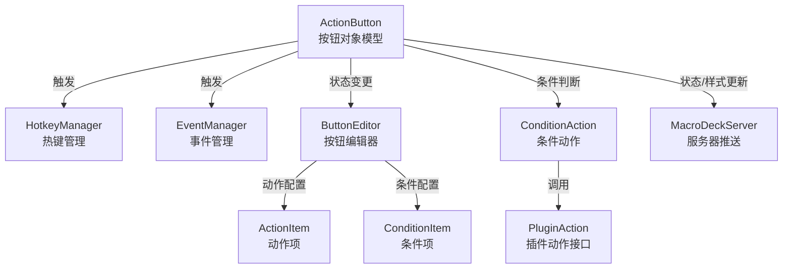
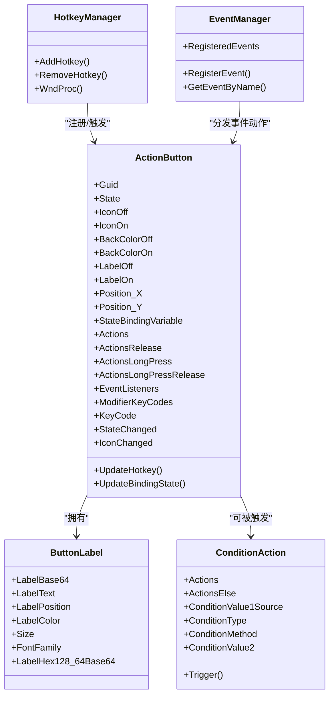
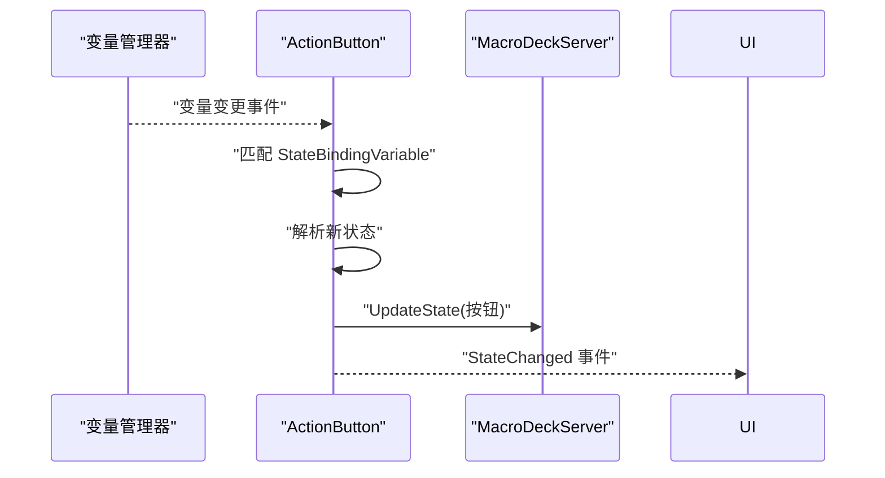
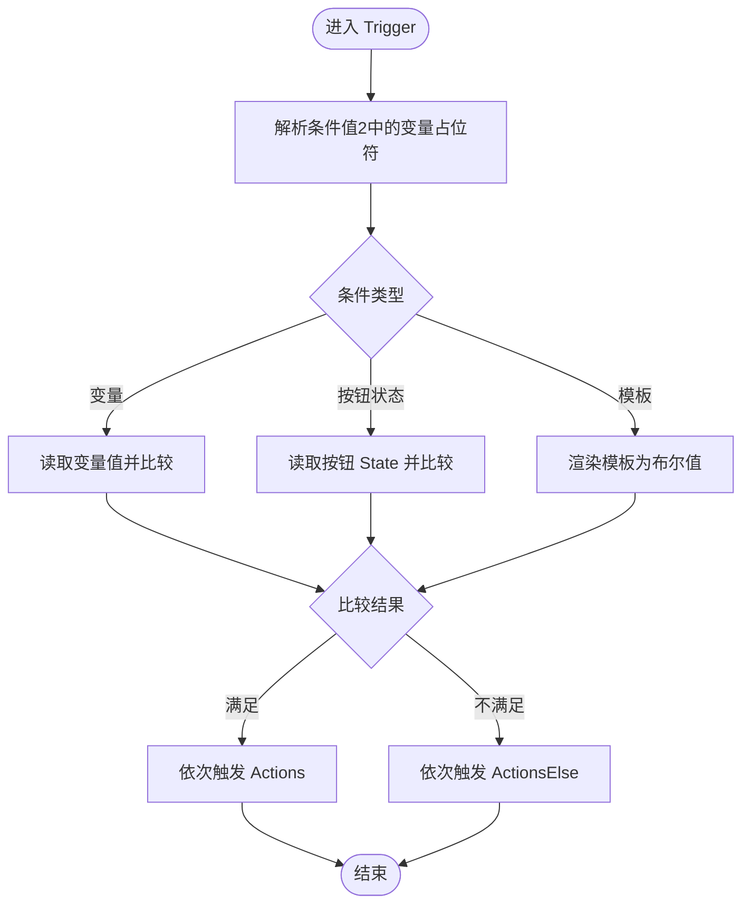
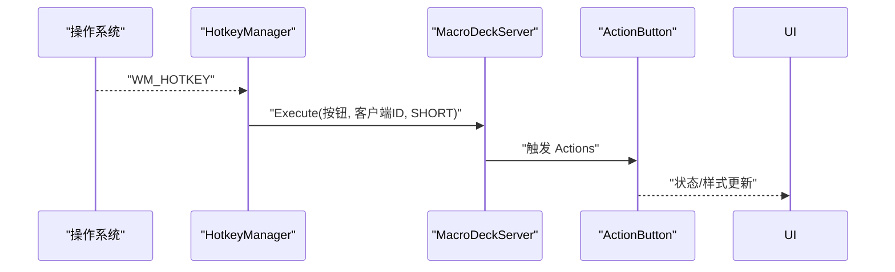
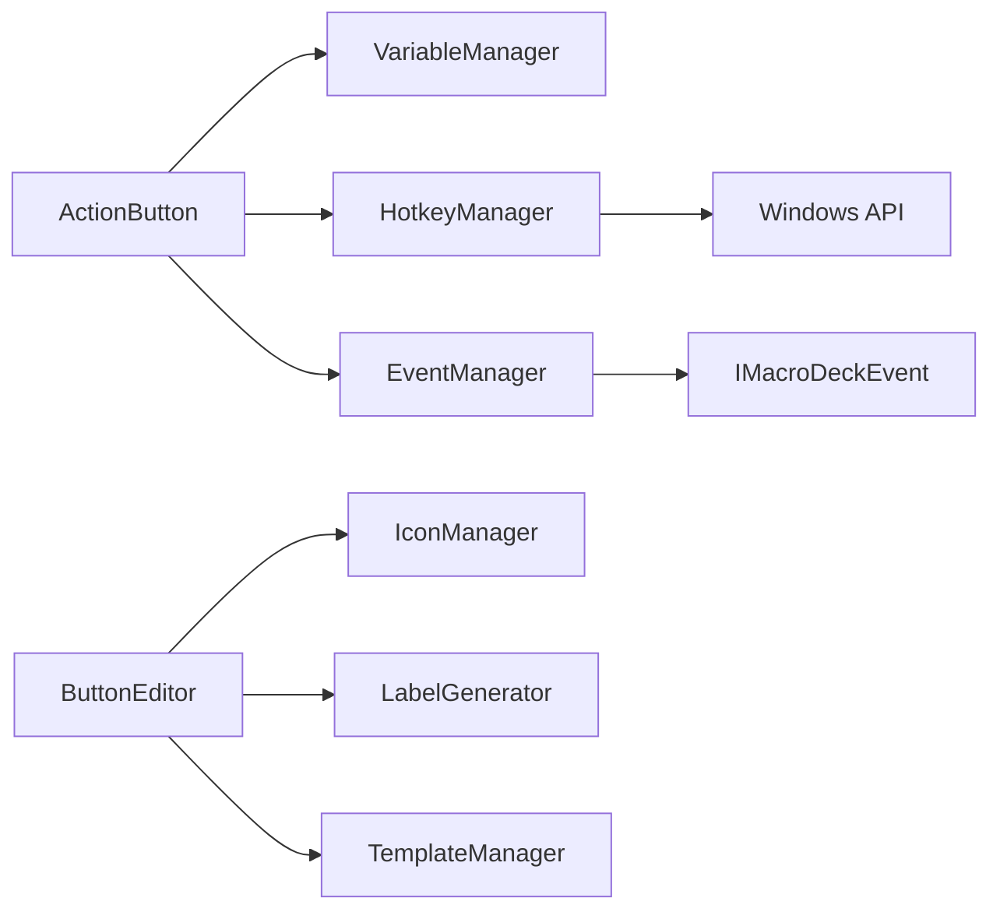

# 按钮系统

<cite>
**本文引用的文件**
- [ActionButton.cs](file://src/MacroDeck/ActionButton/ActionButton.cs)
- [ButtonLabel.cs](file://src/MacroDeck/ActionButton/ButtonLabel.cs)
- [ConditionAction.cs](file://src/MacroDeck/ActionButton/ConditionAction.cs)
- [ButtonPressType.cs](file://src/MacroDeck/Enums/ButtonPressType.cs)
- [ButtonEditor.cs](file://src/MacroDeck/GUI/Dialogs/ButtonEditor.cs)
- [ActionItem.cs](file://src/MacroDeck/GUI/CustomControls/ButtonEditor/ActionItem.cs)
- [ConditionItem.cs](file://src/MacroDeck/GUI/CustomControls/ButtonEditor/ConditionItem.cs)
- [IActionConditionItem.cs](file://src/MacroDeck/Interfaces/IActionConditionItem.cs)
- [HotkeyManager.cs](file://src/MacroDeck/Hotkeys/HotkeyManager.cs)
- [EventManager.cs](file://src/MacroDeck/Events/EventManager.cs)
- [MacroDeckProfile.cs](file://src/MacroDeck/Profiles/MacroDeckProfile.cs)
- [ActionButtonToggleStateAction.cs](file://src/MacroDeck/InternalPlugins/ActionButtonPlugin/Actions/ActionButtonToggleStateAction.cs)
- [ActionButtonSetStateOnAction.cs](file://src/MacroDeck/InternalPlugins/ActionButtonPlugin/Actions/ActionButtonSetStateOnAction.cs)
- [ActionButtonSetStateOffAction.cs](file://src/MacroDeck/InternalPlugins/ActionButtonPlugin/Actions/ActionButtonSetStateOffAction.cs)
</cite>

## 更新摘要
**变更内容**
- 修复了 ConditionAction 的序列化bug，修正了 `contitionMethod` 拼写错误
- 确保条件动作的 if/else 分支动作配置能够正确保存和加载
- 改进了 JSON 序列化配置，增强了稳定性

## 目录
1. [简介](#简介)
2. [项目结构](#项目结构)
3. [核心组件](#核心组件)
4. [架构总览](#架构总览)
5. [详细组件分析](#详细组件分析)
6. [依赖分析](#依赖分析)
7. [性能考虑](#性能考虑)
8. [故障排查指南](#故障排查指南)
9. [结论](#结论)
10. [附录：典型用法与最佳实践](#附录典型用法与最佳实践)

## 简介
本文件面向 Macro-Deck 的"按钮系统"，系统性阐述按钮的创建、配置与触发机制，覆盖以下主题：
- 按钮对象模型与状态管理（ActionButton）
- 触发类型与条件系统（短按、长按、释放、事件）
- 按钮样式与自定义（图标、颜色、标签）
- 按钮编辑器的使用流程（动作配置、条件设置、标签编辑）
- 插件系统集成（内部插件与外部插件动作）
- 面向初学者的概念讲解与面向进阶用户的高级技巧

## 项目结构
按钮系统由"数据模型 + GUI 编辑器 + 触发执行 + 插件集成"四部分组成：
- 数据模型层：ActionButton、ButtonLabel、ConditionAction
- 触发执行层：HotkeyManager（热键）、EventManager（事件）、ButtonPressType（触发类型枚举）
- GUI 层：ButtonEditor 及其子控件（ActionItem、ConditionItem 等）
- 插件层：通过 PluginAction 接口扩展动作；内部插件提供状态切换等常用动作

**图表来源**
- [ActionButton.cs:10-198](file://src/MacroDeck/ActionButton/ActionButton.cs#L10-L198)
- [ButtonEditor.cs:20-630](file://src/MacroDeck/GUI/Dialogs/ButtonEditor.cs#L20-L630)
- [ConditionAction.cs:11-273](file://src/MacroDeck/ActionButton/ConditionAction.cs#L11-L273)
- [HotkeyManager.cs:8-121](file://src/MacroDeck/Hotkeys/HotkeyManager.cs#L8-L121)
- [EventManager.cs:3-43](file://src/MacroDeck/Events/EventManager.cs#L3-L43)

## 核心组件
- ActionButton：按钮实体，包含状态、图标、背景色、标签、位置、热键绑定、变量绑定、动作列表（按下/释放/长按/长按释放）以及事件监听器集合。负责状态变更事件与样式变更事件的发布，并在生命周期结束时清理资源与解绑事件。
- ButtonLabel：按钮标签模型，支持文本、字体、字号、颜色、位置（上/中/下），并生成固定尺寸的 Base64 图像以供渲染。
- ConditionAction：条件动作，根据变量值、按钮状态或模板结果决定执行哪一组动作（满足/不满足分支）。**已修复序列化bug，确保 if/else 分支正确保存和加载**。
- ButtonPressType：触发类型枚举（短按、短按释放、长按、长按释放）。
- ButtonEditor：按钮编辑器对话框，提供外观、状态、热键、动作、条件、事件等配置入口，并实时预览效果。

**章节来源**
- [ActionButton.cs:10-198](file://src/MacroDeck/ActionButton/ActionButton.cs#L10-L198)
- [ButtonLabel.cs:6-69](file://src/MacroDeck/ActionButton/ButtonLabel.cs#L6-L69)
- [ConditionAction.cs:11-273](file://src/MacroDeck/ActionButton/ConditionAction.cs#L11-L273)
- [ButtonPressType.cs:3-9](file://src/MacroDeck/Enums/ButtonPressType.cs#L3-L9)
- [ButtonEditor.cs:20-630](file://src/MacroDeck/GUI/Dialogs/ButtonEditor.cs#L20-L630)

## 架构总览
按钮系统采用"模型-视图-控制器"风格：
- 模型：ActionButton、ButtonLabel、ConditionAction
- 视图：ButtonEditor 及其子控件（ActionItem、ConditionItem）
- 控制器：HotkeyManager（热键）、EventManager（事件）、MacroDeckServer（状态同步）

**图表来源**
- [ActionButton.cs:10-198](file://src/MacroDeck/ActionButton/ActionButton.cs#L10-L198)
- [ButtonLabel.cs:6-69](file://src/MacroDeck/ActionButton/ButtonLabel.cs#L6-L69)
- [ConditionAction.cs:11-273](file://src/MacroDeck/ActionButton/ConditionAction.cs#L11-L273)
- [HotkeyManager.cs:8-121](file://src/MacroDeck/Hotkeys/HotkeyManager.cs#L8-L121)
- [EventManager.cs:3-43](file://src/MacroDeck/Events/EventManager.cs#L3-L43)

## 详细组件分析

### ActionButton 类设计与功能
- 属性与职责
  - 状态与样式：State、IconOff/IconOn、BackColorOff/BackColorOn、LabelOff/LabelOn
  - 布局与绑定：Position_X/Position_Y、StateBindingVariable
  - 动作集合：Actions（按下）、ActionsRelease（释放）、ActionsLongPress（长按）、ActionsLongPressRelease（长按释放）
  - 事件监听：EventListeners
  - 热键：ModifierKeyCodes、KeyCode
- 事件与生命周期
  - StateChanged、IconChanged 用于通知 UI 更新
  - Dispose 中移除热键、取消变量订阅、调用各动作的 OnActionButtonDelete
- 状态绑定与变量联动
  - 通过 StateBindingVariable 绑定到变量，当变量变化时自动更新按钮状态
- 热键更新
  - UpdateHotkey 将当前热键注册到系统

**图表来源**
- [ActionButton.cs:80-107](file://src/MacroDeck/ActionButton/ActionButton.cs#L80-L107)
- [ActionButton.cs:114-128](file://src/MacroDeck/ActionButton/ActionButton.cs#L114-L128)

**章节来源**
- [ActionButton.cs:10-198](file://src/MacroDeck/ActionButton/ActionButton.cs#L10-L198)

### 按钮标签 ButtonLabel
- 支持多行文本、字体、字号、颜色、对齐位置（顶部/中部/底部）
- 自动生成 128x64 的 Base64 图像，便于设备端渲染
- LabelBase64 变更会触发 LabelBase64Changed 事件

**章节来源**
- [ButtonLabel.cs:6-69](file://src/MacroDeck/ActionButton/ButtonLabel.cs#L6-L69)

### 条件动作 ConditionAction
- 条件类型：变量值比较、按钮状态比较、模板布尔结果
- 方法：等于、不等于、大于、小于
- 分支：Actions（满足条件）、ActionsElse（不满足）
- 执行：根据条件结果遍历对应动作链路
- **序列化修复**：修正了 `contitionMethod` 拼写错误，确保 if/else 分支动作配置正确保存和加载

**更新** 修复了 ConditionAction 的序列化bug，解决了以下问题：
- 修正了 `contitionMethod` 拼写错误，统一使用 `conditionMethod`
- 确保序列化和反序列化的一致性
- 改进了 JSON 序列化配置，增强了稳定性

**图表来源**
- [ConditionAction.cs:163-256](file://src/MacroDeck/ActionButton/ConditionAction.cs#L163-L256)

**章节来源**
- [ConditionAction.cs:11-273](file://src/MacroDeck/ActionButton/ConditionAction.cs#L11-L273)

### 触发类型与条件系统
- 触发类型：短按、短按释放、长按、长按释放（ButtonPressType）
- 热键触发：HotkeyManager 注册系统热键，命中后调用 MacroDeckServer 执行按钮短按动作
- 事件触发：EventManager 统一注册事件，匹配事件名与参数后执行对应动作链

**图表来源**
- [HotkeyManager.cs:92-119](file://src/MacroDeck/Hotkeys/HotkeyManager.cs#L92-L119)
- [ButtonPressType.cs:3-9](file://src/MacroDeck/Enums/ButtonPressType.cs#L3-L9)

**章节来源**
- [HotkeyManager.cs:8-121](file://src/MacroDeck/Hotkeys/HotkeyManager.cs#L8-L121)
- [ButtonPressType.cs:3-9](file://src/MacroDeck/Enums/ButtonPressType.cs#L3-L9)
- [EventManager.cs:24-41](file://src/MacroDeck/Events/EventManager.cs#L24-L41)

### 按钮编辑器 ButtonEditor 使用指南
- 外观与状态
  - 切换 On/Off 状态，分别编辑不同状态下的图标、背景色与标签
  - 实时预览：预览按钮显示当前状态的图标、标签与背景色
- 标签编辑
  - 文本、字体、字号、颜色、位置（上/中/下）
  - 支持变量占位符插入与模板编辑器
- 动作配置
  - 按下/释放/长按/长按释放 四类动作列表
  - 通过 ActionItem 展示动作摘要，支持上下移动、编辑、删除
- 条件配置
  - 通过 ConditionItem 配置条件类型、方法与值
  - 分别为满足/不满足分支添加动作
- 事件配置
  - 选择事件名称与参数，为其绑定动作列表
- 热键绑定
  - 设置修饰键与按键，保存后注册到系统热键
- 应用与保存
  - Apply 仅应用到内存并更新服务器；OK 还会关闭窗口

**章节来源**
- [ButtonEditor.cs:20-630](file://src/MacroDeck/GUI/Dialogs/ButtonEditor.cs#L20-L630)
- [ActionItem.cs:6-46](file://src/MacroDeck/GUI/CustomControls/ButtonEditor/ActionItem.cs#L6-L46)
- [ConditionItem.cs:11-485](file://src/MacroDeck/GUI/CustomControls/ButtonEditor/ConditionItem.cs#L11-L485)

### 插件系统集成
- 插件动作接口：所有动作实现 PluginAction 接口，具备 Name、Description、Trigger 等能力
- 内部插件动作（ActionButtonPlugin）
  - 切换按钮状态：ActionButtonToggleStateAction
  - 设为 On/Off：ActionButtonSetStateOnAction、ActionButtonSetStateOffAction
- 编辑器与配置器
  - ActionItem 显示动作摘要，支持编辑与排序
  - ActionConfigurator 用于配置动作参数（若需要）

**章节来源**
- [ActionButtonToggleStateAction.cs:9-18](file://src/MacroDeck/InternalPlugins/ActionButtonPlugin/Actions/ActionButtonToggleStateAction.cs#L9-L18)
- [ActionButtonSetStateOnAction.cs:9-24](file://src/MacroDeck/InternalPlugins/ActionButtonPlugin/Actions/ActionButtonSetStateOnAction.cs#L9-L24)
- [ActionButtonSetStateOffAction.cs:9-23](file://src/MacroDeck/InternalPlugins/ActionButtonPlugin/Actions/ActionButtonSetStateOffAction.cs#L9-L23)
- [ActionItem.cs:6-46](file://src/MacroDeck/GUI/CustomControls/ButtonEditor/ActionItem.cs#L6-L46)

## 依赖分析
- ActionButton 对变量管理器（VariableManager）进行订阅，实现状态绑定
- ActionButton 在生命周期结束时调用各动作的 OnActionButtonDelete，确保插件资源释放
- ButtonEditor 依赖 IconManager、LabelGenerator、TemplateManager 等工具类进行预览
- HotkeyManager 依赖 Windows API 注册系统热键
- EventManager 负责集中分发事件到对应按钮的动作链

**图表来源**
- [ActionButton.cs:17-18](file://src/MacroDeck/ActionButton/ActionButton.cs#L17-L18)
- [ButtonEditor.cs:14-16](file://src/MacroDeck/GUI/Dialogs/ButtonEditor.cs#L14-L16)
- [HotkeyManager.cs:13-17](file://src/MacroDeck/Hotkeys/HotkeyManager.cs#L13-L17)
- [EventManager.cs:9-16](file://src/MacroDeck/Events/EventManager.cs#L9-L16)

**章节来源**
- [ActionButton.cs:10-198](file://src/MacroDeck/ActionButton/ActionButton.cs#L10-L198)
- [ButtonEditor.cs:20-630](file://src/MacroDeck/GUI/Dialogs/ButtonEditor.cs#L20-L630)
- [HotkeyManager.cs:8-121](file://src/MacroDeck/Hotkeys/HotkeyManager.cs#L8-L121)
- [EventManager.cs:3-43](file://src/MacroDeck/Events/EventManager.cs#L3-L43)

## 性能考虑
- 标签图像生成：ButtonLabel 在 LabelBase64 变更时生成 128x64 的 Base64 图像，建议避免频繁刷新；编辑器已使用异步任务更新预览
- 热键注册：同一按钮重复注册前先注销旧热键，减少冲突
- 事件分发：EventManager 使用异步线程执行动作，避免阻塞事件源
- 变量绑定：仅在 StateBindingVariable 匹配时才更新状态，降低无效更新
- **序列化优化**：改进的 JSON 序列化配置减少了错误处理开销，提高了稳定性

## 故障排查指南
- 热键无效
  - 检查是否正确设置 ModifierKeyCodes 与 KeyCode
  - 确认未与其他程序冲突
  - 查看日志中热键注册信息
- 按钮状态不更新
  - 确认 StateBindingVariable 是否与变量名一致
  - 检查变量值格式（布尔或字符串 on/true）
- 标签不显示
  - 确认 LabelBase64 已生成且非空
  - 检查字体与颜色设置是否合理
- 条件动作不生效
  - 核对 ConditionType、ConditionMethod、ConditionValue2
  - 模板条件需返回布尔值
  - **序列化问题**：如果条件动作配置丢失，检查按钮配置文件的 JSON 结构

**章节来源**
- [HotkeyManager.cs:34-66](file://src/MacroDeck/Hotkeys/HotkeyManager.cs#L34-L66)
- [ActionButton.cs:80-107](file://src/MacroDeck/ActionButton/ActionButton.cs#L80-L107)
- [ButtonLabel.cs:48-60](file://src/MacroDeck/ActionButton/ButtonLabel.cs#L48-L60)
- [ConditionAction.cs:163-256](file://src/MacroDeck/ActionButton/ConditionAction.cs#L163-L256)

## 结论
Macro-Deck 的按钮系统以 ActionButton 为核心，结合 ButtonLabel 提供丰富的外观定制，借助 ConditionAction 实现灵活的条件逻辑，并通过 ButtonEditor 提供直观的可视化配置体验。系统通过 HotkeyManager 与 EventManager 实现多种触发路径，配合插件生态实现强大的扩展能力。**最新的修复确保了条件动作的 if/else 分支能够正确保存和加载，提升了系统的稳定性和可靠性**。对于初学者，建议从"状态绑定 + 热键 + 简单动作"开始；对于进阶用户，可利用模板条件、复杂动作链与事件联动实现高阶自动化。

## 附录：典型用法与最佳实践
- 快速入门
  - 创建按钮：在按钮编辑器中设置图标、背景色与标签
  - 绑定状态：在"状态绑定"中选择变量，使按钮随变量变化而切换 On/Off
  - 添加热键：设置修饰键与按键，实现全局快捷操作
  - 配置条件动作：使用 ConditionAction 创建 if/else 分支逻辑
- 高级技巧
  - 使用模板条件：在条件动作中编写模板表达式，动态判断布尔结果
  - 动作链组合：在不同触发类型下配置多条动作，实现复杂交互
  - 事件联动：注册自定义事件，将外部事件转化为按钮动作
  - **序列化稳定性**：利用修复后的序列化机制，确保复杂的条件配置持久化
- 最佳实践
  - 合理拆分动作：将复杂逻辑拆分为多个小动作，便于维护
  - 避免频繁刷新：减少不必要的标签图像生成与样式变更
  - 资源清理：确保插件动作在按钮删除时正确释放资源
  - **配置备份**：定期备份按钮配置，防止序列化相关问题导致的数据丢失