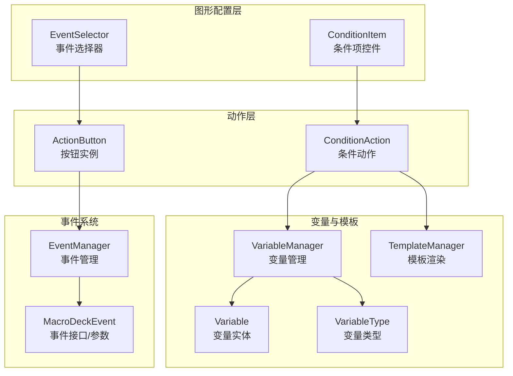
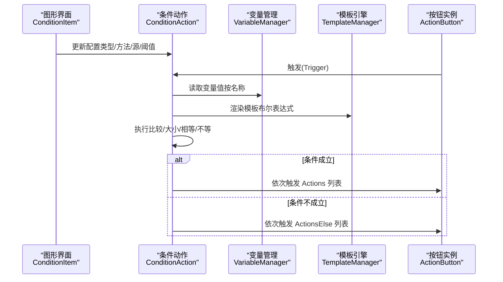
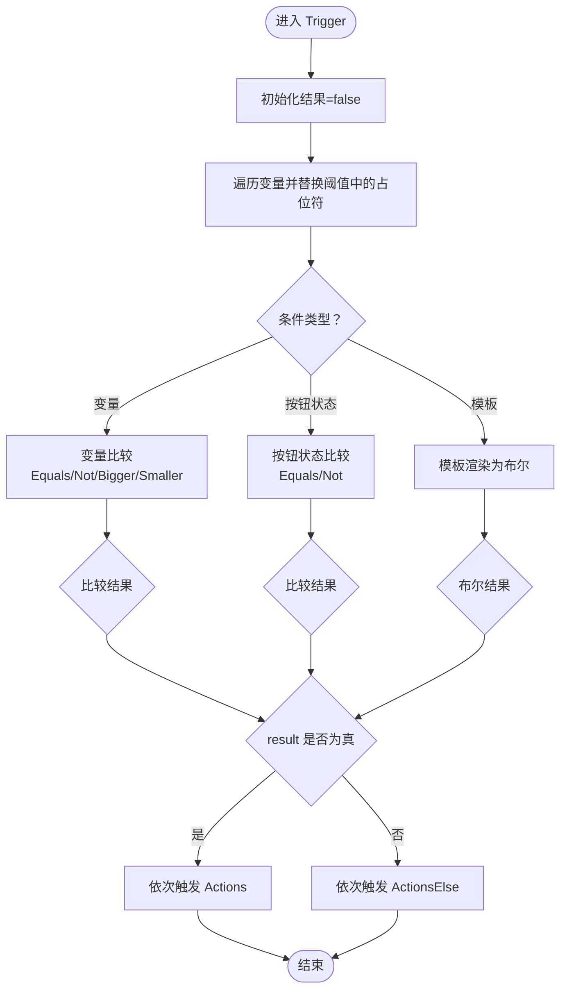
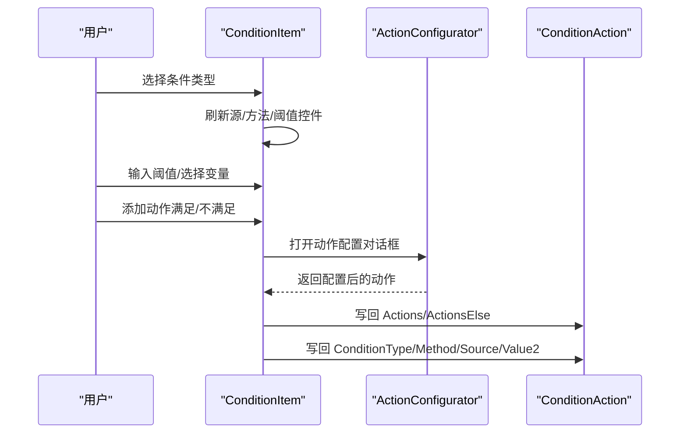
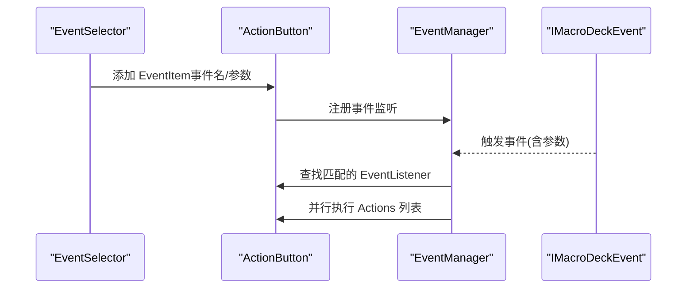
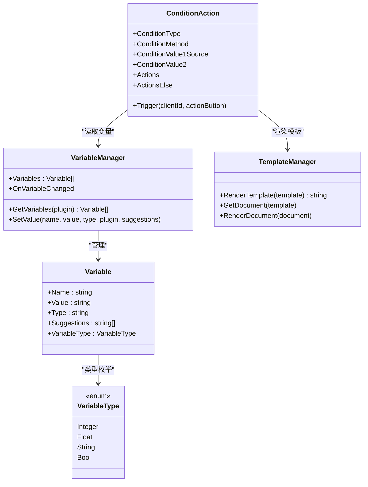
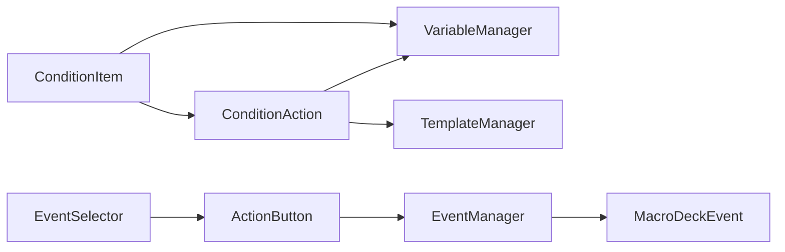

# 条件系统

<cite>
**本文引用的文件**
- [ConditionAction.cs](file://src/MacroDeck/ActionButton/ConditionAction.cs)
- [ConditionItem.cs](file://src/MacroDeck/GUI/CustomControls/ButtonEditor/ConditionItem.cs)
- [EventSelector.cs](file://src/MacroDeck/GUI/CustomControls/ButtonEditor/EventSelector.cs)
- [IActionConditionItem.cs](file://src/MacroDeck/Interfaces/IActionConditionItem.cs)
- [VariableManager.cs](file://src/MacroDeck/Variables/VariableManager.cs)
- [Variable.cs](file://src/MacroDeck/Variables/Variable.cs)
- [VariableType.cs](file://src/MacroDeck/Variables/VariableType.cs)
- [TemplateManager.cs](file://src/MacroDeck/CottleIntegration/TemplateManager.cs)
- [EventManager.cs](file://src/MacroDeck/Events/EventManager.cs)
- [MacroDeckEvent.cs](file://src/MacroDeck/Events/MacroDeckEvent.cs)
- [ActionButton.cs](file://src/MacroDeck/ActionButton/ActionButton.cs)
- [MacroDeckLogger.cs](file://src/MacroDeck/Logging/MacroDeckLogger.cs)
</cite>

## 更新摘要
**变更内容**
- 修复了 ConditionAction 中的序列化bug，确保 actionsElse 和 actions 使用正确的集合进行JSON序列化
- 解决了条件动作配置更新时else分支被if分支覆盖的问题
- 修正了字段名拼写错误（contitionMethod → conditionMethod）
- 增强了配置更新的可靠性机制

## 目录
1. [简介](#简介)
2. [项目结构](#项目结构)
3. [核心组件](#核心组件)
4. [架构总览](#架构总览)
5. [详细组件分析](#详细组件分析)
6. [依赖关系分析](#依赖关系分析)
7. [性能考虑](#性能考虑)
8. [故障排查指南](#故障排查指南)
9. [结论](#结论)
10. [附录](#附录)

## 简介
本文件系统性阐述 Macro-Deck 的"条件系统"，重点覆盖以下方面：
- ConditionAction 的实现原理、条件判断逻辑与执行机制
- ConditionItem 组件的功能、条件类型添加与配置流程
- EventSelector 的使用方式：事件监听器设置与事件类型选择
- 条件系统与变量系统的集成：变量值读取、模板渲染与比较
- 实际条件配置示例：多条件类型组合使用
- 性能优化与最佳实践
- 调试方法与常见问题解决
- 条件系统与触发类型的关系及执行时机

## 项目结构
条件系统由"动作层（ConditionAction）+ 图形配置层（ConditionItem）+ 变量系统（VariableManager/TemplateManager）+ 事件系统（EventSelector/EventManager）"共同构成，形成从可视化配置到运行时判断与执行的完整闭环。

**图示来源**
- [ConditionItem.cs:11-58](file://src/MacroDeck/GUI/CustomControls/ButtonEditor/ConditionItem.cs#L11-L58)
- [ConditionAction.cs:11-124](file://src/MacroDeck/ActionButton/ConditionAction.cs#L11-L124)
- [VariableManager.cs:10-35](file://src/MacroDeck/Variables/VariableManager.cs#L10-L35)
- [Variable.cs:5-15](file://src/MacroDeck/Variables/Variable.cs#L5-L15)
- [VariableType.cs:3-9](file://src/MacroDeck/Variables/VariableType.cs#L3-L9)
- [TemplateManager.cs:8-88](file://src/MacroDeck/CottleIntegration/TemplateManager.cs#L8-L88)
- [EventSelector.cs:5-67](file://src/MacroDeck/GUI/CustomControls/ButtonEditor/EventSelector.cs#L5-L67)
- [EventManager.cs:3-42](file://src/MacroDeck/Events/EventManager.cs#L3-L42)
- [MacroDeckEvent.cs:3-14](file://src/MacroDeck/Events/MacroDeckEvent.cs#L3-L14)
- [ActionButton.cs:10-194](file://src/MacroDeck/ActionButton/ActionButton.cs#L10-L194)

**章节来源**
- [ConditionItem.cs:11-58](file://src/MacroDeck/GUI/CustomControls/ButtonEditor/ConditionItem.cs#L11-L58)
- [ConditionAction.cs:11-124](file://src/MacroDeck/ActionButton/ConditionAction.cs#L11-L124)
- [VariableManager.cs:10-35](file://src/MacroDeck/Variables/VariableManager.cs#L10-L35)
- [TemplateManager.cs:8-88](file://src/MacroDeck/CottleIntegration/TemplateManager.cs#L8-L88)
- [EventSelector.cs:5-67](file://src/MacroDeck/GUI/CustomControls/ButtonEditor/EventSelector.cs#L5-L67)
- [EventManager.cs:3-42](file://src/MacroDeck/Events/EventManager.cs#L3-L42)

## 核心组件
- **ConditionAction**：条件动作的核心实现，负责解析配置、执行条件判断、在满足/不满足时分别触发"真分支"和"假分支"的动作列表。现已修复序列化bug，确保配置更新的可靠性。
- **ConditionItem**：图形化配置控件，支持选择条件类型、比较方法、源变量或模板、输入对比值，以及维护"满足/不满足"两组动作列表。
- **VariableManager/Variable/VariableType**：变量存储、类型转换与变更通知；为条件判断提供数据源。
- **TemplateManager**：Cottle 模板引擎封装，将变量注入上下文并渲染模板为布尔结果。
- **EventSelector/EventManager/MacroDeckEvent/ActionButton**：事件系统，用于在特定事件发生时触发绑定的动作链，其中可包含条件动作以实现事件驱动的条件执行。

**章节来源**
- [ConditionAction.cs:11-272](file://src/MacroDeck/ActionButton/ConditionAction.cs#L11-L272)
- [ConditionItem.cs:11-484](file://src/MacroDeck/GUI/CustomControls/ButtonEditor/ConditionItem.cs#L11-L484)
- [VariableManager.cs:10-248](file://src/MacroDeck/Variables/VariableManager.cs#L10-L248)
- [Variable.cs:5-15](file://src/MacroDeck/Variables/Variable.cs#L5-L15)
- [VariableType.cs:3-9](file://src/MacroDeck/Variables/VariableType.cs#L3-L9)
- [TemplateManager.cs:8-180](file://src/MacroDeck/CottleIntegration/TemplateManager.cs#L8-L180)
- [EventSelector.cs:5-67](file://src/MacroDeck/GUI/CustomControls/ButtonEditor/EventSelector.cs#L5-L67)
- [EventManager.cs:3-42](file://src/MacroDeck/Events/EventManager.cs#L3-L42)
- [MacroDeckEvent.cs:3-14](file://src/MacroDeck/Events/MacroDeckEvent.cs#L3-L14)
- [ActionButton.cs:10-197](file://src/MacroDeck/ActionButton/ActionButton.cs#L10-L197)

## 架构总览
条件系统的关键交互路径如下：
- 配置阶段：用户通过 ConditionItem 设置条件类型、比较方法、源与阈值，保存到 ConditionAction 的配置中。现已修复序列化bug，确保配置的正确持久化。
- 运行阶段：当按钮被触发或事件发生时，ConditionAction 执行判断；根据结果选择执行 Actions 或 ActionsElse 中的动作序列。
- 数据来源：变量系统提供静态值；模板系统提供动态布尔表达式。

**图示来源**
- [ConditionItem.cs:299-384](file://src/MacroDeck/GUI/CustomControls/ButtonEditor/ConditionItem.cs#L299-L384)
- [ConditionAction.cs:163-256](file://src/MacroDeck/ActionButton/ConditionAction.cs#L163-L256)
- [VariableManager.cs:23-24](file://src/MacroDeck/Variables/VariableManager.cs#L23-L24)
- [TemplateManager.cs:69-88](file://src/MacroDeck/CottleIntegration/TemplateManager.cs#L69-L88)
- [ActionButton.cs:190-194](file://src/MacroDeck/ActionButton/ActionButton.cs#L190-L194)

## 详细组件分析

### ConditionAction 组件
- **功能概述**
  - 提供三种条件类型：变量值比较、按钮状态比较、模板布尔表达式。
  - 支持四种比较方法：等于、不等于、大于、小于。
  - 将"满足/不满足"两种分支的动作列表作为子动作集合执行。
- **关键点**
  - **配置持久化**：通过 JSON 序列化/反序列化保存 Actions、ActionsElse、源、类型、方法、阈值。现已修复序列化bug，确保两个分支集合都能正确序列化。
  - **变量替换**：在比较前将阈值中的占位符替换为当前变量值。
  - **类型安全**：数值比较仅对整数/浮点变量生效。
  - **模板布尔**：将模板渲染结果尝试解析为布尔值作为最终条件。
  - **配置更新机制**：所有属性setter都调用UpdateConfiguration()，确保配置变更立即持久化。
- **执行流程**

**图示来源**
- [ConditionAction.cs:163-256](file://src/MacroDeck/ActionButton/ConditionAction.cs#L163-L256)

**章节来源**
- [ConditionAction.cs:11-272](file://src/MacroDeck/ActionButton/ConditionAction.cs#L11-L272)

### ConditionItem 组件
- **功能概述**
  - 提供条件类型下拉框（Variable/Button_State/Template）。
  - 根据类型显示/隐藏对应控件（源变量选择、比较方法、阈值输入、模板编辑器）。
  - 自动补全：针对变量建议值、布尔值、按钮状态等提供智能提示。
  - 维护"满足/不满足"两组动作列表，支持增删改、上下移动。
- **关键点**
  - 类型切换时刷新可用源与建议项。
  - 模板模式下打开模板编辑器进行语法高亮与预览。
  - 与 ActionConfigurator 协作完成子动作的配置与替换。
- **使用流程**

**图示来源**
- [ConditionItem.cs:299-483](file://src/MacroDeck/GUI/CustomControls/ButtonEditor/ConditionItem.cs#L299-L483)

**章节来源**
- [ConditionItem.cs:11-484](file://src/MacroDeck/GUI/CustomControls/ButtonEditor/ConditionItem.cs#L11-L484)
- [IActionConditionItem.cs:5-12](file://src/MacroDeck/Interfaces/IActionConditionItem.cs#L5-L12)

### EventSelector 与事件监听
- **功能概述**
  - 在按钮的事件列表中添加/移除事件监听项。
  - 每个事件监听项绑定一个事件名与参数，匹配后触发其动作列表。
  - 与 EventManager 协同，在事件发生时批量触发符合条件的动作。
- **关键点**
  - 事件列表由 ActionButton 的 EventListeners 维护。
  - EventManager 通过线程池异步处理事件，避免阻塞主线程。
- **使用流程**

**图示来源**
- [EventSelector.cs:16-66](file://src/MacroDeck/GUI/CustomControls/ButtonEditor/EventSelector.cs#L16-L66)
- [ActionButton.cs:190-194](file://src/MacroDeck/ActionButton/ActionButton.cs#L190-L194)
- [EventManager.cs:24-41](file://src/MacroDeck/Events/EventManager.cs#L24-L41)
- [MacroDeckEvent.cs:9-14](file://src/MacroDeck/Events/MacroDeckEvent.cs#L9-L14)

**章节来源**
- [EventSelector.cs:5-67](file://src/MacroDeck/GUI/CustomControls/ButtonEditor/EventSelector.cs#L5-L67)
- [ActionButton.cs:10-197](file://src/MacroDeck/ActionButton/ActionButton.cs#L10-L197)
- [EventManager.cs:3-42](file://src/MacroDeck/Events/EventManager.cs#L3-L42)
- [MacroDeckEvent.cs:3-14](file://src/MacroDeck/Events/MacroDeckEvent.cs#L3-L14)

### 条件系统与变量系统的集成
- **变量读取与类型转换**
  - VariableManager 提供变量查询、类型转换与变更通知。
  - 支持整数、浮点、字符串、布尔四类变量类型。
- **模板渲染与布尔判定**
  - TemplateManager 将变量注入上下文，渲染模板表达式，返回布尔结果。
  - 模板关键字、函数与宏扩展由模板管理器统一提供。
- **变量占位符替换**
  - ConditionAction 在比较前扫描阈值，将形如 "{变量名}" 的占位符替换为当前变量值，再进行比较。

**图示来源**
- [VariableManager.cs:10-248](file://src/MacroDeck/Variables/VariableManager.cs#L10-L248)
- [Variable.cs:5-15](file://src/MacroDeck/Variables/Variable.cs#L5-L15)
- [VariableType.cs:3-9](file://src/MacroDeck/Variables/VariableType.cs#L3-L9)
- [TemplateManager.cs:8-180](file://src/MacroDeck/CottleIntegration/TemplateManager.cs#L8-L180)
- [ConditionAction.cs:11-272](file://src/MacroDeck/ActionButton/ConditionAction.cs#L11-L272)

**章节来源**
- [VariableManager.cs:10-248](file://src/MacroDeck/Variables/VariableManager.cs#L10-L248)
- [Variable.cs:5-15](file://src/MacroDeck/Variables/Variable.cs#L5-L15)
- [VariableType.cs:3-9](file://src/MacroDeck/Variables/VariableType.cs#L3-L9)
- [TemplateManager.cs:8-180](file://src/MacroDeck/CottleIntegration/TemplateManager.cs#L8-L180)
- [ConditionAction.cs:163-256](file://src/MacroDeck/ActionButton/ConditionAction.cs#L163-L256)

## 依赖关系分析
- **组件耦合**
  - ConditionAction 依赖 VariableManager 与 TemplateManager 完成数据与表达式计算。
  - ConditionItem 依赖 VariableManager 提供变量列表与建议项，依赖 ActionConfigurator 管理子动作。
  - EventSelector/EventManager 与 ActionButton 协作，实现事件驱动的动作链。
- **外部依赖**
  - Cottle 模板引擎用于模板渲染。
  - SQLite 存储变量数据。
  - Serilog 用于日志输出（可用于调试）。

**图示来源**
- [ConditionAction.cs:11-272](file://src/MacroDeck/ActionButton/ConditionAction.cs#L11-L272)
- [ConditionItem.cs:11-484](file://src/MacroDeck/GUI/CustomControls/ButtonEditor/ConditionItem.cs#L11-L484)
- [EventSelector.cs:5-67](file://src/MacroDeck/GUI/CustomControls/ButtonEditor/EventSelector.cs#L5-L67)
- [ActionButton.cs:10-197](file://src/MacroDeck/ActionButton/ActionButton.cs#L10-L197)
- [EventManager.cs:3-42](file://src/MacroDeck/Events/EventManager.cs#L3-L42)
- [MacroDeckEvent.cs:3-14](file://src/MacroDeck/Events/MacroDeckEvent.cs#L3-L14)

**章节来源**
- [ConditionAction.cs:11-272](file://src/MacroDeck/ActionButton/ConditionAction.cs#L11-L272)
- [ConditionItem.cs:11-484](file://src/MacroDeck/GUI/CustomControls/ButtonEditor/ConditionItem.cs#L11-L484)
- [EventSelector.cs:5-67](file://src/MacroDeck/GUI/CustomControls/ButtonEditor/EventSelector.cs#L5-L67)
- [ActionButton.cs:10-197](file://src/MacroDeck/ActionButton/ActionButton.cs#L10-L197)
- [EventManager.cs:3-42](file://src/MacroDeck/Events/EventManager.cs#L3-L42)
- [MacroDeckEvent.cs:3-14](file://src/MacroDeck/Events/MacroDeckEvent.cs#L3-L14)

## 性能考虑
- **模板渲染**
  - 模板渲染在每次触发时执行，应尽量保持模板简洁，避免复杂循环与大量函数调用。
  - 对频繁使用的模板可考虑缓存渲染结果（若业务允许），减少重复解析成本。
- **变量访问**
  - 变量查询为内存操作，但存在多次遍历与字符串替换，建议减少阈值中占位符数量。
- **数值比较**
  - 数值比较仅对整数/浮点类型有效，非数值类型比较会跳过，避免无意义计算。
- **异步事件处理**
  - 事件触发采用异步任务执行，避免阻塞主线程，但需注意动作链内部可能存在的同步阻塞操作。
- **配置更新优化**
  - 现有实现通过属性setter自动调用UpdateConfiguration()，确保配置即时持久化，避免配置丢失。

## 故障排查指南
- **常见问题**
  - 条件不生效：检查 ConditionType 与 ConditionMethod 是否正确；确认阈值是否包含未定义的变量占位符。
  - 模板布尔错误：检查模板语法与变量名拼写；确认模板渲染结果可被解析为布尔值。
  - 变量类型不匹配：确保阈值与变量类型一致（数值比较仅适用于整数/浮点）。
  - 事件未触发：确认 EventSelector 中已添加事件监听且参数匹配；检查 EventManager 是否注册了相应事件。
  - **配置丢失问题**：由于已修复序列化bug，现在else分支的动作不会被if分支覆盖，配置更新更加可靠。
- **调试建议**
  - 启用更细粒度日志：通过日志系统查看变量变更与模板渲染过程。
  - 分步验证：先单独测试模板渲染结果，再测试变量比较，最后联调整体流程。
  - 使用最小化配置：逐步增加条件与动作，定位问题所在。
  - **配置验证**：检查UpdateConfiguration()方法是否正确调用，确保actions和actionsElse都被正确序列化。

**章节来源**
- [MacroDeckLogger.cs:11-360](file://src/MacroDeck/Logging/MacroDeckLogger.cs#L11-L360)
- [ConditionAction.cs:163-256](file://src/MacroDeck/ActionButton/ConditionAction.cs#L163-L256)
- [TemplateManager.cs:69-88](file://src/MacroDeck/CottleIntegration/TemplateManager.cs#L69-L88)
- [VariableManager.cs:126-137](file://src/MacroDeck/Variables/VariableManager.cs#L126-L137)
- [EventSelector.cs:40-66](file://src/MacroDeck/GUI/CustomControls/ButtonEditor/EventSelector.cs#L40-L66)
- [EventManager.cs:24-41](file://src/MacroDeck/Events/EventManager.cs#L24-L41)

## 结论
条件系统通过"图形化配置 + 动作执行 + 变量/模板数据源 + 事件驱动"的设计，实现了灵活而强大的条件判断与分支执行能力。**最新的修复确保了配置更新的可靠性**，解决了else分支被if分支覆盖的问题，使条件系统更加稳定。合理利用变量占位符、模板布尔表达式与事件监听，可构建复杂的自动化场景。建议在实际使用中遵循性能与可维护性原则，结合日志与分步验证进行调试与优化。

## 附录

### 条件类型与方法速查
- **条件类型**
  - 变量：基于变量值进行比较
  - 按钮状态：基于按钮当前状态进行比较
  - 模板：基于模板渲染结果进行布尔判断
- **比较方法**
  - 等于、不等于、大于、小于（数值类型）

**章节来源**
- [ConditionAction.cs:259-272](file://src/MacroDeck/ActionButton/ConditionAction.cs#L259-L272)

### 实际配置示例（步骤说明）
- **示例一**：变量值等于某值
  - 在 ConditionItem 中选择"变量"，选择源变量，设置方法为"等于"，阈值填入目标值或使用变量占位符。
- **示例二**：变量值大于某阈值
  - 选择"变量"，方法设为"大于"，阈值填入数值。
- **示例三**：按钮状态为"开启"
  - 选择"按钮状态"，方法设为"等于"，阈值填入"On/True"。
- **示例四**：模板布尔表达式
  - 选择"模板"，打开模板编辑器编写布尔表达式，渲染结果将作为条件。
- **示例五**：事件驱动的条件执行
  - 在 EventSelector 中添加事件监听，设置事件名与参数；在事件触发时，绑定的动作链中可包含条件动作以实现条件分支。

**章节来源**
- [ConditionItem.cs:299-483](file://src/MacroDeck/GUI/CustomControls/ButtonEditor/ConditionItem.cs#L299-L483)
- [EventSelector.cs:16-66](file://src/MacroDeck/GUI/CustomControls/ButtonEditor/EventSelector.cs#L16-L66)
- [ConditionAction.cs:163-256](file://src/MacroDeck/ActionButton/ConditionAction.cs#L163-L256)

### 配置更新机制详解
**更新** 新版本增强了配置更新的可靠性

- **自动配置更新**：所有属性setter都会调用UpdateConfiguration()方法
- **序列化修复**：确保actions和actionsElse使用正确的集合进行JSON序列化
- **字段名修正**：修复contitionMethod字段名拼写错误
- **配置持久化**：通过TypeNameHandling.Auto确保插件动作的正确序列化

**章节来源**
- [ConditionAction.cs:126-154](file://src/MacroDeck/ActionButton/ConditionAction.cs#L126-L154)
- [ConditionAction.cs:82-124](file://src/MacroDeck/ActionButton/ConditionAction.cs#L82-L124)