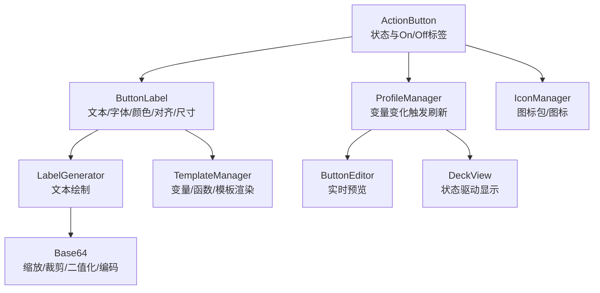
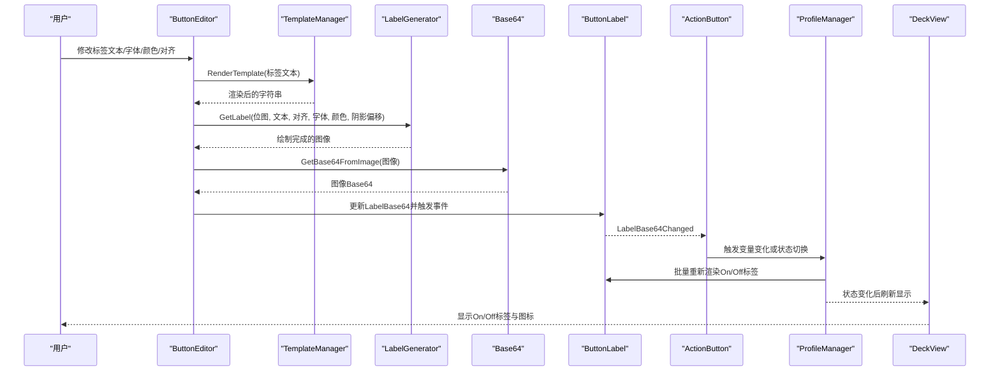
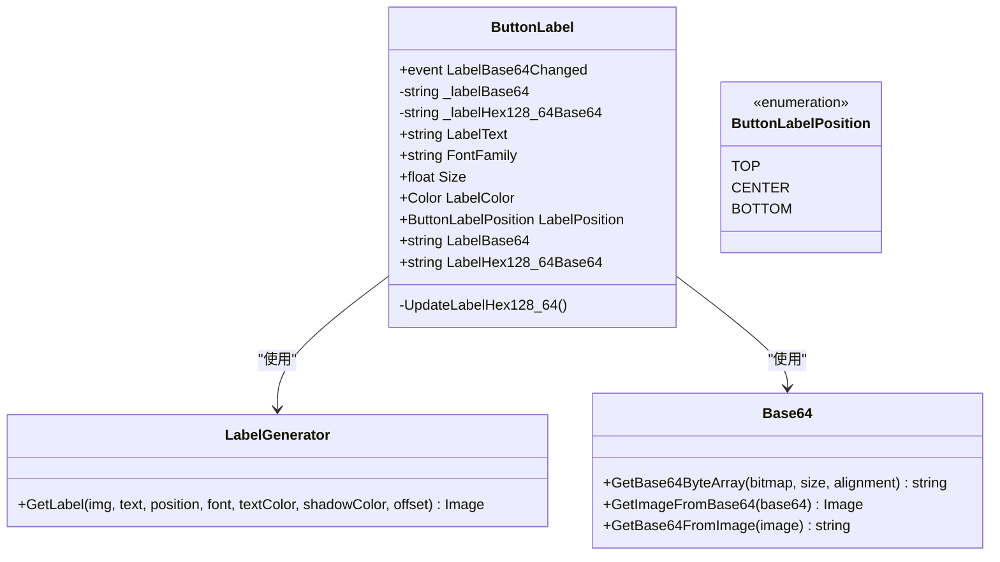
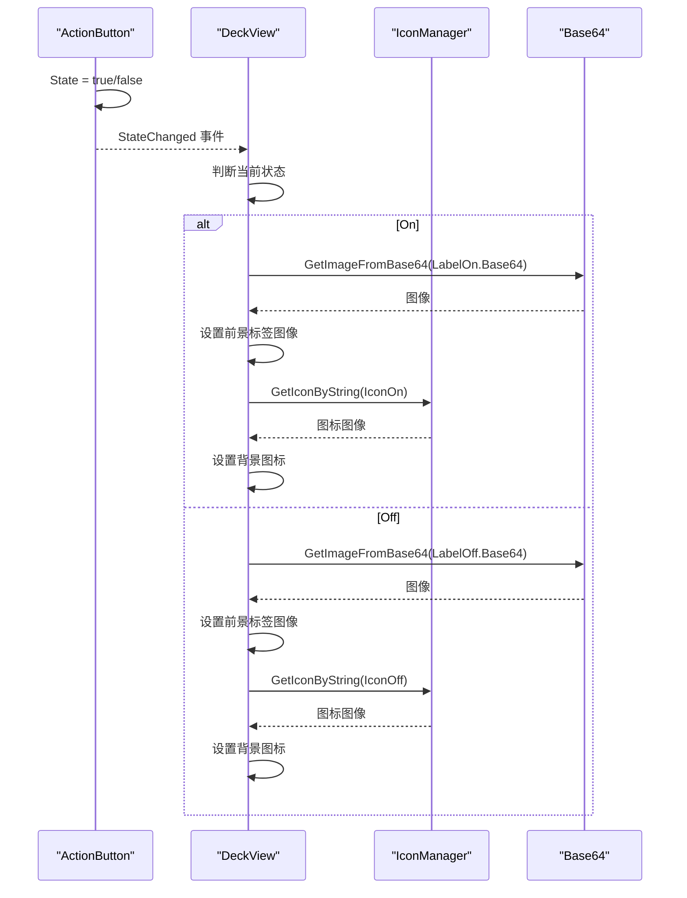
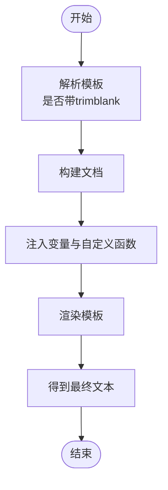
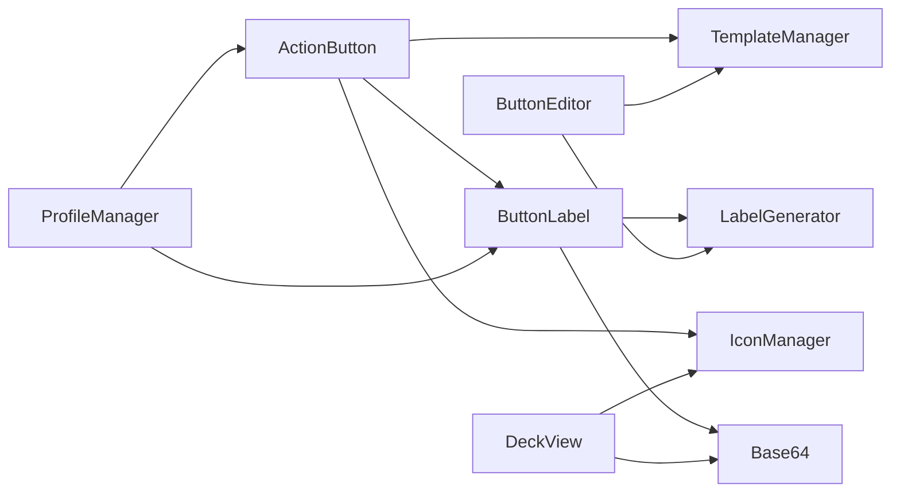

# 标签管理系统

<cite>
**本文引用的文件列表**
- [ButtonLabel.cs](file://src/MacroDeck/ActionButton/ButtonLabel.cs)
- [ActionButton.cs](file://src/MacroDeck/ActionButton/ActionButton.cs)
- [TemplateManager.cs](file://src/MacroDeck/CottleIntegration/TemplateManager.cs)
- [LabelGenerator.cs](file://src/MacroDeck/Utils/LabelGenerator.cs)
- [Base64.cs](file://src/MacroDeck/Utils/Base64.cs)
- [IconManager.cs](file://src/MacroDeck/Icons/IconManager.cs)
- [ProfileManager.cs](file://src/MacroDeck/Profiles/ProfileManager.cs)
- [ButtonEditor.cs](file://src/MacroDeck/Gui/Dialogs/ButtonEditor.cs)
- [DeckView.cs](file://src/MacroDeck/Gui/MainWindowViews/DeckView.cs)
- [VariableManager.cs](file://src/MacroDeck/Variables/VariableManager.cs)
- [LanguageManager.cs](file://src/MacroDeck/Language/LanguageManager.cs)
- [Strings.cs](file://src/MacroDeck/Language/Strings.cs)
</cite>

## 目录
1. [简介](#简介)
2. [项目结构](#项目结构)
3. [核心组件](#核心组件)
4. [架构总览](#架构总览)
5. [组件详细分析](#组件详细分析)
6. [依赖关系分析](#依赖关系分析)
7. [性能考量](#性能考量)
8. [故障排查指南](#故障排查指南)
9. [结论](#结论)
10. [附录：配置示例与最佳实践](#附录配置示例与最佳实践)

## 简介
本文件面向标签管理系统，围绕 ActionButton 的 ButtonLabel 子系统进行深入解析，涵盖标签文本、字体、颜色与对齐方式的配置；On/Off 状态下的标签切换机制；模板渲染（变量替换与动态内容）与模板系统的集成；实际配置示例与样式建议；响应式设计与多语言支持；以及标签显示的性能优化与最佳实践。同时说明标签系统与图标系统的协同工作方式。

## 项目结构
标签系统位于 ActionButton 模块中，并通过工具类与服务层协作：
- ActionButton：按钮实体，持有 On/Off 两套标签对象，负责状态变更事件与图标背景切换
- ButtonLabel：标签模型，封装文本、字体、颜色、对齐、尺寸及最终的 128x64 像素位图 Base64
- LabelGenerator：将文本绘制到图像上，支持对齐与抗锯齿
- Base64：负责图像缩放、裁剪、二值化与 Base64 编解码
- TemplateManager：Cottle 模板引擎，提供变量注入、函数扩展与模板渲染
- IconManager：图标包与图标资源管理，用于按钮背景与前景的图标展示
- ProfileManager：在变量变化时批量刷新标签与图标
- ButtonEditor：编辑器中实时预览标签渲染效果
- DeckView：界面层根据当前状态选择显示 On 或 Off 的标签与图标

图表来源
- [ActionButton.cs:109-197](file://src/MacroDeck/ActionButton/ActionButton.cs#L109-L197)
- [ButtonLabel.cs:6-68](file://src/MacroDeck/ActionButton/ButtonLabel.cs#L6-L68)
- [LabelGenerator.cs:6-69](file://src/MacroDeck/Utils/LabelGenerator.cs#L6-L69)
- [Base64.cs:7-169](file://src/MacroDeck/Utils/Base64.cs#L7-L169)
- [TemplateManager.cs:8-181](file://src/MacroDeck/CottleIntegration/TemplateManager.cs#L8-L181)
- [IconManager.cs:14-404](file://src/MacroDeck/Icons/IconManager.cs#L14-L404)
- [ProfileManager.cs:149-181](file://src/MacroDeck/Profiles/ProfileManager.cs#L149-L181)
- [ButtonEditor.cs:141-178](file://src/MacroDeck/Gui/Dialogs/ButtonEditor.cs#L141-L178)
- [DeckView.cs:233-266](file://src/MacroDeck/Gui/MainWindowViews/DeckView.cs#L233-L266)

章节来源
- [ActionButton.cs:109-197](file://src/MacroDeck/ActionButton/ActionButton.cs#L109-L197)
- [ButtonLabel.cs:6-68](file://src/MacroDeck/ActionButton/ButtonLabel.cs#L6-L68)

## 核心组件
- ButtonLabel：封装标签的文本、字体、颜色、对齐与尺寸，并维护最终的 128x64 位图 Base64 字段，提供事件通知与延迟计算
- ActionButton：持有 LabelOff/LabelOn 两个 ButtonLabel 实例，管理状态切换、图标切换、热键绑定与变量绑定
- LabelGenerator：基于 GDI+ 将文本绘制到图像，支持顶部/中部/底部对齐与抗锯齿
- Base64：将任意图像转换为 128x64 的二值位图并输出 Base64 字节串，适配设备显示格式
- TemplateManager：模板渲染入口，注入变量与自定义函数，支持 trimblank 特殊标记
- IconManager：图标包加载、查找与导出，支持 PNG/GIF
- ProfileManager：监听变量变化，批量更新按钮的标签与图标
- ButtonEditor：编辑器中实时渲染标签预览
- DeckView：根据当前状态选择显示 On/Off 标签与图标

章节来源
- [ButtonLabel.cs:6-68](file://src/MacroDeck/ActionButton/ButtonLabel.cs#L6-L68)
- [ActionButton.cs:109-197](file://src/MacroDeck/ActionButton/ActionButton.cs#L109-L197)
- [LabelGenerator.cs:6-69](file://src/MacroDeck/Utils/LabelGenerator.cs#L6-L69)
- [Base64.cs:7-169](file://src/MacroDeck/Utils/Base64.cs#L7-L169)
- [TemplateManager.cs:8-181](file://src/MacroDeck/CottleIntegration/TemplateManager.cs#L8-L181)
- [IconManager.cs:14-404](file://src/MacroDeck/Icons/IconManager.cs#L14-L404)
- [ProfileManager.cs:149-181](file://src/MacroDeck/Profiles/ProfileManager.cs#L149-L181)
- [ButtonEditor.cs:141-178](file://src/MacroDeck/Gui/Dialogs/ButtonEditor.cs#L141-L178)
- [DeckView.cs:233-266](file://src/MacroDeck/Gui/MainWindowViews/DeckView.cs#L233-L266)

## 架构总览
标签系统采用“模型-渲染-显示”三层协作：
- 模型层：ButtonLabel 负责配置与缓存
- 渲染层：LabelGenerator + Base64 负责将文本转为设备可用的 128x64 Base64
- 显示层：ActionButton 状态驱动 + DeckView 展示；IconManager 提供图标资源

图表来源
- [ButtonEditor.cs:141-178](file://src/MacroDeck/Gui/Dialogs/ButtonEditor.cs#L141-L178)
- [TemplateManager.cs:69-88](file://src/MacroDeck/CottleIntegration/TemplateManager.cs#L69-L88)
- [LabelGenerator.cs:8-69](file://src/MacroDeck/Utils/LabelGenerator.cs#L8-L69)
- [Base64.cs:129-167](file://src/MacroDeck/Utils/Base64.cs#L129-L167)
- [ButtonLabel.cs:13-46](file://src/MacroDeck/ActionButton/ButtonLabel.cs#L13-L46)
- [ActionButton.cs:111-128](file://src/MacroDeck/ActionButton/ActionButton.cs#L111-L128)
- [ProfileManager.cs:156-181](file://src/MacroDeck/Profiles/ProfileManager.cs#L156-L181)
- [DeckView.cs:233-266](file://src/MacroDeck/Gui/MainWindowViews/DeckView.cs#L233-L266)

## 组件详细分析

### ButtonLabel 设计与功能
- 关键属性
  - LabelText：标签文本（可含模板变量）
  - FontFamily/Size：字体族与字号
  - LabelColor：文本颜色
  - LabelPosition：对齐方式（TOP/CENTER/BOTTOM）
  - LabelBase64：最终的图像 Base64
  - LabelHex128_64Base64：128x64 二值位图的 Base64（延迟计算）
- 事件与缓存
  - LabelBase64Changed：当 Base64 更新时触发
  - LabelHex128_64Base64：首次访问时调用 UpdateLabelHex128_64 计算并缓存
- 对齐映射
  - TOP -> TopCenter
  - BOTTOM -> BottomCenter
  - 其他 -> MiddleCenter
- 计算流程
  - 从 LabelBase64 解码为图像
  - 使用 Base64 工具按 128x64 与对齐裁剪/缩放
  - 输出二值位图的 Base64 字符串

图表来源
- [ButtonLabel.cs:6-68](file://src/MacroDeck/ActionButton/ButtonLabel.cs#L6-L68)
- [LabelGenerator.cs:6-69](file://src/MacroDeck/Utils/LabelGenerator.cs#L6-L69)
- [Base64.cs:7-169](file://src/MacroDeck/Utils/Base64.cs#L7-L169)

章节来源
- [ButtonLabel.cs:6-68](file://src/MacroDeck/ActionButton/ButtonLabel.cs#L6-L68)
- [LabelGenerator.cs:6-69](file://src/MacroDeck/Utils/LabelGenerator.cs#L6-L69)
- [Base64.cs:7-169](file://src/MacroDeck/Utils/Base64.cs#L7-L169)

### 标签在不同状态下的显示机制（On/Off 切换）
- ActionButton 持有 LabelOff 与 LabelOn 两个 ButtonLabel 实例
- 当状态 State 变更时，触发 StateChanged 事件，进而由 ProfileManager 或界面层刷新显示
- 界面层 DeckView 根据当前状态选择显示 LabelOn 或 LabelOff 的 Base64 图像
- 同时根据状态选择 IconOn 或 IconOff 的图标资源

图表来源
- [ActionButton.cs:111-128](file://src/MacroDeck/ActionButton/ActionButton.cs#L111-L128)
- [DeckView.cs:233-266](file://src/MacroDeck/Gui/MainWindowViews/DeckView.cs#L233-L266)
- [IconManager.cs:139-149](file://src/MacroDeck/Icons/IconManager.cs#L139-L149)
- [Base64.cs:100-127](file://src/MacroDeck/Utils/Base64.cs#L100-L127)

章节来源
- [ActionButton.cs:109-197](file://src/MacroDeck/ActionButton/ActionButton.cs#L109-L197)
- [DeckView.cs:233-266](file://src/MacroDeck/Gui/MainWindowViews/DeckView.cs#L233-L266)

### 模板渲染与动态内容生成
- 模板语法
  - 支持变量占位符如 {varName}
  - 支持 trimblank 特殊前缀以去除首尾空白行
  - 内置操作符、函数与命令，以及自定义函数（时间戳、定时器等）
- 变量注入
  - 将 VariableManager 中的变量统一注入到模板上下文
  - 自动识别布尔/整数/浮点/字符串类型，并做兼容处理（如 On/Off 映射为 True/False）
- 渲染流程
  - ButtonEditor 在编辑时即时渲染
  - ProfileManager 在变量变化时批量刷新
  - 模板渲染结果作为 LabelGenerator 的输入文本

图表来源
- [TemplateManager.cs:36-88](file://src/MacroDeck/CottleIntegration/TemplateManager.cs#L36-L88)
- [VariableManager.cs:204-212](file://src/MacroDeck/Variables/VariableManager.cs#L204-L212)

章节来源
- [TemplateManager.cs:8-181](file://src/MacroDeck/CottleIntegration/TemplateManager.cs#L8-L181)
- [VariableManager.cs:10-249](file://src/MacroDeck/Variables/VariableManager.cs#L10-L249)

### 标签与模板系统的集成关系
- 编辑阶段：ButtonEditor 调用 TemplateManager.RenderTemplate 获取渲染后的文本，再交由 LabelGenerator 绘制
- 运行阶段：ProfileManager 在变量变化时调用 TemplateManager.RenderTemplate，随后重新生成 Base64
- 变量绑定：ActionButton 支持 StateBindingVariable，当绑定变量变化时自动切换状态，从而影响 On/Off 标签的显示

章节来源
- [ButtonEditor.cs:141-178](file://src/MacroDeck/Gui/Dialogs/ButtonEditor.cs#L141-L178)
- [ProfileManager.cs:156-181](file://src/MacroDeck/Profiles/ProfileManager.cs#L156-L181)
- [ActionButton.cs:80-107](file://src/MacroDeck/ActionButton/ActionButton.cs#L80-L107)

### 响应式设计与多语言支持
- 响应式设计
  - 标签尺寸通过 Size 控制，LabelGenerator 使用比例缩放绘制文本
  - 对齐通过 ButtonLabelPosition 控制，Base64 工具按 128x64 与对齐裁剪
- 多语言支持
  - 语言资源通过 LanguageManager 加载，Strings 提供本地化键值
  - 初始设置页与界面元素使用 LanguageManager.Strings 进行本地化
  - 模板中的变量名与占位符不受语言影响，但显示文本可随语言切换

章节来源
- [LabelGenerator.cs:8-69](file://src/MacroDeck/Utils/LabelGenerator.cs#L8-L69)
- [LanguageManager.cs:8-121](file://src/MacroDeck/Language/LanguageManager.cs#L8-L121)
- [Strings.cs:55-180](file://src/MacroDeck/Language/Strings.cs#L55-L180)

### 标签系统与图标系统的协调机制
- 图标来源：IconManager.LoadIconPack 从磁盘加载图标包，支持 PNG/GIF
- 图标选择：DeckView 根据 ActionButton 的状态选择 IconOn/IconOff
- 协同显示：DeckView 同时设置前景标签图像（来自 ButtonLabel）与背景图标（来自 IconManager）

章节来源
- [IconManager.cs:39-118](file://src/MacroDeck/Icons/IconManager.cs#L39-L118)
- [DeckView.cs:233-266](file://src/MacroDeck/Gui/MainWindowViews/DeckView.cs#L233-L266)

## 依赖关系分析
- ButtonLabel 依赖 LabelGenerator 与 Base64
- ActionButton 依赖 TemplateManager（变量绑定）、IconManager（图标）、ProfileManager（批量刷新）
- ButtonEditor 依赖 TemplateManager 与 LabelGenerator
- DeckView 依赖 IconManager 与 Base64

图表来源
- [ButtonLabel.cs:6-68](file://src/MacroDeck/ActionButton/ButtonLabel.cs#L6-L68)
- [LabelGenerator.cs:6-69](file://src/MacroDeck/Utils/LabelGenerator.cs#L6-L69)
- [Base64.cs:7-169](file://src/MacroDeck/Utils/Base64.cs#L7-L169)
- [ActionButton.cs:109-197](file://src/MacroDeck/ActionButton/ActionButton.cs#L109-L197)
- [IconManager.cs:14-404](file://src/MacroDeck/Icons/IconManager.cs#L14-L404)
- [TemplateManager.cs:8-181](file://src/MacroDeck/CottleIntegration/TemplateManager.cs#L8-L181)
- [ProfileManager.cs:149-181](file://src/MacroDeck/Profiles/ProfileManager.cs#L149-L181)
- [ButtonEditor.cs:141-178](file://src/MacroDeck/Gui/Dialogs/ButtonEditor.cs#L141-L178)
- [DeckView.cs:233-266](file://src/MacroDeck/Gui/MainWindowViews/DeckView.cs#L233-L266)

章节来源
- [ActionButton.cs:109-197](file://src/MacroDeck/ActionButton/ActionButton.cs#L109-L197)
- [ButtonLabel.cs:6-68](file://src/MacroDeck/ActionButton/ButtonLabel.cs#L6-L68)

## 性能考量
- 延迟计算与缓存
  - LabelHex128_64Base64 首次访问才计算，避免重复开销
- 批量刷新
  - ProfileManager 使用并行遍历更新多个按钮的标签，减少 UI 卡顿
- 图像处理
  - Base64 工具对图像进行缩放与裁剪，确保 128x64 的二值位图，降低传输与显示成本
- 模板渲染
  - 模板仅在变量变化或编辑器预览时触发，避免频繁重渲染
- 资源释放
  - LabelGenerator 与 Base64 返回的图像需正确释放，避免内存泄漏

章节来源
- [ButtonLabel.cs:34-46](file://src/MacroDeck/ActionButton/ButtonLabel.cs#L34-L46)
- [ProfileManager.cs:153-154](file://src/MacroDeck/Profiles/ProfileManager.cs#L153-L154)
- [Base64.cs:7-169](file://src/MacroDeck/Utils/Base64.cs#L7-L169)

## 故障排查指南
- 标签不显示
  - 检查 LabelBase64 是否为空或无效 Base64
  - 确认 DeckView 正确读取 LabelOn/LabelOff 并设置前景图像
- 图标不显示
  - 检查 IconOn/IconOff 字符串是否匹配图标包名称与图标 ID
  - 确认 IconManager 已加载对应图标包
- 模板变量未生效
  - 确认变量名大小写与命名规则一致
  - 检查 VariableManager 是否已注册该变量
- 状态切换异常
  - 检查 StateBindingVariable 是否正确绑定
  - 确认变量值为布尔或 On/Off 字符串

章节来源
- [DeckView.cs:233-266](file://src/MacroDeck/Gui/MainWindowViews/DeckView.cs#L233-L266)
- [IconManager.cs:139-149](file://src/MacroDeck/Icons/IconManager.cs#L139-L149)
- [VariableManager.cs:204-212](file://src/MacroDeck/Variables/VariableManager.cs#L204-L212)
- [ActionButton.cs:80-107](file://src/MacroDeck/ActionButton/ActionButton.cs#L80-L107)

## 结论
标签管理系统通过 ButtonLabel 模型与 LabelGenerator/Base64 渲染管线，结合 TemplateManager 的模板与变量系统，实现了灵活的文本配置、动态内容与状态切换。配合 IconManager 的图标资源管理与 DeckView 的状态驱动显示，形成完整的标签与图标协同方案。通过延迟计算、批量刷新与合理的图像处理策略，系统在保证表现力的同时兼顾了性能与稳定性。

## 附录：配置示例与最佳实践
- 示例一：基础标签
  - 文本：使用模板变量 {cpu_temp} 动态显示温度
  - 字体：Impact，字号 6
  - 颜色：白色
  - 对齐：底部
  - 参考路径：[ButtonEditor.cs:141-178](file://src/MacroDeck/Gui/Dialogs/ButtonEditor.cs#L141-L178)
- 示例二：On/Off 切换
  - 将状态绑定到变量 {power_state}，On 时显示“ON”，Off 时显示“OFF”
  - 参考路径：[ActionButton.cs:80-107](file://src/MacroDeck/ActionButton/ActionButton.cs#L80-L107)
- 示例三：模板与变量
  - 在标签文本中使用 {time:yyyy-MM-dd} 获取格式化时间
  - 参考路径：[TemplateManager.cs:134-153](file://src/MacroDeck/CottleIntegration/TemplateManager.cs#L134-L153)
- 最佳实践
  - 使用 trimblank 去除模板首尾空白，保持布局整洁
  - 控制标签字号与对齐，确保在 128x64 上清晰可读
  - 对于频繁变化的变量，优先使用批量刷新策略
  - 图标与标签尽量保持风格一致，避免视觉冲突

章节来源
- [ButtonEditor.cs:141-178](file://src/MacroDeck/Gui/Dialogs/ButtonEditor.cs#L141-L178)
- [ActionButton.cs:80-107](file://src/MacroDeck/ActionButton/ActionButton.cs#L80-L107)
- [TemplateManager.cs:134-153](file://src/MacroDeck/CottleIntegration/TemplateManager.cs#L134-L153)