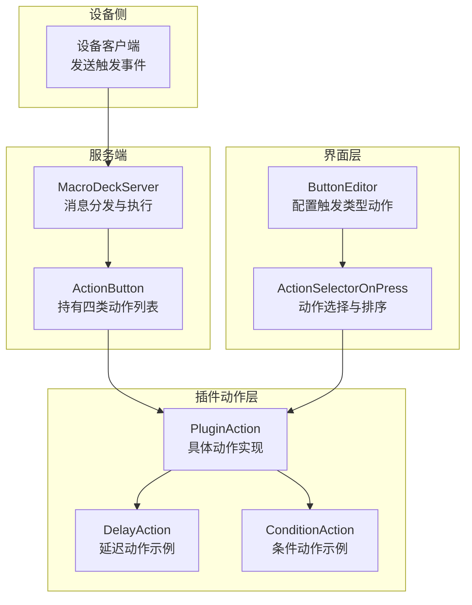
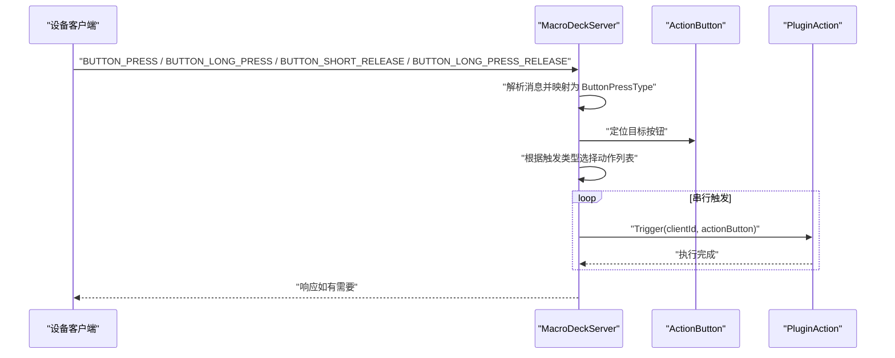
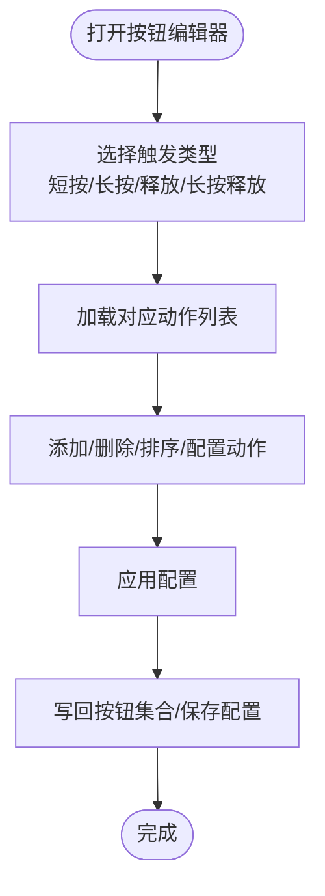
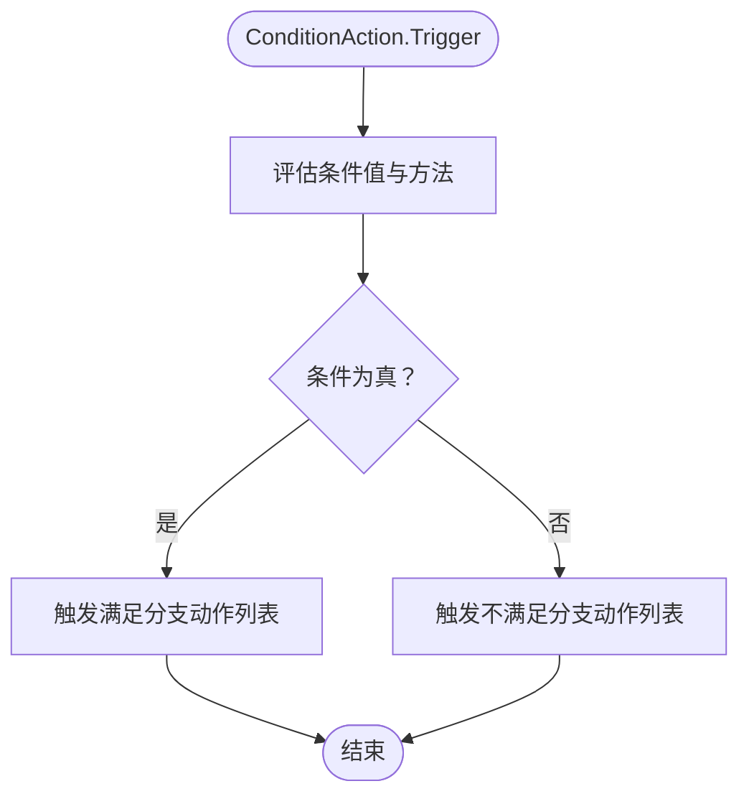
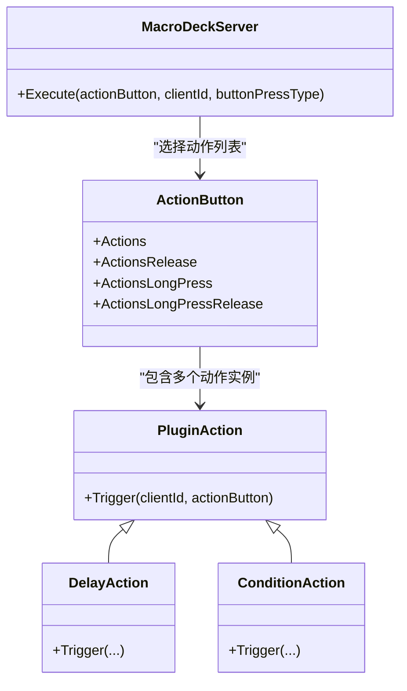

# 触发类型系统

<cite>
**本文引用的文件**
- [ButtonPressType.cs](file://src/MacroDeck/Enums/ButtonPressType.cs)
- [ActionButton.cs](file://src/MacroDeck/ActionButton/ActionButton.cs)
- [MacroDeckServer.cs](file://src/MacroDeck/Server/MacroDeckServer.cs)
- [ButtonEditor.cs](file://src/MacroDeck/GUI/Dialogs/ButtonEditor.cs)
- [ButtonEditor.Designer.cs](file://src/MacroDeck/GUI/Dialogs/ButtonEditor.Designer.cs)
- [ActionSelectorOnPress.cs](file://src/MacroDeck/GUI/CustomControls/ButtonEditor/ActionSelectorOnPress.cs)
- [EventListener.cs](file://src/MacroDeck/Events/EventListener.cs)
- [ConditionAction.cs](file://src/MacroDeck/ActionButton/ConditionAction.cs)
- [DelayAction.cs](file://src/MacroDeck/InternalPlugins/ActionButtonPlugin/Actions/DelayAction.cs)
</cite>

## 目录
1. [简介](#简介)
2. [项目结构](#项目结构)
3. [核心组件](#核心组件)
4. [架构总览](#架构总览)
5. [详细组件分析](#详细组件分析)
6. [依赖分析](#依赖分析)
7. [性能考虑](#性能考虑)
8. [故障排除指南](#故障排除指南)
9. [结论](#结论)
10. [附录：配置示例与最佳实践](#附录配置示例与最佳实践)

## 简介
本文件系统性阐述 Macro-Deck 的“触发类型系统”，聚焦于按钮触发机制与插件动作的绑定关系。内容覆盖以下触发类型及其行为边界：
- 短按（OnPress）
- 长按（OnLongPress）
- 释放触发（OnRelease）
- 长按释放（OnLongPressRelease）

并详细说明每种触发类型对应的 Action 列表（Actions、ActionsLongPress、ActionsRelease、ActionsLongPressRelease）的使用方式、执行顺序与条件判断，以及与插件动作（PluginAction）的关联关系。最后提供调试与故障排除建议及配置示例与最佳实践。

## 项目结构
触发类型系统主要由以下层次构成：
- 枚举层：定义触发类型枚举，统一客户端消息到服务端的映射。
- 按钮模型层：承载四类触发对应的 Action 列表与状态绑定等属性。
- 服务器层：接收设备上报的触发事件，解析为触发类型，并从按钮模型中取出对应 Action 列表进行串行触发。
- 图形界面层：提供按钮编辑器，允许用户为不同触发类型配置动作列表与事件监听器。
- 插件动作层：具体可被触发的动作（如变量操作、延迟等），通过统一的 Trigger 接口执行。

图表来源
- [MacroDeckServer.cs:209-277](file://src/MacroDeck/Server/MacroDeckServer.cs#L209-L277)
- [ActionButton.cs:190-197](file://src/MacroDeck/ActionButton/ActionButton.cs#L190-L197)
- [ButtonEditor.cs:378-411](file://src/MacroDeck/GUI/Dialogs/ButtonEditor.cs#L378-L411)
- [ActionSelectorOnPress.cs:15-24](file://src/MacroDeck/GUI/CustomControls/ButtonEditor/ActionSelectorOnPress.cs#L15-L24)
- [DelayAction.cs:7-22](file://src/MacroDeck/InternalPlugins/ActionButtonPlugin/Actions/DelayAction.cs#L7-L22)
- [ConditionAction.cs:242-256](file://src/MacroDeck/ActionButton/ConditionAction.cs#L242-L256)

章节来源
- [MacroDeckServer.cs:209-277](file://src/MacroDeck/Server/MacroDeckServer.cs#L209-L277)
- [ActionButton.cs:190-197](file://src/MacroDeck/ActionButton/ActionButton.cs#L190-L197)
- [ButtonEditor.cs:378-411](file://src/MacroDeck/GUI/Dialogs/ButtonEditor.cs#L378-L411)
- [ButtonEditor.Designer.cs:620-680](file://src/MacroDeck/GUI/Dialogs/ButtonEditor.Designer.cs#L620-L680)
- [ActionSelectorOnPress.cs:15-24](file://src/MacroDeck/GUI/CustomControls/ButtonEditor/ActionSelectorOnPress.cs#L15-L24)
- [DelayAction.cs:7-22](file://src/MacroDeck/InternalPlugins/ActionButtonPlugin/Actions/DelayAction.cs#L7-L22)
- [ConditionAction.cs:242-256](file://src/MacroDeck/ActionButton/ConditionAction.cs#L242-L256)

## 核心组件
- 触发类型枚举：用于将设备上报的触发事件映射为内部触发类型。
- ActionButton：承载按钮状态、图标、标签、背景色、热键、状态绑定变量，以及四类触发对应的 Action 列表。
- MacroDeckServer：负责解析设备消息、定位按钮、根据触发类型选择对应 Action 列表并串行触发。
- ButtonEditor：图形化配置工具，支持为不同触发类型设置动作列表与事件监听器。
- ActionSelectorOnPress：在按钮编辑器中管理某触发类型下的动作列表（增删改、排序、配置）。
- EventListener：事件监听器容器，保存事件名与参数及该事件下要执行的动作列表。
- ConditionAction：条件动作，依据条件结果在“满足”或“不满足”分支中分别触发一组动作。
- DelayAction：延迟动作，作为示例动作展示如何实现 Trigger。

章节来源
- [ButtonPressType.cs:3-9](file://src/MacroDeck/Enums/ButtonPressType.cs#L3-L9)
- [ActionButton.cs:190-197](file://src/MacroDeck/ActionButton/ActionButton.cs#L190-L197)
- [MacroDeckServer.cs:246-277](file://src/MacroDeck/Server/MacroDeckServer.cs#L246-L277)
- [ButtonEditor.cs:378-411](file://src/MacroDeck/GUI/Dialogs/ButtonEditor.cs#L378-L411)
- [ActionSelectorOnPress.cs:15-24](file://src/MacroDeck/GUI/CustomControls/ButtonEditor/ActionSelectorOnPress.cs#L15-L24)
- [EventListener.cs:5-11](file://src/MacroDeck/Events/EventListener.cs#L5-L11)
- [ConditionAction.cs:242-256](file://src/MacroDeck/ActionButton/ConditionAction.cs#L242-L256)
- [DelayAction.cs:7-22](file://src/MacroDeck/InternalPlugins/ActionButtonPlugin/Actions/DelayAction.cs#L7-L22)

## 架构总览
设备通过 WebSocket 向服务端发送按钮事件，服务端根据事件类型映射为触发类型，再从目标按钮的对应动作列表中逐个调用动作的 Trigger 方法。

图表来源
- [MacroDeckServer.cs:209-277](file://src/MacroDeck/Server/MacroDeckServer.cs#L209-L277)
- [ActionButton.cs:190-197](file://src/MacroDeck/ActionButton/ActionButton.cs#L190-L197)

章节来源
- [MacroDeckServer.cs:209-277](file://src/MacroDeck/Server/MacroDeckServer.cs#L209-L277)

## 详细组件分析

### 触发类型与映射
- 设备上报的触发事件通过服务端消息处理器映射为内部触发类型枚举，随后在执行阶段根据该枚举选择对应的动作列表。
- 映射规则：
  - BUTTON_PRESS → SHORT
  - BUTTON_LONG_PRESS → LONG
  - BUTTON_SHORT_RELEASE → SHORT_RELEASE
  - BUTTON_LONG_PRESS_RELEASE → LONG_RELEASE

章节来源
- [MacroDeckServer.cs:209-212](file://src/MacroDeck/Server/MacroDeckServer.cs#L209-L212)
- [ButtonPressType.cs:3-9](file://src/MacroDeck/Enums/ButtonPressType.cs#L3-L9)

### 动作列表与执行顺序
- 每个 ActionButton 拥有四类动作列表：
  - Actions（短按）
  - ActionsRelease（释放触发）
  - ActionsLongPress（长按）
  - ActionsLongPressRelease（长按释放）
- 执行顺序：
  - 服务端根据触发类型选择对应列表后，按列表顺序逐个调用每个动作的 Trigger 方法。
  - 每个动作的 Trigger 在独立线程中执行，异常被捕获并忽略，避免影响后续动作。

章节来源
- [ActionButton.cs:190-197](file://src/MacroDeck/ActionButton/ActionButton.cs#L190-L197)
- [MacroDeckServer.cs:246-277](file://src/MacroDeck/Server/MacroDeckServer.cs#L246-L277)

### 触发类型与插件动作的关联
- 插件动作通过统一接口 Trigger 执行，动作本身不关心触发类型，仅接收上下文（clientId、actionButton）。
- 条件动作（ConditionAction）可在满足条件时触发一组动作，在不满足时触发另一组动作，从而在同一条动作链中实现分支逻辑。

章节来源
- [ConditionAction.cs:242-256](file://src/MacroDeck/ActionButton/ConditionAction.cs#L242-L256)

### 图形化配置流程
- 用户在按钮编辑器中选择某一触发类型（短按/长按/释放/长按释放），编辑器加载对应的动作列表控件。
- 用户可通过动作选择器添加、删除、上移、下移动作，或打开动作配置界面进行参数设置。
- 应用时，编辑器会将当前编辑的按钮对象写回文件夹中的按钮集合，并更新热键与变量标签。

图表来源
- [ButtonEditor.cs:378-411](file://src/MacroDeck/GUI/Dialogs/ButtonEditor.cs#L378-L411)
- [ButtonEditor.Designer.cs:620-680](file://src/MacroDeck/GUI/Dialogs/ButtonEditor.Designer.cs#L620-L680)
- [ActionSelectorOnPress.cs:55-73](file://src/MacroDeck/GUI/CustomControls/ButtonEditor/ActionSelectorOnPress.cs#L55-L73)

章节来源
- [ButtonEditor.cs:378-411](file://src/MacroDeck/GUI/Dialogs/ButtonEditor.cs#L378-L411)
- [ButtonEditor.Designer.cs:620-680](file://src/MacroDeck/GUI/Dialogs/ButtonEditor.Designer.cs#L620-L680)
- [ActionSelectorOnPress.cs:55-73](file://src/MacroDeck/GUI/CustomControls/ButtonEditor/ActionSelectorOnPress.cs#L55-L73)

### 条件动作与分支执行
- 条件动作在执行时根据条件类型与方法对条件值进行评估，若为真则触发“满足分支”的动作列表，否则触发“不满足分支”的动作列表。
- 这使得在单一触发类型下，可以基于变量、按钮状态或模板渲染结果实现复杂的分支逻辑。

图表来源
- [ConditionAction.cs:212-256](file://src/MacroDeck/ActionButton/ConditionAction.cs#L212-L256)

章节来源
- [ConditionAction.cs:212-256](file://src/MacroDeck/ActionButton/ConditionAction.cs#L212-L256)

### 延迟动作示例
- 延迟动作在 Trigger 中按配置的毫秒数进行休眠，常用于在多动作之间插入停顿，确保外部系统有足够时间响应。

章节来源
- [DelayAction.cs:12-21](file://src/MacroDeck/InternalPlugins/ActionButtonPlugin/Actions/DelayAction.cs#L12-L21)

## 依赖分析
- 低耦合：触发类型与动作实现解耦，动作仅依赖上下文参数；服务端根据触发类型选择动作列表，不直接感知动作内部逻辑。
- 关系图：
  - MacroDeckServer 依赖 ActionButton 的动作列表字段。
  - ButtonEditor 依赖 ActionSelectorOnPress 管理动作列表。
  - ConditionAction 依赖变量/模板系统进行条件评估。
  - DelayAction 作为内置动作示例，展示如何实现 Trigger。

图表来源
- [MacroDeckServer.cs:246-277](file://src/MacroDeck/Server/MacroDeckServer.cs#L246-L277)
- [ActionButton.cs:190-197](file://src/MacroDeck/ActionButton/ActionButton.cs#L190-L197)
- [DelayAction.cs:7-22](file://src/MacroDeck/InternalPlugins/ActionButtonPlugin/Actions/DelayAction.cs#L7-L22)
- [ConditionAction.cs:242-256](file://src/MacroDeck/ActionButton/ConditionAction.cs#L242-L256)

章节来源
- [MacroDeckServer.cs:246-277](file://src/MacroDeck/Server/MacroDeckServer.cs#L246-L277)
- [ActionButton.cs:190-197](file://src/MacroDeck/ActionButton/ActionButton.cs#L190-L197)
- [DelayAction.cs:7-22](file://src/MacroDeck/InternalPlugins/ActionButtonPlugin/Actions/DelayAction.cs#L7-L22)
- [ConditionAction.cs:242-256](file://src/MacroDeck/ActionButton/ConditionAction.cs#L242-L256)

## 性能考虑
- 串行执行：每个触发类型下的动作列表按顺序执行，避免并发竞争，但可能增加单次触发的总耗时。
- 异步触发：服务端在独立线程中触发动作，减少阻塞主线程的风险。
- 延迟动作：合理使用 DelayAction 可避免外部系统过载，但应避免过长的延迟导致交互体验下降。
- 条件动作：条件评估应在保证正确性的前提下尽量简洁，避免复杂模板渲染带来的额外开销。

## 故障排除指南
- 动作未执行
  - 检查按钮是否处于正确的触发类型下，确认对应动作列表已配置。
  - 确认按钮所在文件夹已保存并重新加载。
- 触发类型不生效
  - 检查设备上报的消息类型是否正确，服务端是否能正确映射为触发类型。
  - 确认按钮坐标与设备上报一致。
- 条件动作未按预期分支
  - 检查条件类型与方法设置，确认变量或模板渲染结果符合预期。
- 调试建议
  - 使用调试控制台查看日志输出，关注触发执行过程中的异常信息。
  - 逐步减少动作数量，定位问题动作。
  - 对复杂模板进行简化测试，验证渲染结果。

章节来源
- [MacroDeckServer.cs:234-237](file://src/MacroDeck/Server/MacroDeckServer.cs#L234-L237)
- [ButtonEditor.cs:282-336](file://src/MacroDeck/GUI/Dialogs/ButtonEditor.cs#L282-L336)

## 结论
Macro-Deck 的触发类型系统通过明确的触发类型枚举、清晰的动作列表组织与统一的触发接口，实现了灵活而稳定的按钮触发机制。配合图形化配置工具与条件/延迟等内置动作，用户可以在不同场景下实现多样化的自动化与交互需求。遵循本文的最佳实践与故障排除建议，可有效提升系统的稳定性与可维护性。

## 附录：配置示例与最佳实践

### 配置示例
- 场景一：短按切换变量，长按释放恢复默认值
  - 短按：添加“变更变量”动作，设置为切换变量。
  - 长按释放：添加“变更变量”动作，设置为恢复默认值。
- 场景二：短按执行一组动作，释放时再执行一组动作
  - 短按：添加“播放媒体”、“发送通知”等动作。
  - 释放：添加“停止媒体”动作。
- 场景三：长按执行一组动作，同时在条件满足时执行另一组动作
  - 长按：添加“延迟”动作与“发送按键”动作。
  - 条件动作：当变量等于特定值时，触发一组动作；否则触发另一组动作。

### 最佳实践
- 将长按与短按的动作分离，避免在同一触发类型下混杂过多逻辑。
- 使用延迟动作协调外部系统响应时间，避免过于频繁的操作。
- 条件动作优先使用简单变量比较，复杂逻辑尽量通过模板渲染后进行布尔判断。
- 在按钮编辑器中保持动作顺序清晰，必要时使用分组或注释标记。
- 定期清理无效或重复的动作，降低触发时的执行负担。