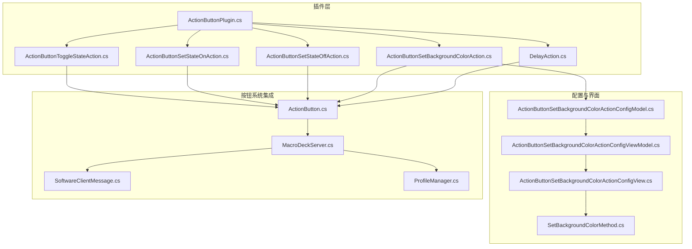
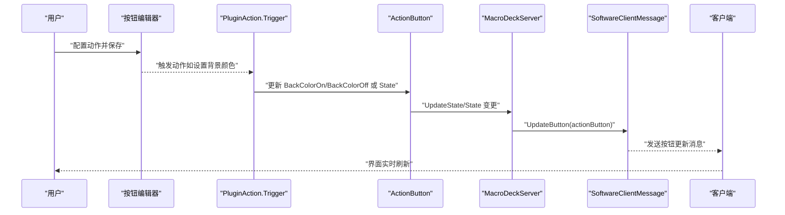
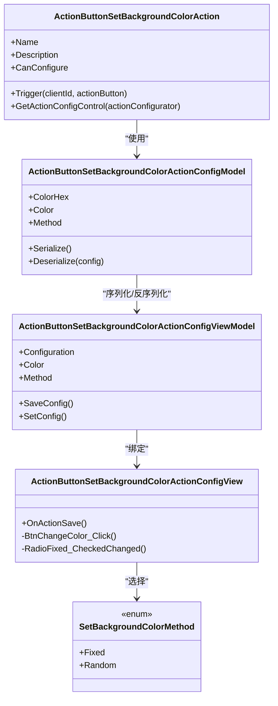
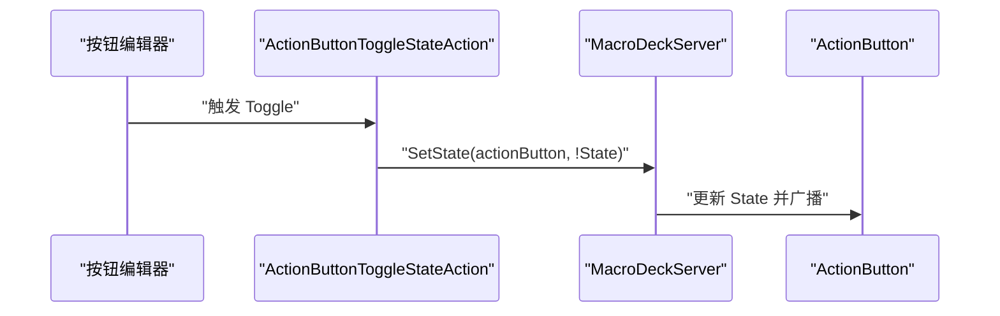
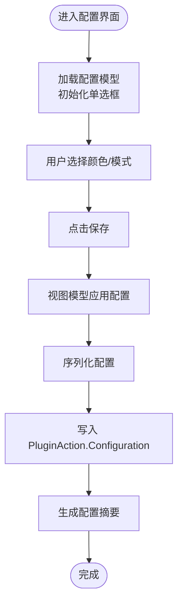
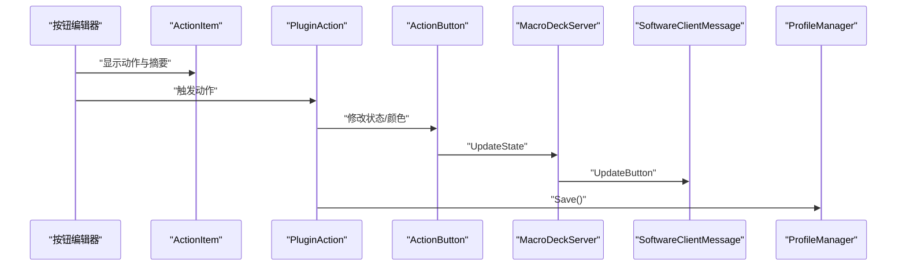
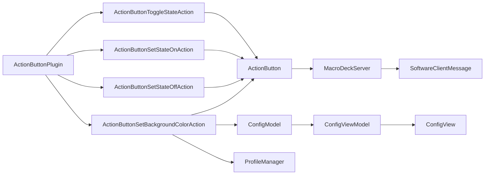

# ActionButtonPlugin（按钮操作插件）

<cite>
**本文引用的文件**
- [ActionButtonPlugin.cs](file://src/MacroDeck/InternalPlugins/ActionButtonPlugin/ActionButtonPlugin.cs)
- [ActionButtonSetBackgroundColorAction.cs](file://src/MacroDeck/InternalPlugins/ActionButtonPlugin/Actions/ActionButtonSetBackgroundColorAction.cs)
- [ActionButtonSetStateOffAction.cs](file://src/MacroDeck/InternalPlugins/ActionButtonPlugin/Actions/ActionButtonSetStateOffAction.cs)
- [ActionButtonSetStateOnAction.cs](file://src/MacroDeck/InternalPlugins/ActionButtonPlugin/Actions/ActionButtonSetStateOnAction.cs)
- [ActionButtonToggleStateAction.cs](file://src/MacroDeck/InternalPlugins/ActionButtonPlugin/Actions/ActionButtonToggleStateAction.cs)
- [DelayAction.cs](file://src/MacroDeck/InternalPlugins/ActionButtonPlugin/Actions/DelayAction.cs)
- [SetBackgroundColorMethod.cs](file://src/MacroDeck/InternalPlugins/ActionButtonPlugin/Enums/SetBackgroundColorMethod.cs)
- [ActionButtonSetBackgroundColorActionConfigModel.cs](file://src/MacroDeck/InternalPlugins/ActionButtonPlugin/Models/ActionButtonSetBackgroundColorActionConfigModel.cs)
- [ActionButtonSetBackgroundColorActionConfigViewModel.cs](file://src/MacroDeck/InternalPlugins/ActionButtonPlugin/ViewModels/ActionButtonSetBackgroundColorActionConfigViewModel.cs)
- [ActionButtonSetBackgroundColorActionConfigView.cs](file://src/MacroDeck/InternalPlugins/ActionButtonPlugin/Views/ActionButtonSetBackgroundColorActionConfigView.cs)
- [ActionButton.cs](file://src/MacroDeck/ActionButton/ActionButton.cs)
- [ActionConfigControl.cs](file://src/MacroDeck/GUI/CustomControls/ActionConfigControl.cs)
- [ActionItem.cs](file://src/MacroDeck/GUI/CustomControls/ButtonEditor/ActionItem.cs)
- [MacroDeckServer.cs](file://src/MacroDeck/Server/MacroDeckServer.cs)
- [SoftwareClientMessage.cs](file://src/MacroDeck/Server/DeviceMessage/SoftwareClientMessage.cs)
- [ProfileManager.cs](file://src/MacroDeck/Profiles/ProfileManager.cs)
</cite>

## 目录
1. [简介](#简介)
2. [项目结构](#项目结构)
3. [核心组件](#核心组件)
4. [架构总览](#架构总览)
5. [详细组件分析](#详细组件分析)
6. [依赖关系分析](#依赖关系分析)
7. [性能考量](#性能考量)
8. [故障排查指南](#故障排查指南)
9. [结论](#结论)
10. [附录](#附录)

## 简介
ActionButtonPlugin 是一个内置插件，用于为按钮系统提供可配置的动作能力。它提供了四种主要动作类型：
- 设置背景颜色：支持固定颜色或随机颜色两种模式，并根据按钮当前状态选择更新“开启”或“关闭”的背景色。
- 切换按钮状态：在按下时将按钮状态翻转为相反值。
- 设置按钮状态为开启：仅当按钮处于关闭状态时将其置为开启。
- 设置按钮状态为关闭：仅当按钮处于开启状态时将其置为关闭。
- 延迟执行：按配置的毫秒数进行线程休眠，常用于串行动作之间的节流。

该插件通过 ActionButton 类与按钮系统深度集成，所有动作触发后会更新按钮状态并通知客户端刷新显示；同时，颜色设置动作会持久化配置并通过 ProfileManager 保存。

## 项目结构
ActionButtonPlugin 的目录组织遵循“按功能分层”的设计：
- 插件入口：ActionButtonPlugin.cs
- 动作实现：Actions/*.cs
- 配置模型与视图模型：Models/*、ViewModels/*
- 配置界面：Views/*
- 枚举：Enums/*
- 与按钮系统的集成点：ActionButton.cs、MacroDeckServer.cs、SoftwareClientMessage.cs、ProfileManager.cs

**图表来源**
- [ActionButtonPlugin.cs:10-25](file://src/MacroDeck/InternalPlugins/ActionButtonPlugin/ActionButtonPlugin.cs#L10-L25)
- [ActionButtonSetBackgroundColorAction.cs:12-55](file://src/MacroDeck/InternalPlugins/ActionButtonPlugin/Actions/ActionButtonSetBackgroundColorAction.cs#L12-L55)
- [ActionButtonSetStateOnAction.cs:9-24](file://src/MacroDeck/InternalPlugins/ActionButtonPlugin/Actions/ActionButtonSetStateOnAction.cs#L9-L24)
- [ActionButtonSetStateOffAction.cs:9-23](file://src/MacroDeck/InternalPlugins/ActionButtonPlugin/Actions/ActionButtonSetStateOffAction.cs#L9-L23)
- [ActionButtonToggleStateAction.cs:9-18](file://src/MacroDeck/InternalPlugins/ActionButtonPlugin/Actions/ActionButtonToggleStateAction.cs#L9-L18)
- [DelayAction.cs:7-22](file://src/MacroDeck/InternalPlugins/ActionButtonPlugin/Actions/DelayAction.cs#L7-L22)
- [ActionButtonSetBackgroundColorActionConfigModel.cs:8-31](file://src/MacroDeck/InternalPlugins/ActionButtonPlugin/Models/ActionButtonSetBackgroundColorActionConfigModel.cs#L8-L31)
- [ActionButtonSetBackgroundColorActionConfigViewModel.cs:11-66](file://src/MacroDeck/InternalPlugins/ActionButtonPlugin/ViewModels/ActionButtonSetBackgroundColorActionConfigViewModel.cs#L11-L66)
- [ActionButtonSetBackgroundColorActionConfigView.cs:9-72](file://src/MacroDeck/InternalPlugins/ActionButtonPlugin/Views/ActionButtonSetBackgroundColorActionConfigView.cs#L9-L72)
- [SetBackgroundColorMethod.cs:3-7](file://src/MacroDeck/InternalPlugins/ActionButtonPlugin/Enums/SetBackgroundColorMethod.cs#L3-L7)
- [ActionButton.cs:10-197](file://src/MacroDeck/ActionButton/ActionButton.cs#L10-L197)
- [MacroDeckServer.cs:340-354](file://src/MacroDeck/Server/MacroDeckServer.cs#L340-L354)
- [SoftwareClientMessage.cs:124-137](file://src/MacroDeck/Server/DeviceMessage/SoftwareClientMessage.cs#L124-L137)
- [ProfileManager.cs:179-203](file://src/MacroDeck/Profiles/ProfileManager.cs#L179-L203)

**章节来源**
- [ActionButtonPlugin.cs:10-25](file://src/MacroDeck/InternalPlugins/ActionButtonPlugin/ActionButtonPlugin.cs#L10-L25)

## 核心组件
- 插件入口：ActionButtonPlugin 在启用时注册四个动作实例，供按钮编辑器选择。
- 四大动作：
  - ToggleState：翻转按钮状态
  - SetStateOn：置为开启
  - SetStateOff：置为关闭
  - SetBackgroundColor：设置背景颜色（含固定/随机两种模式）
- 延迟动作：DelayAction，按配置字符串解析的毫秒数休眠
- 颜色设置方法枚举：SetBackgroundColorMethod，包含 Fixed 和 Random
- 配置模型与视图模型：统一序列化/反序列化逻辑，支持配置摘要生成
- 配置界面：ActionButtonSetBackgroundColorActionConfigView，提供颜色选择与单选框切换

**章节来源**
- [ActionButtonPlugin.cs:15-24](file://src/MacroDeck/InternalPlugins/ActionButtonPlugin/ActionButtonPlugin.cs#L15-L24)
- [ActionButtonToggleStateAction.cs:9-18](file://src/MacroDeck/InternalPlugins/ActionButtonPlugin/Actions/ActionButtonToggleStateAction.cs#L9-L18)
- [ActionButtonSetStateOnAction.cs:9-24](file://src/MacroDeck/InternalPlugins/ActionButtonPlugin/Actions/ActionButtonSetStateOnAction.cs#L9-L24)
- [ActionButtonSetStateOffAction.cs:9-23](file://src/MacroDeck/InternalPlugins/ActionButtonPlugin/Actions/ActionButtonSetStateOffAction.cs#L9-L23)
- [ActionButtonSetBackgroundColorAction.cs:12-55](file://src/MacroDeck/InternalPlugins/ActionButtonPlugin/Actions/ActionButtonSetBackgroundColorAction.cs#L12-L55)
- [DelayAction.cs:7-22](file://src/MacroDeck/InternalPlugins/ActionButtonPlugin/Actions/DelayAction.cs#L7-L22)
- [SetBackgroundColorMethod.cs:3-7](file://src/MacroDeck/InternalPlugins/ActionButtonPlugin/Enums/SetBackgroundColorMethod.cs#L3-L7)
- [ActionButtonSetBackgroundColorActionConfigModel.cs:8-31](file://src/MacroDeck/InternalPlugins/ActionButtonPlugin/Models/ActionButtonSetBackgroundColorActionConfigModel.cs#L8-L31)
- [ActionButtonSetBackgroundColorActionConfigViewModel.cs:11-66](file://src/MacroDeck/InternalPlugins/ActionButtonPlugin/ViewModels/ActionButtonSetBackgroundColorActionConfigViewModel.cs#L11-L66)
- [ActionButtonSetBackgroundColorActionConfigView.cs:9-72](file://src/MacroDeck/InternalPlugins/ActionButtonPlugin/Views/ActionButtonSetBackgroundColorActionConfigView.cs#L9-L72)

## 架构总览
ActionButtonPlugin 与按钮系统的交互链路如下：
- 用户在按钮编辑器中为某个事件（如按下、释放、长按）绑定动作
- 触发时，对应 PluginAction 的 Trigger 方法被调用
- 动作修改 ActionButton 的状态或颜色属性
- MacroDeckServer 接收状态变更并广播到已连接的客户端
- SoftwareClientMessage 将按钮的图标、标签、背景色等信息打包发送给设备端
- ProfileManager 负责持久化配置与向客户端推送更新

**图表来源**
- [ActionButtonSetBackgroundColorAction.cs:20-49](file://src/MacroDeck/InternalPlugins/ActionButtonPlugin/Actions/ActionButtonSetBackgroundColorAction.cs#L20-L49)
- [ActionButton.cs:114-181](file://src/MacroDeck/ActionButton/ActionButton.cs#L114-L181)
- [MacroDeckServer.cs:345-352](file://src/MacroDeck/Server/MacroDeckServer.cs#L345-L352)
- [SoftwareClientMessage.cs:124-137](file://src/MacroDeck/Server/DeviceMessage/SoftwareClientMessage.cs#L124-L137)

## 详细组件分析

### 动作：设置背景颜色（SetBackgroundColor）
- 功能概述
  - 支持两种模式：固定颜色（Fixed）与随机颜色（Random）
  - 根据按钮当前状态决定更新 BackColorOn 或 BackColorOff
  - 触发后立即保存配置并通知客户端刷新
- 关键实现要点
  - 配置模型 ActionButtonSetBackgroundColorActionConfigModel 提供 ColorHex 与 Method 字段，并通过 Color 属性桥接 ColorConverter
  - 视图模型 ActionButtonSetBackgroundColorActionConfigViewModel 负责序列化配置与生成配置摘要
  - 视图 ActionButtonSetBackgroundColorActionConfigView 提供 UI 交互：颜色选择器、单选框切换、保存逻辑
  - 动作类 ActionButtonSetBackgroundColorAction 在 Trigger 中解析配置、计算目标颜色、写入按钮属性并调用 ProfileManager.Save()

**图表来源**
- [ActionButtonSetBackgroundColorAction.cs:12-55](file://src/MacroDeck/InternalPlugins/ActionButtonPlugin/Actions/ActionButtonSetBackgroundColorAction.cs#L12-L55)
- [ActionButtonSetBackgroundColorActionConfigModel.cs:8-31](file://src/MacroDeck/InternalPlugins/ActionButtonPlugin/Models/ActionButtonSetBackgroundColorActionConfigModel.cs#L8-L31)
- [ActionButtonSetBackgroundColorActionConfigViewModel.cs:11-66](file://src/MacroDeck/InternalPlugins/ActionButtonPlugin/ViewModels/ActionButtonSetBackgroundColorActionConfigViewModel.cs#L11-L66)
- [ActionButtonSetBackgroundColorActionConfigView.cs:9-72](file://src/MacroDeck/InternalPlugins/ActionButtonPlugin/Views/ActionButtonSetBackgroundColorActionConfigView.cs#L9-L72)
- [SetBackgroundColorMethod.cs:3-7](file://src/MacroDeck/InternalPlugins/ActionButtonPlugin/Enums/SetBackgroundColorMethod.cs#L3-L7)

**章节来源**
- [ActionButtonSetBackgroundColorAction.cs:12-55](file://src/MacroDeck/InternalPlugins/ActionButtonPlugin/Actions/ActionButtonSetBackgroundColorAction.cs#L12-L55)
- [ActionButtonSetBackgroundColorActionConfigModel.cs:8-31](file://src/MacroDeck/InternalPlugins/ActionButtonPlugin/Models/ActionButtonSetBackgroundColorActionConfigModel.cs#L8-L31)
- [ActionButtonSetBackgroundColorActionConfigViewModel.cs:11-66](file://src/MacroDeck/InternalPlugins/ActionButtonPlugin/ViewModels/ActionButtonSetBackgroundColorActionConfigViewModel.cs#L11-L66)
- [ActionButtonSetBackgroundColorActionConfigView.cs:9-72](file://src/MacroDeck/InternalPlugins/ActionButtonPlugin/Views/ActionButtonSetBackgroundColorActionConfigView.cs#L9-L72)
- [SetBackgroundColorMethod.cs:3-7](file://src/MacroDeck/InternalPlugins/ActionButtonPlugin/Enums/SetBackgroundColorMethod.cs#L3-L7)

### 动作：切换按钮状态（ToggleState）
- 功能概述
  - 将按钮状态翻转为相反值
- 实现要点
  - 直接调用 MacroDeckServer.SetState(actionButton, !actionButton.State)

**图表来源**
- [ActionButtonToggleStateAction.cs:14-17](file://src/MacroDeck/InternalPlugins/ActionButtonPlugin/Actions/ActionButtonToggleStateAction.cs#L14-L17)
- [MacroDeckServer.cs:340-343](file://src/MacroDeck/Server/MacroDeckServer.cs#L340-L343)

**章节来源**
- [ActionButtonToggleStateAction.cs:9-18](file://src/MacroDeck/InternalPlugins/ActionButtonPlugin/Actions/ActionButtonToggleStateAction.cs#L9-L18)
- [MacroDeckServer.cs:340-343](file://src/MacroDeck/Server/MacroDeckServer.cs#L340-L343)

### 动作：设置按钮状态为开启（SetStateOn）
- 功能概述
  - 仅当按钮处于关闭状态时将其置为开启
- 实现要点
  - 若已开启则直接返回，避免重复触发

**章节来源**
- [ActionButtonSetStateOnAction.cs:9-24](file://src/MacroDeck/InternalPlugins/ActionButtonPlugin/Actions/ActionButtonSetStateOnAction.cs#L9-L24)

### 动作：设置按钮状态为关闭（SetStateOff）
- 功能概述
  - 仅当按钮处于开启状态时将其置为关闭
- 实现要点
  - 若已关闭则直接返回，避免重复触发

**章节来源**
- [ActionButtonSetStateOffAction.cs:9-23](file://src/MacroDeck/InternalPlugins/ActionButtonPlugin/Actions/ActionButtonSetStateOffAction.cs#L9-L23)

### 动作：延迟执行（DelayAction）
- 功能概述
  - 按配置字符串解析的毫秒数进行线程休眠
- 实现要点
  - 使用 try/catch 忽略解析失败的情况，保证稳定性

**章节来源**
- [DelayAction.cs:7-22](file://src/MacroDeck/InternalPlugins/ActionButtonPlugin/Actions/DelayAction.cs#L7-L22)

### 颜色设置方法枚举（SetBackgroundColorMethod）
- 枚举项
  - Fixed：固定颜色
  - Random：随机颜色
- 使用场景
  - 在配置模型中选择颜色生成策略
  - 在视图模型中生成配置摘要，便于按钮编辑器展示

**章节来源**
- [SetBackgroundColorMethod.cs:3-7](file://src/MacroDeck/InternalPlugins/ActionButtonPlugin/Enums/SetBackgroundColorMethod.cs#L3-L7)

### 配置模型与视图模型
- 配置模型 ActionButtonSetBackgroundColorActionConfigModel
  - 字段：ColorHex（默认值）、Method（默认 Fixed）、Color（基于 ColorConverter 的桥接属性）
  - 序列化/反序列化：使用 ISerializableConfiguration
- 视图模型 ActionButtonSetBackgroundColorActionConfigViewModel
  - 负责将 UI 输入映射到配置模型
  - 生成配置摘要（ConfigurationSummary），用于按钮编辑器显示
  - SaveConfig/SetConfig 完成持久化与摘要更新
- 视图 ActionButtonSetBackgroundColorActionConfigView
  - 加载时根据 Method 初始化单选框
  - OnActionSave 时从 UI 读取颜色与模式并保存

**图表来源**
- [ActionButtonSetBackgroundColorActionConfigView.cs:21-48](file://src/MacroDeck/InternalPlugins/ActionButtonPlugin/Views/ActionButtonSetBackgroundColorActionConfigView.cs#L21-L48)
- [ActionButtonSetBackgroundColorActionConfigViewModel.cs:41-65](file://src/MacroDeck/InternalPlugins/ActionButtonPlugin/ViewModels/ActionButtonSetBackgroundColorActionConfigViewModel.cs#L41-L65)
- [ActionButtonSetBackgroundColorActionConfigModel.cs:22-30](file://src/MacroDeck/InternalPlugins/ActionButtonPlugin/Models/ActionButtonSetBackgroundColorActionConfigModel.cs#L22-L30)

**章节来源**
- [ActionButtonSetBackgroundColorActionConfigModel.cs:8-31](file://src/MacroDeck/InternalPlugins/ActionButtonPlugin/Models/ActionButtonSetBackgroundColorActionConfigModel.cs#L8-L31)
- [ActionButtonSetBackgroundColorActionConfigViewModel.cs:11-66](file://src/MacroDeck/InternalPlugins/ActionButtonPlugin/ViewModels/ActionButtonSetBackgroundColorActionConfigViewModel.cs#L11-L66)
- [ActionButtonSetBackgroundColorActionConfigView.cs:9-72](file://src/MacroDeck/InternalPlugins/ActionButtonPlugin/Views/ActionButtonSetBackgroundColorActionConfigView.cs#L9-L72)

### 插件与按钮系统的集成与数据流
- 触发路径
  - 用户在按钮编辑器中绑定动作，保存后由 ActionItem 渲染动作名称与配置摘要
  - 触发时 PluginAction.Trigger 修改 ActionButton 的状态或颜色
- 状态传播
  - ActionButton 的 State/BackColorOn/BackColorOff 属性变更会触发 MacroDeckServer.UpdateState
  - MacroDeckServer 将按钮更新推送到所有连接的客户端
  - SoftwareClientMessage 将按钮的图标、标签、背景色等信息打包发送
- 持久化
  - 颜色设置动作在完成后调用 ProfileManager.Save() 以持久化配置

**图表来源**
- [ActionItem.cs:16-23](file://src/MacroDeck/GUI/CustomControls/ButtonEditor/ActionItem.cs#L16-L23)
- [ActionButton.cs:114-181](file://src/MacroDeck/ActionButton/ActionButton.cs#L114-L181)
- [MacroDeckServer.cs:345-352](file://src/MacroDeck/Server/MacroDeckServer.cs#L345-L352)
- [SoftwareClientMessage.cs:124-137](file://src/MacroDeck/Server/DeviceMessage/SoftwareClientMessage.cs#L124-L137)
- [ActionButtonSetBackgroundColorAction.cs:48-49](file://src/MacroDeck/InternalPlugins/ActionButtonPlugin/Actions/ActionButtonSetBackgroundColorAction.cs#L48-L49)

**章节来源**
- [ActionItem.cs:6-45](file://src/MacroDeck/GUI/CustomControls/ButtonEditor/ActionItem.cs#L6-L45)
- [ActionButton.cs:114-181](file://src/MacroDeck/ActionButton/ActionButton.cs#L114-L181)
- [MacroDeckServer.cs:345-352](file://src/MacroDeck/Server/MacroDeckServer.cs#L345-L352)
- [SoftwareClientMessage.cs:124-137](file://src/MacroDeck/Server/DeviceMessage/SoftwareClientMessage.cs#L124-L137)
- [ActionButtonSetBackgroundColorAction.cs:48-49](file://src/MacroDeck/InternalPlugins/ActionButtonPlugin/Actions/ActionButtonSetBackgroundColorAction.cs#L48-L49)

## 依赖关系分析
- 插件注册
  - ActionButtonPlugin.Enable() 注册四个动作实例，确保按钮编辑器可用
- 动作对按钮系统的依赖
  - Toggle/SetOn/SetOff 直接依赖 MacroDeckServer.SetState
  - SetBackgroundColor 依赖 ActionButton 的 BackColorOn/BackColorOff 属性
- 配置层依赖
  - 配置模型依赖 ColorConverter 进行颜色转换
  - 视图模型依赖 ISerializableConfiguration 进行序列化
- 界面层依赖
  - ActionConfigControl 作为配置控件基类，提供 OnActionSave 生命周期钩子
  - ActionItem 用于在按钮编辑器中展示动作与摘要

**图表来源**
- [ActionButtonPlugin.cs:17-23](file://src/MacroDeck/InternalPlugins/ActionButtonPlugin/ActionButtonPlugin.cs#L17-L23)
- [ActionButtonSetBackgroundColorAction.cs:22-49](file://src/MacroDeck/InternalPlugins/ActionButtonPlugin/Actions/ActionButtonSetBackgroundColorAction.cs#L22-L49)
- [ActionButtonSetStateOnAction.cs:21-22](file://src/MacroDeck/InternalPlugins/ActionButtonPlugin/Actions/ActionButtonSetStateOnAction.cs#L21-L22)
- [ActionButtonSetStateOffAction.cs:21](file://src/MacroDeck/InternalPlugins/ActionButtonPlugin/Actions/ActionButtonSetStateOffAction.cs#L21)
- [ActionButtonToggleStateAction.cs:16](file://src/MacroDeck/InternalPlugins/ActionButtonPlugin/Actions/ActionButtonToggleStateAction.cs#L16)
- [ActionButtonSetBackgroundColorActionConfigModel.cs:10-17](file://src/MacroDeck/InternalPlugins/ActionButtonPlugin/Models/ActionButtonSetBackgroundColorActionConfigModel.cs#L10-L17)
- [ActionButtonSetBackgroundColorActionConfigViewModel.cs:18-32](file://src/MacroDeck/InternalPlugins/ActionButtonPlugin/ViewModels/ActionButtonSetBackgroundColorActionConfigViewModel.cs#L18-L32)
- [ActionButtonSetBackgroundColorActionConfigView.cs:13-16](file://src/MacroDeck/InternalPlugins/ActionButtonPlugin/Views/ActionButtonSetBackgroundColorActionConfigView.cs#L13-L16)
- [ActionButton.cs:114-181](file://src/MacroDeck/ActionButton/ActionButton.cs#L114-L181)
- [MacroDeckServer.cs:340-352](file://src/MacroDeck/Server/MacroDeckServer.cs#L340-L352)
- [SoftwareClientMessage.cs:124-137](file://src/MacroDeck/Server/DeviceMessage/SoftwareClientMessage.cs#L124-L137)
- [ProfileManager.cs:179-203](file://src/MacroDeck/Profiles/ProfileManager.cs#L179-L203)

**章节来源**
- [ActionButtonPlugin.cs:15-24](file://src/MacroDeck/InternalPlugins/ActionButtonPlugin/ActionButtonPlugin.cs#L15-L24)
- [ActionButtonSetBackgroundColorAction.cs:20-49](file://src/MacroDeck/InternalPlugins/ActionButtonPlugin/Actions/ActionButtonSetBackgroundColorAction.cs#L20-L49)
- [ActionButtonSetStateOnAction.cs:14-22](file://src/MacroDeck/InternalPlugins/ActionButtonPlugin/Actions/ActionButtonSetStateOnAction.cs#L14-L22)
- [ActionButtonSetStateOffAction.cs:14-21](file://src/MacroDeck/InternalPlugins/ActionButtonPlugin/Actions/ActionButtonSetStateOffAction.cs#L14-L21)
- [ActionButtonToggleStateAction.cs:14-16](file://src/MacroDeck/InternalPlugins/ActionButtonPlugin/Actions/ActionButtonToggleStateAction.cs#L14-L16)
- [ActionButtonSetBackgroundColorActionConfigModel.cs:8-31](file://src/MacroDeck/InternalPlugins/ActionButtonPlugin/Models/ActionButtonSetBackgroundColorActionConfigModel.cs#L8-L31)
- [ActionButtonSetBackgroundColorActionConfigViewModel.cs:11-66](file://src/MacroDeck/InternalPlugins/ActionButtonPlugin/ViewModels/ActionButtonSetBackgroundColorActionConfigViewModel.cs#L11-L66)
- [ActionButtonSetBackgroundColorActionConfigView.cs:9-72](file://src/MacroDeck/InternalPlugins/ActionButtonPlugin/Views/ActionButtonSetBackgroundColorActionConfigView.cs#L9-L72)
- [ActionButton.cs:114-181](file://src/MacroDeck/ActionButton/ActionButton.cs#L114-L181)
- [MacroDeckServer.cs:340-352](file://src/MacroDeck/Server/MacroDeckServer.cs#L340-L352)
- [SoftwareClientMessage.cs:124-137](file://src/MacroDeck/Server/DeviceMessage/SoftwareClientMessage.cs#L124-L137)
- [ProfileManager.cs:179-203](file://src/MacroDeck/Profiles/ProfileManager.cs#L179-L203)

## 性能考量
- 颜色随机生成
  - 首次使用时创建 Random 实例，避免每次触发都创建新对象
- 线程安全
  - DelayAction 使用 Thread.Sleep，注意在 UI 线程中调用可能阻塞界面
- 客户端推送
  - MacroDeckServer.UpdateState 会遍历所有连接客户端并推送按钮更新，频繁触发可能导致网络压力增大
- 建议
  - 对于高频动作（如连续触发的颜色变化），建议合并更新或增加节流
  - 在延迟动作中避免过长的休眠时间，以免影响用户体验

[本节为通用性能建议，不直接分析具体文件]

## 故障排查指南
- 颜色未生效
  - 检查配置是否正确保存（视图模型 SaveConfig 是否成功）
  - 确认按钮当前状态与目标颜色属性匹配（On/Off）
  - 查看 ProfileManager.Save() 是否被调用
- 状态翻转无效
  - 确认 MacroDeckServer.SetState 是否被调用
  - 检查 ActionButton.State 属性是否被正确赋值
- 延迟动作无响应
  - 检查配置字符串是否为合法整数
  - 注意异常捕获逻辑，解析失败会被忽略
- 客户端未刷新
  - 检查 MacroDeckServer.UpdateState 是否被调用
  - 确认 SoftwareClientMessage.UpdateButton 是否被调用

**章节来源**
- [ActionButtonSetBackgroundColorActionConfigViewModel.cs:41-54](file://src/MacroDeck/InternalPlugins/ActionButtonPlugin/ViewModels/ActionButtonSetBackgroundColorActionConfigViewModel.cs#L41-L54)
- [ActionButtonSetBackgroundColorAction.cs:48-49](file://src/MacroDeck/InternalPlugins/ActionButtonPlugin/Actions/ActionButtonSetBackgroundColorAction.cs#L48-L49)
- [MacroDeckServer.cs:345-352](file://src/MacroDeck/Server/MacroDeckServer.cs#L345-L352)
- [SoftwareClientMessage.cs:124-137](file://src/MacroDeck/Server/DeviceMessage/SoftwareClientMessage.cs#L124-L137)
- [DelayAction.cs:14-21](file://src/MacroDeck/InternalPlugins/ActionButtonPlugin/Actions/DelayAction.cs#L14-L21)

## 结论
ActionButtonPlugin 通过清晰的动作抽象与配置体系，为按钮系统提供了灵活且易用的操作能力。其与按钮系统、服务端与客户端的紧密耦合确保了状态与外观的实时同步。开发者可通过扩展新的 PluginAction 来定制更多动作类型，并复用现有的配置模型、视图模型与视图控件，快速实现一致的用户体验。

[本节为总结性内容，不直接分析具体文件]

## 附录

### 使用示例与配置参数说明
- 设置背景颜色（固定颜色）
  - 动作名称：见语言资源中的“设置背景颜色”
  - 配置参数：
    - ColorHex：十六进制颜色字符串，默认值为“#232323”
    - Method：SetBackgroundColorMethod.Fixed
  - 行为：根据按钮当前状态更新 BackColorOn 或 BackColorOff
  - 示例路径：
    - [ActionButtonSetBackgroundColorActionConfigModel.cs:10](file://src/MacroDeck/InternalPlugins/ActionButtonPlugin/Models/ActionButtonSetBackgroundColorActionConfigModel.cs#L10)
    - [ActionButtonSetBackgroundColorActionConfigView.cs:35-48](file://src/MacroDeck/InternalPlugins/ActionButtonPlugin/Views/ActionButtonSetBackgroundColorActionConfigView.cs#L35-L48)
- 设置背景颜色（随机颜色）
  - 动作名称：见语言资源中的“设置背景颜色”
  - 配置参数：
    - Method：SetBackgroundColorMethod.Random
  - 行为：每次触发生成 0-255 的 RGB 随机色
  - 示例路径：
    - [ActionButtonSetBackgroundColorAction.cs:24-36](file://src/MacroDeck/InternalPlugins/ActionButtonPlugin/Actions/ActionButtonSetBackgroundColorAction.cs#L24-L36)
- 切换按钮状态
  - 动作名称：见语言资源中的“切换按钮状态”
  - 配置：无需配置（CanConfigure=false）
  - 行为：State = !State
  - 示例路径：
    - [ActionButtonToggleStateAction.cs:11-16](file://src/MacroDeck/InternalPlugins/ActionButtonPlugin/Actions/ActionButtonToggleStateAction.cs#L11-L16)
- 设置按钮状态为开启
  - 动作名称：见语言资源中的“设置按钮状态为开启”
  - 配置：无需配置（CanConfigure=false）
  - 行为：若 State 已为 true 则返回，否则置为 true
  - 示例路径：
    - [ActionButtonSetStateOnAction.cs:15-22](file://src/MacroDeck/InternalPlugins/ActionButtonPlugin/Actions/ActionButtonSetStateOnAction.cs#L15-L22)
- 设置按钮状态为关闭
  - 动作名称：见语言资源中的“设置按钮状态为关闭”
  - 配置：无需配置（CanConfigure=false）
  - 行为：若 State 已为 false 则返回，否则置为 false
  - 示例路径：
    - [ActionButtonSetStateOffAction.cs:14-21](file://src/MacroDeck/InternalPlugins/ActionButtonPlugin/Actions/ActionButtonSetStateOffAction.cs#L14-L21)
- 延迟执行
  - 动作名称：Delay
  - 配置参数：
    - 配置字符串：毫秒数（整数字符串）
  - 行为：Thread.Sleep 解析后的毫秒数
  - 示例路径：
    - [DelayAction.cs:12-21](file://src/MacroDeck/InternalPlugins/ActionButtonPlugin/Actions/DelayAction.cs#L12-L21)

### 开发者扩展与自定义动作指导
- 新增动作步骤
  - 继承 PluginAction，实现 Name、Description、Trigger 与可选的 CanConfigure
  - 如需配置界面，实现配置模型（ISerializableConfiguration）、视图模型（ISerializableConfigViewModel）与视图（ActionConfigControl）
  - 在 ActionButtonPlugin.Enable() 中注册新动作实例
- 集成按钮系统
  - 通过 MacroDeckServer.SetState 修改按钮状态
  - 直接修改 ActionButton 的属性（如 BackColorOn/BackColorOff）以更新外观
  - 在动作完成后调用 ProfileManager.Save() 保存配置
- UI 集成
  - 使用 ActionItem 在按钮编辑器中展示动作与摘要
  - 使用 ActionConfigControl 的 OnActionSave 生命周期钩子处理保存逻辑

**章节来源**
- [ActionButtonPlugin.cs:15-24](file://src/MacroDeck/InternalPlugins/ActionButtonPlugin/ActionButtonPlugin.cs#L15-L24)
- [ActionConfigControl.cs:9-13](file://src/MacroDeck/GUI/CustomControls/ActionConfigControl.cs#L9-L13)
- [ActionItem.cs:16-23](file://src/MacroDeck/GUI/CustomControls/ButtonEditor/ActionItem.cs#L16-L23)
- [MacroDeckServer.cs:340-343](file://src/MacroDeck/Server/MacroDeckServer.cs#L340-L343)
- [ActionButton.cs:151-181](file://src/MacroDeck/ActionButton/ActionButton.cs#L151-L181)
- [ProfileManager.cs:179-203](file://src/MacroDeck/Profiles/ProfileManager.cs#L179-L203)