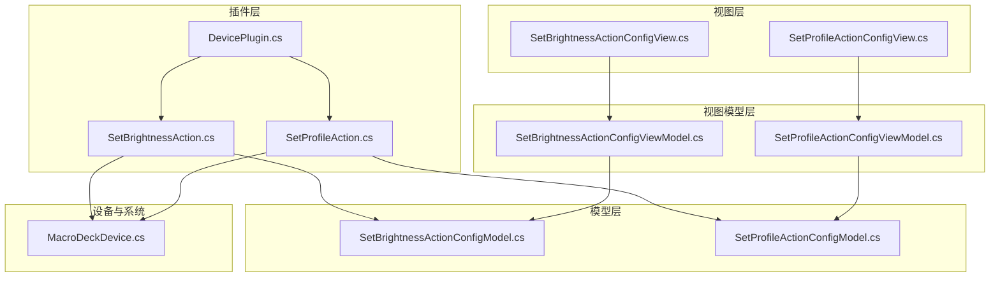
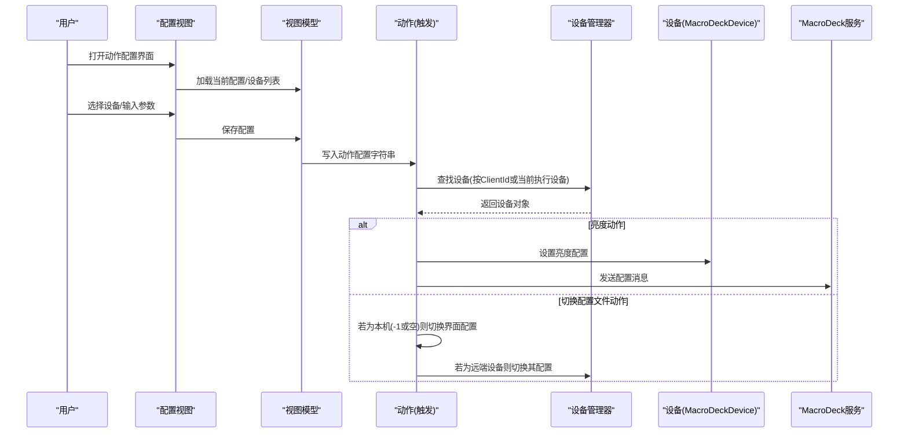
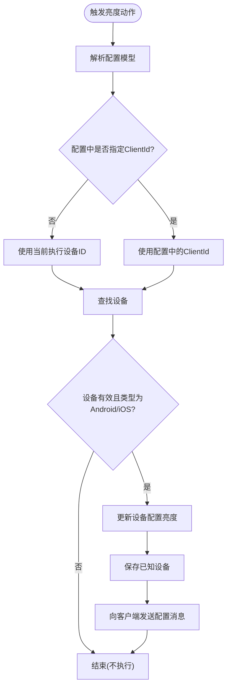
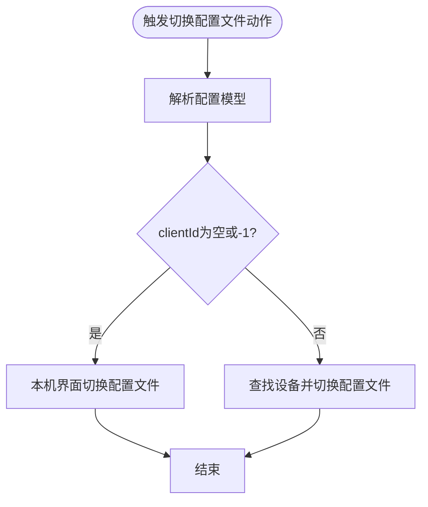
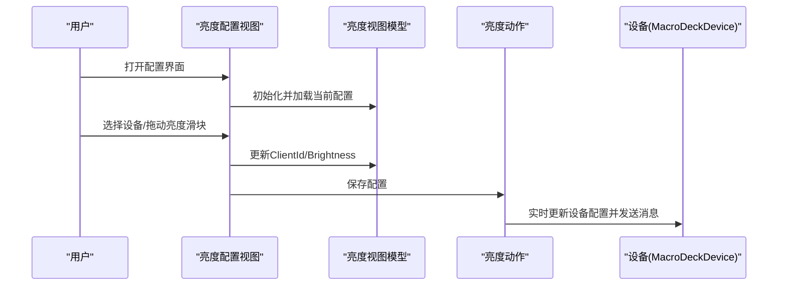
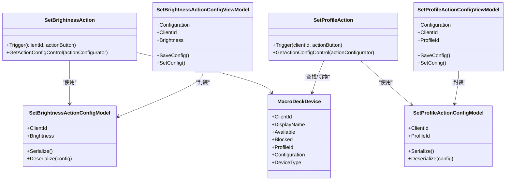

# DevicePlugin（设备控制插件）

<cite>
**本文引用的文件**
- [DevicePlugin.cs](file://src/MacroDeck/InternalPlugins/DevicePlugin/DevicePlugin.cs)
- [SetBrightnessAction.cs](file://src/MacroDeck/InternalPlugins/DevicePlugin/Actions/SetBrightnessAction.cs)
- [SetProfileAction.cs](file://src/MacroDeck/InternalPlugins/DevicePlugin/Actions/SetProfileAction.cs)
- [SetBrightnessActionConfigModel.cs](file://src/MacroDeck/InternalPlugins/DevicePlugin/Models/SetBrightnessActionConfigModel.cs)
- [SetProfileActionConfigModel.cs](file://src/MacroDeck/InternalPlugins/DevicePlugin/Models/SetProfileActionConfigModel.cs)
- [SetBrightnessActionConfigViewModel.cs](file://src/MacroDeck/InternalPlugins/DevicePlugin/ViewModels/SetBrightnessActionConfigViewModel.cs)
- [SetProfileActionConfigViewModel.cs](file://src/MacroDeck/InternalPlugins/DevicePlugin/ViewModels/SetProfileActionConfigViewModel.cs)
- [SetBrightnessActionConfigView.cs](file://src/MacroDeck/InternalPlugins/DevicePlugin/Views/SetBrightnessActionConfigView.cs)
- [SetProfileActionConfigView.cs](file://src/MacroDeck/InternalPlugins/DevicePlugin/Views/SetProfileActionConfigView.cs)
- [MacroDeckDevice.cs](file://src/MacroDeck/Device/MacroDeckDevice.cs)
</cite>

## 目录
1. [简介](#简介)
2. [项目结构](#项目结构)
3. [核心组件](#核心组件)
4. [架构总览](#架构总览)
5. [详细组件分析](#详细组件分析)
6. [依赖关系分析](#依赖关系分析)
7. [性能考量](#性能考量)
8. [故障排查指南](#故障排查指南)
9. [结论](#结论)
10. [附录](#附录)

## 简介
DevicePlugin 是一个内置的设备控制插件，用于在 Macro Deck 中对连接的移动设备执行两类常用操作：
- 设置设备亮度（SetBrightnessAction）
- 切换设备配置文件（SetProfileAction）

该插件通过统一的插件框架注册自身，并在启用时向系统注册上述两个动作。每个动作均配有对应的配置模型、视图模型与配置界面，支持“当前执行设备”或“固定目标设备”的选择，并在保存配置时生成可读的摘要信息。

## 项目结构
DevicePlugin 的代码组织遵循“动作（Action）+ 模型（Model）+ 视图模型（ViewModel）+ 视图（View）”的分层设计，位于 InternalPlugins/DevicePlugin 目录下，同时与设备管理器、配置管理器、语言资源等模块协作。

图表来源
- [DevicePlugin.cs:1-23](file://src/MacroDeck/InternalPlugins/DevicePlugin/DevicePlugin.cs#L1-L23)
- [SetBrightnessAction.cs:1-57](file://src/MacroDeck/InternalPlugins/DevicePlugin/Actions/SetBrightnessAction.cs#L1-L57)
- [SetProfileAction.cs:1-63](file://src/MacroDeck/InternalPlugins/DevicePlugin/Actions/SetProfileAction.cs#L1-L63)
- [SetBrightnessActionConfigModel.cs:1-22](file://src/MacroDeck/InternalPlugins/DevicePlugin/Models/SetBrightnessActionConfigModel.cs#L1-L22)
- [SetProfileActionConfigModel.cs:1-22](file://src/MacroDeck/InternalPlugins/DevicePlugin/Models/SetProfileActionConfigModel.cs#L1-L22)
- [SetBrightnessActionConfigViewModel.cs:1-62](file://src/MacroDeck/InternalPlugins/DevicePlugin/ViewModels/SetBrightnessActionConfigViewModel.cs#L1-L62)
- [SetProfileActionConfigViewModel.cs:1-63](file://src/MacroDeck/InternalPlugins/DevicePlugin/ViewModels/SetProfileActionConfigViewModel.cs#L1-L63)
- [SetBrightnessActionConfigView.cs:1-114](file://src/MacroDeck/InternalPlugins/DevicePlugin/Views/SetBrightnessActionConfigView.cs#L1-L114)
- [SetProfileActionConfigView.cs:1-112](file://src/MacroDeck/InternalPlugins/DevicePlugin/Views/SetProfileActionConfigView.cs#L1-L112)
- [MacroDeckDevice.cs:1-34](file://src/MacroDeck/Device/MacroDeckDevice.cs#L1-L34)

章节来源
- [DevicePlugin.cs:1-23](file://src/MacroDeck/InternalPlugins/DevicePlugin/DevicePlugin.cs#L1-L23)

## 核心组件
- 插件入口：DevicePlugin 在启用时注册两个动作：SetBrightnessAction 和 SetProfileAction。
- 动作触发器：每个动作在触发时根据配置决定是作用于“当前执行设备”还是“指定客户端 ID”的设备。
- 配置模型：分别定义了亮度值与目标设备 ID、配置文件 ID 的序列化结构。
- 视图模型：封装配置读取、摘要生成与保存逻辑。
- 视图控件：提供图形化配置界面，支持设备列表、滑块、单选按钮等交互元素。

章节来源
- [DevicePlugin.cs:14-21](file://src/MacroDeck/InternalPlugins/DevicePlugin/DevicePlugin.cs#L14-L21)
- [SetBrightnessAction.cs:20-50](file://src/MacroDeck/InternalPlugins/DevicePlugin/Actions/SetBrightnessAction.cs#L20-L50)
- [SetProfileAction.cs:20-56](file://src/MacroDeck/InternalPlugins/DevicePlugin/Actions/SetProfileAction.cs#L20-L56)

## 架构总览
DevicePlugin 的运行时交互围绕“动作触发 → 解析配置 → 查找设备 → 更新配置/发送消息”展开。亮度动作直接修改设备配置并推送；配置文件动作在本地更新软件界面或通过设备管理器切换远端设备配置。

图表来源
- [SetBrightnessAction.cs:20-50](file://src/MacroDeck/InternalPlugins/DevicePlugin/Actions/SetBrightnessAction.cs#L20-L50)
- [SetProfileAction.cs:20-56](file://src/MacroDeck/InternalPlugins/DevicePlugin/Actions/SetProfileAction.cs#L20-L56)
- [SetBrightnessActionConfigView.cs:60-82](file://src/MacroDeck/InternalPlugins/DevicePlugin/Views/SetBrightnessActionConfigView.cs#L60-L82)
- [SetProfileActionConfigView.cs:76-105](file://src/MacroDeck/InternalPlugins/DevicePlugin/Views/SetProfileActionConfigView.cs#L76-L105)
- [MacroDeckDevice.cs:12-24](file://src/MacroDeck/Device/MacroDeckDevice.cs#L12-L24)

## 详细组件分析

### 设备亮度设置动作（SetBrightnessAction）
- 触发逻辑
  - 反序列化配置模型，优先使用配置中的 ClientId，否则使用当前执行上下文的 clientId。
  - 校验设备存在性、可用性及设备类型（仅 Android/iOS）。
  - 更新设备配置亮度后持久化已知设备列表，并向对应客户端发送配置消息。
- 关键行为
  - 支持“当前设备”和“固定设备”两种模式。
  - 保存配置时生成摘要字符串，便于在按钮上显示。

图表来源
- [SetBrightnessAction.cs:20-50](file://src/MacroDeck/InternalPlugins/DevicePlugin/Actions/SetBrightnessAction.cs#L20-L50)

章节来源
- [SetBrightnessAction.cs:12-57](file://src/MacroDeck/InternalPlugins/DevicePlugin/Actions/SetBrightnessAction.cs#L12-L57)

### 切换配置文件动作（SetProfileAction）
- 触发逻辑
  - 反序列化配置模型，获取目标配置文件 ID。
  - 若 clientId 为空或为 -1，则在本机界面切换到目标配置文件。
  - 否则通过设备管理器为目标设备设置配置文件。
- 关键行为
  - 支持“当前设备”和“固定设备”两种模式。
  - 保存配置时生成摘要字符串，包含设备名与目标配置文件名。

图表来源
- [SetProfileAction.cs:20-56](file://src/MacroDeck/InternalPlugins/DevicePlugin/Actions/SetProfileAction.cs#L20-L56)

章节来源
- [SetProfileAction.cs:12-63](file://src/MacroDeck/InternalPlugins/DevicePlugin/Actions/SetProfileAction.cs#L12-L63)

### 配置模型与字段说明
- SetBrightnessActionConfigModel
  - 字段
    - ClientId: 目标设备的客户端标识符（可空，表示“当前设备”）
    - Brightness: 亮度值（浮点数，默认 0.3）
  - 序列化
    - 使用标准 JSON 序列化与反序列化
- SetProfileActionConfigModel
  - 字段
    - ClientId: 目标设备的客户端标识符（可空，表示“当前设备”）
    - ProfileId: 目标配置文件的唯一标识符
  - 序列化
    - 使用标准 JSON 序列化与反序列化

章节来源
- [SetBrightnessActionConfigModel.cs:6-21](file://src/MacroDeck/InternalPlugins/DevicePlugin/Models/SetBrightnessActionConfigModel.cs#L6-L21)
- [SetProfileActionConfigModel.cs:6-21](file://src/MacroDeck/InternalPlugins/DevicePlugin/Models/SetProfileActionConfigModel.cs#L6-L21)

### 视图模型与摘要生成
- SetBrightnessActionConfigViewModel
  - 负责从动作配置反序列化到模型，保存时将模型序列化回动作配置。
  - 生成摘要字符串，格式为“设备名 -> 亮度百分比”。
- SetProfileActionConfigViewModel
  - 负责从动作配置反序列化到模型，保存时将模型序列化回动作配置。
  - 生成摘要字符串，格式为“设备名 -> 配置文件名”。

章节来源
- [SetBrightnessActionConfigViewModel.cs:11-62](file://src/MacroDeck/InternalPlugins/DevicePlugin/ViewModels/SetBrightnessActionConfigViewModel.cs#L11-L62)
- [SetProfileActionConfigViewModel.cs:12-63](file://src/MacroDeck/InternalPlugins/DevicePlugin/ViewModels/SetProfileActionConfigViewModel.cs#L12-L63)

### 配置界面设计与用户操作流程
- 通用交互
  - 单选按钮：选择“当前设备”或“固定设备”
  - 下拉框：设备列表（仅显示 Android/iOS 或全部设备，取决于动作）
  - 滑块：亮度调节（0.0~1.0，步进映射到 0~10）
  - 保存：校验必填项，调用视图模型保存配置
- 亮度动作界面
  - 加载已知设备（Android/iOS），默认加载当前配置亮度
  - 支持预览设备当前亮度并在滑动时实时更新设备配置并发送消息
- 配置文件动作界面
  - 加载已知设备与所有配置文件
  - 支持选择设备与目标配置文件，保存时校验两者均非空

图表来源
- [SetBrightnessActionConfigView.cs:20-58](file://src/MacroDeck/InternalPlugins/DevicePlugin/Views/SetBrightnessActionConfigView.cs#L20-L58)
- [SetBrightnessActionConfigView.cs:60-82](file://src/MacroDeck/InternalPlugins/DevicePlugin/Views/SetBrightnessActionConfigView.cs#L60-L82)
- [SetBrightnessActionConfigView.cs:96-112](file://src/MacroDeck/InternalPlugins/DevicePlugin/Views/SetBrightnessActionConfigView.cs#L96-L112)

章节来源
- [SetBrightnessActionConfigView.cs:9-114](file://src/MacroDeck/InternalPlugins/DevicePlugin/Views/SetBrightnessActionConfigView.cs#L9-L114)
- [SetProfileActionConfigView.cs:10-112](file://src/MacroDeck/InternalPlugins/DevicePlugin/Views/SetProfileActionConfigView.cs#L10-L112)

### 使用示例
- 设置设备亮度
  - 在动作配置界面选择“固定设备”，从设备列表中选择目标设备，调整亮度滑块，点击保存。
  - 动作触发时会将亮度写入设备配置并立即向设备发送配置消息。
- 切换设备配置文件
  - 在动作配置界面选择“当前设备”或“固定设备”，从配置文件列表中选择目标配置文件，点击保存。
  - 若为本机（clientId 为空或 -1），将在界面中切换配置；若为远端设备，将通过设备管理器切换其配置。

章节来源
- [SetBrightnessAction.cs:20-50](file://src/MacroDeck/InternalPlugins/DevicePlugin/Actions/SetBrightnessAction.cs#L20-L50)
- [SetProfileAction.cs:20-56](file://src/MacroDeck/InternalPlugins/DevicePlugin/Actions/SetProfileAction.cs#L20-L56)
- [SetBrightnessActionConfigView.cs:60-82](file://src/MacroDeck/InternalPlugins/DevicePlugin/Views/SetBrightnessActionConfigView.cs#L60-L82)
- [SetProfileActionConfigView.cs:76-105](file://src/MacroDeck/InternalPlugins/DevicePlugin/Views/SetProfileActionConfigView.cs#L76-L105)

## 依赖关系分析
- 动作对模型与视图的依赖
  - SetBrightnessAction 依赖 SetBrightnessActionConfigModel 与 SetBrightnessActionConfigView
  - SetProfileAction 依赖 SetProfileActionConfigModel 与 SetProfileActionConfigView
- 视图模型对动作与系统的依赖
  - 通过动作配置字符串进行序列化/反序列化
  - 生成摘要字符串供按钮显示
- 设备与系统集成
  - 通过设备管理器查找设备、保存已知设备列表
  - 通过服务端通道向设备发送配置消息
  - 宏 DeckDevice 提供设备可用性判断与配置对象

图表来源
- [SetBrightnessAction.cs:12-57](file://src/MacroDeck/InternalPlugins/DevicePlugin/Actions/SetBrightnessAction.cs#L12-L57)
- [SetProfileAction.cs:12-63](file://src/MacroDeck/InternalPlugins/DevicePlugin/Actions/SetProfileAction.cs#L12-L63)
- [SetBrightnessActionConfigModel.cs:6-21](file://src/MacroDeck/InternalPlugins/DevicePlugin/Models/SetBrightnessActionConfigModel.cs#L6-L21)
- [SetProfileActionConfigModel.cs:6-21](file://src/MacroDeck/InternalPlugins/DevicePlugin/Models/SetProfileActionConfigModel.cs#L6-L21)
- [SetBrightnessActionConfigViewModel.cs:11-62](file://src/MacroDeck/InternalPlugins/DevicePlugin/ViewModels/SetBrightnessActionConfigViewModel.cs#L11-L62)
- [SetProfileActionConfigViewModel.cs:12-63](file://src/MacroDeck/InternalPlugins/DevicePlugin/ViewModels/SetProfileActionConfigViewModel.cs#L12-L63)
- [MacroDeckDevice.cs:6-34](file://src/MacroDeck/Device/MacroDeckDevice.cs#L6-L34)

章节来源
- [DevicePlugin.cs:14-21](file://src/MacroDeck/InternalPlugins/DevicePlugin/DevicePlugin.cs#L14-L21)
- [MacroDeckDevice.cs:12-24](file://src/MacroDeck/Device/MacroDeckDevice.cs#L12-L24)

## 性能考量
- 实时亮度更新
  - 在配置界面滑动亮度时，会即时更新设备配置并通过网络通道发送消息，建议在设备在线且网络稳定时使用，避免频繁抖动导致不必要的通信开销。
- 设备可用性检查
  - 动作触发前会对设备可用性进行判断，避免对离线设备执行无效操作。
- 配置持久化
  - 亮度动作在更新后会保存已知设备列表，确保重启后配置仍有效。

## 故障排查指南
- 动作未生效
  - 检查目标设备是否在线且类型为 Android/iOS（亮度动作限制）。
  - 确认 clientId 是否正确，或是否选择了“当前设备”。
- 配置保存失败
  - 视图在保存时会进行必填项校验，若返回失败，请确认已选择设备与必要参数。
  - 查看日志输出，定位异常发生位置。
- 远端设备无响应
  - 确认设备与服务器之间的连接正常，WebSocket 通道可用。
  - 尝试重新连接设备或刷新设备列表。

章节来源
- [SetBrightnessAction.cs:38-43](file://src/MacroDeck/InternalPlugins/DevicePlugin/Actions/SetBrightnessAction.cs#L38-L43)
- [SetProfileAction.cs:48-51](file://src/MacroDeck/InternalPlugins/DevicePlugin/Actions/SetProfileAction.cs#L48-L51)
- [SetBrightnessActionConfigView.cs:76-82](file://src/MacroDeck/InternalPlugins/DevicePlugin/Views/SetBrightnessActionConfigView.cs#L76-L82)
- [SetProfileActionConfigView.cs:98-105](file://src/MacroDeck/InternalPlugins/DevicePlugin/Views/SetProfileActionConfigView.cs#L98-L105)

## 结论
DevicePlugin 提供了简洁而实用的设备控制能力，通过统一的动作框架与清晰的配置模型/视图模型/视图分层，实现了亮度调节与配置文件切换两大核心功能。其设计兼顾易用性与可扩展性，适合进一步基于现有模式添加更多设备控制动作。

## 附录

### 开发者扩展指南与最佳实践
- 新增动作步骤
  - 定义配置模型：实现序列化接口，声明必要字段
  - 编写动作类：重写触发逻辑，处理 clientId 与设备查找
  - 创建视图模型：封装配置读写与摘要生成
  - 开发配置视图：提供用户交互控件与保存校验
  - 在插件入口注册新动作
- 最佳实践
  - 始终进行设备可用性检查，避免对离线设备执行操作
  - 在视图模型中集中处理摘要生成，保持 UI 与业务逻辑分离
  - 对关键路径增加日志记录，便于问题定位
  - 保持配置模型字段最小化，避免冗余数据