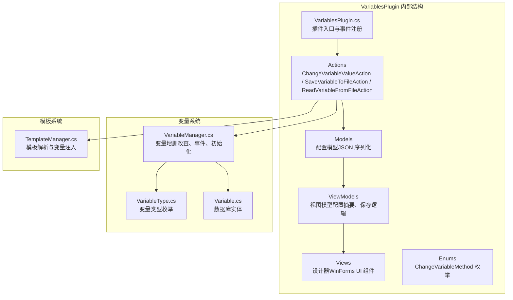
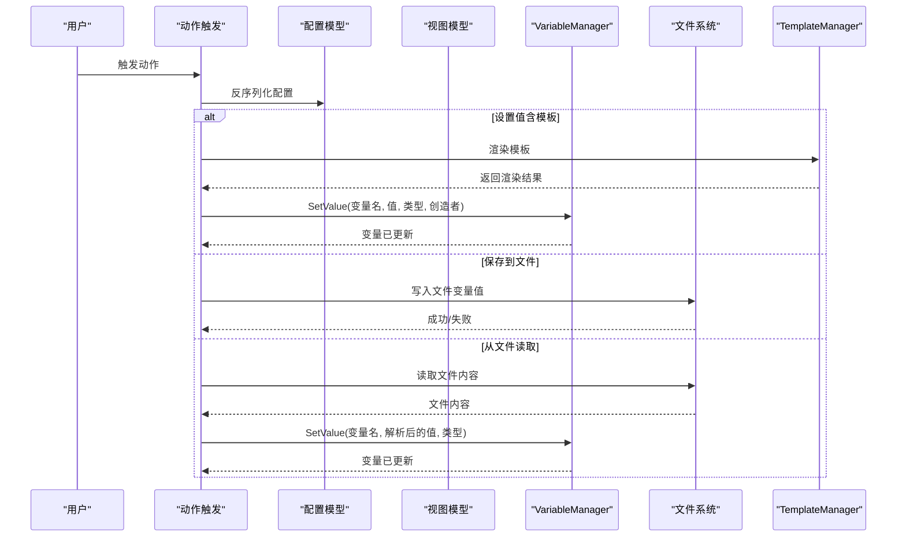
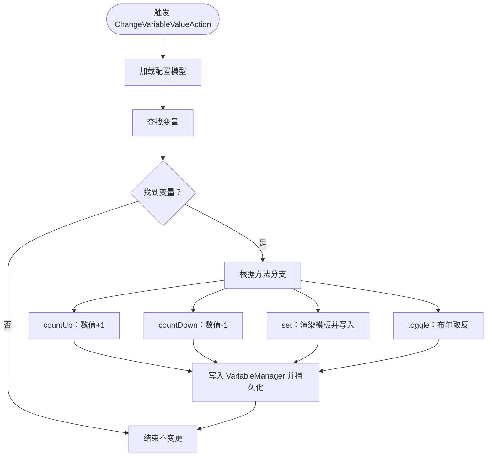
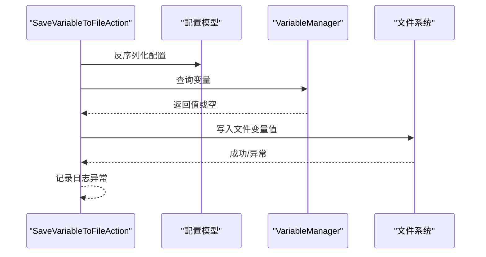
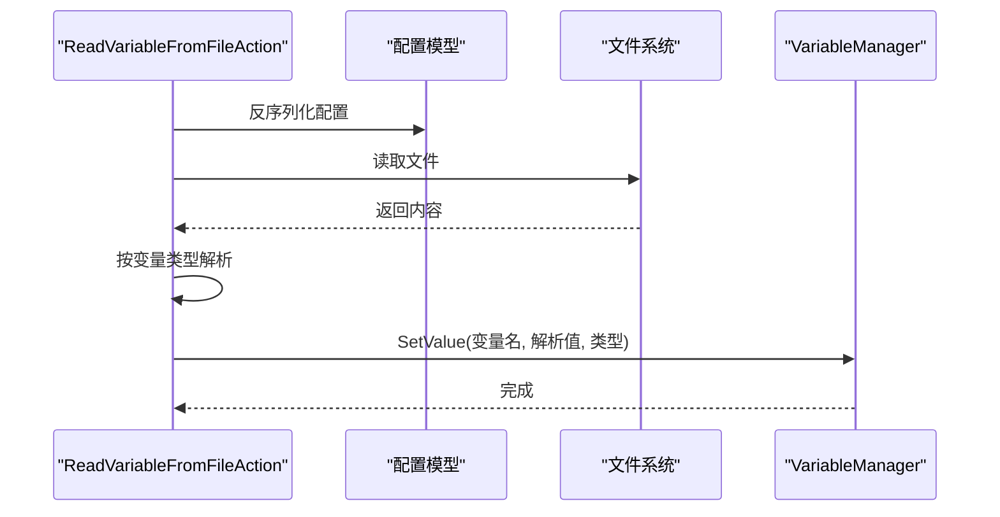
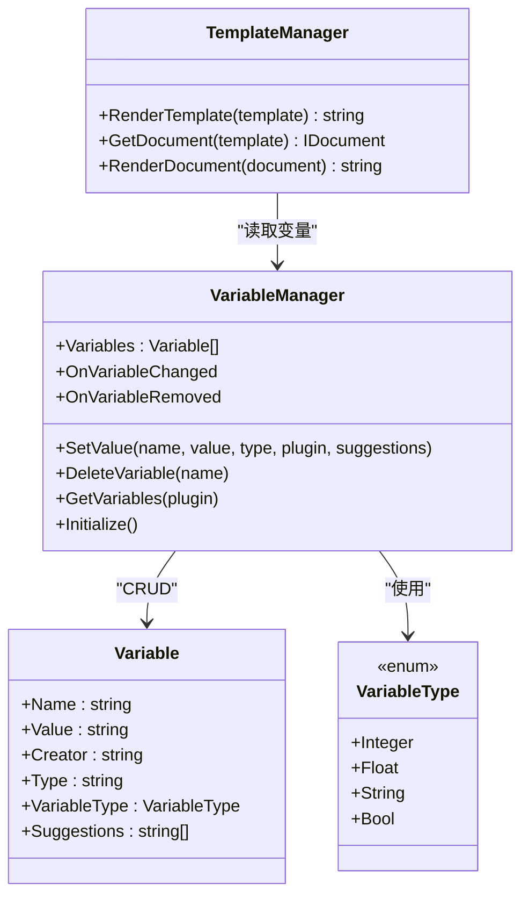
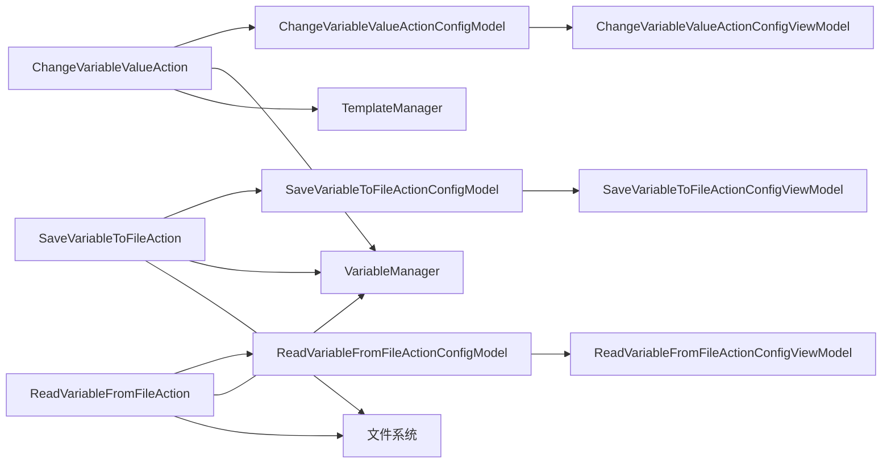

# VariablesPlugin（变量管理插件）

<cite>
**本文引用的文件**
- [VariablesPlugin.cs](file://src/MacroDeck/InternalPlugins/Variables/VariablesPlugin.cs)
- [ChangeVariableMethod.cs](file://src/MacroDeck/InternalPlugins/Variables/Enums/ChangeVariableMethod.cs)
- [ChangeVariableValueActionConfigModel.cs](file://src/MacroDeck/InternalPlugins/Variables/Models/ChangeVariableValueActionConfigModel.cs)
- [ReadVariableFromFileActionConfigModel.cs](file://src/MacroDeck/InternalPlugins/Variables/Models/ReadVariableFromFileActionConfigModel.cs)
- [SaveVariableToFileActionConfigModel.cs](file://src/MacroDeck/InternalPlugins/Variables/Models/SaveVariableToFileActionConfigModel.cs)
- [ChangeVariableValueActionConfigViewModel.cs](file://src/MacroDeck/InternalPlugins/Variables/ViewModels/ChangeVariableValueActionConfigViewModel.cs)
- [ReadVariableFromFileActionConfigViewModel.cs](file://src/MacroDeck/InternalPlugins/Variables/ViewModels/ReadVariableFromFileActionConfigViewModel.cs)
- [SaveVariableToFileActionConfigViewModel.cs](file://src/MacroDeck/InternalPlugins/Variables/ViewModels/SaveVariableToFileActionConfigViewModel.cs)
- [ChangeVariableValueActionConfigView.Designer.cs](file://src/MacroDeck/InternalPlugins/Variables/Views/ChangeVariableValueActionConfigView.Designer.cs)
- [ReadVariableFromFileActionConfigView.Designer.cs](file://src/MacroDeck/InternalPlugins/Variables/Views/ReadVariableFromFileActionConfigView.Designer.cs)
- [SaveVariableToFileActionConfigView.Designer.cs](file://src/MacroDeck/InternalPlugins/Variables/Views/SaveVariableToFileActionConfigView.Designer.cs)
- [VariableManager.cs](file://src/MacroDeck/Variables/VariableManager.cs)
- [VariableType.cs](file://src/MacroDeck/Variables/VariableType.cs)
- [Variable.cs](file://src/MacroDeck/Variables/Variable.cs)
- [TemplateManager.cs](file://src/MacroDeck/CottleIntegration/TemplateManager.cs)
</cite>

## 目录
1. [简介](#简介)
2. [项目结构](#项目结构)
3. [核心组件](#核心组件)
4. [架构总览](#架构总览)
5. [详细组件分析](#详细组件分析)
6. [依赖关系分析](#依赖关系分析)
7. [性能考虑](#性能考虑)
8. [故障排查指南](#故障排查指南)
9. [结论](#结论)
10. [附录](#附录)

## 简介
本文件为 VariablesPlugin（变量管理插件）的权威技术文档，面向开发者与高级用户，系统性阐述变量插件的功能、架构与实现细节。插件提供三大核心动作：
- 更改变量值（ChangeVariableValueAction）
- 从文件读取变量（ReadVariableFromFileAction）
- 将变量保存到文件（SaveVariableToFileAction）

同时，文档覆盖以下主题：
- 变量变更方法枚举（ChangeVariableMethod）的选项与用法
- 配置模型与视图模型的字段定义与序列化机制
- 变量文件读写流程与错误处理
- 插件与变量系统（VariableManager）及模板渲染（TemplateManager）的集成方式
- 数据持久化机制（SQLite）
- 扩展开发指南与性能优化建议

## 项目结构
VariablesPlugin 属于内部插件（InternalPlugins），位于 InternalPlugins/Variables 目录下，采用“模型-视图-视图模型-动作-事件”的分层组织方式，并与全局变量系统、模板引擎、语言资源等模块协作。

图表来源
- [VariablesPlugin.cs:1-319](file://src/MacroDeck/InternalPlugins/Variables/VariablesPlugin.cs#L1-L319)
- [ChangeVariableValueActionConfigModel.cs:1-30](file://src/MacroDeck/InternalPlugins/Variables/Models/ChangeVariableValueActionConfigModel.cs#L1-L30)
- [VariableManager.cs:1-249](file://src/MacroDeck/Variables/VariableManager.cs#L1-L249)
- [TemplateManager.cs:1-181](file://src/MacroDeck/CottleIntegration/TemplateManager.cs#L1-L181)

章节来源
- [VariablesPlugin.cs:1-319](file://src/MacroDeck/InternalPlugins/Variables/VariablesPlugin.cs#L1-L319)

## 核心组件
- 插件入口与生命周期
  - 插件启用时注册三个动作、注册变量变更事件、启动定时器更新时间/日期变量。
  - 应用退出时清理事件订阅与定时器。
- 动作类
  - ChangeVariableValueAction：根据方法枚举对目标变量执行自增、自减、设置、切换。
  - SaveVariableToFileAction：将指定变量值写入文件路径。
  - ReadVariableFromFileAction：从文件读取并按变量类型解析后写回变量。
- 配置模型与视图模型
  - 每个动作对应一个配置模型（JSON 序列化）与一个视图模型（封装配置、生成摘要、保存配置）。
- 变量系统
  - VariableManager 提供变量的创建、更新、删除、查询与事件通知；使用 SQLite 存储。
  - VariableType 定义整型、浮点、字符串、布尔四种类型。
  - Variable 实体映射到数据库表。
- 模板系统
  - TemplateManager 支持模板渲染，将变量注入上下文，供“设置”方法中的模板表达式使用。

章节来源
- [VariablesPlugin.cs:33-87](file://src/MacroDeck/InternalPlugins/Variables/VariablesPlugin.cs#L33-L87)
- [VariableManager.cs:10-249](file://src/MacroDeck/Variables/VariableManager.cs#L10-L249)
- [VariableType.cs:1-10](file://src/MacroDeck/Variables/VariableType.cs#L1-L10)
- [Variable.cs:1-16](file://src/MacroDeck/Variables/Variable.cs#L1-L16)
- [TemplateManager.cs:69-88](file://src/MacroDeck/CottleIntegration/TemplateManager.cs#L69-L88)

## 架构总览
VariablesPlugin 通过插件基类暴露动作集合，动作在触发时读取配置模型，调用 VariableManager 更新变量或进行文件 IO，同时借助 TemplateManager 渲染模板表达式。变量变更会触发事件，驱动 UI 或其他监听者刷新。

图表来源
- [VariablesPlugin.cs:149-318](file://src/MacroDeck/InternalPlugins/Variables/VariablesPlugin.cs#L149-L318)
- [VariableManager.cs:54-138](file://src/MacroDeck/Variables/VariableManager.cs#L54-L138)
- [TemplateManager.cs:69-88](file://src/MacroDeck/CottleIntegration/TemplateManager.cs#L69-L88)

## 详细组件分析

### 变量变更方法枚举（ChangeVariableMethod）
- 枚举项
  - countUp：数值变量自增 1
  - countDown：数值变量自减 1
  - set：设置为给定值（支持模板表达式）
  - toggle：布尔变量切换
- 使用场景
  - 计数器、音量控制、开关切换、动态赋值等

章节来源
- [ChangeVariableMethod.cs:1-10](file://src/MacroDeck/InternalPlugins/Variables/Enums/ChangeVariableMethod.cs#L1-L10)

### 更改变量值动作（ChangeVariableValueAction）
- 触发流程
  - 反序列化配置模型，获取变量名、方法、值（模板）。
  - 根据方法分支执行：countUp/countDown 对当前值做加减；set 调用模板渲染后写入；toggle 对布尔值取反。
  - 写入时依据变量原类型进行类型转换与持久化。
- 配置模型字段
  - method：变更方法（枚举）
  - variable：变量名
  - value：模板字符串（仅 set 方法使用）
- 视图模型职责
  - 保存配置前校验必填项，生成配置摘要（用于 UI 显示），序列化并写回动作配置。
- UI 行为
  - 提供模板编辑器按钮，便于编写模板表达式。

图表来源
- [VariablesPlugin.cs:149-206](file://src/MacroDeck/InternalPlugins/Variables/VariablesPlugin.cs#L149-L206)
- [ChangeVariableValueActionConfigModel.cs:8-29](file://src/MacroDeck/InternalPlugins/Variables/Models/ChangeVariableValueActionConfigModel.cs#L8-L29)
- [ChangeVariableValueActionConfigViewModel.cs:11-91](file://src/MacroDeck/InternalPlugins/Variables/ViewModels/ChangeVariableValueActionConfigViewModel.cs#L11-L91)

章节来源
- [VariablesPlugin.cs:149-206](file://src/MacroDeck/InternalPlugins/Variables/VariablesPlugin.cs#L149-L206)
- [ChangeVariableValueActionConfigModel.cs:8-29](file://src/MacroDeck/InternalPlugins/Variables/Models/ChangeVariableValueActionConfigModel.cs#L8-L29)
- [ChangeVariableValueActionConfigViewModel.cs:11-91](file://src/MacroDeck/InternalPlugins/Variables/ViewModels/ChangeVariableValueActionConfigViewModel.cs#L11-L91)
- [ChangeVariableValueActionConfigView.Designer.cs:1-210](file://src/MacroDeck/InternalPlugins/Variables/Views/ChangeVariableValueActionConfigView.Designer.cs#L1-L210)

### 保存变量到文件动作（SaveVariableToFileAction）
- 触发流程
  - 反序列化配置模型，获取文件路径与变量名。
  - 读取变量值（若不存在则使用提示文本），写入文件。
  - 失败时记录日志。
- 配置模型字段
  - filePath：文件路径
  - variable：变量名
- 视图模型职责
  - 校验路径与变量非空，生成配置摘要并保存。

图表来源
- [VariablesPlugin.cs:208-252](file://src/MacroDeck/InternalPlugins/Variables/VariablesPlugin.cs#L208-L252)
- [SaveVariableToFileActionConfigModel.cs:6-22](file://src/MacroDeck/InternalPlugins/Variables/Models/SaveVariableToFileActionConfigModel.cs#L6-L22)
- [SaveVariableToFileActionConfigViewModel.cs:9-63](file://src/MacroDeck/InternalPlugins/Variables/ViewModels/SaveVariableToFileActionConfigViewModel.cs#L9-L63)

章节来源
- [VariablesPlugin.cs:208-252](file://src/MacroDeck/InternalPlugins/Variables/VariablesPlugin.cs#L208-L252)
- [SaveVariableToFileActionConfigModel.cs:6-22](file://src/MacroDeck/InternalPlugins/Variables/Models/SaveVariableToFileActionConfigModel.cs#L6-L22)
- [SaveVariableToFileActionConfigViewModel.cs:9-63](file://src/MacroDeck/InternalPlugins/Variables/ViewModels/SaveVariableToFileActionConfigViewModel.cs#L9-L63)
- [SaveVariableToFileActionConfigView.Designer.cs:1-163](file://src/MacroDeck/InternalPlugins/Variables/Views/SaveVariableToFileActionConfigView.Designer.cs#L1-L163)

### 从文件读取变量动作（ReadVariableFromFileAction）
- 触发流程
  - 反序列化配置模型，获取文件路径与变量名。
  - 读取文件内容，按变量类型进行解析（布尔、浮点、整数、字符串），再写入变量。
  - 失败时记录日志。
- 配置模型字段
  - filePath：文件路径
  - variable：变量名
- 视图模型职责
  - 校验路径与变量非空，生成配置摘要并保存。

图表来源
- [VariablesPlugin.cs:254-318](file://src/MacroDeck/InternalPlugins/Variables/VariablesPlugin.cs#L254-L318)
- [ReadVariableFromFileActionConfigModel.cs:6-22](file://src/MacroDeck/InternalPlugins/Variables/Models/ReadVariableFromFileActionConfigModel.cs#L6-L22)
- [ReadVariableFromFileActionConfigViewModel.cs:9-63](file://src/MacroDeck/InternalPlugins/Variables/ViewModels/ReadVariableFromFileActionConfigViewModel.cs#L9-L63)

章节来源
- [VariablesPlugin.cs:254-318](file://src/MacroDeck/InternalPlugins/Variables/VariablesPlugin.cs#L254-L318)
- [ReadVariableFromFileActionConfigModel.cs:6-22](file://src/MacroDeck/InternalPlugins/Variables/Models/ReadVariableFromFileActionConfigModel.cs#L6-L22)
- [ReadVariableFromFileActionConfigViewModel.cs:9-63](file://src/MacroDeck/InternalPlugins/Variables/ViewModels/ReadVariableFromFileActionConfigViewModel.cs#L9-L63)
- [ReadVariableFromFileActionConfigView.Designer.cs:1-187](file://src/MacroDeck/InternalPlugins/Variables/Views/ReadVariableFromFileActionConfigView.Designer.cs#L1-L187)

### 变量系统与数据持久化
- 变量管理器（VariableManager）
  - 初始化时连接 SQLite 数据库并创建变量表。
  - 提供查询、设置、删除变量的方法，并在值变化时触发 OnVariableChanged 事件。
  - 支持按插件过滤变量列表。
- 变量类型（VariableType）
  - 整型、浮点、字符串、布尔。
- 变量实体（Variable）
  - 主键为名称，包含值、创造者、类型与建议值数组。
- 模板系统（TemplateManager）
  - 将变量注入 Cottle 上下文，支持模板渲染；渲染失败返回错误信息。

图表来源
- [VariableManager.cs:10-249](file://src/MacroDeck/Variables/VariableManager.cs#L10-L249)
- [Variable.cs:5-16](file://src/MacroDeck/Variables/Variable.cs#L5-L16)
- [VariableType.cs:3-9](file://src/MacroDeck/Variables/VariableType.cs#L3-L9)
- [TemplateManager.cs:8-181](file://src/MacroDeck/CottleIntegration/TemplateManager.cs#L8-L181)

章节来源
- [VariableManager.cs:10-249](file://src/MacroDeck/Variables/VariableManager.cs#L10-L249)
- [Variable.cs:5-16](file://src/MacroDeck/Variables/Variable.cs#L5-L16)
- [VariableType.cs:3-9](file://src/MacroDeck/Variables/VariableType.cs#L3-L9)
- [TemplateManager.cs:8-181](file://src/MacroDeck/CottleIntegration/TemplateManager.cs#L8-L181)

### 插件与事件、UI 的集成
- 插件事件
  - VariablesPlugin 注册“变量已更改”事件，转发给所有监听该事件的动作按钮。
- UI 集成
  - 每个动作提供对应的配置视图（Designer.cs），包含控件绑定与交互逻辑。
  - 视图模型负责将用户输入映射到配置模型并保存。

章节来源
- [VariablesPlugin.cs:29-147](file://src/MacroDeck/InternalPlugins/Variables/VariablesPlugin.cs#L29-L147)
- [ChangeVariableValueActionConfigView.Designer.cs:1-210](file://src/MacroDeck/InternalPlugins/Variables/Views/ChangeVariableValueActionConfigView.Designer.cs#L1-L210)
- [ReadVariableFromFileActionConfigView.Designer.cs:1-187](file://src/MacroDeck/InternalPlugins/Variables/Views/ReadVariableFromFileActionConfigView.Designer.cs#L1-L187)
- [SaveVariableToFileActionConfigView.Designer.cs:1-163](file://src/MacroDeck/InternalPlugins/Variables/Views/SaveVariableToFileActionConfigView.Designer.cs#L1-L163)

## 依赖关系分析
- 组件耦合
  - 动作类依赖配置模型与 VariableManager；模板渲染依赖 TemplateManager。
  - 视图模型依赖配置模型与语言资源，负责 UI 与配置之间的桥接。
- 外部依赖
  - SQLite：变量持久化存储。
  - Cottle：模板解析与变量注入。
  - Serilog：日志记录。
- 循环依赖
  - 未见循环依赖迹象；动作与模型解耦良好。

图表来源
- [VariablesPlugin.cs:149-318](file://src/MacroDeck/InternalPlugins/Variables/VariablesPlugin.cs#L149-L318)
- [ChangeVariableValueActionConfigModel.cs:8-29](file://src/MacroDeck/InternalPlugins/Variables/Models/ChangeVariableValueActionConfigModel.cs#L8-L29)
- [SaveVariableToFileActionConfigModel.cs:6-22](file://src/MacroDeck/InternalPlugins/Variables/Models/SaveVariableToFileActionConfigModel.cs#L6-L22)
- [ReadVariableFromFileActionConfigModel.cs:6-22](file://src/MacroDeck/InternalPlugins/Variables/Models/ReadVariableFromFileActionConfigModel.cs#L6-L22)
- [VariableManager.cs:54-138](file://src/MacroDeck/Variables/VariableManager.cs#L54-L138)
- [TemplateManager.cs:69-88](file://src/MacroDeck/CottleIntegration/TemplateManager.cs#L69-L88)

章节来源
- [VariablesPlugin.cs:149-318](file://src/MacroDeck/InternalPlugins/Variables/VariablesPlugin.cs#L149-L318)

## 性能考虑
- IO 操作
  - 文件读写使用重试机制，避免瞬时失败导致任务中断；建议在高频写入场景中合并写入或引入队列。
- 模板渲染
  - 模板渲染在主线程外执行（动作触发时），但模板复杂度高时仍可能阻塞；建议简化模板或缓存常用片段。
- 变量更新
  - 每次变更均触发 OnVariableChanged 事件，大量动作联动时可能产生事件风暴；可通过节流或批量更新降低开销。
- 定时器
  - 插件内置定时器每秒更新 time/date/day_of_week，注意多实例或高频率刷新场景下的资源占用。

章节来源
- [VariablesPlugin.cs:68-82](file://src/MacroDeck/InternalPlugins/Variables/VariablesPlugin.cs#L68-L82)
- [VariablesPlugin.cs:208-252](file://src/MacroDeck/InternalPlugins/Variables/VariablesPlugin.cs#L208-L252)
- [VariablesPlugin.cs:254-318](file://src/MacroDeck/InternalPlugins/Variables/VariablesPlugin.cs#L254-L318)

## 故障排查指南
- 动作无法保存配置
  - 检查视图模型 SaveConfig 返回值与日志输出；确保变量名与路径非空。
- 设置值失败
  - 检查变量类型与传入值是否匹配；确认模板渲染结果可被目标类型解析。
- 文件读写异常
  - 确认文件路径存在且具备读写权限；查看日志中的异常堆栈。
- 变量未出现在 UI 中
  - 确认变量由用户创建（插件可见范围限制）；检查变量名大小写与特殊字符替换规则。

章节来源
- [ChangeVariableValueActionConfigViewModel.cs:37-62](file://src/MacroDeck/InternalPlugins/Variables/ViewModels/ChangeVariableValueActionConfigViewModel.cs#L37-L62)
- [SaveVariableToFileActionConfigViewModel.cs:37-55](file://src/MacroDeck/InternalPlugins/Variables/ViewModels/SaveVariableToFileActionConfigViewModel.cs#L37-L55)
- [ReadVariableFromFileActionConfigViewModel.cs:37-55](file://src/MacroDeck/InternalPlugins/Variables/ViewModels/ReadVariableFromFileActionConfigViewModel.cs#L37-L55)
- [VariablesPlugin.cs:208-252](file://src/MacroDeck/InternalPlugins/Variables/VariablesPlugin.cs#L208-L252)
- [VariablesPlugin.cs:254-318](file://src/MacroDeck/InternalPlugins/Variables/VariablesPlugin.cs#L254-L318)

## 结论
VariablesPlugin 通过清晰的动作-模型-视图-系统分层设计，提供了灵活的变量变更、文件读写与模板渲染能力。其与 VariableManager 和 TemplateManager 的紧密集成，使得变量成为宏平台的通用数据枢纽。开发者可基于现有结构快速扩展新动作或增强文件 IO 能力。

## 附录

### 配置模型与视图模型字段一览
- 更改变量值（配置模型）
  - 字段：method（枚举）、variable（字符串）、value（字符串）
  - 来源：[ChangeVariableValueActionConfigModel.cs:8-29](file://src/MacroDeck/InternalPlugins/Variables/Models/ChangeVariableValueActionConfigModel.cs#L8-L29)
- 保存变量到文件（配置模型）
  - 字段：filePath（字符串）、variable（字符串）
  - 来源：[SaveVariableToFileActionConfigModel.cs:6-22](file://src/MacroDeck/InternalPlugins/Variables/Models/SaveVariableToFileActionConfigModel.cs#L6-L22)
- 从文件读取变量（配置模型）
  - 字段：filePath（字符串）、variable（字符串）
  - 来源：[ReadVariableFromFileActionConfigModel.cs:6-22](file://src/MacroDeck/InternalPlugins/Variables/Models/ReadVariableFromFileActionConfigModel.cs#L6-L22)

### 使用示例与配置要点
- 更改变量值（set + 模板）
  - 步骤：选择变量 → 选择方法 set → 在值框中编写模板表达式 → 保存
  - 注意：模板渲染后按变量类型进行解析；布尔值需符合解析规范
  - 参考：[VariablesPlugin.cs:192-196](file://src/MacroDeck/InternalPlugins/Variables/VariablesPlugin.cs#L192-L196)
- 保存变量到文件
  - 步骤：选择变量 → 指定文件路径 → 保存
  - 注意：文件路径需可写；失败会记录日志
  - 参考：[VariablesPlugin.cs:226-246](file://src/MacroDeck/InternalPlugins/Variables/VariablesPlugin.cs#L226-L246)
- 从文件读取变量
  - 步骤：选择变量 → 指定文件路径 → 保存 → 触发动作
  - 注意：按变量类型解析文件内容；失败会记录日志
  - 参考：[VariablesPlugin.cs:272-312](file://src/MacroDeck/InternalPlugins/Variables/VariablesPlugin.cs#L272-L312)

### 扩展开发指南
- 新增动作
  - 定义配置模型（继承 ISerializableConfiguration）与视图模型（继承 ISerializableConfigViewModel）
  - 实现 PluginAction 的 Trigger 逻辑，必要时调用 VariableManager.SetValue
  - 在 VariablesPlugin.Enable 中注册新动作
- 新增变量类型
  - 在 VariableType 中添加枚举项，在 VariableManager.SetValue 分支中处理新类型
- 模板集成
  - 在动作中调用 TemplateManager.RenderTemplate 获取渲染结果
- UI 集成
  - 为动作创建 Designer.cs 视图，绑定视图模型属性

章节来源
- [VariablesPlugin.cs:33-52](file://src/MacroDeck/InternalPlugins/Variables/VariablesPlugin.cs#L33-L52)
- [VariableManager.cs:54-138](file://src/MacroDeck/Variables/VariableManager.cs#L54-L138)
- [TemplateManager.cs:69-88](file://src/MacroDeck/CottleIntegration/TemplateManager.cs#L69-L88)