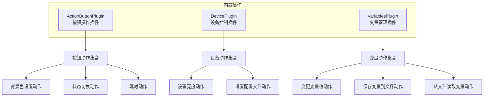
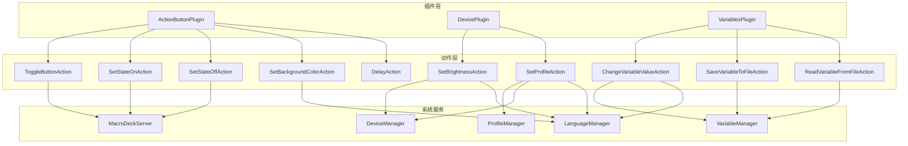
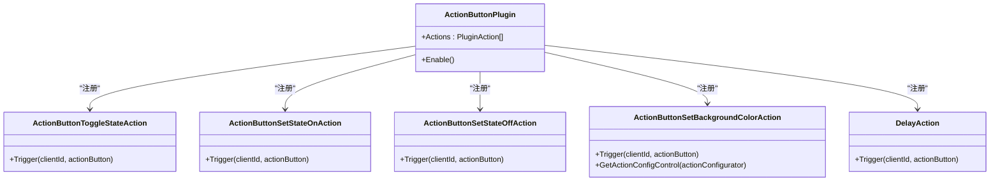
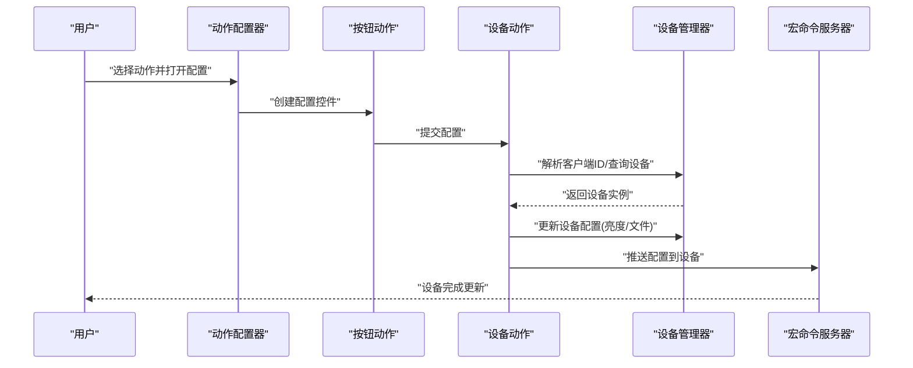
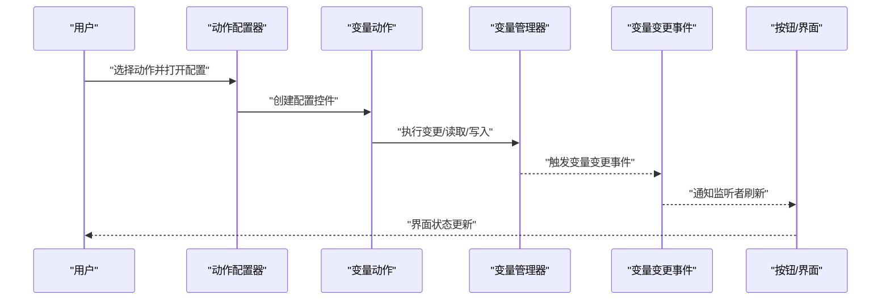
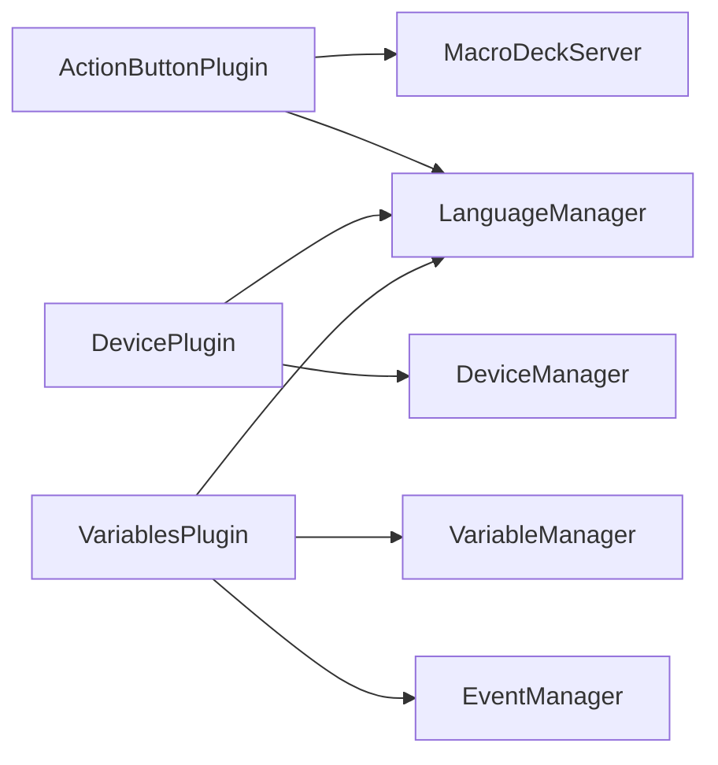

# 内置插件

<cite>
**本文引用的文件**
- [ActionButtonPlugin.cs](file://src/MacroDeck/InternalPlugins/ActionButtonPlugin/ActionButtonPlugin.cs)
- [ActionButtonSetBackgroundColorAction.cs](file://src/MacroDeck/InternalPlugins/ActionButtonPlugin/Actions/ActionButtonSetBackgroundColorAction.cs)
- [ActionButtonSetStateOffAction.cs](file://src/MacroDeck/InternalPlugins/ActionButtonPlugin/Actions/ActionButtonSetStateOffAction.cs)
- [ActionButtonSetStateOnAction.cs](file://src/MacroDeck/InternalPlugins/ActionButtonPlugin/Actions/ActionButtonSetStateOnAction.cs)
- [ActionButtonToggleStateAction.cs](file://src/MacroDeck/InternalPlugins/ActionButtonPlugin/Actions/ActionButtonToggleStateAction.cs)
- [DelayAction.cs](file://src/MacroDeck/InternalPlugins/ActionButtonPlugin/Actions/DelayAction.cs)
- [DevicePlugin.cs](file://src/MacroDeck/InternalPlugins/DevicePlugin/DevicePlugin.cs)
- [SetBrightnessAction.cs](file://src/MacroDeck/InternalPlugins/DevicePlugin/Actions/SetBrightnessAction.cs)
- [SetProfileAction.cs](file://src/MacroDeck/InternalPlugins/DevicePlugin/Actions/SetProfileAction.cs)
- [SetBrightnessActionConfigModel.cs](file://src/MacroDeck/InternalPlugins/DevicePlugin/Models/SetBrightnessActionConfigModel.cs)
- [SetProfileActionConfigModel.cs](file://src/MacroDeck/InternalPlugins/DevicePlugin/Models/SetProfileActionConfigModel.cs)
- [VariablesPlugin.cs](file://src/MacroDeck/InternalPlugins/Variables/VariablesPlugin.cs)
- [ChangeVariableValueAction.cs](file://src/MacroDeck/InternalPlugins/Variables/ChangeVariableValueAction.cs)
- [SaveVariableToFileAction.cs](file://src/MacroDeck/InternalPlugins/Variables/SaveVariableToFileAction.cs)
- [ReadVariableFromFileAction.cs](file://src/MacroDeck/InternalPlugins/Variables/ReadVariableFromFileAction.cs)
</cite>

## 目录
1. [简介](#简介)
2. [项目结构](#项目结构)
3. [核心组件](#核心组件)
4. [架构总览](#架构总览)
5. [详细组件分析](#详细组件分析)
6. [依赖分析](#依赖分析)
7. [性能考虑](#性能考虑)
8. [故障排除指南](#故障排除指南)
9. [结论](#结论)
10. [附录](#附录)

## 简介
本文件为 Macro-Deck 内置插件的权威使用与技术文档，聚焦三大核心内置插件：按钮操作插件（ActionButtonPlugin）、设备控制插件（DevicePlugin）与变量管理插件（VariablesPlugin）。文档从系统架构、组件职责、配置模型、视图模型与视图组件入手，逐项梳理各插件的动作类型、配置选项、UI 设计与交互模式，并给出实际使用示例、配置步骤、插件间协作关系与数据流转过程，帮助用户与开发者快速掌握并扩展内置插件能力。

## 项目结构
内置插件位于 src/MacroDeck/InternalPlugins 下，按功能划分为三类：
- ActionButtonPlugin：按钮状态切换与背景色设置等动作。
- DevicePlugin：设备亮度与配置文件切换等动作。
- Variables：变量值变更、文件读写与事件广播等。

图表来源
- [ActionButtonPlugin.cs:10-24](file://src/MacroDeck/InternalPlugins/ActionButtonPlugin/ActionButtonPlugin.cs#L10-L24)
- [DevicePlugin.cs:7-21](file://src/MacroDeck/InternalPlugins/DevicePlugin/DevicePlugin.cs#L7-L21)
- [VariablesPlugin.cs:22-42](file://src/MacroDeck/InternalPlugins/Variables/VariablesPlugin.cs#L22-L42)

章节来源
- [ActionButtonPlugin.cs:10-24](file://src/MacroDeck/InternalPlugins/ActionButtonPlugin/ActionButtonPlugin.cs#L10-L24)
- [DevicePlugin.cs:7-21](file://src/MacroDeck/InternalPlugins/DevicePlugin/DevicePlugin.cs#L7-L21)
- [VariablesPlugin.cs:22-42](file://src/MacroDeck/InternalPlugins/Variables/VariablesPlugin.cs#L22-L42)

## 核心组件
- 插件基类与注册
  - 各插件均继承自插件基类，通过 Enable() 方法注册其动作集合，供“动作配置器”在界面上展示与选择。
- 动作基类与触发机制
  - 所有动作继承自动作基类，统一实现名称、描述、可配置性与触发逻辑；触发时接收客户端标识与目标按钮对象，执行具体业务。
- 配置模型与序列化
  - 每个需要配置的动作配套一个实现序列化接口的配置模型，负责动作参数的序列化与反序列化。
- 视图层与配置控件
  - 动作支持返回对应的配置控件，用于在界面中编辑配置模型参数。

章节来源
- [ActionButtonPlugin.cs:15-24](file://src/MacroDeck/InternalPlugins/ActionButtonPlugin/ActionButtonPlugin.cs#L15-L24)
- [DevicePlugin.cs:14-21](file://src/MacroDeck/InternalPlugins/DevicePlugin/DevicePlugin.cs#L14-L21)
- [VariablesPlugin.cs:33-52](file://src/MacroDeck/InternalPlugins/Variables/VariablesPlugin.cs#L33-L52)

## 架构总览
下图展示了内置插件在系统中的角色与交互关系：插件注册动作，动作通过配置模型驱动业务逻辑，部分动作会与设备或变量管理器交互，最终影响界面状态或外部设备行为。

图表来源
- [ActionButtonPlugin.cs:15-24](file://src/MacroDeck/InternalPlugins/ActionButtonPlugin/ActionButtonPlugin.cs#L15-L24)
- [ActionButtonSetBackgroundColorAction.cs:12-54](file://src/MacroDeck/InternalPlugins/ActionButtonPlugin/Actions/ActionButtonSetBackgroundColorAction.cs#L12-L54)
- [ActionButtonSetStateOnAction.cs:9-23](file://src/MacroDeck/InternalPlugins/ActionButtonPlugin/Actions/ActionButtonSetStateOnAction.cs#L9-L23)
- [ActionButtonSetStateOffAction.cs:9-22](file://src/MacroDeck/InternalPlugins/ActionButtonPlugin/Actions/ActionButtonSetStateOffAction.cs#L9-L22)
- [ActionButtonToggleStateAction.cs:9-18](file://src/MacroDeck/InternalPlugins/ActionButtonPlugin/Actions/ActionButtonToggleStateAction.cs#L9-L18)
- [DelayAction.cs:7-22](file://src/MacroDeck/InternalPlugins/ActionButtonPlugin/Actions/DelayAction.cs#L7-L22)
- [DevicePlugin.cs:14-21](file://src/MacroDeck/InternalPlugins/DevicePlugin/DevicePlugin.cs#L14-L21)
- [SetBrightnessAction.cs:12-56](file://src/MacroDeck/InternalPlugins/DevicePlugin/Actions/SetBrightnessAction.cs#L12-L56)
- [SetProfileAction.cs:12-62](file://src/MacroDeck/InternalPlugins/DevicePlugin/Actions/SetProfileAction.cs#L12-L62)
- [VariablesPlugin.cs:33-87](file://src/MacroDeck/InternalPlugins/Variables/VariablesPlugin.cs#L33-L87)

## 详细组件分析

### 按钮操作插件（ActionButtonPlugin）
- 插件职责
  - 提供与按钮状态与外观相关的动作集合，包括切换状态、置为开/关、设置背景色以及延时动作。
- 动作类型与用途
  - 切换状态：对目标按钮进行状态翻转。
  - 置为开/关：将按钮状态设为开或关（若已处于目标状态则忽略）。
  - 设置背景色：根据固定颜色或随机颜色设置按钮的“开/关”背景色，并持久化到配置。
  - 延时动作：在触发时进行毫秒级线程休眠，常用于串行动作间的节奏控制。
- 配置模型与视图
  - 背景色设置动作：对应配置模型与视图，允许选择颜色设置方式与具体颜色。
  - 其他动作通常无需配置或配置简单，直接由触发器处理。
- 用户交互与使用场景
  - 在按钮上绑定“置为开/关/切换”，实现一键控制按钮状态；
  - 使用“设置背景色”为不同状态赋予视觉反馈；
  - 使用“延时”串联多个动作，形成流水线效果。

图表来源
- [ActionButtonPlugin.cs:15-24](file://src/MacroDeck/InternalPlugins/ActionButtonPlugin/ActionButtonPlugin.cs#L15-L24)
- [ActionButtonToggleStateAction.cs:9-18](file://src/MacroDeck/InternalPlugins/ActionButtonPlugin/Actions/ActionButtonToggleStateAction.cs#L9-L18)
- [ActionButtonSetStateOnAction.cs:9-23](file://src/MacroDeck/InternalPlugins/ActionButtonPlugin/Actions/ActionButtonSetStateOnAction.cs#L9-L23)
- [ActionButtonSetStateOffAction.cs:9-22](file://src/MacroDeck/InternalPlugins/ActionButtonPlugin/Actions/ActionButtonSetStateOffAction.cs#L9-L22)
- [ActionButtonSetBackgroundColorAction.cs:12-54](file://src/MacroDeck/InternalPlugins/ActionButtonPlugin/Actions/ActionButtonSetBackgroundColorAction.cs#L12-L54)
- [DelayAction.cs:7-22](file://src/MacroDeck/InternalPlugins/ActionButtonPlugin/Actions/DelayAction.cs#L7-L22)

章节来源
- [ActionButtonPlugin.cs:10-24](file://src/MacroDeck/InternalPlugins/ActionButtonPlugin/ActionButtonPlugin.cs#L10-L24)
- [ActionButtonSetBackgroundColorAction.cs:12-54](file://src/MacroDeck/InternalPlugins/ActionButtonPlugin/Actions/ActionButtonSetBackgroundColorAction.cs#L12-L54)
- [ActionButtonSetStateOffAction.cs:9-22](file://src/MacroDeck/InternalPlugins/ActionButtonPlugin/Actions/ActionButtonSetStateOffAction.cs#L9-L22)
- [ActionButtonSetStateOnAction.cs:9-23](file://src/MacroDeck/InternalPlugins/ActionButtonPlugin/Actions/ActionButtonSetStateOnAction.cs#L9-L23)
- [ActionButtonToggleStateAction.cs:9-18](file://src/MacroDeck/InternalPlugins/ActionButtonPlugin/Actions/ActionButtonToggleStateAction.cs#L9-L18)
- [DelayAction.cs:7-22](file://src/MacroDeck/InternalPlugins/ActionButtonPlugin/Actions/DelayAction.cs#L7-L22)

### 设备控制插件（DevicePlugin）
- 插件职责
  - 提供对连接设备的控制动作，包括设置设备亮度与切换设备上的配置文件。
- 动作类型与用途
  - 设置亮度：为目标设备调整屏幕亮度，并将新配置推送到设备。
  - 设置配置文件：在本地软件或连接设备上切换到指定配置文件。
- 配置模型与视图
  - 设置亮度：包含目标设备客户端 ID 与亮度值，支持默认设备与显式指定。
  - 设置配置文件：包含目标设备客户端 ID 与目标配置文件 ID。
- 用户交互与使用场景
  - 在按钮上绑定“设置亮度”，在按下时动态调节设备屏幕明暗；
  - 绑定“设置配置文件”，在不同场景下快速切换设备界面布局。

图表来源
- [DevicePlugin.cs:14-21](file://src/MacroDeck/InternalPlugins/DevicePlugin/DevicePlugin.cs#L14-L21)
- [SetBrightnessAction.cs:12-56](file://src/MacroDeck/InternalPlugins/DevicePlugin/Actions/SetBrightnessAction.cs#L12-L56)
- [SetProfileAction.cs:12-62](file://src/MacroDeck/InternalPlugins/DevicePlugin/Actions/SetProfileAction.cs#L12-L62)
- [SetBrightnessActionConfigModel.cs:6-21](file://src/MacroDeck/InternalPlugins/DevicePlugin/Models/SetBrightnessActionConfigModel.cs#L6-L21)
- [SetProfileActionConfigModel.cs:6-21](file://src/MacroDeck/InternalPlugins/DevicePlugin/Models/SetProfileActionConfigModel.cs#L6-L21)

章节来源
- [DevicePlugin.cs:7-21](file://src/MacroDeck/InternalPlugins/DevicePlugin/DevicePlugin.cs#L7-L21)
- [SetBrightnessAction.cs:12-56](file://src/MacroDeck/InternalPlugins/DevicePlugin/Actions/SetBrightnessAction.cs#L12-L56)
- [SetProfileAction.cs:12-62](file://src/MacroDeck/InternalPlugins/DevicePlugin/Actions/SetProfileAction.cs#L12-L62)
- [SetBrightnessActionConfigModel.cs:6-21](file://src/MacroDeck/InternalPlugins/DevicePlugin/Models/SetBrightnessActionConfigModel.cs#L6-L21)
- [SetProfileActionConfigModel.cs:6-21](file://src/MacroDeck/InternalPlugins/DevicePlugin/Models/SetProfileActionConfigModel.cs#L6-L21)

### 变量管理插件（VariablesPlugin）
- 插件职责
  - 提供变量的增删改查与持久化能力，内置定时器自动维护常用时间/日期变量，并提供事件广播以驱动 UI 更新。
- 动作类型与用途
  - 变更变量值：支持加一、减一、设置为指定值、布尔切换等方法；
  - 保存变量到文件：将当前变量值写入指定文件；
  - 从文件读取变量：从文件读取文本并按变量类型转换后写回变量。
- 配置模型与视图
  - 变更变量值：包含变量名、变更方法与目标值模板；
  - 文件读写：包含变量名与文件路径。
- 事件与协作
  - 插件注册“变量变更事件”，当任意变量被修改时广播事件，触发监听该事件的按钮刷新显示。
- 用户交互与使用场景
  - 用“变更变量值”作为计数器或开关；
  - 用“文件读写”实现跨进程/跨会话的状态共享；
  - 结合事件监听，在界面中实时反映变量变化。

图表来源
- [VariablesPlugin.cs:33-87](file://src/MacroDeck/InternalPlugins/Variables/VariablesPlugin.cs#L33-L87)
- [VariablesPlugin.cs:90-147](file://src/MacroDeck/InternalPlugins/Variables/VariablesPlugin.cs#L90-L147)
- [ChangeVariableValueAction.cs:149-206](file://src/MacroDeck/InternalPlugins/Variables/ChangeVariableValueAction.cs#L149-L206)
- [SaveVariableToFileAction.cs:208-252](file://src/MacroDeck/InternalPlugins/Variables/SaveVariableToFileAction.cs#L208-L252)
- [ReadVariableFromFileAction.cs:254-318](file://src/MacroDeck/InternalPlugins/Variables/ReadVariableFromFileAction.cs#L254-L318)

章节来源
- [VariablesPlugin.cs:22-87](file://src/MacroDeck/InternalPlugins/Variables/VariablesPlugin.cs#L22-L87)
- [VariablesPlugin.cs:90-147](file://src/MacroDeck/InternalPlugins/Variables/VariablesPlugin.cs#L90-L147)
- [ChangeVariableValueAction.cs:149-206](file://src/MacroDeck/InternalPlugins/Variables/ChangeVariableValueAction.cs#L149-L206)
- [SaveVariableToFileAction.cs:208-252](file://src/MacroDeck/InternalPlugins/Variables/SaveVariableToFileAction.cs#L208-L252)
- [ReadVariableFromFileAction.cs:254-318](file://src/MacroDeck/InternalPlugins/Variables/ReadVariableFromFileAction.cs#L254-L318)

## 依赖分析
- 插件与系统服务
  - 按钮动作依赖宏命令服务器以更新按钮状态；
  - 设备动作依赖设备管理器与宏命令服务器以推送配置；
  - 变量动作依赖变量管理器与事件管理器以广播变更。
- 配置模型与序列化
  - 所有动作均通过统一的序列化接口进行配置的序列化与反序列化，保证跨模块一致性。
- 语言资源
  - 动作名称与描述来自语言管理器，确保多语言支持。

图表来源
- [ActionButtonSetStateOnAction.cs:21-22](file://src/MacroDeck/InternalPlugins/ActionButtonPlugin/Actions/ActionButtonSetStateOnAction.cs#L21-L22)
- [ActionButtonSetStateOffAction.cs:21-21](file://src/MacroDeck/InternalPlugins/ActionButtonPlugin/Actions/ActionButtonSetStateOffAction.cs#L21-L21)
- [ActionButtonToggleStateAction.cs:16-16](file://src/MacroDeck/InternalPlugins/ActionButtonPlugin/Actions/ActionButtonToggleStateAction.cs#L16-L16)
- [SetBrightnessAction.cs:48-49](file://src/MacroDeck/InternalPlugins/DevicePlugin/Actions/SetBrightnessAction.cs#L48-L49)
- [SetProfileAction.cs:53-53](file://src/MacroDeck/InternalPlugins/DevicePlugin/Actions/SetProfileAction.cs#L53-L53)
- [VariablesPlugin.cs:41-42](file://src/MacroDeck/InternalPlugins/Variables/VariablesPlugin.cs#L41-L42)

章节来源
- [ActionButtonSetStateOnAction.cs:13-23](file://src/MacroDeck/InternalPlugins/ActionButtonPlugin/Actions/ActionButtonSetStateOnAction.cs#L13-L23)
- [ActionButtonSetStateOffAction.cs:12-22](file://src/MacroDeck/InternalPlugins/ActionButtonPlugin/Actions/ActionButtonSetStateOffAction.cs#L12-L22)
- [ActionButtonToggleStateAction.cs:12-18](file://src/MacroDeck/InternalPlugins/ActionButtonPlugin/Actions/ActionButtonToggleStateAction.cs#L12-L18)
- [SetBrightnessAction.cs:20-50](file://src/MacroDeck/InternalPlugins/DevicePlugin/Actions/SetBrightnessAction.cs#L20-L50)
- [SetProfileAction.cs:20-56](file://src/MacroDeck/InternalPlugins/DevicePlugin/Actions/SetProfileAction.cs#L20-L56)
- [VariablesPlugin.cs:33-52](file://src/MacroDeck/InternalPlugins/Variables/VariablesPlugin.cs#L33-L52)

## 性能考虑
- 线程与异步
  - 变量插件在定时器回调中异步更新常用变量，避免阻塞主线程。
- I/O 重试
  - 文件读写动作采用重试机制，提升失败场景下的稳定性。
- 序列化成本
  - 配置模型统一使用标准序列化接口，建议保持字段精简以降低序列化开销。
- UI 刷新
  - 变量变更事件仅在变量真正改变时触发，减少不必要的界面刷新。

## 故障排除指南
- 设备动作无效
  - 检查客户端 ID 是否为空或错误；确认设备可用且类型匹配；确认配置已保存并推送。
- 变量文件读写失败
  - 检查文件路径权限与存在性；确认变量类型与文件内容可转换；查看日志输出定位异常。
- 按钮状态不生效
  - 确认按钮当前状态与目标状态一致时动作会被忽略；检查宏命令服务器是否正常响应。

章节来源
- [SetBrightnessAction.cs:22-49](file://src/MacroDeck/InternalPlugins/DevicePlugin/Actions/SetBrightnessAction.cs#L22-L49)
- [SaveVariableToFileAction.cs:238-246](file://src/MacroDeck/InternalPlugins/Variables/SaveVariableToFileAction.cs#L238-L246)
- [ReadVariableFromFileAction.cs:274-312](file://src/MacroDeck/InternalPlugins/Variables/ReadVariableFromFileAction.cs#L274-L312)
- [ActionButtonSetStateOnAction.cs:14-23](file://src/MacroDeck/InternalPlugins/ActionButtonPlugin/Actions/ActionButtonSetStateOnAction.cs#L14-L23)
- [ActionButtonSetStateOffAction.cs:14-22](file://src/MacroDeck/InternalPlugins/ActionButtonPlugin/Actions/ActionButtonSetStateOffAction.cs#L14-L22)

## 结论
三大内置插件覆盖了按钮控制、设备管理与变量管理的核心需求。它们通过统一的动作基类、配置模型与事件机制，实现了清晰的职责分离与良好的扩展性。结合本文的配置方法与使用示例，用户可以快速构建复杂的自动化流程，并在必要时基于现有结构进行二次开发。

## 附录
- 实际使用示例与配置步骤（概述）
  - 按钮操作插件
    - 将“切换状态”绑定到某个按钮，实现一键反转按钮状态；
    - 使用“设置背景色”为按钮在“开/关”状态下分别设置不同颜色；
    - 使用“延时”串联多个动作，形成顺序执行的流水线。
  - 设备控制插件
    - “设置亮度”：在动作配置中选择目标设备与亮度值，按下按钮即可调整；
    - “设置配置文件”：选择目标设备与目标配置文件 ID，实现远程或本地切换。
  - 变量管理插件
    - “变更变量值”：选择变量与方法（加一/减一/设置/切换），实现计数或开关；
    - “保存变量到文件”：指定变量与文件路径，将当前值写入文件；
    - “从文件读取变量”：从文件读取文本并按变量类型转换后写回变量。
- 扩展点与自定义配置选项
  - 新增动作：继承动作基类，实现名称、描述、可配置性与触发逻辑；
  - 新增配置模型：实现序列化接口，定义配置字段；
  - 新增视图控件：实现配置控件，提供可视化编辑体验；
  - 注册动作：在插件 Enable() 中将新动作加入 Actions 列表。