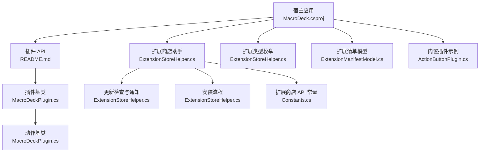
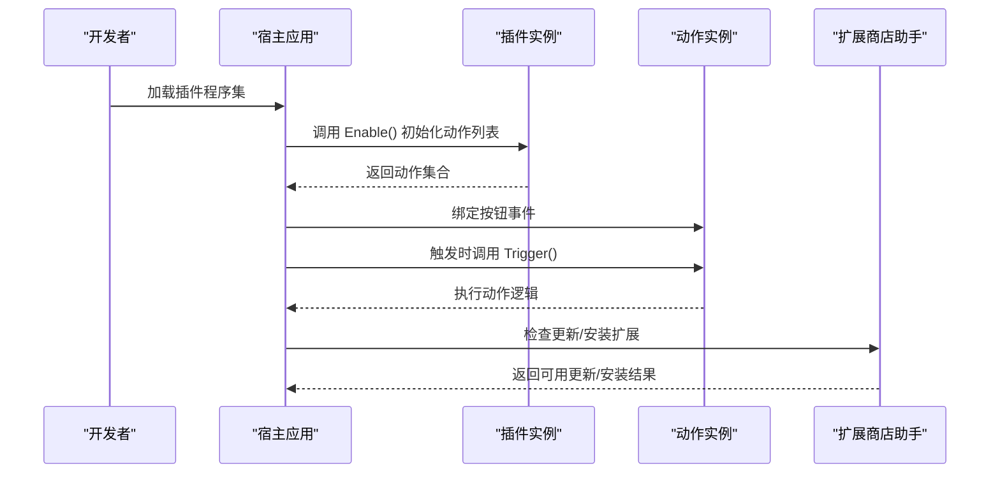
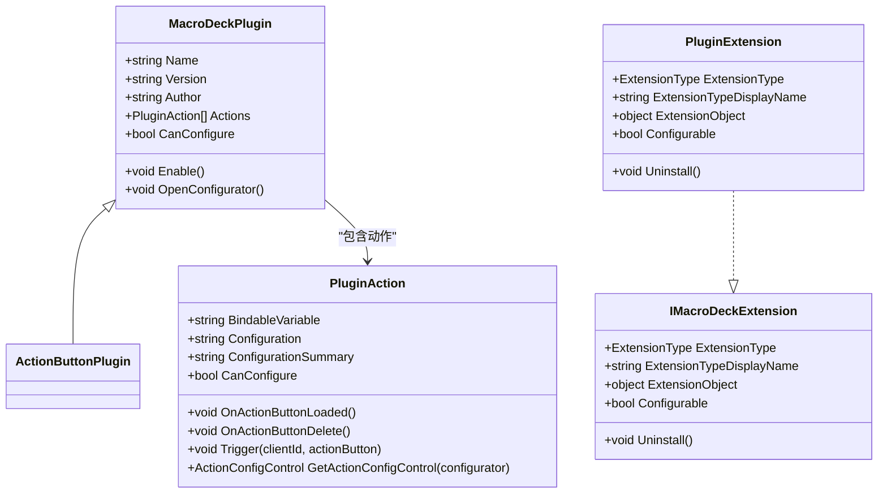
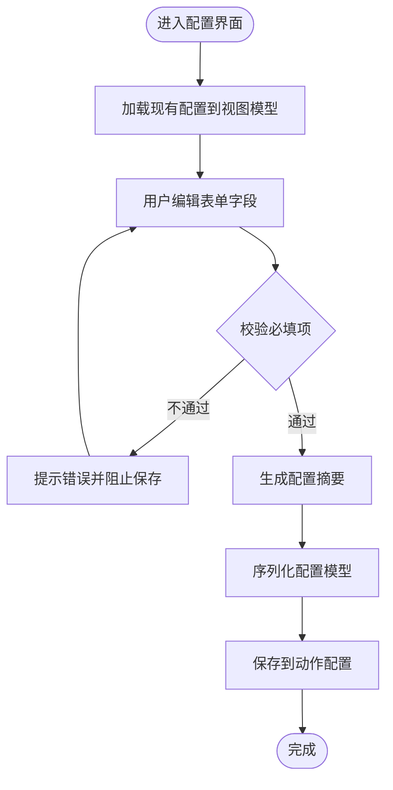
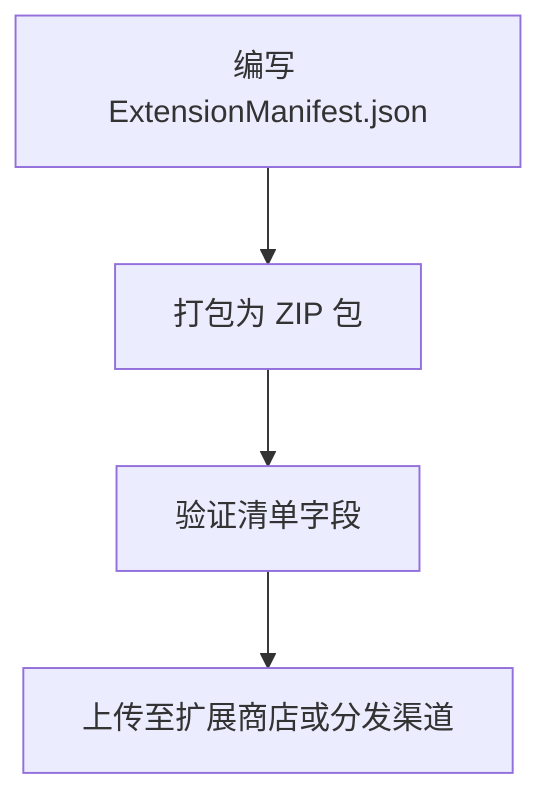
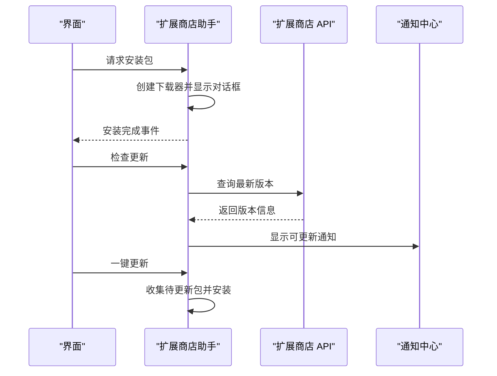
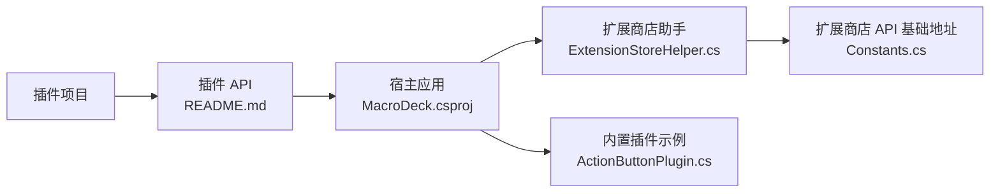

# 插件开发指南

<cite>
**本文引用的文件**
- [IMacroDeckExtension.cs](file://src/MacroDeck/Extension/IMacroDeckExtension.cs)
- [PluginExtension.cs](file://src/MacroDeck/Extension/PluginExtension.cs)
- [ExtensionManifestModel.cs](file://src/MacroDeck/Models/ExtensionManifestModel.cs)
- [MacroDeckPlugin.cs](file://src/MacroDeck/Plugins/MacroDeckPlugin.cs)
- [ActionButtonPlugin.cs](file://src/MacroDeck/InternalPlugins/ActionButtonPlugin/ActionButtonPlugin.cs)
- [ExtensionStoreHelper.cs](file://src/MacroDeck/ExtensionStore/ExtensionStoreHelper.cs)
- [ApiV2Extension.cs](file://src/MacroDeck/Models/ApiV2Extension.cs)
- [MacroDeck.csproj](file://src/MacroDeck/MacroDeck.csproj)
- [README.md](file://src/MacroDeck/README.md)
- [Constants.cs](file://src/MacroDeck/Constants.cs)
- [ISerializableConfigViewModel.cs](file://src/MacroDeck/ViewModels/ISerializableConfigViewModel.cs)
- [ChangeVariableValueActionConfigViewModel.cs](file://src/MacroDeck/InternalPlugins/Variables/ViewModels/ChangeVariableValueActionConfigViewModel.cs)
- [ReadVariableFromFileActionConfigViewModel.cs](file://src/MacroDeck/InternalPlugins/Variables/ViewModels/ReadVariableFromFileActionConfigViewModel.cs)
- [BackupManager.cs](file://src/MacroDeck/Backup/BackupManager.cs)
- [SetupPage4.cs](file://src/MacroDeck/GUI/InitialSetupPages/SetupPage4.cs)
- [InitialSetupPluginItem.cs](file://src/MacroDeck/GUI/CustomControls/InitialSetup/InitialSetupPluginItem.cs)
- [ActionConfiguratorPluginItem.cs](file://src/MacroDeck/GUI/CustomControls/ActionConfiguratorPluginItem.cs)
- [ActionItem.Designer.cs](file://src/MacroDeck/GUI/CustomControls/ButtonEditor/ActionItem.Designer.cs)
- [publish-nuget.yml](file://.github/workflows/publish-nuget.yml)
- [build-push-windows.yml](file://.github/workflows/build-push-windows.yml)
</cite>

## 目录
1. [简介](#简介)
2. [项目结构](#项目结构)
3. [核心组件](#核心组件)
4. [架构总览](#架构总览)
5. [详细组件分析](#详细组件分析)
6. [依赖关系分析](#依赖关系分析)
7. [性能考虑](#性能考虑)
8. [故障排查指南](#故障排查指南)
9. [结论](#结论)
10. [附录](#附录)

## 简介
本指南面向希望为 Macro-Deck 开发插件的开发者，覆盖从开发环境准备、项目创建与配置、插件基类与接口使用、配置模型与视图模型设计、视图与交互开发、打包与发布，到调试与测试的全流程。文档基于仓库中的真实代码进行分析，确保内容可落地、可复用。

## 项目结构
Macro-Deck 的插件体系由“宿主应用 + 插件 API + 内置插件 + 扩展商店”构成。插件通过继承宿主提供的基类并实现接口参与系统生命周期；扩展商店负责安装、更新与版本管理；插件配置采用序列化模型并通过视图模型驱动 UI。

图表来源
- [MacroDeck.csproj:1-363](file://src/MacroDeck/MacroDeck.csproj#L1-L363)
- [ExtensionStoreHelper.cs:17-195](file://src/MacroDeck/ExtensionStore/ExtensionStoreHelper.cs#L17-L195)
- [ExtensionManifestModel.cs:8-61](file://src/MacroDeck/Models/ExtensionManifestModel.cs#L8-L61)
- [MacroDeckPlugin.cs:9-184](file://src/MacroDeck/Plugins/MacroDeckPlugin.cs#L9-L184)
- [ActionButtonPlugin.cs:10-26](file://src/MacroDeck/InternalPlugins/ActionButtonPlugin/ActionButtonPlugin.cs#L10-L26)
- [Constants.cs:4-6](file://src/MacroDeck/Constants.cs#L4-L6)

章节来源
- [MacroDeck.csproj:1-363](file://src/MacroDeck/MacroDeck.csproj#L1-L363)
- [README.md:1-24](file://src/MacroDeck/README.md#L1-L24)

## 核心组件
- 插件基类与接口
  - 宏命令插件基类：提供插件元数据、启用逻辑、动作集合、可配置性等能力。
  - 动作基类：定义触发器、配置序列化、可配置 UI 控件等。
  - 扩展接口：统一扩展对象的类型、显示名、可配置性与卸载行为。
- 清单模型
  - 定义扩展包的元数据（类型、名称、作者、仓库、包 ID、版本、目标 API 版本、入口 DLL）及序列化/反序列化工具。
- 扩展商店助手
  - 提供按包 ID 安装、批量安装、更新检查、通知与一键更新等能力。
- 配置模型与视图模型
  - 通过可序列化配置模型承载用户设置，配合视图模型完成 UI 与配置的双向绑定与保存。

章节来源
- [MacroDeckPlugin.cs:9-184](file://src/MacroDeck/Plugins/MacroDeckPlugin.cs#L9-L184)
- [IMacroDeckExtension.cs:5-12](file://src/MacroDeck/Extension/IMacroDeckExtension.cs#L5-L12)
- [PluginExtension.cs:7-24](file://src/MacroDeck/Extension/PluginExtension.cs#L7-L24)
- [ExtensionManifestModel.cs:8-61](file://src/MacroDeck/Models/ExtensionManifestModel.cs#L8-L61)
- [ExtensionStoreHelper.cs:17-195](file://src/MacroDeck/ExtensionStore/ExtensionStoreHelper.cs#L17-L195)
- [ISerializableConfigViewModel.cs:5-12](file://src/MacroDeck/ViewModels/ISerializableConfigViewModel.cs#L5-L12)

## 架构总览
下图展示插件在宿主中的生命周期与交互路径：插件加载后注册动作，用户在界面中配置动作，触发时执行动作逻辑；扩展商店负责安装与更新。

图表来源
- [MacroDeckPlugin.cs:59](file://src/MacroDeck/Plugins/MacroDeckPlugin.cs#L59)
- [MacroDeckPlugin.cs:137](file://src/MacroDeck/Plugins/MacroDeckPlugin.cs#L137)
- [ExtensionStoreHelper.cs:71-131](file://src/MacroDeck/ExtensionStore/ExtensionStoreHelper.cs#L71-L131)

## 详细组件分析

### 插件基类与接口：继承与实现
- 继承宏命令插件基类
  - 在插件类中重写启用逻辑以初始化动作集合。
  - 可选择实现可配置性与配置器打开逻辑。
- 实现扩展接口
  - 通过扩展包装器暴露扩展类型、显示名、可配置性与卸载行为。
- 关键点
  - 插件元数据（名称、版本、作者）可通过反射或默认值获取。
  - 动作需要实现触发器并在配置变更时更新摘要。

图表来源
- [MacroDeckPlugin.cs:9-184](file://src/MacroDeck/Plugins/MacroDeckPlugin.cs#L9-L184)
- [ActionButtonPlugin.cs:10-26](file://src/MacroDeck/InternalPlugins/ActionButtonPlugin/ActionButtonPlugin.cs#L10-L26)
- [IMacroDeckExtension.cs:5-12](file://src/MacroDeck/Extension/IMacroDeckExtension.cs#L5-L12)
- [PluginExtension.cs:7-24](file://src/MacroDeck/Extension/PluginExtension.cs#L7-L24)

章节来源
- [MacroDeckPlugin.cs:19-65](file://src/MacroDeck/Plugins/MacroDeckPlugin.cs#L19-L65)
- [ActionButtonPlugin.cs:15-24](file://src/MacroDeck/InternalPlugins/ActionButtonPlugin/ActionButtonPlugin.cs#L15-L24)
- [IMacroDeckExtension.cs:5-12](file://src/MacroDeck/Extension/IMacroDeckExtension.cs#L5-L12)
- [PluginExtension.cs:7-24](file://src/MacroDeck/Extension/PluginExtension.cs#L7-L24)

### 插件配置模型与视图模型
- 配置模型
  - 使用可序列化配置模型承载用户输入，支持序列化/反序列化。
- 视图模型
  - 实现可序列化配置视图模型接口，负责校验、生成摘要与保存配置。
  - 将 UI 绑定到配置模型字段，保存时更新动作的配置与摘要。

图表来源
- [ISerializableConfigViewModel.cs:5-12](file://src/MacroDeck/ViewModels/ISerializableConfigViewModel.cs#L5-L12)
- [ChangeVariableValueActionConfigViewModel.cs:37-90](file://src/MacroDeck/InternalPlugins/Variables/ViewModels/ChangeVariableValueActionConfigViewModel.cs#L37-L90)
- [ReadVariableFromFileActionConfigViewModel.cs:1-43](file://src/MacroDeck/InternalPlugins/Variables/ViewModels/ReadVariableFromFileActionConfigViewModel.cs#L1-L43)

章节来源
- [ISerializableConfigViewModel.cs:5-12](file://src/MacroDeck/ViewModels/ISerializableConfigViewModel.cs#L5-L12)
- [ChangeVariableValueActionConfigViewModel.cs:37-90](file://src/MacroDeck/InternalPlugins/Variables/ViewModels/ChangeVariableValueActionConfigViewModel.cs#L37-L90)
- [ReadVariableFromFileActionConfigViewModel.cs:1-43](file://src/MacroDeck/InternalPlugins/Variables/ViewModels/ReadVariableFromFileActionConfigViewModel.cs#L1-L43)

### 扩展清单与打包
- 清单字段
  - 类型、名称、作者、仓库、包 ID、版本、目标插件 API 版本、入口 DLL。
- 序列化与读取
  - 支持从文件、ZIP 中提取清单并解析。
- 打包建议
  - 包含清单文件、程序集与资源，遵循目标 API 版本要求。

图表来源
- [ExtensionManifestModel.cs:8-61](file://src/MacroDeck/Models/ExtensionManifestModel.cs#L8-L61)

章节来源
- [ExtensionManifestModel.cs:22-25](file://src/MacroDeck/Models/ExtensionManifestModel.cs#L22-L25)
- [ExtensionManifestModel.cs:32-46](file://src/MacroDeck/Models/ExtensionManifestModel.cs#L32-L46)

### 扩展商店安装与更新
- 安装流程
  - 通过包 ID 或批量包信息启动安装对话框。
- 更新检查
  - 异步遍历已安装插件与图标包，查询最新版本并推送通知。
- 一键更新
  - 收集待更新包并发起安装流程。

图表来源
- [ExtensionStoreHelper.cs:31-64](file://src/MacroDeck/ExtensionStore/ExtensionStoreHelper.cs#L31-L64)
- [ExtensionStoreHelper.cs:71-131](file://src/MacroDeck/ExtensionStore/ExtensionStoreHelper.cs#L71-L131)
- [ExtensionStoreHelper.cs:133-160](file://src/MacroDeck/ExtensionStore/ExtensionStoreHelper.cs#L133-L160)
- [Constants.cs:4-6](file://src/MacroDeck/Constants.cs#L4-L6)

章节来源
- [ExtensionStoreHelper.cs:31-64](file://src/MacroDeck/ExtensionStore/ExtensionStoreHelper.cs#L31-L64)
- [ExtensionStoreHelper.cs:71-131](file://src/MacroDeck/ExtensionStore/ExtensionStoreHelper.cs#L71-L131)
- [ExtensionStoreHelper.cs:133-160](file://src/MacroDeck/ExtensionStore/ExtensionStoreHelper.cs#L133-L160)
- [Constants.cs:4-6](file://src/MacroDeck/Constants.cs#L4-L6)

### 插件视图与视图模型开发指导
- 视图层
  - 使用宿主提供的控件与布局组件，结合语言资源与图标。
- 视图模型层
  - 实现可序列化配置视图模型接口，处理保存、校验与摘要生成。
- 动作配置控件
  - 动作可提供自定义配置控件，用于复杂参数编辑。

章节来源
- [ActionConfiguratorPluginItem.cs:7-56](file://src/MacroDeck/GUI/CustomControls/ActionConfiguratorPluginItem.cs#L7-L56)
- [ActionItem.Designer.cs:214-235](file://src/MacroDeck/GUI/CustomControls/ButtonEditor/ActionItem.Designer.cs#L214-L235)
- [ISerializableConfigViewModel.cs:5-12](file://src/MacroDeck/ViewModels/ISerializableConfigViewModel.cs#L5-L12)

### 初始设置中的插件安装
- 初始设置页面会拉取可用插件列表，支持自动安装与手动勾选安装。
- 通过网络请求获取插件信息并渲染到 UI。

章节来源
- [SetupPage4.cs:18-92](file://src/MacroDeck/GUI/InitialSetupPages/SetupPage4.cs#L18-L92)
- [InitialSetupPluginItem.cs:6-30](file://src/MacroDeck/GUI/CustomControls/InitialSetup/InitialSetupPluginItem.cs#L6-L30)

## 依赖关系分析
- 插件对宿主 API 的依赖
  - 插件编译期依赖宿主 API，运行时不复制宿主程序集，由宿主提供运行时环境。
- 扩展商店与外部服务
  - 通过常量定义的商店 API 基础地址访问扩展商店服务。
- 内置插件示例
  - 内置插件演示了如何组织动作、配置与视图模型。

图表来源
- [README.md:9-18](file://src/MacroDeck/README.md#L9-L18)
- [MacroDeck.csproj:1-363](file://src/MacroDeck/MacroDeck.csproj#L1-L363)
- [ExtensionStoreHelper.cs:17-195](file://src/MacroDeck/ExtensionStore/ExtensionStoreHelper.cs#L17-L195)
- [Constants.cs:4-6](file://src/MacroDeck/Constants.cs#L4-L6)
- [ActionButtonPlugin.cs:10-26](file://src/MacroDeck/InternalPlugins/ActionButtonPlugin/ActionButtonPlugin.cs#L10-L26)

章节来源
- [README.md:9-18](file://src/MacroDeck/README.md#L9-L18)
- [MacroDeck.csproj:1-363](file://src/MacroDeck/MacroDeck.csproj#L1-L363)
- [ExtensionStoreHelper.cs:17-195](file://src/MacroDeck/ExtensionStore/ExtensionStoreHelper.cs#L17-L195)
- [Constants.cs:4-6](file://src/MacroDeck/Constants.cs#L4-L6)
- [ActionButtonPlugin.cs:10-26](file://src/MacroDeck/InternalPlugins/ActionButtonPlugin/ActionButtonPlugin.cs#L10-L26)

## 性能考虑
- 动作触发链路应尽量轻量化，避免在触发器中执行耗时操作。
- 配置保存前进行必要校验，减少无效序列化与 IO。
- 扩展商店更新检查应异步执行，避免阻塞 UI。
- 大型插件可拆分为多个动作模块，按需加载。

## 故障排查指南
- 插件无法加载
  - 检查目标 API 版本是否匹配，确认清单中的目标 API 版本与宿主一致。
  - 确认程序集与依赖正确打包。
- 配置保存失败
  - 查看视图模型保存流程中的异常日志，确保必填字段非空。
- 安装/更新失败
  - 检查扩展商店 API 地址与网络连通性，查看更新检查日志。
- 备份恢复问题
  - 确认备份文件包含插件目录与配置目录，恢复后重启宿主应用。

章节来源
- [ExtensionManifestModel.cs:22-25](file://src/MacroDeck/Models/ExtensionManifestModel.cs#L22-L25)
- [ChangeVariableValueActionConfigViewModel.cs:45-63](file://src/MacroDeck/InternalPlugins/Variables/ViewModels/ChangeVariableValueActionConfigViewModel.cs#L45-L63)
- [ExtensionStoreHelper.cs:162-187](file://src/MacroDeck/ExtensionStore/ExtensionStoreHelper.cs#L162-L187)
- [BackupManager.cs:324-350](file://src/MacroDeck/Backup/BackupManager.cs#L324-L350)

## 结论
通过本指南，开发者可以基于宿主提供的 API 与工具，快速完成插件的开发、配置、视图与交互、打包与发布，并借助扩展商店实现安装与更新。建议在开发过程中严格遵循配置模型与视图模型的分离原则，保持动作触发链路简洁高效，并充分利用扩展商店与备份机制提升用户体验。

## 附录

### 开发环境与项目创建
- 添加插件 API 包引用（仅编译期引用，不复制运行时程序集）
- 新建类库项目，设置目标框架与 WPF/WinForms 支持
- 编写插件类，继承插件基类并实现启用逻辑
- 如需配置界面，提供动作配置控件与视图模型

章节来源
- [README.md:9-18](file://src/MacroDeck/README.md#L9-L18)
- [MacroDeck.csproj:1-363](file://src/MacroDeck/MacroDeck.csproj#L1-L363)

### 构建与打包
- 使用 NuGet 工作流进行打包与发布
- 使用 Inno Setup 构建 Windows 安装包并上传到发布渠道

章节来源
- [.github/workflows/publish-nuget.yml:24-60](file://.github/workflows/publish-nuget.yml#L24-L60)
- [.github/workflows/build-push-windows.yml:24-91](file://.github/workflows/build-push-windows.yml#L24-L91)

### 发布与签名
- 插件包通过扩展商店发布，宿主应用通过 API 进行安装与更新
- 宿主应用自身具备打包与发布流程（安装包、更新推送）

章节来源
- [ExtensionStoreHelper.cs:31-64](file://src/MacroDeck/ExtensionStore/ExtensionStoreHelper.cs#L31-L64)
- [ExtensionStoreHelper.cs:162-187](file://src/MacroDeck/ExtensionStore/ExtensionStoreHelper.cs#L162-L187)
- [.github/workflows/build-push-windows.yml:77-91](file://.github/workflows/build-push-windows.yml#L77-L91)