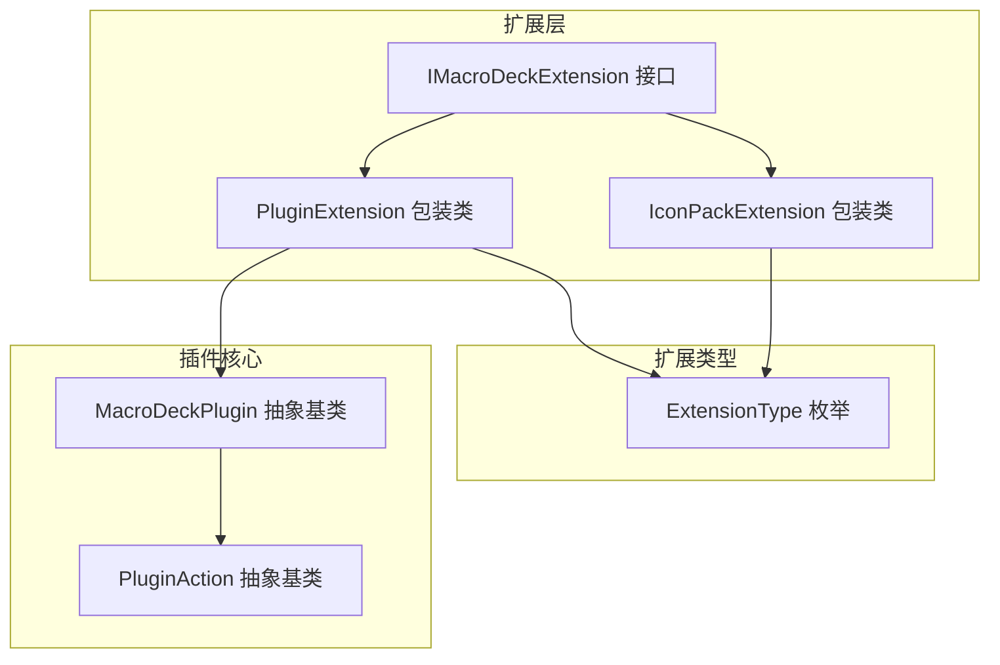
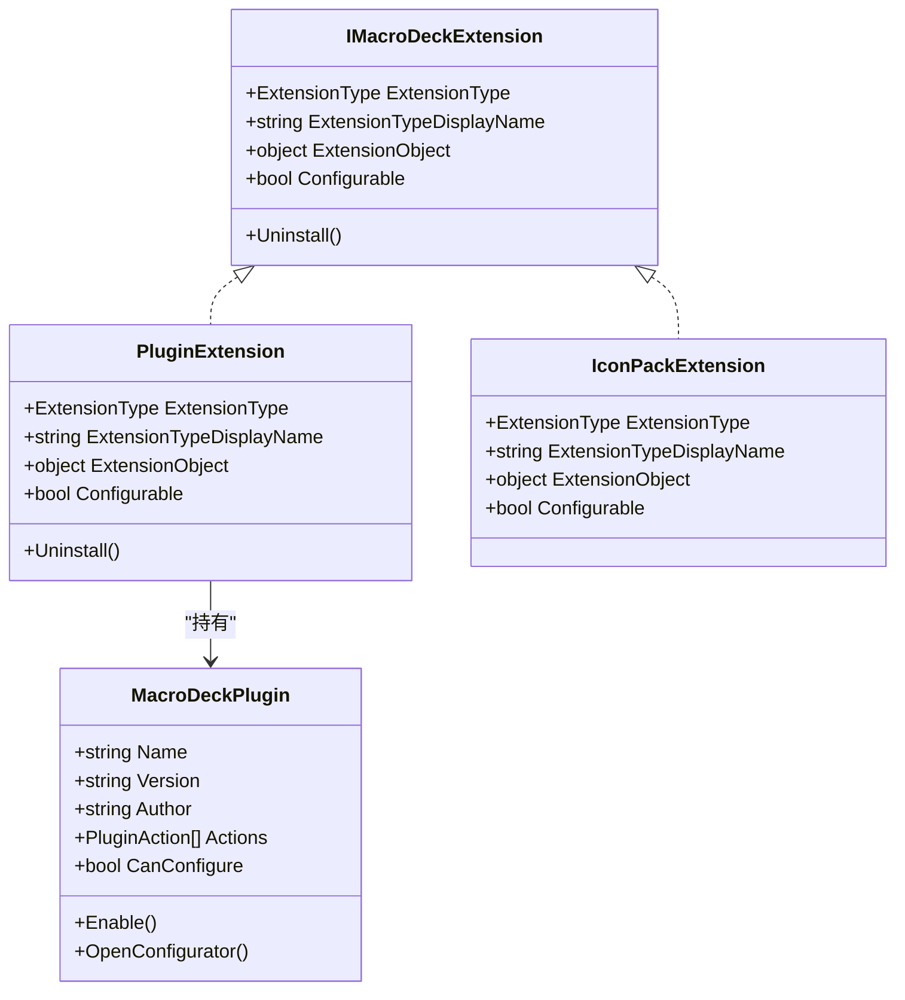
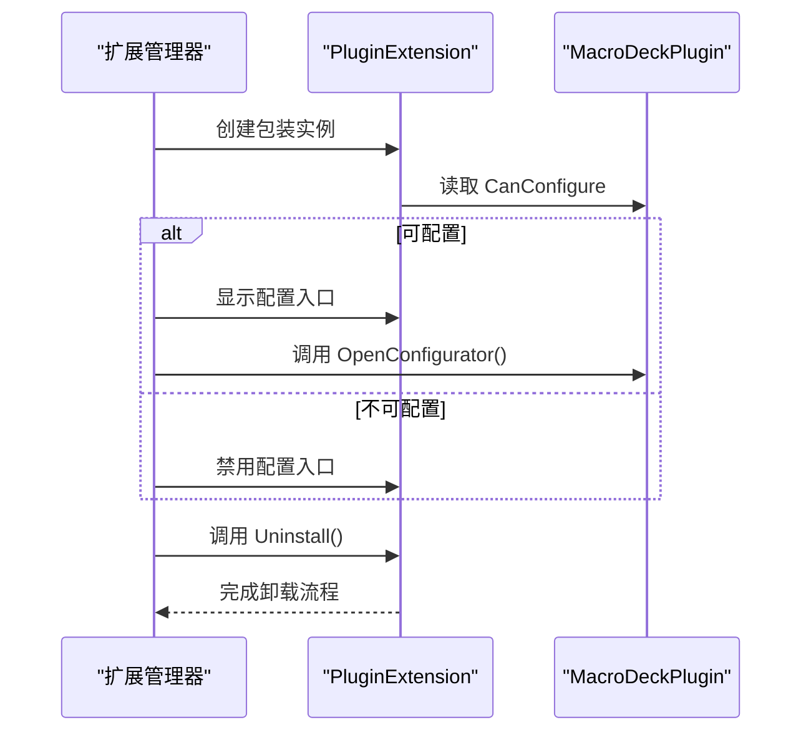
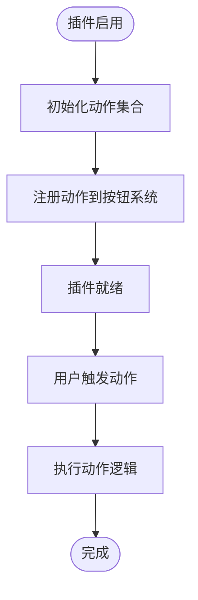
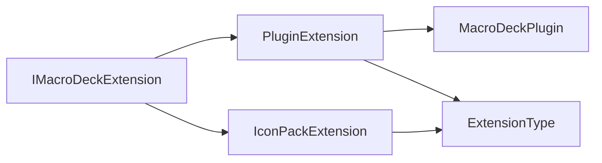

# 插件架构设计

<cite>
**本文引用的文件**
- [IMacroDeckExtension.cs](file://src/MacroDeck/Extension/IMacroDeckExtension.cs)
- [PluginExtension.cs](file://src/MacroDeck/Extension/PluginExtension.cs)
- [IconPackExtension.cs](file://src/MacroDeck/Extension/IconPackExtension.cs)
- [MacroDeckPlugin.cs](file://src/MacroDeck/Plugins/MacroDeckPlugin.cs)
- [ExtensionStoreHelper.cs](file://src/MacroDeck/ExtensionStore/ExtensionStoreHelper.cs)
</cite>

## 目录
1. [引言](#引言)
2. [项目结构](#项目结构)
3. [核心组件](#核心组件)
4. [架构总览](#架构总览)
5. [详细组件分析](#详细组件分析)
6. [依赖关系分析](#依赖关系分析)
7. [性能考虑](#性能考虑)
8. [故障排查指南](#故障排查指南)
9. [结论](#结论)
10. [附录](#附录)

## 引言
本文件面向 Macro-Deck 插件系统的架构设计与实现，聚焦于插件扩展接口 IMacroDeckExtension 的设计理念、插件生命周期管理、PluginExtension 基类的扩展点、扩展类型枚举与扩展机制，并给出最佳实践与设计模式建议。目标是帮助插件开发者在不破坏核心框架的前提下，构建可维护、可配置、可扩展的插件模块。

## 项目结构
围绕插件系统的关键目录与文件如下：
- 扩展接口与包装类：Extension 目录下的 IMacroDeckExtension、PluginExtension、IconPackExtension
- 核心插件基类：Plugins 目录下的 MacroDeckPlugin（以及内部的 PluginAction）
- 扩展类型定义：ExtensionStoreHelper 中的 ExtensionType 枚举
- 语言与显示：通过语言管理器提供扩展类型的本地化显示名称

图表来源
- [IMacroDeckExtension.cs:1-13](file://src/MacroDeck/Extension/IMacroDeckExtension.cs#L1-L13)
- [PluginExtension.cs:1-24](file://src/MacroDeck/Extension/PluginExtension.cs#L1-L24)
- [IconPackExtension.cs:1-23](file://src/MacroDeck/Extension/IconPackExtension.cs#L1-L23)
- [MacroDeckPlugin.cs:1-184](file://src/MacroDeck/Plugins/MacroDeckPlugin.cs#L1-L184)
- [ExtensionStoreHelper.cs:190-195](file://src/MacroDeck/ExtensionStore/ExtensionStoreHelper.cs#L190-L195)

章节来源
- [IMacroDeckExtension.cs:1-13](file://src/MacroDeck/Extension/IMacroDeckExtension.cs#L1-L13)
- [PluginExtension.cs:1-24](file://src/MacroDeck/Extension/PluginExtension.cs#L1-L24)
- [IconPackExtension.cs:1-23](file://src/MacroDeck/Extension/IconPackExtension.cs#L1-L23)
- [MacroDeckPlugin.cs:1-184](file://src/MacroDeck/Plugins/MacroDeckPlugin.cs#L1-L184)
- [ExtensionStoreHelper.cs:190-195](file://src/MacroDeck/ExtensionStore/ExtensionStoreHelper.cs#L190-L195)

## 核心组件
- IMacroDeckExtension 接口：统一扩展对象的抽象，提供扩展类型、显示名、承载对象、是否可配置以及卸载能力。
- PluginExtension：针对 MacroDeckPlugin 的包装实现，负责将插件对象映射为扩展对象，并根据插件能力动态决定可配置性。
- IconPackExtension：针对图标包的包装实现，当前不可配置。
- MacroDeckPlugin：插件基类，定义插件元数据、启用逻辑、配置入口、动作集合等扩展点。
- ExtensionType：扩展类型枚举，用于区分插件与图标包两类扩展。

章节来源
- [IMacroDeckExtension.cs:5-12](file://src/MacroDeck/Extension/IMacroDeckExtension.cs#L5-L12)
- [PluginExtension.cs:7-23](file://src/MacroDeck/Extension/PluginExtension.cs#L7-L23)
- [IconPackExtension.cs:7-22](file://src/MacroDeck/Extension/IconPackExtension.cs#L7-L22)
- [MacroDeckPlugin.cs:9-65](file://src/MacroDeck/Plugins/MacroDeckPlugin.cs#L9-L65)
- [ExtensionStoreHelper.cs:190-195](file://src/MacroDeck/ExtensionStore/ExtensionStoreHelper.cs#L190-L195)

## 架构总览
插件系统采用“接口抽象 + 具体包装 + 基类扩展”的分层设计：
- 接口层：IMacroDeckExtension 统一扩展对象的契约，屏蔽具体扩展类型差异。
- 包装层：PluginExtension/IconPackExtension 将具体扩展对象（如 MacroDeckPlugin、IconPack）适配为统一的扩展视图。
- 扩展层：ExtensionType 枚举标识扩展类型；语言管理器提供本地化显示名。
- 生命周期：由上层管理器负责加载、启用、配置、卸载，插件通过基类方法参与生命周期事件。

图表来源
- [IMacroDeckExtension.cs:5-12](file://src/MacroDeck/Extension/IMacroDeckExtension.cs#L5-L12)
- [PluginExtension.cs:7-23](file://src/MacroDeck/Extension/PluginExtension.cs#L7-L23)
- [IconPackExtension.cs:7-22](file://src/MacroDeck/Extension/IconPackExtension.cs#L7-L22)
- [MacroDeckPlugin.cs:9-65](file://src/MacroDeck/Plugins/MacroDeckPlugin.cs#L9-L65)

## 详细组件分析

### IMacroDeckExtension 接口设计
- 设计意图：以最小职责集抽象扩展对象，便于统一展示、配置与卸载。
- 关键属性与方法：
  - ExtensionType：扩展类型枚举，用于区分插件与图标包。
  - ExtensionTypeDisplayName：本地化的扩展类型显示名，提升用户体验。
  - ExtensionObject：承载具体扩展对象（如 MacroDeckPlugin 或图标包）。
  - Configurable：指示扩展是否可配置，供 UI 层决定是否显示配置入口。
  - Uninstall：卸载扩展的统一入口，便于上层执行清理与移除操作。

章节来源
- [IMacroDeckExtension.cs:5-12](file://src/MacroDeck/Extension/IMacroDeckExtension.cs#L5-L12)

### PluginExtension 包装类
- 角色定位：将 MacroDeckPlugin 对象包装为 IMacroDeckExtension，以便统一管理。
- 实现要点：
  - ExtensionType 固定为 Plugin。
  - ExtensionTypeDisplayName 来自语言管理器的本地化字符串。
  - ExtensionObject 持有 MacroDeckPlugin 实例。
  - Configurable 基于插件的 CanConfigure 属性动态计算。
  - Uninstall 当前为空实现，预留扩展点。

图表来源
- [PluginExtension.cs:7-23](file://src/MacroDeck/Extension/PluginExtension.cs#L7-L23)
- [MacroDeckPlugin.cs:47-54](file://src/MacroDeck/Plugins/MacroDeckPlugin.cs#L47-L54)

章节来源
- [PluginExtension.cs:7-23](file://src/MacroDeck/Extension/PluginExtension.cs#L7-L23)
- [MacroDeckPlugin.cs:47-54](file://src/MacroDeck/Plugins/MacroDeckPlugin.cs#L47-L54)

### IconPackExtension 包装类
- 角色定位：将图标包包装为扩展对象，当前不可配置。
- 实现要点：
  - ExtensionType 固定为 IconPack。
  - ExtensionTypeDisplayName 来自语言管理器的本地化字符串。
  - ExtensionObject 持有图标包实例。
  - Configurable 固定为 false。
  - Uninstall 当前为空实现，预留扩展点。

章节来源
- [IconPackExtension.cs:7-22](file://src/MacroDeck/Extension/IconPackExtension.cs#L7-L22)

### MacroDeckPlugin 插件基类
- 元数据与生命周期：
  - Name/Version/Author：通过程序集反射获取，确保版本与作者信息一致。
  - Enable：插件启用时调用，用于初始化动作列表等。
  - CanConfigure/OpenConfigurator：控制插件是否可配置及打开配置界面。
- 动作模型：
  - Actions：插件提供的动作集合。
  - PluginAction：动作抽象，包含绑定变量、加载/删除回调、触发逻辑、配置能力等。
  - GetNewInstance：基于序列化复制动作实例，支持安全克隆。

图表来源
- [MacroDeckPlugin.cs:59](file://src/MacroDeck/Plugins/MacroDeckPlugin.cs#L59)
- [MacroDeckPlugin.cs:67-184](file://src/MacroDeck/Plugins/MacroDeckPlugin.cs#L67-L184)

章节来源
- [MacroDeckPlugin.cs:9-65](file://src/MacroDeck/Plugins/MacroDeckPlugin.cs#L9-L65)
- [MacroDeckPlugin.cs:67-184](file://src/MacroDeck/Plugins/MacroDeckPlugin.cs#L67-L184)

### 扩展类型枚举与扩展机制
- ExtensionType：定义扩展类型集合（Plugin、IconPack），用于 UI 识别与功能分支。
- 与包装类的关系：包装类通过 ExtensionType 决定显示名与行为（如可配置性）。
- 与语言系统集成：显示名来自语言管理器，保证多语言一致性。

章节来源
- [ExtensionStoreHelper.cs:190-195](file://src/MacroDeck/ExtensionStore/ExtensionStoreHelper.cs#L190-L195)
- [PluginExtension.cs:9-10](file://src/MacroDeck/Extension/PluginExtension.cs#L9-L10)
- [IconPackExtension.cs:9-10](file://src/MacroDeck/Extension/IconPackExtension.cs#L9-L10)

## 依赖关系分析
- 接口与实现：
  - IMacroDeckExtension 是所有扩展对象的统一契约。
  - PluginExtension/IconPackExtension 分别实现该接口，承载不同扩展对象。
- 扩展对象与插件：
  - PluginExtension 持有 MacroDeckPlugin，间接依赖其生命周期与配置能力。
- 类型与显示：
  - ExtensionType 提供类型标识；语言管理器提供本地化显示名。
- 耦合与内聚：
  - 接口层与实现层松耦合，包装类仅依赖接口与类型枚举。
  - 插件基类集中定义扩展点，降低上层对具体实现的感知。

图表来源
- [IMacroDeckExtension.cs:5-12](file://src/MacroDeck/Extension/IMacroDeckExtension.cs#L5-L12)
- [PluginExtension.cs:7-23](file://src/MacroDeck/Extension/PluginExtension.cs#L7-L23)
- [IconPackExtension.cs:7-22](file://src/MacroDeck/Extension/IconPackExtension.cs#L7-L22)
- [MacroDeckPlugin.cs:9-65](file://src/MacroDeck/Plugins/MacroDeckPlugin.cs#L9-L65)
- [ExtensionStoreHelper.cs:190-195](file://src/MacroDeck/ExtensionStore/ExtensionStoreHelper.cs#L190-L195)

章节来源
- [IMacroDeckExtension.cs:5-12](file://src/MacroDeck/Extension/IMacroDeckExtension.cs#L5-L12)
- [PluginExtension.cs:7-23](file://src/MacroDeck/Extension/PluginExtension.cs#L7-L23)
- [IconPackExtension.cs:7-22](file://src/MacroDeck/Extension/IconPackExtension.cs#L7-L22)
- [MacroDeckPlugin.cs:9-65](file://src/MacroDeck/Plugins/MacroDeckPlugin.cs#L9-L65)
- [ExtensionStoreHelper.cs:190-195](file://src/MacroDeck/ExtensionStore/ExtensionStoreHelper.cs#L190-L195)

## 性能考虑
- 包装类轻量：仅持有扩展对象并暴露必要属性，避免额外开销。
- 配置判断延迟：Configurable 基于运行时插件能力计算，避免重复判断。
- 序列化复制：动作实例复制使用序列化策略，减少直接实例化成本。
- UI 渲染优化：类型与显示名来自语言系统，避免在渲染路径中进行复杂计算。

## 故障排查指南
- 卸载流程未生效
  - 检查包装类 Uninstall 是否被正确调用。
  - 若需执行清理，请在子类中实现卸载逻辑。
- 插件不可配置
  - 确认插件的 CanConfigure 返回 true，并实现 OpenConfigurator。
- 类型显示异常
  - 检查语言管理器资源是否正确加载，确认 ExtensionTypeDisplayName 来源。
- 动作无法触发
  - 确认插件已启用且动作已注册；检查动作的触发逻辑与配置摘要。

章节来源
- [PluginExtension.cs:20-22](file://src/MacroDeck/Extension/PluginExtension.cs#L20-L22)
- [MacroDeckPlugin.cs:47-54](file://src/MacroDeck/Plugins/MacroDeckPlugin.cs#L47-L54)
- [IconPackExtension.cs:19-21](file://src/MacroDeck/Extension/IconPackExtension.cs#L19-L21)

## 结论
Macro-Deck 插件架构通过 IMacroDeckExtension 接口实现了扩展对象的统一抽象，结合 PluginExtension/IconPackExtension 的包装策略，使插件与图标包以一致的方式接入 UI 与管理流程。MacroDeckPlugin 基类提供了清晰的扩展点与生命周期钩子，配合 ExtensionType 枚举与语言系统，形成高内聚、低耦合的模块化体系。遵循本文的设计原则与最佳实践，可有效提升插件开发效率与系统稳定性。

## 附录
- 最佳实践与设计模式
  - 使用接口抽象统一扩展对象，避免上层对具体类型强依赖。
  - 在包装类中仅做适配与委托，保持职责单一。
  - 利用基类扩展点组织生命周期与配置流程，减少重复代码。
  - 通过类型枚举与语言系统实现国际化与可扩展性。
  - 在卸载流程中预留清理逻辑，确保资源释放与状态恢复。