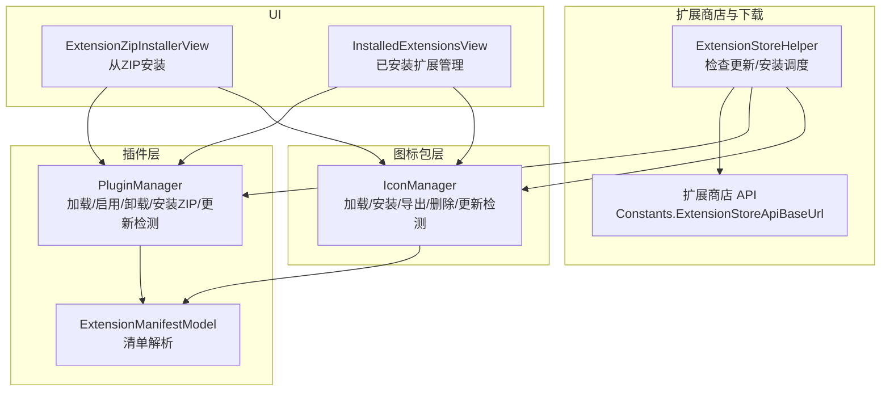
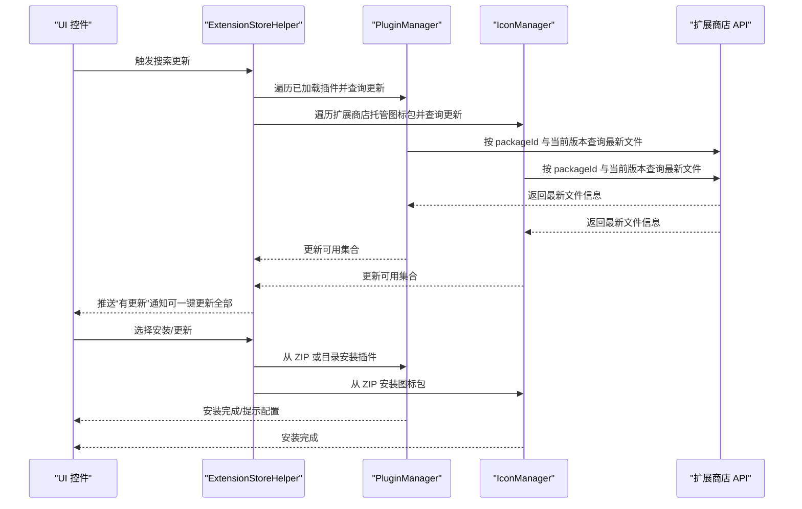
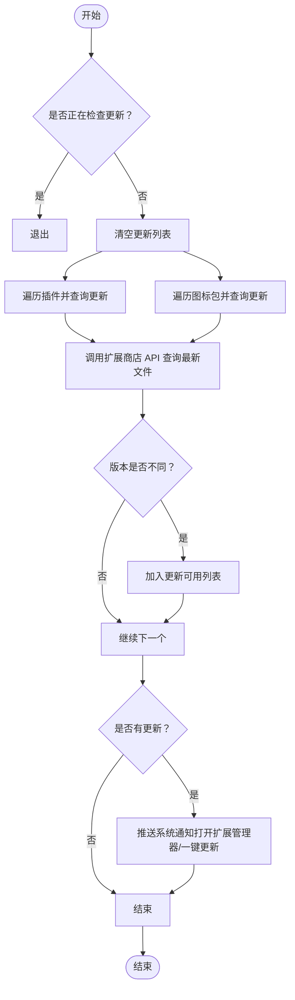
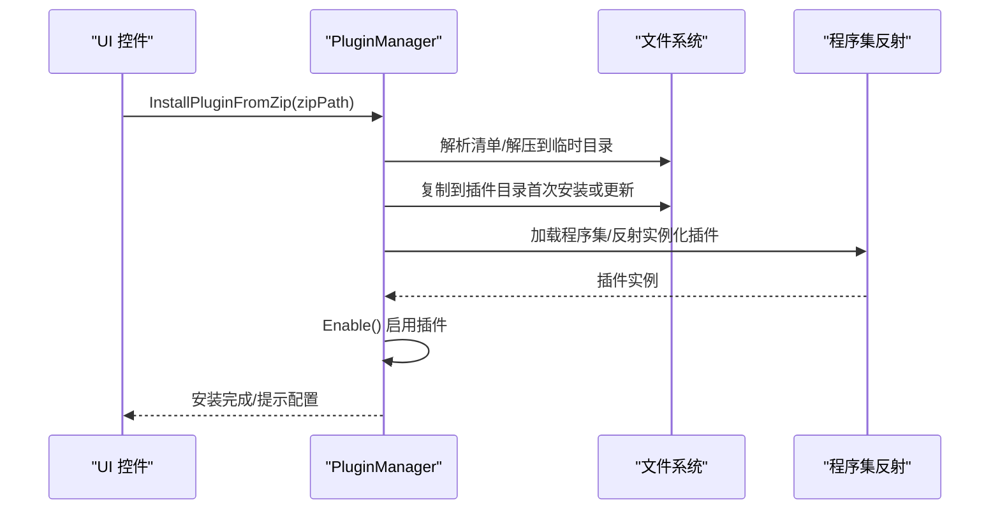
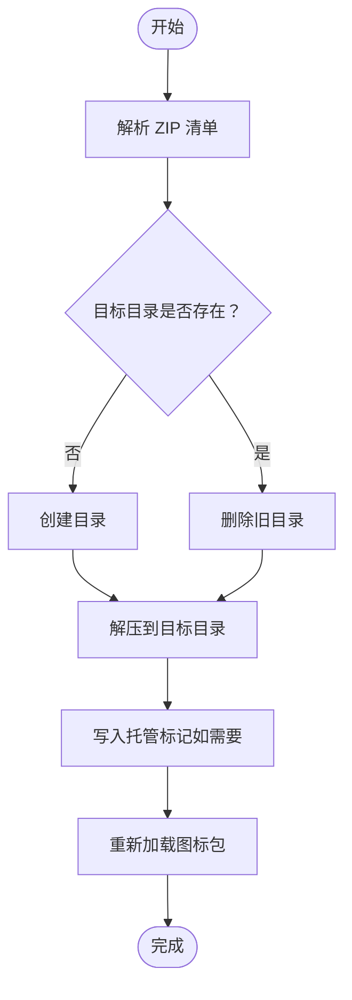
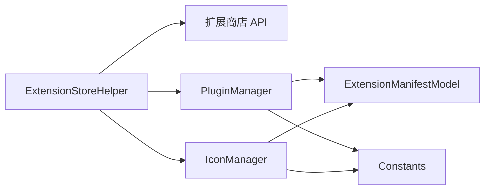
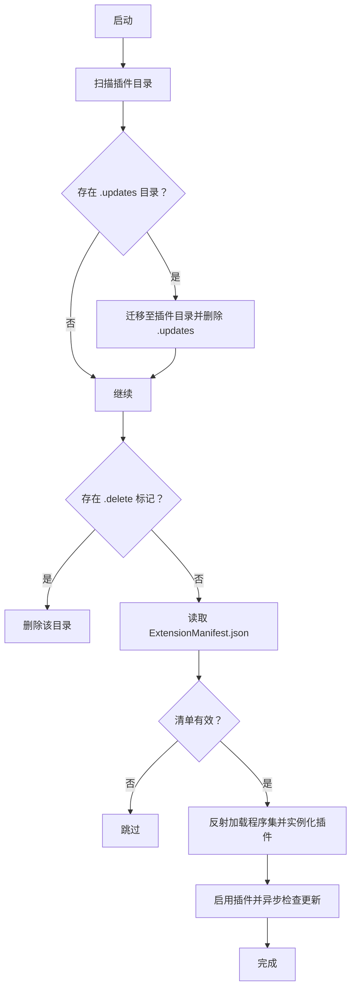
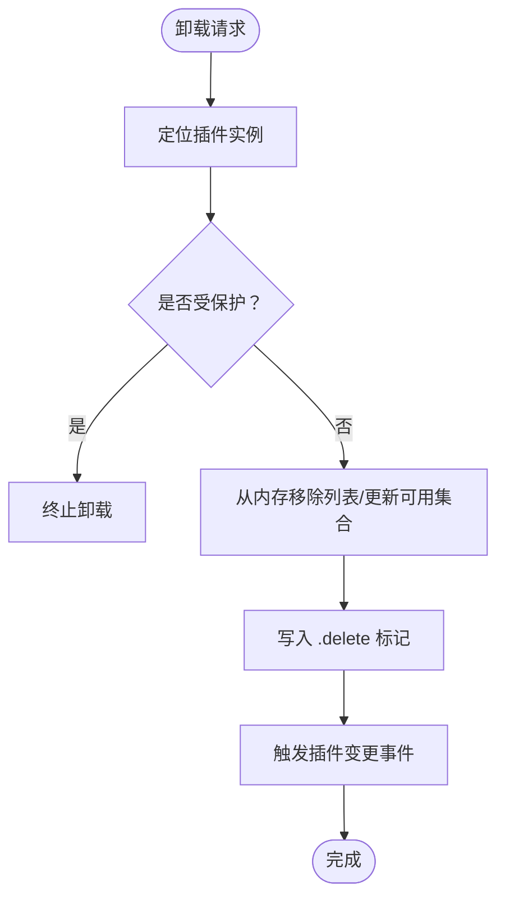
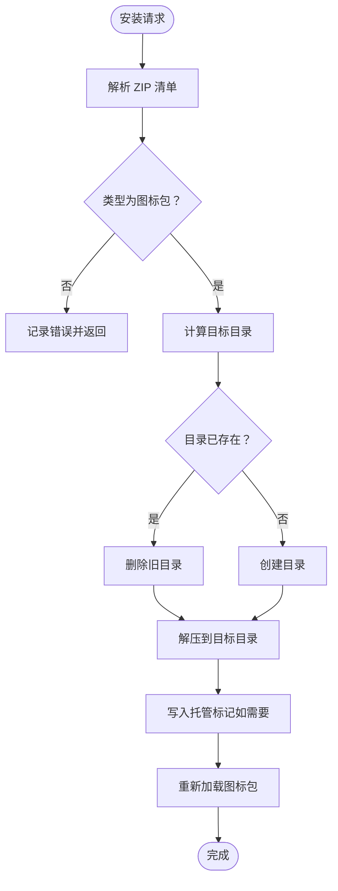

# 插件管理

<cite>
**本文引用的文件**
- [ExtensionStoreHelper.cs](file://src/MacroDeck/ExtensionStore/ExtensionStoreHelper.cs)
- [PluginManager.cs](file://src/MacroDeck/Plugins/PluginManager.cs)
- [IconManager.cs](file://src/MacroDeck/Icons/IconManager.cs)
- [ExtensionManifestModel.cs](file://src/MacroDeck/Models/ExtensionManifestModel.cs)
- [ApiV2Extension.cs](file://src/MacroDeck/Models/ApiV2Extension.cs)
- [ApiV2ExtensionFile.cs](file://src/MacroDeck/Models/ApiV2ExtensionFile.cs)
- [ExtensionStoreDownloaderPackageInfoModel.cs](file://src/MacroDeck/Models/ExtensionStoreDownloaderPackageInfoModel.cs)
- [ExtensionStoreExtensionModel.cs](file://src/MacroDeck/Models/ExtensionStoreExtensionModel.cs)
- [Constants.cs](file://src/MacroDeck/Constants.cs)
- [PluginExtension.cs](file://src/MacroDeck/Extension/PluginExtension.cs)
- [IMacroDeckExtension.cs](file://src/MacroDeck/Extension/IMacroDeckExtension.cs)
- [ExtensionZipInstallerView.cs](file://src/MacroDeck/GUI/CustomControls/ExtensionsView/ExtensionZipInstallerView.cs)
- [InstalledExtensionsView.cs](file://src/MacroDeck/GUI/CustomControls/ExtensionsView/InstalledExtensionsView.cs)
</cite>

## 目录
1. [简介](#简介)
2. [项目结构](#项目结构)
3. [核心组件](#核心组件)
4. [架构总览](#架构总览)
5. [详细组件分析](#详细组件分析)
6. [依赖关系分析](#依赖关系分析)
7. [性能考量](#性能考量)
8. [故障排除指南](#故障排除指南)
9. [结论](#结论)
10. [附录](#附录)

## 简介
本文件面向管理员与高级用户，系统化阐述 Macro-Deck 的插件管理机制，包括插件与图标包的发现、安装、更新、卸载、版本与依赖管理、配置与参数校验、启用/禁用与故障排除、用户界面使用指南、自动与手动更新流程、冲突检测与解决、权限与安全注意事项等。内容基于仓库中实际实现进行归纳总结，并通过图示展示关键流程。

## 项目结构
围绕插件管理的关键目录与文件如下：
- 扩展商店辅助：ExtensionStoreHelper 负责调用扩展商店 API、触发安装对话框、检查更新并推送通知
- 插件管理器：PluginManager 负责加载、启用、卸载、安装（含 ZIP）、更新检测、内部插件注册
- 图标包管理：IconManager 负责图标包加载、安装、导出、删除、更新检测
- 清单模型：ExtensionManifestModel 定义插件/图标包清单字段与解析逻辑
- API 模型：ApiV2Extension、ApiV2ExtensionFile、ExtensionStoreExtensionModel、ExtensionStoreDownloaderPackageInfoModel 提供与扩展商店交互的数据契约
- 常量：Constants 定义扩展商店 API 基础地址
- 扩展接口与适配：IMacroDeckExtension、PluginExtension 作为扩展抽象与插件适配
- UI 组件：ExtensionZipInstallerView 支持从 ZIP 安装；InstalledExtensionsView 提供已安装扩展的管理入口
- 其他：ExtensionStoreDownloaderPackageInfoModel 用于批量安装时的包信息传递

图表来源
- [ExtensionStoreHelper.cs:17-195](file://src/MacroDeck/ExtensionStore/ExtensionStoreHelper.cs#L17-L195)
- [PluginManager.cs:20-479](file://src/MacroDeck/Plugins/PluginManager.cs#L20-L479)
- [IconManager.cs:14-404](file://src/MacroDeck/Icons/IconManager.cs#L14-L404)
- [ExtensionManifestModel.cs:8-61](file://src/MacroDeck/Models/ExtensionManifestModel.cs#L8-L61)
- [Constants.cs:3-7](file://src/MacroDeck/Constants.cs#L3-L7)
- [ExtensionZipInstallerView.cs:40-79](file://src/MacroDeck/GUI/CustomControls/ExtensionsView/ExtensionZipInstallerView.cs#L40-L79)
- [InstalledExtensionsView.cs:238-266](file://src/MacroDeck/GUI/CustomControls/ExtensionsView/InstalledExtensionsView.cs#L238-L266)

章节来源
- [ExtensionStoreHelper.cs:17-195](file://src/MacroDeck/ExtensionStore/ExtensionStoreHelper.cs#L17-L195)
- [PluginManager.cs:20-479](file://src/MacroDeck/Plugins/PluginManager.cs#L20-L479)
- [IconManager.cs:14-404](file://src/MacroDeck/Icons/IconManager.cs#L14-L404)
- [ExtensionManifestModel.cs:8-61](file://src/MacroDeck/Models/ExtensionManifestModel.cs#L8-L61)
- [Constants.cs:3-7](file://src/MacroDeck/Constants.cs#L3-L7)
- [ExtensionZipInstallerView.cs:40-79](file://src/MacroDeck/GUI/CustomControls/ExtensionsView/ExtensionZipInstallerView.cs#L40-L79)
- [InstalledExtensionsView.cs:238-266](file://src/MacroDeck/GUI/CustomControls/ExtensionsView/InstalledExtensionsView.cs#L238-L266)

## 核心组件
- 扩展商店辅助（ExtensionStoreHelper）
  - 提供按 ID 安装插件/图标包、批量安装、更新检查、全量更新、可用性检查等能力
  - 通过扩展商店 API 查询最新文件信息，比较本地版本决定是否可更新
- 插件管理器（PluginManager）
  - 加载插件目录中的清单，反射加载程序集，实例化插件并启用
  - 支持从 ZIP 安装插件，支持更新场景下的“.updates”目录迁移
  - 维护“待卸载标记”（.delete）以延迟删除，避免运行时冲突
  - 内置受保护插件列表，防止用户误删
- 图标包管理器（IconManager）
  - 加载图标包目录中的清单，构建图标包对象与图标列表
  - 支持从 ZIP 安装图标包，支持扩展商店托管标记
  - 提供导出、删除、保存清单等能力
- 清单模型（ExtensionManifestModel）
  - 定义 type、name、author、repository、packageId、version、target-plugin-api-version、dll 等字段
  - 支持从文件或 ZIP 流解析清单
- API 模型
  - ApiV2Extension、ApiV2ExtensionFile、ExtensionStoreExtensionModel、ExtensionStoreDownloaderPackageInfoModel 提供与扩展商店交互的数据契约
- 常量（Constants）
  - 定义扩展商店 API 基础地址
- 扩展接口与适配（IMacroDeckExtension、PluginExtension）
  - 抽象扩展类型与显示名，适配插件扩展对象

章节来源
- [ExtensionStoreHelper.cs:17-195](file://src/MacroDeck/ExtensionStore/ExtensionStoreHelper.cs#L17-L195)
- [PluginManager.cs:20-479](file://src/MacroDeck/Plugins/PluginManager.cs#L20-L479)
- [IconManager.cs:14-404](file://src/MacroDeck/Icons/IconManager.cs#L14-L404)
- [ExtensionManifestModel.cs:8-61](file://src/MacroDeck/Models/ExtensionManifestModel.cs#L8-L61)
- [ApiV2Extension.cs:5-17](file://src/MacroDeck/Models/ApiV2Extension.cs#L5-L17)
- [ApiV2ExtensionFile.cs:3-15](file://src/MacroDeck/Models/ApiV2ExtensionFile.cs#L3-L15)
- [ExtensionStoreExtensionModel.cs:6-28](file://src/MacroDeck/Models/ExtensionStoreExtensionModel.cs#L6-L28)
- [ExtensionStoreDownloaderPackageInfoModel.cs:5-10](file://src/MacroDeck/Models/ExtensionStoreDownloaderPackageInfoModel.cs#L5-L10)
- [Constants.cs:3-7](file://src/MacroDeck/Constants.cs#L3-L7)
- [IMacroDeckExtension.cs:5-13](file://src/MacroDeck/Extension/IMacroDeckExtension.cs#L5-L13)
- [PluginExtension.cs:7-24](file://src/MacroDeck/Extension/PluginExtension.cs#L7-L24)

## 架构总览
下图展示了插件与图标包在加载、安装、更新、卸载过程中的关键交互：

图表来源
- [ExtensionStoreHelper.cs:71-131](file://src/MacroDeck/ExtensionStore/ExtensionStoreHelper.cs#L71-L131)
- [PluginManager.cs:290-396](file://src/MacroDeck/Plugins/PluginManager.cs#L290-L396)
- [IconManager.cs:327-402](file://src/MacroDeck/Icons/IconManager.cs#L327-L402)
- [Constants.cs:5-6](file://src/MacroDeck/Constants.cs#L5-L6)

## 详细组件分析

### 扩展商店辅助（ExtensionStoreHelper）
- 功能要点
  - 按 ID 安装插件/图标包与批量安装
  - 在后台线程执行更新检查，清空历史更新列表后逐项查询
  - 通过扩展商店 API 获取最新文件信息，比较版本决定是否可更新
  - 若存在更新，推送系统通知，支持“打开扩展管理器”和“一键更新全部”
  - 提供根据插件实例获取 packageId 的工具方法
- 关键流程
  - 搜索更新：遍历已加载与未加载插件、扩展商店托管图标包，异步查询更新
  - 可用性检查：向扩展商店 API 发起请求，返回最新文件版本并与本地比较
  - 批量安装：构造包信息列表，弹出安装对话框并等待完成事件

图表来源
- [ExtensionStoreHelper.cs:71-131](file://src/MacroDeck/ExtensionStore/ExtensionStoreHelper.cs#L71-L131)
- [ExtensionStoreHelper.cs:162-187](file://src/MacroDeck/ExtensionStore/ExtensionStoreHelper.cs#L162-L187)

章节来源
- [ExtensionStoreHelper.cs:17-195](file://src/MacroDeck/ExtensionStore/ExtensionStoreHelper.cs#L17-L195)

### 插件管理器（PluginManager）
- 功能要点
  - 启动时扫描插件目录，处理“.updates”目录迁移、删除“.delete”标记目录
  - 读取 ExtensionManifest.json，反射加载程序集，实例化插件并启用
  - 未加载成功时记录到“未加载插件”集合，并进入安全模式
  - 支持从 ZIP 安装插件，自动复制到目标目录并尝试加载
  - 卸载时写入“.delete”标记，延迟删除，避免运行时冲突
  - 维护“受保护插件”列表，防止用户卸载
  - 提供获取动作副本、按名称查找插件等工具方法
- 关键流程
  - 加载：扫描目录 → 读取清单 → 反射加载 → 实例化 → 启用 → 异步检查更新
  - 安装（ZIP）：解析清单 → 解压到临时目录 → 复制到目标 → 尝试加载 → 可配置则弹出配置
  - 卸载：移除内存状态 → 写入“.delete”标记 → 触发变更事件

图表来源
- [PluginManager.cs:290-396](file://src/MacroDeck/Plugins/PluginManager.cs#L290-L396)
- [PluginManager.cs:39-133](file://src/MacroDeck/Plugins/PluginManager.cs#L39-L133)

章节来源
- [PluginManager.cs:20-479](file://src/MacroDeck/Plugins/PluginManager.cs#L20-L479)

### 图标包管理器（IconManager）
- 功能要点
  - 初始化图标包目录，扫描并加载每个图标包的清单与图标文件
  - 支持从 ZIP 安装图标包，识别扩展商店托管标记
  - 提供导出、删除、保存清单、添加图标等能力
  - 更新检测：对扩展商店托管图标包查询最新版本
- 关键流程
  - 安装（ZIP）：解析清单 → 创建目标目录 → 解压 → 标记托管 → 重新加载图标包
  - 删除：从内存移除 → 删除磁盘目录 → 触发变更事件

图表来源
- [IconManager.cs:327-402](file://src/MacroDeck/Icons/IconManager.cs#L327-L402)
- [IconManager.cs:39-118](file://src/MacroDeck/Icons/IconManager.cs#L39-L118)

章节来源
- [IconManager.cs:14-404](file://src/MacroDeck/Icons/IconManager.cs#L14-L404)

### 清单模型（ExtensionManifestModel）
- 字段与职责
  - 类型（插件/图标包）、名称、作者、仓库、包标识、版本、目标插件 API 版本、主程序集 DLL 名称
  - 提供从文件与 ZIP 流解析清单的能力
- 作用
  - 作为插件/图标包安装与更新判断的基础数据源

章节来源
- [ExtensionManifestModel.cs:8-61](file://src/MacroDeck/Models/ExtensionManifestModel.cs#L8-L61)

### 扩展接口与适配（IMacroDeckExtension、PluginExtension）
- IMacroDeckExtension
  - 定义扩展类型、显示名、扩展对象、是否可配置、卸载行为
- PluginExtension
  - 适配插件对象，暴露可配置性并提供空卸载实现（由上层管理器负责）

章节来源
- [IMacroDeckExtension.cs:5-13](file://src/MacroDeck/Extension/IMacroDeckExtension.cs#L5-L13)
- [PluginExtension.cs:7-24](file://src/MacroDeck/Extension/PluginExtension.cs#L7-L24)

### 用户界面组件
- 从 ZIP 安装（ExtensionZipInstallerView）
  - 校验 ZIP 有效性 → 依据清单类型调用插件或图标包安装 → 成功关闭视图并记录日志
- 已安装扩展管理（InstalledExtensionsView）
  - 支持卸载插件 → 刷新列表 → 可选重启应用 → 推送系统通知

章节来源
- [ExtensionZipInstallerView.cs:40-79](file://src/MacroDeck/GUI/CustomControls/ExtensionsView/ExtensionZipInstallerView.cs#L40-L79)
- [InstalledExtensionsView.cs:238-266](file://src/MacroDeck/GUI/CustomControls/ExtensionsView/InstalledExtensionsView.cs#L238-L266)

## 依赖关系分析
- 扩展商店 API
  - ExtensionStoreHelper 通过 Constants 中定义的基础地址访问扩展商店 API，查询最新文件信息
- 插件与图标包的共同依赖
  - 两者均依赖 ExtensionManifestModel 进行清单解析
  - 两者均依赖 ApplicationPaths 下的目录结构进行安装与加载
- 插件管理器与图标包管理器
  - 均依赖 ExtensionStoreHelper 进行更新检查
  - 插件管理器还依赖内部插件注册与启用流程

图表来源
- [ExtensionStoreHelper.cs:17-195](file://src/MacroDeck/ExtensionStore/ExtensionStoreHelper.cs#L17-L195)
- [PluginManager.cs:20-479](file://src/MacroDeck/Plugins/PluginManager.cs#L20-L479)
- [IconManager.cs:14-404](file://src/MacroDeck/Icons/IconManager.cs#L14-L404)
- [ExtensionManifestModel.cs:8-61](file://src/MacroDeck/Models/ExtensionManifestModel.cs#L8-L61)
- [Constants.cs:3-7](file://src/MacroDeck/Constants.cs#L3-L7)

章节来源
- [ExtensionStoreHelper.cs:17-195](file://src/MacroDeck/ExtensionStore/ExtensionStoreHelper.cs#L17-L195)
- [PluginManager.cs:20-479](file://src/MacroDeck/Plugins/PluginManager.cs#L20-L479)
- [IconManager.cs:14-404](file://src/MacroDeck/Icons/IconManager.cs#L14-L404)
- [ExtensionManifestModel.cs:8-61](file://src/MacroDeck/Models/ExtensionManifestModel.cs#L8-L61)
- [Constants.cs:3-7](file://src/MacroDeck/Constants.cs#L3-L7)

## 性能考量
- 异步更新检查
  - ExtensionStoreHelper 使用后台任务并发查询插件与图标包更新，避免阻塞主线程
- 延迟删除与目录迁移
  - 通过“.delete”标记与“.updates”目录迁移减少运行时文件锁定风险，提升稳定性
- 清单解析与反射加载
  - 仅在启动阶段与安装阶段进行，避免频繁 IO 与反射开销
- 建议
  - 批量安装时尽量合并请求，减少网络往返
  - 对大型图标包导出/导入操作建议在空闲时段执行

## 故障排除指南
- 插件无法加载进入安全模式
  - 现象：应用启动进入安全模式，部分插件显示为“未加载”
  - 原因：插件程序集加载失败或清单不合法
  - 处理：检查插件目录中对应插件的清单与程序集完整性，必要时重新安装
- 卸载无效或残留
  - 现象：卸载后仍可见或无法彻底删除
  - 原因：未写入“.delete”标记或目录被占用
  - 处理：确认“.delete”标记已生成，重启应用后清理；若仍失败，手动删除目录并重启
- ZIP 安装失败
  - 现象：从 ZIP 安装时报错或无反应
  - 原因：ZIP 不完整、缺少清单或类型不符
  - 处理：重新下载 ZIP，确保包含合法的 ExtensionManifest.json 且类型匹配
- 更新检查无结果
  - 现象：点击“检查更新”无响应或无通知
  - 原因：网络异常或扩展商店 API 不可达
  - 处理：检查网络连接，稍后再试；查看日志定位具体错误

章节来源
- [PluginManager.cs:180-202](file://src/MacroDeck/Plugins/PluginManager.cs#L180-L202)
- [PluginManager.cs:226-288](file://src/MacroDeck/Plugins/PluginManager.cs#L226-L288)
- [ExtensionZipInstallerView.cs:40-79](file://src/MacroDeck/GUI/CustomControls/ExtensionsView/ExtensionZipInstallerView.cs#L40-L79)
- [ExtensionStoreHelper.cs:71-131](file://src/MacroDeck/ExtensionStore/ExtensionStoreHelper.cs#L71-L131)

## 结论
Macro-Deck 的插件管理以清单驱动、异步更新为核心设计，结合扩展商店 API 实现了自动化与半自动化的安装、更新与卸载流程。通过“.delete”标记与“.updates”目录迁移保障运行时稳定性；通过 ExtensionManifestModel 统一数据契约，确保插件与图标包的一致性。管理员与高级用户可据此流程进行日常维护与故障排查，获得稳定可靠的扩展生态体验。

## 附录

### 插件发现与加载流程

图表来源
- [PluginManager.cs:39-133](file://src/MacroDeck/Plugins/PluginManager.cs#L39-L133)

### 插件卸载流程

图表来源
- [PluginManager.cs:226-288](file://src/MacroDeck/Plugins/PluginManager.cs#L226-L288)

### 图标包安装流程

图表来源
- [IconManager.cs:327-402](file://src/MacroDeck/Icons/IconManager.cs#L327-L402)

### 手动安装与配置
- 从 ZIP 安装
  - 使用 ExtensionZipInstallerView 选择 ZIP 并安装，系统根据清单类型自动分派到插件或图标包安装路径
- 配置提示
  - 部分插件安装完成后会提示是否立即配置，点击后进入插件配置界面

章节来源
- [ExtensionZipInstallerView.cs:40-79](file://src/MacroDeck/GUI/CustomControls/ExtensionsView/ExtensionZipInstallerView.cs#L40-L79)

### 自动更新与手动更新
- 自动更新
  - ExtensionStoreHelper 在后台定期检查更新，发现可用更新后推送系统通知，支持一键更新全部
- 手动更新
  - 在扩展管理器中查看更新列表，逐项或批量安装更新包

章节来源
- [ExtensionStoreHelper.cs:71-131](file://src/MacroDeck/ExtensionStore/ExtensionStoreHelper.cs#L71-L131)
- [ExtensionStoreHelper.cs:133-160](file://src/MacroDeck/ExtensionStore/ExtensionStoreHelper.cs#L133-L160)

### 版本管理与依赖处理
- 版本比较
  - 通过扩展商店 API 获取最新文件版本，与本地版本对比，决定是否可更新
- 目标 API 版本
  - 清单中包含 target-plugin-api-version 字段，用于约束插件兼容性

章节来源
- [ExtensionStoreHelper.cs:162-187](file://src/MacroDeck/ExtensionStore/ExtensionStoreHelper.cs#L162-L187)
- [ExtensionManifestModel.cs:22-23](file://src/MacroDeck/Models/ExtensionManifestModel.cs#L22-L23)

### 插件配置与参数验证
- 配置入口
  - 插件安装后若支持配置，系统会提示是否立即配置，点击后进入插件配置界面
- 参数验证
  - 插件内部应自行实现参数校验与错误提示，确保配置合法

章节来源
- [PluginManager.cs:340-356](file://src/MacroDeck/Plugins/PluginManager.cs#L340-L356)

### 启用/禁用与故障排除
- 启用/禁用
  - 插件加载时统一启用；禁用通常通过内部逻辑实现，此处以加载与卸载为主
- 故障排除
  - 检查日志与安全模式提示，修复清单或程序集问题；必要时手动删除目录并重启

章节来源
- [PluginManager.cs:135-170](file://src/MacroDeck/Plugins/PluginManager.cs#L135-L170)
- [PluginManager.cs:180-202](file://src/MacroDeck/Plugins/PluginManager.cs#L180-L202)

### 权限与安全
- 权限
  - 插件以独立程序集形式加载，遵循宿主应用的安全策略
- 安全
  - 严格校验清单与 ZIP 完整性；对不可加载插件进入安全模式，避免影响系统稳定性
  - 扩展商店托管图标包具备下载计数与托管标记，便于追踪与管理

章节来源
- [IconManager.cs:344-377](file://src/MacroDeck/Icons/IconManager.cs#L344-L377)
- [PluginManager.cs:180-202](file://src/MacroDeck/Plugins/PluginManager.cs#L180-L202)