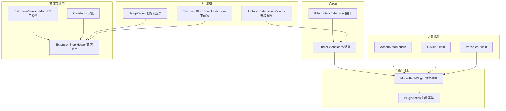
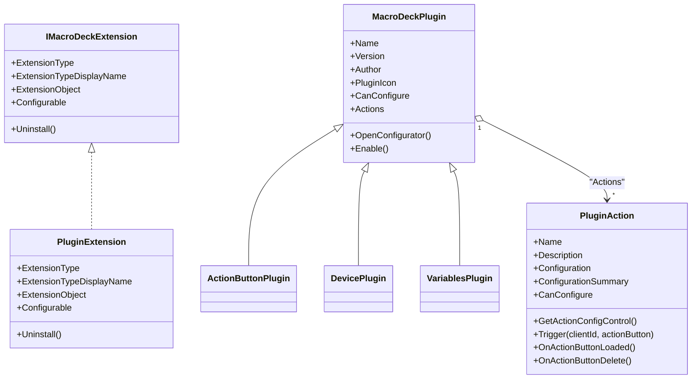
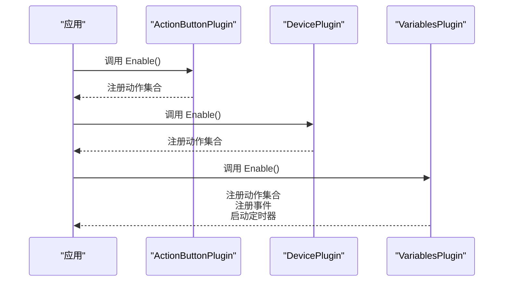
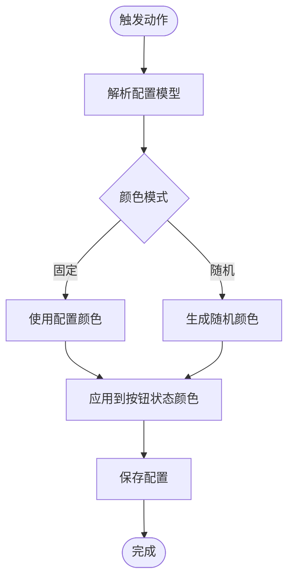
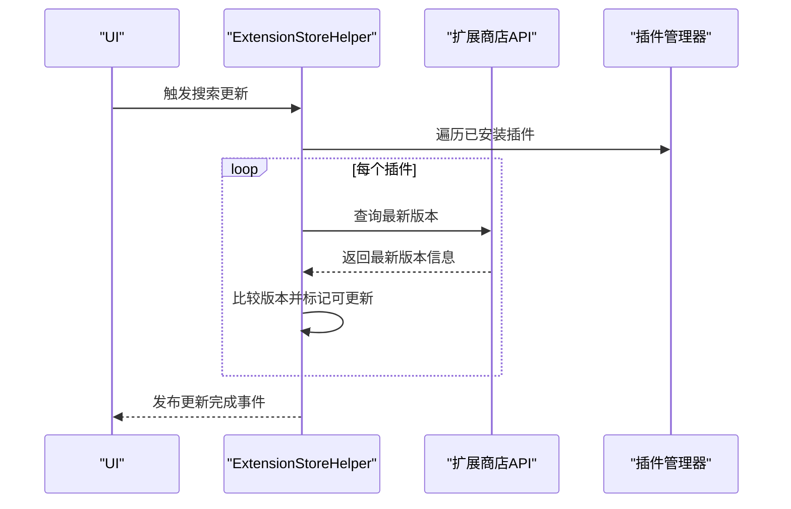
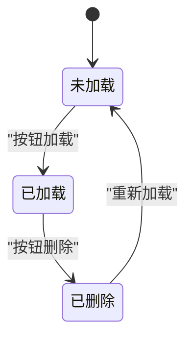
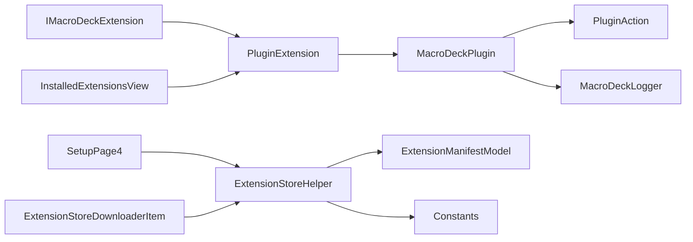

# 插件系统

<cite>
**本文引用的文件**
- [IMacroDeckExtension.cs](file://src/MacroDeck/Extension/IMacroDeckExtension.cs)
- [PluginExtension.cs](file://src/MacroDeck/Extension/PluginExtension.cs)
- [MacroDeckPlugin.cs](file://src/MacroDeck/Plugins/MacroDeckPlugin.cs)
- [ExtensionManifestModel.cs](file://src/MacroDeck/Models/ExtensionManifestModel.cs)
- [ExtensionStoreHelper.cs](file://src/MacroDeck/ExtensionStore/ExtensionStoreHelper.cs)
- [ActionButtonPlugin.cs](file://src/MacroDeck/InternalPlugins/ActionButtonPlugin/ActionButtonPlugin.cs)
- [DevicePlugin.cs](file://src/MacroDeck/InternalPlugins/DevicePlugin/DevicePlugin.cs)
- [VariablesPlugin.cs](file://src/MacroDeck/InternalPlugins/Variables/VariablesPlugin.cs)
- [ActionButtonSetBackgroundColorAction.cs](file://src/MacroDeck/InternalPlugins/ActionButtonPlugin/Actions/ActionButtonSetBackgroundColorAction.cs)
- [ChangeVariableValueActionConfigModel.cs](file://src/MacroDeck/InternalPlugins/Variables/Models/ChangeVariableValueActionConfigModel.cs)
- [ChangeVariableValueActionConfigViewModel.cs](file://src/MacroDeck/InternalPlugins/Variables/ViewModels/ChangeVariableValueActionConfigViewModel.cs)
- [ActionButton.cs](file://src/MacroDeck/ActionButton/ActionButton.cs)
- [MacroDeckLogger.cs](file://src/MacroDeck/Logging/MacroDeckLogger.cs)
- [Constants.cs](file://src/MacroDeck/Constants.cs)
- [Program.cs](file://src/MacroDeck/Program.cs)
- [SetupPage4.cs](file://src/MacroDeck/GUI/InitialSetupPages/SetupPage4.cs)
- [InstalledExtensionsView.cs](file://src/MacroDeck/GUI/CustomControls/ExtensionsView/InstalledExtensionsView.cs)
- [ExtensionStoreDownloaderItem.cs](file://src/MacroDeck/GUI/CustomControls/ExtensionStoreDownloader/ExtensionStoreDownloaderItem.cs)
- [ConditionAction.cs](file://src/MacroDeck/ActionButton/ConditionAction.cs)
</cite>

## 目录
1. [引言](#引言)
2. [项目结构](#项目结构)
3. [核心组件](#核心组件)
4. [架构总览](#架构总览)
5. [组件详解](#组件详解)
6. [依赖关系分析](#依赖关系分析)
7. [性能考量](#性能考量)
8. [故障排查指南](#故障排查指南)
9. [结论](#结论)
10. [附录：开发指南与最佳实践](#附录开发指南与最佳实践)

## 引言
本文件面向 Macro-Deck 插件系统的使用者与开发者，系统性阐述插件架构设计理念、插件生命周期管理、内置插件结构与功能、插件发现与版本管理、依赖处理、配置与参数校验、错误处理策略，并提供可操作的开发指南与最佳实践。目标是帮助用户正确安装、配置与使用插件，同时为插件开发者提供从环境搭建到打包发布的完整参考。

## 项目结构
插件系统围绕以下关键模块组织：
- 扩展接口与包装：定义统一扩展抽象与插件包装类
- 插件基类与动作模型：提供插件与动作的标准实现模板
- 内置插件：ActionButtonPlugin、DevicePlugin、VariablesPlugin
- 扩展清单与商店：扩展清单模型、扩展商店辅助工具
- UI 集成：扩展管理界面、初始设置向导、动作配置器
- 日志与异常：统一日志输出与异常捕获

图表来源
- [IMacroDeckExtension.cs:1-13](file://src/MacroDeck/Extension/IMacroDeckExtension.cs#L1-L13)
- [PluginExtension.cs:1-24](file://src/MacroDeck/Extension/PluginExtension.cs#L1-L24)
- [MacroDeckPlugin.cs:1-184](file://src/MacroDeck/Plugins/MacroDeckPlugin.cs#L1-L184)
- [ExtensionManifestModel.cs:1-61](file://src/MacroDeck/Models/ExtensionManifestModel.cs#L1-L61)
- [ExtensionStoreHelper.cs:1-195](file://src/MacroDeck/ExtensionStore/ExtensionStoreHelper.cs#L1-L195)
- [ActionButtonPlugin.cs:1-26](file://src/MacroDeck/InternalPlugins/ActionButtonPlugin/ActionButtonPlugin.cs#L1-L26)
- [DevicePlugin.cs:1-23](file://src/MacroDeck/InternalPlugins/DevicePlugin/DevicePlugin.cs#L1-L23)
- [VariablesPlugin.cs:1-319](file://src/MacroDeck/InternalPlugins/Variables/VariablesPlugin.cs#L1-L319)
- [InstalledExtensionsView.cs:42-81](file://src/MacroDeck/GUI/CustomControls/ExtensionsView/InstalledExtensionsView.cs#L42-L81)
- [SetupPage4.cs:18-92](file://src/MacroDeck/GUI/InitialSetupPages/SetupPage4.cs#L18-L92)
- [ExtensionStoreDownloaderItem.cs:167-210](file://src/MacroDeck/GUI/CustomControls/ExtensionStoreDownloader/ExtensionStoreDownloaderItem.cs#L167-L210)

章节来源
- [Program.cs:12-35](file://src/MacroDeck/Program.cs#L12-L35)
- [Constants.cs:5](file://src/MacroDeck/Constants.cs#L5)

## 核心组件
- IMacroDeckExtension：统一扩展抽象，暴露类型、显示名、对象实例、是否可配置、卸载等能力
- PluginExtension：将 MacroDeckPlugin 包装为扩展，自动识别可配置性
- MacroDeckPlugin：插件基类，提供名称、版本、作者、图标、可配置性、启用回调、动作集合等
- PluginAction：动作基类，提供绑定按钮、触发器、配置序列化、可配置性与配置控件等
- ExtensionManifestModel：扩展清单模型，描述扩展类型、名称、作者、仓库、包标识、版本、目标插件 API 版本、DLL 等
- ExtensionStoreHelper：扩展商店辅助工具，负责安装、更新检查、通知、下载流程协调

章节来源
- [IMacroDeckExtension.cs:5-12](file://src/MacroDeck/Extension/IMacroDeckExtension.cs#L5-L12)
- [PluginExtension.cs:7-23](file://src/MacroDeck/Extension/PluginExtension.cs#L7-L23)
- [MacroDeckPlugin.cs:9-65](file://src/MacroDeck/Plugins/MacroDeckPlugin.cs#L9-L65)
- [MacroDeckPlugin.cs:67-184](file://src/MacroDeck/Plugins/MacroDeckPlugin.cs#L67-L184)
- [ExtensionManifestModel.cs:8-60](file://src/MacroDeck/Models/ExtensionManifestModel.cs#L8-L60)
- [ExtensionStoreHelper.cs:17-195](file://src/MacroDeck/ExtensionStore/ExtensionStoreHelper.cs#L17-L195)

## 架构总览
插件系统采用“抽象接口 + 基类模板 + 内置插件 + 商店驱动”的分层设计。扩展通过 IMacroDeckExtension 统一对外；插件以 MacroDeckPlugin 为根，派生出具体插件；动作以 PluginAction 为根，承载业务逻辑；扩展清单与商店辅助工具负责版本与安装流程；UI 层负责展示与交互。

图表来源
- [IMacroDeckExtension.cs:5-12](file://src/MacroDeck/Extension/IMacroDeckExtension.cs#L5-L12)
- [PluginExtension.cs:7-23](file://src/MacroDeck/Extension/PluginExtension.cs#L7-L23)
- [MacroDeckPlugin.cs:9-65](file://src/MacroDeck/Plugins/MacroDeckPlugin.cs#L9-L65)
- [MacroDeckPlugin.cs:67-184](file://src/MacroDeck/Plugins/MacroDeckPlugin.cs#L67-L184)
- [ActionButtonPlugin.cs:10-25](file://src/MacroDeck/InternalPlugins/ActionButtonPlugin/ActionButtonPlugin.cs#L10-L25)
- [DevicePlugin.cs:7-22](file://src/MacroDeck/InternalPlugins/DevicePlugin/DevicePlugin.cs#L7-L22)
- [VariablesPlugin.cs:22-88](file://src/MacroDeck/InternalPlugins/Variables/VariablesPlugin.cs#L22-L88)

## 组件详解

### IMacroDeckExtension 与 PluginExtension
- IMacroDeckExtension 定义了扩展的最小契约，包括扩展类型、显示名、对象实例、是否可配置以及卸载方法
- PluginExtension 将 MacroDeckPlugin 包装为扩展，自动根据 CanConfigure 判断是否可配置，并在 UI 中呈现

章节来源
- [IMacroDeckExtension.cs:5-12](file://src/MacroDeck/Extension/IMacroDeckExtension.cs#L5-L12)
- [PluginExtension.cs:7-23](file://src/MacroDeck/Extension/PluginExtension.cs#L7-L23)

### 插件基类与动作模型（MacroDeckPlugin / PluginAction）
- MacroDeckPlugin 提供插件元数据（名称、版本、作者、图标）、可配置性、启用回调（Enable）以及动作集合
- PluginAction 提供动作元数据（名称、描述、配置、摘要）、可配置性、配置控件、触发器（Trigger），以及与 ActionButton 的生命周期绑定（加载/删除）

章节来源
- [MacroDeckPlugin.cs:9-65](file://src/MacroDeck/Plugins/MacroDeckPlugin.cs#L9-L65)
- [MacroDeckPlugin.cs:67-184](file://src/MacroDeck/Plugins/MacroDeckPlugin.cs#L67-L184)

### 内置插件：ActionButtonPlugin、DevicePlugin、VariablesPlugin
- ActionButtonPlugin：提供按钮状态切换、背景色设置等动作，Enable 时注册一组动作
- DevicePlugin：提供设备配置与亮度调节动作，Enable 时注册一组动作
- VariablesPlugin：提供变量变更事件、定时更新时间日期变量、变量读写文件动作，Enable 时注册动作并启动定时器

图表来源
- [ActionButtonPlugin.cs:15-24](file://src/MacroDeck/InternalPlugins/ActionButtonPlugin/ActionButtonPlugin.cs#L15-L24)
- [DevicePlugin.cs:14-21](file://src/MacroDeck/InternalPlugins/DevicePlugin/DevicePlugin.cs#L14-L21)
- [VariablesPlugin.cs:33-52](file://src/MacroDeck/InternalPlugins/Variables/VariablesPlugin.cs#L33-L52)

章节来源
- [ActionButtonPlugin.cs:10-25](file://src/MacroDeck/InternalPlugins/ActionButtonPlugin/ActionButtonPlugin.cs#L10-L25)
- [DevicePlugin.cs:7-22](file://src/MacroDeck/InternalPlugins/DevicePlugin/DevicePlugin.cs#L7-L22)
- [VariablesPlugin.cs:22-88](file://src/MacroDeck/InternalPlugins/Variables/VariablesPlugin.cs#L22-L88)

### 动作触发与配置（示例：背景色设置、变量变更）
- ActionButtonSetBackgroundColorAction：根据配置选择固定或随机颜色，设置按钮状态下的背景色，并保存配置
- ChangeVariableValueActionConfigModel/ViewModel：封装变量变更动作的配置模型与视图模型，支持序列化、摘要生成与保存

图表来源
- [ActionButtonSetBackgroundColorAction.cs:20-49](file://src/MacroDeck/InternalPlugins/ActionButtonPlugin/Actions/ActionButtonSetBackgroundColorAction.cs#L20-L49)

章节来源
- [ActionButtonSetBackgroundColorAction.cs:12-56](file://src/MacroDeck/InternalPlugins/ActionButtonPlugin/Actions/ActionButtonSetBackgroundColorAction.cs#L12-L56)
- [ChangeVariableValueActionConfigModel.cs:8-30](file://src/MacroDeck/InternalPlugins/Variables/Models/ChangeVariableValueActionConfigModel.cs#L8-L30)
- [ChangeVariableValueActionConfigViewModel.cs:39-90](file://src/MacroDeck/InternalPlugins/Variables/ViewModels/ChangeVariableValueActionConfigViewModel.cs#L39-L90)

### 插件发现与版本管理
- ExtensionManifestModel：定义扩展清单字段，包含扩展类型、名称、作者、仓库、包标识、版本、目标插件 API 版本、DLL 等，并提供从文件/ZIP/流反序列化的静态方法
- ExtensionStoreHelper：负责安装、批量更新检查、通知、下载流程协调；通过 API 查询最新版本并与已安装版本比较，决定是否提示更新

图表来源
- [ExtensionStoreHelper.cs:71-131](file://src/MacroDeck/ExtensionStore/ExtensionStoreHelper.cs#L71-L131)
- [ExtensionManifestModel.cs:32-60](file://src/MacroDeck/Models/ExtensionManifestModel.cs#L32-L60)
- [Constants.cs:5](file://src/MacroDeck/Constants.cs#L5)

章节来源
- [ExtensionManifestModel.cs:8-60](file://src/MacroDeck/Models/ExtensionManifestModel.cs#L8-L60)
- [ExtensionStoreHelper.cs:17-195](file://src/MacroDeck/ExtensionStore/ExtensionStoreHelper.cs#L17-L195)
- [Constants.cs:5](file://src/MacroDeck/Constants.cs#L5)

### 插件安装与卸载流程（UI 集成）
- ExtensionStoreDownloaderItem：根据扩展清单类型执行插件或图标包的安装，捕获异常并记录日志
- InstalledExtensionsView：构建扩展卡片，区分插件与图标包，标注可更新状态
- SetupPage4：初始设置中拉取可用插件列表，支持自动安装标记

```mermaid
sequenceDiagram
participant User as "用户"
participant UI as "ExtensionStoreDownloaderItem"
participant PM as "插件管理器"
participant IM as "图标包管理器"
User->>UI : 选择安装扩展
UI->>UI : 解析扩展清单
alt 类型=插件
UI->>PM : InstallPluginFromZip(zip)
PM-->>UI : 安装完成
else 类型=图标包
UI->>IM : InstallIconPackZip(zip)
IM-->>UI : 安装完成
end
UI-->>User : 完成并关闭对话框
```

图表来源
- [ExtensionStoreDownloaderItem.cs:167-210](file://src/MacroDeck/GUI/CustomControls/ExtensionStoreDownloader/ExtensionStoreDownloaderItem.cs#L167-L210)
- [InstalledExtensionsView.cs:44-78](file://src/MacroDeck/GUI/CustomControls/ExtensionsView/InstalledExtensionsView.cs#L44-L78)
- [SetupPage4.cs:18-92](file://src/MacroDeck/GUI/InitialSetupPages/SetupPage4.cs#L18-L92)

章节来源
- [ExtensionStoreDownloaderItem.cs:167-210](file://src/MacroDeck/GUI/CustomControls/ExtensionStoreDownloader/ExtensionStoreDownloaderItem.cs#L167-L210)
- [InstalledExtensionsView.cs:44-78](file://src/MacroDeck/GUI/CustomControls/ExtensionsView/InstalledExtensionsView.cs#L44-L78)
- [SetupPage4.cs:18-92](file://src/MacroDeck/GUI/InitialSetupPages/SetupPage4.cs#L18-L92)

### 插件生命周期与按钮绑定
- 插件启用：调用 Enable() 初始化动作集合
- 动作绑定：PluginAction 在按钮加载/删除时触发相应回调
- 变量绑定：ActionButton 根据绑定变量更新按钮状态

图表来源
- [MacroDeckPlugin.cs:59](file://src/MacroDeck/Plugins/MacroDeckPlugin.cs#L59)
- [MacroDeckPlugin.cs:105-114](file://src/MacroDeck/Plugins/MacroDeckPlugin.cs#L105-L114)
- [ActionButton.cs:55-107](file://src/MacroDeck/ActionButton/ActionButton.cs#L55-L107)

章节来源
- [MacroDeckPlugin.cs:59](file://src/MacroDeck/Plugins/MacroDeckPlugin.cs#L59)
- [MacroDeckPlugin.cs:105-114](file://src/MacroDeck/Plugins/MacroDeckPlugin.cs#L105-L114)
- [ActionButton.cs:55-107](file://src/MacroDeck/ActionButton/ActionButton.cs#L55-L107)

## 依赖关系分析
- 扩展接口与包装：IMacroDeckExtension 与 PluginExtension 作为 UI 与插件之间的适配层
- 插件与动作：MacroDeckPlugin 聚合 PluginAction，形成“插件-动作”树
- 商店与清单：ExtensionStoreHelper 依赖 ExtensionManifestModel 与常量中的 API 基地址进行版本查询与安装
- UI 集成：InstalledExtensionsView、SetupPage4、ExtensionStoreDownloaderItem 分别承担展示、初始设置与安装流程
- 日志：MacroDeckLogger 为插件提供统一日志入口，区分宿主与插件来源

图表来源
- [IMacroDeckExtension.cs:5-12](file://src/MacroDeck/Extension/IMacroDeckExtension.cs#L5-L12)
- [PluginExtension.cs:7-23](file://src/MacroDeck/Extension/PluginExtension.cs#L7-L23)
- [MacroDeckPlugin.cs:9-65](file://src/MacroDeck/Plugins/MacroDeckPlugin.cs#L9-L65)
- [ExtensionStoreHelper.cs:17-195](file://src/MacroDeck/ExtensionStore/ExtensionStoreHelper.cs#L17-L195)
- [ExtensionManifestModel.cs:8-60](file://src/MacroDeck/Models/ExtensionManifestModel.cs#L8-L60)
- [Constants.cs:5](file://src/MacroDeck/Constants.cs#L5)
- [InstalledExtensionsView.cs:44-78](file://src/MacroDeck/GUI/CustomControls/ExtensionsView/InstalledExtensionsView.cs#L44-L78)
- [SetupPage4.cs:18-92](file://src/MacroDeck/GUI/InitialSetupPages/SetupPage4.cs#L18-L92)
- [ExtensionStoreDownloaderItem.cs:167-210](file://src/MacroDeck/GUI/CustomControls/ExtensionStoreDownloader/ExtensionStoreDownloaderItem.cs#L167-L210)
- [MacroDeckLogger.cs:64-77](file://src/MacroDeck/Logging/MacroDeckLogger.cs#L64-L77)

章节来源
- [ExtensionStoreHelper.cs:17-195](file://src/MacroDeck/ExtensionStore/ExtensionStoreHelper.cs#L17-L195)
- [MacroDeckLogger.cs:64-77](file://src/MacroDeck/Logging/MacroDeckLogger.cs#L64-L77)

## 性能考量
- 定时器与事件：VariablesPlugin 启动定时器每秒更新时间/日期变量，注意避免高频率 IO 或重计算
- 文件读写：变量读写文件动作使用重试机制，建议控制文件路径与权限，减少磁盘压力
- UI 线程：安装流程通过主线程调度对话框，避免阻塞 UI
- 日志级别：通过 MacroDeckLogger 的日志级别开关降低生产环境日志开销

章节来源
- [VariablesPlugin.cs:44-82](file://src/MacroDeck/InternalPlugins/Variables/VariablesPlugin.cs#L44-L82)
- [ExtensionStoreDownloaderItem.cs:205-210](file://src/MacroDeck/GUI/CustomControls/ExtensionStoreDownloader/ExtensionStoreDownloaderItem.cs#L205-L210)
- [MacroDeckLogger.cs:15-49](file://src/MacroDeck/Logging/MacroDeckLogger.cs#L15-L49)

## 故障排查指南
- 安装失败：检查 ExtensionStoreDownloaderItem 的异常捕获与日志记录，确认 ZIP 包完整性与扩展清单类型
- 更新检查：确认 ExtensionStoreHelper 与 API 基地址配置，查看日志中“更新可用”提示
- 动作触发异常：检查 PluginAction 的 Trigger 实现与配置模型反序列化，确保必要字段存在
- 日志定位：使用 MacroDeckLogger 的插件上下文属性快速定位插件来源

章节来源
- [ExtensionStoreDownloaderItem.cs:178-187](file://src/MacroDeck/GUI/CustomControls/ExtensionStoreDownloader/ExtensionStoreDownloaderItem.cs#L178-L187)
- [ExtensionStoreHelper.cs:162-187](file://src/MacroDeck/ExtensionStore/ExtensionStoreHelper.cs#L162-L187)
- [MacroDeckLogger.cs:64-77](file://src/MacroDeck/Logging/MacroDeckLogger.cs#L64-L77)

## 结论
Macro-Deck 插件系统以清晰的抽象与标准模板支撑扩展生态，结合商店驱动的版本管理与 UI 集成，实现了从安装、配置到运行期事件的全链路闭环。内置插件展示了动作与事件的最佳实践，开发者可据此快速实现自定义插件并融入整体框架。

## 附录：开发指南与最佳实践

### 开发环境搭建
- 使用与项目一致的 .NET 版本与工程格式
- 引入必要的命名空间与依赖（如 JSON 序列化、日志、UI 控件等）
- 参考内置插件的目录结构与命名约定

章节来源
- [MacroDeckPlugin.cs:1-17](file://src/MacroDeck/Plugins/MacroDeckPlugin.cs#L1-L17)
- [ActionButtonPlugin.cs:1-10](file://src/MacroDeck/InternalPlugins/ActionButtonPlugin/ActionButtonPlugin.cs#L1-L10)

### 实现 IMacroDeckExtension 与插件包装
- 若需在扩展商店或 UI 中统一展示，实现 IMacroDeckExtension 并提供扩展类型与显示名
- 使用 PluginExtension 包装 MacroDeckPlugin，自动继承可配置性判断

章节来源
- [IMacroDeckExtension.cs:5-12](file://src/MacroDeck/Extension/IMacroDeckExtension.cs#L5-L12)
- [PluginExtension.cs:7-23](file://src/MacroDeck/Extension/PluginExtension.cs#L7-L23)

### 编写插件与动作
- 继承 MacroDeckPlugin，在 Enable 中初始化 Actions 列表
- 继承 PluginAction，实现 Name/Description/Trigger/CanConfigure/GetActionConfigControl
- 使用配置模型（ISerializableConfiguration）进行序列化与摘要生成

章节来源
- [MacroDeckPlugin.cs:59](file://src/MacroDeck/Plugins/MacroDeckPlugin.cs#L59)
- [MacroDeckPlugin.cs:105-114](file://src/MacroDeck/Plugins/MacroDeckPlugin.cs#L105-L114)
- [ChangeVariableValueActionConfigModel.cs:8-30](file://src/MacroDeck/InternalPlugins/Variables/Models/ChangeVariableValueActionConfigModel.cs#L8-L30)

### 配置管理与参数验证
- 在动作配置控件中进行输入校验，失败时返回 false 并记录日志
- 使用配置摘要（ConfigurationSummary）在按钮编辑器中直观展示当前配置
- 对外部资源（文件、网络）使用重试与异常捕获

章节来源
- [ChangeVariableValueActionConfigViewModel.cs:45-63](file://src/MacroDeck/InternalPlugins/Variables/ViewModels/ChangeVariableValueActionConfigViewModel.cs#L45-L63)
- [VariablesPlugin.cs:208-246](file://src/MacroDeck/InternalPlugins/Variables/VariablesPlugin.cs#L208-L246)

### 错误处理与日志
- 使用 MacroDeckLogger 输出结构化日志，区分宿主与插件来源
- 在关键流程（安装、更新、动作触发）捕获异常并记录

章节来源
- [MacroDeckLogger.cs:64-77](file://src/MacroDeck/Logging/MacroDeckLogger.cs#L64-L77)
- [ExtensionStoreDownloaderItem.cs:182-187](file://src/MacroDeck/GUI/CustomControls/ExtensionStoreDownloader/ExtensionStoreDownloaderItem.cs#L182-L187)

### 版本管理与依赖处理
- 在扩展清单中声明目标插件 API 版本，避免跨版本不兼容
- 使用 ExtensionStoreHelper 进行更新检查与批量更新

章节来源
- [ExtensionManifestModel.cs:22-23](file://src/MacroDeck/Models/ExtensionManifestModel.cs#L22-L23)
- [ExtensionStoreHelper.cs:71-131](file://src/MacroDeck/ExtensionStore/ExtensionStoreHelper.cs#L71-L131)

### 打包与发布
- 生成包含扩展清单与 DLL 的 ZIP 包
- 在扩展商店注册包 ID 与版本信息，确保 API 查询正常

章节来源
- [ExtensionManifestModel.cs:38-46](file://src/MacroDeck/Models/ExtensionManifestModel.cs#L38-L46)
- [ExtensionStoreHelper.cs:162-187](file://src/MacroDeck/ExtensionStore/ExtensionStoreHelper.cs#L162-L187)

### 用户使用指导
- 通过扩展管理界面查看已安装插件与可更新状态
- 在初始设置向导中一键安装推荐插件
- 在动作配置器中选择插件动作并配置参数

章节来源
- [InstalledExtensionsView.cs:44-78](file://src/MacroDeck/GUI/CustomControls/ExtensionsView/InstalledExtensionsView.cs#L44-L78)
- [SetupPage4.cs:18-92](file://src/MacroDeck/GUI/InitialSetupPages/SetupPage4.cs#L18-L92)
- [ConditionAction.cs:95-130](file://src/MacroDeck/ActionButton/ConditionAction.cs#L95-L130)