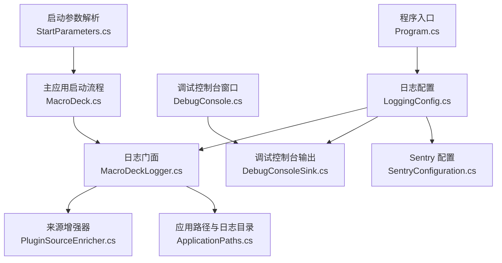
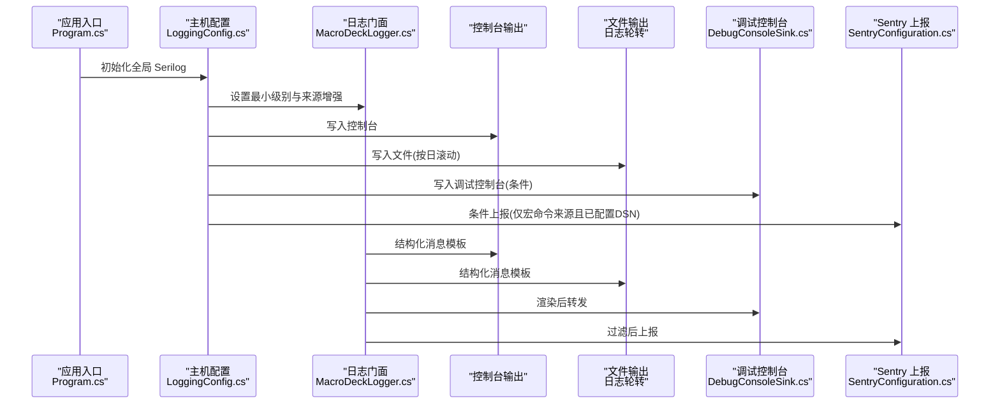
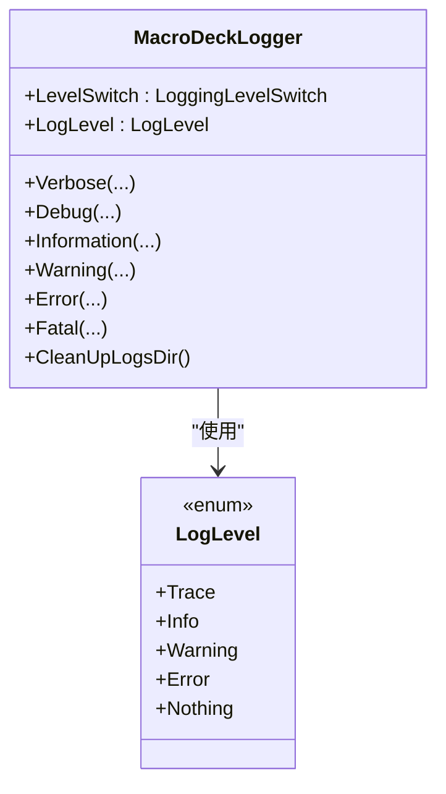
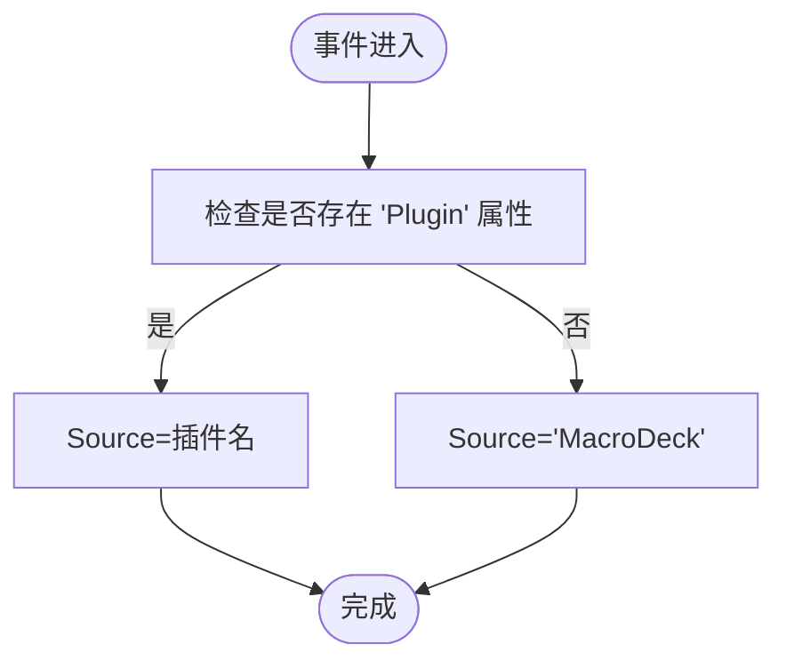
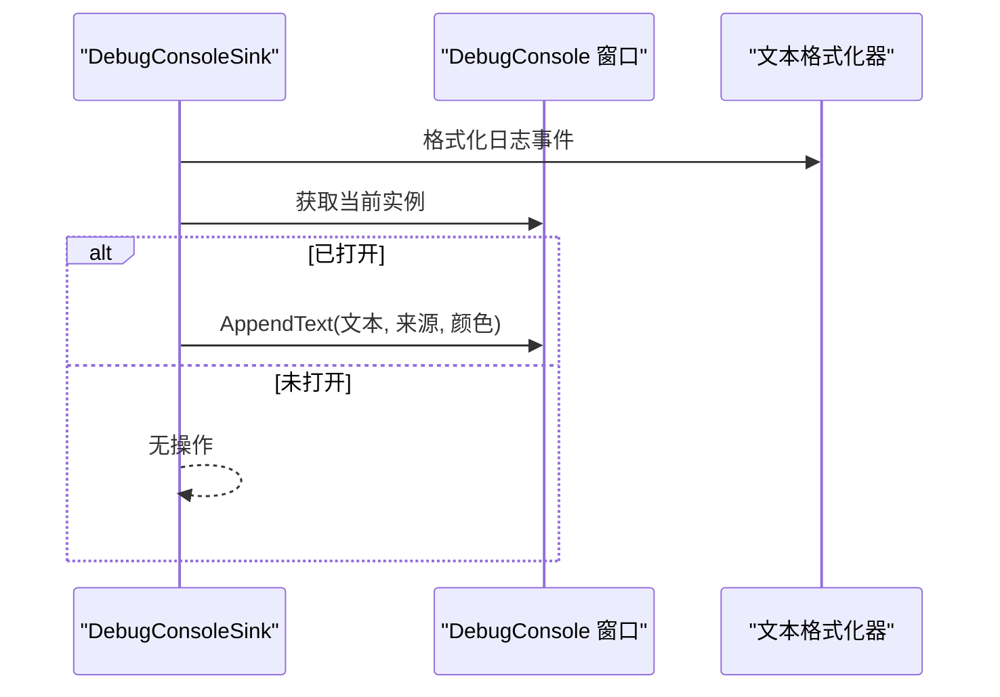
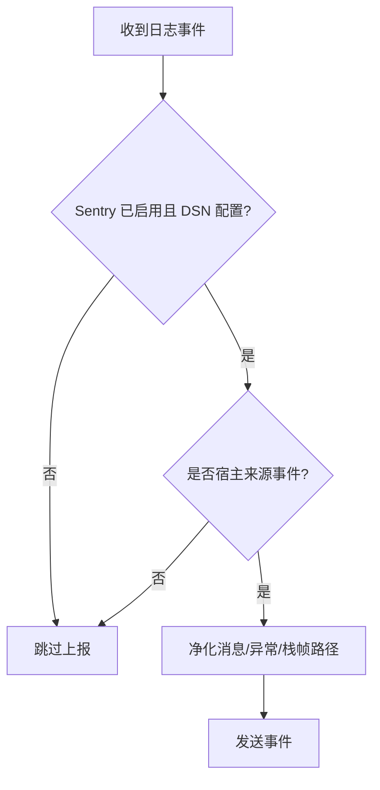
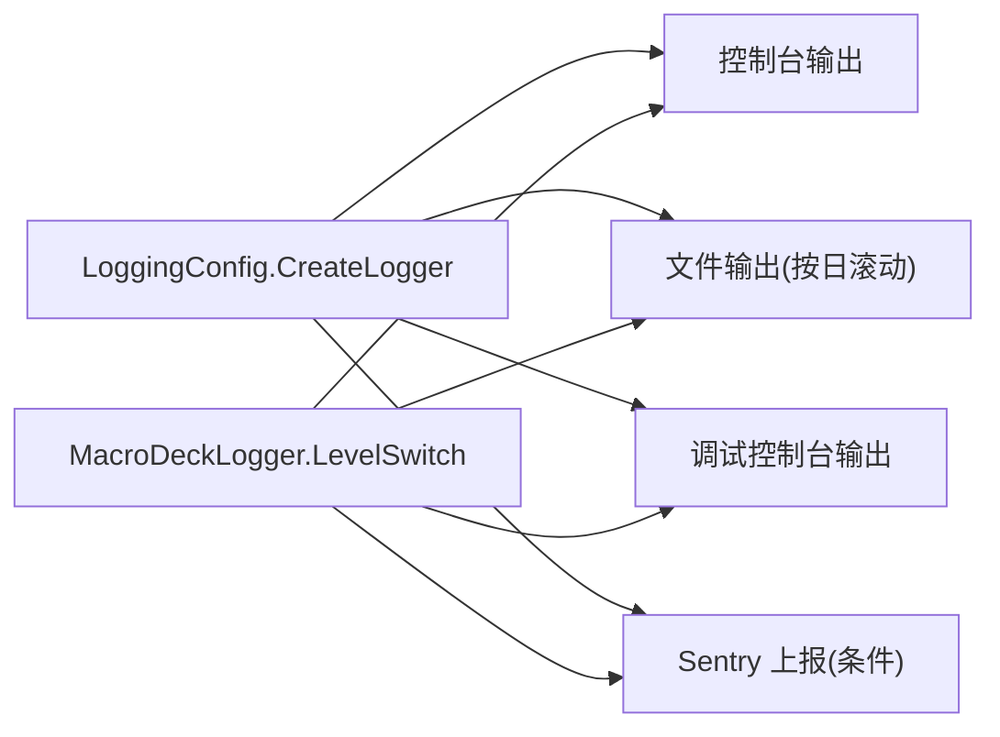
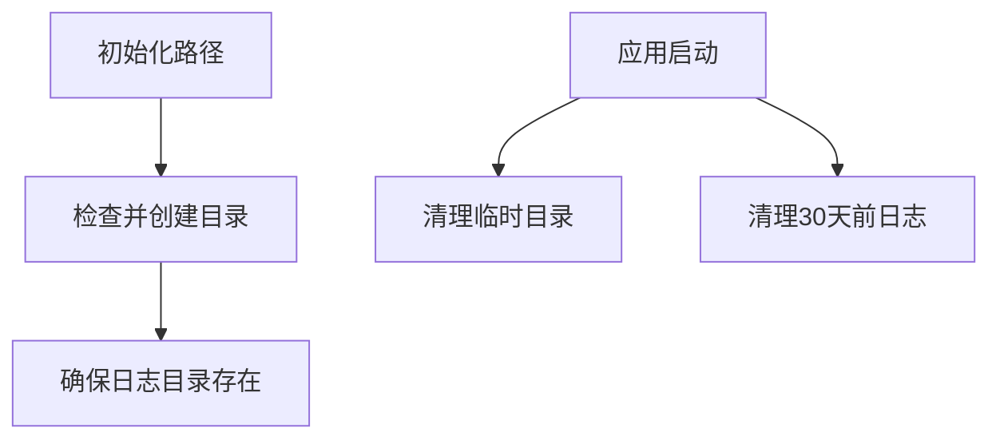
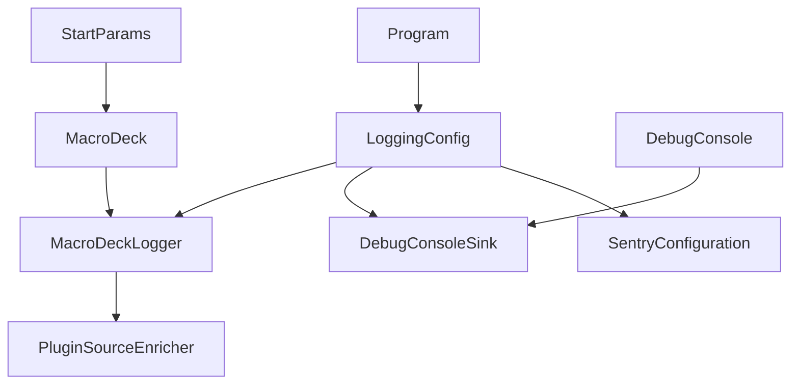

# 日志和监控

<cite>
**本文引用的文件**
- [MacroDeckLogger.cs](file://src/MacroDeck/Logging/MacroDeckLogger.cs)
- [DebugConsoleSink.cs](file://src/MacroDeck/Logging/DebugConsoleSink.cs)
- [SentryConfiguration.cs](file://src/MacroDeck/Logging/SentryConfiguration.cs)
- [PluginSourceEnricher.cs](file://src/MacroDeck/Logging/PluginSourceEnricher.cs)
- [LoggingConfig.cs](file://src/MacroDeck/StartupConfig/LoggingConfig.cs)
- [ApplicationPaths.cs](file://src/MacroDeck/StartupConfig/ApplicationPaths.cs)
- [DebugConsole.cs](file://src/MacroDeck/GUI/Dialogs/DebugConsole.cs)
- [Program.cs](file://src/MacroDeck/Program.cs)
- [MacroDeck.cs](file://src/MacroDeck/MacroDeck.cs)
- [StartParameters.cs](file://src/MacroDeck/StartupConfig/StartParameters.cs)
</cite>

## 更新摘要
**所做更改**
- 增强了集中式 Serilog 日志记录方法的文档描述
- 完善了错误跟踪系统的标准化指南
- 更新了开发者日志记录最佳实践章节
- 新增了启动参数对日志系统的影响说明
- 强化了日志轮转和清理策略的技术细节

## 目录
1. [简介](#简介)
2. [项目结构](#项目结构)
3. [核心组件](#核心组件)
4. [架构总览](#架构总览)
5. [组件详解](#组件详解)
6. [依赖关系分析](#依赖关系分析)
7. [性能与资源特性](#性能与资源特性)
8. [故障排查指南](#故障排查指南)
9. [结论](#结论)
10. [附录：最佳实践与用户报告指引](#附录最佳实践与用户报告指引)

## 简介
本文件面向开发者与高级用户，系统性阐述 Macro-Deck 的日志与监控体系，包括：
- 统一的集中式 Serilog 日志记录方法和错误跟踪系统
- 日志配置与 Serilog 管道构建
- 日志级别、格式化模板与输出目标
- 调试控制台 DebugConsoleSink 的实现与交互
- 日志轮转、归档与清理策略
- 错误跟踪与异常处理机制
- 日志与应用状态的关联
- 性能监控与诊断工具使用建议
- 开发者日志记录最佳实践与用户问题报告指引

## 项目结构
日志相关代码主要分布在以下模块：
- 启动与配置：启动时初始化全局 Serilog 记录器，定义最小日志级别与输出目标
- 日志门面：统一的日志 API 封装，支持插件来源标记与运行时级别调整
- 监控集成：Sentry 异常上报配置与过滤策略
- 输出目标：控制台、文件（含轮转）、调试控制台窗口
- 应用路径：日志目录与临时目录管理
- 启动参数：日志级别的命令行控制

**图表来源**
- [Program.cs:30-34](file://src/MacroDeck/Program.cs#L30-L34)
- [LoggingConfig.cs:21-49](file://src/MacroDeck/StartupConfig/LoggingConfig.cs#L21-L49)
- [MacroDeckLogger.cs:11-361](file://src/MacroDeck/Logging/MacroDeckLogger.cs#L11-L361)
- [DebugConsoleSink.cs:14-56](file://src/MacroDeck/Logging/DebugConsoleSink.cs#L14-L56)
- [SentryConfiguration.cs:7-138](file://src/MacroDeck/Logging/SentryConfiguration.cs#L7-L138)
- [PluginSourceEnricher.cs:12-32](file://src/MacroDeck/Logging/PluginSourceEnricher.cs#L12-L32)
- [ApplicationPaths.cs:64-102](file://src/MacroDeck/StartupConfig/ApplicationPaths.cs#L64-L102)
- [DebugConsole.cs:13-249](file://src/MacroDeck/GUI/Dialogs/DebugConsole.cs#L13-L249)
- [MacroDeck.cs:68-151](file://src/MacroDeck/MacroDeck.cs#L68-L151)
- [StartParameters.cs:26-31](file://src/MacroDeck/StartupConfig/StartParameters.cs#L26-L31)

**章节来源**
- [Program.cs:13-35](file://src/MacroDeck/Program.cs#L13-L35)
- [LoggingConfig.cs:21-49](file://src/MacroDeck/StartupConfig/LoggingConfig.cs#L21-L49)

## 核心组件
- **统一的日志门面与级别控制**
  - 提供统一的 Verbose/Debug/Information/Warning/Error/Fatal 接口
  - 支持带异常与插件来源的重载
  - 运行时通过 LoggingLevelSwitch 动态调整最小日志级别
  - 默认根据调试器附加状态选择 Trace 或 Info
- **来源增强器**
  - 为每条事件添加 Source 属性，区分 Macro Deck 自身与插件来源
- **调试控制台 Sink**
  - 将渲染后的事件转发到打开的调试控制台窗口
  - 无窗口时为"无操作"，可永久驻留于管道
- **Sentry 集成**
  - 仅上报符合白名单的 Macro Deck 自身事件
  - 去除敏感信息（用户名、用户路径等）
  - 可在配置中启用/禁用
- **集中式日志配置**
  - 控制台与文件双输出
  - 文件按天滚动，单文件上限约 50MB
  - 使用统一输出模板
- **应用路径与清理**
  - 统一的日志目录与临时目录
  - 定期清理 30 天前的日志文件

**章节来源**
- [MacroDeckLogger.cs:11-361](file://src/MacroDeck/Logging/MacroDeckLogger.cs#L11-L361)
- [PluginSourceEnricher.cs:12-32](file://src/MacroDeck/Logging/PluginSourceEnricher.cs#L12-L32)
- [DebugConsoleSink.cs:14-56](file://src/MacroDeck/Logging/DebugConsoleSink.cs#L14-L56)
- [SentryConfiguration.cs:7-138](file://src/MacroDeck/Logging/SentryConfiguration.cs#L7-L138)
- [LoggingConfig.cs:11-56](file://src/MacroDeck/StartupConfig/LoggingConfig.cs#L11-L56)
- [ApplicationPaths.cs:64-102](file://src/MacroDeck/StartupConfig/ApplicationPaths.cs#L64-L102)

## 架构总览
下图展示从应用启动到日志输出的关键路径，以及与 Sentry 和调试控制台的集成点。

**图表来源**
- [Program.cs:30-34](file://src/MacroDeck/Program.cs#L30-L34)
- [LoggingConfig.cs:21-49](file://src/MacroDeck/StartupConfig/LoggingConfig.cs#L21-L49)
- [MacroDeckLogger.cs:64-77](file://src/MacroDeck/Logging/MacroDeckLogger.cs#L64-L77)
- [DebugConsoleSink.cs:23-40](file://src/MacroDeck/Logging/DebugConsoleSink.cs#L23-L40)
- [SentryConfiguration.cs:38-56](file://src/MacroDeck/Logging/SentryConfiguration.cs#L38-L56)

## 组件详解

### 统一日志门面与级别控制（MacroDeckLogger）
- **设计要点**
  - 以静态类封装 Serilog 的调用，屏蔽底层细节
  - 通过 LoggingLevelSwitch 实现运行时动态调整
  - 按插件来源与宿主来源分别设置 SourceContext/Plugin 属性，便于 Sentry 白名单过滤与调试控制台筛选
- **关键行为**
  - 写入方法统一走 Write，内部根据是否传入插件决定上下文
  - 支持异常对象与结构化属性模板
  - 提供清理日志目录的方法（删除 30 天前文件）
  - 包含标准化的枚举级别定义，支持 Trace/Info/Warning/Error/Nothing

**图表来源**
- [MacroDeckLogger.cs:11-361](file://src/MacroDeck/Logging/MacroDeckLogger.cs#L11-L361)

**章节来源**
- [MacroDeckLogger.cs:11-361](file://src/MacroDeck/Logging/MacroDeckLogger.cs#L11-L361)

### 来源增强器（PluginSourceEnricher）
- **作用**
  - 为每条日志事件添加 Source 属性
  - 若事件来自插件（携带 Plugin 属性），则 Source 为插件名；否则为 "MacroDeck"
- **影响**
  - 与 Sentry 白名单配合，确保仅上报宿主来源事件
  - 为调试控制台提供筛选依据

**图表来源**
- [PluginSourceEnricher.cs:19-30](file://src/MacroDeck/Logging/PluginSourceEnricher.cs#L19-L30)

**章节来源**
- [PluginSourceEnricher.cs:12-32](file://src/MacroDeck/Logging/PluginSourceEnricher.cs#L12-L32)

### 调试控制台 Sink（DebugConsoleSink）
- **作用**
  - 将渲染后的日志文本转发给当前打开的调试控制台窗口
  - 未打开窗口时不产生任何副作用
  - 根据日志级别着色显示
- **与 UI 的协作**
  - 调试控制台窗口负责过滤、保存导出、打开日志目录等

**图表来源**
- [DebugConsoleSink.cs:23-40](file://src/MacroDeck/Logging/DebugConsoleSink.cs#L23-L40)
- [DebugConsole.cs:75-123](file://src/MacroDeck/GUI/Dialogs/DebugConsole.cs#L75-L123)

**章节来源**
- [DebugConsoleSink.cs:14-56](file://src/MacroDeck/Logging/DebugConsoleSink.cs#L14-L56)
- [DebugConsole.cs:13-249](file://src/MacroDeck/GUI/Dialogs/DebugConsole.cs#L13-L249)

### Sentry 配置（SentryConfiguration）
- **上报范围**
  - 仅上报宿主来源事件（通过 SourceContext 白名单）
  - 仅当 DSN 已配置时启用
- **数据净化**
  - 移除用户名与用户路径等敏感信息
  - 对消息、异常栈帧中的文件名/绝对路径进行脱敏
- **运行时开关**
  - 可通过配置项启用/禁用

**图表来源**
- [SentryConfiguration.cs:38-56](file://src/MacroDeck/Logging/SentryConfiguration.cs#L38-L56)
- [SentryConfiguration.cs:117-136](file://src/MacroDeck/Logging/SentryConfiguration.cs#L117-L136)

**章节来源**
- [SentryConfiguration.cs:7-138](file://src/MacroDeck/Logging/SentryConfiguration.cs#L7-L138)

### 集中式日志配置（LoggingConfig）
- **输出目标**
  - 控制台：ANSI 主题，统一输出模板
  - 文件：按日滚动，单文件上限约 50MB，模板一致
  - 调试控制台：条件输出
  - Sentry：条件输出（仅宿主来源且 DSN 配置）
- **最小级别**
  - 由 MacroDeckLogger.LevelSwitch 控制
  - 对第三方命名空间设置默认覆盖级别（如 Microsoft、System）

**图表来源**
- [LoggingConfig.cs:21-49](file://src/MacroDeck/StartupConfig/LoggingConfig.cs#L21-L49)
- [MacroDeckLogger.cs:21](file://src/MacroDeck/Logging/MacroDeckLogger.cs#L21)

**章节来源**
- [LoggingConfig.cs:11-56](file://src/MacroDeck/StartupConfig/LoggingConfig.cs#L11-L56)

### 应用路径与清理（ApplicationPaths）
- **日志目录**
  - 统一在用户数据目录下的 logs 子目录
  - 启动时自动创建
- **临时目录清理**
  - 启动时清空临时文件与子目录
- **日志清理**
  - 宏命令启动时调用清理方法，删除 30 天前的日志文件

**图表来源**
- [ApplicationPaths.cs:64-102](file://src/MacroDeck/StartupConfig/ApplicationPaths.cs#L64-L102)
- [ApplicationPaths.cs:104-141](file://src/MacroDeck/StartupConfig/ApplicationPaths.cs#L104-L141)
- [MacroDeckLogger.cs:318-331](file://src/MacroDeck/Logging/MacroDeckLogger.cs#L318-L331)

**章节来源**
- [ApplicationPaths.cs:6-143](file://src/MacroDeck/StartupConfig/ApplicationPaths.cs#L6-L143)
- [MacroDeckLogger.cs:318-331](file://src/MacroDeck/Logging/MacroDeckLogger.cs#L318-L331)

### 启动参数对日志系统的影响（StartParameters）
- **日志级别控制**
  - 通过 --log-level 参数设置运行时日志级别
  - 支持 Trace/Info/Warning/Error/Nothing 级别
- **调试控制台启动**
  - 通过 --debug-console 参数启动调试控制台
- **文件日志禁用**
  - 通过 --disable-file-logging 参数禁用文件日志输出

**章节来源**
- [StartParameters.cs:26-31](file://src/MacroDeck/StartupConfig/StartParameters.cs#L26-L31)
- [MacroDeck.cs:73-81](file://src/MacroDeck/MacroDeck.cs#L73-L81)

## 依赖关系分析
- **组件耦合**
  - MacroDeckLogger 依赖 Serilog、LoggingLevelSwitch、ApplicationPaths
  - DebugConsoleSink 依赖 Serilog 文本格式化器与 DebugConsole 窗口
  - SentryConfiguration 依赖 Sentry.Serilog 与 Serilog 事件模型
  - LoggingConfig 组合上述组件并作为全局 Logger 的工厂
- **关键依赖链**
  - Program 在启动早期设置全局 Log.Logger
  - MacroDeck 在启动流程中读取参数、启动调试控制台、执行清理与初始化
  - DebugConsole 与 MacroDeckLogger 协作实现运行时级别调整与过滤
  - StartParameters 为日志系统提供外部控制接口

**图表来源**
- [Program.cs:30-34](file://src/MacroDeck/Program.cs#L30-L34)
- [LoggingConfig.cs:21-49](file://src/MacroDeck/StartupConfig/LoggingConfig.cs#L21-L49)
- [MacroDeck.cs:68-151](file://src/MacroDeck/MacroDeck.cs#L68-L151)
- [DebugConsole.cs:27-40](file://src/MacroDeck/GUI/Dialogs/DebugConsole.cs#L27-L40)
- [StartParameters.cs:36-55](file://src/MacroDeck/StartupConfig/StartParameters.cs#L36-L55)

**章节来源**
- [Program.cs:13-35](file://src/MacroDeck/Program.cs#L13-L35)
- [MacroDeck.cs:68-151](file://src/MacroDeck/MacroDeck.cs#L68-L151)

## 性能与资源特性
- **日志级别与开销**
  - 运行时动态调整最小级别，避免在高负载场景输出冗余日志
  - 对第三方框架命名空间设置较高阈值，降低噪音
- **文件轮转**
  - 按日滚动，单文件上限约 50MB，平衡磁盘占用与单文件可读性
- **调试控制台**
  - 仅在窗口打开时转发，避免后台无谓 IO
  - 文本追加采用 UI 线程安全调用，保证响应性
- **Sentry**
  - 仅上报错误及以上级别，且限定来源，减少网络与存储压力
- **内存优化**
  - 使用静态类和单例模式减少内存分配
  - 条件输出机制避免不必要的序列化开销

## 故障排查指南
- **无法看到调试输出**
  - 确认已通过启动参数或界面开启调试控制台
  - 检查过滤器是否限制了来源
- **日志文件未生成或过大**
  - 检查日志目录权限与磁盘空间
  - 观察滚动策略与文件大小限制
- **异常未上报**
  - 确认 DSN 是否已注入
  - 检查是否为插件来源事件（插件事件不会上报）
  - 确认 Sentry 开关状态
- **启动缓慢**
  - 适当提高最小日志级别
  - 关闭调试控制台窗口
  - 检查第三方框架日志级别覆盖是否合理
- **日志级别不生效**
  - 检查启动参数 --log-level 是否正确设置
  - 确认运行时是否通过界面修改了日志级别

**章节来源**
- [DebugConsole.cs:61-123](file://src/MacroDeck/GUI/Dialogs/DebugConsole.cs#L61-L123)
- [LoggingConfig.cs:26-31](file://src/MacroDeck/StartupConfig/LoggingConfig.cs#L26-L31)
- [SentryConfiguration.cs:19-41](file://src/MacroDeck/Logging/SentryConfiguration.cs#L19-L41)
- [StartParameters.cs:26-31](file://src/MacroDeck/StartupConfig/StartParameters.cs#L26-L31)

## 结论
Macro-Deck 的日志与监控体系以 Serilog 为核心，结合运行时级别切换、来源增强、条件输出与 Sentry 白名单过滤，实现了清晰、可控且可诊断的日志生态。统一的集中式日志记录方法确保了整个应用的一致性和可维护性。调试控制台为开发与用户自助排障提供了直观入口；文件轮转与定期清理保障了长期运行的稳定性。建议在生产环境保持较高最小级别，并谨慎开启调试输出与 Sentry 上报。

## 附录：最佳实践与用户报告指引

### 开发者最佳实践
- **统一门面接口使用**
  - 使用 MacroDeckLogger 提供的所有日志方法，优先传递结构化属性模板
  - 明确事件来源：宿主事件与插件事件应有清晰区分
- **日志级别策略**
  - 避免在高频路径中输出大量低价值日志
  - 使用运行时级别调整能力，在问题定位阶段临时提升级别
  - 合理使用 Trace/Debug/Information/Warning/Error/Fatal 级别
- **敏感信息处理**
  - 对敏感信息进行脱敏处理，遵循最小披露原则
  - 避免在日志中记录密码、令牌等敏感数据
- **插件开发规范**
  - 插件应始终传入插件实例作为来源参数
  - 遵循统一的日志格式和结构化属性命名约定

### 用户问题报告指引
- **调试输出收集**
  - 打开调试控制台，复现问题并捕获日志
  - 设置合适的日志级别与来源过滤
  - 导出调试输出并附带关键上下文（版本、参数、操作步骤）
- **异常报告流程**
  - 如涉及崩溃或错误，确认 Sentry 是否已启用并上传相关事件
  - 提供完整的异常堆栈信息和上下文数据
  - 包含系统环境信息和相关配置详情
- **日志分析建议**
  - 使用调试控制台的过滤功能快速定位问题
  - 关注错误级别日志和异常堆栈信息
  - 检查时间戳和来源标识以理解事件顺序

### 启动参数使用指南
- **日志级别控制**
  - --log-level 0: 默认级别（调试器附加时为 Trace，否则为 Info）
  - --log-level 1: Trace - 记录所有级别日志
  - --log-level 2: Info - 记录信息、警告和错误
  - --log-level 3: Warning - 记录警告和错误
  - --log-level 4: Error - 仅记录错误
  - --log-level 100: Nothing - 不记录任何日志
- **调试控制台启动**
  - --debug-console: 启动时自动打开调试控制台窗口
- **文件日志管理**
  - --disable-file-logging: 禁用文件日志输出，仅保留控制台输出

**章节来源**
- [DebugConsole.cs:188-216](file://src/MacroDeck/GUI/Dialogs/DebugConsole.cs#L188-L216)
- [MacroDeck.cs:88](file://src/MacroDeck/MacroDeck.cs#L88)
- [StartParameters.cs:26-31](file://src/MacroDeck/StartupConfig/StartParameters.cs#L26-L31)