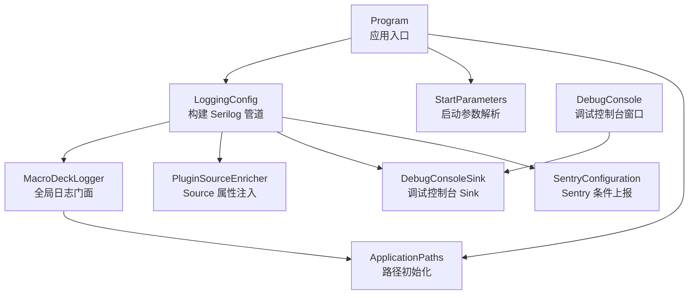
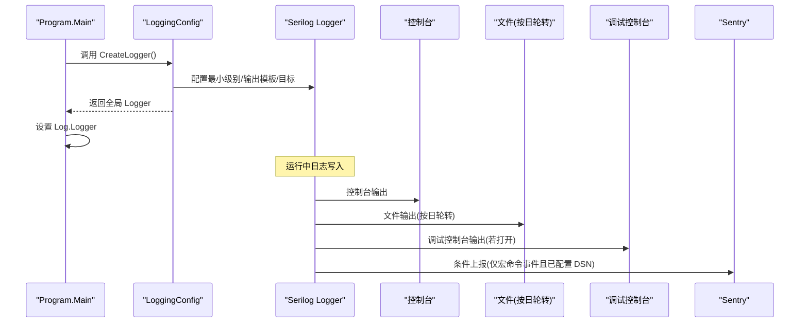
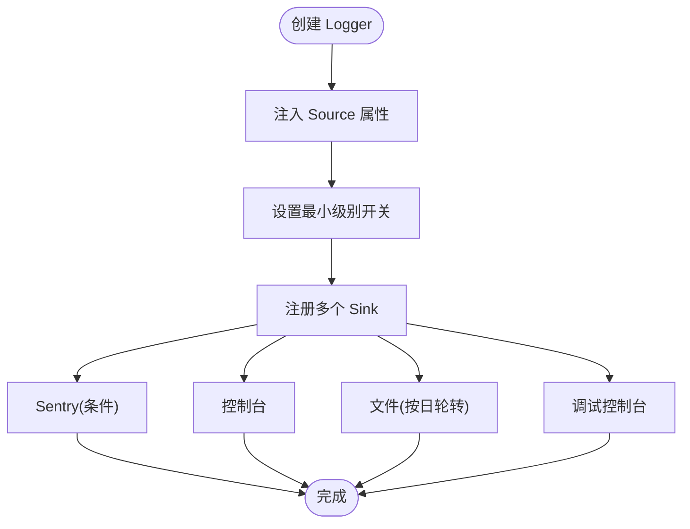
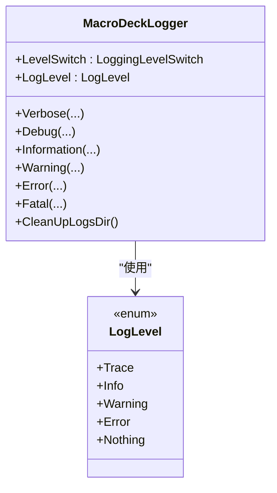
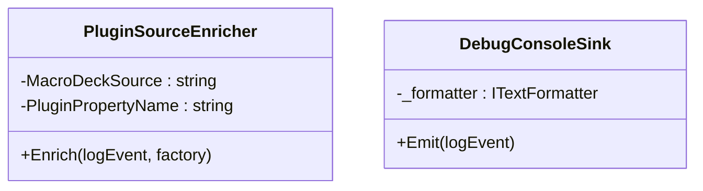
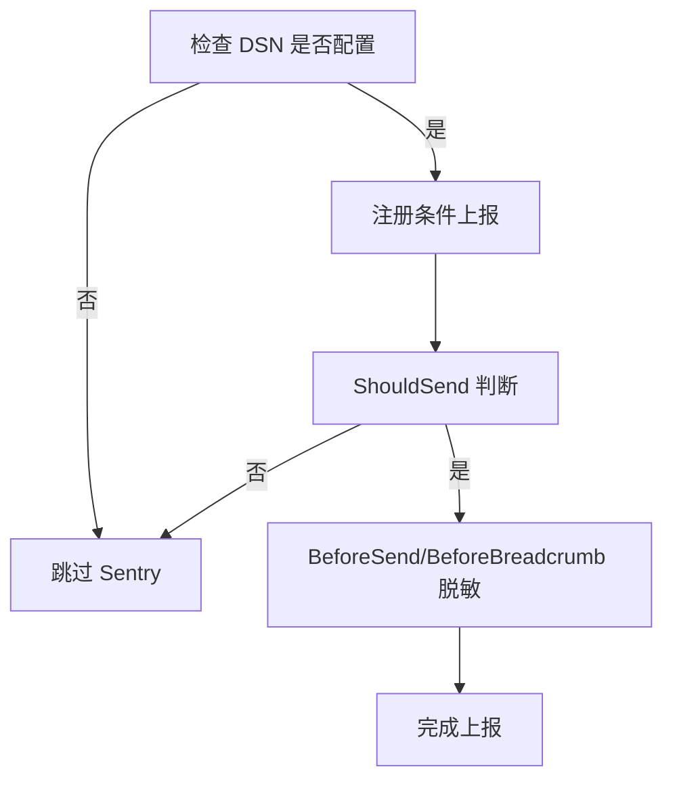
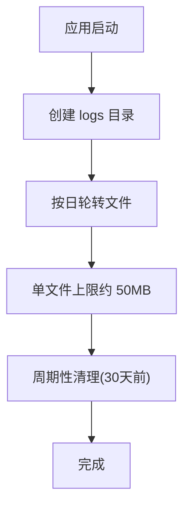
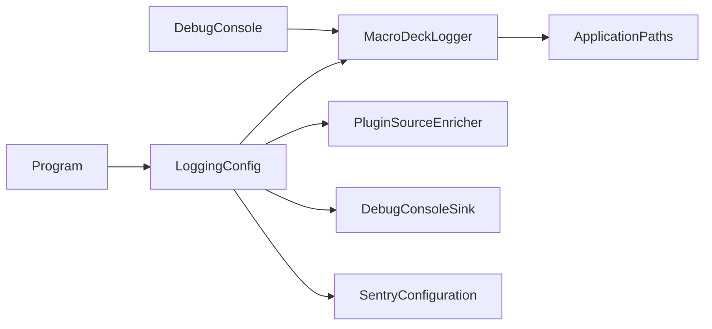

# 日志配置

<cite>
**本文引用的文件**
- [MacroDeckLogger.cs](file://src/MacroDeck/Logging/MacroDeckLogger.cs)
- [SentryConfiguration.cs](file://src/MacroDeck/Logging/SentryConfiguration.cs)
- [LoggingConfig.cs](file://src/MacroDeck/StartupConfig/LoggingConfig.cs)
- [Program.cs](file://src/MacroDeck/Program.cs)
- [StartParameters.cs](file://src/MacroDeck/StartupConfig/StartParameters.cs)
- [ApplicationPaths.cs](file://src/MacroDeck/StartupConfig/ApplicationPaths.cs)
- [DebugConsoleSink.cs](file://src/MacroDeck/Logging/DebugConsoleSink.cs)
- [PluginSourceEnricher.cs](file://src/MacroDeck/Logging/PluginSourceEnricher.cs)
- [DebugConsole.cs](file://src/MacroDeck/GUI/Dialogs/DebugConsole.cs)
</cite>

## 目录
1. [简介](#简介)
2. [项目结构](#项目结构)
3. [核心组件](#核心组件)
4. [架构总览](#架构总览)
5. [组件详解](#组件详解)
6. [依赖关系分析](#依赖关系分析)
7. [性能与容量规划](#性能与容量规划)
8. [故障排除指南](#故障排除指南)
9. [结论](#结论)
10. [附录：启动参数与配置项](#附录启动参数与配置项)

## 简介
本文件系统性梳理 Macro-Deck 的日志配置体系，围绕 Serilog 的集成与配置展开，覆盖日志级别、输出格式、目标（Sink）配置、日志管道构建、MacroDeckLogger 全局日志管理、Sentry 错误上报、日志轮转与清理策略，以及启动参数中的日志相关选项。文档同时提供最佳实践与排障建议，帮助开发者在开发与生产环境中高效地使用与维护日志系统。

## 项目结构
日志相关代码主要分布在以下模块：
- 启动与入口：Program 负责初始化路径与构建全局 Logger；启动参数解析由 StartParameters 提供。
- 日志配置：LoggingConfig 组装 Serilog 管道，定义输出模板、最小级别、目标（控制台、文件、调试控制台、Sentry）。
- 日志门面：MacroDeckLogger 封装统一的日志 API，并通过 LevelSwitch 实现运行时可调的日志级别。
- 扩展与增强：PluginSourceEnricher 为事件添加 Source 属性；DebugConsoleSink 将日志转发到内置调试控制台。
- 上报与隐私：SentryConfiguration 提供 Sentry 集成、条件上报与数据脱敏。
- 路径与清理：ApplicationPaths 定义日志目录；MacroDeckLogger 内置 30 天自动清理逻辑。

**图表来源**
- [Program.cs:30-34](file://src/MacroDeck/Program.cs#L30-L34)
- [LoggingConfig.cs:21-49](file://src/MacroDeck/StartupConfig/LoggingConfig.cs#L21-L49)
- [MacroDeckLogger.cs:11-361](file://src/MacroDeck/Logging/MacroDeckLogger.cs#L11-L361)
- [PluginSourceEnricher.cs:12-31](file://src/MacroDeck/Logging/PluginSourceEnricher.cs#L12-L31)
- [DebugConsoleSink.cs:14-55](file://src/MacroDeck/Logging/DebugConsoleSink.cs#L14-L55)
- [SentryConfiguration.cs:7-138](file://src/MacroDeck/Logging/SentryConfiguration.cs#L7-L138)
- [ApplicationPaths.cs:36-61](file://src/MacroDeck/StartupConfig/ApplicationPaths.cs#L36-L61)

**章节来源**
- [Program.cs:13-35](file://src/MacroDeck/Program.cs#L13-L35)
- [LoggingConfig.cs:21-49](file://src/MacroDeck/StartupConfig/LoggingConfig.cs#L21-L49)
- [ApplicationPaths.cs:36-61](file://src/MacroDeck/StartupConfig/ApplicationPaths.cs#L36-L61)

## 核心组件
- Serilog 管道构建器：集中于 LoggingConfig.CreateLogger，负责最小级别控制、输出模板、目标注册与条件上报。
- MacroDeckLogger：统一日志 API，封装结构化消息模板、异常、插件上下文，并通过 LevelSwitch 实现运行时级别调整。
- PluginSourceEnricher：为每条日志注入 Source 属性，区分宏命令自身与插件来源。
- DebugConsoleSink：将渲染后的日志写入内置调试控制台窗口，无窗口时为无操作。
- SentryConfiguration：基于 DSN 的 Sentry 集成，仅上报符合条件的宏命令事件并进行数据脱敏。
- ApplicationPaths：定义日志目录等应用路径，确保目录存在。
- DebugConsole：提供日志查看与导出能力，支持从 UI 调整日志级别。

**章节来源**
- [LoggingConfig.cs:21-49](file://src/MacroDeck/StartupConfig/LoggingConfig.cs#L21-L49)
- [MacroDeckLogger.cs:11-361](file://src/MacroDeck/Logging/MacroDeckLogger.cs#L11-L361)
- [PluginSourceEnricher.cs:12-31](file://src/MacroDeck/Logging/PluginSourceEnricher.cs#L12-L31)
- [DebugConsoleSink.cs:14-55](file://src/MacroDeck/Logging/DebugConsoleSink.cs#L14-L55)
- [SentryConfiguration.cs:7-138](file://src/MacroDeck/Logging/SentryConfiguration.cs#L7-L138)
- [ApplicationPaths.cs:36-61](file://src/MacroDeck/StartupConfig/ApplicationPaths.cs#L36-L61)
- [DebugConsole.cs:188-194](file://src/MacroDeck/GUI/Dialogs/DebugConsole.cs#L188-L194)

## 架构总览
下图展示日志从应用启动到最终输出的关键流程与组件交互：

**图表来源**
- [Program.cs:30-34](file://src/MacroDeck/Program.cs#L30-L34)
- [LoggingConfig.cs:21-49](file://src/MacroDeck/StartupConfig/LoggingConfig.cs#L21-L49)
- [DebugConsoleSink.cs:23-40](file://src/MacroDeck/Logging/DebugConsoleSink.cs#L23-L40)
- [SentryConfiguration.cs:42-46](file://src/MacroDeck/Logging/SentryConfiguration.cs#L42-L46)

## 组件详解

### Serilog 管道构建与目标配置
- 输出模板：统一使用包含时间戳、级别、来源、消息与异常的模板，便于人类阅读与自动化处理。
- 最小级别控制：通过 MacroDeckLogger.LevelSwitch 动态调整；同时对第三方命名空间设置默认级别覆盖，降低噪音。
- 目标配置：
  - 控制台：彩色主题输出，便于终端查看。
  - 文件：按日轮转，单文件上限约 50MB；日志文件位于用户目录下的 logs 子目录。
  - 调试控制台：仅当调试控制台窗口打开时转发日志，避免无意义 IO。
  - Sentry：条件注册，仅在 CI/CD 注入真实 DSN 时启用；仅上报宏命令自身事件并进行脱敏。

**图表来源**
- [LoggingConfig.cs:21-49](file://src/MacroDeck/StartupConfig/LoggingConfig.cs#L21-L49)
- [PluginSourceEnricher.cs:19-30](file://src/MacroDeck/Logging/PluginSourceEnricher.cs#L19-L30)
- [MacroDeckLogger.cs:21](file://src/MacroDeck/Logging/MacroDeckLogger.cs#L21)
- [DebugConsoleSink.cs:23-40](file://src/MacroDeck/Logging/DebugConsoleSink.cs#L23-L40)
- [SentryConfiguration.cs:42-46](file://src/MacroDeck/Logging/SentryConfiguration.cs#L42-L46)

**章节来源**
- [LoggingConfig.cs:13-49](file://src/MacroDeck/StartupConfig/LoggingConfig.cs#L13-L49)
- [ApplicationPaths.cs:55](file://src/MacroDeck/StartupConfig/ApplicationPaths.cs#L55)

### MacroDeckLogger：全局日志门面与运行时级别
- 结构化日志 API：提供 Verbose/Debug/Information/Warning/Error/Fatal 等方法族，支持传入异常与插件上下文。
- 上下文注入：宏命令事件注入 SourceContext 以满足 Sentry 白名单；插件事件注入 Plugin 属性并排除 Sentry 上报。
- 运行时级别：通过 LevelSwitch 与内部 LogLevel 枚举映射到 Serilog 的 LogEventLevel，支持动态调整并在 UI 中生效。

**图表来源**
- [MacroDeckLogger.cs:11-361](file://src/MacroDeck/Logging/MacroDeckLogger.cs#L11-L361)

**章节来源**
- [MacroDeckLogger.cs:15-35](file://src/MacroDeck/Logging/MacroDeckLogger.cs#L15-L35)
- [MacroDeckLogger.cs:334-360](file://src/MacroDeck/Logging/MacroDeckLogger.cs#L334-L360)

### 插件来源增强器与调试控制台 Sink
- PluginSourceEnricher：根据是否存在 Plugin 属性决定来源名称，保证 UI 层 Source 字段准确显示。
- DebugConsoleSink：在调试控制台窗口打开时将渲染后的文本追加到窗口，颜色按级别区分；未打开时无副作用。

**图表来源**
- [PluginSourceEnricher.cs:12-31](file://src/MacroDeck/Logging/PluginSourceEnricher.cs#L12-L31)
- [DebugConsoleSink.cs:14-55](file://src/MacroDeck/Logging/DebugConsoleSink.cs#L14-L55)

**章节来源**
- [PluginSourceEnricher.cs:19-30](file://src/MacroDeck/Logging/PluginSourceEnricher.cs#L19-L30)
- [DebugConsoleSink.cs:23-40](file://src/MacroDeck/Logging/DebugConsoleSink.cs#L23-L40)

### Sentry 集成：条件上报与隐私保护
- DSN 配置：通过常量占位符在 CI/CD 注入真实 DSN；未配置时不注册 Sentry。
- 上报条件：仅上报宏命令自身事件（非插件），并过滤掉不符合 SourceContext 命名空间的事件。
- 隐私保护：在 BeforeSend 与 BeforeBreadcrumb 中对消息、堆栈帧文件名与路径、面包屑数据进行脱敏，替换用户资料路径与用户名。

**图表来源**
- [SentryConfiguration.cs:21-41](file://src/MacroDeck/Logging/SentryConfiguration.cs#L21-L41)
- [SentryConfiguration.cs:38-56](file://src/MacroDeck/Logging/SentryConfiguration.cs#L38-L56)
- [SentryConfiguration.cs:58-115](file://src/MacroDeck/Logging/SentryConfiguration.cs#L58-L115)

**章节来源**
- [SentryConfiguration.cs:23-36](file://src/MacroDeck/Logging/SentryConfiguration.cs#L23-L36)
- [SentryConfiguration.cs:42-56](file://src/MacroDeck/Logging/SentryConfiguration.cs#L42-L56)
- [SentryConfiguration.cs:117-136](file://src/MacroDeck/Logging/SentryConfiguration.cs#L117-L136)

### 日志轮转、归档与清理策略
- 轮转与大小限制：文件 Sink 使用按日轮转与约 50MB 单文件上限，避免日志无限增长。
- 自动清理：MacroDeckLogger 内置 30 天前日志删除逻辑，定期清理旧文件。
- 目录管理：ApplicationPaths 在首次启动时创建 logs 目录，确保日志文件可写。

**图表来源**
- [ApplicationPaths.cs:64-102](file://src/MacroDeck/StartupConfig/ApplicationPaths.cs#L64-L102)
- [LoggingConfig.cs:34-37](file://src/MacroDeck/StartupConfig/LoggingConfig.cs#L34-L37)
- [MacroDeckLogger.cs:318-331](file://src/MacroDeck/Logging/MacroDeckLogger.cs#L318-L331)

**章节来源**
- [LoggingConfig.cs:34-37](file://src/MacroDeck/StartupConfig/LoggingConfig.cs#L34-L37)
- [MacroDeckLogger.cs:318-331](file://src/MacroDeck/Logging/MacroDeckLogger.cs#L318-L331)
- [ApplicationPaths.cs:64-102](file://src/MacroDeck/StartupConfig/ApplicationPaths.cs#L64-L102)

## 依赖关系分析
- Program 依赖 LoggingConfig 创建全局 Logger，并在启动早期即激活日志能力。
- MacroDeckLogger 依赖 Serilog 的 LoggingLevelSwitch 与事件级别映射，同时依赖 ApplicationPaths 获取日志目录。
- LoggingConfig 依赖 MacroDeckLogger.LevelSwitch、PluginSourceEnricher、DebugConsoleSink 与 SentryConfiguration。
- DebugConsole 通过 MacroDeckLogger.LogLevel 与 UI 交互，实现运行时级别调整。

**图表来源**
- [Program.cs:30-34](file://src/MacroDeck/Program.cs#L30-L34)
- [LoggingConfig.cs:21-49](file://src/MacroDeck/StartupConfig/LoggingConfig.cs#L21-L49)
- [MacroDeckLogger.cs:11-361](file://src/MacroDeck/Logging/MacroDeckLogger.cs#L11-L361)
- [PluginSourceEnricher.cs:12-31](file://src/MacroDeck/Logging/PluginSourceEnricher.cs#L12-L31)
- [DebugConsoleSink.cs:14-55](file://src/MacroDeck/Logging/DebugConsoleSink.cs#L14-L55)
- [SentryConfiguration.cs:7-138](file://src/MacroDeck/Logging/SentryConfiguration.cs#L7-L138)
- [ApplicationPaths.cs:36-61](file://src/MacroDeck/StartupConfig/ApplicationPaths.cs#L36-L61)
- [DebugConsole.cs:188-194](file://src/MacroDeck/GUI/Dialogs/DebugConsole.cs#L188-L194)

**章节来源**
- [Program.cs:30-34](file://src/MacroDeck/Program.cs#L30-L34)
- [LoggingConfig.cs:21-49](file://src/MacroDeck/StartupConfig/LoggingConfig.cs#L21-L49)

## 性能与容量规划
- 控制台输出：彩色主题开销极低，适合开发与调试。
- 文件轮转：按日轮转与固定大小限制，避免单文件过大影响 IO 与磁盘占用。
- 调试控制台 Sink：仅在窗口打开时工作，避免不必要的格式化与 IO。
- Sentry 上报：条件注册，仅在 DSN 配置时启用，减少生产环境额外负担。
- 建议：
  - 生产环境优先使用文件与控制台双通道，避免频繁 Sentry 上报。
  - 如需更细粒度级别控制，可通过 UI 或配置调整 MacroDeckLogger.LogLevel。
  - 定期检查 logs 目录磁盘占用，必要时手动清理或延长保留期。

[本节为通用建议，不直接分析具体文件]

## 故障排除指南
- 无法看到调试控制台日志
  - 确认调试控制台窗口已打开；否则 DebugConsoleSink 不会转发日志。
  - 参考：[DebugConsoleSink.cs:23-40](file://src/MacroDeck/Logging/DebugConsoleSink.cs#L23-L40)
- Sentry 未上报任何事件
  - 检查 DSN 是否在 CI/CD 中正确注入；未配置 DSN 时不会注册 Sentry。
  - 确认事件来源是否为宏命令自身（非插件），且符合 SourceContext 命名空间白名单。
  - 参考：[SentryConfiguration.cs:21-41](file://src/MacroDeck/Logging/SentryConfiguration.cs#L21-L41)，[SentryConfiguration.cs:43-56](file://src/MacroDeck/Logging/SentryConfiguration.cs#L43-L56)
- 日志目录不存在或权限不足
  - ApplicationPaths 会在启动时尝试创建 logs 目录；如失败，请检查用户目录权限。
  - 参考：[ApplicationPaths.cs:64-102](file://src/MacroDeck/StartupConfig/ApplicationPaths.cs#L64-L102)
- 日志级别调整无效
  - 确认通过 UI 或代码正确设置 MacroDeckLogger.LogLevel；该值通过 LevelSwitch 影响全局。
  - 参考：[MacroDeckLogger.cs:26-35](file://src/MacroDeck/Logging/MacroDeckLogger.cs#L26-L35)，[DebugConsole.cs:188-194](file://src/MacroDeck/GUI/Dialogs/DebugConsole.cs#L188-L194)
- 日志文件未轮转或过大
  - 检查文件 Sink 配置与单文件上限；确认系统时间正确。
  - 参考：[LoggingConfig.cs:34-37](file://src/MacroDeck/StartupConfig/LoggingConfig.cs#L34-L37)
- 旧日志未清理
  - MacroDeckLogger 内置 30 天清理逻辑；如未执行，检查异常与权限。
  - 参考：[MacroDeckLogger.cs:318-331](file://src/MacroDeck/Logging/MacroDeckLogger.cs#L318-L331)

**章节来源**
- [DebugConsoleSink.cs:23-40](file://src/MacroDeck/Logging/DebugConsoleSink.cs#L23-L40)
- [SentryConfiguration.cs:21-41](file://src/MacroDeck/Logging/SentryConfiguration.cs#L21-L41)
- [SentryConfiguration.cs:43-56](file://src/MacroDeck/Logging/SentryConfiguration.cs#L43-L56)
- [ApplicationPaths.cs:64-102](file://src/MacroDeck/StartupConfig/ApplicationPaths.cs#L64-L102)
- [MacroDeckLogger.cs:26-35](file://src/MacroDeck/Logging/MacroDeckLogger.cs#L26-L35)
- [DebugConsole.cs:188-194](file://src/MacroDeck/GUI/Dialogs/DebugConsole.cs#L188-L194)
- [LoggingConfig.cs:34-37](file://src/MacroDeck/StartupConfig/LoggingConfig.cs#L34-L37)
- [MacroDeckLogger.cs:318-331](file://src/MacroDeck/Logging/MacroDeckLogger.cs#L318-L331)

## 结论
Macro-Deck 的日志系统以 Serilog 为核心，结合自定义扩展与条件上报，实现了高可读性、可控成本与强隐私保护的日志方案。通过 MacroDeckLogger 的统一 API 与运行时级别调整，开发者可在不同场景灵活配置日志行为；通过文件按日轮转与定期清理，有效控制存储占用；通过 Sentry 的条件上报与脱敏策略，在保障隐私的前提下获得关键错误信息。

[本节为总结性内容，不直接分析具体文件]

## 附录：启动参数与配置项
- --disable-file-logging：禁用文件日志输出。
- --log-level：设置日志级别（0 表示根据调试器附加状态选择默认级别）。
- --debug-console：启用调试控制台（该参数用于控制台行为，日志仍由管道输出）。
- --portable：便携模式，影响用户目录与日志目录位置。
- --ignore-pid-check：忽略进程 PID 检查（与日志无关，但影响实例管理）。

**章节来源**
- [StartParameters.cs:23-31](file://src/MacroDeck/StartupConfig/StartParameters.cs#L23-L31)
- [StartParameters.cs:27-28](file://src/MacroDeck/StartupConfig/StartParameters.cs#L27-L28)
- [StartParameters.cs:19](file://src/MacroDeck/StartupConfig/StartParameters.cs#L19)
- [StartParameters.cs:33-34](file://src/MacroDeck/StartupConfig/StartParameters.cs#L33-L34)