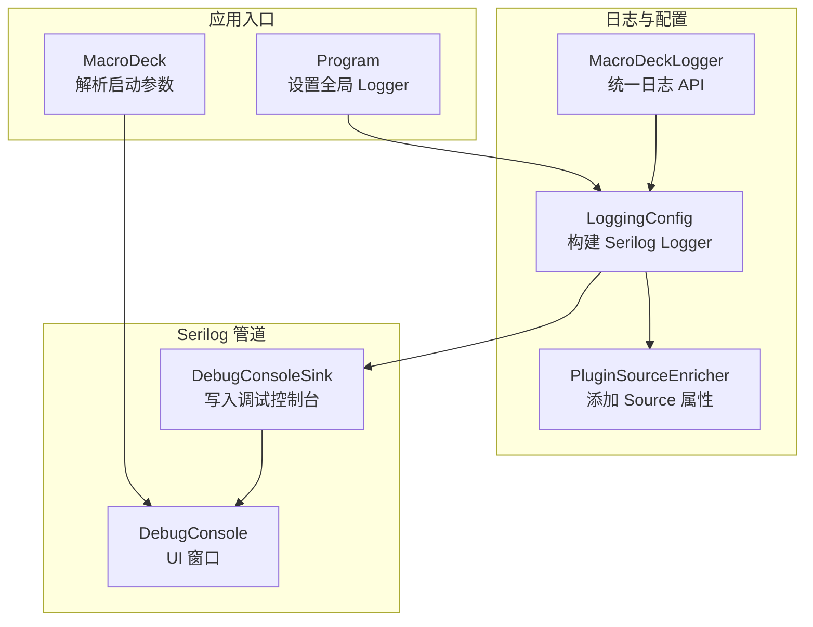
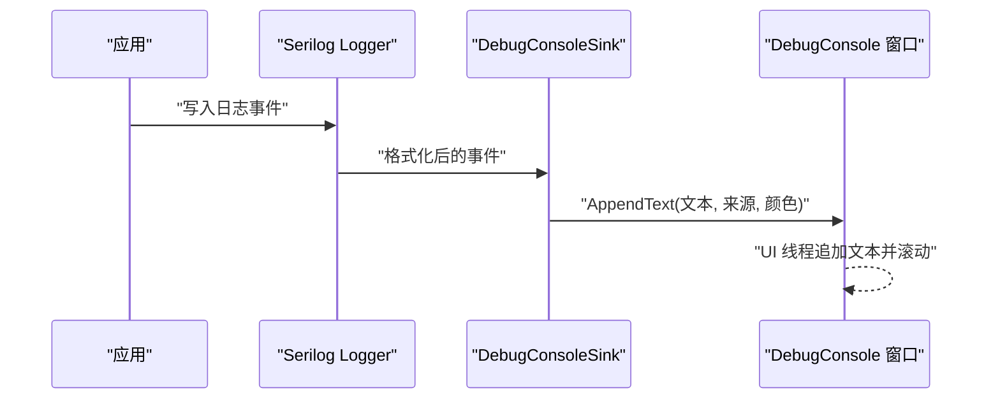
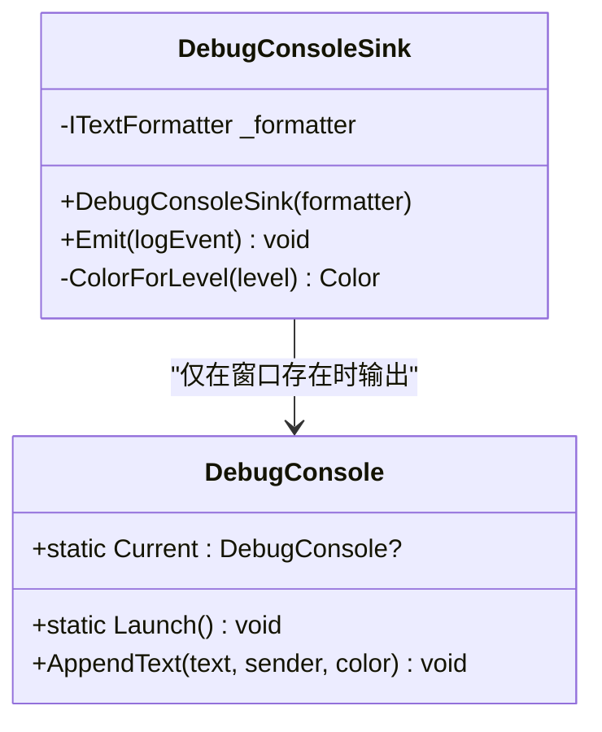
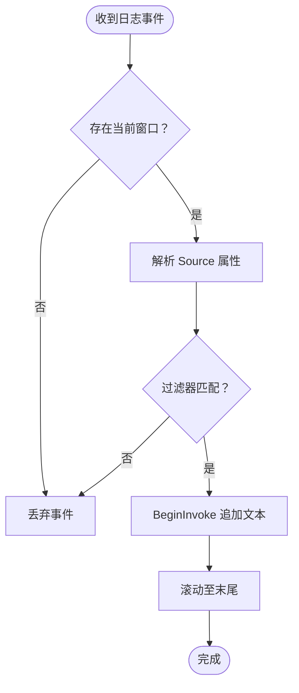
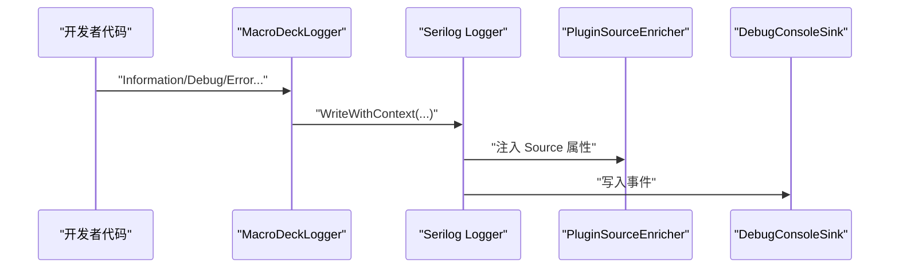
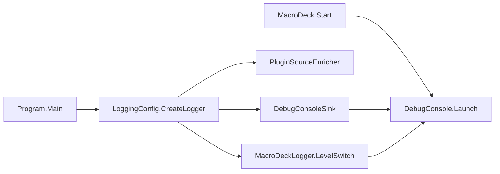

# 调试控制台

<cite>
**本文引用的文件**
- [DebugConsoleSink.cs](file://src/MacroDeck/Logging/DebugConsoleSink.cs)
- [MacroDeckLogger.cs](file://src/MacroDeck/Logging/MacroDeckLogger.cs)
- [DebugConsole.cs](file://src/MacroDeck/GUI/Dialogs/DebugConsole.cs)
- [DebugConsole.Designer.cs](file://src/MacroDeck/GUI/Dialogs/DebugConsole.Designer.cs)
- [LoggingConfig.cs](file://src/MacroDeck/StartupConfig/LoggingConfig.cs)
- [PluginSourceEnricher.cs](file://src/MacroDeck/Logging/PluginSourceEnricher.cs)
- [Program.cs](file://src/MacroDeck/Program.cs)
- [MacroDeck.cs](file://src/MacroDeck/MacroDeck.cs)
- [Settings.Designer.cs](file://src/MacroDeck/Properties/Settings.Designer.cs)
</cite>

## 目录
1. [简介](#简介)
2. [项目结构](#项目结构)
3. [核心组件](#核心组件)
4. [架构总览](#架构总览)
5. [详细组件分析](#详细组件分析)
6. [依赖关系分析](#依赖关系分析)
7. [性能考虑](#性能考虑)
8. [故障排查指南](#故障排查指南)
9. [结论](#结论)
10. [附录](#附录)

## 简介
本文件面向开发者，系统化阐述 Macro-Deck 调试控制台系统的实现与使用，重点包括：
- DebugConsoleSink 的工作原理与功能特性
- 调试信息的收集、过滤与显示机制
- 调试控制台的用户界面设计与交互能力
- 实时日志输出与历史记录查看
- 调试模式的启用与禁用方式
- 搜索、筛选与导出功能
- 与其他应用组件的集成点
- 调试技巧与问题诊断方法

## 项目结构
调试控制台相关代码主要分布在以下模块：
- 日志配置与管道：LoggingConfig、MacroDeckLogger、PluginSourceEnricher
- 调试控制台窗口：DebugConsole（含设计器）
- Serilog 输出端：DebugConsoleSink
- 应用入口与启动参数：Program、MacroDeck
- 设置持久化：Settings.Designer

**图表来源**
- [LoggingConfig.cs:21-49](file://src/MacroDeck/StartupConfig/LoggingConfig.cs#L21-L49)
- [MacroDeckLogger.cs:11-361](file://src/MacroDeck/Logging/MacroDeckLogger.cs#L11-L361)
- [PluginSourceEnricher.cs:12-31](file://src/MacroDeck/Logging/PluginSourceEnricher.cs#L12-L31)
- [DebugConsoleSink.cs:14-56](file://src/MacroDeck/Logging/DebugConsoleSink.cs#L14-L56)
- [DebugConsole.cs:13-249](file://src/MacroDeck/GUI/Dialogs/DebugConsole.cs#L13-L249)
- [Program.cs:32](file://src/MacroDeck/Program.cs#L32)
- [MacroDeck.cs:77-79](file://src/MacroDeck/MacroDeck.cs#L77-L79)

**章节来源**
- [LoggingConfig.cs:21-49](file://src/MacroDeck/StartupConfig/LoggingConfig.cs#L21-L49)
- [Program.cs:30-34](file://src/MacroDeck/Program.cs#L30-L34)
- [MacroDeck.cs:77-79](file://src/MacroDeck/MacroDeck.cs#L77-L79)

## 核心组件
- DebugConsoleSink：Serilog ILogEventSink 实现，负责将已格式化的日志事件转发到当前打开的调试控制台窗口；无窗口时不产生任何副作用。
- MacroDeckLogger：统一的日志 API，封装了不同级别（Verbose/Debug/Information/Warning/Error/Fatal）的调用，并通过 Serilog 的 LevelSwitch 动态调整最小日志级别。
- DebugConsole：调试控制台窗口，提供实时日志显示、过滤、导出、日志级别切换、打开用户目录/日志文件等交互功能。
- LoggingConfig：在应用启动早期构建全局 Serilog Logger，注册控制台、文件与调试控制台输出端。
- PluginSourceEnricher：为每条日志事件注入 Source 属性，区分来自插件或宿主的来源。

**章节来源**
- [DebugConsoleSink.cs:14-56](file://src/MacroDeck/Logging/DebugConsoleSink.cs#L14-L56)
- [MacroDeckLogger.cs:11-361](file://src/MacroDeck/Logging/MacroDeckLogger.cs#L11-L361)
- [DebugConsole.cs:13-249](file://src/MacroDeck/GUI/Dialogs/DebugConsole.cs#L13-L249)
- [LoggingConfig.cs:21-49](file://src/MacroDeck/StartupConfig/LoggingConfig.cs#L21-L49)
- [PluginSourceEnricher.cs:12-31](file://src/MacroDeck/Logging/PluginSourceEnricher.cs#L12-L31)

## 架构总览
调试控制台的运行链路如下：
- 应用启动时由 Program 设置全局 Logger（LoggingConfig.CreateLogger）
- 宏观日志 API（MacroDeckLogger）通过 Serilog 写入多路输出（控制台、文件、调试控制台）
- DebugConsoleSink 在有窗口时接收格式化后的日志文本，并按级别着色后追加到 RichTextBox
- 用户可通过 UI 过滤来源（如“Macro Deck”或具体插件名），并导出历史输出

**图表来源**
- [Program.cs:32](file://src/MacroDeck/Program.cs#L32)
- [LoggingConfig.cs:38](file://src/MacroDeck/StartupConfig/LoggingConfig.cs#L38)
- [DebugConsoleSink.cs:23-40](file://src/MacroDeck/Logging/DebugConsoleSink.cs#L23-L40)
- [DebugConsole.cs:75-123](file://src/MacroDeck/GUI/Dialogs/DebugConsole.cs#L75-L123)

## 详细组件分析

### DebugConsoleSink 组件分析
- 角色与职责
  - 作为 Serilog 的 ILogEventSink，接收已渲染的日志事件
  - 仅当存在当前打开的调试控制台实例时才进行输出
  - 从事件属性中提取 Source 作为来源标识，若缺失则回退为“MacroDeck”
  - 将事件文本按日志级别映射为颜色，再调用窗口接口追加显示
- 关键行为
  - Emit：检查当前窗口实例，格式化事件，提取来源，调用窗口追加文本
  - ColorForLevel：根据 LogEventLevel 返回对应颜色
- 性能与健壮性
  - 无窗口时为无操作（no-op），避免影响主线程
  - 使用一次性 StringWriter 避免重复分配
  - UI 更新通过 BeginInvoke 在窗口线程执行，防止跨线程异常

**图表来源**
- [DebugConsoleSink.cs:14-56](file://src/MacroDeck/Logging/DebugConsoleSink.cs#L14-L56)
- [DebugConsole.cs:13-40](file://src/MacroDeck/GUI/Dialogs/DebugConsole.cs#L13-L40)

**章节来源**
- [DebugConsoleSink.cs:14-56](file://src/MacroDeck/Logging/DebugConsoleSink.cs#L14-L56)

### 调试控制台窗口（DebugConsole）组件分析
- 启动与生命周期
  - Launch：在独立的 STA 线程上创建并运行窗口，确保不受主线程阻塞
  - Current：静态字段保存当前窗口实例，供 Sink 使用
- 显示与过滤
  - AppendText：在 UI 线程追加文本，支持基于来源的过滤（以分号分隔的来源列表）
  - 自动滚动至最新消息
- 交互功能
  - 清空输出、重启应用、退出、打开用户目录、打开日志文件、导出输出、测试通知
  - 日志级别下拉框联动 MacroDeckLogger.LogLevel
  - 过滤器列表：一键添加“Macro Deck”与所有插件名称
- 数据持久化
  - 过滤器内容保存到 Settings.Default.DebugConsoleFilters

**图表来源**
- [DebugConsole.cs:75-123](file://src/MacroDeck/GUI/Dialogs/DebugConsole.cs#L75-L123)
- [DebugConsole.cs:94-103](file://src/MacroDeck/GUI/Dialogs/DebugConsole.cs#L94-L103)

**章节来源**
- [DebugConsole.cs:27-40](file://src/MacroDeck/GUI/Dialogs/DebugConsole.cs#L27-L40)
- [DebugConsole.cs:75-123](file://src/MacroDeck/GUI/Dialogs/DebugConsole.cs#L75-L123)
- [DebugConsole.cs:188-194](file://src/MacroDeck/GUI/Dialogs/DebugConsole.cs#L188-L194)
- [DebugConsole.cs:196-216](file://src/MacroDeck/GUI/Dialogs/DebugConsole.cs#L196-L216)
- [DebugConsole.cs:218-233](file://src/MacroDeck/GUI/Dialogs/DebugConsole.cs#L218-L233)
- [Settings.Designer.cs:40-42](file://src/MacroDeck/Properties/Settings.Designer.cs#L40-L42)

### 日志 API 与配置（MacroDeckLogger、LoggingConfig、PluginSourceEnricher）
- MacroDeckLogger
  - 提供统一的 Verbose/Debug/Information/Warning/Error/Fatal 接口
  - 支持带异常与插件上下文的重载
  - 通过 LevelSwitch 动态调整最小日志级别
- LoggingConfig
  - 构建全局 Logger，设置最小级别、控制台与文件输出、调试控制台输出端
  - 注入 PluginSourceEnricher，为事件添加 Source 属性
- PluginSourceEnricher
  - 若事件包含插件名，则 Source=插件名；否则 Source=“MacroDeck”

**图表来源**
- [MacroDeckLogger.cs:64-77](file://src/MacroDeck/Logging/MacroDeckLogger.cs#L64-L77)
- [LoggingConfig.cs:24-25](file://src/MacroDeck/StartupConfig/LoggingConfig.cs#L24-L25)
- [PluginSourceEnricher.cs:19-30](file://src/MacroDeck/Logging/PluginSourceEnricher.cs#L19-L30)
- [LoggingConfig.cs:38](file://src/MacroDeck/StartupConfig/LoggingConfig.cs#L38)

**章节来源**
- [MacroDeckLogger.cs:11-361](file://src/MacroDeck/Logging/MacroDeckLogger.cs#L11-L361)
- [LoggingConfig.cs:21-49](file://src/MacroDeck/StartupConfig/LoggingConfig.cs#L21-L49)
- [PluginSourceEnricher.cs:12-31](file://src/MacroDeck/Logging/PluginSourceEnricher.cs#L12-L31)

## 依赖关系分析
- DebugConsoleSink 依赖 Serilog 的 ITextFormatter 与 DebugConsole.Current
- DebugConsole 依赖 MacroDeckLogger.LogLevel 与 Settings.Default.DebugConsoleFilters
- LoggingConfig 依赖 MacroDeckLogger.LevelSwitch 与 PluginSourceEnricher
- Program 在启动早期设置全局 Logger，确保日志贯穿整个生命周期
- MacroDeck 根据启动参数决定是否自动打开调试控制台

**图表来源**
- [Program.cs:32](file://src/MacroDeck/Program.cs#L32)
- [LoggingConfig.cs:25-38](file://src/MacroDeck/StartupConfig/LoggingConfig.cs#L25-L38)
- [MacroDeck.cs:77-79](file://src/MacroDeck/MacroDeck.cs#L77-L79)
- [DebugConsoleSink.cs:25-39](file://src/MacroDeck/Logging/DebugConsoleSink.cs#L25-L39)

**章节来源**
- [Program.cs:30-34](file://src/MacroDeck/Program.cs#L30-L34)
- [MacroDeck.cs:77-79](file://src/MacroDeck/MacroDeck.cs#L77-L79)
- [LoggingConfig.cs:21-49](file://src/MacroDeck/StartupConfig/LoggingConfig.cs#L21-L49)

## 性能考虑
- DebugConsoleSink 为无窗口时的无操作，避免对性能造成影响
- 使用一次性 StringWriter 进行格式化，减少内存分配
- UI 更新通过 BeginInvoke 在专用 UI 线程执行，降低跨线程开销
- 日志级别可动态调整，便于在生产环境降低日志量
- 文件日志按天滚动且限制大小，避免磁盘占用过大

[本节为通用建议，不直接分析具体文件]

## 故障排查指南
- 调试控制台未显示任何内容
  - 确认是否已通过启动参数或手动打开调试控制台
  - 检查日志级别设置是否过高，导致事件被过滤
- 过滤无效
  - 确认过滤器字符串中来源名称与实际一致（区分大小写）
  - 可通过“添加来源”菜单快速选择
- 导出失败
  - 检查目标路径权限与磁盘空间
  - 查看日志中的错误信息
- 无法打开日志文件
  - 确认日志目录存在且可访问
  - 如需定位最新文件，可尝试手动打开日志目录

**章节来源**
- [DebugConsole.cs:94-103](file://src/MacroDeck/GUI/Dialogs/DebugConsole.cs#L94-L103)
- [DebugConsole.cs:196-216](file://src/MacroDeck/GUI/Dialogs/DebugConsole.cs#L196-L216)
- [DebugConsole.cs:152-186](file://src/MacroDeck/GUI/Dialogs/DebugConsole.cs#L152-L186)

## 结论
调试控制台通过 DebugConsoleSink 与 Serilog 紧密集成，实现了低侵入、高性能的日志实时输出。配合丰富的 UI 过滤、导出与交互功能，能够满足开发与排障场景的多样化需求。通过动态日志级别与来源标注，开发者可以高效聚焦问题根因并快速定位异常。

[本节为总结性内容，不直接分析具体文件]

## 附录

### 启用/禁用调试控制台
- 启用方式
  - 通过启动参数触发自动打开（由 MacroDeck 解析并调用 DebugConsole.Launch）
  - 手动在应用内打开调试控制台窗口
- 禁用方式
  - 关闭调试控制台窗口（不会终止应用）
  - 降低日志级别以减少输出

**章节来源**
- [MacroDeck.cs:77-79](file://src/MacroDeck/MacroDeck.cs#L77-L79)
- [DebugConsole.cs:67-73](file://src/MacroDeck/GUI/Dialogs/DebugConsole.cs#L67-L73)

### 日志级别与颜色映射
- 级别到颜色映射（用于 UI 显示）
  - Fatal/Error → 红色
  - Warning → 橙色
  - Information → 白色
  - Debug → 灰色
  - Verbose → 深灰色

**章节来源**
- [DebugConsoleSink.cs:42-54](file://src/MacroDeck/Logging/DebugConsoleSink.cs#L42-L54)

### 搜索、筛选与导出
- 搜索/筛选
  - 基于来源名称的精确筛选（支持多个来源以分号分隔）
  - 通过“添加来源”菜单快速选择
- 导出
  - 将当前 RichTextBox 文本导出为 .log 文件
  - 可直接打开最近的日志文件或日志目录

**章节来源**
- [DebugConsole.cs:94-103](file://src/MacroDeck/GUI/Dialogs/DebugConsole.cs#L94-L103)
- [DebugConsole.cs:196-216](file://src/MacroDeck/GUI/Dialogs/DebugConsole.cs#L196-L216)
- [DebugConsole.cs:152-186](file://src/MacroDeck/GUI/Dialogs/DebugConsole.cs#L152-L186)

### 与应用其他组件的集成
- 全局 Logger 初始化：Program.Main 中设置 Log.Logger
- 插件日志来源标注：PluginSourceEnricher 为插件事件注入 Source
- 日志级别控制：MacroDeckLogger.LevelSwitch 控制最小级别
- UI 线程安全：DebugConsole.AppendText 通过 BeginInvoke 访问控件

**章节来源**
- [Program.cs:32](file://src/MacroDeck/Program.cs#L32)
- [PluginSourceEnricher.cs:19-30](file://src/MacroDeck/Logging/PluginSourceEnricher.cs#L19-L30)
- [MacroDeckLogger.cs:21](file://src/MacroDeck/Logging/MacroDeckLogger.cs#L21)
- [DebugConsole.cs:85-117](file://src/MacroDeck/GUI/Dialogs/DebugConsole.cs#L85-L117)