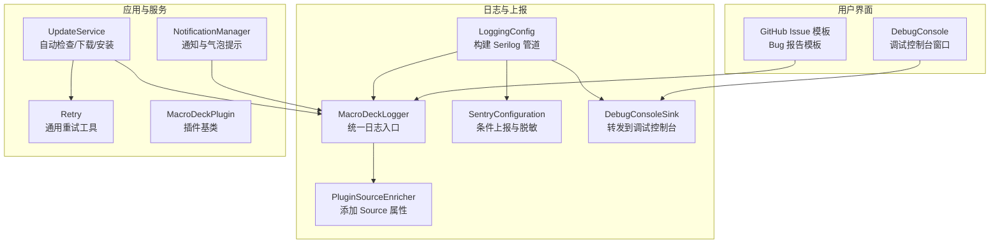
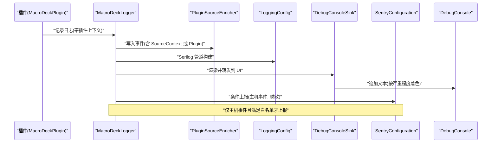
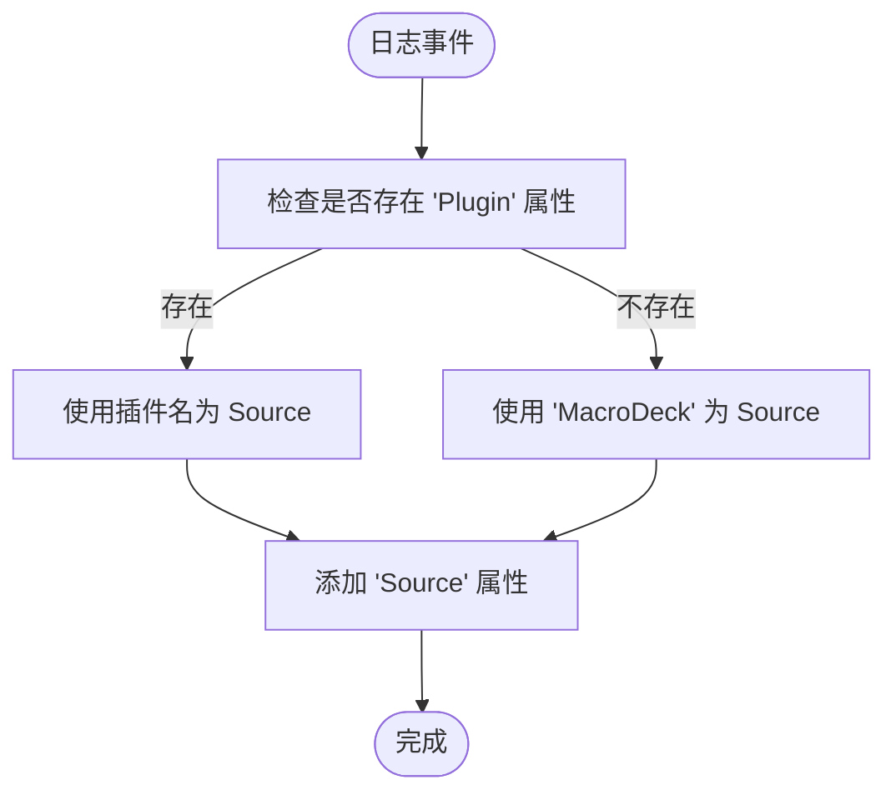
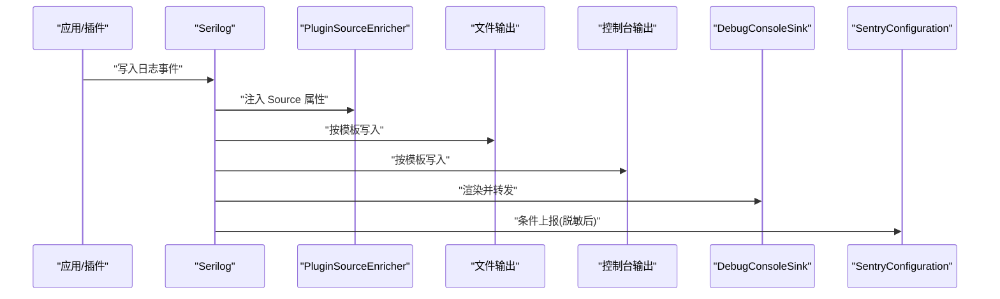
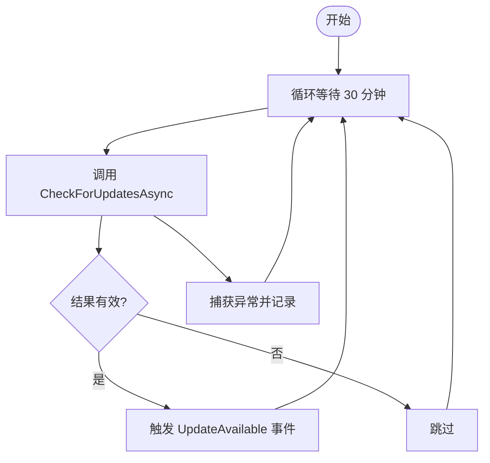
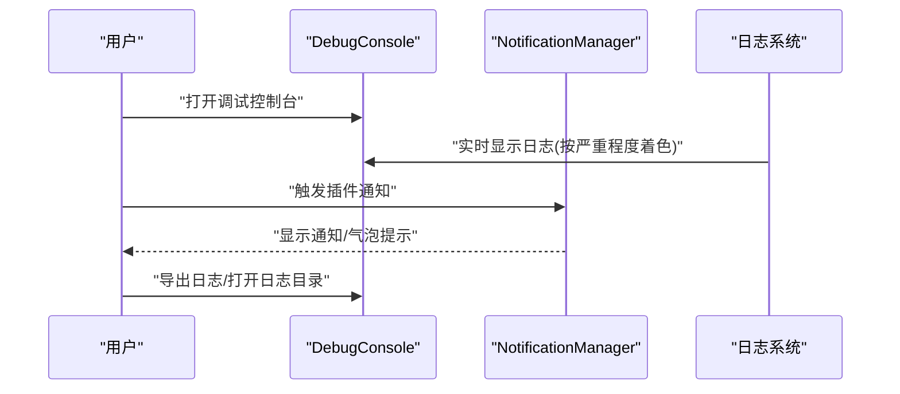
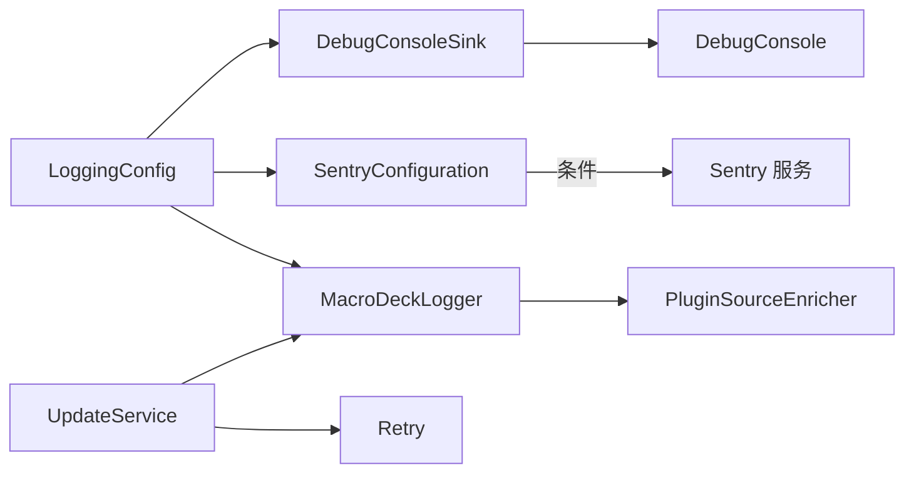

# 错误报告

<cite>
**本文引用的文件**
- [PluginSourceEnricher.cs](file://src/MacroDeck/Logging/PluginSourceEnricher.cs)
- [MacroDeckLogger.cs](file://src/MacroDeck/Logging/MacroDeckLogger.cs)
- [SentryConfiguration.cs](file://src/MacroDeck/Logging/SentryConfiguration.cs)
- [LoggingConfig.cs](file://src/MacroDeck/StartupConfig/LoggingConfig.cs)
- [UpdateService.cs](file://src/MacroDeck/Services/UpdateService.cs)
- [Retry.cs](file://src/MacroDeck/Utils/Retry.cs)
- [DebugConsole.cs](file://src/MacroDeck/GUI/Dialogs/DebugConsole.cs)
- [DebugConsole.Designer.cs](file://src/MacroDeck/GUI/Dialogs/DebugConsole.Designer.cs)
- [DebugConsoleSink.cs](file://src/MacroDeck/Logging/DebugConsoleSink.cs)
- [NotificationManager.cs](file://src/MacroDeck/Notifications/NotificationManager.cs)
- [MacroDeckPlugin.cs](file://src/MacroDeck/Plugins/MacroDeckPlugin.cs)
- [bug_report.md](file://.github/ISSUE_TEMPLATE/bug_report.md)
</cite>

## 目录
1. [简介](#简介)
2. [项目结构](#项目结构)
3. [核心组件](#核心组件)
4. [架构总览](#架构总览)
5. [组件详解](#组件详解)
6. [依赖关系分析](#依赖关系分析)
7. [性能考量](#性能考量)
8. [故障排查指南](#故障排查指南)
9. [结论](#结论)
10. [附录](#附录)

## 简介
本文件面向 Macro-Deck 的错误报告系统，系统性阐述异常捕获与错误分类机制、PluginSourceEnricher 的作用与插件错误追踪、错误信息的采集、格式化与上报流程、更新服务中的错误处理与重试机制、用户界面与手动上报能力、错误统计与趋势分析建议、错误与组件的关联性以及开发者预防与快速修复的指导原则。目标是帮助开发者与支持人员高效定位问题、优化用户体验并提升系统稳定性。

## 项目结构
错误报告体系由“日志记录层（Serilog）+ 插件来源增强器 + 上报配置（Sentry）+ 用户界面（调试控制台/通知）+ 更新服务错误处理”构成，并通过启动配置统一接入。

图示来源
- [LoggingConfig.cs:21-49](file://src/MacroDeck/StartupConfig/LoggingConfig.cs#L21-L49)
- [MacroDeckLogger.cs:64-77](file://src/MacroDeck/Logging/MacroDeckLogger.cs#L64-L77)
- [PluginSourceEnricher.cs:19-30](file://src/MacroDeck/Logging/PluginSourceEnricher.cs#L19-L30)
- [SentryConfiguration.cs:23-46](file://src/MacroDeck/Logging/SentryConfiguration.cs#L23-L46)
- [DebugConsoleSink.cs:23-40](file://src/MacroDeck/Logging/DebugConsoleSink.cs#L23-L40)
- [UpdateService.cs:51-85](file://src/MacroDeck/Services/UpdateService.cs#L51-L85)
- [Retry.cs:39-62](file://src/MacroDeck/Utils/Retry.cs#L39-L62)
- [NotificationManager.cs:38-99](file://src/MacroDeck/Notifications/NotificationManager.cs#L38-L99)
- [DebugConsole.cs:27-40](file://src/MacroDeck/GUI/Dialogs/DebugConsole.cs#L27-L40)
- [bug_report.md:29](file://.github/ISSUE_TEMPLATE/bug_report.md#L29)

章节来源
- [LoggingConfig.cs:21-49](file://src/MacroDeck/StartupConfig/LoggingConfig.cs#L21-L49)
- [MacroDeckLogger.cs:64-77](file://src/MacroDeck/Logging/MacroDeckLogger.cs#L64-L77)
- [PluginSourceEnricher.cs:19-30](file://src/MacroDeck/Logging/PluginSourceEnricher.cs#L19-L30)
- [SentryConfiguration.cs:23-46](file://src/MacroDeck/Logging/SentryConfiguration.cs#L23-L46)
- [DebugConsoleSink.cs:23-40](file://src/MacroDeck/Logging/DebugConsoleSink.cs#L23-L40)
- [UpdateService.cs:51-85](file://src/MacroDeck/Services/UpdateService.cs#L51-L85)
- [Retry.cs:39-62](file://src/MacroDeck/Utils/Retry.cs#L39-L62)
- [NotificationManager.cs:38-99](file://src/MacroDeck/Notifications/NotificationManager.cs#L38-L99)
- [DebugConsole.cs:27-40](file://src/MacroDeck/GUI/Dialogs/DebugConsole.cs#L27-L40)
- [bug_report.md:29](file://.github/ISSUE_TEMPLATE/bug_report.md#L29)

## 核心组件
- 日志入口与级别映射：统一使用 MacroDeckLogger 提供的 API 记录日志，内部将 LogLevel 映射为 Serilog 的 LogEventLevel，并在无插件时设置 SourceContext 以满足 Sentry 白名单要求；在有插件时写入 "Plugin" 属性，避免被 Sentry 上报。
- 插件来源增强器：PluginSourceEnricher 在每条日志事件上添加 "Source" 属性，值为插件名或 "MacroDeck"，便于后续筛选与统计。
- 上报配置：SentryConfiguration 负责 DSN 配置、最小上报级别、条件上报（仅主机事件）、脱敏（用户名、路径等）与面包屑清理。
- 启动配置：LoggingConfig 构建 Serilog 管道，启用 Console/File/DebugConsoleSink，并按需启用 Sentry 条件输出。
- 调试控制台：DebugConsoleSink 将渲染后的日志转发至 DebugConsole 窗口，颜色区分严重程度；DebugConsole 支持过滤、导出、打开日志目录等操作。
- 更新服务：UpdateService 执行周期性检查、下载与安装，对异常进行捕获并记录，同时提供下载校验与静默安装。
- 重试工具：Retry 提供统一的重试策略，支持间隔与最大次数，失败聚合抛出异常集合。
- 通知系统：NotificationManager 提供插件侧通知与气泡提示，辅助用户感知错误状态。
- 插件基类：MacroDeckPlugin 定义插件元数据与生命周期，插件日志通过 MacroDeckLogger 统一归集。

章节来源
- [MacroDeckLogger.cs:37-49](file://src/MacroDeck/Logging/MacroDeckLogger.cs#L37-L49)
- [MacroDeckLogger.cs:64-77](file://src/MacroDeck/Logging/MacroDeckLogger.cs#L64-L77)
- [PluginSourceEnricher.cs:19-30](file://src/MacroDeck/Logging/PluginSourceEnricher.cs#L19-L30)
- [SentryConfiguration.cs:23-46](file://src/MacroDeck/Logging/SentryConfiguration.cs#L23-L46)
- [LoggingConfig.cs:21-49](file://src/MacroDeck/StartupConfig/LoggingConfig.cs#L21-L49)
- [DebugConsoleSink.cs:23-40](file://src/MacroDeck/Logging/DebugConsoleSink.cs#L23-L40)
- [DebugConsole.cs:27-40](file://src/MacroDeck/GUI/Dialogs/DebugConsole.cs#L27-L40)
- [UpdateService.cs:51-85](file://src/MacroDeck/Services/UpdateService.cs#L51-L85)
- [Retry.cs:39-62](file://src/MacroDeck/Utils/Retry.cs#L39-L62)
- [NotificationManager.cs:38-99](file://src/MacroDeck/Notifications/NotificationManager.cs#L38-L99)
- [MacroDeckPlugin.cs:19-27](file://src/MacroDeck/Plugins/MacroDeckPlugin.cs#L19-L27)

## 架构总览
下图展示从日志产生到上报与 UI 反馈的关键路径，包括插件来源标注、条件上报与脱敏、以及用户交互。

图示来源
- [MacroDeckLogger.cs:64-77](file://src/MacroDeck/Logging/MacroDeckLogger.cs#L64-L77)
- [PluginSourceEnricher.cs:19-30](file://src/MacroDeck/Logging/PluginSourceEnricher.cs#L19-L30)
- [LoggingConfig.cs:21-49](file://src/MacroDeck/StartupConfig/LoggingConfig.cs#L21-L49)
- [DebugConsoleSink.cs:23-40](file://src/MacroDeck/Logging/DebugConsoleSink.cs#L23-L40)
- [SentryConfiguration.cs:38-56](file://src/MacroDeck/Logging/SentryConfiguration.cs#L38-L56)

## 组件详解

### 异常捕获与错误分类机制
- 分类依据
  - 主机事件：通过 MacroDeckLogger 写入时设置 SourceContext 前缀，满足 Sentry 白名单，可被条件上报。
  - 插件事件：写入 "Plugin" 属性，不走 Sentry 上报，但会进入本地日志与 UI。
- 错误级别映射：LogLevel 到 LogEventLevel 的映射确保日志级别与上报阈值一致。
- 条件上报：SentryConfiguration.ShouldSend 仅允许主机事件上报，避免第三方插件污染数据源。

章节来源
- [MacroDeckLogger.cs:64-77](file://src/MacroDeck/Logging/MacroDeckLogger.cs#L64-L77)
- [SentryConfiguration.cs:38-56](file://src/MacroDeck/Logging/SentryConfiguration.cs#L38-L56)
- [LoggingConfig.cs:42-46](file://src/MacroDeck/StartupConfig/LoggingConfig.cs#L42-L46)

### PluginSourceEnricher 的作用与插件错误追踪
- 作用：为每条日志事件添加 "Source" 属性，值来自 "Plugin"（插件名）或默认 "MacroDeck"，用于后续统计与筛选。
- 插件追踪：插件侧日志通过 MacroDeckLogger 写入 "Plugin" 属性，Enricher 自动转换为 "Source"，便于按插件维度聚合与分析。

图示来源
- [PluginSourceEnricher.cs:19-30](file://src/MacroDeck/Logging/PluginSourceEnricher.cs#L19-L30)

章节来源
- [PluginSourceEnricher.cs:19-30](file://src/MacroDeck/Logging/PluginSourceEnricher.cs#L19-L30)
- [MacroDeckLogger.cs:64-77](file://src/MacroDeck/Logging/MacroDeckLogger.cs#L64-L77)

### 错误信息的收集、格式化与上报流程
- 收集：Serilog 在 LoggingConfig 中统一配置 Console、File、DebugConsoleSink 与 Sentry（条件）输出。
- 格式化：MessageTemplateTextFormatter 与自定义 OutputTemplate 输出时间、级别、Source、消息与异常。
- 上报：SentryConfiguration.BeforeSend/Breadcrumb 对消息、异常堆栈与文件路径进行脱敏，再决定是否上报。
- UI：DebugConsoleSink 读取 "Source" 属性，按级别着色并显示到调试控制台。

图示来源
- [LoggingConfig.cs:21-49](file://src/MacroDeck/StartupConfig/LoggingConfig.cs#L21-L49)
- [DebugConsoleSink.cs:23-40](file://src/MacroDeck/Logging/DebugConsoleSink.cs#L23-L40)
- [SentryConfiguration.cs:58-94](file://src/MacroDeck/Logging/SentryConfiguration.cs#L58-L94)

章节来源
- [LoggingConfig.cs:21-49](file://src/MacroDeck/StartupConfig/LoggingConfig.cs#L21-L49)
- [DebugConsoleSink.cs:23-40](file://src/MacroDeck/Logging/DebugConsoleSink.cs#L23-L40)
- [SentryConfiguration.cs:58-94](file://src/MacroDeck/Logging/SentryConfiguration.cs#L58-L94)

### 更新服务中的错误处理与重试机制
- 周期检查：StartPeriodicalUpdateCheck 后，DoWork 每 30 分钟调用一次 CheckForUpdatesAsync。
- 异常捕获：DoWork 中对检查过程异常进行捕获并记录，保证后台任务持续运行。
- 并发控制：检查与下载分别使用信号量限制并发，避免资源争用。
- 下载校验：VerifyDownloadedFile 使用 SHA-256 校验下载完整性，失败即抛出异常。
- 安装流程：下载完成后启动静默安装并退出当前进程。

图示来源
- [UpdateService.cs:121-136](file://src/MacroDeck/Services/UpdateService.cs#L121-L136)
- [UpdateService.cs:51-85](file://src/MacroDeck/Services/UpdateService.cs#L51-L85)
- [UpdateService.cs:138-158](file://src/MacroDeck/Services/UpdateService.cs#L138-L158)

章节来源
- [UpdateService.cs:39-43](file://src/MacroDeck/Services/UpdateService.cs#L39-L43)
- [UpdateService.cs:121-136](file://src/MacroDeck/Services/UpdateService.cs#L121-L136)
- [UpdateService.cs:51-85](file://src/MacroDeck/Services/UpdateService.cs#L51-L85)
- [UpdateService.cs:138-158](file://src/MacroDeck/Services/UpdateService.cs#L138-L158)

### 用户界面与手动上报功能
- 调试控制台：DebugConsole 支持过滤、导出、打开日志目录、重启应用等操作；通过 DebugConsoleSink 实时接收日志。
- 通知系统：NotificationManager 提供插件侧通知与气泡提示，限制同发送者最多 5 条，避免刷屏。
- GitHub 模板：bug_report.md 要求上传最新日志文件，便于社区支持快速定位问题。

图示来源
- [DebugConsole.cs:27-40](file://src/MacroDeck/GUI/Dialogs/DebugConsole.cs#L27-L40)
- [DebugConsoleSink.cs:23-40](file://src/MacroDeck/Logging/DebugConsoleSink.cs#L23-L40)
- [NotificationManager.cs:38-99](file://src/MacroDeck/Notifications/NotificationManager.cs#L38-L99)
- [bug_report.md:29](file://.github/ISSUE_TEMPLATE/bug_report.md#L29)

章节来源
- [DebugConsole.cs:27-40](file://src/MacroDeck/GUI/Dialogs/DebugConsole.cs#L27-L40)
- [DebugConsole.Designer.cs:300-335](file://src/MacroDeck/GUI/Dialogs/DebugConsole.Designer.cs#L300-L335)
- [DebugConsoleSink.cs:23-40](file://src/MacroDeck/Logging/DebugConsoleSink.cs#L23-L40)
- [NotificationManager.cs:38-99](file://src/MacroDeck/Notifications/NotificationManager.cs#L38-L99)
- [bug_report.md:29](file://.github/ISSUE_TEMPLATE/bug_report.md#L29)

### 错误统计与趋势分析（建议）
- 统计维度
  - 按 Source（MacroDeck/插件名）统计错误数量与占比。
  - 按日志级别（Error/Fatal/Warn）统计趋势。
  - 按异常类型与堆栈关键帧进行聚类分析。
- 数据来源
  - 本地日志文件与 Sentry 事件均可作为统计基础。
  - 插件侧可通过 "Plugin" 属性与 "Source" 属性进行分组。
- 工具建议
  - 使用日志分析工具（如 Kibana/ELK 或 Splunk）对接日志文件与 Sentry。
  - 在 UI 中增加“最近错误概览”面板，展示 Top-N 插件与错误类型。

（本节为概念性建议，不直接分析具体文件）

### 错误与组件的关联性
- 插件错误追踪：通过 MacroDeckLogger 写入 "Plugin" 属性，配合 PluginSourceEnricher 的 "Source" 属性，可将错误精确关联到插件名称。
- 主机错误追踪：通过 SourceContext 前缀满足 Sentry 白名单，确保主机侧错误被上报与统计。
- UI 关联：调试控制台按 Source 着色显示，便于快速识别来源组件。

章节来源
- [MacroDeckLogger.cs:64-77](file://src/MacroDeck/Logging/MacroDeckLogger.cs#L64-L77)
- [PluginSourceEnricher.cs:19-30](file://src/MacroDeck/Logging/PluginSourceEnricher.cs#L19-L30)
- [SentryConfiguration.cs:43-56](file://src/MacroDeck/Logging/SentryConfiguration.cs#L43-L56)

### 开发者预防与快速修复指导原则
- 预防
  - 统一使用 MacroDeckLogger 记录日志，明确插件上下文，避免遗漏 Source 信息。
  - 对外部调用（网络、文件）使用 Retry 工具进行幂等与退避重试。
  - 在更新服务中严格校验下载文件哈希，防止恶意或损坏文件执行。
- 快速修复
  - 优先查看调试控制台，结合过滤器定位问题。
  - 使用通知系统向用户反馈错误状态，引导其导出日志协助诊断。
  - 在 GitHub 提交 Bug 报告时附带最新日志文件，提高响应效率。

章节来源
- [MacroDeckLogger.cs:64-77](file://src/MacroDeck/Logging/MacroDeckLogger.cs#L64-L77)
- [Retry.cs:39-62](file://src/MacroDeck/Utils/Retry.cs#L39-L62)
- [UpdateService.cs:138-158](file://src/MacroDeck/Services/UpdateService.cs#L138-L158)
- [bug_report.md:29](file://.github/ISSUE_TEMPLATE/bug_report.md#L29)

## 依赖关系分析
- 组件耦合
  - MacroDeckLogger 依赖 Serilog 与 MacroDeckPlugin，负责日志写入与上下文设置。
  - PluginSourceEnricher 依赖 Serilog 事件属性，负责 Source 属性生成。
  - LoggingConfig 依赖 MacroDeckLogger.LevelSwitch 与 SentryConfiguration，负责管道装配。
  - DebugConsoleSink 依赖 Serilog 渲染器与 DebugConsole，负责 UI 转发。
  - UpdateService 依赖 Serilog 记录异常，依赖 Retry 进行重试。
- 外部集成
  - Sentry 通过条件输出仅上报主机事件，避免插件事件污染。
  - GitHub Issue 模板要求导出日志，形成闭环支持链路。

图示来源
- [LoggingConfig.cs:21-49](file://src/MacroDeck/StartupConfig/LoggingConfig.cs#L21-L49)
- [MacroDeckLogger.cs:64-77](file://src/MacroDeck/Logging/MacroDeckLogger.cs#L64-L77)
- [PluginSourceEnricher.cs:19-30](file://src/MacroDeck/Logging/PluginSourceEnricher.cs#L19-L30)
- [SentryConfiguration.cs:23-46](file://src/MacroDeck/Logging/SentryConfiguration.cs#L23-L46)
- [DebugConsoleSink.cs:23-40](file://src/MacroDeck/Logging/DebugConsoleSink.cs#L23-L40)
- [UpdateService.cs:51-85](file://src/MacroDeck/Services/UpdateService.cs#L51-L85)
- [Retry.cs:39-62](file://src/MacroDeck/Utils/Retry.cs#L39-L62)

章节来源
- [LoggingConfig.cs:21-49](file://src/MacroDeck/StartupConfig/LoggingConfig.cs#L21-L49)
- [MacroDeckLogger.cs:64-77](file://src/MacroDeck/Logging/MacroDeckLogger.cs#L64-L77)
- [PluginSourceEnricher.cs:19-30](file://src/MacroDeck/Logging/PluginSourceEnricher.cs#L19-L30)
- [SentryConfiguration.cs:23-46](file://src/MacroDeck/Logging/SentryConfiguration.cs#L23-L46)
- [DebugConsoleSink.cs:23-40](file://src/MacroDeck/Logging/DebugConsoleSink.cs#L23-L40)
- [UpdateService.cs:51-85](file://src/MacroDeck/Services/UpdateService.cs#L51-L85)
- [Retry.cs:39-62](file://src/MacroDeck/Utils/Retry.cs#L39-L62)

## 性能考量
- 日志级别控制：通过 MacroDeckLogger.LevelSwitch 动态调整最小级别，减少高负载场景下的 IO 压力。
- 文件滚动与大小限制：日志文件按天滚动，单文件上限 50MB，避免磁盘占用过大。
- UI 转发开销：DebugConsoleSink 仅在窗口打开时转发，未打开时为无操作，降低空转成本。
- 上报条件：Sentry 条件输出仅在 DSN 配置且事件满足白名单时触发，避免不必要的网络开销。

章节来源
- [MacroDeckLogger.cs:21-35](file://src/MacroDeck/Logging/MacroDeckLogger.cs#L21-L35)
- [LoggingConfig.cs:34-37](file://src/MacroDeck/StartupConfig/LoggingConfig.cs#L34-L37)
- [DebugConsoleSink.cs:23-29](file://src/MacroDeck/Logging/DebugConsoleSink.cs#L23-L29)
- [SentryConfiguration.cs:23-36](file://src/MacroDeck/Logging/SentryConfiguration.cs#L23-L36)

## 故障排查指南
- 如何查看日志
  - 打开调试控制台，使用过滤器缩小范围；导出日志以便提交 Issue。
  - 查看本地日志文件（按日期滚动），定位异常发生时间点。
- 如何确认是否上报
  - 若启用 Sentry 且 DSN 配置正确，主机事件会被脱敏后上报；插件事件不会上报。
- 如何复现与验证
  - 使用 Retry 工具包装易波动的外部调用，观察重试行为与最终结果。
  - 在更新服务中关注下载校验失败与安装流程，确保哈希一致与静默安装参数正确。

章节来源
- [DebugConsole.cs:27-40](file://src/MacroDeck/GUI/Dialogs/DebugConsole.cs#L27-L40)
- [DebugConsole.Designer.cs:300-335](file://src/MacroDeck/GUI/Dialogs/DebugConsole.Designer.cs#L300-L335)
- [SentryConfiguration.cs:23-36](file://src/MacroDeck/Logging/SentryConfiguration.cs#L23-L36)
- [Retry.cs:39-62](file://src/MacroDeck/Utils/Retry.cs#L39-L62)
- [UpdateService.cs:138-158](file://src/MacroDeck/Services/UpdateService.cs#L138-L158)

## 结论
Macro-Deck 的错误报告系统通过统一的日志入口、插件来源增强、条件上报与脱敏、以及完善的 UI 与通知能力，实现了对主机与插件错误的清晰追踪与高效处置。更新服务的异常捕获与下载校验进一步提升了稳定性。建议在现有基础上完善统计与趋势分析能力，并持续优化日志级别与上报策略，以获得更佳的可观测性体验。

## 附录
- 关键实现路径参考
  - 日志入口与级别映射：[MacroDeckLogger.cs:64-77](file://src/MacroDeck/Logging/MacroDeckLogger.cs#L64-L77)
  - 插件来源增强：[PluginSourceEnricher.cs:19-30](file://src/MacroDeck/Logging/PluginSourceEnricher.cs#L19-L30)
  - 上报配置与脱敏：[SentryConfiguration.cs:58-94](file://src/MacroDeck/Logging/SentryConfiguration.cs#L58-L94)
  - 日志管道构建：[LoggingConfig.cs:21-49](file://src/MacroDeck/StartupConfig/LoggingConfig.cs#L21-L49)
  - 调试控制台转发：[DebugConsoleSink.cs:23-40](file://src/MacroDeck/Logging/DebugConsoleSink.cs#L23-L40)
  - 更新服务检查与安装：[UpdateService.cs:51-85](file://src/MacroDeck/Services/UpdateService.cs#L51-L85)
  - 重试工具：[Retry.cs:39-62](file://src/MacroDeck/Utils/Retry.cs#L39-L62)
  - 通知系统：[NotificationManager.cs:38-99](file://src/MacroDeck/Notifications/NotificationManager.cs#L38-L99)
  - 插件基类：[MacroDeckPlugin.cs:19-27](file://src/MacroDeck/Plugins/MacroDeckPlugin.cs#L19-L27)
  - Bug 报告模板：[bug_report.md:29](file://.github/ISSUE_TEMPLATE/bug_report.md#L29)