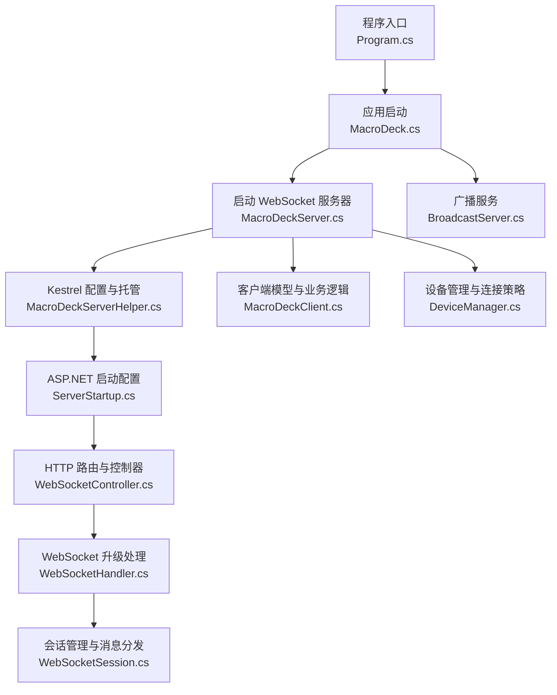
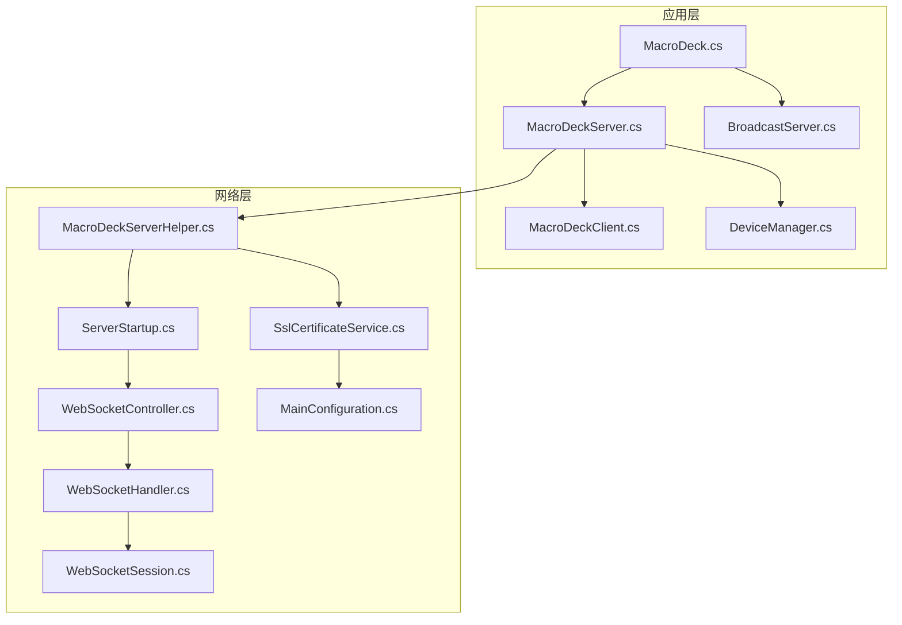
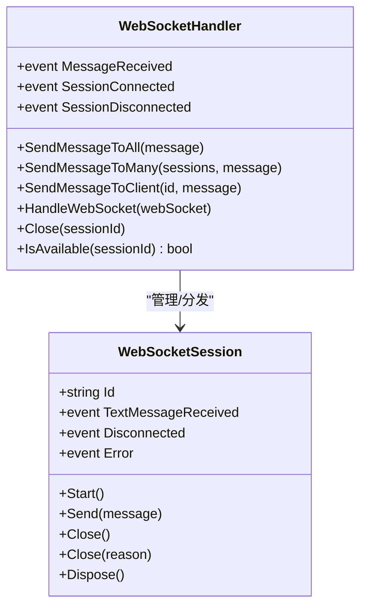
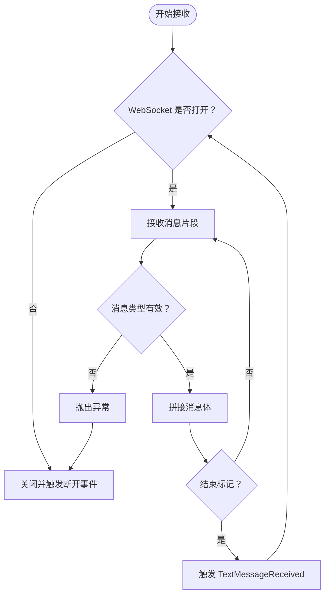
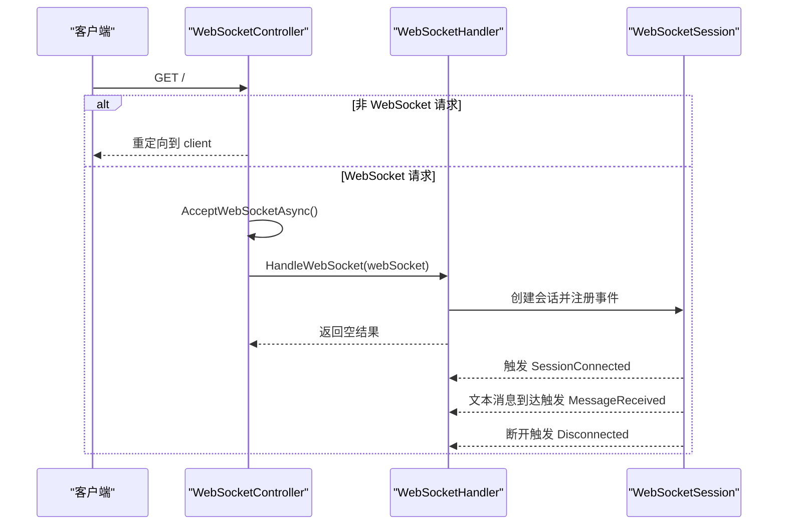
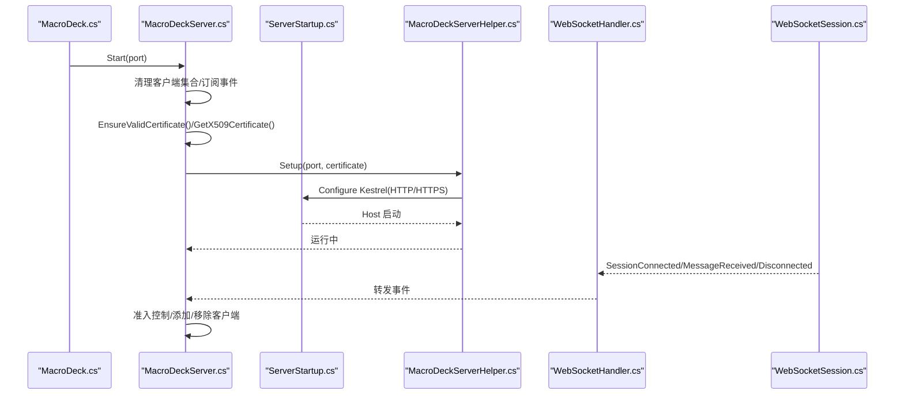
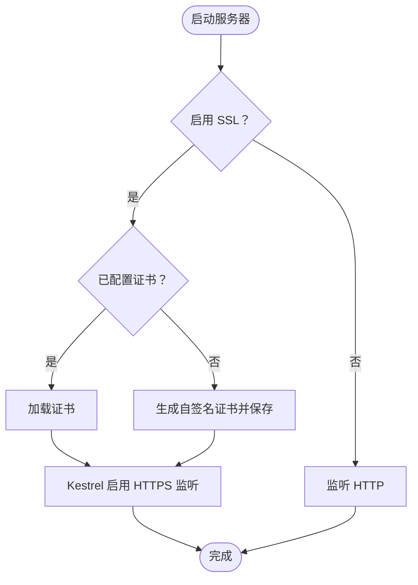
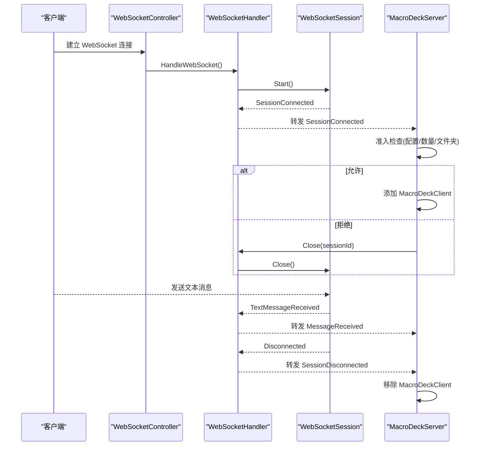
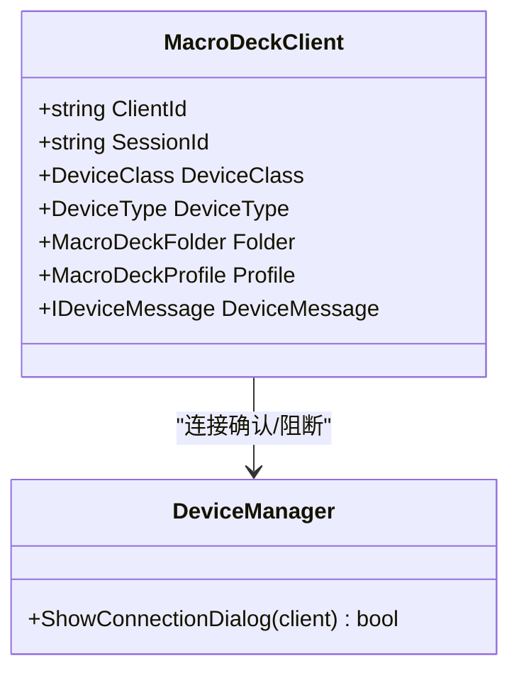
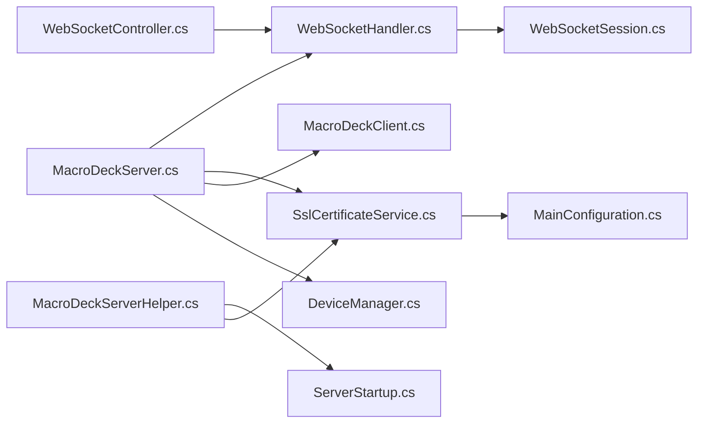

# WebSocket 服务器

<cite>
**本文引用的文件**
- [WebSocketHandler.cs](file://src/MacroDeck/WebSocketHandler.cs)
- [WebSocketSession.cs](file://src/MacroDeck/DataTypes/WebSocketSession.cs)
- [WebSocketCloseReason.cs](file://src/MacroDeck/DataTypes/WebSocketCloseReason.cs)
- [WebSocketNormalClose.cs](file://src/MacroDeck/DataTypes/WebSocketNormalClose.cs)
- [WebSocketController.cs](file://src/MacroDeck/Controllers/WebSocketController.cs)
- [MacroDeckServer.cs](file://src/MacroDeck/Server/MacroDeckServer.cs)
- [MacroDeckServerHelper.cs](file://src/MacroDeck/MacroDeckServerHelper.cs)
- [ServerStartup.cs](file://src/MacroDeck/ServerStartup.cs)
- [SslCertificateService.cs](file://src/MacroDeck/Services/SslCertificateService.cs)
- [MainConfiguration.cs](file://src/MacroDeck/Configuration/MainConfiguration.cs)
- [MacroDeck.cs](file://src/MacroDeck/MacroDeck.cs)
- [MacroDeckClient.cs](file://src/MacroDeck/Server/MacroDeckClient.cs)
- [DeviceManager.cs](file://src/MacroDeck/Device/DeviceManager.cs)
- [BroadcastServer.cs](file://src/MacroDeck/Server/BroadcastServer.cs)
- [Program.cs](file://src/MacroDeck/Program.cs)
</cite>

## 目录
1. [简介](#简介)
2. [项目结构](#项目结构)
3. [核心组件](#核心组件)
4. [架构总览](#架构总览)
5. [详细组件分析](#详细组件分析)
6. [依赖分析](#依赖分析)
7. [性能考虑](#性能考虑)
8. [故障排查指南](#故障排查指南)
9. [结论](#结论)
10. [附录：配置参数与示例路径](#附录配置参数与示例路径)

## 简介
本文件系统性阐述 Macro-Deck 的 WebSocket 服务器实现，覆盖启动流程、SSL 证书配置、服务器状态管理、客户端连接与会话管理、连接池维护、生命周期事件（启动/停止/异常）、配置参数说明，以及与 WebSocketHandler 和其他服务器组件的协作关系。文档同时提供关键流程的时序图与类图，帮助读者快速理解整体设计。

## 项目结构
WebSocket 服务器由以下模块协同完成：
- 控制器层：接收 HTTP 请求并升级为 WebSocket 连接
- 处理层：统一接入与分发消息、维护会话集合
- 会话层：封装单个 WebSocket 连接的读写、关闭与事件
- 服务层：Kestrel 托管与 HTTPS 配置
- 应用层：全局配置、设备与客户端管理、广播服务

图表来源
- [Program.cs:12-35](file://src/MacroDeck/Program.cs#L12-L35)
- [MacroDeck.cs:113-114](file://src/MacroDeck/MacroDeck.cs#L113-L114)
- [MacroDeckServer.cs:28-55](file://src/MacroDeck/Server/MacroDeckServer.cs#L28-L55)
- [MacroDeckServerHelper.cs:15-48](file://src/MacroDeck/MacroDeckServerHelper.cs#L15-L48)
- [ServerStartup.cs:15-31](file://src/MacroDeck/ServerStartup.cs#L15-L31)
- [WebSocketController.cs:7-19](file://src/MacroDeck/Controllers/WebSocketController.cs#L7-L19)
- [WebSocketHandler.cs:37-49](file://src/MacroDeck/WebSocketHandler.cs#L37-L49)
- [WebSocketSession.cs:20-49](file://src/MacroDeck/DataTypes/WebSocketSession.cs#L20-L49)
- [MacroDeckClient.cs:8-52](file://src/MacroDeck/Server/MacroDeckClient.cs#L8-L52)
- [DeviceManager.cs:253-277](file://src/MacroDeck/Device/DeviceManager.cs#L253-L277)
- [BroadcastServer.cs:13-30](file://src/MacroDeck/Server/BroadcastServer.cs#L13-L30)

章节来源
- [Program.cs:12-35](file://src/MacroDeck/Program.cs#L12-L35)
- [MacroDeck.cs:113-114](file://src/MacroDeck/MacroDeck.cs#L113-L114)
- [MacroDeckServer.cs:28-55](file://src/MacroDeck/Server/MacroDeckServer.cs#L28-L55)
- [MacroDeckServerHelper.cs:15-48](file://src/MacroDeck/MacroDeckServerHelper.cs#L15-L48)
- [ServerStartup.cs:15-31](file://src/MacroDeck/ServerStartup.cs#L15-L31)
- [WebSocketController.cs:7-19](file://src/MacroDeck/Controllers/WebSocketController.cs#L7-L19)
- [WebSocketHandler.cs:37-49](file://src/MacroDeck/WebSocketHandler.cs#L37-L49)
- [WebSocketSession.cs:20-49](file://src/MacroDeck/DataTypes/WebSocketSession.cs#L20-L49)
- [MacroDeckClient.cs:8-52](file://src/MacroDeck/Server/MacroDeckClient.cs#L8-L52)
- [DeviceManager.cs:253-277](file://src/MacroDeck/Device/DeviceManager.cs#L253-L277)
- [BroadcastServer.cs:13-30](file://src/MacroDeck/Server/BroadcastServer.cs#L13-L30)

## 核心组件
- WebSocketController：路由到根路径，检测是否为 WebSocket 请求，接受连接后交由 WebSocketHandler 处理
- WebSocketHandler：集中式会话管理与消息分发，维护客户端会话列表，触发连接/断开/消息事件
- WebSocketSession：单个连接的读写循环、消息接收、错误与断开事件、发送消息与关闭连接
- MacroDeckServer：服务器生命周期控制、连接准入策略、客户端集合管理、消息路由与业务处理
- MacroDeckServerHelper：基于 Kestrel 的主机配置，支持 HTTP/HTTPS 监听
- SslCertificateService：自签名证书生成与加载、PEM/私钥校验与保存
- MainConfiguration：端口、地址、SSL 开关与证书数据等配置项
- MacroDeckClient：客户端标识、设备类型与消息载体
- DeviceManager：新连接确认对话框、阻断与已知设备登记
- BroadcastServer：UDP 广播本机服务信息

章节来源
- [WebSocketController.cs:5-20](file://src/MacroDeck/Controllers/WebSocketController.cs#L5-L20)
- [WebSocketHandler.cs:6-91](file://src/MacroDeck/WebSocketHandler.cs#L6-L91)
- [WebSocketSession.cs:5-119](file://src/MacroDeck/DataTypes/WebSocketSession.cs#L5-L119)
- [MacroDeckServer.cs:16-121](file://src/MacroDeck/Server/MacroDeckServer.cs#L16-L121)
- [MacroDeckServerHelper.cs:9-50](file://src/MacroDeck/MacroDeckServerHelper.cs#L9-L50)
- [SslCertificateService.cs:8-91](file://src/MacroDeck/Services/SslCertificateService.cs#L8-L91)
- [MainConfiguration.cs:9-103](file://src/MacroDeck/Configuration/MainConfiguration.cs#L9-L103)
- [MacroDeckClient.cs:8-52](file://src/MacroDeck/Server/MacroDeckClient.cs#L8-L52)
- [DeviceManager.cs:253-277](file://src/MacroDeck/Device/DeviceManager.cs#L253-L277)
- [BroadcastServer.cs:8-79](file://src/MacroDeck/Server/BroadcastServer.cs#L8-L79)

## 架构总览
WebSocket 服务器采用 ASP.NET Core + Kestrel 托管，通过 ServerStartup 注册 CORS、HTTPS 重定向、静态文件、WebSocket 选项与路由；WebSocketController 将 HTTP 请求升级为 WebSocket；WebSocketHandler 统一接入与分发；MacroDeckServer 负责连接准入、客户端集合与业务消息处理。

图表来源
- [MacroDeck.cs:113-114](file://src/MacroDeck/MacroDeck.cs#L113-L114)
- [MacroDeckServer.cs:28-55](file://src/MacroDeck/Server/MacroDeckServer.cs#L28-L55)
- [MacroDeckServerHelper.cs:15-48](file://src/MacroDeck/MacroDeckServerHelper.cs#L15-L48)
- [ServerStartup.cs:15-31](file://src/MacroDeck/ServerStartup.cs#L15-L31)
- [WebSocketController.cs:7-19](file://src/MacroDeck/Controllers/WebSocketController.cs#L7-L19)
- [WebSocketHandler.cs:37-49](file://src/MacroDeck/WebSocketHandler.cs#L37-L49)
- [WebSocketSession.cs:20-49](file://src/MacroDeck/DataTypes/WebSocketSession.cs#L20-L49)
- [MacroDeckClient.cs:8-52](file://src/MacroDeck/Server/MacroDeckClient.cs#L8-L52)
- [DeviceManager.cs:253-277](file://src/MacroDeck/Device/DeviceManager.cs#L253-L277)
- [BroadcastServer.cs:13-30](file://src/MacroDeck/Server/BroadcastServer.cs#L13-L30)
- [MacroDeckServerHelper.cs:29-44](file://src/MacroDeck/MacroDeckServerHelper.cs#L29-L44)
- [SslCertificateService.cs:12-29](file://src/MacroDeck/Services/SslCertificateService.cs#L12-L29)
- [MainConfiguration.cs:52-64](file://src/MacroDeck/Configuration/MainConfiguration.cs#L52-L64)

## 详细组件分析

### WebSocketHandler：会话管理与消息分发
- 会话集合：线程安全地维护当前所有 WebSocketSession
- 事件机制：SessionConnected/SessionDisconnected/MessageReceived
- 发送能力：广播、多播、点对点
- 生命周期：建立会话、注册事件、触发连接事件、启动会话循环；断开时清理事件与资源

图表来源
- [WebSocketHandler.cs:6-91](file://src/MacroDeck/WebSocketHandler.cs#L6-L91)
- [WebSocketSession.cs:5-119](file://src/MacroDeck/DataTypes/WebSocketSession.cs#L5-L119)

章节来源
- [WebSocketHandler.cs:6-91](file://src/MacroDeck/WebSocketHandler.cs#L6-L91)
- [WebSocketSession.cs:5-119](file://src/MacroDeck/DataTypes/WebSocketSession.cs#L5-L119)

### WebSocketSession：单连接读写与关闭
- 循环读取：按文本帧聚合消息，非文本或关闭帧抛出异常
- 错误处理：捕获异常并通过 Error 事件上报
- 关闭流程：正常/指定原因关闭，最终触发 Disconnected

图表来源
- [WebSocketSession.cs:25-76](file://src/MacroDeck/DataTypes/WebSocketSession.cs#L25-L76)

章节来源
- [WebSocketSession.cs:20-76](file://src/MacroDeck/DataTypes/WebSocketSession.cs#L20-L76)

### WebSocketController：HTTP 到 WebSocket 升级
- 路由“/”，若非 WebSocket 请求则重定向到前端页面
- 接受 WebSocket 请求并交由 WebSocketHandler 处理

图表来源
- [WebSocketController.cs:7-19](file://src/MacroDeck/Controllers/WebSocketController.cs#L7-L19)
- [WebSocketHandler.cs:37-49](file://src/MacroDeck/WebSocketHandler.cs#L37-L49)
- [WebSocketSession.cs:20-49](file://src/MacroDeck/DataTypes/WebSocketSession.cs#L20-L49)

章节来源
- [WebSocketController.cs:5-20](file://src/MacroDeck/Controllers/WebSocketController.cs#L5-L20)
- [WebSocketHandler.cs:37-49](file://src/MacroDeck/WebSocketHandler.cs#L37-L49)
- [WebSocketSession.cs:20-49](file://src/MacroDeck/DataTypes/WebSocketSession.cs#L20-L49)

### MacroDeckServer：服务器生命周期与连接策略
- 启动：清理客户端集合，订阅 WebSocketHandler 事件，确保/加载证书，启动 Kestrel
- 连接策略：根据配置阻止新连接、客户端数量上限、当前配置文件夹数进行准入控制
- 客户端管理：建立 MacroDeckClient，维护集合，断开时移除并通知设备状态变更
- 消息路由：解析 JSON 方法，执行对应业务逻辑（如 CONNECTED）

图表来源
- [MacroDeck.cs:113-114](file://src/MacroDeck/MacroDeck.cs#L113-L114)
- [MacroDeckServer.cs:28-55](file://src/MacroDeck/Server/MacroDeckServer.cs#L28-L55)
- [MacroDeckServerHelper.cs:15-48](file://src/MacroDeck/MacroDeckServerHelper.cs#L15-L48)
- [ServerStartup.cs:15-31](file://src/MacroDeck/ServerStartup.cs#L15-L31)
- [WebSocketHandler.cs:37-49](file://src/MacroDeck/WebSocketHandler.cs#L37-L49)
- [WebSocketSession.cs:20-49](file://src/MacroDeck/DataTypes/WebSocketSession.cs#L20-L49)

章节来源
- [MacroDeckServer.cs:28-121](file://src/MacroDeck/Server/MacroDeckServer.cs#L28-L121)
- [MacroDeck.cs:113-114](file://src/MacroDeck/MacroDeck.cs#L113-L114)

### SSL 证书配置与 HTTPS 监听
- 自动检查：若启用 SSL 且未配置证书，则生成自签名证书并保存
- 加载证书：从配置读取 PEM 与加密私钥，解密后转换为 X509Certificate2
- Kestrel 配置：启用 HTTPS 监听，协议限制为 HTTP/1

图表来源
- [SslCertificateService.cs:12-29](file://src/MacroDeck/Services/SslCertificateService.cs#L12-L29)
- [SslCertificateService.cs:31-54](file://src/MacroDeck/Services/SslCertificateService.cs#L31-L54)
- [MacroDeckServerHelper.cs:29-44](file://src/MacroDeck/MacroDeckServerHelper.cs#L29-L44)
- [MainConfiguration.cs:52-59](file://src/MacroDeck/Configuration/MainConfiguration.cs#L52-L59)

章节来源
- [SslCertificateService.cs:12-54](file://src/MacroDeck/Services/SslCertificateService.cs#L12-L54)
- [MacroDeckServerHelper.cs:29-44](file://src/MacroDeck/MacroDeckServerHelper.cs#L29-L44)
- [MainConfiguration.cs:52-59](file://src/MacroDeck/Configuration/MainConfiguration.cs#L52-L59)

### 客户端连接与会话管理
- 连接建立：WebSocketController 接受请求 -> WebSocketHandler 创建会话 -> 触发 SessionConnected
- 消息处理：WebSocketSession 接收文本消息 -> WebSocketHandler 分发 MessageReceived
- 断开清理：WebSocketSession 触发 Disconnected -> WebSocketHandler 移除会话并释放资源
- 准入控制：MacroDeckServer 在 SessionConnected 时根据配置与数量限制决定是否允许连接

图表来源
- [WebSocketController.cs:7-19](file://src/MacroDeck/Controllers/WebSocketController.cs#L7-L19)
- [WebSocketHandler.cs:37-49](file://src/MacroDeck/WebSocketHandler.cs#L37-L49)
- [WebSocketSession.cs:20-49](file://src/MacroDeck/DataTypes/WebSocketSession.cs#L20-L49)
- [MacroDeckServer.cs:74-110](file://src/MacroDeck/Server/MacroDeckServer.cs#L74-L110)

章节来源
- [WebSocketController.cs:7-19](file://src/MacroDeck/Controllers/WebSocketController.cs#L7-L19)
- [WebSocketHandler.cs:37-49](file://src/MacroDeck/WebSocketHandler.cs#L37-L49)
- [WebSocketSession.cs:20-49](file://src/MacroDeck/DataTypes/WebSocketSession.cs#L20-L49)
- [MacroDeckServer.cs:74-110](file://src/MacroDeck/Server/MacroDeckServer.cs#L74-L110)

### 与设备管理与客户端模型的协作
- 设备类型映射：MacroDeckClient 根据 DeviceType 设置 DeviceClass 与消息载体
- 新连接确认：DeviceManager 弹窗询问用户是否允许新连接，否则关闭并可加入已知设备黑名单
- 客户端集合：MacroDeckServer 维护 MacroDeckClient 列表，用于消息发送与状态同步

图表来源
- [MacroDeckClient.cs:8-52](file://src/MacroDeck/Server/MacroDeckClient.cs#L8-L52)
- [DeviceManager.cs:253-277](file://src/MacroDeck/Device/DeviceManager.cs#L253-L277)

章节来源
- [MacroDeckClient.cs:8-52](file://src/MacroDeck/Server/MacroDeckClient.cs#L8-L52)
- [DeviceManager.cs:253-277](file://src/MacroDeck/Device/DeviceManager.cs#L253-L277)

## 依赖分析
- 松耦合：WebSocketController 仅负责升级；WebSocketHandler 负责会话与事件；MacroDeckServer 负责业务策略
- 依赖方向：MacroDeckServer 依赖 WebSocketHandler 与 SslCertificateService；MacroDeckServerHelper 依赖 ServerStartup 与 Kestrel；SslCertificateService 依赖 MainConfiguration
- 可能的循环：无直接循环依赖；事件链路为单向

图表来源
- [WebSocketController.cs:7-19](file://src/MacroDeck/Controllers/WebSocketController.cs#L7-L19)
- [WebSocketHandler.cs:37-49](file://src/MacroDeck/WebSocketHandler.cs#L37-L49)
- [WebSocketSession.cs:20-49](file://src/MacroDeck/DataTypes/WebSocketSession.cs#L20-L49)
- [MacroDeckServer.cs:28-55](file://src/MacroDeck/Server/MacroDeckServer.cs#L28-L55)
- [MacroDeckServerHelper.cs:15-48](file://src/MacroDeck/MacroDeckServerHelper.cs#L15-L48)
- [ServerStartup.cs:15-31](file://src/MacroDeck/ServerStartup.cs#L15-L31)
- [SslCertificateService.cs:12-29](file://src/MacroDeck/Services/SslCertificateService.cs#L12-L29)
- [MainConfiguration.cs:52-59](file://src/MacroDeck/Configuration/MainConfiguration.cs#L52-L59)
- [MacroDeckClient.cs:8-52](file://src/MacroDeck/Server/MacroDeckClient.cs#L8-L52)
- [DeviceManager.cs:253-277](file://src/MacroDeck/Device/DeviceManager.cs#L253-L277)

章节来源
- [MacroDeckServer.cs:28-55](file://src/MacroDeck/Server/MacroDeckServer.cs#L28-L55)
- [MacroDeckServerHelper.cs:15-48](file://src/MacroDeck/MacroDeckServerHelper.cs#L15-L48)
- [SslCertificateService.cs:12-29](file://src/MacroDeck/Services/SslCertificateService.cs#L12-L29)
- [MainConfiguration.cs:52-59](file://src/MacroDeck/Configuration/MainConfiguration.cs#L52-L59)

## 性能考虑
- 并发发送：WebSocketHandler 对多会话发送使用并行 Task.WhenAll，提升广播效率
- 读循环：单连接内串行处理消息，避免跨连接并发竞争
- 连接上限：服务器侧限制最大客户端数量，防止资源耗尽
- Keep-Alive：ServerStartup 中设置 WebSocket KeepAlive 间隔，降低空闲断连概率
- 日志与异常：异常被捕获并记录，避免崩溃影响整体运行

## 故障排查指南
- 启动失败：查看日志与错误提示，确认端口占用、证书有效性与权限
- 无法升级：确认请求路径与是否为 WebSocket 请求
- 证书问题：检查 PEM/私钥匹配、加密存储与解密密钥一致性
- 连接被拒：检查配置中的阻止新连接开关、客户端数量上限与当前文件夹数量
- 断开频繁：检查 Keep-Alive 设置与网络环境稳定性

章节来源
- [MacroDeckServer.cs:46-54](file://src/MacroDeck/Server/MacroDeckServer.cs#L46-L54)
- [SslCertificateService.cs:49-53](file://src/MacroDeck/Services/SslCertificateService.cs#L49-L53)
- [ServerStartup.cs:24-27](file://src/MacroDeck/ServerStartup.cs#L24-L27)
- [MacroDeckServer.cs:82-88](file://src/MacroDeck/Server/MacroDeckServer.cs#L82-L88)

## 结论
该 WebSocket 服务器以清晰的分层设计实现了稳定的连接管理与消息分发，结合 SSL 证书自动配置与严格的连接准入策略，满足桌面端服务场景的安全与可用性需求。通过事件驱动与会话抽象，系统具备良好的扩展性与可维护性。

## 附录：配置参数与示例路径
- 端口设置
  - 参数名：HostPort
  - 默认值：8191
  - 示例路径：[MainConfiguration.cs:64](file://src/MacroDeck/Configuration/MainConfiguration.cs#L64)
- SSL 开关
  - 参数名：EnableSsl
  - 示例路径：[MainConfiguration.cs:53](file://src/MacroDeck/Configuration/MainConfiguration.cs#L53)
- 证书 PEM
  - 参数名：SslCertificatePem
  - 示例路径：[MainConfiguration.cs:56](file://src/MacroDeck/Configuration/MainConfiguration.cs#L56)
- 证书私钥（加密）
  - 参数名：SslCertificateKeyPemEncrypted
  - 示例路径：[MainConfiguration.cs:59](file://src/MacroDeck/Configuration/MainConfiguration.cs#L59)
- 阻止新连接
  - 参数名：BlockNewConnections
  - 示例路径：[MainConfiguration.cs:70](file://src/MacroDeck/Configuration/MainConfiguration.cs#L70)
- 服务器启动与配置示例
  - 程序入口：[Program.cs:34](file://src/MacroDeck/Program.cs#L34)
  - 应用启动与端口传递：[MacroDeck.cs:113-114](file://src/MacroDeck/MacroDeck.cs#L113-L114)
  - 服务器启动与证书准备：[MacroDeckServer.cs:40-44](file://src/MacroDeck/Server/MacroDeckServer.cs#L40-L44)
  - Kestrel HTTPS 监听：[MacroDeckServerHelper.cs:31-38](file://src/MacroDeck/MacroDeckServerHelper.cs#L31-L38)
  - WebSocket 选项与路由：[ServerStartup.cs:24-29](file://src/MacroDeck/ServerStartup.cs#L24-L29)