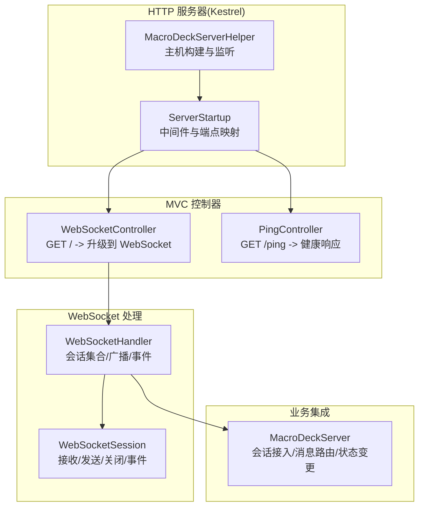
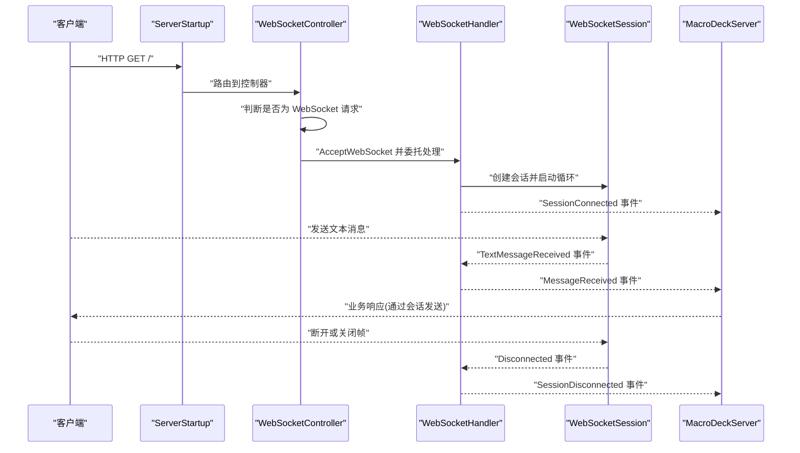
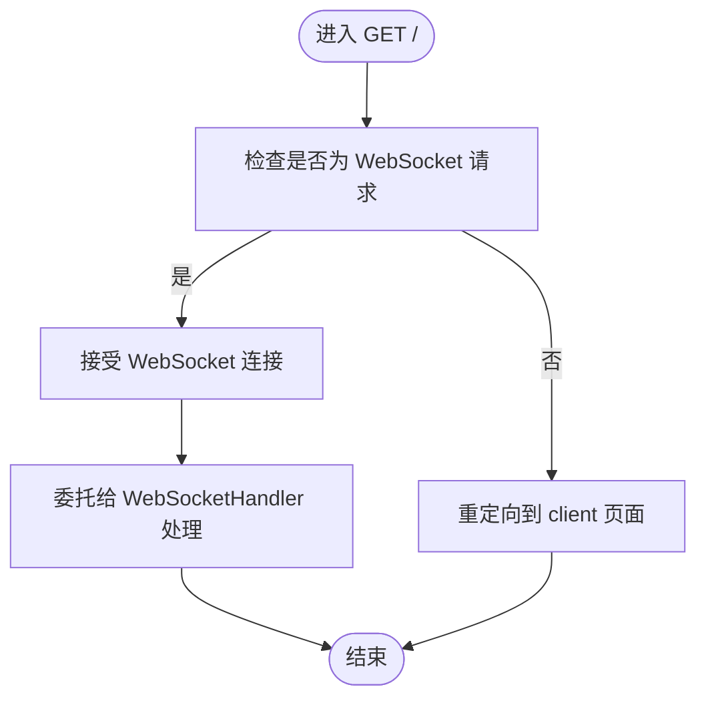
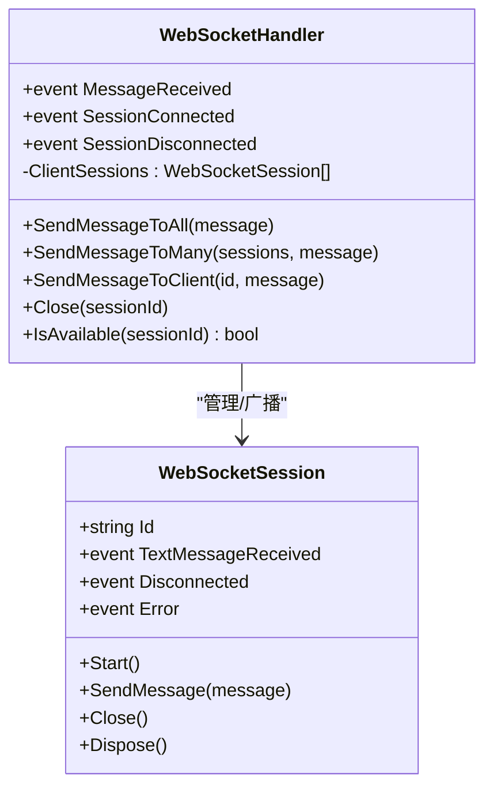
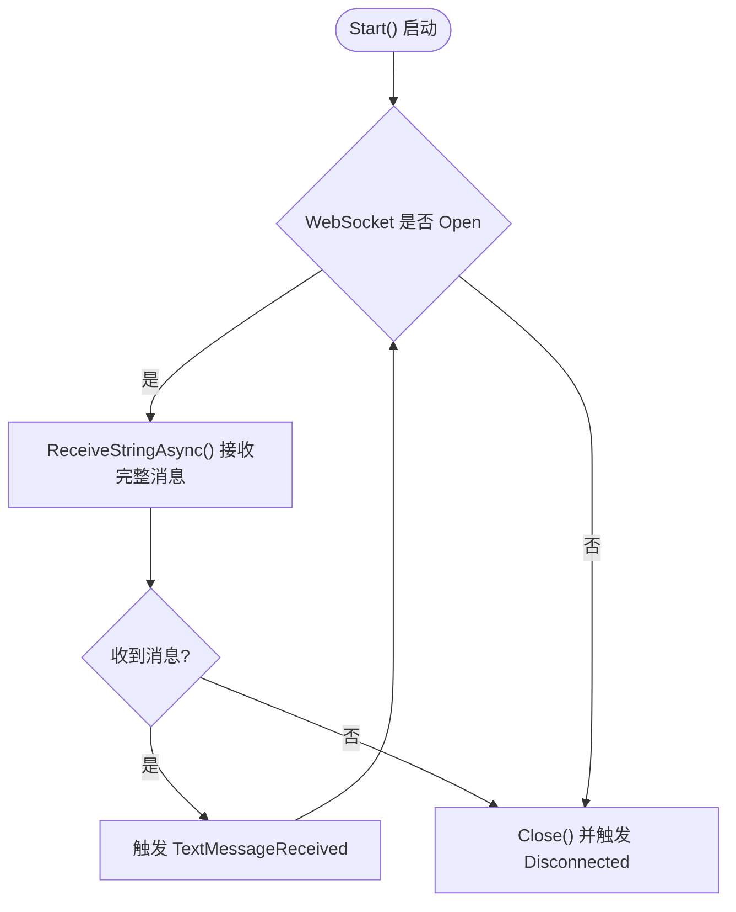
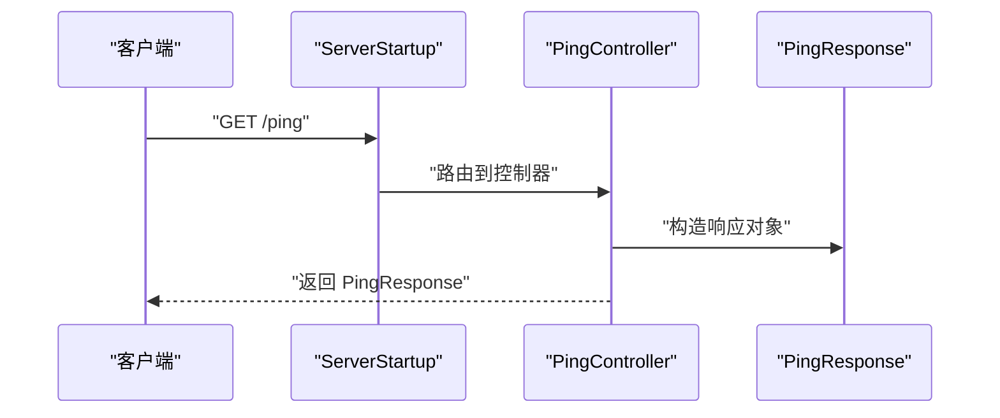
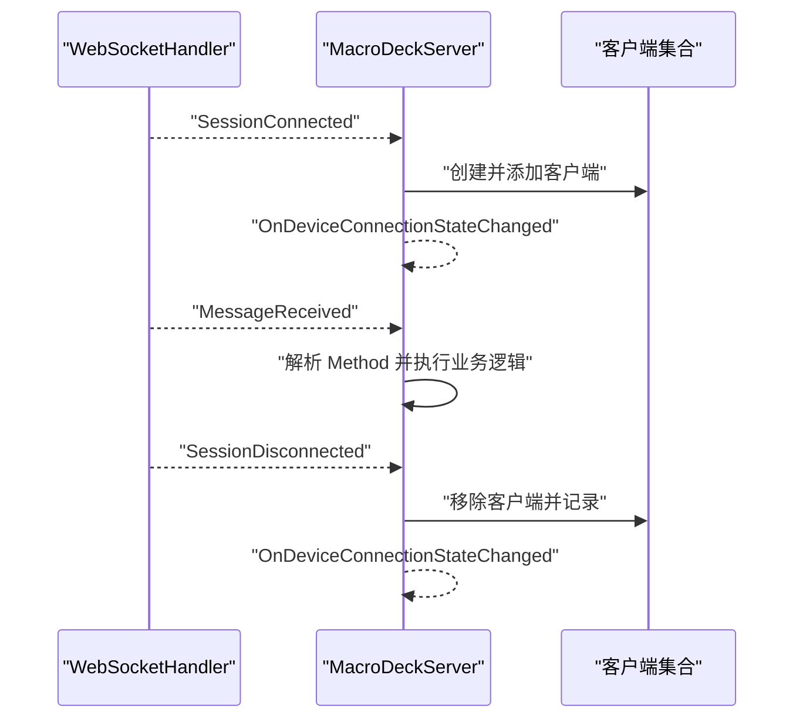
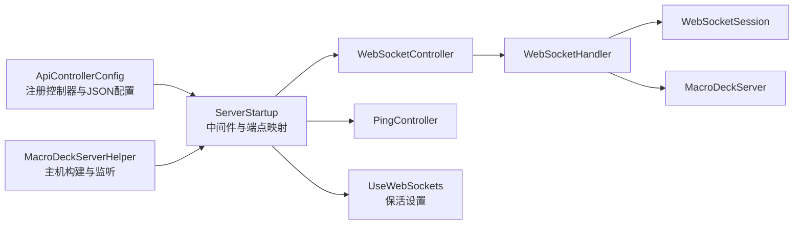

# 控制器系统

<cite>
**本文引用的文件**
- [WebSocketController.cs](file://src/MacroDeck/Controllers/WebSocketController.cs)
- [PingController.cs](file://src/MacroDeck/Controllers/PingController.cs)
- [WebSocketHandler.cs](file://src/MacroDeck/WebSocketHandler.cs)
- [WebSocketSession.cs](file://src/MacroDeck/DataTypes/WebSocketSession.cs)
- [PingResponse.cs](file://src/MacroDeck/DataTypes/PingResponse.cs)
- [WebSocketCloseReason.cs](file://src/MacroDeck/DataTypes/WebSocketCloseReason.cs)
- [ServerStartup.cs](file://src/MacroDeck/ServerStartup.cs)
- [ApiControllerConfig.cs](file://src/MacroDeck/StartupConfig/ApiControllerConfig.cs)
- [MacroDeckServer.cs](file://src/MacroDeck/Server/MacroDeckServer.cs)
- [MacroDeckServerHelper.cs](file://src/MacroDeck/MacroDeckServerHelper.cs)
</cite>

## 目录
1. [简介](#简介)
2. [项目结构](#项目结构)
3. [核心组件](#核心组件)
4. [架构总览](#架构总览)
5. [详细组件分析](#详细组件分析)
6. [依赖关系分析](#依赖关系分析)
7. [性能考量](#性能考量)
8. [故障排查指南](#故障排查指南)
9. [结论](#结论)
10. [附录](#附录)

## 简介
本文件面向 Macro-Deck 的控制器系统，聚焦于以下目标：
- 深入解释控制器架构设计、请求路由与响应处理机制
- 详细说明 WebSocketController 的实现：连接管理、消息分发与状态同步
- 记录 PingController 的心跳检测功能：ping/pong 机制与连接健康检查
- 提供控制器的扩展机制：自定义控制器的开发与注册流程
- 给出实际代码示例路径，展示控制器的使用模式与最佳实践
- 解释控制器与服务器其他组件的协作关系，以及控制器系统的可扩展性设计

## 项目结构
控制器系统由 ASP.NET Core MVC 控制器与 WebSocket 处理管线共同组成，并通过 Kestrel 服务器对外提供 REST 与 WebSocket 服务。核心文件分布如下：
- 控制器层：WebSocketController（REST 入口）、PingController（健康检查）
- WebSocket 层：WebSocketHandler（会话管理与广播）、WebSocketSession（单连接收发与生命周期）
- 启动配置：ServerStartup（中间件与端点映射）、ApiControllerConfig（控制器注册与 JSON 配置）
- 服务器集成：MacroDeckServer（业务事件桥接）、MacroDeckServerHelper（Kestrel 主机构建）

图表来源
- [ServerStartup.cs:15-31](file://src/MacroDeck/ServerStartup.cs#L15-L31)
- [MacroDeckServerHelper.cs:15-48](file://src/MacroDeck/MacroDeckServerHelper.cs#L15-L48)
- [WebSocketController.cs:7-19](file://src/MacroDeck/Controllers/WebSocketController.cs#L7-L19)
- [PingController.cs:6-14](file://src/MacroDeck/Controllers/PingController.cs#L6-L14)
- [WebSocketHandler.cs:37-49](file://src/MacroDeck/WebSocketHandler.cs#L37-L49)
- [WebSocketSession.cs:20-49](file://src/MacroDeck/DataTypes/WebSocketSession.cs#L20-L49)
- [MacroDeckServer.cs:34-55](file://src/MacroDeck/Server/MacroDeckServer.cs#L34-L55)

章节来源
- [ServerStartup.cs:15-31](file://src/MacroDeck/ServerStartup.cs#L15-L31)
- [MacroDeckServerHelper.cs:15-48](file://src/MacroDeck/MacroDeckServerHelper.cs#L15-L48)
- [ApiControllerConfig.cs:9-31](file://src/MacroDeck/StartupConfig/ApiControllerConfig.cs#L9-L31)

## 核心组件
- WebSocketController：REST 控制器，负责将 HTTP 请求升级为 WebSocket 连接，并交由 WebSocketHandler 处理
- PingController：REST 控制器，提供 /ping 接口返回 PingResponse，用于健康检查
- WebSocketHandler：静态类，维护会话列表，提供广播、定向发送、会话关闭与事件派发
- WebSocketSession：封装单个 WebSocket 连接，负责文本消息接收、发送、关闭与异常处理
- ServerStartup：ASP.NET Core 启动配置，启用 CORS、静态文件、WebSocket、路由与控制器端点
- ApiControllerConfig：注册 REST 控制器装配，配置 JSON 序列化选项
- MacroDeckServer：服务器业务入口，订阅 WebSocketHandler 事件，完成客户端接入、消息路由与状态变更通知

章节来源
- [WebSocketController.cs:5-20](file://src/MacroDeck/Controllers/WebSocketController.cs#L5-L20)
- [PingController.cs:7-14](file://src/MacroDeck/Controllers/PingController.cs#L7-L14)
- [WebSocketHandler.cs:6-91](file://src/MacroDeck/WebSocketHandler.cs#L6-L91)
- [WebSocketSession.cs:5-119](file://src/MacroDeck/DataTypes/WebSocketSession.cs#L5-L119)
- [ServerStartup.cs:8-31](file://src/MacroDeck/ServerStartup.cs#L8-L31)
- [ApiControllerConfig.cs:7-32](file://src/MacroDeck/StartupConfig/ApiControllerConfig.cs#L7-L32)
- [MacroDeckServer.cs:16-152](file://src/MacroDeck/Server/MacroDeckServer.cs#L16-L152)

## 架构总览
控制器系统采用“REST 控制器 + WebSocket 处理器”的双通道架构：
- REST 控制器负责协议升级与健康检查
- WebSocket 处理器负责长连接的会话管理、消息分发与事件桥接
- 服务器启动时初始化 Kestrel，启用 WebSocket 保活与控制器端点映射

图表来源
- [WebSocketController.cs:9-18](file://src/MacroDeck/Controllers/WebSocketController.cs#L9-L18)
- [WebSocketHandler.cs:37-49](file://src/MacroDeck/WebSocketHandler.cs#L37-L49)
- [WebSocketSession.cs:20-49](file://src/MacroDeck/DataTypes/WebSocketSession.cs#L20-L49)
- [MacroDeckServer.cs:57-110](file://src/MacroDeck/Server/MacroDeckServer.cs#L57-L110)

## 详细组件分析

### WebSocketController 分析
- 路由与升级：控制器在根路径提供 GET 方法，若非 WebSocket 请求则重定向到前端；否则接受升级并转交 WebSocketHandler
- 返回值：升级后返回空结果，后续通过 WebSocket 生命周期处理

图表来源
- [WebSocketController.cs:9-18](file://src/MacroDeck/Controllers/WebSocketController.cs#L9-L18)

章节来源
- [WebSocketController.cs:5-20](file://src/MacroDeck/Controllers/WebSocketController.cs#L5-L20)

### WebSocketHandler 分析
- 会话管理：维护会话列表，新增/移除时触发连接/断开事件
- 广播与定向：支持向所有会话或指定会话 ID 发送消息
- 事件桥接：将底层会话事件上抛，供服务器侧订阅

图表来源
- [WebSocketHandler.cs:6-91](file://src/MacroDeck/WebSocketHandler.cs#L6-L91)
- [WebSocketSession.cs:5-119](file://src/MacroDeck/DataTypes/WebSocketSession.cs#L5-L119)

章节来源
- [WebSocketHandler.cs:6-91](file://src/MacroDeck/WebSocketHandler.cs#L6-L91)

### WebSocketSession 分析
- 生命周期：内部循环持续接收消息，遇到关闭或异常时清理并触发断开事件
- 消息模型：仅支持文本消息；发送时以 UTF-8 编码并标记为消息结束
- 关闭策略：支持通用关闭与带原因的关闭

图表来源
- [WebSocketSession.cs:20-49](file://src/MacroDeck/DataTypes/WebSocketSession.cs#L20-L49)
- [WebSocketSession.cs:51-76](file://src/MacroDeck/DataTypes/WebSocketSession.cs#L51-L76)

章节来源
- [WebSocketSession.cs:5-119](file://src/MacroDeck/DataTypes/WebSocketSession.cs#L5-L119)

### PingController 分析
- 路由：/ping
- 行为：返回 PingResponse，其中包含机器名信息，用于快速检测服务器可用性

图表来源
- [PingController.cs:6-14](file://src/MacroDeck/Controllers/PingController.cs#L6-L14)
- [PingResponse.cs:3-12](file://src/MacroDeck/DataTypes/PingResponse.cs#L3-12)

章节来源
- [PingController.cs:7-14](file://src/MacroDeck/Controllers/PingController.cs#L7-L14)
- [PingResponse.cs:3-12](file://src/MacroDeck/DataTypes/PingResponse.cs#L3-12)

### 宏观消息流与状态同步
- 会话接入：WebSocketHandler 触发 SessionConnected，MacroDeckServer 将其登记为客户端并触发设备连接状态变化
- 消息路由：WebSocketHandler 触发 MessageReceived，MacroDeckServer 解析方法类型并执行相应逻辑
- 断开处理：WebSocketHandler 触发 SessionDisconnected，MacroDeckServer 移除客户端并记录日志

图表来源
- [WebSocketHandler.cs:37-49](file://src/MacroDeck/WebSocketHandler.cs#L37-L49)
- [MacroDeckServer.cs:74-110](file://src/MacroDeck/Server/MacroDeckServer.cs#L74-L110)

章节来源
- [MacroDeckServer.cs:57-110](file://src/MacroDeck/Server/MacroDeckServer.cs#L57-L110)

## 依赖关系分析
- 控制器注册：ApiControllerConfig 将控制器装配到指定程序集，启用 MVC 与 JSON 序列化配置
- 中间件链路：ServerStartup 启用 CORS、HTTPS、静态文件、WebSocket 保活与控制器端点映射
- 服务器集成：MacroDeckServerHelper 构建 Kestrel 主机，按需启用 HTTPS 与监听端口

图表来源
- [ApiControllerConfig.cs:9-31](file://src/MacroDeck/StartupConfig/ApiControllerConfig.cs#L9-L31)
- [ServerStartup.cs:15-31](file://src/MacroDeck/ServerStartup.cs#L15-L31)
- [MacroDeckServerHelper.cs:15-48](file://src/MacroDeck/MacroDeckServerHelper.cs#L15-L48)

章节来源
- [ApiControllerConfig.cs:9-31](file://src/MacroDeck/StartupConfig/ApiControllerConfig.cs#L9-L31)
- [ServerStartup.cs:15-31](file://src/MacroDeck/ServerStartup.cs#L15-L31)
- [MacroDeckServerHelper.cs:15-48](file://src/MacroDeck/MacroDeckServerHelper.cs#L15-L48)

## 性能考量
- 并行广播：WebSocketHandler 使用 Task.WhenAll 对多个会话并发发送，提升广播效率
- 保活间隔：ServerStartup 设置 WebSocket 保活周期为 2 分钟，有助于维持长连接稳定
- 文本消息处理：WebSocketSession 逐帧拼接完整消息，避免大消息拆分带来的复杂度
- 会话集合访问：使用锁保护会话列表的增删操作，降低并发风险

章节来源
- [WebSocketHandler.cs:19-24](file://src/MacroDeck/WebSocketHandler.cs#L19-L24)
- [ServerStartup.cs:24-27](file://src/MacroDeck/ServerStartup.cs#L24-L27)
- [WebSocketSession.cs:51-76](file://src/MacroDeck/DataTypes/WebSocketSession.cs#L51-L76)
- [WebSocketHandler.cs:42-45](file://src/MacroDeck/WebSocketHandler.cs#L42-L45)

## 故障排查指南
- WebSocket 升级失败
  - 现象：客户端无法从 HTTP GET / 升级为 WebSocket
  - 排查：确认请求头与路径正确；检查 ServerStartup 的 UseWebSockets 是否启用
  - 参考路径：[WebSocketController.cs:9-18](file://src/MacroDeck/Controllers/WebSocketController.cs#L9-L18)，[ServerStartup.cs:24-27](file://src/MacroDeck/ServerStartup.cs#L24-L27)
- 消息未到达
  - 现象：客户端发送消息后无响应
  - 排查：确认 WebSocketHandler 的 MessageReceived 事件是否被订阅；检查会话是否仍处于 Open 状态
  - 参考路径：[WebSocketHandler.cs:8-10](file://src/MacroDeck/WebSocketHandler.cs#L8-L10)，[WebSocketSession.cs:29-38](file://src/MacroDeck/DataTypes/WebSocketSession.cs#L29-L38)
- 连接频繁断开
  - 现象：连接在短时间内反复断开
  - 排查：检查客户端网络稳定性；查看 WebSocketSession 的 Error 事件；确认保活间隔设置
  - 参考路径：[WebSocketSession.cs:40-48](file://src/MacroDeck/DataTypes/WebSocketSession.cs#L40-L48)，[ServerStartup.cs:24-27](file://src/MacroDeck/ServerStartup.cs#L24-L27)
- 健康检查失败
  - 现象：/ping 无响应或返回错误
  - 排查：确认 PingController 已注册并映射到 /ping；检查控制器返回的 PingResponse 结构
  - 参考路径：[PingController.cs:6-14](file://src/MacroDeck/Controllers/PingController.cs#L6-L14)，[PingResponse.cs:3-12](file://src/MacroDeck/DataTypes/PingResponse.cs#L3-12)

章节来源
- [WebSocketController.cs:9-18](file://src/MacroDeck/Controllers/WebSocketController.cs#L9-L18)
- [WebSocketHandler.cs:8-10](file://src/MacroDeck/WebSocketHandler.cs#L8-L10)
- [WebSocketSession.cs:29-48](file://src/MacroDeck/DataTypes/WebSocketSession.cs#L29-L48)
- [ServerStartup.cs:24-27](file://src/MacroDeck/ServerStartup.cs#L24-L27)
- [PingController.cs:6-14](file://src/MacroDeck/Controllers/PingController.cs#L6-L14)
- [PingResponse.cs:3-12](file://src/MacroDeck/DataTypes/PingResponse.cs#L3-12)

## 结论
控制器系统通过清晰的职责划分与事件驱动架构，实现了 REST 与 WebSocket 的无缝衔接。WebSocketController 负责协议升级，WebSocketHandler 负责会话与消息管理，PingController 提供健康检查能力。配合 ServerStartup 与 MacroDeckServerHelper 的配置，系统具备良好的可扩展性与可维护性。

## 附录

### 扩展机制：自定义控制器开发与注册
- 开发步骤
  - 新建控制器类，继承 ControllerBase，并使用 Route 特性声明路由
  - 在控制器中编写 Action 方法，返回合适的响应类型
  - 在 ApiControllerConfig 中确保控制器所在程序集被加入应用部件
- 注册流程
  - 在 ServerStartup 的 ConfigureServices 中调用 RegisterRestApiControllers
  - 确保 AddMvc 与 AddControllers 已启用
  - 通过 UseEndpoints 映射控制器端点
- 最佳实践
  - 使用强类型响应模型，便于前后端契约一致
  - 对外部输入进行参数校验与异常捕获
  - 对于长连接场景，优先使用 WebSocketHandler 与 WebSocketSession

章节来源
- [ApiControllerConfig.cs:9-31](file://src/MacroDeck/StartupConfig/ApiControllerConfig.cs#L9-L31)
- [ServerStartup.cs:10-30](file://src/MacroDeck/ServerStartup.cs#L10-L30)

### 实际使用模式与示例路径
- 升级到 WebSocket
  - 客户端发起 HTTP GET /，控制器判断并升级
  - 示例路径：[WebSocketController.cs:9-18](file://src/MacroDeck/Controllers/WebSocketController.cs#L9-L18)
- 健康检查
  - 客户端发起 GET /ping，控制器返回 PingResponse
  - 示例路径：[PingController.cs:6-14](file://src/MacroDeck/Controllers/PingController.cs#L6-L14)，[PingResponse.cs:3-12](file://src/MacroDeck/DataTypes/PingResponse.cs#L3-12)
- 广播消息
  - 服务器侧通过 WebSocketHandler 向所有会话发送消息
  - 示例路径：[WebSocketHandler.cs:14-24](file://src/MacroDeck/WebSocketHandler.cs#L14-L24)
- 定向发送
  - 服务器侧根据会话 ID 向特定客户端发送消息
  - 示例路径：[WebSocketHandler.cs:26-35](file://src/MacroDeck/WebSocketHandler.cs#L26-L35)
- 会话接入与断开
  - 服务器侧订阅 SessionConnected/SessionDisconnected 事件，维护客户端集合
  - 示例路径：[WebSocketHandler.cs:37-49](file://src/MacroDeck/WebSocketHandler.cs#L37-L49)，[MacroDeckServer.cs:74-110](file://src/MacroDeck/Server/MacroDeckServer.cs#L74-L110)