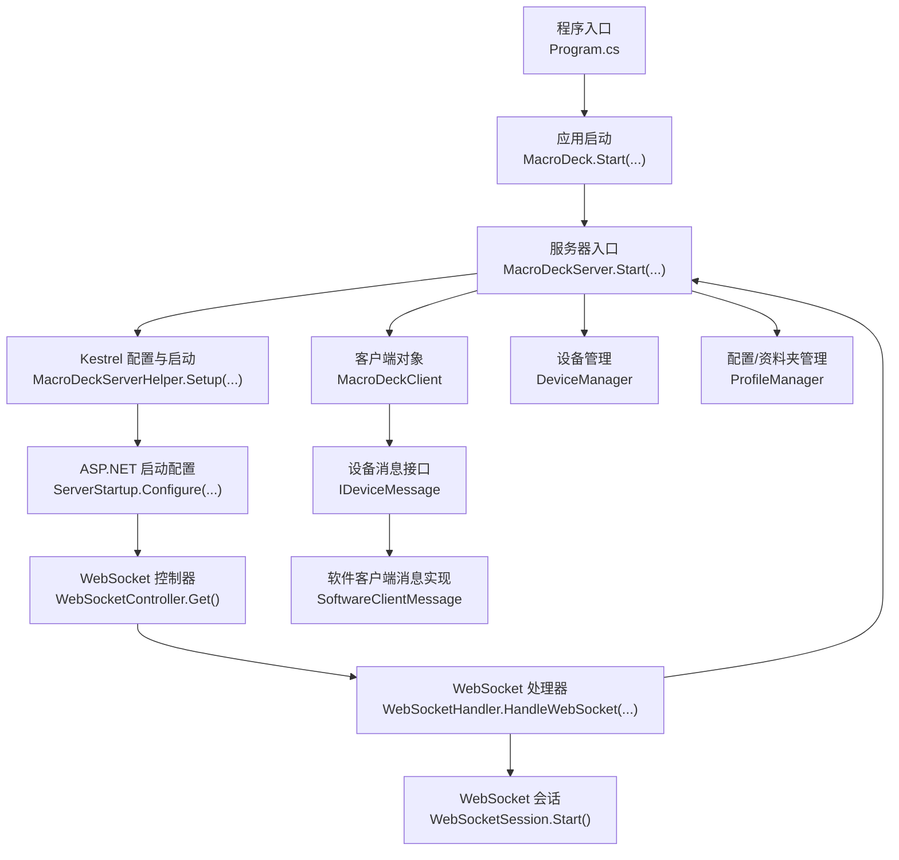
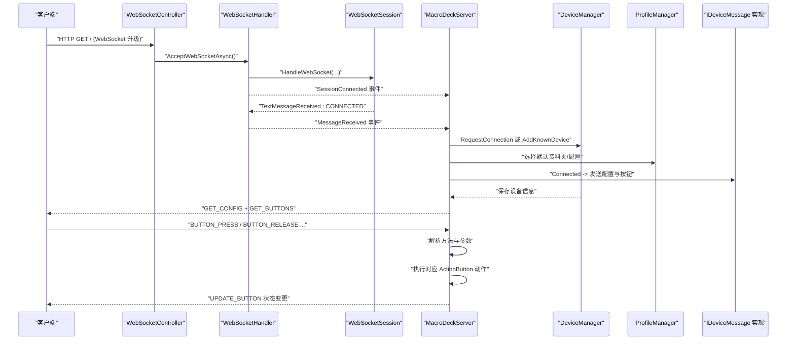
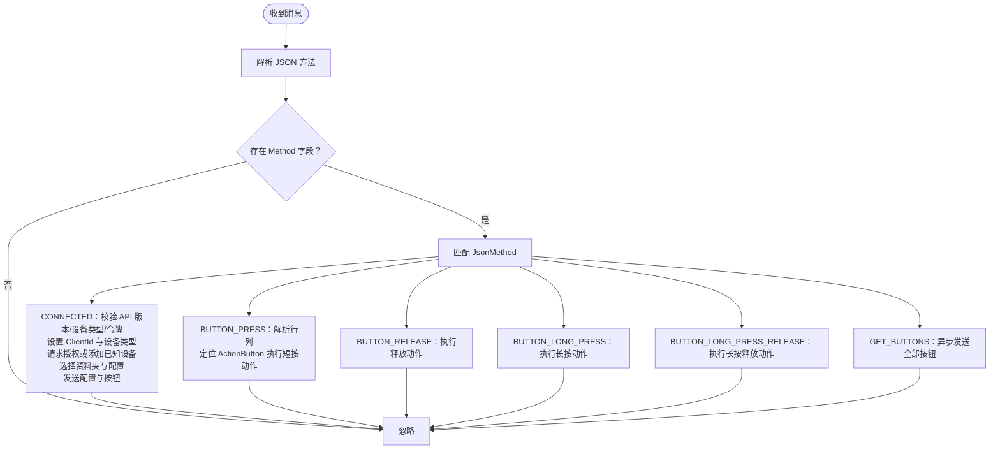
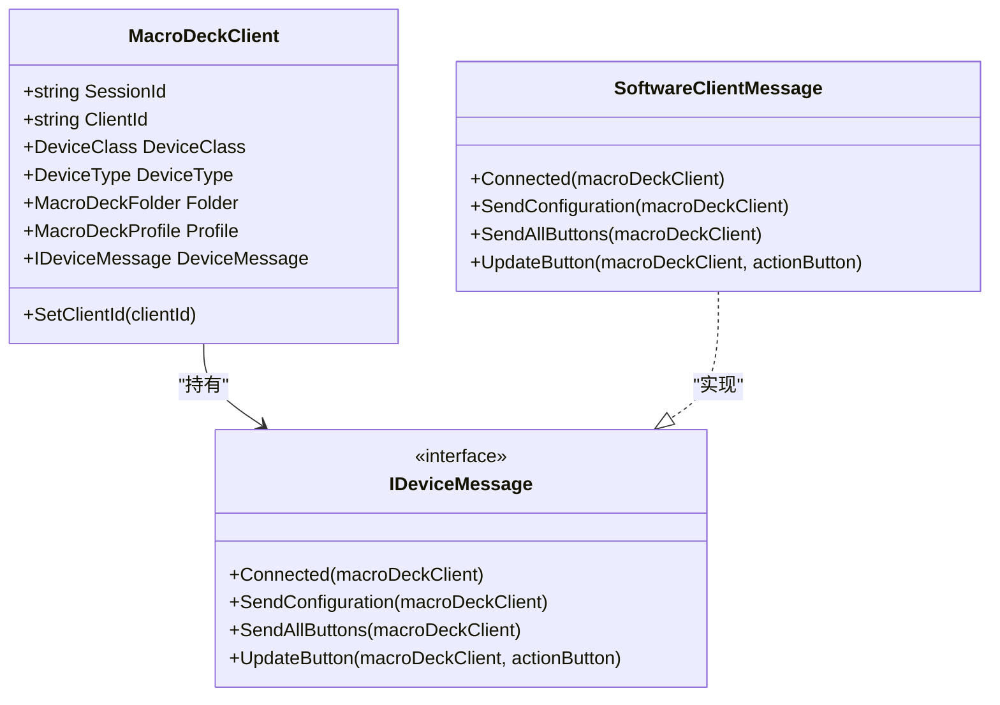
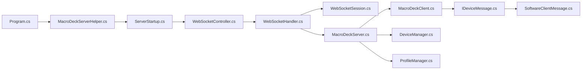

# 服务器系统

<cite>
**本文引用的文件**
- [MacroDeckServer.cs](file://src/MacroDeck/Server/MacroDeckServer.cs)
- [WebSocketController.cs](file://src/MacroDeck/Controllers/WebSocketController.cs)
- [WebSocketHandler.cs](file://src/MacroDeck/WebSocketHandler.cs)
- [WebSocketSession.cs](file://src/MacroDeck/DataTypes/WebSocketSession.cs)
- [BroadcastServer.cs](file://src/MacroDeck/Server/BroadcastServer.cs)
- [MacroDeckClient.cs](file://src/MacroDeck/Server/MacroDeckClient.cs)
- [MacroDeckServerHelper.cs](file://src/MacroDeck/MacroDeckServerHelper.cs)
- [ServerStartup.cs](file://src/MacroDeck/ServerStartup.cs)
- [JsonMethod.cs](file://src/MacroDeck/JSON/JsonMethod.cs)
- [IDeviceMessage.cs](file://src/MacroDeck/Server/DeviceMessage/IDeviceMessage.cs)
- [SoftwareClientMessage.cs](file://src/MacroDeck/Server/DeviceMessage/SoftwareClientMessage.cs)
- [DeviceManager.cs](file://src/MacroDeck/Device/DeviceManager.cs)
- [ProfileManager.cs](file://src/MacroDeck/Profiles/ProfileManager.cs)
- [Program.cs](file://src/MacroDeck/Program.cs)
- [WebSocketCloseReason.cs](file://src/MacroDeck/DataTypes/WebSocketCloseReason.cs)
- [WebSocketNormalClose.cs](file://src/MacroDeck/DataTypes/WebSocketNormalClose.cs)
</cite>

## 目录
1. [简介](#简介)
2. [项目结构](#项目结构)
3. [核心组件](#核心组件)
4. [架构总览](#架构总览)
5. [详细组件分析](#详细组件分析)
6. [依赖关系分析](#依赖关系分析)
7. [性能考虑](#性能考虑)
8. [故障排除指南](#故障排除指南)
9. [结论](#结论)
10. [附录](#附录)

## 简介
本文件面向 Macro-Deck 的服务器系统，聚焦于 WebSocket 服务器的实现细节、设备连接管理与消息处理机制。内容涵盖服务器启动流程、客户端连接建立、消息路由与状态同步；详细说明 WebSocket 协议实现（连接处理、消息格式、事件类型与实时交互模式）；提供配置选项、性能优化与错误处理策略，并给出与 GUI 界面及插件系统的集成说明。文档既适合初学者理解整体概念，也为有经验的开发者提供足够的技术深度。

## 项目结构
服务器系统围绕 ASP.NET Core Kestrel 构建，使用自定义 WebSocket 处理器与会话模型，配合设备与配置管理模块，形成从连接接入到按钮事件触发的完整链路。

图示来源
- [Program.cs:13-35](file://src/MacroDeck/Program.cs#L13-L35)
- [MacroDeckServer.cs:28-55](file://src/MacroDeck/Server/MacroDeckServer.cs#L28-L55)
- [MacroDeckServerHelper.cs:15-48](file://src/MacroDeck/MacroDeckServerHelper.cs#L15-L48)
- [ServerStartup.cs:15-30](file://src/MacroDeck/ServerStartup.cs#L15-L30)
- [WebSocketController.cs:7-19](file://src/MacroDeck/Controllers/WebSocketController.cs#L7-L19)
- [WebSocketHandler.cs:37-49](file://src/MacroDeck/WebSocketHandler.cs#L37-L49)
- [WebSocketSession.cs:20-49](file://src/MacroDeck/DataTypes/WebSocketSession.cs#L20-L49)
- [MacroDeckClient.cs:8-52](file://src/MacroDeck/Server/MacroDeckClient.cs#L8-L52)
- [IDeviceMessage.cs:3-9](file://src/MacroDeck/Server/DeviceMessage/IDeviceMessage.cs#L3-L9)
- [SoftwareClientMessage.cs:10-23](file://src/MacroDeck/Server/DeviceMessage/SoftwareClientMessage.cs#L10-L23)

章节来源
- [Program.cs:13-35](file://src/MacroDeck/Program.cs#L13-L35)
- [MacroDeckServer.cs:28-55](file://src/MacroDeck/Server/MacroDeckServer.cs#L28-L55)
- [MacroDeckServerHelper.cs:15-48](file://src/MacroDeck/MacroDeckServerHelper.cs#L15-L48)
- [ServerStartup.cs:15-30](file://src/MacroDeck/ServerStartup.cs#L15-L30)
- [WebSocketController.cs:7-19](file://src/MacroDeck/Controllers/WebSocketController.cs#L7-L19)
- [WebSocketHandler.cs:37-49](file://src/MacroDeck/WebSocketHandler.cs#L37-L49)
- [WebSocketSession.cs:20-49](file://src/MacroDeck/DataTypes/WebSocketSession.cs#L20-L49)
- [MacroDeckClient.cs:8-52](file://src/MacroDeck/Server/MacroDeckClient.cs#L8-L52)
- [IDeviceMessage.cs:3-9](file://src/MacroDeck/Server/DeviceMessage/IDeviceMessage.cs#L3-L9)
- [SoftwareClientMessage.cs:10-23](file://src/MacroDeck/Server/DeviceMessage/SoftwareClientMessage.cs#L10-L23)

## 核心组件
- 宏命令服务器入口：负责启动 Kestrel、注册 WebSocket 事件、解析消息、分发动作与状态更新。
- WebSocket 控制器：接收 HTTP 请求，升级为 WebSocket 并交由处理器处理。
- WebSocket 处理器与会话：维护会话列表、广播/单播发送、断开清理。
- 客户端对象：封装每个连接的会话 ID、设备类型、当前资料夹与配置。
- 设备消息接口与实现：按设备类型发送配置、按钮集合与增量更新。
- 设备与配置管理：持久化已知设备、请求授权、设置资料夹与配置。
- 广播服务：周期性向局域网广播本机信息，便于快速连接发现。

章节来源
- [MacroDeckServer.cs:16-376](file://src/MacroDeck/Server/MacroDeckServer.cs#L16-L376)
- [WebSocketController.cs:5-21](file://src/MacroDeck/Controllers/WebSocketController.cs#L5-L21)
- [WebSocketHandler.cs:6-92](file://src/MacroDeck/WebSocketHandler.cs#L6-L92)
- [WebSocketSession.cs:5-119](file://src/MacroDeck/DataTypes/WebSocketSession.cs#L5-L119)
- [MacroDeckClient.cs:8-53](file://src/MacroDeck/Server/MacroDeckClient.cs#L8-L53)
- [IDeviceMessage.cs:3-9](file://src/MacroDeck/Server/DeviceMessage/IDeviceMessage.cs#L3-L9)
- [SoftwareClientMessage.cs:10-194](file://src/MacroDeck/Server/DeviceMessage/SoftwareClientMessage.cs#L10-L194)
- [DeviceManager.cs:12-200](file://src/MacroDeck/Device/DeviceManager.cs#L12-L200)
- [ProfileManager.cs:20-200](file://src/MacroDeck/Profiles/ProfileManager.cs#L20-L200)
- [BroadcastServer.cs:8-79](file://src/MacroDeck/Server/BroadcastServer.cs#L8-L79)

## 架构总览
下图展示了从浏览器或移动端发起 WebSocket 连接，到服务器完成认证、下发配置与按钮数据，再到用户按键触发动作的完整时序。

图示来源
- [WebSocketController.cs:7-19](file://src/MacroDeck/Controllers/WebSocketController.cs#L7-L19)
- [WebSocketHandler.cs:37-49](file://src/MacroDeck/WebSocketHandler.cs#L37-L49)
- [WebSocketSession.cs:20-49](file://src/MacroDeck/DataTypes/WebSocketSession.cs#L20-L49)
- [MacroDeckServer.cs:57-244](file://src/MacroDeck/Server/MacroDeckServer.cs#L57-L244)
- [DeviceManager.cs:185-200](file://src/MacroDeck/Device/DeviceManager.cs#L185-L200)
- [ProfileManager.cs:27-30](file://src/MacroDeck/Profiles/ProfileManager.cs#L27-L30)
- [SoftwareClientMessage.cs:14-23](file://src/MacroDeck/Server/DeviceMessage/SoftwareClientMessage.cs#L14-L23)

## 详细组件分析

### WebSocket 服务器与控制器
- WebSocketController 提供根路径的 GET 接口，若非 WebSocket 请求则重定向到前端静态资源；若是，则接受升级并将连接交由 WebSocketHandler 处理。
- WebSocketHandler 维护会话列表，统一派发消息与断开事件，并支持对所有或指定会话进行消息广播。

章节来源
- [WebSocketController.cs:5-21](file://src/MacroDeck/Controllers/WebSocketController.cs#L5-L21)
- [WebSocketHandler.cs:6-92](file://src/MacroDeck/WebSocketHandler.cs#L6-L92)

### 会话模型与连接生命周期
- WebSocketSession 封装单个 WebSocket 连接，内部循环读取文本消息并在异常或关闭时触发断开事件，确保资源释放。
- 会话断开时，WebSocketHandler 清理会话列表并触发上层事件，以便服务器移除客户端实例。

章节来源
- [WebSocketSession.cs:5-119](file://src/MacroDeck/DataTypes/WebSocketSession.cs#L5-L119)
- [WebSocketHandler.cs:51-64](file://src/MacroDeck/WebSocketHandler.cs#L51-L64)

### 宏命令服务器入口与消息路由
- MacroDeckServer 负责：
  - 启动流程：加载已知设备、注册 WebSocket 事件、准备证书并启动 Kestrel。
  - 连接管理：在会话连接/断开时创建/移除 MacroDeckClient，并通过 DeviceManager 决定是否允许连接。
  - 消息路由：根据 JsonMethod 分发至不同处理分支，如 CONNECTED、BUTTON_PRESS、BUTTON_RELEASE、BUTTON_LONG_PRESS、BUTTON_LONG_PRESS_RELEASE、GET_BUTTONS 等。
  - 动作执行：根据按键类型定位 ActionButton 并触发对应动作集合。
  - 状态同步：更新按钮状态并向所有关注该按钮的客户端推送 UPDATE_BUTTON。

图示来源
- [MacroDeckServer.cs:123-244](file://src/MacroDeck/Server/MacroDeckServer.cs#L123-L244)
- [JsonMethod.cs:3-19](file://src/MacroDeck/JSON/JsonMethod.cs#L3-L19)

章节来源
- [MacroDeckServer.cs:28-55](file://src/MacroDeck/Server/MacroDeckServer.cs#L28-L55)
- [MacroDeckServer.cs:57-121](file://src/MacroDeck/Server/MacroDeckServer.cs#L57-L121)
- [MacroDeckServer.cs:123-244](file://src/MacroDeck/Server/MacroDeckServer.cs#L123-L244)
- [JsonMethod.cs:3-19](file://src/MacroDeck/JSON/JsonMethod.cs#L3-L19)

### 客户端对象与设备消息
- MacroDeckClient 记录会话 ID、设备类型、当前资料夹与配置，并根据设备类型选择对应的 IDeviceMessage 实现。
- IDeviceMessage 定义了连接后发送配置、发送全部按钮与更新单个按钮的标准接口。
- SoftwareClientMessage 实现了针对软件客户端的消息发送逻辑，包括按钮图标、标签与背景色的编码传输。

图示来源
- [MacroDeckClient.cs:8-53](file://src/MacroDeck/Server/MacroDeckClient.cs#L8-L53)
- [IDeviceMessage.cs:3-9](file://src/MacroDeck/Server/DeviceMessage/IDeviceMessage.cs#L3-L9)
- [SoftwareClientMessage.cs:10-194](file://src/MacroDeck/Server/DeviceMessage/SoftwareClientMessage.cs#L10-L194)

章节来源
- [MacroDeckClient.cs:8-53](file://src/MacroDeck/Server/MacroDeckClient.cs#L8-L53)
- [IDeviceMessage.cs:3-9](file://src/MacroDeck/Server/DeviceMessage/IDeviceMessage.cs#L3-L9)
- [SoftwareClientMessage.cs:14-192](file://src/MacroDeck/Server/DeviceMessage/SoftwareClientMessage.cs#L14-L192)

### 设备与配置管理
- DeviceManager 负责已知设备的加载、保存、授权请求与阻断控制；当设备可用时联动服务器设置其资料夹与配置。
- ProfileManager 管理资料夹与变量变化，支持窗口焦点切换自动切换资料夹，并在变量变化时批量刷新按钮标签。

章节来源
- [DeviceManager.cs:12-200](file://src/MacroDeck/Device/DeviceManager.cs#L12-L200)
- [ProfileManager.cs:20-200](file://src/MacroDeck/Profiles/ProfileManager.cs#L20-L200)

### 广播服务
- BroadcastServer 周期性向本地网络广播计算机名、IP 地址与端口，辅助快速连接发现。

章节来源
- [BroadcastServer.cs:8-79](file://src/MacroDeck/Server/BroadcastServer.cs#L8-L79)

## 依赖关系分析
服务器系统的关键依赖关系如下：

图示来源
- [Program.cs:34](file://src/MacroDeck/Program.cs#L34)
- [MacroDeckServerHelper.cs:24-48](file://src/MacroDeck/MacroDeckServerHelper.cs#L24-L48)
- [ServerStartup.cs:15-30](file://src/MacroDeck/ServerStartup.cs#L15-L30)
- [WebSocketController.cs:16](file://src/MacroDeck/Controllers/WebSocketController.cs#L16)
- [WebSocketHandler.cs:37-49](file://src/MacroDeck/WebSocketHandler.cs#L37-L49)
- [WebSocketSession.cs:20-49](file://src/MacroDeck/DataTypes/WebSocketSession.cs#L20-L49)
- [MacroDeckServer.cs:34-55](file://src/MacroDeck/Server/MacroDeckServer.cs#L34-L55)
- [MacroDeckClient.cs:8-53](file://src/MacroDeck/Server/MacroDeckClient.cs#L8-L53)
- [IDeviceMessage.cs:3-9](file://src/MacroDeck/Server/DeviceMessage/IDeviceMessage.cs#L3-L9)
- [SoftwareClientMessage.cs:10-194](file://src/MacroDeck/Server/DeviceMessage/SoftwareClientMessage.cs#L10-L194)

章节来源
- [Program.cs:34](file://src/MacroDeck/Program.cs#L34)
- [MacroDeckServerHelper.cs:24-48](file://src/MacroDeck/MacroDeckServerHelper.cs#L24-L48)
- [ServerStartup.cs:15-30](file://src/MacroDeck/ServerStartup.cs#L15-L30)
- [WebSocketController.cs:16](file://src/MacroDeck/Controllers/WebSocketController.cs#L16)
- [WebSocketHandler.cs:37-49](file://src/MacroDeck/WebSocketHandler.cs#L37-L49)
- [WebSocketSession.cs:20-49](file://src/MacroDeck/DataTypes/WebSocketSession.cs#L20-L49)
- [MacroDeckServer.cs:34-55](file://src/MacroDeck/Server/MacroDeckServer.cs#L34-L55)
- [MacroDeckClient.cs:8-53](file://src/MacroDeck/Server/MacroDeckClient.cs#L8-L53)
- [IDeviceMessage.cs:3-9](file://src/MacroDeck/Server/DeviceMessage/IDeviceMessage.cs#L3-L9)
- [SoftwareClientMessage.cs:10-194](file://src/MacroDeck/Server/DeviceMessage/SoftwareClientMessage.cs#L10-L194)

## 性能考虑
- 异步与并发
  - WebSocketHandler 使用并行发送任务以提升广播吞吐量。
  - MacroDeckServer 在处理按钮事件与状态更新时采用异步任务，避免阻塞主线程。
- 序列化与渲染
  - 按钮图标与标签在发送前进行预渲染与 Base64 编码，减少客户端重复计算。
- 资源管理
  - 会话断开时及时释放资源并清理会话列表，防止内存泄漏。
- 可扩展性
  - 通过 IDeviceMessage 抽象，可为不同设备类型提供专用消息实现，保持核心逻辑稳定。

章节来源
- [WebSocketHandler.cs:19-24](file://src/MacroDeck/WebSocketHandler.cs#L19-L24)
- [MacroDeckServer.cs:259-277](file://src/MacroDeck/Server/MacroDeckServer.cs#L259-L277)
- [SoftwareClientMessage.cs:32-97](file://src/MacroDeck/Server/DeviceMessage/SoftwareClientMessage.cs#L32-L97)

## 故障排除指南
- 启动失败
  - 若 Kestrel 启动异常，服务器会记录错误并通过消息框提示具体原因。检查端口占用、证书有效性与权限。
- 连接被拒绝
  - 当启用“阻止新连接”、连接数达到上限或当前无资料夹时，服务器会直接关闭连接。
- 消息格式错误
  - 未包含 Method 字段或 Method 无法解析时，服务器将忽略该消息。
- 按键事件异常
  - 按键坐标解析失败或 ActionButton 不存在时，服务器会记录警告但不中断后续处理。
- 断线与清理
  - 会话断开时，服务器会移除客户端并触发连接状态变更事件；若需要优雅关闭，可使用正常关闭原因。

章节来源
- [MacroDeckServer.cs:42-54](file://src/MacroDeck/Server/MacroDeckServer.cs#L42-L54)
- [MacroDeckServer.cs:82-88](file://src/MacroDeck/Server/MacroDeckServer.cs#L82-L88)
- [MacroDeckServer.cs:125-135](file://src/MacroDeck/Server/MacroDeckServer.cs#L125-L135)
- [MacroDeckServer.cs:234-237](file://src/MacroDeck/Server/MacroDeckServer.cs#L234-L237)
- [WebSocketSession.cs:40-48](file://src/MacroDeck/DataTypes/WebSocketSession.cs#L40-L48)
- [WebSocketNormalClose.cs:5-11](file://src/MacroDeck/DataTypes/WebSocketNormalClose.cs#L5-L11)

## 结论
Macro-Deck 的服务器系统以 ASP.NET Core 与自定义 WebSocket 处理器为核心，结合设备与配置管理模块，实现了从连接接入、认证授权、配置下发到按钮事件触发的全链路实时交互。通过清晰的事件驱动与异步处理，系统在保证稳定性的同时具备良好的可扩展性与性能表现。未来可在设备消息实现、广播协议与日志监控方面进一步增强。

## 附录

### WebSocket 协议与消息格式
- 协议版本：基于标准 WebSocket 文本帧，UTF-8 编码。
- 心跳：服务器设置 KeepAlive 间隔为 2 分钟。
- 关闭：支持正常关闭与异常关闭，异常关闭会抛出错误事件。

章节来源
- [ServerStartup.cs:24-27](file://src/MacroDeck/ServerStartup.cs#L24-L27)
- [WebSocketSession.cs:51-76](file://src/MacroDeck/DataTypes/WebSocketSession.cs#L51-L76)
- [WebSocketCloseReason.cs:5-15](file://src/MacroDeck/DataTypes/WebSocketCloseReason.cs#L5-L15)
- [WebSocketNormalClose.cs:5-11](file://src/MacroDeck/DataTypes/WebSocketNormalClose.cs#L5-L11)

### 事件类型与消息字段
- CONNECTED：用于首次握手，字段包括 Method、API、Client-Id、Device-Type、Token 等。
- BUTTON_PRESS / BUTTON_RELEASE / BUTTON_LONG_PRESS / BUTTON_LONG_PRESS_RELEASE：用于按键事件，Message 包含“行_列”的坐标字符串。
- GET_BUTTONS：请求下发当前资料夹的所有按钮。
- 其他方法：GET_CONFIG、UPDATE_BUTTON、GET_ICONS、UPDATE_LABEL、ICON_BASE64、BUTTON_DONE、GET_INSTALLED_PLUGINS、GET_INSTALLED_ICON_PACKS 等。

章节来源
- [JsonMethod.cs:3-19](file://src/MacroDeck/JSON/JsonMethod.cs#L3-L19)
- [MacroDeckServer.cs:141-199](file://src/MacroDeck/Server/MacroDeckServer.cs#L141-L199)
- [MacroDeckServer.cs:201-239](file://src/MacroDeck/Server/MacroDeckServer.cs#L201-L239)
- [MacroDeckServer.cs:240-242](file://src/MacroDeck/Server/MacroDeckServer.cs#L240-L242)

### 服务器配置选项
- 端口与 HTTPS：通过 MacroDeckServerHelper.Config 与 Kestrel ListenAnyIP 配置；启用证书时仅允许 HTTP/1。
- 快速设置令牌：随机生成，用于首次连接快速信任。
- 连接限制：可阻止新连接、限制最大连接数、要求存在资料夹。
- SSL 证书：运行时生成或加载现有证书，确保安全连接。

章节来源
- [MacroDeckServerHelper.cs:29-44](file://src/MacroDeck/MacroDeckServerHelper.cs#L29-L44)
- [MacroDeckServer.cs:26](file://src/MacroDeck/Server/MacroDeckServer.cs#L26)
- [MacroDeckServer.cs:82-88](file://src/MacroDeck/Server/MacroDeckServer.cs#L82-L88)

### 与 GUI 与插件系统的集成
- GUI 界面：通过静态资源文件服务器提供前端页面；WebSocket 控制器在非 WebSocket 请求时重定向到前端。
- 插件系统：消息方法中包含获取已安装插件与图标包的能力，便于客户端动态加载扩展资源。

章节来源
- [ServerStartup.cs:23](file://src/MacroDeck/ServerStartup.cs#L23)
- [WebSocketController.cs:11-14](file://src/MacroDeck/Controllers/WebSocketController.cs#L11-L14)
- [JsonMethod.cs:17-18](file://src/MacroDeck/JSON/JsonMethod.cs#L17-L18)