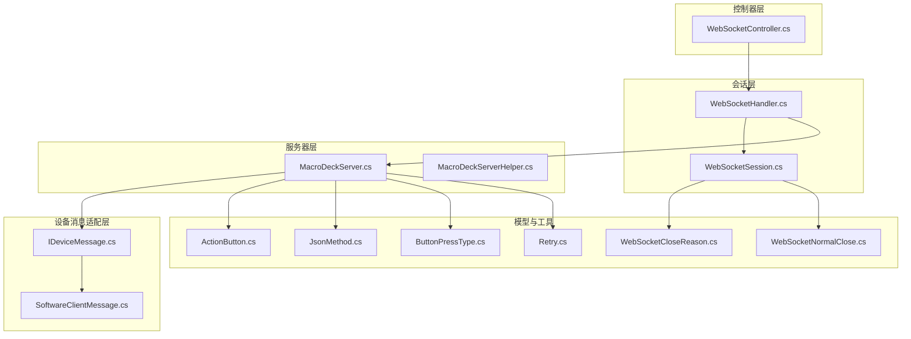
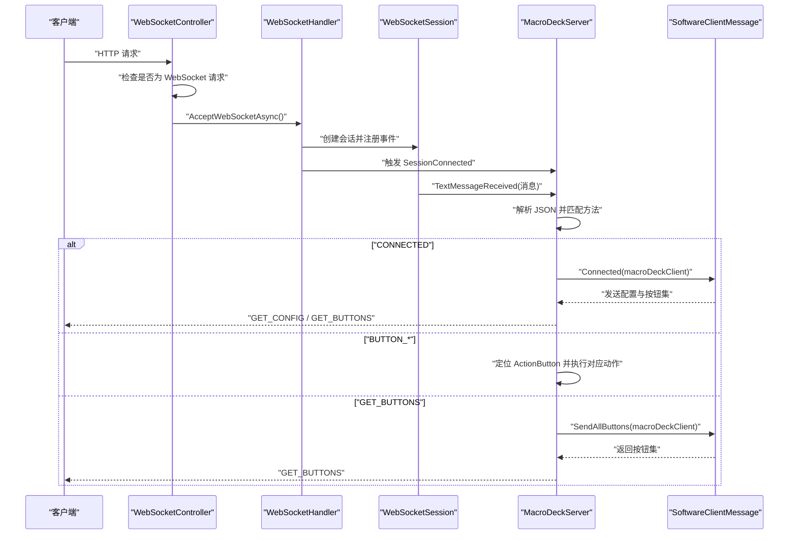
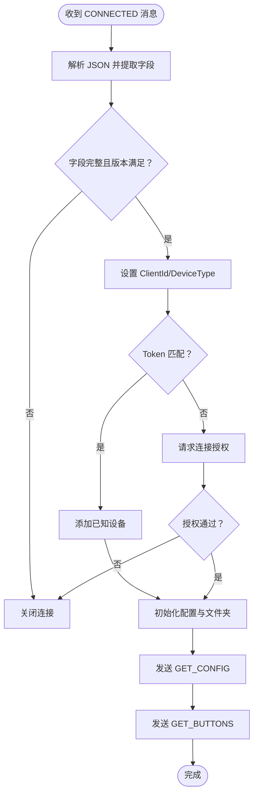
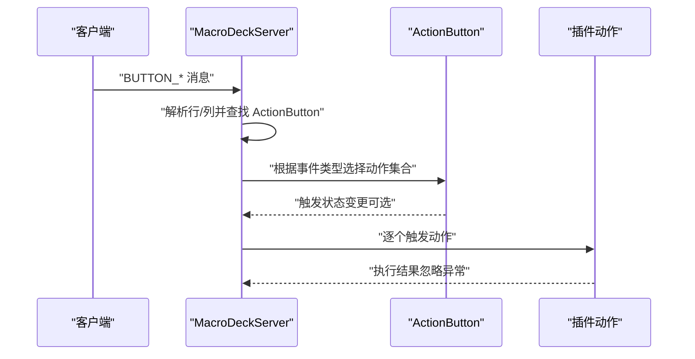
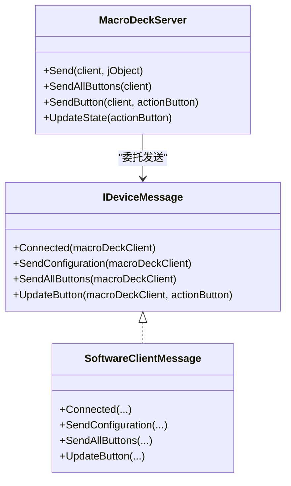
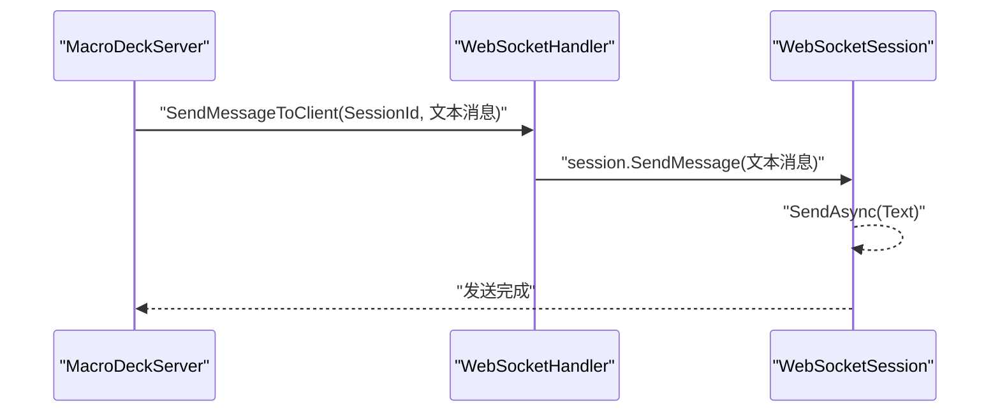
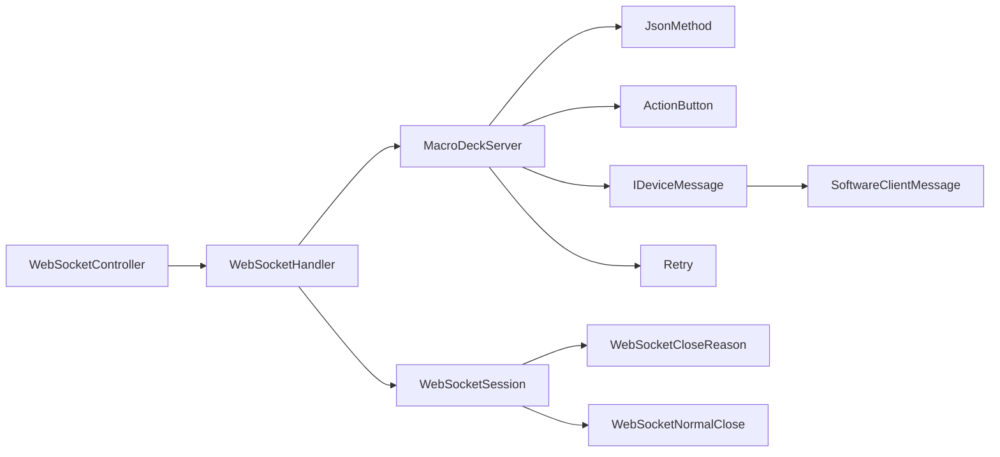

# 消息处理系统

<cite>
**本文引用的文件**
- [WebSocketHandler.cs](file://src/MacroDeck/WebSocketHandler.cs)
- [WebSocketSession.cs](file://src/MacroDeck/DataTypes/WebSocketSession.cs)
- [WebSocketController.cs](file://src/MacroDeck/Controllers/WebSocketController.cs)
- [JsonMethod.cs](file://src/MacroDeck/JSON/JsonMethod.cs)
- [MacroDeckServer.cs](file://src/MacroDeck/Server/MacroDeckServer.cs)
- [SoftwareClientMessage.cs](file://src/MacroDeck/Server/DeviceMessage/SoftwareClientMessage.cs)
- [IDeviceMessage.cs](file://src/MacroDeck/Server/DeviceMessage/IDeviceMessage.cs)
- [ActionButton.cs](file://src/MacroDeck/ActionButton/ActionButton.cs)
- [MacroDeckServerHelper.cs](file://src/MacroDeck/MacroDeckServerHelper.cs)
- [Retry.cs](file://src/MacroDeck/Utils/Retry.cs)
- [WebSocketCloseReason.cs](file://src/MacroDeck/DataTypes/WebSocketCloseReason.cs)
- [WebSocketNormalClose.cs](file://src/MacroDeck/DataTypes/WebSocketNormalClose.cs)
- [ButtonPressType.cs](file://src/MacroDeck/Enums/ButtonPressType.cs)
</cite>

## 目录
1. [简介](#简介)
2. [项目结构](#项目结构)
3. [核心组件](#核心组件)
4. [架构总览](#架构总览)
5. [详细组件分析](#详细组件分析)
6. [依赖关系分析](#依赖关系分析)
7. [性能考虑](#性能考虑)
8. [故障排查指南](#故障排查指南)
9. [结论](#结论)
10. [附录](#附录)

## 简介
本文件面向 Macro-Deck 的消息处理系统，系统基于 WebSocket 实现客户端与服务端之间的双向通信。消息采用 JSON 格式，通过方法枚举区分不同业务类型（如连接确认、按钮事件、配置请求等）。本文将从系统架构、数据流、处理逻辑、错误处理与性能优化等方面进行深入说明，并提供关键流程的时序图与类图，帮助读者快速理解与扩展。

## 项目结构
消息处理系统主要由以下模块构成：
- 控制器层：负责接受 HTTP 请求并升级为 WebSocket 连接
- 会话层：封装单个 WebSocket 会话，负责收发消息与生命周期管理
- 服务器层：统一接入消息分发、设备连接状态管理与按钮事件执行
- 设备消息适配层：针对不同设备类型（软件客户端）生成并发送设备所需的配置与按钮数据
- 按钮模型：承载按钮状态、标签、图标与动作绑定，驱动消息更新
- 工具与类型：消息方法枚举、按钮事件类型、关闭原因类型、重试工具等

图表来源
- [WebSocketController.cs:1-21](file://src/MacroDeck/Controllers/WebSocketController.cs#L1-L21)
- [WebSocketHandler.cs:1-92](file://src/MacroDeck/WebSocketHandler.cs#L1-L92)
- [WebSocketSession.cs:1-119](file://src/MacroDeck/DataTypes/WebSocketSession.cs#L1-L119)
- [MacroDeckServer.cs:1-376](file://src/MacroDeck/Server/MacroDeckServer.cs#L1-L376)
- [MacroDeckServerHelper.cs:1-50](file://src/MacroDeck/MacroDeckServerHelper.cs#L1-L50)
- [IDeviceMessage.cs:1-9](file://src/MacroDeck/Server/DeviceMessage/IDeviceMessage.cs#L1-L9)
- [SoftwareClientMessage.cs:1-194](file://src/MacroDeck/Server/DeviceMessage/SoftwareClientMessage.cs#L1-L194)
- [JsonMethod.cs:1-20](file://src/MacroDeck/JSON/JsonMethod.cs#L1-L20)
- [ActionButton.cs:1-198](file://src/MacroDeck/ActionButton/ActionButton.cs#L1-L198)
- [ButtonPressType.cs:1-9](file://src/MacroDeck/Enums/ButtonPressType.cs#L1-L9)
- [Retry.cs:1-64](file://src/MacroDeck/Utils/Retry.cs#L1-L64)
- [WebSocketCloseReason.cs:1-15](file://src/MacroDeck/DataTypes/WebSocketCloseReason.cs#L1-L15)
- [WebSocketNormalClose.cs:1-11](file://src/MacroDeck/DataTypes/WebSocketNormalClose.cs#L1-L11)

章节来源
- [WebSocketController.cs:1-21](file://src/MacroDeck/Controllers/WebSocketController.cs#L1-L21)
- [WebSocketHandler.cs:1-92](file://src/MacroDeck/WebSocketHandler.cs#L1-L92)
- [WebSocketSession.cs:1-119](file://src/MacroDeck/DataTypes/WebSocketSession.cs#L1-L119)
- [MacroDeckServer.cs:1-376](file://src/MacroDeck/Server/MacroDeckServer.cs#L1-L376)
- [MacroDeckServerHelper.cs:1-50](file://src/MacroDeck/MacroDeckServerHelper.cs#L1-L50)
- [IDeviceMessage.cs:1-9](file://src/MacroDeck/Server/DeviceMessage/IDeviceMessage.cs#L1-L9)
- [SoftwareClientMessage.cs:1-194](file://src/MacroDeck/Server/DeviceMessage/SoftwareClientMessage.cs#L1-L194)
- [JsonMethod.cs:1-20](file://src/MacroDeck/JSON/JsonMethod.cs#L1-L20)
- [ActionButton.cs:1-198](file://src/MacroDeck/ActionButton/ActionButton.cs#L1-L198)
- [ButtonPressType.cs:1-9](file://src/MacroDeck/Enums/ButtonPressType.cs#L1-L9)
- [Retry.cs:1-64](file://src/MacroDeck/Utils/Retry.cs#L1-L64)
- [WebSocketCloseReason.cs:1-15](file://src/MacroDeck/DataTypes/WebSocketCloseReason.cs#L1-L15)
- [WebSocketNormalClose.cs:1-11](file://src/MacroDeck/DataTypes/WebSocketNormalClose.cs#L1-L11)

## 核心组件
- WebSocketController：接收 HTTP 请求，判断是否为 WebSocket 升级请求，成功后交由 WebSocketHandler 处理
- WebSocketHandler：维护客户端会话列表，广播/定向发送消息，触发连接/断开事件
- WebSocketSession：封装单个连接的读写循环、异常与断开处理、消息发送
- MacroDeckServer：消息入口与分发中心，解析 JSON 方法、校验连接参数、执行按钮动作、管理客户端集合
- IDeviceMessage/SoftwareClientMessage：设备消息接口与软件客户端实现，负责发送配置、按钮集与单按钮更新
- ActionButton：按钮实体，持有状态、图标、标签与动作集合，驱动状态变更与按钮更新
- 工具与类型：JsonMethod 枚举定义消息方法；ButtonPressType 定义按钮事件类型；Retry 提供重试能力；WebSocketCloseReason/NormalClose 封装关闭语义

章节来源
- [WebSocketController.cs:1-21](file://src/MacroDeck/Controllers/WebSocketController.cs#L1-L21)
- [WebSocketHandler.cs:1-92](file://src/MacroDeck/WebSocketHandler.cs#L1-L92)
- [WebSocketSession.cs:1-119](file://src/MacroDeck/DataTypes/WebSocketSession.cs#L1-L119)
- [MacroDeckServer.cs:1-376](file://src/MacroDeck/Server/MacroDeckServer.cs#L1-L376)
- [IDeviceMessage.cs:1-9](file://src/MacroDeck/Server/DeviceMessage/IDeviceMessage.cs#L1-L9)
- [SoftwareClientMessage.cs:1-194](file://src/MacroDeck/Server/DeviceMessage/SoftwareClientMessage.cs#L1-L194)
- [ActionButton.cs:1-198](file://src/MacroDeck/ActionButton/ActionButton.cs#L1-L198)
- [JsonMethod.cs:1-20](file://src/MacroDeck/JSON/JsonMethod.cs#L1-L20)
- [ButtonPressType.cs:1-9](file://src/MacroDeck/Enums/ButtonPressType.cs#L1-L9)
- [Retry.cs:1-64](file://src/MacroDeck/Utils/Retry.cs#L1-L64)
- [WebSocketCloseReason.cs:1-15](file://src/MacroDeck/DataTypes/WebSocketCloseReason.cs#L1-L15)
- [WebSocketNormalClose.cs:1-11](file://src/MacroDeck/DataTypes/WebSocketNormalClose.cs#L1-L11)

## 架构总览
消息处理系统采用“控制器-会话-服务器-设备消息适配-模型”的分层设计。客户端通过 HTTP 升级为 WebSocket 后，由服务器统一接入消息，按方法枚举分派到具体处理逻辑，最终驱动按钮动作或向客户端推送配置与按钮数据。

图表来源
- [WebSocketController.cs:1-21](file://src/MacroDeck/Controllers/WebSocketController.cs#L1-L21)
- [WebSocketHandler.cs:1-92](file://src/MacroDeck/WebSocketHandler.cs#L1-L92)
- [WebSocketSession.cs:1-119](file://src/MacroDeck/DataTypes/WebSocketSession.cs#L1-L119)
- [MacroDeckServer.cs:123-244](file://src/MacroDeck/Server/MacroDeckServer.cs#L123-L244)
- [SoftwareClientMessage.cs:14-122](file://src/MacroDeck/Server/DeviceMessage/SoftwareClientMessage.cs#L14-L122)

## 详细组件分析

### JSON 消息格式与方法枚举
- 消息格式：以 JSON 对象表示，必须包含 Method 字段，用于标识消息类型
- 方法枚举：JsonMethod 定义了 CONNECTED、BUTTON_PRESS、BUTTON_RELEASE、BUTTON_LONG_PRESS、BUTTON_LONG_PRESS_RELEASE、GET_BUTTONS、GET_ICONS、UPDATE_BUTTON、UPDATE_LABEL、ICON_BASE64、GET_CONFIG、BUTTON_DONE、GET_INSTALLED_PLUGINS、GET_INSTALLED_ICON_PACKS 等
- 参数约定：不同方法需要携带特定字段（例如 CONNECTED 需要 API、Client-Id、Device-Type 等）

章节来源
- [JsonMethod.cs:1-20](file://src/MacroDeck/JSON/JsonMethod.cs#L1-L20)
- [MacroDeckServer.cs:123-244](file://src/MacroDeck/Server/MacroDeckServer.cs#L123-L244)

### 连接确认流程（CONNECTED）
- 入口：WebSocketSession 接收到客户端连接后的首次消息
- 校验：服务器解析 Method 并校验 API 版本、Client-Id、Device-Type 等
- 认证：若 Token 与 QuickSetupToken 匹配则自动信任设备；否则请求用户授权
- 初始化：设置设备配置、选择默认配置文件与文件夹，调用设备消息适配器发送配置与按钮集
- 事件：触发连接状态变化事件

图表来源
- [MacroDeckServer.cs:141-200](file://src/MacroDeck/Server/MacroDeckServer.cs#L141-L200)
- [SoftwareClientMessage.cs:14-122](file://src/MacroDeck/Server/DeviceMessage/SoftwareClientMessage.cs#L14-L122)

章节来源
- [MacroDeckServer.cs:141-200](file://src/MacroDeck/Server/MacroDeckServer.cs#L141-L200)
- [SoftwareClientMessage.cs:14-122](file://src/MacroDeck/Server/DeviceMessage/SoftwareClientMessage.cs#L14-L122)

### 按钮事件处理流程（BUTTON_*）
- 入口：BUTTON_PRESS、BUTTON_RELEASE、BUTTON_LONG_PRESS、BUTTON_LONG_PRESS_RELEASE
- 解析：从 Message 中解析行号与列号，定位 ActionButton
- 执行：根据事件类型选择对应的动作集合（Actions/ActionsRelease/ActionsLongPress/ActionsLongPressRelease），在后台线程逐个触发
- 错误处理：捕获执行异常并记录警告日志，避免影响后续动作

图表来源
- [MacroDeckServer.cs:201-239](file://src/MacroDeck/Server/MacroDeckServer.cs#L201-L239)
- [ActionButton.cs:114-128](file://src/MacroDeck/ActionButton/ActionButton.cs#L114-L128)

章节来源
- [MacroDeckServer.cs:201-239](file://src/MacroDeck/Server/MacroDeckServer.cs#L201-L239)
- [ActionButton.cs:114-128](file://src/MacroDeck/ActionButton/ActionButton.cs#L114-L128)

### 配置请求与按钮推送（GET_CONFIG / GET_BUTTONS）
- GET_CONFIG：服务器组装设备配置（行列数、间距、圆角、背景、亮度、自动连接、唤醒策略等），并通过设备消息适配器发送
- GET_BUTTONS：遍历当前文件夹中的 ActionButton，收集图标 Base64、标签 Base64、背景色与位置信息，批量发送
- 更新按钮：当按钮状态变化时，仅推送单个按钮的更新，减少带宽占用

图表来源
- [IDeviceMessage.cs:1-9](file://src/MacroDeck/Server/DeviceMessage/IDeviceMessage.cs#L1-L9)
- [SoftwareClientMessage.cs:10-194](file://src/MacroDeck/Server/DeviceMessage/SoftwareClientMessage.cs#L10-L194)
- [MacroDeckServer.cs:320-376](file://src/MacroDeck/Server/MacroDeckServer.cs#L320-L376)

章节来源
- [SoftwareClientMessage.cs:25-122](file://src/MacroDeck/Server/DeviceMessage/SoftwareClientMessage.cs#L25-L122)
- [MacroDeckServer.cs:320-376](file://src/MacroDeck/Server/MacroDeckServer.cs#L320-L376)

### 消息解析与参数验证
- JSON 解析：使用 Newtonsoft.Json 的 JObject 解析字符串消息
- 方法校验：通过 Enum.TryParse 将 Method 转换为 JsonMethod，不匹配则丢弃
- 参数校验：CONNECTED 需要 API、Client-Id、Device-Type 等字段，版本需满足最低要求；按钮事件需要 Message 中的行/列坐标
- 异常处理：解析与执行过程中捕获异常并记录日志，避免中断消息通道

章节来源
- [MacroDeckServer.cs:123-244](file://src/MacroDeck/Server/MacroDeckServer.cs#L123-L244)

### 消息发送机制与队列管理
- 发送路径：服务器通过 MacroDeckServer.Send 将 JObject 序列化为字符串，再由 WebSocketHandler.SendMessageToClient 发送到指定会话
- 广播/多播：WebSocketHandler 支持对所有会话或指定会话集合并发发送，内部使用 Task.WhenAll 并行等待
- 关闭与可用性：支持按会话 ID 关闭连接与查询可用性，会话断开时清理资源并移除

图表来源
- [MacroDeckServer.cs:371-376](file://src/MacroDeck/Server/MacroDeckServer.cs#L371-L376)
- [WebSocketHandler.cs:14-35](file://src/MacroDeck/WebSocketHandler.cs#L14-L35)
- [WebSocketSession.cs:100-111](file://src/MacroDeck/DataTypes/WebSocketSession.cs#L100-L111)

章节来源
- [WebSocketHandler.cs:14-35](file://src/MacroDeck/WebSocketHandler.cs#L14-L35)
- [WebSocketSession.cs:100-111](file://src/MacroDeck/DataTypes/WebSocketSession.cs#L100-L111)
- [MacroDeckServer.cs:371-376](file://src/MacroDeck/Server/MacroDeckServer.cs#L371-L376)

### 重试策略
- 工具类：Retry 提供通用的重试封装，默认最多 3 次、间隔 1 秒
- 使用场景：适用于对外部资源或不稳定操作进行有限次重试，提升健壮性

章节来源
- [Retry.cs:1-64](file://src/MacroDeck/Utils/Retry.cs#L1-L64)

### 与按钮系统和设备配置的交互
- 按钮状态：ActionButton 维护 State、IconOn/Off、LabelOn/Off、BackColorOn/Off 等属性；状态变更会触发服务器更新按钮
- 动作绑定：ActionButton 持有多种动作集合（短按、释放、长按、长按释放），服务器根据事件类型选择执行
- 设备配置：SoftwareClientMessage 在连接时发送配置与按钮集，按钮更新时仅推送单个按钮，降低网络负载

章节来源
- [ActionButton.cs:114-198](file://src/MacroDeck/ActionButton/ActionButton.cs#L114-L198)
- [SoftwareClientMessage.cs:14-192](file://src/MacroDeck/Server/DeviceMessage/SoftwareClientMessage.cs#L14-L192)
- [MacroDeckServer.cs:345-352](file://src/MacroDeck/Server/MacroDeckServer.cs#L345-L352)

## 依赖关系分析
- 控制器依赖会话处理器；会话处理器依赖会话对象；服务器依赖会话处理器与设备消息适配器
- 服务器依赖按钮模型与消息方法枚举；设备消息适配器依赖图标管理器与配置存储
- 工具类（Retry）被服务器或设备消息适配器间接使用

图表来源
- [WebSocketController.cs:1-21](file://src/MacroDeck/Controllers/WebSocketController.cs#L1-L21)
- [WebSocketHandler.cs:1-92](file://src/MacroDeck/WebSocketHandler.cs#L1-L92)
- [WebSocketSession.cs:1-119](file://src/MacroDeck/DataTypes/WebSocketSession.cs#L1-L119)
- [MacroDeckServer.cs:1-376](file://src/MacroDeck/Server/MacroDeckServer.cs#L1-L376)
- [IDeviceMessage.cs:1-9](file://src/MacroDeck/Server/DeviceMessage/IDeviceMessage.cs#L1-L9)
- [SoftwareClientMessage.cs:1-194](file://src/MacroDeck/Server/DeviceMessage/SoftwareClientMessage.cs#L1-L194)
- [JsonMethod.cs:1-20](file://src/MacroDeck/JSON/JsonMethod.cs#L1-L20)
- [ActionButton.cs:1-198](file://src/MacroDeck/ActionButton/ActionButton.cs#L1-L198)
- [Retry.cs:1-64](file://src/MacroDeck/Utils/Retry.cs#L1-L64)
- [WebSocketCloseReason.cs:1-15](file://src/MacroDeck/DataTypes/WebSocketCloseReason.cs#L1-L15)
- [WebSocketNormalClose.cs:1-11](file://src/MacroDeck/DataTypes/WebSocketNormalClose.cs#L1-L11)

章节来源
- [MacroDeckServer.cs:1-376](file://src/MacroDeck/Server/MacroDeckServer.cs#L1-L376)

## 性能考虑
- 并行发送：WebSocketHandler 对多个会话的发送使用 Task.WhenAll 并行执行，提高广播效率
- 局部更新：按钮状态变化时仅推送单个按钮，避免重复传输整个按钮集
- 异步执行：按钮动作在后台线程执行，避免阻塞消息处理线程
- 日志与异常：对异常进行捕获与记录，防止异常传播导致连接中断
- 可选 HTTPS：MacroDeckServerHelper 支持启用 HTTPS，提升安全性但可能带来额外 CPU 开销

章节来源
- [WebSocketHandler.cs:19-24](file://src/MacroDeck/WebSocketHandler.cs#L19-L24)
- [MacroDeckServer.cs:345-352](file://src/MacroDeck/Server/MacroDeckServer.cs#L345-L352)
- [MacroDeckServer.cs:259-277](file://src/MacroDeck/Server/MacroDeckServer.cs#L259-L277)
- [MacroDeckServerHelper.cs:24-48](file://src/MacroDeck/MacroDeckServerHelper.cs#L24-L48)

## 故障排查指南
- 连接失败
  - 检查 CONNECTED 消息是否包含 API、Client-Id、Device-Type 等字段，且 API 版本满足要求
  - 若 Token 不匹配，确认 QuickSetupToken 是否正确传递
- 按钮无响应
  - 确认按钮事件类型与动作集合是否正确绑定
  - 查看按钮定位逻辑（行/列）是否与客户端一致
- 消息未送达
  - 检查会话是否仍处于 Open 状态
  - 确认 WebSocketHandler 是否仍在维护会话列表
- 断开与关闭
  - 使用 WebSocketNormalClose 或自定义 WebSocketCloseReason 触发关闭
  - 监听 Disconnected 事件，确保资源释放与会话移除

章节来源
- [MacroDeckServer.cs:141-200](file://src/MacroDeck/Server/MacroDeckServer.cs#L141-L200)
- [MacroDeckServer.cs:201-239](file://src/MacroDeck/Server/MacroDeckServer.cs#L201-L239)
- [WebSocketSession.cs:78-98](file://src/MacroDeck/DataTypes/WebSocketSession.cs#L78-L98)
- [WebSocketHandler.cs:76-90](file://src/MacroDeck/WebSocketHandler.cs#L76-L90)

## 结论
Macro-Deck 的消息处理系统以 WebSocket 为核心，结合清晰的消息方法枚举与严格的参数校验，实现了从连接确认、按钮事件到配置下发的完整闭环。通过并行发送、局部更新与异步执行等策略，系统在保证实时性的同时兼顾了性能与稳定性。设备消息适配层进一步抽象了不同设备的差异化需求，便于扩展新的设备类型。

## 附录
- 常见消息方法
  - CONNECTED：建立连接并协商版本与设备信息
  - BUTTON_*：按钮按下/释放/长按/长按释放事件
  - GET_CONFIG：请求设备配置
  - GET_BUTTONS：请求当前文件夹的所有按钮
  - UPDATE_BUTTON：更新单个按钮的状态与显示
- 相关类型
  - ButtonPressType：SHORT、SHORT_RELEASE、LONG、LONG_RELEASE
  - WebSocketCloseReason/NormalClose：标准化关闭语义

章节来源
- [JsonMethod.cs:1-20](file://src/MacroDeck/JSON/JsonMethod.cs#L1-L20)
- [ButtonPressType.cs:1-9](file://src/MacroDeck/Enums/ButtonPressType.cs#L1-L9)
- [WebSocketCloseReason.cs:1-15](file://src/MacroDeck/DataTypes/WebSocketCloseReason.cs#L1-L15)
- [WebSocketNormalClose.cs:1-11](file://src/MacroDeck/DataTypes/WebSocketNormalClose.cs#L1-L11)