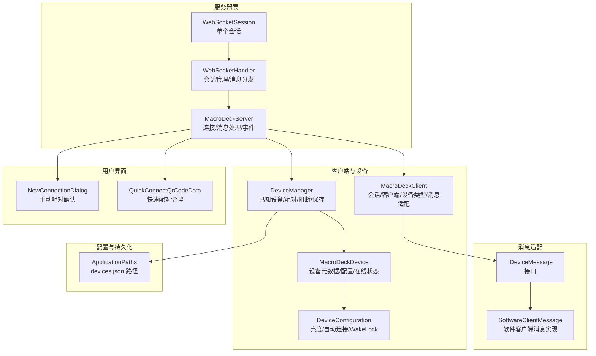
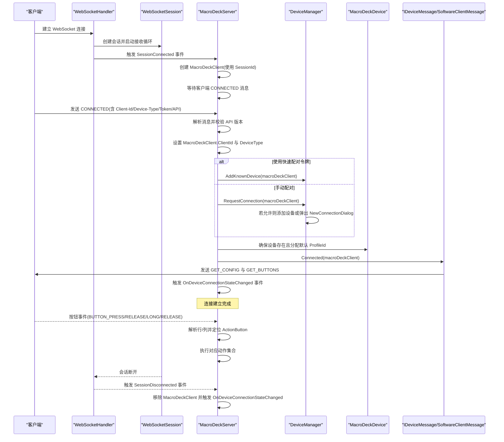
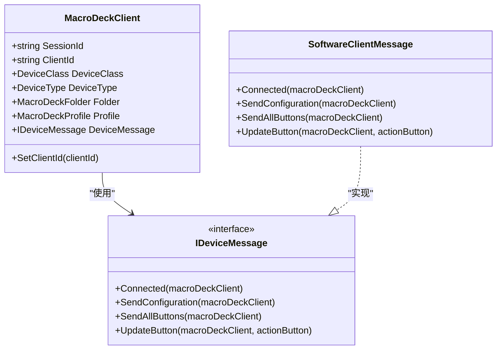
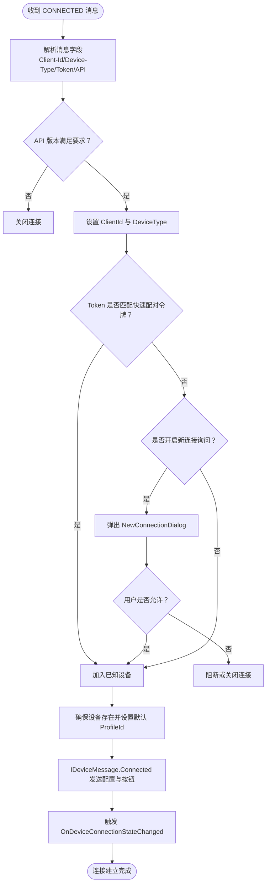
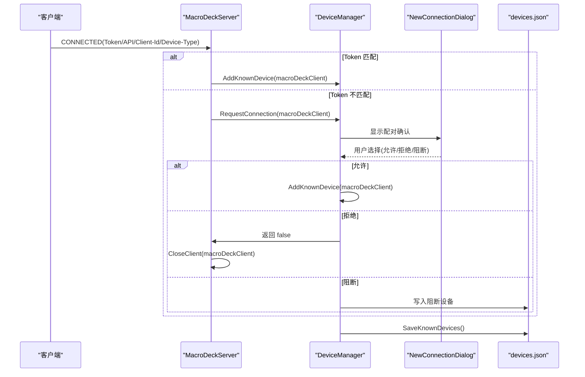
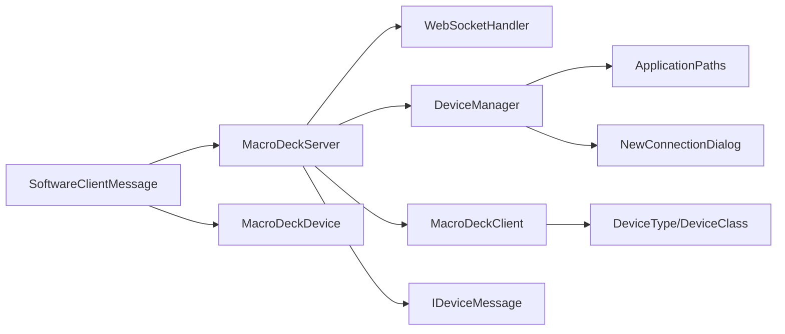

# 设备连接管理

<cite>
**本文引用的文件**
- [MacroDeckClient.cs](file://src/MacroDeck/Server/MacroDeckClient.cs)
- [MacroDeckServer.cs](file://src/MacroDeck/Server/MacroDeckServer.cs)
- [DeviceManager.cs](file://src/MacroDeck/Device/DeviceManager.cs)
- [MacroDeckDevice.cs](file://src/MacroDeck/Device/MacroDeckDevice.cs)
- [DeviceType.cs](file://src/MacroDeck/Device/DeviceType.cs)
- [DeviceClass.cs](file://src/MacroDeck/Device/DeviceClass.cs)
- [IDeviceMessage.cs](file://src/MacroDeck/Server/DeviceMessage/IDeviceMessage.cs)
- [SoftwareClientMessage.cs](file://src/MacroDeck/Server/DeviceMessage/SoftwareClientMessage.cs)
- [WebSocketSession.cs](file://src/MacroDeck/DataTypes/WebSocketSession.cs)
- [WebSocketHandler.cs](file://src/MacroDeck/WebSocketHandler.cs)
- [ApplicationPaths.cs](file://src/MacroDeck/StartupConfig/ApplicationPaths.cs)
- [NewConnectionDialog.cs](file://src/MacroDeck/GUI/Dialogs/NewConnectionDialog.cs)
- [QuickConnectQrCodeData.cs](file://src/MacroDeck/DataTypes/QrCode/QuickConnectQrCodeData.cs)
- [DeviceConfiguration.cs](file://src/MacroDeck/Device/DeviceConfiguration.cs)
- [ButtonPressType.cs](file://src/MacroDeck/Enums/ButtonPressType.cs)
</cite>

## 目录
1. [简介](#简介)
2. [项目结构](#项目结构)
3. [核心组件](#核心组件)
4. [架构总览](#架构总览)
5. [详细组件分析](#详细组件分析)
6. [依赖关系分析](#依赖关系分析)
7. [性能考量](#性能考量)
8. [故障排查指南](#故障排查指南)
9. [结论](#结论)
10. [附录](#附录)

## 简介
本文件系统性阐述 Macro-Deck 的设备连接管理系统，覆盖从设备连接建立、客户端身份验证、设备类型识别，到客户端状态管理、设备信息存储与会话跟踪的完整流程。文档还详细说明了设备连接状态变化事件、配对机制（含快速设置令牌与手动配对）、以及与 DeviceManager 的协作关系和设备配置的持久化机制，并通过时序图与类图直观展示关键交互。

## 项目结构
围绕设备连接管理的关键模块分布如下：
- 服务器端核心：WebSocket 会话处理、消息分发、客户端对象管理与事件发布
- 客户端抽象：MacroDeckClient 封装会话标识、客户端标识、设备类型、设备消息适配器等
- 设备管理：DeviceManager 负责已知设备的加载/保存、配对请求处理、阻断控制、在线状态判定
- 设备模型：MacroDeckDevice 表示已配对设备的元数据与配置
- 消息适配：IDeviceMessage 接口及 SoftwareClientMessage 实现负责向不同设备类型发送配置与按钮数据
- 配置与路径：ApplicationPaths 提供 devices.json 等配置文件路径；QuickConnectQrCodeData 支持快速配对令牌
- 用户交互：NewConnectionDialog 提供手动配对确认与阻断选项

图表来源
- [WebSocketHandler.cs:1-91](file://src/MacroDeck/WebSocketHandler.cs#L1-L91)
- [WebSocketSession.cs:1-119](file://src/MacroDeck/DataTypes/WebSocketSession.cs#L1-L119)
- [MacroDeckServer.cs:1-376](file://src/MacroDeck/Server/MacroDeckServer.cs#L1-L376)
- [MacroDeckClient.cs:1-53](file://src/MacroDeck/Server/MacroDeckClient.cs#L1-L53)
- [DeviceManager.cs:1-278](file://src/MacroDeck/Device/DeviceManager.cs#L1-L278)
- [MacroDeckDevice.cs:1-34](file://src/MacroDeck/Device/MacroDeckDevice.cs#L1-L34)
- [DeviceConfiguration.cs:1-16](file://src/MacroDeck/Device/DeviceConfiguration.cs#L1-L16)
- [IDeviceMessage.cs:1-10](file://src/MacroDeck/Server/DeviceMessage/IDeviceMessage.cs#L1-L10)
- [SoftwareClientMessage.cs:1-194](file://src/MacroDeck/Server/DeviceMessage/SoftwareClientMessage.cs#L1-L194)
- [NewConnectionDialog.cs:1-71](file://src/MacroDeck/GUI/Dialogs/NewConnectionDialog.cs#L1-L71)
- [QuickConnectQrCodeData.cs:1-23](file://src/MacroDeck/DataTypes/QrCode/QuickConnectQrCodeData.cs#L1-L23)
- [ApplicationPaths.cs:1-143](file://src/MacroDeck/StartupConfig/ApplicationPaths.cs#L1-L143)

章节来源
- [MacroDeckServer.cs:28-55](file://src/MacroDeck/Server/MacroDeckServer.cs#L28-L55)
- [DeviceManager.cs:21-51](file://src/MacroDeck/Device/DeviceManager.cs#L21-L51)
- [ApplicationPaths.cs:57](file://src/MacroDeck/StartupConfig/ApplicationPaths.cs#L57)

## 核心组件
- MacroDeckClient：封装单个 WebSocket 会话的客户端实例，维护 SessionId、ClientId、设备类型 DeviceType、设备类别 DeviceClass、当前配置 Profile 与文件夹 Folder、以及设备消息适配器 IDeviceMessage。当 DeviceType 变更时，自动切换为 SoftwareClientMessage 并初始化消息适配器。
- MacroDeckServer：WebSocket 服务入口，负责启动服务器、注册会话事件、解析消息、执行动作、触发连接状态变更事件、向客户端发送配置与按钮数据。
- DeviceManager：集中管理已知设备列表，支持加载/保存 devices.json、请求配对、阻断设备、重命名、移除设备、查询设备、设置配置与在线状态判断。
- MacroDeckDevice：已配对设备的元数据模型，包含 ClientId、显示名、是否阻断、当前 ProfileId、设备配置 DeviceConfiguration、设备类型 DeviceType，以及基于当前会话可用性的 Available 属性。
- IDeviceMessage 与 SoftwareClientMessage：定义并实现软件客户端的消息协议，负责发送配置、批量按钮、单按钮更新等。
- WebSocketHandler 与 WebSocketSession：统一管理 WebSocket 会话生命周期、消息收发与断开事件。
- ApplicationPaths：提供 devices.json 等应用数据路径，确保目录存在并进行清理。
- NewConnectionDialog：在需要时弹出手动配对确认对话框，支持自动拒绝倒计时与阻断选项。
- QuickConnectQrCodeData：生成快速配对二维码所需的数据结构，包含实例名、网络接口、端口、SSL 与令牌。
- DeviceConfiguration：设备级配置项，如亮度、自动连接、唤醒锁策略。

章节来源
- [MacroDeckClient.cs:8-52](file://src/MacroDeck/Server/MacroDeckClient.cs#L8-L52)
- [MacroDeckServer.cs:16-376](file://src/MacroDeck/Server/MacroDeckServer.cs#L16-L376)
- [DeviceManager.cs:12-278](file://src/MacroDeck/Device/DeviceManager.cs#L12-L278)
- [MacroDeckDevice.cs:6-34](file://src/MacroDeck/Device/MacroDeckDevice.cs#L6-L34)
- [IDeviceMessage.cs:3-9](file://src/MacroDeck/Server/DeviceMessage/IDeviceMessage.cs#L3-L9)
- [SoftwareClientMessage.cs:10-194](file://src/MacroDeck/Server/DeviceMessage/SoftwareClientMessage.cs#L10-L194)
- [WebSocketHandler.cs:6-91](file://src/MacroDeck/WebSocketHandler.cs#L6-L91)
- [WebSocketSession.cs:5-119](file://src/MacroDeck/DataTypes/WebSocketSession.cs#L5-L119)
- [ApplicationPaths.cs:24-61](file://src/MacroDeck/StartupConfig/ApplicationPaths.cs#L24-L61)
- [NewConnectionDialog.cs:8-71](file://src/MacroDeck/GUI/Dialogs/NewConnectionDialog.cs#L8-L71)
- [QuickConnectQrCodeData.cs:3-23](file://src/MacroDeck/DataTypes/QrCode/QuickConnectQrCodeData.cs#L3-L23)
- [DeviceConfiguration.cs:3-16](file://src/MacroDeck/Device/DeviceConfiguration.cs#L3-L16)

## 架构总览
下图展示了设备连接从握手到配对、再到会话维持与事件通知的整体流程。

图表来源
- [MacroDeckServer.cs:74-120](file://src/MacroDeck/Server/MacroDeckServer.cs#L74-L120)
- [MacroDeckServer.cs:123-244](file://src/MacroDeck/Server/MacroDeckServer.cs#L123-L244)
- [DeviceManager.cs:185-276](file://src/MacroDeck/Device/DeviceManager.cs#L185-L276)
- [NewConnectionDialog.cs:19-71](file://src/MacroDeck/GUI/Dialogs/NewConnectionDialog.cs#L19-L71)
- [SoftwareClientMessage.cs:14-23](file://src/MacroDeck/Server/DeviceMessage/SoftwareClientMessage.cs#L14-L23)
- [WebSocketHandler.cs:37-49](file://src/MacroDeck/WebSocketHandler.cs#L37-L49)
- [WebSocketSession.cs:20-49](file://src/MacroDeck/DataTypes/WebSocketSession.cs#L20-L49)

## 详细组件分析

### MacroDeckClient 类分析
- 职责与属性
  - 维护会话标识 SessionId（构造时确定）
  - 维护客户端标识 ClientId（可设置）
  - 维护设备类型 DeviceType 与设备类别 DeviceClass
  - 维护当前配置 Profile 与当前文件夹 Folder
  - 维护设备消息适配器 IDeviceMessage，默认为 SoftwareClientMessage
- 关键行为
  - SetClientId：设置客户端标识
  - DeviceType 属性变更时，根据设备类型切换为 SoftwareClientMessage
- 复杂度与性能
  - 属性访问为 O(1)，消息适配器切换为 O(1)
- 错误处理
  - 未见显式异常处理，依赖上层调用者保证参数有效

图表来源
- [MacroDeckClient.cs:8-52](file://src/MacroDeck/Server/MacroDeckClient.cs#L8-L52)
- [IDeviceMessage.cs:3-9](file://src/MacroDeck/Server/DeviceMessage/IDeviceMessage.cs#L3-L9)
- [SoftwareClientMessage.cs:10-194](file://src/MacroDeck/Server/DeviceMessage/SoftwareClientMessage.cs#L10-L194)

章节来源
- [MacroDeckClient.cs:10-52](file://src/MacroDeck/Server/MacroDeckClient.cs#L10-L52)

### 设备连接建立流程（握手与认证）
- 握手阶段
  - 客户端发起 WebSocket 连接，服务器创建 MacroDeckClient 并等待 CONNECTED 消息
  - 服务器解析消息，校验 API 版本、设备类型与客户端标识
- 认证与配对
  - 快速配对：若消息中 Token 与服务器 QuickSetupToken 匹配，则直接加入已知设备
  - 手动配对：若开启“新连接询问”，弹出 NewConnectionDialog，用户确认后加入设备；否则关闭连接
- 初始化
  - 确保设备存在并设置默认 ProfileId
  - 通过 IDeviceMessage.Connected 发送配置与按钮数据
  - 触发 OnDeviceConnectionStateChanged 事件

图表来源
- [MacroDeckServer.cs:141-200](file://src/MacroDeck/Server/MacroDeckServer.cs#L141-L200)
- [DeviceManager.cs:185-276](file://src/MacroDeck/Device/DeviceManager.cs#L185-L276)
- [NewConnectionDialog.cs:19-71](file://src/MacroDeck/GUI/Dialogs/NewConnectionDialog.cs#L19-L71)

章节来源
- [MacroDeckServer.cs:141-200](file://src/MacroDeck/Server/MacroDeckServer.cs#L141-L200)
- [DeviceManager.cs:185-276](file://src/MacroDeck/Device/DeviceManager.cs#L185-L276)

### 设备类型识别与设备类别映射
- 设备类型枚举 DeviceType：Unknown、Web、Android、iOS、StreamDeck
- 设备类别 DeviceClass：SoftwareClient、Macro_Deck_DIY_OLED_6_V1
- 当 DeviceType 为 Unknown/Web/Android/iOS/StreamDeck 时，自动映射为 SoftwareClient 并使用 SoftwareClientMessage

章节来源
- [DeviceType.cs:3-11](file://src/MacroDeck/Device/DeviceType.cs#L3-L11)
- [DeviceClass.cs:3-8](file://src/MacroDeck/Device/DeviceClass.cs#L3-L8)
- [MacroDeckClient.cs:31-49](file://src/MacroDeck/Server/MacroDeckClient.cs#L31-L49)

### 客户端状态管理与会话跟踪
- 会话生命周期
  - WebSocketHandler 注册 SessionConnected/SessionDisconnected/MessageReceived 事件
  - MacroDeckServer 在连接建立时创建 MacroDeckClient 并加入 Clients 列表
  - 断开时从 Clients 移除并触发 OnDeviceConnectionStateChanged
- 客户端状态
  - MacroDeckClient 持有 SessionId、ClientId、DeviceType、Profile、Folder、DeviceMessage
  - 通过 DeviceManager.GetMacroDeckDevice(macroDeckClient.ClientId).Available 判断在线状态

章节来源
- [WebSocketHandler.cs:37-49](file://src/MacroDeck/WebSocketHandler.cs#L37-L49)
- [WebSocketHandler.cs:51-64](file://src/MacroDeck/WebSocketHandler.cs#L51-L64)
- [MacroDeckServer.cs:74-110](file://src/MacroDeck/Server/MacroDeckServer.cs#L74-L110)
- [MacroDeckDevice.cs:12-24](file://src/MacroDeck/Device/MacroDeckDevice.cs#L12-L24)

### 设备连接状态变化事件
- 事件定义
  - OnDeviceConnectionStateChanged：设备连接状态改变时触发
  - OnServerStateChanged：服务器状态改变时触发
  - OnFolderChanged：当前文件夹改变时触发
- 触发点
  - 连接建立：IDeviceMessage.Connected 后触发
  - 断开连接：WebSocket 断开后从 Clients 移除并触发
  - 文件夹切换：SetFolder/SetProfile 后触发

章节来源
- [MacroDeckServer.cs:20-23](file://src/MacroDeck/Server/MacroDeckServer.cs#L20-L23)
- [MacroDeckServer.cs:198](file://src/MacroDeck/Server/MacroDeckServer.cs#L198)
- [MacroDeckServer.cs:109](file://src/MacroDeck/Server/MacroDeckServer.cs#L109)
- [MacroDeckServer.cs:301](file://src/MacroDeck/Server/MacroDeckServer.cs#L301)

### 设备配对机制
- 快速设置令牌
  - 服务器生成随机 QuickSetupToken，客户端通过 Token 字段提交
  - 匹配成功则自动加入已知设备，无需人工确认
- 手动配对流程
  - 若开启“新连接询问”，DeviceManager.RequestConnection 弹出 NewConnectionDialog
  - 用户点击“接受”后加入设备；点击“拒绝”或超时则关闭连接；勾选“阻断此设备”则写入阻断记录
- 设备信息存储与持久化
  - devices.json 由 DeviceManager.LoadKnownDevices/SaveKnownDevices 读写
  - ApplicationPaths.DevicesFilePath 提供文件路径

图表来源
- [MacroDeckServer.cs:158-169](file://src/MacroDeck/Server/MacroDeckServer.cs#L158-L169)
- [DeviceManager.cs:185-276](file://src/MacroDeck/Device/DeviceManager.cs#L185-L276)
- [NewConnectionDialog.cs:19-71](file://src/MacroDeck/GUI/Dialogs/NewConnectionDialog.cs#L19-L71)
- [ApplicationPaths.cs:57](file://src/MacroDeck/StartupConfig/ApplicationPaths.cs#L57)

章节来源
- [MacroDeckServer.cs:26](file://src/MacroDeck/Server/MacroDeckServer.cs#L26)
- [DeviceManager.cs:53-81](file://src/MacroDeck/Device/DeviceManager.cs#L53-L81)
- [ApplicationPaths.cs:57](file://src/MacroDeck/StartupConfig/ApplicationPaths.cs#L57)

### 与 DeviceManager 的协作关系
- 设备生命周期
  - 加载：DeviceManager.LoadKnownDevices 从 devices.json 读取
  - 添加：AddKnownDevice 或 AddKnownDevice(MacroDeckClient)
  - 查询：GetMacroDeckDevice/GetMacroDeckDeviceByDisplayName/IsKnownDevice
  - 更新：SetProfile/SetBlocked/RenameMacroDeckDevice
  - 删除：RemoveKnownDevice
  - 保存：SaveKnownDevices 写入 devices.json（带临时文件与原子替换）
- 在线状态
  - MacroDeckDevice.Available 基于 WebSocketHandler.IsAvailable 判断
- 与服务器交互
  - MacroDeckServer.GetMacroDeckClient 用于按 ClientId 获取客户端实例
  - DeviceManager.SetProfile/SetBlocked 会联动服务器更新配置与断开会话

章节来源
- [DeviceManager.cs:21-183](file://src/MacroDeck/Device/DeviceManager.cs#L21-L183)
- [DeviceManager.cs:117-149](file://src/MacroDeck/Device/DeviceManager.cs#L117-L149)
- [MacroDeckDevice.cs:12-24](file://src/MacroDeck/Device/MacroDeckDevice.cs#L12-L24)
- [WebSocketHandler.cs:87-91](file://src/MacroDeck/WebSocketHandler.cs#L87-L91)
- [MacroDeckServer.cs:359-364](file://src/MacroDeck/Server/MacroDeckServer.cs#L359-L364)

### 设备配置的持久化机制
- 文件位置：ApplicationPaths.DevicesFilePath（通常位于用户数据目录下的 devices.json）
- 读取：LoadKnownDevices 使用 JsonConvert.DeserializeObject 读取，TypeNameHandling.Auto 支持多态
- 写入：SaveKnownDevices 使用临时文件写入后原子移动覆盖，避免损坏
- 设备配置：DeviceConfiguration 包含亮度、自动连接、唤醒锁策略三项

章节来源
- [ApplicationPaths.cs:57](file://src/MacroDeck/StartupConfig/ApplicationPaths.cs#L57)
- [DeviceManager.cs:28-81](file://src/MacroDeck/Device/DeviceManager.cs#L28-L81)
- [DeviceConfiguration.cs:3-16](file://src/MacroDeck/Device/DeviceConfiguration.cs#L3-L16)

### 按钮事件处理与动作执行
- 事件类型：BUTTON_PRESS、BUTTON_RELEASE、BUTTON_LONG_PRESS、BUTTON_LONG_PRESS_RELEASE
- 解析：从消息中提取行/列，定位 ActionButton
- 执行：根据按键类型选择对应动作集合，异步逐个触发

章节来源
- [MacroDeckServer.cs:201-239](file://src/MacroDeck/Server/MacroDeckServer.cs#L201-L239)
- [ButtonPressType.cs:3-10](file://src/MacroDeck/Enums/ButtonPressType.cs#L3-L10)

## 依赖关系分析
- 组件耦合
  - MacroDeckServer 依赖 WebSocketHandler、DeviceManager、ProfileManager、MacroDeckClient、IDeviceMessage
  - DeviceManager 依赖 MacroDeckServer（查询客户端）、ApplicationPaths（文件路径）、GUI 对话框（手动配对）
  - MacroDeckClient 依赖 DeviceType/DeviceClass 与 IDeviceMessage
  - SoftwareClientMessage 依赖 MacroDeckServer（发送）、MacroDeckDevice（读取配置）
- 外部依赖
  - Newtonsoft.Json 用于序列化/反序列化
  - Serilog 用于日志记录
  - System.Net.WebSockets 用于 WebSocket 通信

图表来源
- [MacroDeckServer.cs:16-376](file://src/MacroDeck/Server/MacroDeckServer.cs#L16-L376)
- [DeviceManager.cs:12-278](file://src/MacroDeck/Device/DeviceManager.cs#L12-L278)
- [ApplicationPaths.cs:24-61](file://src/MacroDeck/StartupConfig/ApplicationPaths.cs#L24-L61)
- [NewConnectionDialog.cs:8-71](file://src/MacroDeck/GUI/Dialogs/NewConnectionDialog.cs#L8-L71)
- [SoftwareClientMessage.cs:10-194](file://src/MacroDeck/Server/DeviceMessage/SoftwareClientMessage.cs#L10-L194)

## 性能考量
- 并发与异步
  - WebSocket 接收循环在独立任务中运行，避免阻塞
  - 消息发送采用 Task.WhenAll 并行广播
  - 按钮更新使用并发集合收集，减少锁竞争
- 序列化优化
  - devices.json 使用临时文件写入并原子替换，降低损坏风险
  - Json 序列化设置 TypeNameHandling.Auto 以支持多态，注意安全与性能权衡
- 资源管理
  - WebSocketSession 实现 IDisposable，确保连接关闭与资源释放
  - 定时器与 UI 交互通过 Invoke 确保线程安全

## 故障排查指南
- 无法连接
  - 检查服务器启动日志与证书生成
  - 确认防火墙放行端口，必要时启用 SSL
- 连接被拒绝
  - 若开启“新连接询问”，检查 NewConnectionDialog 是否被阻止
  - 确认设备是否被 DeviceManager.SetBlocked 标记为阻断
- 设备不显示
  - 检查 devices.json 是否损坏，必要时删除后重启自动重建
  - 确认 MacroDeckDevice.Available 为真（会话在线）
- 按钮无响应
  - 检查客户端是否处于正确文件夹，确认 ActionButton 是否存在
  - 查看按钮事件日志，确认消息格式与行/列解析正确

章节来源
- [MacroDeckServer.cs:42-54](file://src/MacroDeck/Server/MacroDeckServer.cs#L42-L54)
- [DeviceManager.cs:38-50](file://src/MacroDeck/Device/DeviceManager.cs#L38-L50)
- [MacroDeckDevice.cs:12-24](file://src/MacroDeck/Device/MacroDeckDevice.cs#L12-L24)
- [WebSocketHandler.cs:76-85](file://src/MacroDeck/WebSocketHandler.cs#L76-L85)

## 结论
Macro-Deck 的设备连接管理以 WebSocket 为核心，结合 MacroDeckClient 与 DeviceManager 实现了从握手、认证、配对到会话维持与事件通知的完整闭环。通过 IDeviceMessage 抽象适配不同设备类型的消息协议，配合 ApplicationPaths 的持久化机制，系统实现了灵活、可扩展且可靠的设备连接管理能力。建议在生产环境中关注设备配置的安全性与性能优化，并持续完善日志与监控体系。

## 附录
- 快速配对令牌生成与使用
  - 服务器生成随机令牌，客户端通过 CONNECTED 消息中的 Token 字段提交
  - 匹配成功即自动配对，无需人工干预
- 设备配置项
  - 亮度：影响按钮显示效果
  - 自动连接：指示设备是否自动连接
  - 唤醒锁策略：Always/Connected/Never 控制设备唤醒行为

章节来源
- [MacroDeckServer.cs:26](file://src/MacroDeck/Server/MacroDeckServer.cs#L26)
- [MacroDeckServer.cs:158-161](file://src/MacroDeck/Server/MacroDeckServer.cs#L158-L161)
- [DeviceConfiguration.cs:5-7](file://src/MacroDeck/Device/DeviceConfiguration.cs#L5-L7)