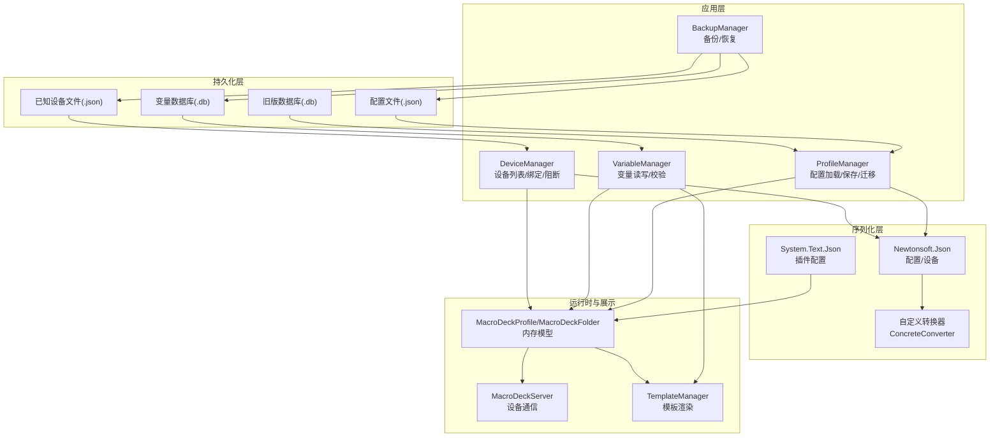
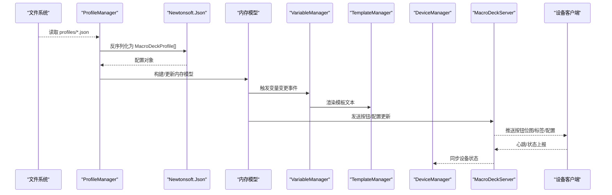
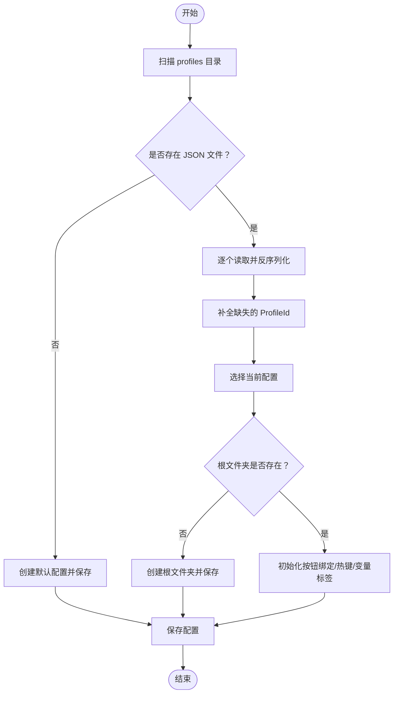
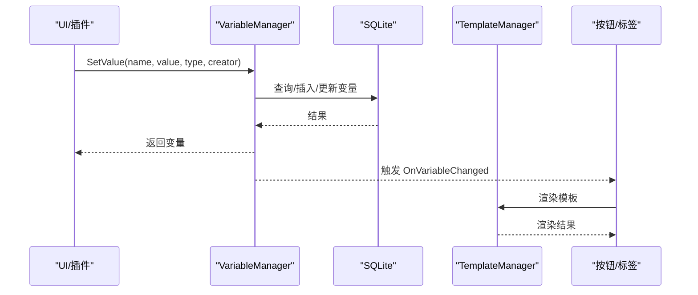
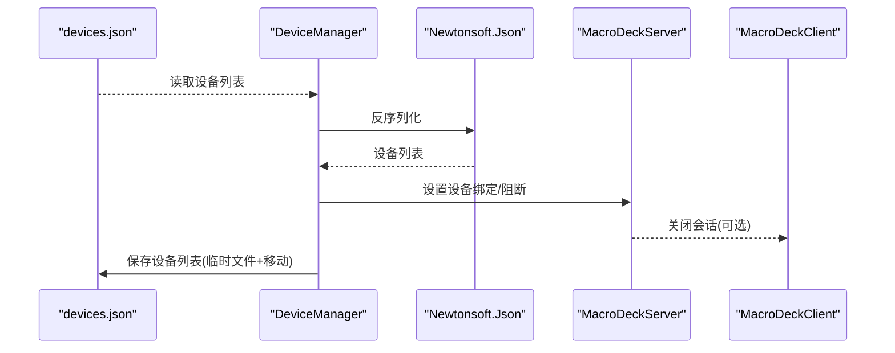
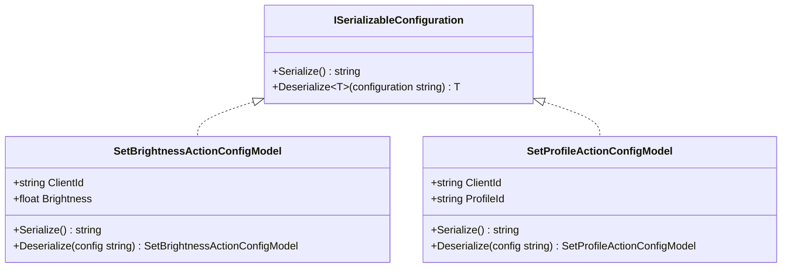
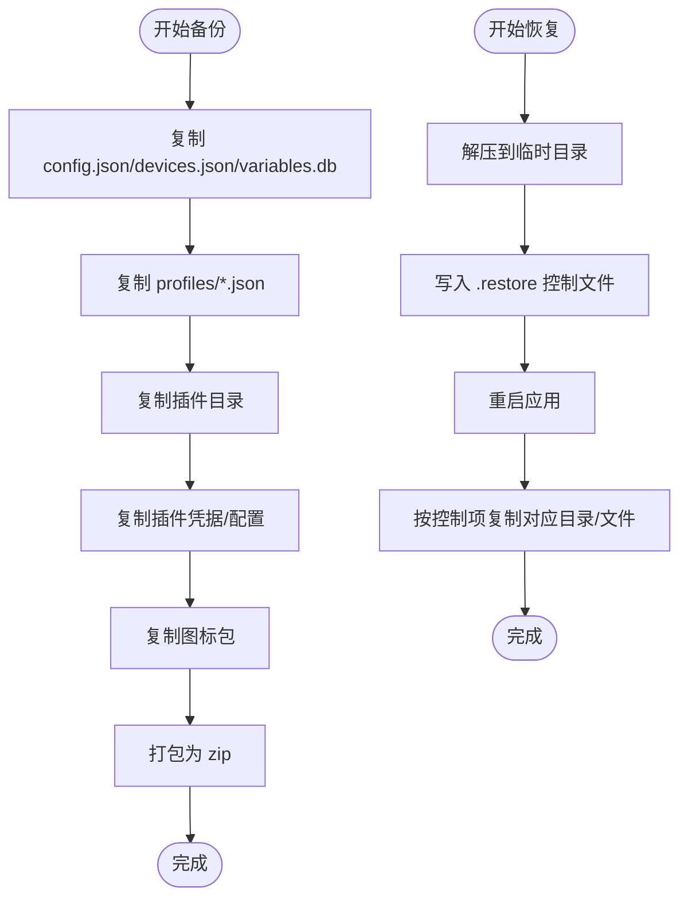
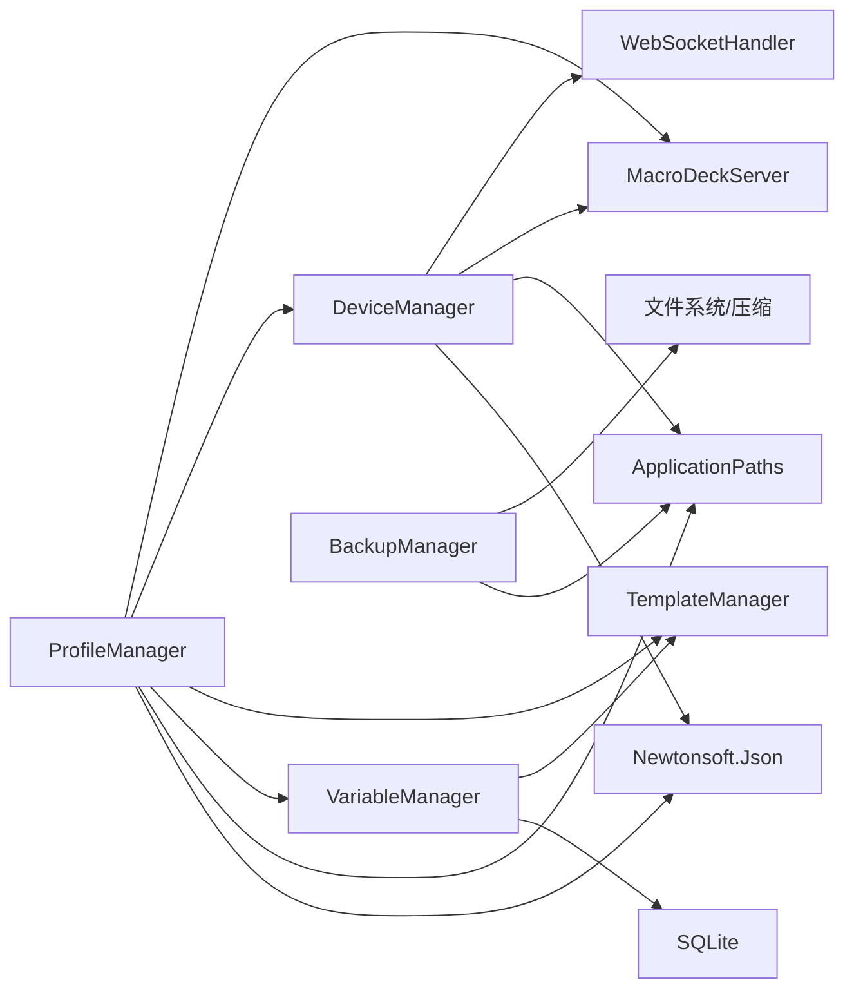
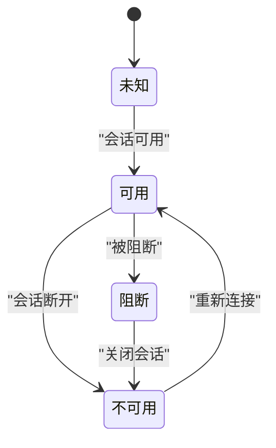

# 数据流设计

<cite>
**本文引用的文件**
- [ProfileManager.cs](file://src/MacroDeck/Profiles/ProfileManager.cs)
- [MacroDeckProfile.cs](file://src/MacroDeck/Profiles/MacroDeckProfile.cs)
- [MacroDeckFolder.cs](file://src/MacroDeck/Folders/MacroDeckFolder.cs)
- [VariableManager.cs](file://src/MacroDeck/Variables/VariableManager.cs)
- [Variable.cs](file://src/MacroDeck/Variables/Variable.cs)
- [MacroDeckDevice.cs](file://src/MacroDeck/Device/MacroDeckDevice.cs)
- [DeviceManager.cs](file://src/MacroDeck/Device/DeviceManager.cs)
- [ProfileJson.cs](file://src/MacroDeck/JSON/ProfileJson.cs)
- [FolderJson.cs](file://src/MacroDeck/JSON/FolderJson.cs)
- [IconPackJson.cs](file://src/MacroDeck/JSON/IconPackJson.cs)
- [ConcreteConverter.cs](file://src/MacroDeck/JSON/ConcreteConverter.cs)
- [ApplicationPaths.cs](file://src/MacroDeck/StartupConfig/ApplicationPaths.cs)
- [BackupManager.cs](file://src/MacroDeck/Backup/BackupManager.cs)
- [ISerializableConfiguration.cs](file://src/MacroDeck/Models/ISerializableConfiguration.cs)
- [SetBrightnessActionConfigModel.cs](file://src/MacroDeck/InternalPlugins/DevicePlugin/Models/SetBrightnessActionConfigModel.cs)
- [SetProfileActionConfigModel.cs](file://src/MacroDeck/InternalPlugins/DevicePlugin/Models/SetProfileActionConfigModel.cs)
- [TemplateManager.cs](file://src/MacroDeck/CottleIntegration/TemplateManager.cs)
- [MacroDeckServerHelper.cs](file://src/MacroDeck/MacroDeckServerHelper.cs)
- [WebSocketHandler.cs](file://src/MacroDeck/WebSocketHandler.cs)
- [MacroDeckServer.cs](file://src/MacroDeck/Server/MacroDeckServer.cs)
- [MacroDeckClient.cs](file://src/MacroDeck/Server/MacroDeckClient.cs)
</cite>

## 目录
1. [引言](#引言)
2. [项目结构](#项目结构)
3. [核心组件](#核心组件)
4. [架构总览](#架构总览)
5. [详细组件分析](#详细组件分析)
6. [依赖关系分析](#依赖关系分析)
7. [性能考量](#性能考量)
8. [故障排查指南](#故障排查指南)
9. [结论](#结论)
10. [附录](#附录)

## 引言
本文件面向 Macro-Deck 的数据流设计，系统性阐述从配置文件加载到内存对象、再到 UI 展示与设备端渲染的完整数据流转路径；解释 JSON 序列化/反序列化机制（含自定义转换器与数据验证）、配置数据的缓存与持久化策略、设备数据、按钮配置、变量数据与插件数据的差异化处理流程；并提供数据流图与状态转换图，分析数据一致性与并发控制，以及数据迁移与版本兼容策略。

## 项目结构
Macro-Deck 将数据持久化与运行时管理按职责分层组织：
- 配置与模型：ProfileManager、MacroDeckProfile、MacroDeckFolder、MacroDeckDevice 等
- 持久化与迁移：SQLite 表映射类（ProfileJson、FolderJson、IconPackJson）与 ApplicationPaths 路径管理
- 序列化与转换：Newtonsoft.Json 与 System.Text.Json 并用，配合自定义转换器
- 变量系统：VariableManager 基于 SQLite 的变量存储与类型转换
- 设备与服务：DeviceManager、MacroDeckServer、WebSocketHandler
- 备份与恢复：BackupManager 统一打包与还原
- 插件配置：ISerializableConfiguration 接口与具体模型（如亮度/切换配置）

图表来源
- [ProfileManager.cs:205-311](file://src/MacroDeck/Profiles/ProfileManager.cs#L205-L311)
- [VariableManager.cs:204-212](file://src/MacroDeck/Variables/VariableManager.cs#L204-L212)
- [DeviceManager.cs:21-51](file://src/MacroDeck/Device/DeviceManager.cs#L21-L51)
- [BackupManager.cs:270-361](file://src/MacroDeck/Backup/BackupManager.cs#L270-L361)
- [ApplicationPaths.cs:36-61](file://src/MacroDeck/StartupConfig/ApplicationPaths.cs#L36-L61)

章节来源
- [ApplicationPaths.cs:36-61](file://src/MacroDeck/StartupConfig/ApplicationPaths.cs#L36-L61)
- [ProfileManager.cs:205-311](file://src/MacroDeck/Profiles/ProfileManager.cs#L205-L311)
- [VariableManager.cs:204-212](file://src/MacroDeck/Variables/VariableManager.cs#L204-L212)
- [DeviceManager.cs:21-51](file://src/MacroDeck/Device/DeviceManager.cs#L21-L51)
- [BackupManager.cs:270-361](file://src/MacroDeck/Backup/BackupManager.cs#L270-L361)

## 核心组件
- 配置管理（ProfileManager）
  - 加载：遍历 profiles 目录 JSON 文件，使用 Newtonsoft.Json 反序列化为 MacroDeckProfile 列表；若无文件则创建默认配置并保存；选择当前配置并确保根目录存在。
  - 保存：序列化所有配置至独立 JSON 文件，采用临时文件+原子替换；清理孤儿文件；触发保存事件。
  - 迁移：检测旧版 SQLite 数据库，逐条反序列化后写回 JSON，并重命名旧数据库。
- 内存模型（MacroDeckProfile、MacroDeckFolder）
  - 包含布局参数、目标设备类别、按钮集合等；Folder 对象包含子文件夹 ID、应用触发器与设备绑定等。
- 变量系统（VariableManager、Variable）
  - 使用 SQLite 存储变量名、值、类型与创建者；提供类型安全的 SetValue，支持布尔/整数/浮点/字符串转换与建议值；事件通知变更。
- 设备管理（DeviceManager、MacroDeckDevice）
  - 已知设备列表以 JSON 存储；支持添加/删除/重命名/阻断；与服务器会话状态联动；可设置设备绑定的 Profile。
- 序列化与转换
  - 配置与设备：Newtonsoft.Json，启用 TypeNameHandling.Auto、忽略空值、错误回调与循环引用处理。
  - 插件配置：System.Text.Json，通过 ISerializableConfiguration 接口统一序列化/反序列化。
  - 自定义转换器：ConcreteConverter<T> 提供泛型读写桥接。
- 备份与恢复（BackupManager）
  - 打包 config.json、devices.json、variables.db、profiles/*.json、插件与图标包等；支持选择性恢复。
- 路径与迁移（ApplicationPaths）
  - 定义用户目录、配置、设备、变量、旧版数据库与 profiles 目录等路径；初始化并检查创建目录。

章节来源
- [ProfileManager.cs:205-380](file://src/MacroDeck/Profiles/ProfileManager.cs#L205-L380)
- [MacroDeckProfile.cs:7-75](file://src/MacroDeck/Profiles/MacroDeckProfile.cs#L7-L75)
- [MacroDeckFolder.cs:6-60](file://src/MacroDeck/Folders/MacroDeckFolder.cs#L6-L60)
- [VariableManager.cs:10-249](file://src/MacroDeck/Variables/VariableManager.cs#L10-L249)
- [Variable.cs:5-16](file://src/MacroDeck/Variables/Variable.cs#L5-L16)
- [MacroDeckDevice.cs:6-34](file://src/MacroDeck/Device/MacroDeckDevice.cs#L6-L34)
- [DeviceManager.cs:12-278](file://src/MacroDeck/Device/DeviceManager.cs#L12-L278)
- [ISerializableConfiguration.cs:5-15](file://src/MacroDeck/Models/ISerializableConfiguration.cs#L5-L15)
- [ConcreteConverter.cs:5-27](file://src/MacroDeck/JSON/ConcreteConverter.cs#L5-L27)
- [ApplicationPaths.cs:36-61](file://src/MacroDeck/StartupConfig/ApplicationPaths.cs#L36-L61)
- [BackupManager.cs:270-380](file://src/MacroDeck/Backup/BackupManager.cs#L270-L380)

## 架构总览
下图展示从磁盘到内存再到设备端的端到端数据流：

图表来源
- [ProfileManager.cs:205-311](file://src/MacroDeck/Profiles/ProfileManager.cs#L205-L311)
- [VariableManager.cs:127-138](file://src/MacroDeck/Variables/VariableManager.cs#L127-L138)
- [TemplateManager.cs:111-145](file://src/MacroDeck/CottleIntegration/TemplateManager.cs#L111-L145)
- [MacroDeckServer.cs](file://src/MacroDeck/Server/MacroDeckServer.cs)
- [MacroDeckClient.cs](file://src/MacroDeck/Server/MacroDeckClient.cs)
- [WebSocketHandler.cs](file://src/MacroDeck/WebSocketHandler.cs)

## 详细组件分析

### 配置数据流（ProfileManager）
- 加载流程
  - 遍历 profiles 目录下的 JSON 文件，逐个读取内容并使用 Newtonsoft.Json 反序列化为 MacroDeckProfile；设置缺失的 ProfileId；若为空则创建默认配置并保存；选择当前配置并确保根文件夹存在；最后对按钮进行绑定与热键初始化，并渲染变量标签。
- 保存流程
  - 逐个序列化内存中的配置，写入临时文件后原子移动覆盖；清理不再使用的 JSON 文件；触发保存完成事件。
- 迁移流程
  - 若存在旧版 SQLite 数据库且目标目录为空，则读取 ProfileJson 条目，反序列化为 MacroDeckProfile，写回 JSON 并重命名旧数据库文件。

图表来源
- [ProfileManager.cs:205-311](file://src/MacroDeck/Profiles/ProfileManager.cs#L205-L311)
- [ProfileManager.cs:313-380](file://src/MacroDeck/Profiles/ProfileManager.cs#L313-L380)
- [ProfileManager.cs:382-456](file://src/MacroDeck/Profiles/ProfileManager.cs#L382-L456)

章节来源
- [ProfileManager.cs:205-380](file://src/MacroDeck/Profiles/ProfileManager.cs#L205-L380)
- [ProfileManager.cs:382-456](file://src/MacroDeck/Profiles/ProfileManager.cs#L382-L456)

### 变量数据流（VariableManager）
- 初始化与存储
  - 使用 SQLite 创建变量表，启动时读取并清理异常数据；提供按插件查询与按名称查询接口。
- 写入与类型转换
  - SetValue 支持多种类型转换与本地化数字格式；更新后触发 OnVariableChanged 事件；模板渲染通过 TemplateManager 将变量注入符号表。
- 并发与一致性
  - 写操作通过 SQLite 原生事务与连接管理保障；事件驱动下游刷新。

图表来源
- [VariableManager.cs:54-138](file://src/MacroDeck/Variables/VariableManager.cs#L54-L138)
- [TemplateManager.cs:111-145](file://src/MacroDeck/CottleIntegration/TemplateManager.cs#L111-L145)

章节来源
- [VariableManager.cs:10-249](file://src/MacroDeck/Variables/VariableManager.cs#L10-L249)
- [Variable.cs:5-16](file://src/MacroDeck/Variables/Variable.cs#L5-L16)

### 设备数据流（DeviceManager）
- 设备列表持久化
  - 已知设备列表以 JSON 存储；加载时反序列化，异常则重置；保存时先写临时文件再原子替换。
- 设备状态与绑定
  - 通过 MacroDeckServer 获取会话状态；支持设置设备绑定的 Profile；可阻断设备连接并关闭会话。
- 并发保护
  - 保存时使用锁对象避免竞态。

图表来源
- [DeviceManager.cs:21-51](file://src/MacroDeck/Device/DeviceManager.cs#L21-L51)
- [DeviceManager.cs:53-81](file://src/MacroDeck/Device/DeviceManager.cs#L53-L81)
- [MacroDeckDevice.cs:11-24](file://src/MacroDeck/Device/MacroDeckDevice.cs#L11-L24)

章节来源
- [DeviceManager.cs:12-278](file://src/MacroDeck/Device/DeviceManager.cs#L12-L278)
- [MacroDeckDevice.cs:6-34](file://src/MacroDeck/Device/MacroDeckDevice.cs#L6-L34)

### 插件配置数据流（ISerializableConfiguration）
- 统一接口
  - 所有插件配置实现 ISerializableConfiguration，提供 Serialize 与静态 Deserialize 方法。
- 实现示例
  - SetBrightnessActionConfigModel 与 SetProfileActionConfigModel 使用 System.Text.Json 进行序列化/反序列化。
- UI 配置视图
  - 配置视图模型在构造时反序列化配置，在保存时序列化并调用底层动作保存。

图表来源
- [ISerializableConfiguration.cs:5-15](file://src/MacroDeck/Models/ISerializableConfiguration.cs#L5-L15)
- [SetBrightnessActionConfigModel.cs:6-21](file://src/MacroDeck/InternalPlugins/DevicePlugin/Models/SetBrightnessActionConfigModel.cs#L6-L21)
- [SetProfileActionConfigModel.cs:6-21](file://src/MacroDeck/InternalPlugins/DevicePlugin/Models/SetProfileActionConfigModel.cs#L6-L21)

章节来源
- [ISerializableConfiguration.cs:5-15](file://src/MacroDeck/Models/ISerializableConfiguration.cs#L5-L15)
- [SetBrightnessActionConfigModel.cs:6-21](file://src/MacroDeck/InternalPlugins/DevicePlugin/Models/SetBrightnessActionConfigModel.cs#L6-L21)
- [SetProfileActionConfigModel.cs:6-21](file://src/MacroDeck/InternalPlugins/DevicePlugin/Models/SetProfileActionConfigModel.cs#L6-L21)

### 备份与恢复数据流（BackupManager）
- 备份
  - 复制主配置、设备、变量、各插件与图标包等至临时目录，打包为 zip。
- 恢复
  - 解压到临时目录，写入 .restore 控制文件，重启应用执行恢复逻辑；按需复制 config、profiles、devices、variables、plugins、plugin configs/credentials、icon packs。

图表来源
- [BackupManager.cs:270-361](file://src/MacroDeck/Backup/BackupManager.cs#L270-L361)
- [BackupManager.cs:43-222](file://src/MacroDeck/Backup/BackupManager.cs#L43-L222)

章节来源
- [BackupManager.cs:270-380](file://src/MacroDeck/Backup/BackupManager.cs#L270-L380)

### JSON 序列化与反序列化机制
- 配置与设备
  - 使用 Newtonsoft.Json，启用 TypeNameHandling.Auto 以便多态反序列化；NullValueHandling.Ignore 减少冗余；Error 回调记录错误并标记为已处理；ReferenceLoopHandling.Ignore 避免循环引用导致的异常。
- 插件配置
  - 使用 System.Text.Json，通过 ISerializableConfiguration 统一处理。
- 自定义转换器
  - ConcreteConverter<T> 作为 JsonConverter，委托给具体类型进行序列化/反序列化，便于在复杂场景中扩展。

章节来源
- [ProfileManager.cs:218-228](file://src/MacroDeck/Profiles/ProfileManager.cs#L218-L228)
- [DeviceManager.cs:30-36](file://src/MacroDeck/Device/DeviceManager.cs#L30-L36)
- [ISerializableConfiguration.cs:5-15](file://src/MacroDeck/Models/ISerializableConfiguration.cs#L5-L15)
- [ConcreteConverter.cs:5-27](file://src/MacroDeck/JSON/ConcreteConverter.cs#L5-L27)

### 缓存策略与持久化机制
- 配置缓存
  - 内存中维护 Profiles 列表与 CurrentProfile；保存时采用“临时文件+原子移动”策略，确保写入一致性。
- 设备缓存
  - 内存中维护已知设备列表；保存时加锁并原子替换文件。
- 变量缓存
  - SQLite 作为持久化存储；内存中通过事件驱动 UI/按钮刷新。
- 路径与迁移
  - ApplicationPaths 统一管理路径；当旧版数据库存在且目标目录为空时自动迁移。

章节来源
- [ProfileManager.cs:313-380](file://src/MacroDeck/Profiles/ProfileManager.cs#L313-L380)
- [DeviceManager.cs:53-81](file://src/MacroDeck/Device/DeviceManager.cs#L53-L81)
- [VariableManager.cs:204-212](file://src/MacroDeck/Variables/VariableManager.cs#L204-L212)
- [ApplicationPaths.cs:36-61](file://src/MacroDeck/StartupConfig/ApplicationPaths.cs#L36-L61)

### 数据一致性与并发控制
- 互斥锁
  - ProfileManager 保存时使用 SaveLock；DeviceManager 保存时使用 _saveLock，避免并发写入冲突。
- 事件驱动
  - VariableManager 在变量更新后触发 OnVariableChanged，ProfileManager 在变量变化时批量刷新按钮标签。
- 原子写入
  - 临时文件+文件移动策略减少部分写入风险。
- 会话状态
  - MacroDeckDevice.Available 基于 WebSocketHandler 会话可用性判断，避免向不可用设备推送。

章节来源
- [ProfileManager.cs:31-32](file://src/MacroDeck/Profiles/ProfileManager.cs#L31-L32)
- [DeviceManager.cs:17](file://src/MacroDeck/Device/DeviceManager.cs#L17)
- [VariableManager.cs:16-17](file://src/MacroDeck/Variables/VariableManager.cs#L16-L17)
- [MacroDeckDevice.cs:11-24](file://src/MacroDeck/Device/MacroDeckDevice.cs#L11-L24)

### 数据迁移与版本兼容
- 旧版数据库迁移
  - 检测 ApplicationPaths.ProfilesLegacyFilePath 是否存在且目标目录为空；读取 ProfileJson 表，逐条反序列化为 MacroDeckProfile，写回 JSON；重命名旧数据库文件。
- 版本字段与默认值
  - ProfileManager 在加载时为缺失的 ProfileId 自动生成；未选择当前配置时自动选择首个或新建默认配置。

章节来源
- [ProfileManager.cs:382-456](file://src/MacroDeck/Profiles/ProfileManager.cs#L382-L456)
- [ProfileManager.cs:235-240](file://src/MacroDeck/Profiles/ProfileManager.cs#L235-L240)
- [ProfileManager.cs:263-277](file://src/MacroDeck/Profiles/ProfileManager.cs#L263-L277)

## 依赖关系分析
- ProfileManager 依赖
  - JSON 反序列化（Newtonsoft.Json）、SQLite（迁移）、路径管理（ApplicationPaths）、变量管理（VariableManager）、模板渲染（TemplateManager）、设备管理（DeviceManager）、服务器（MacroDeckServer）。
- VariableManager 依赖
  - SQLite、模板引擎（TemplateManager）。
- DeviceManager 依赖
  - JSON 序列化（Newtonsoft.Json）、路径管理（ApplicationPaths）、服务器（MacroDeckServer）、会话处理器（WebSocketHandler）。
- BackupManager 依赖
  - 路径管理（ApplicationPaths）、文件系统、压缩库。

图表来源
- [ProfileManager.cs:1-18](file://src/MacroDeck/Profiles/ProfileManager.cs#L1-L18)
- [VariableManager.cs:1-8](file://src/MacroDeck/Variables/VariableManager.cs#L1-L8)
- [DeviceManager.cs:1-9](file://src/MacroDeck/Device/DeviceManager.cs#L1-L9)
- [BackupManager.cs:1-8](file://src/MacroDeck/Backup/BackupManager.cs#L1-L8)

章节来源
- [ProfileManager.cs:1-18](file://src/MacroDeck/Profiles/ProfileManager.cs#L1-L18)
- [VariableManager.cs:1-8](file://src/MacroDeck/Variables/VariableManager.cs#L1-L8)
- [DeviceManager.cs:1-9](file://src/MacroDeck/Device/DeviceManager.cs#L1-L9)
- [BackupManager.cs:1-8](file://src/MacroDeck/Backup/BackupManager.cs#L1-L8)

## 性能考量
- I/O 原子性
  - 采用临时文件+移动策略降低部分写入风险，提升可靠性。
- 锁粒度
  - 仅在关键写路径加锁，避免全局阻塞。
- 批处理
  - 变量变更时对受影响按钮进行并行刷新，提高响应速度。
- 序列化策略
  - 配置与设备使用 Newtonsoft.Json，插件配置使用 System.Text.Json，兼顾灵活性与性能。

## 故障排查指南
- 配置加载失败
  - 检查 profiles 目录 JSON 文件是否损坏；查看日志中反序列化错误信息；必要时删除损坏文件或执行迁移。
- 设备文件损坏
  - devices.json 损坏时会触发重置逻辑；删除该文件后重启应用重建。
- 变量更新异常
  - 查看变量数据库连接与更新异常日志；确认变量名规范化规则与类型转换。
- 备份/恢复失败
  - 检查备份目录权限与磁盘空间；查看日志中的异常堆栈；确认 .restore 控制文件内容。

章节来源
- [ProfileManager.cs:222-226](file://src/MacroDeck/Profiles/ProfileManager.cs#L222-L226)
- [DeviceManager.cs:38-50](file://src/MacroDeck/Device/DeviceManager.cs#L38-L50)
- [VariableManager.cs:130-133](file://src/MacroDeck/Variables/VariableManager.cs#L130-L133)
- [BackupManager.cs:296-300](file://src/MacroDeck/Backup/BackupManager.cs#L296-L300)

## 结论
Macro-Deck 的数据流以“文件系统 → 内存模型 → 设备端渲染”为主线，结合事件驱动与原子写入策略，实现了高可靠与可维护的数据管理。通过 Newtonsoft.Json 与 System.Text.Json 的分工协作、SQLite 的结构化存储、以及统一的备份/恢复机制，系统在功能扩展与版本演进方面具备良好的兼容性与可移植性。

## 附录
- 关键状态转换（设备可用性）

图表来源
- [MacroDeckDevice.cs:11-24](file://src/MacroDeck/Device/MacroDeckDevice.cs#L11-L24)
- [WebSocketHandler.cs](file://src/MacroDeck/WebSocketHandler.cs)