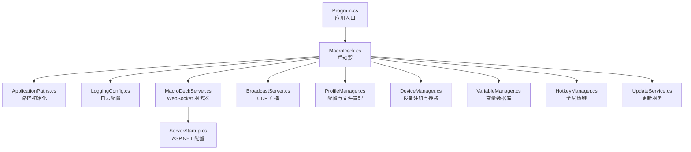
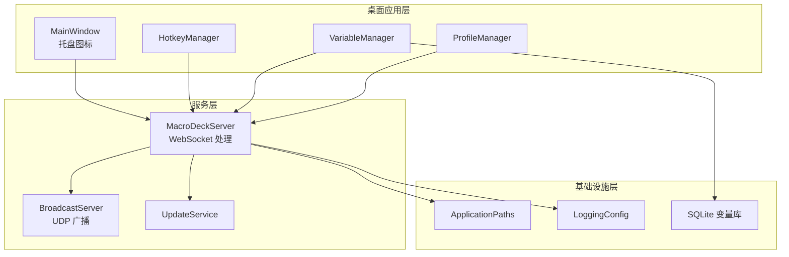
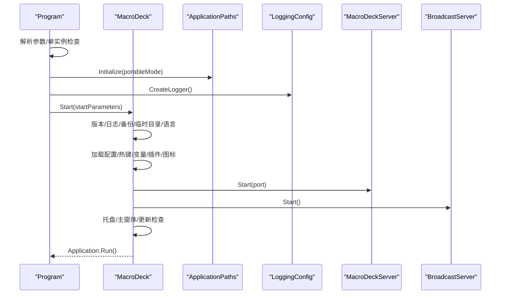
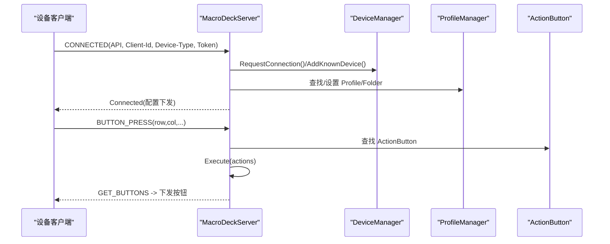
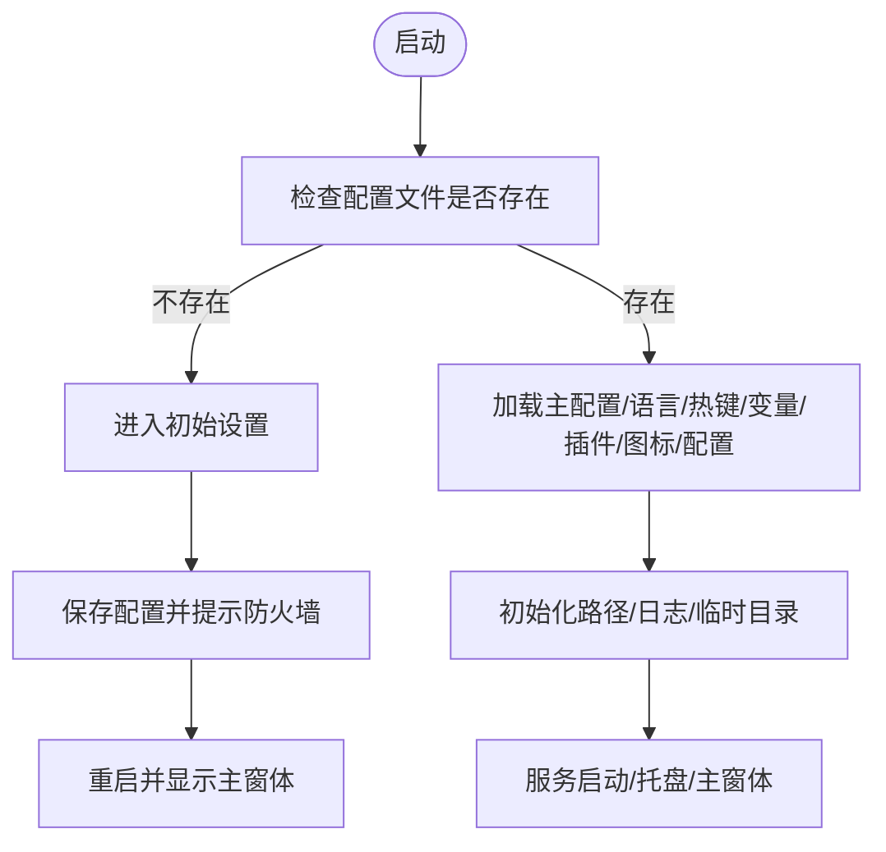
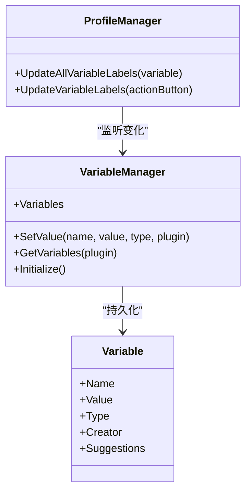
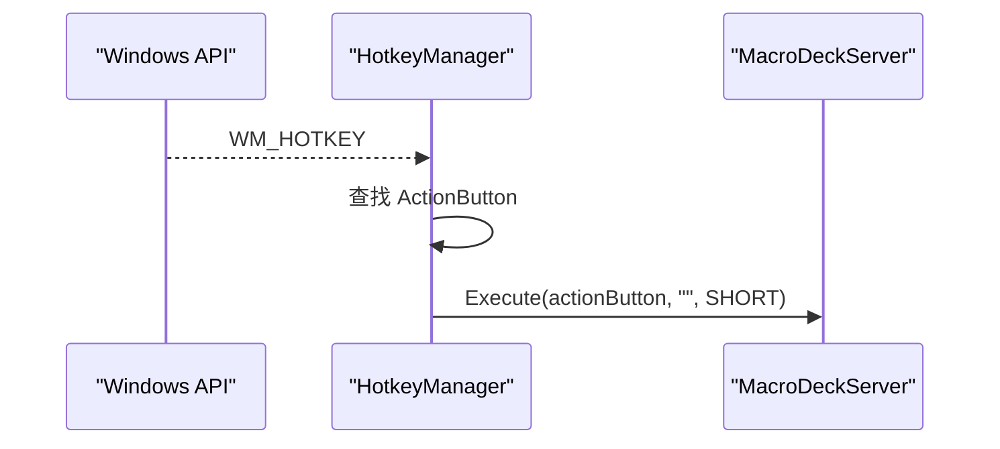
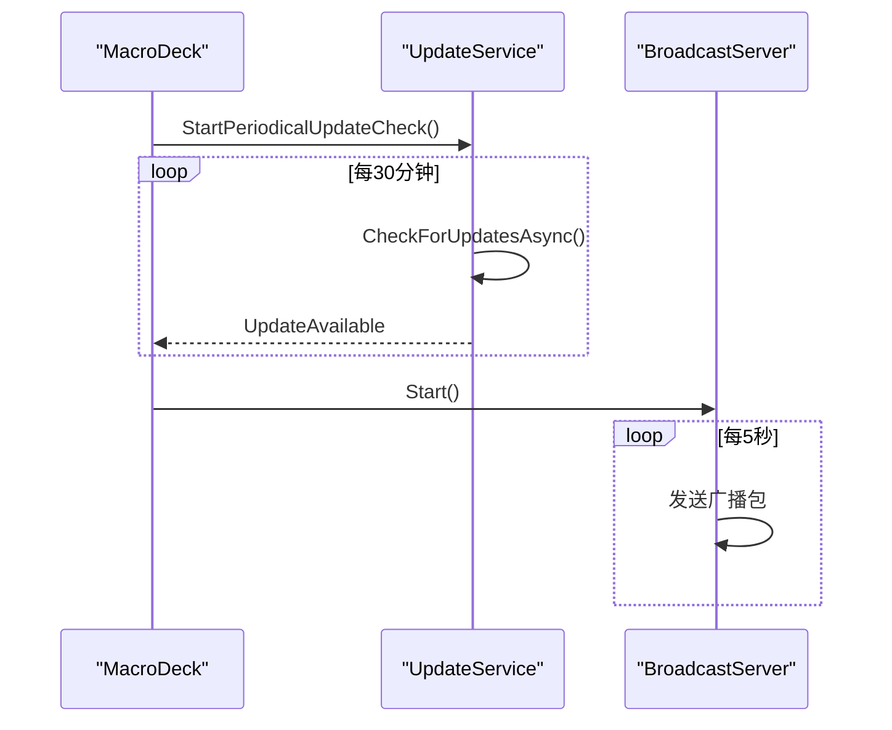
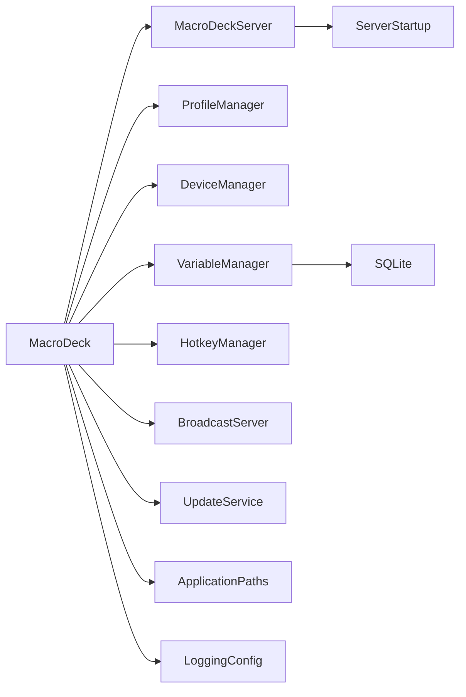

# 整体架构设计

<cite>
**本文引用的文件**
- [Program.cs](file://src/MacroDeck/Program.cs)
- [MacroDeck.cs](file://src/MacroDeck/MacroDeck.cs)
- [ServerStartup.cs](file://src/MacroDeck/ServerStartup.cs)
- [ApplicationPaths.cs](file://src/MacroDeck/StartupConfig/ApplicationPaths.cs)
- [LoggingConfig.cs](file://src/MacroDeck/StartupConfig/LoggingConfig.cs)
- [StartParameters.cs](file://src/MacroDeck/StartupConfig/StartParameters.cs)
- [MacroDeckServer.cs](file://src/MacroDeck/Server/MacroDeckServer.cs)
- [BroadcastServer.cs](file://src/MacroDeck/Server/BroadcastServer.cs)
- [UpdateService.cs](file://src/MacroDeck/Services/UpdateService.cs)
- [ProfileManager.cs](file://src/MacroDeck/Profiles/ProfileManager.cs)
- [DeviceManager.cs](file://src/MacroDeck/Device/DeviceManager.cs)
- [VariableManager.cs](file://src/MacroDeck/Variables/VariableManager.cs)
- [HotkeyManager.cs](file://src/MacroDeck/Hotkeys/HotkeyManager.cs)
- [Constants.cs](file://src/MacroDeck/Constants.cs)
- [GlobalUsings.cs](file://src/MacroDeck/GlobalUsings.cs)
</cite>

## 目录
1. [引言](#引言)
2. [项目结构](#项目结构)
3. [核心组件](#核心组件)
4. [架构总览](#架构总览)
5. [详细组件分析](#详细组件分析)
6. [依赖分析](#依赖分析)
7. [性能考虑](#性能考虑)
8. [故障排查指南](#故障排查指南)
9. [结论](#结论)
10. [附录](#附录)

## 引言
本文件面向 Macro-Deck 的整体架构设计，聚焦于客户端-服务器架构模式、分层与模块化组织、启动流程与生命周期管理、组件间依赖与交互、可扩展性与性能策略，并提供架构图与组件关系图以帮助读者快速把握从入口点到各子系统的完整调用链。

## 项目结构
Macro-Deck 采用 WinForms 桌面应用与嵌入式 Web 服务（ASP.NET Core）相结合的架构。核心入口在 Program.cs，随后由 MacroDeck 启动器完成路径初始化、日志配置、语言与配置加载、插件与图标资源初始化、服务启动与托盘集成等；同时通过内置的 WebSocket 服务器与广播服务对外提供设备连接与发现能力。

图表来源
- [Program.cs:12-35](file://src/MacroDeck/Program.cs#L12-L35)
- [MacroDeck.cs:68-151](file://src/MacroDeck/MacroDeck.cs#L68-L151)
- [ApplicationPaths.cs:36-102](file://src/MacroDeck/StartupConfig/ApplicationPaths.cs#L36-L102)
- [LoggingConfig.cs:21-49](file://src/MacroDeck/StartupConfig/LoggingConfig.cs#L21-L49)
- [MacroDeckServer.cs:28-55](file://src/MacroDeck/Server/MacroDeckServer.cs#L28-L55)
- [BroadcastServer.cs:13-30](file://src/MacroDeck/Server/BroadcastServer.cs#L13-L30)
- [ProfileManager.cs:205-311](file://src/MacroDeck/Profiles/ProfileManager.cs#L205-L311)
- [DeviceManager.cs:21-51](file://src/MacroDeck/Device/DeviceManager.cs#L21-L51)
- [VariableManager.cs:204-212](file://src/MacroDeck/Variables/VariableManager.cs#L204-L212)
- [HotkeyManager.cs:27-31](file://src/MacroDeck/Hotkeys/HotkeyManager.cs#L27-L31)
- [UpdateService.cs:39-43](file://src/MacroDeck/Services/UpdateService.cs#L39-L43)
- [ServerStartup.cs:10-31](file://src/MacroDeck/ServerStartup.cs#L10-L31)

章节来源
- [Program.cs:12-35](file://src/MacroDeck/Program.cs#L12-L35)
- [MacroDeck.cs:68-151](file://src/MacroDeck/MacroDeck.cs#L68-L151)
- [ApplicationPaths.cs:36-102](file://src/MacroDeck/StartupConfig/ApplicationPaths.cs#L36-L102)
- [LoggingConfig.cs:21-49](file://src/MacroDeck/StartupConfig/LoggingConfig.cs#L21-L49)
- [ServerStartup.cs:10-31](file://src/MacroDeck/ServerStartup.cs#L10-L31)

## 核心组件
- 应用入口与异常处理：Program 负责 UI 线程设置、未处理异常捕获、参数解析、单实例检查与日志初始化，然后委托给 MacroDeck 启动器。
- 启动器与生命周期：MacroDeck 负责版本信息、配置加载、语言与热键、变量数据库、插件与图标、配置文件加载、网络接口搜索、服务器与广播启动、管道消息处理、托盘与主窗体生命周期、更新检查与扩展商店扫描。
- 服务器与路由：MacroDeckServer 基于 WebSocket 提供设备连接、按钮事件、配置下发与状态同步；ServerStartup 注册 REST 控制器、CORS、HTTPS 重定向、静态文件与 WebSocket 中间件。
- 配置与存储：ApplicationPaths 统一管理用户数据目录、插件、备份、日志、临时文件、变量数据库与配置文件路径；ProfileManager 负责配置文件的迁移、加载、保存与窗口焦点联动。
- 设备与连接：DeviceManager 管理已知设备、授权请求、阻断与关闭连接。
- 变量系统：VariableManager 使用 SQLite 存储变量，支持类型转换、模板渲染触发与并发更新。
- 热键系统：HotkeyManager 通过 Windows API 注册全局热键，转发至 MacroDeckServer 执行动作。
- 更新与广播：UpdateService 定期检查更新并下载安装；BroadcastServer 通过 UDP 广播本机名称、地址与端口。
- 全局常量与通用命名空间：Constants 定义扩展商店 API 基础地址；GlobalUsings 提供全局 using。

章节来源
- [Program.cs:18-35](file://src/MacroDeck/Program.cs#L18-L35)
- [MacroDeck.cs:68-151](file://src/MacroDeck/MacroDeck.cs#L68-L151)
- [MacroDeckServer.cs:28-55](file://src/MacroDeck/Server/MacroDeckServer.cs#L28-L55)
- [ServerStartup.cs:10-31](file://src/MacroDeck/ServerStartup.cs#L10-L31)
- [ApplicationPaths.cs:36-102](file://src/MacroDeck/StartupConfig/ApplicationPaths.cs#L36-L102)
- [ProfileManager.cs:205-311](file://src/MacroDeck/Profiles/ProfileManager.cs#L205-L311)
- [DeviceManager.cs:21-51](file://src/MacroDeck/Device/DeviceManager.cs#L21-L51)
- [VariableManager.cs:204-212](file://src/MacroDeck/Variables/VariableManager.cs#L204-L212)
- [HotkeyManager.cs:27-31](file://src/MacroDeck/Hotkeys/HotkeyManager.cs#L27-L31)
- [UpdateService.cs:39-43](file://src/MacroDeck/Services/UpdateService.cs#L39-L43)
- [BroadcastServer.cs:13-30](file://src/MacroDeck/Server/BroadcastServer.cs#L13-L30)
- [Constants.cs:5](file://src/MacroDeck/Constants.cs#L5)
- [GlobalUsings.cs:1-6](file://src/MacroDeck/GlobalUsings.cs#L1-L6)

## 架构总览
Macro-Deck 采用“桌面应用 + 内置 Web 服务”的混合架构：
- 客户端-服务器：桌面应用作为控制中心，内置 WebSocket 服务器与广播服务，向外部设备（软件客户端或硬件设备）提供连接与控制能力。
- 分层设计：UI 层（WinForms）、业务逻辑层（MacroDeck 启动器、Profile/Device/Variable 管理）、服务层（WebSocket、广播、更新）、基础设施层（路径、日志、SQLite）。
- 模块化组织：按功能域划分（Server、Profiles、Device、Variables、Services、StartupConfig 等），组件之间通过事件与接口解耦。

图表来源
- [MacroDeck.cs:128-150](file://src/MacroDeck/MacroDeck.cs#L128-L150)
- [MacroDeckServer.cs:28-55](file://src/MacroDeck/Server/MacroDeckServer.cs#L28-L55)
- [BroadcastServer.cs:13-30](file://src/MacroDeck/Server/BroadcastServer.cs#L13-L30)
- [UpdateService.cs:39-43](file://src/MacroDeck/Services/UpdateService.cs#L39-L43)
- [ApplicationPaths.cs:36-102](file://src/MacroDeck/StartupConfig/ApplicationPaths.cs#L36-L102)
- [LoggingConfig.cs:21-49](file://src/MacroDeck/StartupConfig/LoggingConfig.cs#L21-L49)
- [VariableManager.cs:204-212](file://src/MacroDeck/Variables/VariableManager.cs#L204-L212)

## 详细组件分析

### 启动流程与生命周期
- 入口与单实例：Program 初始化 UI、异常处理器、参数解析、单实例检查（通过管道通信唤醒已有实例或终止多余实例），随后初始化路径与日志。
- 启动器：MacroDeck.Start 完成版本记录、日志清理、备份恢复目录检查、临时目录清理、语言加载、初始设置或配置加载、热键、变量数据库、插件与图标、配置加载、网络接口枚举、服务器与广播启动、ADB 初始化、管道消息订阅、托盘与主窗体生命周期、更新检查与扩展商店扫描、必要时显示主窗体。
- 生命周期：MainWindow 的 Load/Close 事件绑定，托盘图标菜单项触发重启与退出；应用退出时停止 ADB 服务。

图表来源
- [Program.cs:25-34](file://src/MacroDeck/Program.cs#L25-L34)
- [MacroDeck.cs:68-151](file://src/MacroDeck/MacroDeck.cs#L68-L151)
- [ApplicationPaths.cs:36-41](file://src/MacroDeck/StartupConfig/ApplicationPaths.cs#L36-L41)
- [LoggingConfig.cs:21-39](file://src/MacroDeck/StartupConfig/LoggingConfig.cs#L21-L39)
- [MacroDeckServer.cs:28-32](file://src/MacroDeck/Server/MacroDeckServer.cs#L28-L32)
- [BroadcastServer.cs:13-30](file://src/MacroDeck/Server/BroadcastServer.cs#L13-L30)

章节来源
- [Program.cs:25-34](file://src/MacroDeck/Program.cs#L25-L34)
- [MacroDeck.cs:68-151](file://src/MacroDeck/MacroDeck.cs#L68-L151)

### WebSocket 服务器与设备交互
- 连接建立：MacroDeckServer 启动后注册 WebSocket 事件，根据配置生成证书，尝试启动服务；新会话加入客户端列表，受配置限制与当前配置文件夹数量影响。
- 消息处理：CONNECTED 认证（API 版本、设备类型、令牌），分配设备与默认配置；BUTTON_* 事件解析行列坐标，定位 ActionButton 并执行对应动作集合；GET_BUTTONS 请求下发当前文件夹所有按钮。
- 状态同步：按钮状态变更通过 MacroDeckServer.UpdateState 推送至所有相关客户端；文件夹切换通过 MacroDeckServer.SetFolder 推送。

图表来源
- [MacroDeckServer.cs:57-244](file://src/MacroDeck/Server/MacroDeckServer.cs#L57-L244)
- [DeviceManager.cs:185-238](file://src/MacroDeck/Device/DeviceManager.cs#L185-L238)
- [ProfileManager.cs:67-125](file://src/MacroDeck/Profiles/ProfileManager.cs#L67-L125)

章节来源
- [MacroDeckServer.cs:57-244](file://src/MacroDeck/Server/MacroDeckServer.cs#L57-L244)
- [DeviceManager.cs:185-238](file://src/MacroDeck/Device/DeviceManager.cs#L185-L238)
- [ProfileManager.cs:67-125](file://src/MacroDeck/Profiles/ProfileManager.cs#L67-L125)

### 配置与文件管理
- 路径管理：ApplicationPaths 在便携与非便携模式下确定用户目录，创建缺失目录，清理临时文件。
- 配置加载：MacroDeck 根据是否存在主配置决定进入初始设置流程或直接加载配置；ProfileManager 支持从旧版 SQLite 数据库迁移至 JSON 文件，自动补全 ID 并保存。
- 保存策略：ProfileManager 使用原子写入（.tmp -> 正式文件）避免损坏；并发保存加锁；删除孤儿文件。

图表来源
- [MacroDeck.cs:96-127](file://src/MacroDeck/MacroDeck.cs#L96-L127)
- [ApplicationPaths.cs:64-102](file://src/MacroDeck/StartupConfig/ApplicationPaths.cs#L64-L102)
- [ProfileManager.cs:205-311](file://src/MacroDeck/Profiles/ProfileManager.cs#L205-L311)

章节来源
- [ApplicationPaths.cs:64-102](file://src/MacroDeck/StartupConfig/ApplicationPaths.cs#L64-L102)
- [ProfileManager.cs:205-311](file://src/MacroDeck/Profiles/ProfileManager.cs#L205-L311)
- [MacroDeck.cs:96-127](file://src/MacroDeck/MacroDeck.cs#L96-L127)

### 变量系统与模板渲染
- 数据库存储：VariableManager 使用 SQLite 表存储变量，支持类型转换与建议值；提供按插件查询与全局查询接口。
- 渲染与联动：ProfileManager 在变量变化时触发模板渲染，重新生成按钮标签位图并推送至所有在线客户端。

图表来源
- [VariableManager.cs:26-138](file://src/MacroDeck/Variables/VariableManager.cs#L26-L138)
- [ProfileManager.cs:135-203](file://src/MacroDeck/Profiles/ProfileManager.cs#L135-L203)

章节来源
- [VariableManager.cs:26-138](file://src/MacroDeck/Variables/VariableManager.cs#L26-L138)
- [ProfileManager.cs:135-203](file://src/MacroDeck/Profiles/ProfileManager.cs#L135-L203)

### 全局热键与动作执行
- 注册与回调：HotkeyManager 通过 Windows API 注册热键，WndProc 捕获消息后查找对应 ActionButton 并调用 MacroDeckServer.Execute 执行短按动作。
- 暂停与恢复：支持暂停热键响应，避免在特定场景下误触。

图表来源
- [HotkeyManager.cs:92-119](file://src/MacroDeck/Hotkeys/HotkeyManager.cs#L92-L119)
- [MacroDeckServer.cs:246-277](file://src/MacroDeck/Server/MacroDeckServer.cs#L246-L277)

章节来源
- [HotkeyManager.cs:92-119](file://src/MacroDeck/Hotkeys/HotkeyManager.cs#L92-L119)
- [MacroDeckServer.cs:246-277](file://src/MacroDeck/Server/MacroDeckServer.cs#L246-L277)

### 更新与广播
- 更新服务：UpdateService 单例运行，周期性检查更新并在可用时触发事件；下载完成后校验哈希并静默安装，随后退出当前进程。
- 广播服务：BroadcastServer 定期向本地广播地址发送计算机名、IP 与端口，便于设备发现。

图表来源
- [MacroDeck.cs:140-143](file://src/MacroDeck/MacroDeck.cs#L140-L143)
- [UpdateService.cs:121-136](file://src/MacroDeck/Services/UpdateService.cs#L121-L136)
- [BroadcastServer.cs:58-77](file://src/MacroDeck/Server/BroadcastServer.cs#L58-L77)

章节来源
- [MacroDeck.cs:140-143](file://src/MacroDeck/MacroDeck.cs#L140-L143)
- [UpdateService.cs:121-136](file://src/MacroDeck/Services/UpdateService.cs#L121-L136)
- [BroadcastServer.cs:58-77](file://src/MacroDeck/Server/BroadcastServer.cs#L58-L77)

## 依赖分析
- 组件耦合与内聚：MacroDeck 启动器聚合多个子系统，但通过事件与静态管理器降低直接耦合；ServerStartup 将 ASP.NET 配置与 MacroDeckServer 解耦。
- 外部依赖：Newtonsoft.Json 用于配置序列化；SQLite 用于变量持久化；Serilog 用于统一日志；System.Net.Http 用于更新下载；System.Timers 用于广播定时器。
- 循环依赖：未见明显循环依赖；ProfileManager 对 MacroDeckServer 与 VariableManager 的调用为单向事件驱动。

图表来源
- [MacroDeck.cs:106-120](file://src/MacroDeck/MacroDeck.cs#L106-L120)
- [MacroDeckServer.cs:28-32](file://src/MacroDeck/Server/MacroDeckServer.cs#L28-L32)
- [ServerStartup.cs:10-31](file://src/MacroDeck/ServerStartup.cs#L10-L31)
- [VariableManager.cs:204-212](file://src/MacroDeck/Variables/VariableManager.cs#L204-L212)
- [ApplicationPaths.cs:36-41](file://src/MacroDeck/StartupConfig/ApplicationPaths.cs#L36-L41)
- [LoggingConfig.cs:21-39](file://src/MacroDeck/StartupConfig/LoggingConfig.cs#L21-L39)

章节来源
- [MacroDeck.cs:106-120](file://src/MacroDeck/MacroDeck.cs#L106-L120)
- [MacroDeckServer.cs:28-32](file://src/MacroDeck/Server/MacroDeckServer.cs#L28-L32)
- [ServerStartup.cs:10-31](file://src/MacroDeck/ServerStartup.cs#L10-L31)
- [VariableManager.cs:204-212](file://src/MacroDeck/Variables/VariableManager.cs#L204-L212)
- [ApplicationPaths.cs:36-41](file://src/MacroDeck/StartupConfig/ApplicationPaths.cs#L36-L41)
- [LoggingConfig.cs:21-39](file://src/MacroDeck/StartupConfig/LoggingConfig.cs#L21-L39)

## 性能考虑
- 日志与 I/O：Serilog 控制台与文件双写，按天滚动与大小限制；临时目录清理减少磁盘占用。
- 并发与锁：ProfileManager 保存使用互斥锁，避免竞态；变量渲染并行处理按钮标签。
- 网络与连接：WebSocket 会话上限与配置限制防止过载；广播间隔与错误吞吐保证稳定性。
- 资源管理：托盘图标与主窗体生命周期严格绑定；ADB 服务在退出时显式停止。

## 故障排查指南
- 服务器启动失败：查看日志输出与弹窗提示，确认端口占用与证书生成；检查配置中的 SSL 与主机地址。
- 设备无法连接：确认设备令牌、API 版本匹配与 AskOnNewConnections 设置；检查 Known Devices 列表与阻断状态。
- 变量渲染异常：检查模板语法与变量名一致性；查看日志中序列化/反序列化错误。
- 热键无效：确认热键未被系统或其他应用占用；检查暂停状态与修饰键组合。
- 更新下载失败：检查网络连通与哈希校验；查看下载进度与临时目录权限。

章节来源
- [MacroDeckServer.cs:44-54](file://src/MacroDeck/Server/MacroDeckServer.cs#L44-L54)
- [DeviceManager.cs:185-238](file://src/MacroDeck/Device/DeviceManager.cs#L185-L238)
- [VariableManager.cs:126-135](file://src/MacroDeck/Variables/VariableManager.cs#L126-L135)
- [HotkeyManager.cs:92-119](file://src/MacroDeck/Hotkeys/HotkeyManager.cs#L92-L119)
- [UpdateService.cs:138-158](file://src/MacroDeck/Services/UpdateService.cs#L138-L158)

## 结论
Macro-Deck 通过清晰的入口与启动器职责划分、模块化的子系统与事件驱动的交互方式，构建了稳定且可扩展的桌面+服务架构。WebSocket 服务器与广播服务使设备发现与控制成为可能；Profile/Device/Variable 管理器提供了灵活的配置与状态同步机制；日志与路径管理确保了可观测性与可维护性。未来可在插件隔离、服务容器化与异步 I/O 深化方面进一步优化。

## 附录
- 参数与配置：StartParameters 支持端口、便携模式、调试控制台、日志级别等；ApplicationPaths 提供路径初始化与清理。
- 常量与命名：Constants 定义扩展商店 API 地址；GlobalUsings 提供全局 using。

章节来源
- [StartParameters.cs:36-77](file://src/MacroDeck/StartupConfig/StartParameters.cs#L36-L77)
- [ApplicationPaths.cs:36-102](file://src/MacroDeck/StartupConfig/ApplicationPaths.cs#L36-L102)
- [Constants.cs:5](file://src/MacroDeck/Constants.cs#L5)
- [GlobalUsings.cs:1-6](file://src/MacroDeck/GlobalUsings.cs#L1-L6)