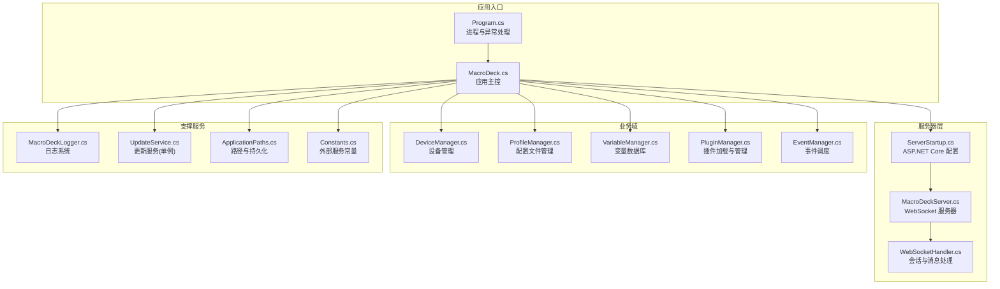
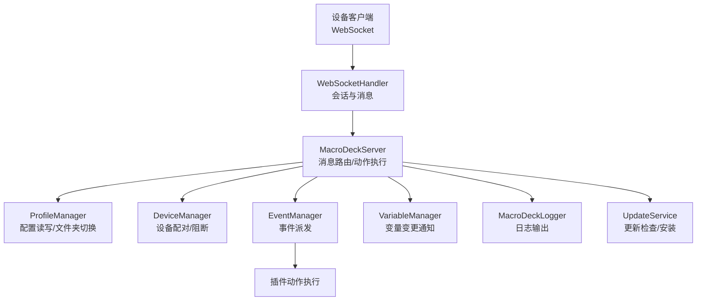
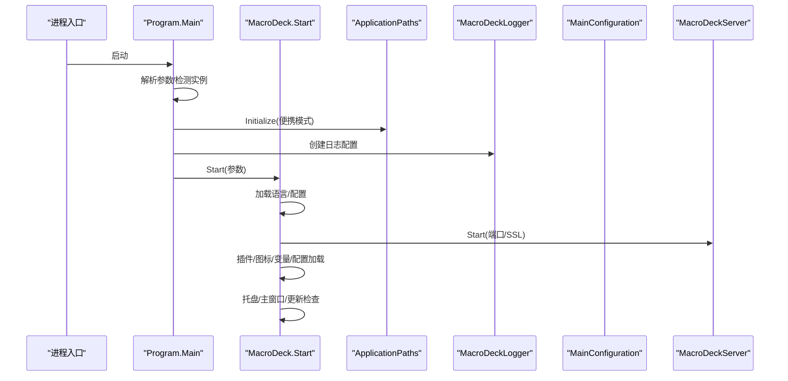
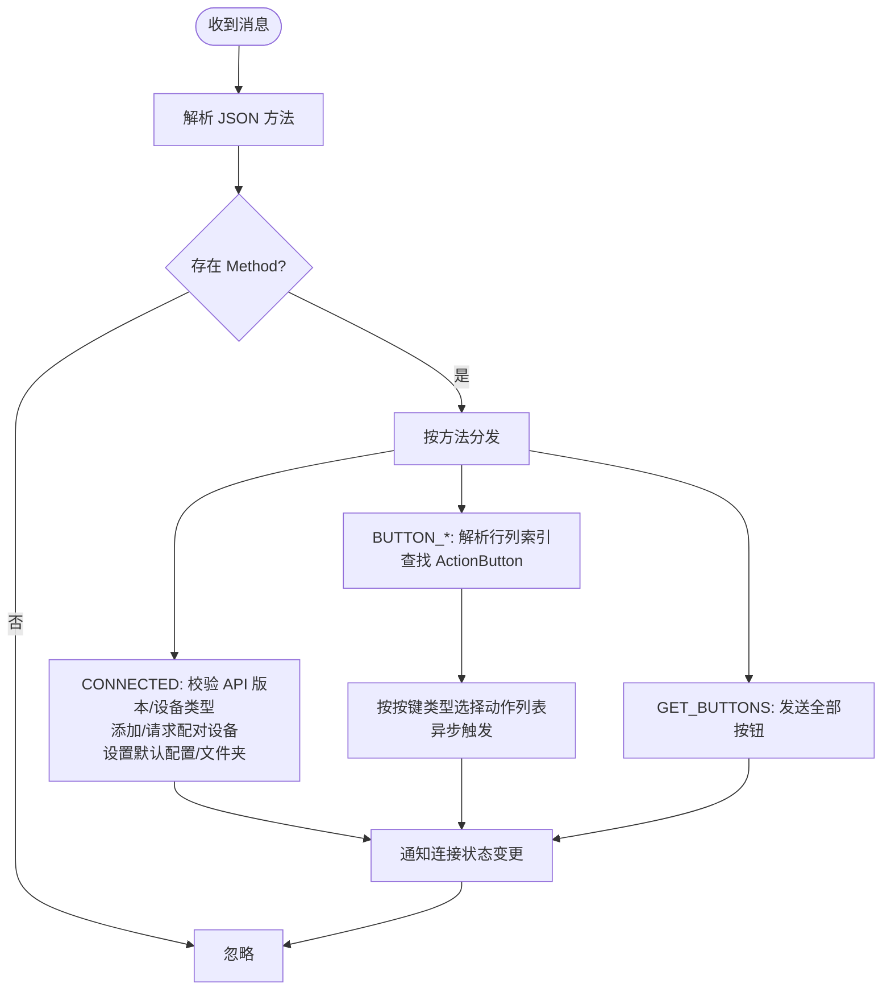
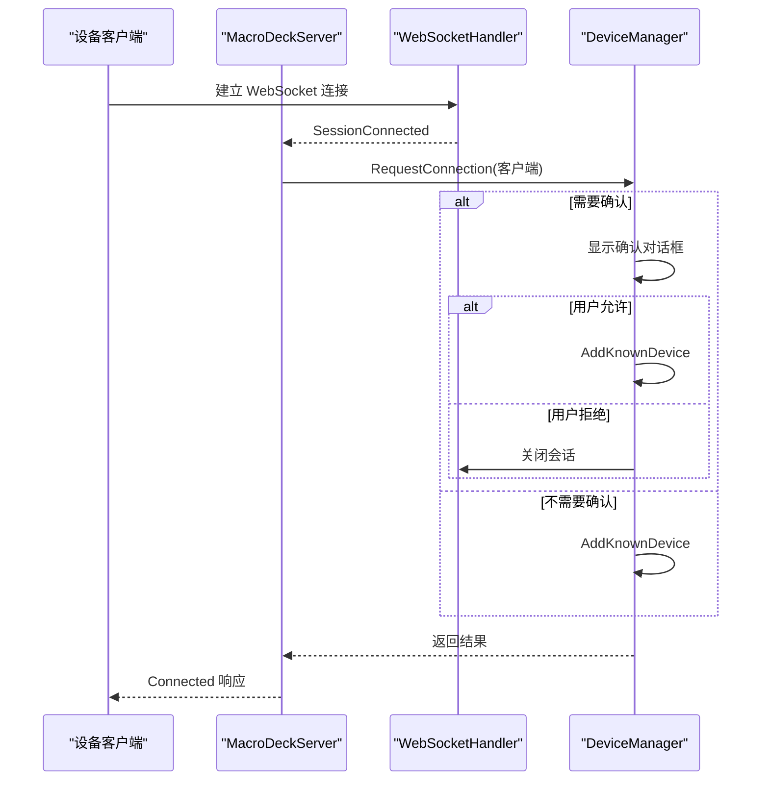
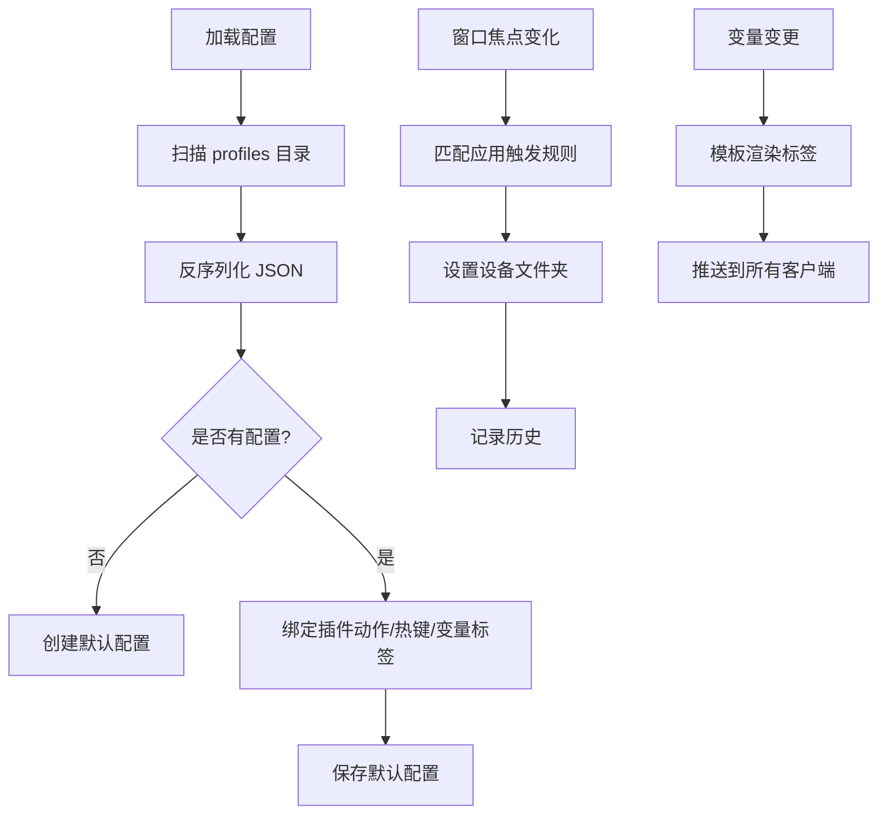
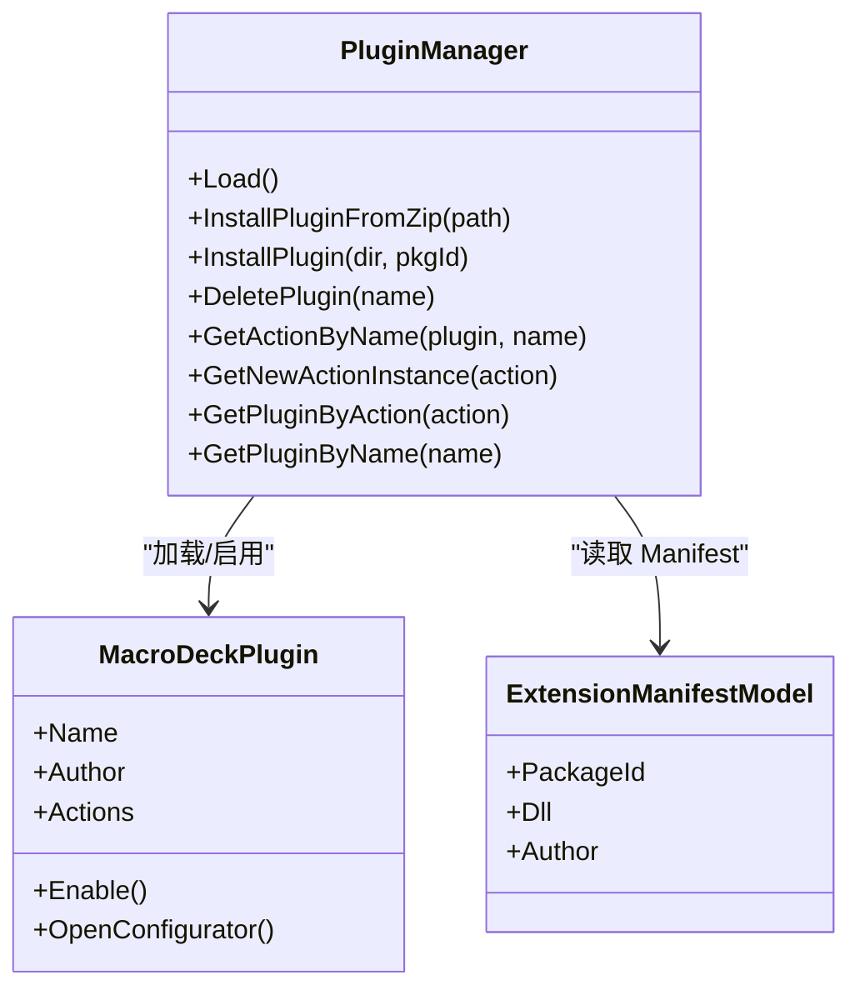
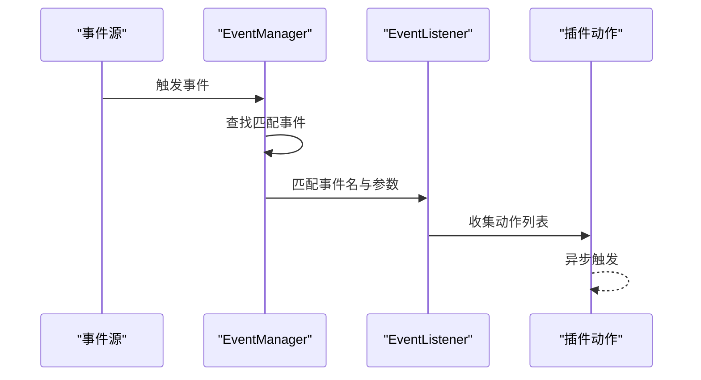
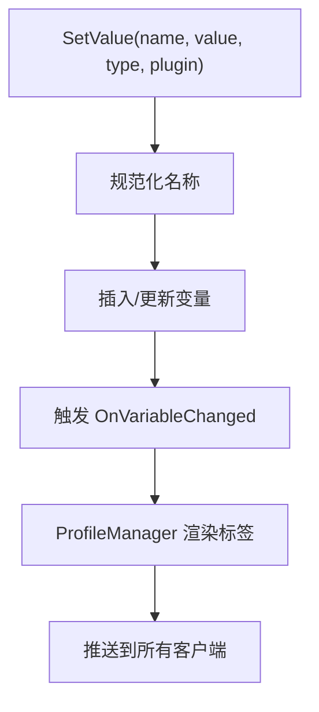
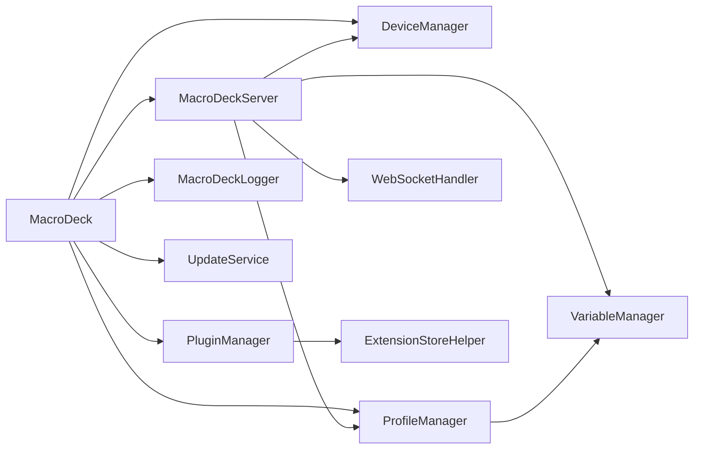

# 核心架构设计

<cite>
**本文档引用的文件**
- [MacroDeck.cs](file://src/MacroDeck/MacroDeck.cs)
- [Program.cs](file://src/MacroDeck/Program.cs)
- [ServerStartup.cs](file://src/MacroDeck/ServerStartup.cs)
- [Constants.cs](file://src/MacroDeck/Constants.cs)
- [GlobalUsings.cs](file://src/MacroDeck/GlobalUsings.cs)
- [MacroDeckServer.cs](file://src/MacroDeck/Server/MacroDeckServer.cs)
- [WebSocketHandler.cs](file://src/MacroDeck/WebSocketHandler.cs)
- [MacroDeckClient.cs](file://src/MacroDeck/DataTypes/MacroDeckClient.cs)
- [DeviceManager.cs](file://src/MacroDeck/Device/DeviceManager.cs)
- [ProfileManager.cs](file://src/MacroDeck/Profiles/ProfileManager.cs)
- [PluginManager.cs](file://src/MacroDeck/Plugins/PluginManager.cs)
- [EventManager.cs](file://src/MacroDeck/Events/EventManager.cs)
- [EventListener.cs](file://src/MacroDeck/Events/EventListener.cs)
- [VariableManager.cs](file://src/MacroDeck/Variables/VariableManager.cs)
- [MacroDeckLogger.cs](file://src/MacroDeck/Logging/MacroDeckLogger.cs)
- [UpdateService.cs](file://src/MacroDeck/Serices/UpdateService.cs)
- [ApplicationPaths.cs](file://src/MacroDeck/StartupConfig/ApplicationPaths.cs)
</cite>

## 目录
1. [引言](#引言)
2. [项目结构](#项目结构)
3. [核心组件](#核心组件)
4. [架构总览](#架构总览)
5. [详细组件分析](#详细组件分析)
6. [依赖关系分析](#依赖关系分析)
7. [性能考量](#性能考量)
8. [故障排除指南](#故障排除指南)
9. [结论](#结论)
10. [附录](#附录)

## 引言
本文件面向 Macro-Deck 的核心架构，聚焦于高层设计、架构模式与系统边界，系统采用客户端-服务器架构与事件驱动设计，结合插件化扩展能力，支持设备连接、按钮动作执行、变量模板渲染、热键管理、更新服务与日志监控等核心功能。文档详细说明组件交互、数据流与集成模式，并对单例、观察者、工厂与策略等模式的应用进行深入解析，同时给出基础设施要求、可扩展性考虑与部署拓扑建议。

## 项目结构
项目采用分层与功能域混合的组织方式：
- 启动与入口：Program.cs 负责进程生命周期与异常处理；MacroDeck.cs 作为应用主控，协调各子系统初始化。
- 服务器层：MacroDeckServer 与 WebSocketHandler 提供 WebSocket 通信与消息路由；ServerStartup 配置 ASP.NET Core 中间件。
- 设备与配置：DeviceManager 管理已知设备；ProfileManager 管理配置文件与文件系统持久化；VariableManager 管理变量数据库。
- 插件体系：PluginManager 动态加载插件，支持安装、卸载、更新与内部插件注册。
- 事件系统：EventManager 统一调度事件监听器触发的动作序列。
- 日志与更新：MacroDeckLogger 使用 Serilog 进行结构化日志；UpdateService 单例实现自动更新检查与下载安装。
- 路径与配置：ApplicationPaths 定义用户数据目录与文件路径；Constants 定义外部服务地址常量。

**图表来源**
- [Program.cs:1-80](file://src/MacroDeck/Program.cs#L1-L80)
- [MacroDeck.cs:68-151](file://src/MacroDeck/MacroDeck.cs#L68-L151)
- [ServerStartup.cs:8-32](file://src/MacroDeck/ServerStartup.cs#L8-L32)
- [MacroDeckServer.cs:28-55](file://src/MacroDeck/Server/MacroDeckServer.cs#L28-L55)
- [DeviceManager.cs:21-51](file://src/MacroDeck/Device/DeviceManager.cs#L21-L51)
- [ProfileManager.cs:205-311](file://src/MacroDeck/Profiles/ProfileManager.cs#L205-L311)
- [VariableManager.cs:204-212](file://src/MacroDeck/Variables/VariableManager.cs#L204-L212)
- [PluginManager.cs:39-133](file://src/MacroDeck/Plugins/PluginManager.cs#L39-L133)
- [EventManager.cs:9-22](file://src/MacroDeck/Events/EventManager.cs#L9-L22)
- [MacroDeckLogger.cs:15-35](file://src/MacroDeck/Logging/MacroDeckLogger.cs#L15-L35)
- [UpdateService.cs:22-26](file://src/MacroDeck/Serices/UpdateService.cs#L22-L26)
- [ApplicationPaths.cs:36-61](file://src/MacroDeck/StartupConfig/ApplicationPaths.cs#L36-L61)
- [Constants.cs:5](file://src/MacroDeck/Constants.cs#L5)

**章节来源**
- [Program.cs:12-35](file://src/MacroDeck/Program.cs#L12-L35)
- [MacroDeck.cs:68-151](file://src/MacroDeck/MacroDeck.cs#L68-L151)
- [ServerStartup.cs:10-30](file://src/MacroDeck/ServerStartup.cs#L10-L30)

## 核心组件
- 应用主控（MacroDeck）：负责启动参数解析、初始设置、语言与配置加载、服务启动（服务器、广播、ADB）、托盘图标与主窗口生命周期管理、更新与扩展商店检查。
- 服务器（MacroDeckServer + WebSocketHandler）：基于 ASP.NET Core 的 WebSocket 服务器，负责设备连接、消息路由、按钮动作执行、状态同步与客户端会话管理。
- 设备管理（DeviceManager）：维护“已知设备”列表，处理新连接请求、阻断与重命名，支持设备与配置文件的双向绑定。
- 配置管理（ProfileManager）：JSON 文件持久化配置，支持迁移、并发保存、窗口焦点切换触发的文件夹切换、变量标签渲染。
- 插件管理（PluginManager）：动态加载插件，支持安装/卸载/更新、内部插件注册、安全模式与更新检测。
- 事件系统（EventManager + EventListener）：统一事件注册与派发，按事件名与参数筛选匹配的动作集合执行。
- 变量系统（VariableManager）：SQLite 数据库存储变量，类型转换与变更通知，模板渲染支持。
- 日志系统（MacroDeckLogger）：Serilog 结构化日志，运行时可调整日志级别，支持插件来源标记。
- 更新服务（UpdateService）：单例实现自动更新检查、下载校验与静默安装。
- 路径与常量（ApplicationPaths + Constants）：定义用户数据目录、文件路径与外部服务地址。

**章节来源**
- [MacroDeck.cs:35-151](file://src/MacroDeck/MacroDeck.cs#L35-L151)
- [MacroDeckServer.cs:16-55](file://src/MacroDeck/Server/MacroDeckServer.cs#L16-L55)
- [DeviceManager.cs:12-51](file://src/MacroDeck/Device/DeviceManager.cs#L12-L51)
- [ProfileManager.cs:20-311](file://src/MacroDeck/Profiles/ProfileManager.cs#L20-L311)
- [PluginManager.cs:20-133](file://src/MacroDeck/Plugins/PluginManager.cs#L20-L133)
- [EventManager.cs:3-22](file://src/MacroDeck/Events/EventManager.cs#L3-L22)
- [VariableManager.cs:10-212](file://src/MacroDeck/Variables/VariableManager.cs#L10-L212)
- [MacroDeckLogger.cs:11-35](file://src/MacroDeck/Logging/MacroDeckLogger.cs#L11-L35)
- [UpdateService.cs:15-26](file://src/MacroDeck/Serices/UpdateService.cs#L15-L26)
- [ApplicationPaths.cs:6-61](file://src/MacroDeck/StartupConfig/ApplicationPaths.cs#L6-L61)
- [Constants.cs:5](file://src/MacroDeck/Constants.cs#L5)

## 架构总览
系统采用“桌面应用 + 内嵌 Web 服务器”的混合架构：
- 客户端-服务器：桌面端作为服务器，设备通过 WebSocket 连接；REST API 由 ASP.NET Core 提供静态资源与控制器（在当前代码中主要使用 WebSocket）。
- 事件驱动：按钮事件、变量变更、窗口焦点变化通过事件系统异步派发，动作以插件 Action 执行。
- 插件架构：插件通过 Manifest 动态加载，支持启用/禁用、更新与配置流程。
- 持久化：配置文件（JSON）、变量数据库（SQLite）、设备清单（JSON）、日志与临时文件（目录）。
- 安全与证书：可选 HTTPS，自动生成/验证证书；连接令牌用于快速配对。

**图表来源**
- [MacroDeckServer.cs:57-244](file://src/MacroDeck/Server/MacroDeckServer.cs#L57-L244)
- [WebSocketHandler.cs](file://src/MacroDeck/WebSocketHandler.cs)
- [ProfileManager.cs:62-125](file://src/MacroDeck/Profiles/ProfileManager.cs#L62-L125)
- [DeviceManager.cs:185-238](file://src/MacroDeck/Device/DeviceManager.cs#L185-L238)
- [EventManager.cs:24-41](file://src/MacroDeck/Events/EventManager.cs#L24-L41)
- [VariableManager.cs:127-138](file://src/MacroDeck/Variables/VariableManager.cs#L127-L138)
- [MacroDeckLogger.cs:64-77](file://src/MacroDeck/Logging/MacroDeckLogger.cs#L64-L77)
- [UpdateService.cs:39-85](file://src/MacroDeck/Serices/UpdateService.cs#L39-L85)

## 详细组件分析

### 宏观启动与生命周期（Program → MacroDeck）
- 进程唯一性：通过管道通信检测已有实例，若存在则发送显示主窗命令，否则终止旧实例。
- 初始化顺序：路径初始化 → 日志初始化 → 配置加载 → 初始设置向导 → 插件加载 → 图标与托盘 → 主窗口与消息循环。
- 服务器启动：根据端口与 SSL 配置启动 WebSocket 服务器，广播服务与 ADB 辅助服务异步初始化。

**图表来源**
- [Program.cs:25-34](file://src/MacroDeck/Program.cs#L25-L34)
- [MacroDeck.cs:68-151](file://src/MacroDeck/MacroDeck.cs#L68-L151)
- [ApplicationPaths.cs:36-61](file://src/MacroDeck/StartupConfig/ApplicationPaths.cs#L36-L61)
- [MacroDeckLogger.cs:15-35](file://src/MacroDeck/Logging/MacroDeckLogger.cs#L15-L35)

**章节来源**
- [Program.cs:37-66](file://src/MacroDeck/Program.cs#L37-L66)
- [MacroDeck.cs:96-120](file://src/MacroDeck/MacroDeck.cs#L96-L120)

### WebSocket 服务器与消息处理（MacroDeckServer + WebSocketHandler）
- 会话管理：建立连接后创建客户端对象，限制最大连接数与新连接阻断策略；断开时清理。
- 消息路由：根据 Method 分发到不同处理分支（连接、按钮事件、获取按钮）；按钮事件根据按键类型选择对应动作列表并异步执行。
- 状态同步：配置变更、文件夹切换、按钮状态更新通过设备消息协议下发至客户端。

**图表来源**
- [MacroDeckServer.cs:123-244](file://src/MacroDeck/Server/MacroDeckServer.cs#L123-L244)
- [MacroDeckServer.cs:246-277](file://src/MacroDeck/Server/MacroDeckServer.cs#L246-L277)

**章节来源**
- [MacroDeckServer.cs:28-121](file://src/MacroDeck/Server/MacroDeckServer.cs#L28-L121)
- [MacroDeckServer.cs:123-244](file://src/MacroDeck/Server/MacroDeckServer.cs#L123-L244)

### 设备管理（DeviceManager）
- 已知设备：从 devices.json 反序列化，支持保存与去重；提供查询、重命名、移除与阻断。
- 新连接请求：根据配置决定是否弹窗确认；确认后加入已知设备或直接添加；阻断时关闭会话。
- 设备与配置绑定：设置设备所属配置文件 ID，并在可用时推送配置与文件夹。

**图表来源**
- [DeviceManager.cs:185-238](file://src/MacroDeck/Device/DeviceManager.cs#L185-L238)
- [MacroDeckServer.cs:74-91](file://src/MacroDeck/Server/MacroDeckServer.cs#L74-L91)

**章节来源**
- [DeviceManager.cs:21-81](file://src/MacroDeck/Device/DeviceManager.cs#L21-L81)
- [DeviceManager.cs:185-277](file://src/MacroDeck/Device/DeviceManager.cs#L185-L277)

### 配置管理（ProfileManager）
- 加载：扫描 profiles 目录，反序列化 JSON；若无配置则创建默认配置；迁移旧版 SQLite 数据库。
- 保存：加锁保证并发安全，先写入临时文件再原子替换；删除孤儿文件。
- 窗口焦点触发：根据进程名与应用触发规则动态切换设备文件夹，并记录历史以便还原。
- 变量标签：变量变更时批量渲染按钮标签并推送到所有客户端。

**图表来源**
- [ProfileManager.cs:205-311](file://src/MacroDeck/Profiles/ProfileManager.cs#L205-L311)
- [ProfileManager.cs:62-125](file://src/MacroDeck/Profiles/ProfileManager.cs#L62-L125)
- [ProfileManager.cs:127-203](file://src/MacroDeck/Profiles/ProfileManager.cs#L127-L203)

**章节来源**
- [ProfileManager.cs:205-380](file://src/MacroDeck/Profiles/ProfileManager.cs#L205-L380)
- [ProfileManager.cs:62-125](file://src/MacroDeck/Profiles/ProfileManager.cs#L62-L125)

### 插件管理（PluginManager）
- 加载：扫描插件目录，读取 Manifest，反射加载插件类型，启用插件并异步检查更新。
- 安装/卸载：支持 ZIP 安装与删除标记机制；更新采用“.updates”目录过渡。
- 查询与克隆：提供按名称查找、动作实例克隆与插件动作定位。
- 内部插件：内置 ActionButton、Variables、Folder、Device 插件自动启用。

**图表来源**
- [PluginManager.cs:39-133](file://src/MacroDeck/Plugins/PluginManager.cs#L39-L133)
- [PluginManager.cs:141-202](file://src/MacroDeck/Plugins/PluginManager.cs#L141-L202)
- [PluginManager.cs:290-396](file://src/MacroDeck/Plugins/PluginManager.cs#L290-L396)

**章节来源**
- [PluginManager.cs:39-133](file://src/MacroDeck/Plugins/PluginManager.cs#L39-L133)
- [PluginManager.cs:141-202](file://src/MacroDeck/Plugins/PluginManager.cs#L141-L202)

### 事件系统（EventManager + EventListener）
- 注册：按事件名注册 IMacroDeckEvent，订阅其触发事件。
- 触发：根据事件名与参数筛选匹配的 EventListener，收集动作列表并在后台线程依次触发。

**图表来源**
- [EventManager.cs:9-22](file://src/MacroDeck/Events/EventManager.cs#L9-L22)
- [EventManager.cs:24-41](file://src/MacroDeck/Events/EventManager.cs#L24-L41)
- [EventListener.cs:5-12](file://src/MacroDeck/Events/EventListener.cs#L5-L12)

**章节来源**
- [EventManager.cs:3-43](file://src/MacroDeck/Events/EventManager.cs#L3-L43)
- [EventListener.cs:1-12](file://src/MacroDeck/Events/EventListener.cs#L1-L12)

### 变量系统（VariableManager）
- 存储：SQLite 表存储变量，支持字符串、整型、浮点、布尔类型转换与建议值。
- 变更通知：SetValue 后触发 OnVariableChanged，ProfileManager 订阅并重新渲染标签。
- 名称规范化：将空格与特殊字符转下划线，德文字母转 ASCII。

**图表来源**
- [VariableManager.cs:54-138](file://src/MacroDeck/Variables/VariableManager.cs#L54-L138)
- [ProfileManager.cs:127-203](file://src/MacroDeck/Profiles/ProfileManager.cs#L127-L203)

**章节来源**
- [VariableManager.cs:204-249](file://src/MacroDeck/Variables/VariableManager.cs#L204-L249)

### 日志系统（MacroDeckLogger）
- 结构化：统一使用 Serilog，支持插件来源标记；运行时可调整最小日志级别。
- 清理：定期清理 30 天前的日志文件。

**章节来源**
- [MacroDeckLogger.cs:15-35](file://src/MacroDeck/Logging/MacroDeckLogger.cs#L15-L35)
- [MacroDeckLogger.cs:318-331](file://src/MacroDeck/Logging/MacroDeckLogger.cs#L318-L331)

### 更新服务（UpdateService）
- 单例：确保全局只有一个更新服务实例。
- 自动检查：周期性调用远程 API 检查更新，支持 Beta 版本。
- 下载与校验：下载到临时目录，计算 SHA-256 校验，成功后静默安装并退出当前进程。

**章节来源**
- [UpdateService.cs:15-26](file://src/MacroDeck/Serices/UpdateService.cs#L15-L26)
- [UpdateService.cs:39-85](file://src/MacroDeck/Serices/UpdateService.cs#L39-L85)
- [UpdateService.cs:108-119](file://src/MacroDeck/Serices/UpdateService.cs#L108-L119)

### 路径与常量（ApplicationPaths + Constants）
- 路径：便携模式与非便携模式分别指向不同根目录；创建缺失目录并检查权限。
- 常量：扩展商店与更新服务 API 地址集中管理。

**章节来源**
- [ApplicationPaths.cs:36-102](file://src/MacroDeck/StartupConfig/ApplicationPaths.cs#L36-L102)
- [Constants.cs:5](file://src/MacroDeck/Constants.cs#L5)

## 依赖关系分析
- 组件耦合：
  - MacroDeck 对服务器、设备、配置、插件、事件、日志、更新均有强依赖。
  - MacroDeckServer 依赖 WebSocketHandler、DeviceManager、ProfileManager、变量系统与插件动作。
  - PluginManager 依赖 ApplicationPaths、ExtensionStoreHelper 与插件类型反射。
- 外部依赖：
  - Serilog（日志）
  - Newtonsoft.Json（JSON 序列化）
  - SQLite（变量存储）
  - ASP.NET Core（WebSocket/中间件）
  - Windows Forms（UI 与托盘）

**图表来源**
- [MacroDeck.cs:106-110](file://src/MacroDeck/MacroDeck.cs#L106-L110)
- [MacroDeckServer.cs:16-32](file://src/MacroDeck/Server/MacroDeckServer.cs#L16-L32)
- [PluginManager.cs:141-170](file://src/MacroDeck/Plugins/PluginManager.cs#L141-L170)
- [ProfileManager.cs:127-133](file://src/MacroDeck/Profiles/ProfileManager.cs#L127-L133)

**章节来源**
- [MacroDeck.cs:106-110](file://src/MacroDeck/MacroDeck.cs#L106-L110)
- [MacroDeckServer.cs:16-32](file://src/MacroDeck/Server/MacroDeckServer.cs#L16-L32)
- [PluginManager.cs:141-170](file://src/MacroDeck/Plugins/PluginManager.cs#L141-L170)

## 性能考量
- 并发控制：ProfileManager 保存操作使用锁；UpdateService 检查与下载使用信号量避免并发。
- 异步执行：按钮动作与事件派发均在后台任务执行，避免阻塞主线程。
- 资源复用：日志系统与路径初始化在应用早期完成，减少后续 IO 开销。
- I/O 优化：配置保存采用临时文件写入后再原子替换，降低损坏风险。

[本节为通用指导，无需特定文件引用]

## 故障排除指南
- 无法启动服务器：检查端口占用与防火墙；查看错误提示框与日志；确认 SSL 证书生成与权限。
- 插件加载失败：查看日志中的反序列化错误；确认 Manifest 文件完整性；SafeMode 会在加载失败时启用。
- 设备无法连接：确认新连接请求策略与配对流程；检查设备是否被阻断；查看连接对话框返回值。
- 变量渲染异常：检查模板语法与变量名；确认类型转换逻辑；查看日志中的警告信息。
- 更新失败：检查网络连通性与哈希校验；确认下载路径与权限；查看更新服务日志。

**章节来源**
- [MacroDeckServer.cs:42-54](file://src/MacroDeck/Server/MacroDeckServer.cs#L42-L54)
- [PluginManager.cs:179-199](file://src/MacroDeck/Plugins/PluginManager.cs#L179-L199)
- [DeviceManager.cs:253-276](file://src/MacroDeck/Device/DeviceManager.cs#L253-L276)
- [VariableManager.cs:199-202](file://src/MacroDeck/Variables/VariableManager.cs#L199-L202)
- [UpdateService.cs:138-158](file://src/MacroDeck/Serices/UpdateService.cs#L138-L158)

## 结论
Macro-Deck 采用清晰的分层与事件驱动架构，结合插件化扩展与结构化日志，实现了设备连接、配置管理、变量渲染与自动更新的完整闭环。通过单例模式管理更新服务、通过观察者模式解耦事件派发、通过工厂式插件加载实现模块化扩展，整体具备良好的可维护性与可扩展性。建议在生产环境中强化证书轮换、日志保留策略与备份恢复流程，以提升安全性与可靠性。

[本节为总结，无需特定文件引用]

## 附录
- 技术栈与版本兼容性（基于代码引用）：
  - .NET 运行时与框架：未在仓库中显式声明，但使用了 System.*、Newtonsoft.Json、Serilog、SQLite 等库。
  - WebSocket/HTTP：ASP.NET Core（中间件与路由）。
  - UI：Windows Forms。
  - 第三方库：Serilog、Newtonsoft.Json、SQLite。
- 基础设施要求：
  - Windows 平台（基于托盘与 Windows Forms）。
  - 端口开放（WebSocket 服务器端口），可选 HTTPS。
  - 用户数据目录写入权限（ApplicationPaths 定义的路径）。
- 部署拓扑：
  - 单机部署：桌面应用内嵌服务器，设备通过局域网连接。
  - 可选：将扩展商店与更新服务地址指向企业内部镜像（Constants 中定义）。

[本节为概览，无需特定文件引用]