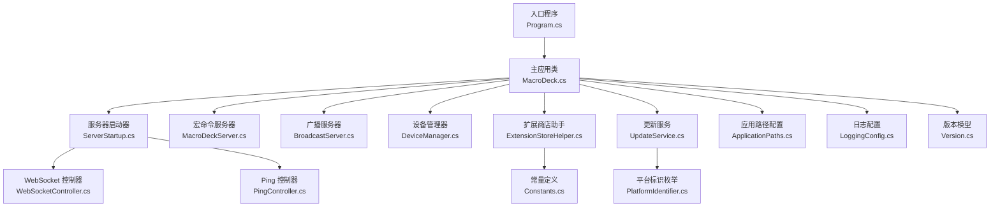
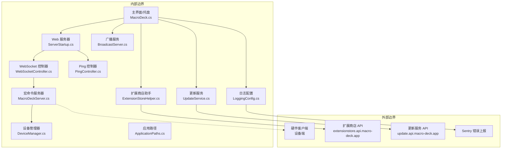
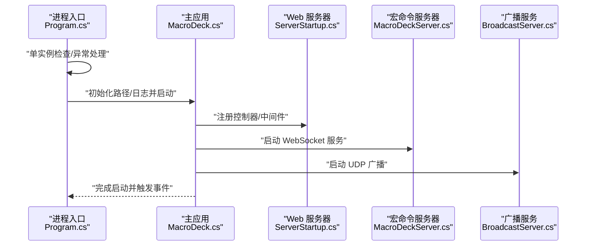
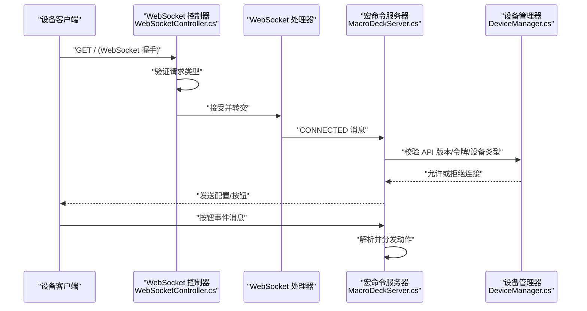
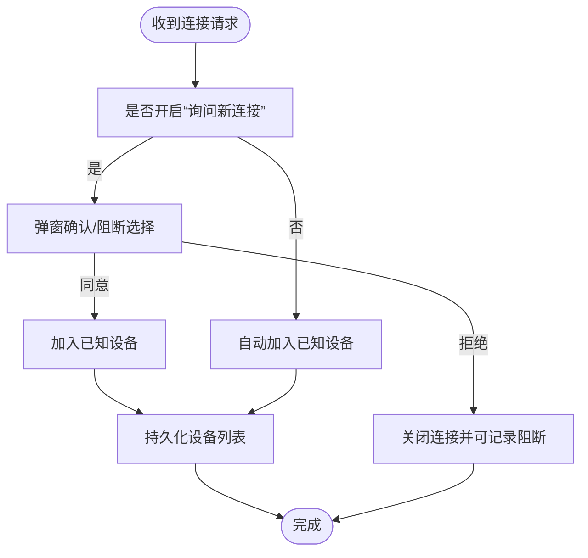
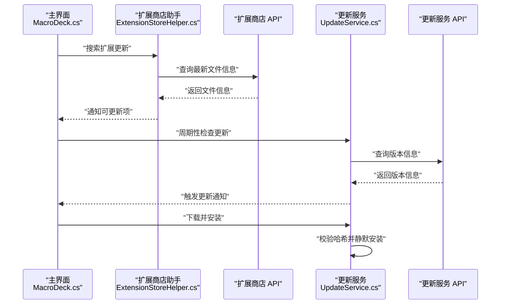
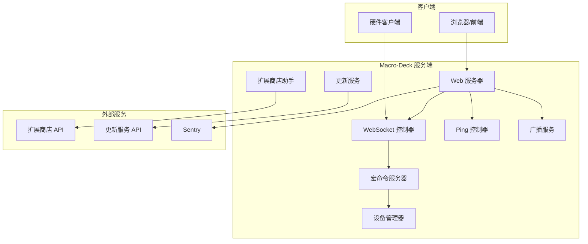
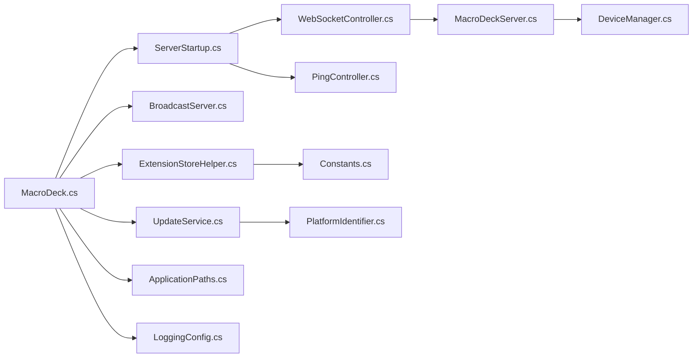

# 系统边界与集成

<cite>
**本文引用的文件**
- [Program.cs](file://src/MacroDeck/Program.cs)
- [MacroDeck.cs](file://src/MacroDeck/MacroDeck.cs)
- [ServerStartup.cs](file://src/MacroDeck/ServerStartup.cs)
- [WebSocketController.cs](file://src/MacroDeck/Controllers/WebSocketController.cs)
- [PingController.cs](file://src/MacroDeck/Controllers/PingController.cs)
- [MacroDeckServer.cs](file://src/MacroDeck/Server/MacroDeckServer.cs)
- [BroadcastServer.cs](file://src/MacroDeck/Server/BroadcastServer.cs)
- [DeviceManager.cs](file://src/MacroDeck/Device/DeviceManager.cs)
- [ExtensionStoreHelper.cs](file://src/MacroDeck/ExtensionStore/ExtensionStoreHelper.cs)
- [UpdateService.cs](file://src/MacroDeck/Serices/UpdateService.cs)
- [Version.cs](file://src/MacroDeck/DataTypes/Core/Version.cs)
- [ApplicationPaths.cs](file://src/MacroDeck/StartupConfig/ApplicationPaths.cs)
- [LoggingConfig.cs](file://src/MacroDeck/StartupConfig/LoggingConfig.cs)
- [PlatformIdentifier.cs](file://src/MacroDeck/Enums/PlatformIdentifier.cs)
- [Constants.cs](file://src/MacroDeck/Constants.cs)
</cite>

## 目录
1. [引言](#引言)
2. [项目结构](#项目结构)
3. [核心组件](#核心组件)
4. [架构总览](#架构总览)
5. [详细组件分析](#详细组件分析)
6. [依赖关系分析](#依赖关系分析)
7. [性能考量](#性能考量)
8. [故障排查指南](#故障排查指南)
9. [结论](#结论)
10. [附录](#附录)

## 引言
本文件聚焦 Macro-Deck 的系统边界与集成，明确界定桌面应用与网络服务的内外部边界，梳理设备连接、扩展商店、更新服务与第三方 API 的集成点，阐明 API 设计原则与版本管理策略，说明安全边界与访问控制机制，并给出跨平台兼容性与系统要求、系统集成图、API 接口规范、故障处理与降级策略，以及性能监控与日志记录的边界考虑。

## 项目结构
Macro-Deck 是一个基于 .NET 的桌面应用，内置轻量级 Web 服务器（ASP.NET Core）与 WebSocket 通道，用于与硬件设备通信；同时通过扩展商店与更新服务实现生态扩展与版本演进。启动流程从入口程序开始，初始化路径与日志，随后启动主服务、广播服务、设备管理与扩展商店等子系统。

图表来源
- [Program.cs:1-80](file://src/MacroDeck/Program.cs#L1-L80)
- [MacroDeck.cs:68-151](file://src/MacroDeck/MacroDeck.cs#L68-L151)
- [ServerStartup.cs:8-31](file://src/MacroDeck/ServerStartup.cs#L8-L31)
- [WebSocketController.cs:5-20](file://src/MacroDeck/Controllers/WebSocketController.cs#L5-L20)
- [PingController.cs:6-14](file://src/MacroDeck/Controllers/PingController.cs#L6-L14)
- [MacroDeckServer.cs:28-55](file://src/MacroDeck/Server/MacroDeckServer.cs#L28-L55)
- [BroadcastServer.cs:13-30](file://src/MacroDeck/Server/BroadcastServer.cs#L13-L30)
- [DeviceManager.cs:21-51](file://src/MacroDeck/Device/DeviceManager.cs#L21-L51)
- [ExtensionStoreHelper.cs:71-131](file://src/MacroDeck/ExtensionStore/ExtensionStoreHelper.cs#L71-L131)
- [UpdateService.cs:39-85](file://src/MacroDeck/Serices/UpdateService.cs#L39-L85)
- [ApplicationPaths.cs:36-102](file://src/MacroDeck/StartupConfig/ApplicationPaths.cs#L36-L102)
- [LoggingConfig.cs:21-49](file://src/MacroDeck/StartupConfig/LoggingConfig.cs#L21-L49)
- [Constants.cs:4-6](file://src/MacroDeck/Constants.cs#L4-L6)
- [PlatformIdentifier.cs:3-11](file://src/MacroDeck/Enums/PlatformIdentifier.cs#L3-L11)
- [Version.cs:31-73](file://src/MacroDeck/DataTypes/Core/Version.cs#L31-L73)

章节来源
- [Program.cs:12-35](file://src/MacroDeck/Program.cs#L12-L35)
- [MacroDeck.cs:68-151](file://src/MacroDeck/MacroDeck.cs#L68-L151)
- [ServerStartup.cs:10-30](file://src/MacroDeck/ServerStartup.cs#L10-L30)

## 核心组件
- 入口与生命周期：入口程序负责异常捕获、单实例检查、路径初始化与日志构建，并调用主应用启动逻辑。
- 主应用类：负责语言、热键、变量、插件、图标、配置加载，启动服务器与广播，初始化托盘与窗口，周期性检查更新与扩展商店。
- 服务器与路由：使用 ASP.NET Core 启动 REST 与 WebSocket 路由，启用 CORS、HTTPS 重定向、静态文件与 WebSocket。
- 宏命令服务器：管理客户端会话、设备连接状态、按钮事件分发与配置下发。
- 广播服务：UDP 广播本机名称、地址与端口，便于发现。
- 设备管理：维护已知设备列表、连接请求确认、阻断与重命名、配置切换。
- 扩展商店与更新：检查扩展更新、下载安装；检查应用更新、下载安装。
- 配置与日志：统一路径管理、滚动日志、Sentry 错误上报开关。

章节来源
- [Program.cs:37-66](file://src/MacroDeck/Program.cs#L37-L66)
- [MacroDeck.cs:68-151](file://src/MacroDeck/MacroDeck.cs#L68-L151)
- [ServerStartup.cs:15-30](file://src/MacroDeck/ServerStartup.cs#L15-L30)
- [MacroDeckServer.cs:28-55](file://src/MacroDeck/Server/MacroDeckServer.cs#L28-L55)
- [BroadcastServer.cs:13-30](file://src/MacroDeck/Server/BroadcastServer.cs#L13-L30)
- [DeviceManager.cs:185-238](file://src/MacroDeck/Device/DeviceManager.cs#L185-L238)
- [ExtensionStoreHelper.cs:71-131](file://src/MacroDeck/ExtensionStore/ExtensionStoreHelper.cs#L71-L131)
- [UpdateService.cs:39-85](file://src/MacroDeck/Serices/UpdateService.cs#L39-L85)
- [ApplicationPaths.cs:36-102](file://src/MacroDeck/StartupConfig/ApplicationPaths.cs#L36-L102)
- [LoggingConfig.cs:21-49](file://src/MacroDeck/StartupConfig/LoggingConfig.cs#L21-L49)

## 架构总览
系统边界分为“内部”与“外部”。内部边界包括桌面应用进程、本地文件系统、内存数据结构与本地网络接口；外部边界包括设备端（硬件客户端）、扩展商店 API、更新服务 API 与第三方错误上报服务。

图表来源
- [MacroDeck.cs:113-115](file://src/MacroDeck/MacroDeck.cs#L113-L115)
- [ServerStartup.cs:15-30](file://src/MacroDeck/ServerStartup.cs#L15-L30)
- [WebSocketController.cs:7-19](file://src/MacroDeck/Controllers/WebSocketController.cs#L7-L19)
- [PingController.cs:9-13](file://src/MacroDeck/Controllers/PingController.cs#L9-L13)
- [MacroDeckServer.cs:34-55](file://src/MacroDeck/Server/MacroDeckServer.cs#L34-L55)
- [DeviceManager.cs:185-238](file://src/MacroDeck/Device/DeviceManager.cs#L185-L238)
- [BroadcastServer.cs:58-77](file://src/MacroDeck/Server/BroadcastServer.cs#L58-L77)
- [ExtensionStoreHelper.cs:162-187](file://src/MacroDeck/ExtensionStore/ExtensionStoreHelper.cs#L162-L187)
- [UpdateService.cs:28-85](file://src/MacroDeck/Serices/UpdateService.cs#L28-L85)
- [LoggingConfig.cs:42-46](file://src/MacroDeck/StartupConfig/LoggingConfig.cs#L42-L46)

## 详细组件分析

### 桌面应用边界与生命周期
- 单实例与异常处理：入口程序注册未处理异常事件，避免崩溃并记录日志；支持通过命名管道唤醒已有实例。
- 路径与日志：在便携模式与用户目录模式下确定数据路径；Serilog 在 ASP.NET Host 前即初始化，确保全生命周期日志可用。
- 启动顺序：语言、热键、变量、插件、图标、配置加载后，启动服务器、广播与 ADB 辅助，初始化托盘与主窗口，最后启动周期性更新检查与扩展商店扫描。

图表来源
- [Program.cs:37-66](file://src/MacroDeck/Program.cs#L37-L66)
- [MacroDeck.cs:68-151](file://src/MacroDeck/MacroDeck.cs#L68-L151)
- [ServerStartup.cs:10-30](file://src/MacroDeck/ServerStartup.cs#L10-L30)
- [BroadcastServer.cs:13-30](file://src/MacroDeck/Server/BroadcastServer.cs#L13-L30)

章节来源
- [Program.cs:18-35](file://src/MacroDeck/Program.cs#L18-L35)
- [MacroDeck.cs:88-151](file://src/MacroDeck/MacroDeck.cs#L88-L151)
- [ApplicationPaths.cs:36-102](file://src/MacroDeck/StartupConfig/ApplicationPaths.cs#L36-L102)
- [LoggingConfig.cs:21-49](file://src/MacroDeck/StartupConfig/LoggingConfig.cs#L21-L49)

### 网络服务边界与协议
- REST 与 WebSocket：启用 CORS、HTTPS 重定向、静态文件与 WebSocket，KeepAlive 间隔为 2 分钟。
- WebSocket 控制器：仅接受 WebSocket 请求，否则重定向到前端页面；交由 WebSocket 处理器接管。
- 宏命令协议：客户端需满足最低 API 版本；握手阶段校验 API 版本、设备类型与令牌；后续根据按钮事件分派动作执行。

图表来源
- [WebSocketController.cs:7-19](file://src/MacroDeck/Controllers/WebSocketController.cs#L7-L19)
- [MacroDeckServer.cs:141-200](file://src/MacroDeck/Server/MacroDeckServer.cs#L141-L200)
- [DeviceManager.cs:185-238](file://src/MacroDeck/Device/DeviceManager.cs#L185-L238)

章节来源
- [ServerStartup.cs:15-30](file://src/MacroDeck/ServerStartup.cs#L15-L30)
- [WebSocketController.cs:7-19](file://src/MacroDeck/Controllers/WebSocketController.cs#L7-L19)
- [MacroDeckServer.cs:141-200](file://src/MacroDeck/Server/MacroDeckServer.cs#L141-L200)

### 设备连接与管理
- 连接流程：新连接时若开启“询问新连接”，弹窗确认；已知设备可直接通过；阻断设备会被记录并拒绝接入。
- 已知设备持久化：使用 JSON 序列化保存，带类型处理与原子写入（临时文件 + 移动）。
- 配置与状态：设备可设置显示名、绑定配置文件；连接建立后下发当前配置与按钮集。

图表来源
- [DeviceManager.cs:185-238](file://src/MacroDeck/Device/DeviceManager.cs#L185-L238)
- [DeviceManager.cs:53-81](file://src/MacroDeck/Device/DeviceManager.cs#L53-L81)

章节来源
- [DeviceManager.cs:185-238](file://src/MacroDeck/Device/DeviceManager.cs#L185-L238)
- [DeviceManager.cs:53-81](file://src/MacroDeck/Device/DeviceManager.cs#L53-L81)

### 扩展商店与更新服务
- 扩展商店：按包 ID 检查扩展更新，支持批量更新；通过对话框安装；通知系统提示可更新项。
- 更新服务：定期轮询更新 API，支持 Beta 版本；下载完成后校验哈希，静默安装并重启应用。

图表来源
- [ExtensionStoreHelper.cs:71-131](file://src/MacroDeck/ExtensionStore/ExtensionStoreHelper.cs#L71-L131)
- [ExtensionStoreHelper.cs:162-187](file://src/MacroDeck/ExtensionStore/ExtensionStoreHelper.cs#L162-L187)
- [UpdateService.cs:51-106](file://src/MacroDeck/Serices/UpdateService.cs#L51-L106)
- [UpdateService.cs:121-136](file://src/MacroDeck/Serices/UpdateService.cs#L121-L136)

章节来源
- [ExtensionStoreHelper.cs:71-131](file://src/MacroDeck/ExtensionStore/ExtensionStoreHelper.cs#L71-L131)
- [ExtensionStoreHelper.cs:162-187](file://src/MacroDeck/ExtensionStore/ExtensionStoreHelper.cs#L162-L187)
- [UpdateService.cs:51-106](file://src/MacroDeck/Serices/UpdateService.cs#L51-L106)
- [UpdateService.cs:121-136](file://src/MacroDeck/Serices/UpdateService.cs#L121-L136)

### API 设计原则与版本管理
- API 版本策略：应用 API 版本与插件 API 版本分别定义，设备握手时必须满足最低版本要求，否则拒绝连接。
- 版本模型：支持主/次/补丁与 Beta 号，字符串解析与格式化遵循语义化版本规则。
- 扩展商店 API：按包 ID 查询文件信息，携带应用版本与插件 API 版本参数。
- 更新服务 API：按当前版本与平台标识查询更新，支持 Beta 参数。

章节来源
- [MacroDeck.cs:38-39](file://src/MacroDeck/MacroDeck.cs#L38-L39)
- [MacroDeckServer.cs:145-149](file://src/MacroDeck/Server/MacroDeckServer.cs#L145-L149)
- [Version.cs:31-73](file://src/MacroDeck/DataTypes/Core/Version.cs#L31-L73)
- [ExtensionStoreHelper.cs:162-171](file://src/MacroDeck/ExtensionStore/ExtensionStoreHelper.cs#L162-L171)
- [UpdateService.cs:53-57](file://src/MacroDeck/Serices/UpdateService.cs#L53-L57)

### 安全边界与访问控制
- SSL/TLS：服务器启动前确保有效证书，可启用 HTTPS 重定向。
- 访问控制：可阻止新连接、限制最大连接数、要求当前有配置文件夹；连接时校验令牌与 API 版本。
- 权限与隔离：日志与数据存储于用户目录（或便携模式下的应用目录），默认不暴露外部端口；广播采用 UDP 广播，无认证。
- 第三方上报：Sentry 错误上报条件配置，尊重用户匿名上报选项。

章节来源
- [MacroDeckServer.cs:40-44](file://src/MacroDeck/Server/MacroDeckServer.cs#L40-L44)
- [MacroDeckServer.cs:82-88](file://src/MacroDeck/Server/MacroDeckServer.cs#L82-L88)
- [MacroDeckServer.cs:158-161](file://src/MacroDeck/Server/MacroDeckServer.cs#L158-L161)
- [LoggingConfig.cs:42-46](file://src/MacroDeck/StartupConfig/LoggingConfig.cs#L42-L46)

### 跨平台兼容性与系统要求
- 平台标识：包含 Windows、macOS、Linux 多平台标识，更新服务按平台选择下载包。
- 系统要求：需要 .NET 运行时；Windows 防火墙提示在首次运行时出现；网络接口检测失败时记录错误但不影响功能。

章节来源
- [PlatformIdentifier.cs:3-11](file://src/MacroDeck/Enums/PlatformIdentifier.cs#L3-L11)
- [MacroDeck.cs:197-204](file://src/MacroDeck/MacroDeck.cs#L197-L204)

### 系统集成图与 API 接口规范

#### 系统集成图

图表来源
- [ServerStartup.cs:15-30](file://src/MacroDeck/ServerStartup.cs#L15-L30)
- [WebSocketController.cs:7-19](file://src/MacroDeck/Controllers/WebSocketController.cs#L7-L19)
- [PingController.cs:9-13](file://src/MacroDeck/Controllers/PingController.cs#L9-L13)
- [MacroDeckServer.cs:34-55](file://src/MacroDeck/Server/MacroDeckServer.cs#L34-L55)
- [BroadcastServer.cs:58-77](file://src/MacroDeck/Server/BroadcastServer.cs#L58-L77)
- [ExtensionStoreHelper.cs:162-187](file://src/MacroDeck/ExtensionStore/ExtensionStoreHelper.cs#L162-L187)
- [UpdateService.cs:28-85](file://src/MacroDeck/Serices/UpdateService.cs#L28-L85)
- [LoggingConfig.cs:42-46](file://src/MacroDeck/StartupConfig/LoggingConfig.cs#L42-L46)

#### API 接口规范（REST）
- 路由与方法
  - GET /ping：健康检查，返回简单响应对象。
- 中间件与安全
  - 启用 CORS（允许任意源）、HTTPS 重定向（如启用）、静态文件、WebSocket、路由与端点映射。
- 返回值
  - ping：返回包含时间戳与状态的结构化对象。

章节来源
- [PingController.cs:6-14](file://src/MacroDeck/Controllers/PingController.cs#L6-L14)
- [ServerStartup.cs:15-30](file://src/MacroDeck/ServerStartup.cs#L15-L30)

#### WebSocket 协议（设备端）
- 握手与连接
  - 客户端需发起 WebSocket 请求；服务端校验 API 版本、设备类型与令牌；满足条件后建立会话并下发配置。
- 按钮事件
  - 客户端上报按钮按下/释放/长按/长按释放事件，服务端解析行列号并执行对应动作集合。
- 配置同步
  - 切换配置或文件夹时，服务端向客户端推送全部按钮或单个按钮更新。

章节来源
- [WebSocketController.cs:7-19](file://src/MacroDeck/Controllers/WebSocketController.cs#L7-L19)
- [MacroDeckServer.cs:141-244](file://src/MacroDeck/Server/MacroDeckServer.cs#L141-L244)

### 故障处理与降级策略
- 服务器启动失败：捕获异常并弹出错误对话框，记录日志。
- 网络接口缺失：记录警告与错误，不影响其他功能。
- 扩展更新检查失败：记录错误并跳过该包，继续检查其他扩展。
- 更新下载校验失败：抛出异常并终止安装流程，避免损坏安装。
- 日志清理：启动时清理临时目录，避免磁盘占用增长。

章节来源
- [MacroDeckServer.cs:46-54](file://src/MacroDeck/Server/MacroDeckServer.cs#L46-L54)
- [MacroDeck.cs:197-204](file://src/MacroDeck/MacroDeck.cs#L197-L204)
- [ExtensionStoreHelper.cs:181-186](file://src/MacroDeck/ExtensionStore/ExtensionStoreHelper.cs#L181-L186)
- [UpdateService.cs:138-158](file://src/MacroDeck/Serices/UpdateService.cs#L138-L158)
- [MacroDeck.cs:92](file://src/MacroDeck/MacroDeck.cs#L92)

### 性能监控与日志记录边界
- 日志级别与输出：控制台、文件（每日滚动，50MB 限制）、调试控制台；可选 Sentry 上报。
- 关键事件：启动耗时统计、网络接口发现结果、连接建立/断开、按钮事件执行。
- 性能建议：WebSocket KeepAlive 间隔合理；广播频率固定；扩展与更新检查采用异步与并发限制；日志滚动避免过大文件。

章节来源
- [LoggingConfig.cs:21-49](file://src/MacroDeck/StartupConfig/LoggingConfig.cs#L21-L49)
- [MacroDeck.cs:135-136](file://src/MacroDeck/MacroDeck.cs#L135-L136)
- [MacroDeckServer.cs:199](file://src/MacroDeck/Server/MacroDeckServer.cs#L199)

## 依赖关系分析
- 组件耦合
  - MacroDeck.cs 作为编排者，依赖各子系统；WebSocket 控制器与宏命令服务器强耦合；设备管理器与宏命令服务器双向交互。
- 外部依赖
  - 扩展商店与更新服务 API；Sentry（可选）；系统网络接口与文件系统。
- 循环依赖
  - 未见循环依赖迹象；各模块职责清晰。

图表来源
- [MacroDeck.cs:68-151](file://src/MacroDeck/MacroDeck.cs#L68-L151)
- [ServerStartup.cs:10-30](file://src/MacroDeck/ServerStartup.cs#L10-L30)
- [WebSocketController.cs:5-20](file://src/MacroDeck/Controllers/WebSocketController.cs#L5-L20)
- [PingController.cs:6-14](file://src/MacroDeck/Controllers/PingController.cs#L6-L14)
- [MacroDeckServer.cs:34-55](file://src/MacroDeck/Server/MacroDeckServer.cs#L34-L55)
- [DeviceManager.cs:185-238](file://src/MacroDeck/Device/DeviceManager.cs#L185-L238)
- [BroadcastServer.cs:13-30](file://src/MacroDeck/Server/BroadcastServer.cs#L13-L30)
- [ExtensionStoreHelper.cs:71-131](file://src/MacroDeck/ExtensionStore/ExtensionStoreHelper.cs#L71-L131)
- [UpdateService.cs:39-85](file://src/MacroDeck/Serices/UpdateService.cs#L39-L85)
- [Constants.cs:4-6](file://src/MacroDeck/Constants.cs#L4-L6)
- [PlatformIdentifier.cs:3-11](file://src/MacroDeck/Enums/PlatformIdentifier.cs#L3-L11)
- [ApplicationPaths.cs:36-102](file://src/MacroDeck/StartupConfig/ApplicationPaths.cs#L36-L102)
- [LoggingConfig.cs:21-49](file://src/MacroDeck/StartupConfig/LoggingConfig.cs#L21-L49)

## 性能考量
- 并发与限流：更新检查与下载采用信号量限制并发，避免资源争用。
- I/O 优化：设备列表持久化使用临时文件 + 原子移动，减少锁竞争与损坏风险。
- 网络效率：WebSocket 长连接减少握手开销；广播周期固定，避免频繁网络负载。
- 日志滚动：文件大小限制与每日滚动，平衡可观测性与磁盘占用。

## 故障排查指南
- 无法启动服务器：查看日志中的异常堆栈，确认端口占用与证书有效性。
- 设备无法连接：检查 API 版本、设备类型与令牌；确认是否被阻断；查看网络接口发现日志。
- 扩展更新失败：确认网络可达扩展商店 API；检查包 ID 与版本参数；查看具体异常日志。
- 更新下载失败：确认下载链接有效、目标路径可写、哈希校验通过。
- 日志问题：确认日志目录存在且可写，滚动文件未被外部工具锁定。

章节来源
- [MacroDeckServer.cs:46-54](file://src/MacroDeck/Server/MacroDeckServer.cs#L46-L54)
- [MacroDeckServer.cs:145-161](file://src/MacroDeck/Server/MacroDeckServer.cs#L145-L161)
- [ExtensionStoreHelper.cs:181-186](file://src/MacroDeck/ExtensionStore/ExtensionStoreHelper.cs#L181-L186)
- [UpdateService.cs:138-158](file://src/MacroDeck/Serices/UpdateService.cs#L138-L158)
- [ApplicationPaths.cs:64-102](file://src/MacroDeck/StartupConfig/ApplicationPaths.cs#L64-L102)

## 结论
Macro-Deck 将桌面应用、本地服务器与外部生态服务有机结合：内部通过严格的版本校验与访问控制保障安全，外部通过扩展商店与更新服务实现生态繁荣与持续演进。日志与错误上报贯穿始终，广播与 WebSocket 提供高效发现与交互能力。建议在生产环境中启用 HTTPS、合理配置防火墙，并对扩展与更新流程进行审计与回滚策略设计。

## 附录
- 常量与平台标识：扩展商店 API 基址、平台标识枚举。
- 版本模型：语义化版本解析与格式化。

章节来源
- [Constants.cs:4-6](file://src/MacroDeck/Constants.cs#L4-L6)
- [PlatformIdentifier.cs:3-11](file://src/MacroDeck/Enums/PlatformIdentifier.cs#L3-L11)
- [Version.cs:31-73](file://src/MacroDeck/DataTypes/Core/Version.cs#L31-L73)