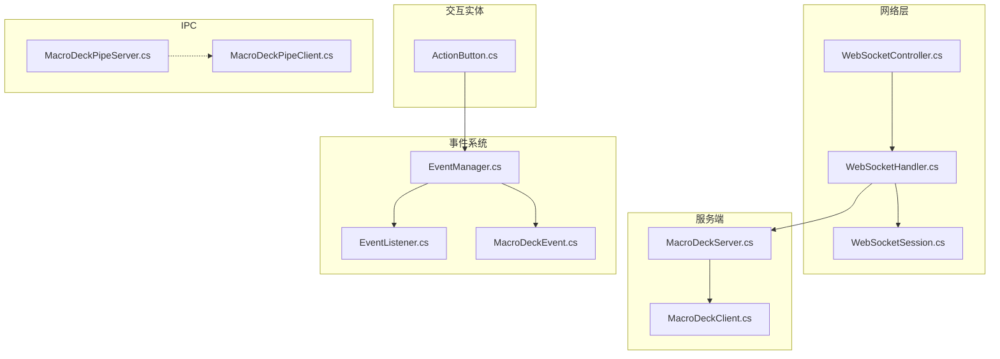
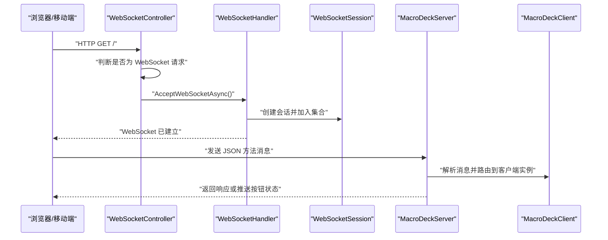
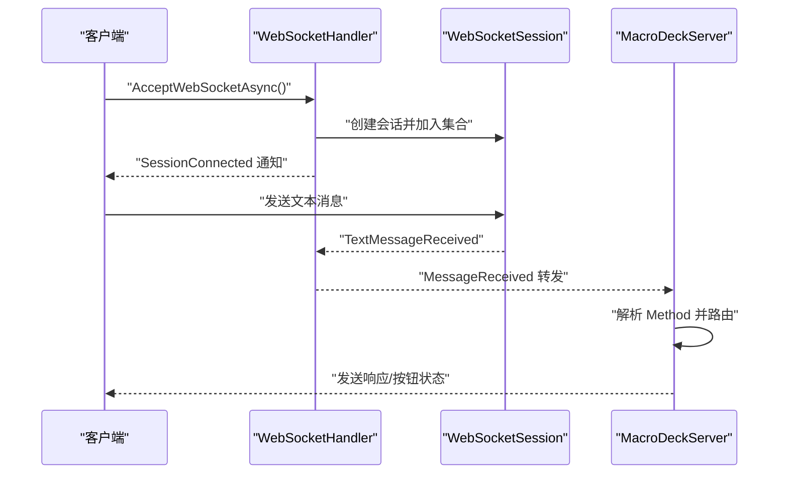
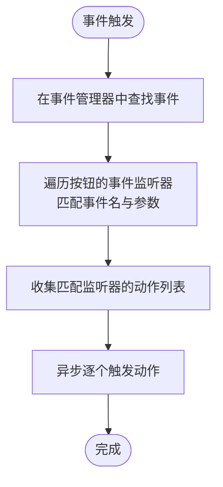
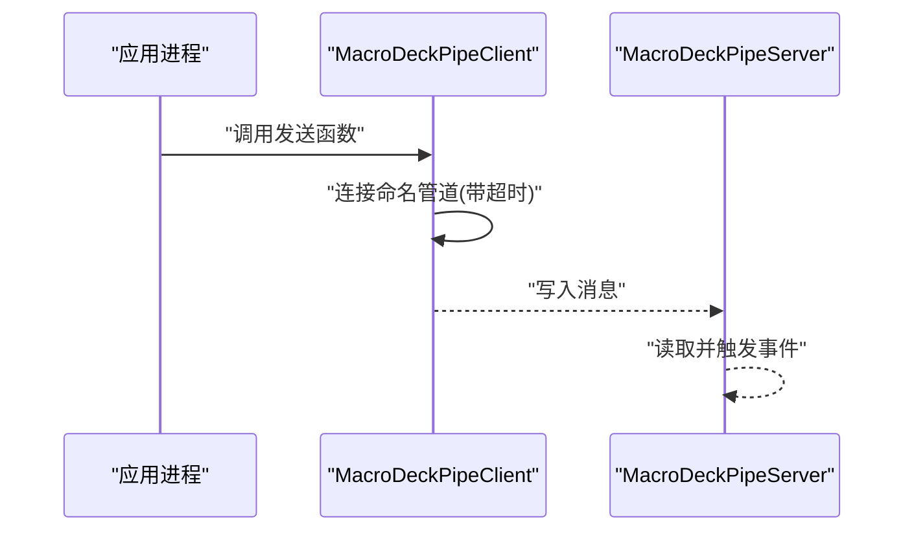
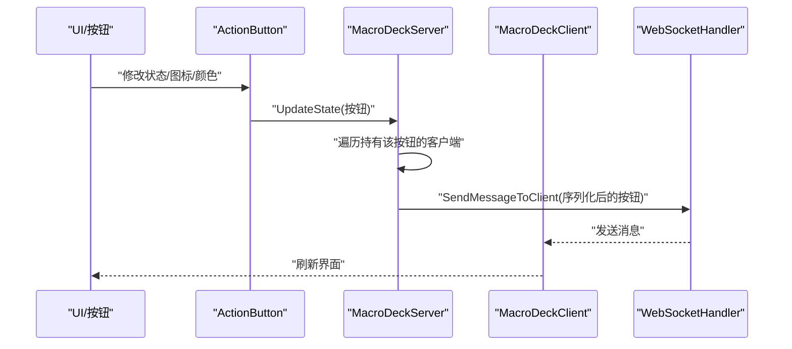
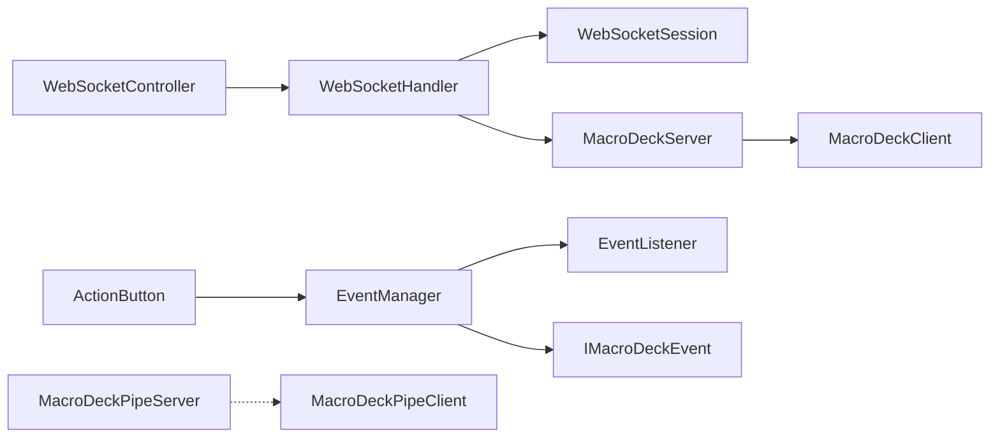

# 组件交互机制

<cite>
**本文引用的文件**
- [WebSocketController.cs](file://src/MacroDeck/Controllers/WebSocketController.cs)
- [WebSocketHandler.cs](file://src/MacroDeck/WebSocketHandler.cs)
- [WebSocketSession.cs](file://src/MacroDeck/DataTypes/WebSocketSession.cs)
- [MacroDeckServer.cs](file://src/MacroDeck/Server/MacroDeckServer.cs)
- [MacroDeckClient.cs](file://src/MacroDeck/Server/MacroDeckClient.cs)
- [JsonMethod.cs](file://src/MacroDeck/JSON/JsonMethod.cs)
- [ButtonPressType.cs](file://src/MacroDeck/Enums/ButtonPressType.cs)
- [EventManager.cs](file://src/MacroDeck/Events/EventManager.cs)
- [EventListener.cs](file://src/MacroDeck/Events/EventListener.cs)
- [MacroDeckEvent.cs](file://src/MacroDeck/Events/MacroDeckEvent.cs)
- [ActionButton.cs](file://src/MacroDeck/ActionButton/ActionButton.cs)
- [MacroDeckPipeServer.cs](file://src/MacroDeck/Pipe/MacroDeckPipeServer.cs)
- [MacroDeckPipeClient.cs](file://src/MacroDeck/Pipe/MacroDeckPipeClient.cs)
</cite>

## 目录
1. [引言](#引言)
2. [项目结构](#项目结构)
3. [核心组件](#核心组件)
4. [架构总览](#架构总览)
5. [详细组件分析](#详细组件分析)
6. [依赖关系分析](#依赖关系分析)
7. [性能考量](#性能考量)
8. [故障排查指南](#故障排查指南)
9. [结论](#结论)
10. [附录](#附录)

## 引言
本文件系统性梳理 Macro-Deck 的组件交互机制，重点覆盖以下方面：
- 通信协议与消息传递：WebSocket、进程间通信（IPC，命名管道）、事件驱动模型
- 事件系统：发布订阅、参数匹配、异步执行
- 组件解耦与依赖注入：通过接口与事件实现松耦合
- 数据流与状态同步：按钮状态变更到客户端的推送链路
- 并发与线程安全：异步任务、锁与事件总线的协作
- 错误处理与异常传播：日志记录、异常吞吐与连接清理

## 项目结构
围绕组件交互的关键目录与文件：
- 控制器与网络层：WebSocket 控制器、WebSocket 处理器、会话封装
- 服务器与客户端：服务端入口、客户端抽象、设备消息协议
- 事件系统：事件注册中心、事件监听器、事件参数与触发
- 按钮与动作：按钮状态、动作集合、热键绑定
- 进程间通信：命名管道服务端与客户端
- 消息协议：JSON 方法枚举与按键类型

图表来源
- [WebSocketController.cs:1-21](file://src/MacroDeck/Controllers/WebSocketController.cs#L1-L21)
- [WebSocketHandler.cs:1-92](file://src/MacroDeck/WebSocketHandler.cs#L1-L92)
- [WebSocketSession.cs:1-119](file://src/MacroDeck/DataTypes/WebSocketSession.cs#L1-L119)
- [MacroDeckServer.cs:1-376](file://src/MacroDeck/Server/MacroDeckServer.cs#L1-L376)
- [MacroDeckClient.cs:1-53](file://src/MacroDeck/Server/MacroDeckClient.cs#L1-L53)
- [EventManager.cs:1-43](file://src/MacroDeck/Events/EventManager.cs#L1-L43)
- [EventListener.cs:1-12](file://src/MacroDeck/Events/EventListener.cs#L1-L12)
- [MacroDeckEvent.cs:1-15](file://src/MacroDeck/Events/MacroDeckEvent.cs#L1-L15)
- [ActionButton.cs:1-198](file://src/MacroDeck/ActionButton/ActionButton.cs#L1-L198)
- [MacroDeckPipeServer.cs:1-46](file://src/MacroDeck/Pipe/MacroDeckPipeServer.cs#L1-L46)
- [MacroDeckPipeClient.cs:1-33](file://src/MacroDeck/Pipe/MacroDeckPipeClient.cs#L1-L33)

章节来源
- [WebSocketController.cs:1-21](file://src/MacroDeck/Controllers/WebSocketController.cs#L1-L21)
- [WebSocketHandler.cs:1-92](file://src/MacroDeck/WebSocketHandler.cs#L1-L92)
- [WebSocketSession.cs:1-119](file://src/MacroDeck/DataTypes/WebSocketSession.cs#L1-L119)
- [MacroDeckServer.cs:1-376](file://src/MacroDeck/Server/MacroDeckServer.cs#L1-L376)
- [MacroDeckClient.cs:1-53](file://src/MacroDeck/Server/MacroDeckClient.cs#L1-L53)
- [EventManager.cs:1-43](file://src/MacroDeck/Events/EventManager.cs#L1-L43)
- [EventListener.cs:1-12](file://src/MacroDeck/Events/EventListener.cs#L1-L12)
- [MacroDeckEvent.cs:1-15](file://src/MacroDeck/Events/MacroDeckEvent.cs#L1-L15)
- [ActionButton.cs:1-198](file://src/MacroDeck/ActionButton/ActionButton.cs#L1-L198)
- [MacroDeckPipeServer.cs:1-46](file://src/MacroDeck/Pipe/MacroDeckPipeServer.cs#L1-L46)
- [MacroDeckPipeClient.cs:1-33](file://src/MacroDeck/Pipe/MacroDeckPipeClient.cs#L1-L33)

## 核心组件
- WebSocket 控制器与处理器
  - 控制器负责接受 HTTP 请求并升级为 WebSocket；处理器负责会话管理、消息广播与断开清理。
- 宏命令服务器
  - 解析客户端消息、路由到具体业务逻辑（连接握手、按键事件、按钮列表请求），并维护客户端集合。
- 事件系统
  - 注册事件、按名称与参数筛选监听器、异步触发动作。
- 按钮与动作
  - 按钮状态变化触发服务器更新并推送到所有相关客户端。
- 命名管道 IPC
  - 服务端持续监听命名管道消息；客户端发送“显示主窗口”等指令。

章节来源
- [WebSocketController.cs:1-21](file://src/MacroDeck/Controllers/WebSocketController.cs#L1-L21)
- [WebSocketHandler.cs:1-92](file://src/MacroDeck/WebSocketHandler.cs#L1-L92)
- [MacroDeckServer.cs:1-376](file://src/MacroDeck/Server/MacroDeckServer.cs#L1-L376)
- [EventManager.cs:1-43](file://src/MacroDeck/Events/EventManager.cs#L1-L43)
- [ActionButton.cs:1-198](file://src/MacroDeck/ActionButton/ActionButton.cs#L1-L198)
- [MacroDeckPipeServer.cs:1-46](file://src/MacroDeck/Pipe/MacroDeckPipeServer.cs#L1-L46)
- [MacroDeckPipeClient.cs:1-33](file://src/MacroDeck/Pipe/MacroDeckPipeClient.cs#L1-L33)

## 架构总览
整体交互采用“控制器-处理器-服务器-客户端-设备消息”的分层设计，事件系统贯穿按钮与插件动作，IPC 提供跨进程控制通道。

图表来源
- [WebSocketController.cs:1-21](file://src/MacroDeck/Controllers/WebSocketController.cs#L1-L21)
- [WebSocketHandler.cs:1-92](file://src/MacroDeck/WebSocketHandler.cs#L1-L92)
- [WebSocketSession.cs:1-119](file://src/MacroDeck/DataTypes/WebSocketSession.cs#L1-L119)
- [MacroDeckServer.cs:1-376](file://src/MacroDeck/Server/MacroDeckServer.cs#L1-L376)
- [MacroDeckClient.cs:1-53](file://src/MacroDeck/Server/MacroDeckClient.cs#L1-L53)

## 详细组件分析

### WebSocket 通信机制
- 入口控制器
  - 将 HTTP 请求升级为 WebSocket，并交由处理器处理。
- 会话管理
  - 处理器维护会话列表，统一广播消息、按 ID 发送、关闭会话。
  - 会话内部循环接收文本消息，异常时触发错误事件并最终断开。
- 服务器消息路由
  - 服务器根据消息中的方法字段进行分支处理，支持连接握手、按键事件、按钮列表请求等。
  - 按键事件解析行列坐标定位按钮，按不同按键类型选择对应动作集合并异步触发。

图表来源
- [WebSocketHandler.cs:1-92](file://src/MacroDeck/WebSocketHandler.cs#L1-L92)
- [WebSocketSession.cs:1-119](file://src/MacroDeck/DataTypes/WebSocketSession.cs#L1-L119)
- [MacroDeckServer.cs:1-376](file://src/MacroDeck/Server/MacroDeckServer.cs#L1-L376)

章节来源
- [WebSocketController.cs:1-21](file://src/MacroDeck/Controllers/WebSocketController.cs#L1-L21)
- [WebSocketHandler.cs:1-92](file://src/MacroDeck/WebSocketHandler.cs#L1-L92)
- [WebSocketSession.cs:1-119](file://src/MacroDeck/DataTypes/WebSocketSession.cs#L1-L119)
- [MacroDeckServer.cs:1-376](file://src/MacroDeck/Server/MacroDeckServer.cs#L1-L376)
- [JsonMethod.cs:1-20](file://src/MacroDeck/JSON/JsonMethod.cs#L1-L20)
- [ButtonPressType.cs:1-10](file://src/MacroDeck/Enums/ButtonPressType.cs#L1-L10)

### 事件驱动通信与消息传递
- 事件注册与发现
  - 事件管理器集中注册事件，提供按名称查找事件的能力。
- 事件监听与触发
  - 每个按钮维护事件监听器列表，监听器包含要监听的事件名与可选参数。
  - 当事件触发时，按事件名与参数进行匹配，收集所有匹配的动作并异步触发。
- 动作执行
  - 动作为插件动作，触发时传入客户端标识与按钮上下文。

图表来源
- [EventManager.cs:1-43](file://src/MacroDeck/Events/EventManager.cs#L1-L43)
- [EventListener.cs:1-12](file://src/MacroDeck/Events/EventListener.cs#L1-L12)
- [MacroDeckEvent.cs:1-15](file://src/MacroDeck/Events/MacroDeckEvent.cs#L1-L15)
- [ActionButton.cs:1-198](file://src/MacroDeck/ActionButton/ActionButton.cs#L1-L198)

章节来源
- [EventManager.cs:1-43](file://src/MacroDeck/Events/EventManager.cs#L1-L43)
- [EventListener.cs:1-12](file://src/MacroDeck/Events/EventListener.cs#L1-L12)
- [MacroDeckEvent.cs:1-15](file://src/MacroDeck/Events/MacroDeckEvent.cs#L1-L15)
- [ActionButton.cs:1-198](file://src/MacroDeck/ActionButton/ActionButton.cs#L1-L198)

### 进程间通信（IPC）
- 服务端
  - 初始化后进入循环等待命名管道连接，读取一行消息并触发事件回调。
- 客户端
  - 以短超时尝试连接命名管道，发送 ASCII 字节消息（如“show”）。

图表来源
- [MacroDeckPipeServer.cs:1-46](file://src/MacroDeck/Pipe/MacroDeckPipeServer.cs#L1-L46)
- [MacroDeckPipeClient.cs:1-33](file://src/MacroDeck/Pipe/MacroDeckPipeClient.cs#L1-L33)

章节来源
- [MacroDeckPipeServer.cs:1-46](file://src/MacroDeck/Pipe/MacroDeckPipeServer.cs#L1-L46)
- [MacroDeckPipeClient.cs:1-33](file://src/MacroDeck/Pipe/MacroDeckPipeClient.cs#L1-L33)

### 数据流向与状态同步
- 按钮状态变更
  - 按钮属性变化时，服务器更新状态并将变更推送给所有持有该按钮的客户端。
- 客户端拉取与推送
  - 客户端可请求按钮列表；服务器在配置切换、按钮状态变化时主动推送。

图表来源
- [ActionButton.cs:1-198](file://src/MacroDeck/ActionButton/ActionButton.cs#L1-L198)
- [MacroDeckServer.cs:1-376](file://src/MacroDeck/Server/MacroDeckServer.cs#L1-L376)
- [WebSocketHandler.cs:1-92](file://src/MacroDeck/WebSocketHandler.cs#L1-L92)

章节来源
- [ActionButton.cs:1-198](file://src/MacroDeck/ActionButton/ActionButton.cs#L1-L198)
- [MacroDeckServer.cs:1-376](file://src/MacroDeck/Server/MacroDeckServer.cs#L1-L376)
- [WebSocketHandler.cs:1-92](file://src/MacroDeck/WebSocketHandler.cs#L1-L92)

### 组件解耦与依赖注入
- 接口与事件
  - 事件接口定义事件名与事件参数，事件管理器通过事件订阅实现模块解耦。
- 依赖注入
  - 通过构造函数注入（例如客户端构造时注入设备消息实现）与静态工具类（事件管理器、WebSocket 处理器）实现运行时依赖装配。
- 松耦合示例
  - 按钮不直接依赖具体动作实现，仅通过事件与动作集合进行交互。

章节来源
- [MacroDeckClient.cs:1-53](file://src/MacroDeck/Server/MacroDeckClient.cs#L1-L53)
- [MacroDeckEvent.cs:1-15](file://src/MacroDeck/Events/MacroDeckEvent.cs#L1-L15)
- [EventManager.cs:1-43](file://src/MacroDeck/Events/EventManager.cs#L1-L43)

### 并发处理与线程安全
- 异步任务
  - 事件触发与动作执行均使用异步任务启动，避免阻塞主线程。
- 会话集合保护
  - 会话列表的增删在关键路径加锁，防止并发访问导致的异常。
- 广播与发送
  - 广播消息时使用并行任务等待全部完成，确保消息一致性。

章节来源
- [WebSocketHandler.cs:1-92](file://src/MacroDeck/WebSocketHandler.cs#L1-L92)
- [EventManager.cs:1-43](file://src/MacroDeck/Events/EventManager.cs#L1-L43)
- [MacroDeckServer.cs:1-376](file://src/MacroDeck/Server/MacroDeckServer.cs#L1-L376)

### 错误处理与异常传播
- 会话接收异常
  - 会话在接收消息过程中捕获异常并触发错误事件，随后关闭连接并发出断开事件。
- 服务器消息解析
  - 对未知方法或格式错误的消息进行忽略与记录，避免崩溃。
- 连接拒绝与清理
  - 在握手阶段若校验失败则关闭连接；断开时从会话集合移除并释放资源。

章节来源
- [WebSocketSession.cs:1-119](file://src/MacroDeck/DataTypes/WebSocketSession.cs#L1-L119)
- [MacroDeckServer.cs:1-376](file://src/MacroDeck/Server/MacroDeckServer.cs#L1-L376)
- [WebSocketHandler.cs:1-92](file://src/MacroDeck/WebSocketHandler.cs#L1-L92)

## 依赖关系分析
- 控制器依赖处理器；处理器依赖会话；服务器依赖处理器与客户端；事件管理器依赖事件接口与监听器；按钮依赖事件管理器与动作集合；IPC 两端通过命名管道连接。

图表来源
- [WebSocketController.cs:1-21](file://src/MacroDeck/Controllers/WebSocketController.cs#L1-L21)
- [WebSocketHandler.cs:1-92](file://src/MacroDeck/WebSocketHandler.cs#L1-L92)
- [WebSocketSession.cs:1-119](file://src/MacroDeck/DataTypes/WebSocketSession.cs#L1-L119)
- [MacroDeckServer.cs:1-376](file://src/MacroDeck/Server/MacroDeckServer.cs#L1-L376)
- [MacroDeckClient.cs:1-53](file://src/MacroDeck/Server/MacroDeckClient.cs#L1-L53)
- [EventManager.cs:1-43](file://src/MacroDeck/Events/EventManager.cs#L1-L43)
- [EventListener.cs:1-12](file://src/MacroDeck/Events/EventListener.cs#L1-L12)
- [MacroDeckEvent.cs:1-15](file://src/MacroDeck/Events/MacroDeckEvent.cs#L1-L15)
- [ActionButton.cs:1-198](file://src/MacroDeck/ActionButton/ActionButton.cs#L1-L198)
- [MacroDeckPipeServer.cs:1-46](file://src/MacroDeck/Pipe/MacroDeckPipeServer.cs#L1-L46)
- [MacroDeckPipeClient.cs:1-33](file://src/MacroDeck/Pipe/MacroDeckPipeClient.cs#L1-L33)

## 性能考量
- 异步 I/O 与并行广播
  - 使用异步接收与发送，结合并行任务等待提升吞吐。
- 事件触发的异步化
  - 事件触发与动作执行均异步化，避免阻塞事件总线。
- 状态推送的精准化
  - 仅向持有目标按钮的客户端推送，减少无效广播。
- 连接数限制与快速握手
  - 服务器在连接阶段进行基本校验与限流，降低无效连接带来的压力。

## 故障排查指南
- WebSocket 无法建立
  - 检查控制器是否正确识别 WebSocket 请求；确认处理器已成功接受并创建会话。
- 消息未到达客户端
  - 核对消息方法枚举与 JSON 结构；检查服务器消息路由分支与客户端实例是否存在。
- 事件未触发
  - 确认事件已注册且名称一致；核对监听器参数大小写与匹配逻辑。
- 按钮状态不更新
  - 检查按钮状态变更是否触发服务器更新；确认持有该按钮的客户端集合存在且会话有效。
- IPC 无响应
  - 检查命名管道名称与权限；确认服务端循环是否正常等待连接。

章节来源
- [WebSocketController.cs:1-21](file://src/MacroDeck/Controllers/WebSocketController.cs#L1-L21)
- [WebSocketHandler.cs:1-92](file://src/MacroDeck/WebSocketHandler.cs#L1-L92)
- [WebSocketSession.cs:1-119](file://src/MacroDeck/DataTypes/WebSocketSession.cs#L1-L119)
- [MacroDeckServer.cs:1-376](file://src/MacroDeck/Server/MacroDeckServer.cs#L1-L376)
- [EventManager.cs:1-43](file://src/MacroDeck/Events/EventManager.cs#L1-L43)
- [MacroDeckPipeServer.cs:1-46](file://src/MacroDeck/Pipe/MacroDeckPipeServer.cs#L1-L46)

## 结论
Macro-Deck 的组件交互以 WebSocket 为主通道，辅以事件驱动与命名管道 IPC，形成清晰的分层与解耦架构。通过异步任务与事件总线实现高并发下的稳定交互，配合严格的错误处理与连接生命周期管理，保障了跨平台客户端与插件生态的顺畅协作。

## 附录
- 关键消息方法
  - CONNECTED、BUTTON_PRESS、BUTTON_RELEASE、BUTTON_LONG_PRESS、BUTTON_LONG_PRESS_RELEASE、GET_BUTTONS 等。
- 按键类型
  - SHORT、SHORT_RELEASE、LONG、LONG_RELEASE。

章节来源
- [JsonMethod.cs:1-20](file://src/MacroDeck/JSON/JsonMethod.cs#L1-L20)
- [ButtonPressType.cs:1-10](file://src/MacroDeck/Enums/ButtonPressType.cs#L1-L10)